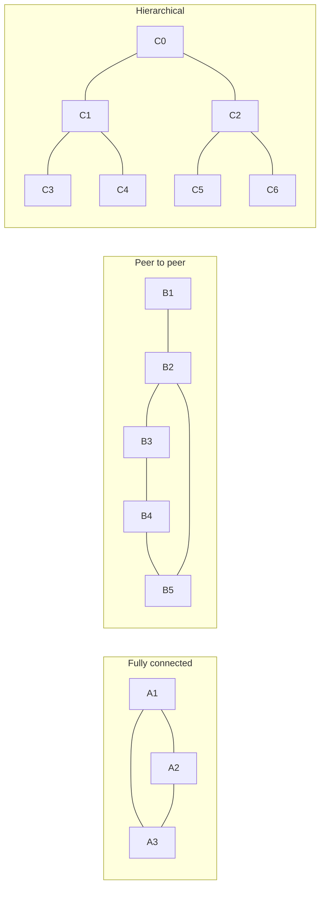
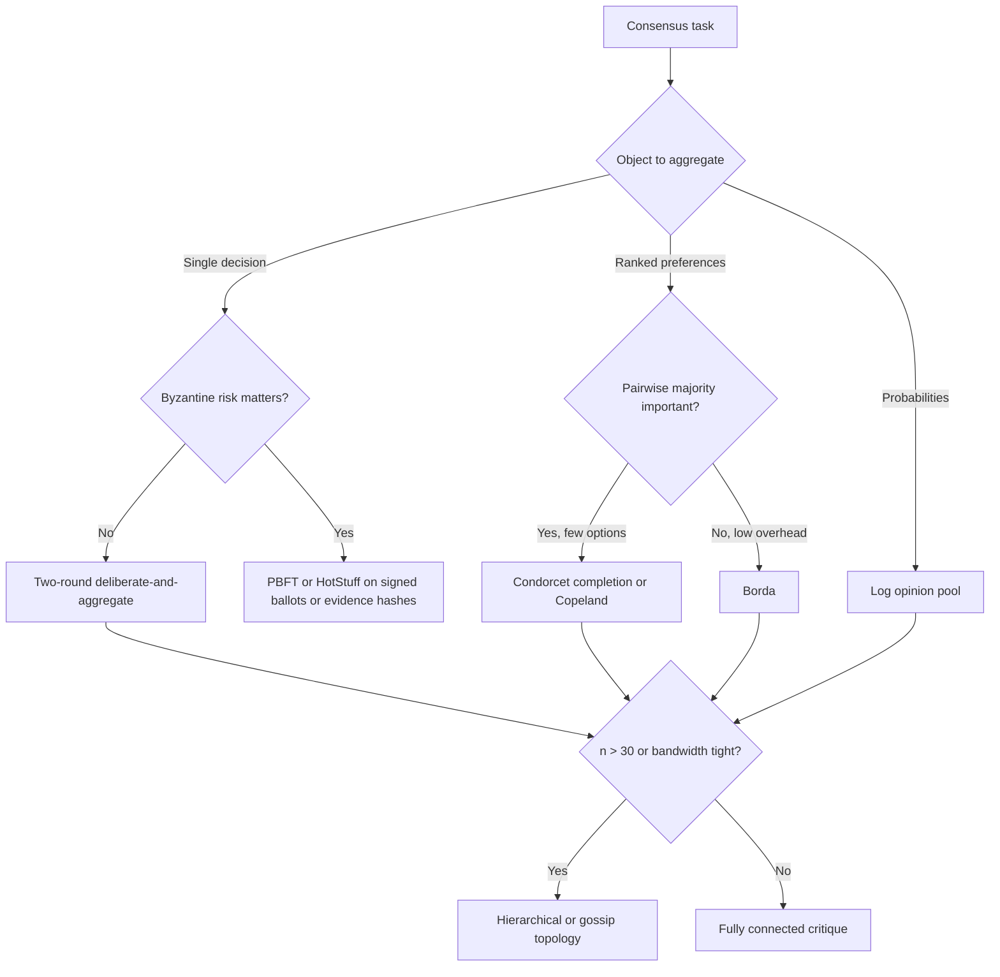

# Efficient Consensus Protocols for Deliberating AI Agents

## Executive summary

The central mistake is to look for one universally “best” consensus algorithm. There is no such algorithm. Exact distributed-systems consensus and epistemic deliberation are different problems. Paxos, Raft, PBFT, and HotStuff are designed to make replicas commit the same state transition under failures; DeGroot, voting rules, opinion pools, and debate are designed to aggregate differing beliefs, preferences, or arguments. If you use the first class when you really need the second, you usually pay a large communication penalty for the wrong guarantee. citeturn1search7turn9search0turn10search3turn1search0turn29search20turn25search1

For **small honest groups** of AI agents, the best efficiency frontier is usually a **two-round protocol**: independent first-pass answers, one critique/revision round, then **weighted aggregation**. Use **weighted majority** for a single categorical decision, **Borda or Condorcet-style aggregation** for ranked outputs, and a **logarithmic opinion pool** when agents can emit calibrated probabilities. This gets most of the benefit of deliberation without the quadratic cost explosion of many debate rounds. **Confidence: high.** citeturn40search1turn32search15turn14search1turn14search2turn29search20turn12search1

If **Byzantine or arbitrary adversarial behavior** matters, do not substitute ordinary voting or debate for a BFT commit protocol. Classical impossibility results show why fully asynchronous deterministic consensus is hard, and practical Byzantine protocols such as **PBFT** and **HotStuff** are the right tools when you need safety under arbitrary faults. **PBFT** is fine for small committees; **HotStuff** is usually the better scaling choice because it preserves BFT safety while reducing communication overhead. **Confidence: high.** citeturn7search1turn7search3turn10search3turn1search0

If **bandwidth is limited** or you need to scale from **dozens to hundreds or thousands** of agents, move away from fully connected debate. Use **hierarchical aggregation** when some coordination is acceptable, or **gossip / average-consensus** overlays when decentralization matters more than speed. If the consensus object is a **model parameter vector**, not a one-shot decision, then **FedAvg** and hierarchical federated learning are appropriate; otherwise they are usually the wrong abstraction. **Confidence: high.** citeturn26search17turn6search0turn24search0turn38search2

If **explainability** is a first-class requirement, the best design is a **structured argument graph** or **debate with checkable claims**, not a bare vote. Dung-style argumentation gives an explicit attack/support structure; debate and prover-verifier style methods make it easier for a judge or downstream verifier to audit the path to consensus. **Confidence: moderate.** citeturn40search12turn17search1turn40search1turn17search24

## Problem framing

Several dimensions in your request are explicitly **unspecified**: agent compute and memory budgets, model family, topology, objective, and latency/bandwidth. The literature implies a simple default rule: choose the protocol **by the object being aggregated** and **by the fault model**, not by the model brand. If agents output a discrete answer, use voting or weighted voting; if they output a ranking, use rank aggregation; if they output calibrated probabilities, use opinion pooling; if they must commit a shared state under faults, use a replicated-log consensus protocol. Honest-by-default settings should optimize sample efficiency and communication, not Byzantine safety overhead. citeturn29search20turn14search5turn1search7turn9search0turn10search3turn1search0

A second distinction matters just as much: **one-shot deliberation** versus **repeated task streams**. For one-shot tasks, historical skill estimates are weak and direct confidence calibration is often all you have. For repeated tasks with ground truth feedback, **weighted-majority** style updates and **Dawid–Skene**-style competence estimation become strong choices because they can learn which agents are reliable and on which label classes. **DAgger** belongs here too, but as a **meta-protocol**: it is valuable for distilling expensive, high-quality consensus traces into a cheaper policy or arbiter, not as the runtime consensus algorithm itself. citeturn32search15turn13search3turn13search6turn18search2

The default topology should also depend on scale. For **3–10 agents**, fully connected cross-critique is acceptable because the information benefit usually outweighs the \(O(n^2)\) message pattern. For **10–1000 agents**, sparse peer-to-peer overlays or hierarchical trees become more attractive because average-consensus and gossip performance is driven by graph connectivity and mixing, while hierarchical federated schemes explicitly trade some centralization for lower fan-out and lower aggregate communication. citeturn26search17turn6search0turn24search0



Fully connected topologies maximize information exchange but scale poorly; peer-to-peer overlays cut communication at the cost of slower convergence; hierarchical topologies are usually the best compromise once agent counts grow beyond the small-group regime. citeturn26search17turn6search0turn24search0

One final clarification: **Tree of Thoughts** and **Graph of Thoughts** are useful ways to structure search and internal reasoning, but they are not consensus rules by themselves. They help organize deliberation states; they still need a downstream voting, judging, or pooling rule to decide among branches or graph nodes. citeturn16search4turn34search0

## Comparative trade-offs

The table below separates methods by what they are actually good for. The most important columns are the ones users usually conflate: **round complexity**, **communication cost**, **fault assumptions**, and **explainability**.

| Method | Best use | Typical rounds / speed | Communication cost | Robustness | Key assumptions | Explainability | Representative sources |
|---|---|---:|---:|---|---|---|---|
| Simple majority vote | Single binary or categorical decision | 1 collection round; very fast | \(O(n)\) to a coordinator | Good against independent noise; weak against correlated error or strategic agents | Honest agents; no ranking/probabilities needed | Low | citeturn15search0turn14search5 |
| Weighted majority / multiplicative weights | Repeated tasks with feedback | 1 round per task; very fast online update | \(O(n)\) per task | More robust than unweighted voting when competence differs and feedback exists | Historical labels or outcomes available | Low to medium | citeturn32search15 |
| Borda count | Ranked preferences with low overhead | 1 round; fast | \(O(nm)\) for \(m\) options | Robust to dispersed preferences, but manipulable and not Condorcet-consistent | Ranked ballots available | Medium | citeturn14search2turn39search1 |
| Condorcet / Copeland-style aggregation | Ranked preferences where pairwise majority matters | 1 collection round plus pairwise tally; moderate | \(O(nm^2)\) | Strong pairwise-majority semantics, but cycles can leave no Condorcet winner | Ranked ballots available; small/moderate option set preferred | Medium | citeturn14search1turn14search5 |
| Logarithmic opinion pool | Probabilistic belief aggregation | 1 round; fast | \(O(nk)\) for \(k\) outcomes | Good when probabilities are calibrated; brittle if any agent assigns zero probability | Comparable probability distributions and reliability weights | Medium | citeturn29search20turn12search1 |
| DeGroot iterative averaging | Repeated social-learning style averaging | Iterative; asymptotic convergence | \(O(m)\) per round on graph with \(m\) edges | Converges under standard connectivity conditions, but weak against strategic or poisoned agents | Weighted communication graph; iterative exchange | Low | citeturn25search1turn6search0 |
| Randomized gossip / average consensus | Large sparse decentralized averaging | Iterative; slower than centralized collection | Local pairwise exchange per step; good scalability | Tolerates sparse networks; convergence rate depends on mixing / spectral properties | Connected overlay graph | Low | citeturn26search17turn26search0 |
| Paxos / Multi-Paxos | Crash-fault replicated state / exact commit | Low latency after stable leadership; practical system consensus | Quorum-based; low to moderate | Crash-fault tolerant, not Byzantine | Majority of acceptors live; replicated log formulation | Low | citeturn1search7turn9search0 |
| Raft | Crash-fault replicated state with simpler operational model | Low latency after leader election; practical | Quorum-based; low to moderate | Crash-fault tolerant, not Byzantine | Majority live; leader-based log replication | Medium as a systems protocol, low as deliberation logic | citeturn9search0turn9search8 |
| PBFT | Exact commit with Byzantine faults in small committees | Common-case multi-phase; slower than crash-fault protocols | Quadratic common-case communication | Tolerates arbitrary faults up to \(f < n/3\) | Authenticated replicas; committee size \(3f+1\) | Low | citeturn10search3turn7search3 |
| HotStuff | Larger BFT committees / blockchain-style finality | Multi-phase but better scaling than PBFT | Linear communication with threshold-signature style design | Byzantine tolerance up to \(f < n/3\) | Partial synchrony; authenticated replicas | Low | citeturn1search0 |
| Federated Averaging | Parameter consensus for distributed training | Iterative; communication-efficient over epochs | High-dimensional model updates, but fewer global rounds | Robust to non-IID data in training; not a semantic deliberation rule | Shared model architecture and parameter space | Very low | citeturn38search2turn24search0 |
| Structured debate / argument graph | Honesty-preserving or reasoning-improving deliberation | Usually 2+ rounds; medium latency | Potentially \(O(n^2R)\) in fully connected debate, lower in sparse/hierarchical variants | Good against ordinary reasoning errors; no formal BFT guarantee | Agents can produce critiques, evidence, or attack/support relations | High | citeturn17search1turn40search1turn40search12turn17search24 |
| DAgger-style distillation | Offline amortization of expensive consensus | Training-time iterative procedure; not a runtime consensus rule | Training data collection plus supervision cost | Good for reducing deployment cost after training | Expert/judge feedback available during data aggregation | Medium | citeturn18search2 |

A second table is more operationally useful when the topology is still open.

| Topology | Best scale | Per-round cost | Main strength | Main weakness | Default use | Sources |
|---|---|---:|---|---|---|---|
| Fully connected cross-critique | 3–10 agents | \(O(n^2)\) messages or token-sharing | Maximum mutual information; best for one rebuttal round | Cost explodes quickly | Small honest teams needing best quality | citeturn40search1turn6search0 |
| Sparse peer-to-peer / gossip | 10–1000 agents | \(O(m)\) over edges | Scales and decentralizes well | Slower convergence; weaker audit trail | Large open networks or no trusted coordinator | citeturn26search17turn6search0 |
| Hierarchical clusters | 10–1000 agents | Roughly linear per level; depth grows with hierarchy | Strong bandwidth savings; natural modularity | Possible bottlenecks at cluster heads | Enterprises, edge deployments, bandwidth-limited settings | citeturn24search0turn38search2 |

The coarse conclusion is blunt. If the agents are honest and the task is semantic rather than state-machine replication, **Paxos/Raft/PBFT/HotStuff are usually not the first thing to reach for**. Use them only when you need exact commit safety. For ordinary AI deliberation, **weighted one- or two-round aggregation** dominates for small groups, and **hierarchical or gossip-based aggregation** dominates for large groups. citeturn1search7turn9search0turn10search3turn1search0turn40search1turn32search15turn26search17turn24search0

## Recommended protocols

The fastest way to choose a protocol is to route first on the consensus object and adversary model.



That flow is a direct consequence of the literature: voting rules are objective-native for discrete and ranked outputs, opinion pools are objective-native for probabilities, and BFT protocols are fault-native for arbitrary adversaries. citeturn14search1turn14search2turn29search20turn10search3turn1search0

**Small honest agents**

**Recommendation. Confidence: high.** Use a **two-round deliberate-then-aggregate protocol** for 3–10 honest agents. Round one is independent solving. Round two is one critique/revision pass. Final aggregation is **weighted majority** for single answers, **Borda / Condorcet** for rankings, or a **log pool** for calibrated probabilities. Calibrate weights from recent accuracy, expected log loss, or a Dawid–Skene confusion estimate if past labeled tasks exist. This combines the demonstrated benefits of multi-agent debate with the efficiency of one-shot weighted aggregation. citeturn40search1turn32search15turn13search3turn14search1turn14search2turn29search20turn12search1

Implementation outline:
1. Normalize the task into a schema: answer, confidence/probability, evidence bundle, and optional critique target.
2. Collect independent first-pass outputs.
3. Run one rebuttal round. In small groups, all-to-all is acceptable.
4. Recompute weights from historical calibration plus current confidence.
5. Aggregate:
   - categorical: weighted vote;
   - ranking: Condorcet-completion if the option set is small and pairwise coherence matters, otherwise Borda;
   - probabilities: log pool with floor clipping to avoid zero-probability collapse.
6. Store the whole trace for later calibration or DAgger-style distillation.

```python
def deliberate_then_aggregate(task, agents, history, mode):
    records = []
    for a in agents:
        ans, conf, evidence = a.solve_independently(task)
        weight = skill_weight(a, history) * calibration_adjustment(a, conf)
        records.append({"agent": a, "ans": ans, "conf": conf,
                        "evidence": evidence, "weight": weight})

    # one critique/revision round
    for r in records:
        peer_bundle = [x for x in records if x["agent"] != r["agent"]]
        ans2, conf2, evidence2 = r["agent"].revise(task, peer_bundle)
        r.update({"ans": ans2, "conf": conf2, "evidence": evidence2})

    if mode == "categorical":
        return argmax_weighted_vote(records)  # sum_i w_i * 1[ans_i = y]
    if mode == "ranking":
        return condorcet_or_borda(records)
    if mode == "probabilities":
        return geometric_pool(records, epsilon=1e-6)  # normalize prod_i p_i^w_i
```

**Presence of Byzantine agents**

**Recommendation. Confidence: high.** If arbitrary adversarial behavior matters, separate **semantic deliberation** from **finalization**. Let the reasoning layer produce a **canonical ballot object** or **hash of an evidence bundle**, then finalize that object with **PBFT** for small committees or **HotStuff** for larger ones. Do **not** try to make free-form natural-language exchanges themselves the replicated state machine. BFT consensus wants canonical, deterministic objects; semantic deliberation does not naturally satisfy that constraint. citeturn10search3turn1search0turn7search1turn7search3

Implementation outline:
1. Fix a deterministic schema for proposals: task ID, normalized answer, confidence, evidence references, verifier outputs, and cryptographic hash.
2. Require every agent to sign its proposal.
3. Run local verification before any commit vote.
4. Use PBFT if \(n\) is small and operational simplicity matters; use HotStuff if you care about better scaling and cleaner leader changes.
5. Commit only the canonical verdict object and its evidence hash, not the raw conversational trace.
6. Keep the natural-language debate off the critical safety path.

```python
def byzantine_semantic_consensus(task, committee, f):
    proposals = [a.propose_canonical(task) for a in committee]
    valid = [p for p in proposals if verify_schema(p) and verify_evidence(p)]

    leader_value = choose_candidate_hash(valid)  # deterministic tie-break
    qc_prepare = collect_quorum_votes(stage="prepare",
                                      value=leader_value,
                                      threshold=2*f + 1)
    qc_commit = collect_quorum_votes(stage="commit",
                                     value=leader_value,
                                     threshold=2*f + 1)

    if qc_prepare and qc_commit:
        finalize(leader_value)
        return fetch_canonical_object(leader_value)
    return None
```

**Limited bandwidth or large populations**

**Recommendation. Confidence: high for hierarchical aggregation; moderate for pure gossip on semantic tasks.** For 10–1000 agents, use **hierarchical aggregation** by default. Partition agents into clusters, run local two-round consensus inside each cluster, then aggregate only the cluster-level summaries at the next level. If there is no trusted coordinator, switch to **sparse gossip** over short summaries or probability vectors. Use **FedAvg** only when what you are aggregating is actually a shared parameter vector from local training. citeturn24search0turn26search17turn38search2

Implementation outline:
1. Choose cluster sizes of roughly 5–8 agents.
2. Constrain each local summary to answer, confidence, top-k evidence IDs, and verifier flags.
3. Aggregate locally, then send only summaries upward.
4. At the root, apply the same aggregator as in the small-group protocol.
5. If a root is undesirable, run periodic gossip on summary vectors until change falls below a threshold.

```python
def hierarchical_consensus(task, agents, cluster_size=6, mode="categorical"):
    clusters = partition(agents, cluster_size)
    cluster_outputs = []

    for cluster in clusters:
        local = deliberate_then_aggregate(task, cluster, history={}, mode=mode)
        cluster_outputs.append(compress_summary(local))

    # second-stage aggregation over summaries only
    return aggregate_summaries(cluster_outputs, mode=mode)
```

**Need for explainability**

**Recommendation. Confidence: moderate.** Use an **argument-graph protocol**. Each agent must provide explicit claims, supports, and attacks. Build an attack/support graph, compute the surviving set of claims under a Dung-style semantics, then vote or pool over the surviving endpoints. Add a prover-verifier or tool-checkable layer where possible. This is slower than plain voting but produces the best audit trail. citeturn40search12turn17search1turn17search24

Implementation outline:
1. Force every message into a structured template: claim, premise, citation, attack/support relation.
2. Build a directed graph over claims.
3. Remove claims that fail verification.
4. Compute a grounded or otherwise conservative accepted set.
5. Produce the final verdict from the accepted set only.

```python
def argument_graph_consensus(task, agents):
    claims = []
    for a in agents:
        claims.extend(a.emit_structured_arguments(task))  # claim, support, attack, evidence

    graph = build_argument_graph(claims)
    graph = remove_unverified_claims(graph)
    accepted = grounded_extension(graph)  # conservative accepted set
    return vote_over_accepted_claims(accepted)
```

The practical rule is simple. **Small honest team**: two rounds, weighted aggregation. **Malicious agents**: BFT finalization on canonical ballots. **Large or bandwidth-constrained team**: hierarchy first, gossip second. **Explainability-critical team**: argument graphs plus verification. citeturn40search1turn10search3turn1search0turn24search0turn26search17turn40search12

## Evaluation and benchmarking

A serious benchmark should separate **quality**, **efficiency**, **robustness**, and **explainability**. For quality, use accuracy for categorical answers, **Brier score** or **log loss** for pooled probabilities, and **Kendall’s \(\tau\)** or related rank-correlation metrics for ranked outputs. For efficiency, measure wall-clock latency, communication rounds, total tokens transmitted, verification time, and per-agent compute. For robustness, vary independent noise, correlated error, crash faults, and Byzantine injections separately; the Condorcet-style benefit of voting depends strongly on error independence, and the distributed-consensus guarantees of Paxos/Raft/BFT protocols depend strongly on the fault model. citeturn15search0turn32search15turn31search5turn7search1turn10search3turn1search0

For explainability, the right metrics are not just “did it answer correctly?” but also **how cheaply a human or verifier can check the answer**. HotpotQA provides supporting-fact supervision; FEVER requires evidence-backed support/refute decisions; StrategyQA and MuSR expose whether the protocol can preserve intermediate reasoning structure rather than merely guessing the final label. Prover-verifier style work suggests using **verification time**, **fraction of accepted claims that are tool-checkable**, and **evidence completeness** as first-class metrics. citeturn19search3turn19search11turn37search0turn37search4turn37search3turn37search2turn17search24

A compact benchmark suite should use the following workloads.

| Workload family | Good datasets | What they test | Sources |
|---|---|---|---|
| General multiple-choice reasoning | MMLU | Broad knowledge, varied discrete decision tasks | citeturn19search0 |
| Hard expert reasoning | GPQA | Very difficult science questions where oversight is hard | citeturn20search0turn20search5 |
| Multi-step math | GSM8K | Sequential reasoning with clear final truth | citeturn19search9turn19search5 |
| Multi-hop explainable QA | HotpotQA | Final answer plus supporting facts | citeturn19search11turn19search3 |
| Truthfulness / fact verification | TruthfulQA, FEVER | Hallucination resistance and evidence-grounded verdicts | citeturn19search2turn19search18turn37search0turn37search4 |
| Implicit or soft reasoning | StrategyQA, MuSR | Whether deliberation preserves reasoning structure under ambiguity | citeturn37search3turn37search11turn37search2turn37search6 |
| Ranked preference aggregation | PrefLib | Ranking and social-choice behavior | citeturn31search0turn31search3 |
| Synthetic signal aggregation | Bernoulli-signal simulations | Clean control of independence, correlation, competence, and Byzantine rates | citeturn15search0turn32search15 |

For experimental infrastructure, use **PettingZoo** or **RLlib** when you want multi-agent interaction and controlled action timing, **Mesa** when you want custom agent-based simulations or social-network experiments, **Flower** or **FedML** when you want federated/hierarchical model-aggregation experiments, and **ns-3** or **OMNeT++** when you need realistic network latency, packet loss, and bandwidth constraints. Those tools cover nearly the full space in your prompt: deliberation, network topologies, large-scale simulation, and federated aggregation. citeturn21search0turn21search16turn36search3turn36search13turn22search0turn22search7turn21search2turn36search8turn23search7turn23search22

The minimum experimental grid I would run is:
- **Sizes:** \(n \in \{3, 5, 10, 30, 100, 300\}\).
- **Topologies:** complete graph, sparse expander-like random graph, k-ary tree, and clustered hierarchy.
- **Objectives:** single decision, full ranking, pooled probabilities.
- **Adversaries:** none, crash-only, noisy honest, correlated-noise honest, Byzantine.
- **Budgets:** one round, two rounds, four rounds; strict token ceilings; strict latency ceilings.
- **Outputs:** accuracy / log loss / Kendall \(\tau\), tokens, rounds, finalization time, and human verification time. These ablations are what actually reveal where a protocol sits on the quality-cost frontier. citeturn26search17turn24search0turn40search1turn10search3turn1search0

## Primary sources

The list below is prioritized in the order I would read it if the goal were to design or justify a consensus layer for multi-agent AI deliberation.

| Priority | Source | Why it matters | Sources |
|---:|---|---|---|
| 1 | Lamport, Shostak, Pease, **The Byzantine Generals Problem** | The canonical fault model and the classical \(3f+1\) threshold intuition for unauthenticated Byzantine agreement | citeturn7search3 |
| 2 | Fischer, Lynch, Paterson, **Impossibility of Distributed Consensus with One Faulty Process** | The impossibility baseline; explains why liveness requires extra assumptions | citeturn7search1 |
| 3 | Lamport, **The Part-Time Parliament** | The foundational Paxos paper for exact quorum consensus | citeturn1search7 |
| 4 | Ongaro and Ousterhout, **Raft** | Practical leader-based crash-fault consensus with a cleaner systems model than Paxos | citeturn9search0turn9search8 |
| 5 | Castro and Liskov, **Practical Byzantine Fault Tolerance** | The classic practical BFT protocol for small committees | citeturn10search3turn10search1 |
| 6 | Yin et al., **HotStuff** | The modern scalable BFT reference point; linear communication and responsiveness | citeturn1search0 |
| 7 | DeGroot, **Reaching a Consensus** | The basic iterative opinion-averaging model | citeturn4view0turn25search1 |
| 8 | Olfati-Saber, Fax, Murray, **Consensus and Cooperation in Networked Multi-Agent Systems** | The standard survey for graph-based consensus dynamics | citeturn6search0 |
| 9 | Boyd et al., **Randomized Gossip Algorithms** | The main reference for scalable peer-to-peer averaging | citeturn26search17turn26search0 |
| 10 | Dietrich and List, **Probabilistic Opinion Pooling**; Heskes, **Selecting Weighting Factors in Logarithmic Opinion Pools** | The right starting point for probabilistic belief aggregation; especially useful for weighted geometric pooling | citeturn29search20turn12search1 |
| 11 | Brandt et al., **Introduction / Handbook of Computational Social Choice** plus classic Borda and Condorcet work | The cleanest foundation for ranked-preference aggregation | citeturn14search5turn14search1turn14search2 |
| 12 | Dung, **On the Acceptability of Arguments...** | The core formalism for argumentation-graph consensus and explainable attack/support semantics | citeturn40search12 |
| 13 | Irving et al., **AI Safety via Debate**; Du et al., **Multiagent Debate**; Kirchner et al., **Prover-Verifier Games Improve Legibility of LLM Outputs** | The primary modern sources for debate-style deliberation and checkable oversight | citeturn17search1turn40search1turn17search24 |
| 14 | McMahan et al., **Communication-Efficient Learning of Deep Networks from Decentralized Data** | The canonical FedAvg reference when consensus means parameter averaging | citeturn38search2 |
| 15 | Ross, Gordon, Bagnell, **DAgger** | The key source when you want to distill expensive consensus behavior into a cheaper policy | citeturn18search2 |

## Open questions and limitations

The literature is still fragmented. Distributed-systems papers optimize **safety and liveness under faults**; social-choice and opinion-pooling papers optimize **aggregation of differing judgments**; LLM debate papers optimize **reasoning quality and oversight**. There is still no standard benchmark that jointly measures final-answer quality, token cost, transparency, correlated hallucination resistance, and Byzantine robustness under a shared evaluation harness. That gap is real, and it matters. citeturn7search1turn10search3turn29search20turn40search1turn36search8

Three uncertainties are especially important. First, most optimistic “wisdom of crowds” results weaken sharply when model errors are **correlated** rather than independent. Second, self-reported LLM confidence is often poorly calibrated, so weighted voting only works well if calibration is measured and corrected. Third, BFT protocols assume canonical messages and deterministic validation, which is rarely true of free-form language deliberation; in practice, they should finalize **ballots, verdict objects, or evidence hashes**, not arbitrary text. citeturn15search0turn32search15turn12search1turn10search3turn1search0

So the correct default is not a single algorithm. It is a **layered architecture**: deliberation to improve answer quality, aggregation matched to the output type, and exact consensus only where the failure model actually requires it. citeturn40search1turn29search20turn10search3turn1search0