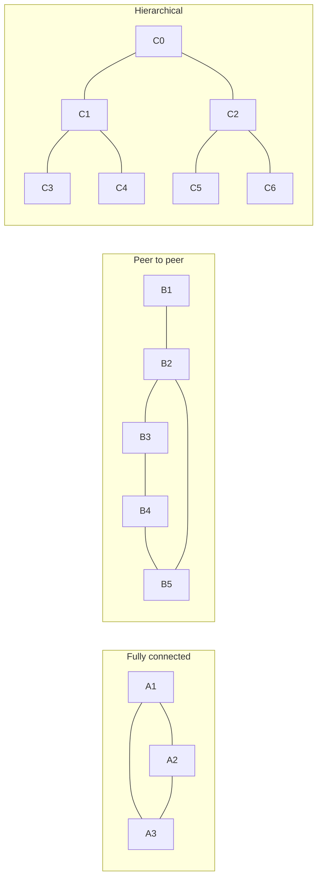
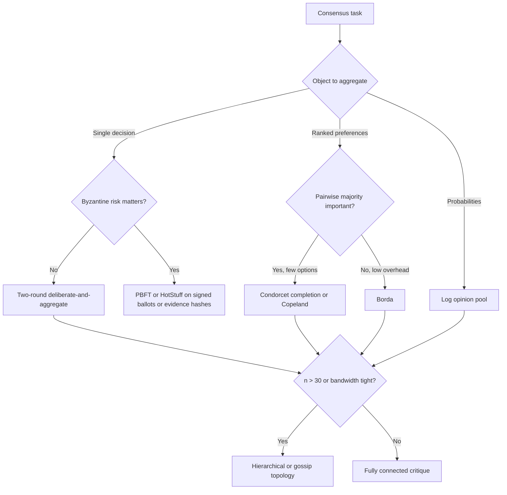

# Four-member model council task: repo-grounded rerun

## Why this rerun exists
The previous four-member council on this topic was useful at the protocol/research level but defective for implementation advice: it was not given a repo-grounded description of the actual current agents-council implementation. ChatGPT 5.5 correctly blocked ratification by requiring project-specific implementation claims to be marked as assumptions unless verified from repo evidence.

This rerun fixes that evidence defect by giving you a current-system brief first.

## Topic
Agents-council is a system-of-systems that deliberates until its members reach consensus on a topic. Propose concrete improvements to the current approach and implementation.

## Evidence base, authority, and labels
Use all three source blocks below:

1. Current implementation brief: /home/dstefanescu/other_systems/o4/agents-council/council_runs/current_system_brief_2026-06-08T12-20-15Z.md
2. Conceptual approach document: /home/dstefanescu/other_systems/o4/agents-council/consensus_approach.md
3. Deep-research report: /home/dstefanescu/other_systems/o4/agents-council/consensus_deep-research-report.md

Do not browse. Do not invent repository facts. Every implementation-specific claim in the final artifact must be labeled as one of:

- repo_fact: grounded in the current-system brief.
- source_claim: grounded in the conceptual approach or deep-research report but not verified in the repo.
- assumption: plausible but not verified by the provided repo facts or source documents.

If a claim is important but unverified, keep it as an assumption and propose the cheapest verification step. If the current-system brief and conceptual/research sources conflict, identify the conflict and resolve it explicitly.

## Council objective
Produce one consensus improvement proposal for the current agents-council system. The proposal must be implementation-oriented and must distinguish protocol recommendations from code-grounded changes.

## Required final consensus structure
- Executive recommendation: the central protocol/implementation change and why it dominates.
- Current implementation diagnosis: strengths, failure modes, and missing invariants, with repo_fact/source_claim/assumption labels.
- P0/P1/P2 improvement list: each item must include label, rationale, expected benefit, implementation sketch, risk/tradeoff, validation method, and whether it is blocked by missing repo evidence.
- Consensus protocol spec: independence, issue-map construction, rebuttal, verification, voting, ratification, stopping, repair, and escalation rules.
- System architecture changes: components, persisted artifacts, interfaces, and how they fit the current runner described in the brief.
- Evaluation plan: benchmark tasks, metrics, ablations, regression gates, and failure taxonomy.
- Rollout plan: smallest useful version, migration steps, and what not to build yet.
- Security/operations notes: include the direct-provider curl/bearer-header argv risk.
- Open questions and rejected alternatives.

## Deliberation constraints
Be adversarial about weak consensus. Consensus must not mean lowest-common-denominator agreement. Prefer compact protocols with measurable stopping conditions over open-ended debate. Avoid weighted voting unless calibration data exists. Preserve minority objections as first-class artifacts when unresolved. Use external verification only where it changes decisions. Do not repeat the prior error of making implementation claims without repo support.

## Output budget
Initial proposals should be concise. Final consensus should be dense and specific; target 3,000-5,000 words, not a long essay.

## Source 0: current_system_brief_2026-06-08T12-20-15Z.md

# Repo-grounded current-system brief for agents-council

Generated: 2026-06-08T12-20-15Z

Purpose: give the rerun council a factual implementation baseline. Treat items below as `repo_fact` only to the extent stated. Anything not listed here should be treated as an assumption unless verified from code.

## Scope and source files

- `repo_fact`: The implementation facts here were derived from the current worktree under `/home/dstefanescu/other_systems/o4/agents-council`.
- `repo_fact`: Core model-council behavior is in `src/core/services/modelCouncil.ts`.
- `repo_fact`: CLI entrypoint behavior is in `src/cli/index.ts`.
- `repo_fact`: Deliberation output path resolution is in `src/core/state/path.ts`.
- `repo_fact`: Summon/MCP support is in `src/core/services/council/summon.ts`.
- `repo_fact`: Current focused tests for model-council behavior are in `src/core/services/modelCouncil.test.ts`.
- `repo_fact`: The worktree is dirty: `implementation-notes.html`, `src/core/services/modelCouncil.ts`, and `src/core/services/modelCouncil.test.ts` have local modifications; `council_runs/` is untracked.

## Package and surfaces

- `repo_fact`: `package.json` defines the package as ESM (`type: "module"`), with scripts including `build`, `cli`, `desktop:dev`, `desktop:build`, `halo:recover`, `lint`, `format`, `typecheck`, and `prepare`.
- `repo_fact`: The CLI command `council solve <prompt...>` calls `runModelCouncil({ prompt })`, saves the result with `saveModelCouncilRun`, and prints either JSON or formatted Markdown. See `src/cli/index.ts` around lines 56-85.
- `repo_fact`: The CLI command `council mcp` starts the MCP server; `council chat` launches/focuses the desktop Council interface as a compatibility alias. See `src/cli/index.ts` around lines 27-55.
- `repo_fact`: `src/core/services/council/summon.ts` supports summon agents `Claude` and `Codex`, exposes MCP tools with the `mcp__council__` prefix, and uses an active council session plus council tools for summoned agents to join, inspect session data, and send responses.
- `assumption`: There is no verified current runner pipeline in the inspected implementation that proves `deliberations/*.json -> council_to_brief.py -> HALO-X`. Treat that as unverified unless separately demonstrated.

## Current model roster and provider routing

- `repo_fact`: Default configured members come from `buildDefaultMembers` in `modelCouncil.ts` around lines 633-671.
- `repo_fact`: The default roster is selected through `AGENTS_COUNCIL_MEMBERS`; tests state the default is a two-member Opus 4.8 plus GPT-5.5 council.
- `repo_fact`: Available configured member IDs include `kimi`, `deepseek`, `gemini`, `chatgpt`, and `claude`.
- `repo_fact`: With `AGENTS_COUNCIL_DIRECT_VENDOR_KEYS=1`, Kimi routes to provider `moonshot` with default model `kimi-k2.6`, and DeepSeek routes to provider `deepseek` with default model `deepseek-v4-pro`.
- `repo_fact`: Without direct vendor keys, Kimi and DeepSeek route through OpenRouter using model slugs `moonshotai/kimi-k2.6` and `deepseek/deepseek-v4-pro`.
- `repo_fact`: Claude uses provider `claude` and default model `claude-opus-4-8`.
- `repo_fact`: ChatGPT uses provider `codex` and default model `gpt-5.5`.
- `repo_fact`: Gemini uses provider `gemini` and default model `gemini-3.5-flash`, but Gemini CLI presence is checked lazily only when a Gemini member actually runs.
- `repo_fact`: Provider validation requires `OPENROUTER_API_KEY` for OpenRouter members, `MOONSHOT_API_KEY` for direct Moonshot/Kimi members, and `DEEPSEEK_API_KEY` for direct DeepSeek members. See `validateCouncilConfig` around lines 618-632.

## Direct provider transport and risk

- `repo_fact`: `askMember` dispatches to OpenRouter, direct Moonshot, direct DeepSeek, Gemini, Claude, or Codex based on each member's provider. See `modelCouncil.ts` around lines 698-737.
- `repo_fact`: Direct Moonshot and DeepSeek use the same `askDirectChatProvider` code path and the same timeout resolver as OpenRouter.
- `repo_fact`: `fetchTextWithTimeout` currently shells out to `curl` because a comment says Bun 1.3.11 `fetch()` can hang on long-running OpenRouter reasoning responses. See `modelCouncil.ts` around lines 906-912 and 912-995.
- `repo_fact`: The current `curl` invocation passes headers through command arguments. This is operationally risky because bearer headers can appear in live process listings.
- `repo_fact`: OpenRouter calls retry up to three times; direct provider calls use the shared fetch helper but do not have the same explicit retry loop in the derived summary.

## Deliberation flow

- `repo_fact`: `runModelCouncil` starts by normalizing the prompt, building the default/configured members, validating config, and asking all members for independent initial responses in parallel with `buildProposalMessages`. See `modelCouncil.ts` around lines 276-286.
- `repo_fact`: Initial proposal system messages tell each member it is one member of a multi-agent council, include `OBJECTIVE_CONSENSUS_DIRECTIVE`, ask for an independent answer, and ask for concrete risks, recommendation, and what would change the member's mind. See `buildProposalMessages` around lines 1161-1178.
- `repo_fact`: The runner then enters up to `AGENTS_COUNCIL_MAX_ROUNDS` deliberation rounds. Each round asks all members in parallel with `buildDeliberationMessages`, parses each `CANDIDATE_CONSENSUS`, builds a next candidate, computes change and similarity metrics, stores proposals, and may stop early. See `runModelCouncil` around lines 294-324.
- `repo_fact`: Deliberation prompts ask members to read initial proposals, current candidate consensus, and other agents' latest proposed solutions; challenge weak reasoning; adopt stronger peer reasoning; name only material remaining disagreements; emit `CONSENSUS_STATUS`, `MATERIAL_DISAGREEMENTS`, and a full `CANDIDATE_CONSENSUS`. See `buildDeliberationMessages` around lines 1179-1230.
- `repo_fact`: `buildCandidateConsensus` nominates a candidate from peer proposal drafts rather than using a separate judge as a dictator.

## Stopping and convergence

- `repo_fact`: `resolveMaxRounds` reads `AGENTS_COUNCIL_MAX_ROUNDS` and falls back to the default max if unset or invalid. See `modelCouncil.ts` around lines 1488-1495.
- `repo_fact`: Convergence can be detected if the candidate did not change, if similarity to the prior candidate exceeds `AGENTS_COUNCIL_CONVERGENCE_SIMILARITY_THRESHOLD`, if all parsed member signals are known and none diverged, or if pairwise draft overlap exceeds `AGENTS_COUNCIL_CONVERGENCE_AGREEMENT_THRESHOLD`. See `isConverged` around lines 1462-1486.
- `repo_fact`: A parsed `CONSENSUS_STATUS: DIVERGED` or material disagreements prevents convergence for that round. See `isConverged` around lines 1471-1475.
- `repo_fact`: Token-set Jaccard similarity and overlap functions are used as lightweight text similarity measures.

## Ratification and repair

- `repo_fact`: After convergence or max rounds with a non-empty candidate, the runner asks every member to ratify the exact candidate with `buildRatificationMessages`.
- `repo_fact`: Ratification votes must start with exactly one of `CONSENSUS: ACCEPT`, `CONSENSUS: ACCEPT_WITH_EDITS`, or `CONSENSUS: BLOCK`. `ACCEPT_WITH_EDITS` requires a `REQUIRED_EDITS` block. `BLOCK` requires a `BLOCK_KIND` such as `MATERIAL_DISAGREEMENT`, `INSUFFICIENT_EVIDENCE`, `SYNTHESIS_ERROR`, `FACTUAL_ERROR`, or `PROTOCOL`. See `buildRatificationMessages` around lines 1231-1276 and `parseRatificationVote` around lines 1319-1353.
- `repo_fact`: Ratification prompts require checking factual and source-dependent claims against the original request and reserve `FACTUAL_ERROR` and `MATERIAL_DISAGREEMENT` as absolute vetoes.
- `repo_fact`: `buildConsensusResult` returns `not_attempted` only when no ratification occurred, `ratified` only when all ratifiers accept, and `blocked` otherwise. See `modelCouncil.ts` around lines 1592-1630.
- `repo_fact`: `shouldAttemptRepair` returns false if no ratifications exist or any absolute veto exists; otherwise it attempts repair if any ratification is not accepted. See `modelCouncil.ts` around lines 423-434.
- `repo_fact`: Repair is a bounded synthesis step that folds blocking peers' required edits into a revised candidate when the block is repairable, especially `ACCEPT_WITH_EDITS`.
- `repo_fact`: The previous 2026-06-08 four-member run on this topic completed with outcome `blocked` after 2 rounds plus repair; Opus, Kimi, and DeepSeek accepted, while ChatGPT 5.5 returned `ACCEPT_WITH_EDITS` requiring two project-specific claims to be marked as assumptions unless verified from repo evidence.

## Persistence and artifacts

- `repo_fact`: `saveModelCouncilRun` writes JSON and Markdown artifacts named `council-${timestamp}.json` and `council-${timestamp}.md`. See `modelCouncil.ts` around lines 561-571.
- `repo_fact`: `saveModelCouncilFailure` writes `council-failed-${timestamp}.json` and `.md`. See `modelCouncil.ts` around lines 574-590.
- `repo_fact`: `resolveDeliberationsDir` uses `AGENTS_COUNCIL_DELIBERATIONS_DIR` if set; otherwise it writes under the project-local `deliberations/` folder. See `src/core/state/path.ts` around lines 25-32.
- `repo_fact`: The rerun harness can override `AGENTS_COUNCIL_DELIBERATIONS_DIR` to write under `agents-council/council_runs/`.

## Test coverage signals

- `repo_fact`: `modelCouncil.test.ts` includes tests for default roster, member selection, direct vendor key routing for Kimi and DeepSeek, OpenRouter timeout handling, prompt protocol, candidate builder behavior, repair behavior, Markdown repair surface, ratification gate behavior, absolute veto handling, consensus signal parsing, and convergence-driven early stop.
- `repo_fact`: Prior focused verification after direct vendor support was added passed `bun test src/core/services/modelCouncil.test.ts` and `bun run typecheck`.

## Known gaps and risks for the council to consider

- `repo_fact`: The prompt-level issue from the prior run was real: the earlier council was not given this repo-grounded implementation brief.
- `repo_fact`: The direct-provider transport currently risks leaking bearer headers in process argv during live `curl` calls.
- `source_claim`: The conceptual documents argue for structured Delphi-style deliberation, issue-map compression, limited rebuttal, verification before voting where useful, and predeclared consensus rules.
- `source_claim`: The deep-research report argues that exact distributed-systems consensus and epistemic deliberation are different problems; for small honest groups, a two-round deliberate-then-aggregate protocol is usually a good efficiency frontier; for adversarial behavior, semantic deliberation should be separated from finalization.
- `assumption`: Any claim about HALO-X integration, learned routing, downstream JSON-to-brief conversion, or production deployment topology requires additional repo evidence outside this brief.

## Source A: consensus_approach.md

**Most efficient approach: use a structured, mediator-led Delphi protocol with claim-level disagreement compression.** Do **not** let all agents free-chat until they “feel” aligned. That is expensive, noisy, and vulnerable to false consensus.

Confidence: **high**.

The core design should be:

> **Independent first pass → mediator compresses disagreements → targeted rebuttal only on disputed claims → verifier/judge applies predeclared decision rule → stop after bounded rounds.**

This gives you the useful part of multi-agent deliberation—diverse initial hypotheses and adversarial checking—without paying for quadratic all-to-all debate.

---

## Why not ordinary multi-agent debate?

Naive multi-agent debate is often oversold. Early work showed that multiple LLM instances proposing and debating answers can improve mathematical, strategic, and factual reasoning, but later evaluations found that current multi-agent debate systems do **not** consistently outperform cheaper strategies such as single-agent chain-of-thought or self-consistency, especially once token cost and latency are counted. ([arXiv][1]) ([Cloudfront][2])

Worse, debate can actively degrade answers: agents may shift from correct to incorrect answers after seeing peer reasoning, favor agreement over correction, and amplify errors across rounds. ([arXiv][3])

So the goal is **not** “maximize deliberation.” The goal is **maximize independent error discovery per token**.

---

## The protocol I would use

### 1. Force independent commitments first

Each agent must answer before seeing anyone else’s answer.

Require a compact structured output:

```json
{
  "position": "...",
  "confidence": 0.0,
  "key_claims": ["claim 1", "claim 2"],
  "evidence": ["evidence item 1", "evidence item 2"],
  "assumptions": ["assumption 1"],
  "strongest_objection_to_self": "...",
  "decision_relevant_uncertainties": ["uncertainty 1"]
}
```

This prevents anchoring and information cascades. It also lets you compare agents at the claim level instead of the prose level.

Use this for all agents in parallel.

Cost: **O(n)** calls.

---

### 2. Use a mediator to build an issue map

A separate mediator/judge should not “decide” yet. It should compress the outputs into:

```json
{
  "agreed_claims": [],
  "contested_claims": [
    {
      "claim": "...",
      "supporting_agents": [],
      "opposing_agents": [],
      "evidence_for": [],
      "evidence_against": [],
      "severity": "low|medium|high",
      "resolvable_by": "calculation|source_check|experiment|judgment"
    }
  ],
  "candidate_decisions": [],
  "missing_information": []
}
```

This is the critical efficiency move. You do not send full transcripts back to all agents. You send only the claims that matter.

The classical Delphi method has the same useful structure: anonymous independent judgments, summarized feedback, revision, and termination after consensus or a preset number of rounds. RAND describes Delphi as repeated anonymous rounds with feedback showing how each panelist compares with the group, followed by revision; the process stops when consensus is reached or when the round limit is hit. ([RAND Corporation][4])

---

### 3. Run one targeted rebuttal round

Send each agent only:

```text
Here are the disputed claims relevant to your answer.
For each one:
1. keep your position,
2. revise your position,
3. identify a test/check that would resolve it,
4. or mark it as irreducibly judgmental.
Do not restate uncontested material.
```

Require:

```json
{
  "revised_position": "...",
  "changed_mind_on": [],
  "unchanged_claims": [],
  "new_evidence": [],
  "unresolved_blockers": [],
  "confidence_after_revision": 0.0
}
```

Most of the value comes from this round. More rounds often produce rhetorical convergence rather than truth improvement. A recent failure-mode study found that longer debate can degrade performance in some settings, so a bounded protocol is safer than open-ended discussion. ([arXiv][3])

Default: **one rebuttal round**.
Maximum: **two rebuttal rounds**.
After that, stop deliberating and either test, adjudicate, or preserve the minority report.

---

### 4. Use external verification before voting whenever possible

Consensus is weak evidence. Tests are stronger.

For each contested claim, classify it:

| Claim type               | Best resolver                                                    |
| ------------------------ | ---------------------------------------------------------------- |
| Mathematical             | formal derivation, symbolic check, proof assistant, calculator   |
| Code                     | unit tests, benchmarks, static analysis                          |
| Factual                  | retrieval from primary sources                                   |
| Forecast                 | base rates, prediction market, model ensemble, scenario analysis |
| Design proposal          | rubric scoring + adversarial review                              |
| Normative/value judgment | explicit preference weighting, not “truth consensus”             |

For factual or technical questions, do **not** let the agents vote on things that can be checked. Make them propose checks; the system executes the checks.

---

### 5. Apply a predeclared consensus rule

Do not let the judge improvise. Use a rule.

For a **factual binary/multiple-choice question**:

```text
Accept answer A if:
- weighted support ≥ 0.75,
- no unresolved high-severity objection remains,
- at least one independent verification path supports A,
- the best competing answer has lower weighted support by margin ≥ 0.20.
Otherwise return: no consensus + top alternatives + required check.
```

For a **design/proposal question**:

```text
Accept proposal P if:
- all critical objections are resolved or explicitly mitigated,
- median agent score ≥ 8/10 on the rubric,
- interquartile range ≤ 2 points,
- no agent provides a concrete fatal counterexample.
```

For a **ranking problem**:

Use ranked ballots from agents, then aggregate by **median rank** or **Borda count**, but preserve vetoes for hard constraints. If an option violates a non-negotiable constraint, it is eliminated even if it ranks well.

For an **open-ended research/topic deliberation**:

Do not force a single conclusion. Output:

```text
Consensus core:
- claims everyone accepts

Majority position:
- best supported answer

Minority position:
- strongest dissent

Decision-critical uncertainty:
- the one check that would most change the conclusion
```

This is often superior to fake unanimity.

---

## Efficient architecture

Use this topology:

```text
          Agent 1
          Agent 2
User →    Agent 3     → Mediator → Targeted dispute packet → Agents → Judge
          Agent 4
          Agent 5
```

Avoid this topology:

```text
Agent 1 ↔ Agent 2 ↔ Agent 3 ↔ Agent 4 ↔ Agent 5
```

The second becomes expensive fast. With `n` agents and `r` rounds, all-to-all debate tends toward **O(n²r)** communication and bloated context. A mediator design is closer to **O(nr)** plus a small number of dispute-specific calls.

This also matches modern multi-agent engineering guidance: multi-agent systems are useful for context management, specialization, and parallelization, but not every complex task needs many agents; sometimes a single well-tooled agent is enough. ([LangChain Docs][5])

---

## Recommended default configuration

For most topics:

```text
3 independent proposer agents
1 critic/verifier agent
1 mediator/judge agent
1 targeted rebuttal round
1 final adjudication
```

For high-stakes technical topics:

```text
5–7 agents total
heterogeneous models/prompts
independent first pass
2 targeted rebuttal rounds max
mandatory external verification
minority report preserved
```

For cheap exploratory brainstorming:

```text
many agents allowed in round 0
only top 3–5 distinct positions survive into deliberation
```

The best use of many agents is **diversity generation**, not full deliberation. Let 20 agents generate candidate positions if cheap; then cluster them and deliberate only the 3–5 materially different positions.

---

## Agent roles that work

Use roles that create epistemic separation, not theater.

Good roles:

```text
Proposer: produces candidate answer.
Skeptic: attacks assumptions and hidden failure modes.
Verifier: checks facts, math, code, citations, constraints.
Synthesizer: merges non-conflicting claims.
Judge: applies predeclared rubric.
```

Weak roles:

```text
Optimist
Pessimist
Devil's advocate
CEO
Philosopher
Historian
```

Those can produce stylistic diversity but often not decision-quality diversity. Better to assign agents different **evidence channels**, **methods**, or **failure modes**.

Example:

```text
Agent A: empirical evidence only
Agent B: theoretical argument only
Agent C: implementation feasibility
Agent D: adversarial failure cases
Agent E: cost/benefit and deployment constraints
```

---

## The stopping rule matters

Use this:

```text
Stop when either:
1. consensus criterion is met,
2. two rounds have passed,
3. no agent changes a decision-relevant claim,
4. remaining disagreement depends on unavailable evidence,
5. further deliberation would only restate positions.
```

Do **not** continue because “some disagreement remains.” Persistent disagreement is information. Preserve it.

---

## The judge should not be a dictator

A single judge can hallucinate too. The judge should be constrained to an evidence table:

```json
{
  "final_decision": "...",
  "supporting_claims": [],
  "rejected_claims": [
    {
      "claim": "...",
      "reason_rejected": "...",
      "evidence": "..."
    }
  ],
  "unresolved_objections": [],
  "minority_report": "...",
  "confidence": 0.0,
  "what_would_change_this_answer": "..."
}
```

The judge should decide from the issue map, not from raw agent charisma.

---

## Use weighted voting only if you have calibration data

Do not weight agents by model prestige or elo vibes. Weight by historical performance on similar tasks.

A simple weighting scheme:

```text
agent_weight = 0.5 * accuracy_on_similar_tasks
             + 0.3 * calibration_score
             + 0.2 * domain_relevance
```

Then aggregate:

```text
weighted_support(option) =
    sum(agent_weight_i * support_i(option)) / sum(agent_weight_i)
```

If you lack calibration data, use equal weights but require explicit evidence and unresolved-objection tracking.

Self-consistency is a strong cheap baseline: sample multiple reasoning paths independently and choose the most consistent answer. The original self-consistency paper reports substantial gains on arithmetic and commonsense reasoning benchmarks by sampling diverse reasoning paths and marginalizing over answers. ([arXiv][6])

So your comparison should be:

```text
single strong model
vs. self-consistency
vs. structured Delphi agents
vs. full debate
```

If structured Delphi does not beat self-consistency on your task distribution, kill it.

---

## For adversarial or unreliable agents

If the agents can be malicious, compromised, or tool-corrupted, ordinary consensus is the wrong abstraction. You need fault-tolerant quorum logic, audit logs, and independent verification. Practical Byzantine Fault Tolerance was designed for systems where faulty nodes may behave arbitrarily, though LLM-agent deliberation has correlated failure modes that PBFT-style quorums do not solve by themselves. ([USENIX][7])

For AI agents, the practical version is:

```text
- isolate initial reasoning,
- require signed/immutable first answers,
- prevent agents from editing prior commitments,
- use independent evidence retrieval,
- require quorum + no fatal verifier objection,
- log every decision and dissent.
```

A 5-agent majority is not robust if all five share the same model family, training biases, prompt contamination, or retrieved context.

---

## Minimal implementation skeleton

```python
def deliberate(topic, agents, mediator, judge, max_rounds=2):
    # Round 0: independent commitments
    first_pass = parallel([
        agent.answer_independently(topic, schema="position_claims_evidence")
        for agent in agents
    ])

    issue_map = mediator.build_issue_map(topic, first_pass)

    for _ in range(max_rounds):
        if consensus_reached(issue_map):
            break

        dispute_packet = mediator.make_dispute_packet(issue_map)

        revisions = parallel([
            agent.respond_to_disputes(dispute_packet, schema="revisions_only")
            for agent in agents
        ])

        issue_map = mediator.update_issue_map(issue_map, revisions)

    verification_results = run_available_checks(issue_map)

    return judge.apply_decision_rule(
        topic=topic,
        issue_map=issue_map,
        verification=verification_results,
        rule="weighted_support_no_fatal_objection"
    )
```

---

## Bottom line

The most efficient consensus protocol is:

```text
Blind independent answers
→ claim-level issue map
→ one targeted rebuttal round
→ external verification where possible
→ predeclared consensus rule
→ final answer with minority report if needed
```

Do not optimize for agreement. Optimize for **decision quality per token**. In your HALO-X / learned-harness context, log every deliberation trace and learn the routing, stopping, and weighting rules from held-out task performance—not from how quickly agents converge.

[1]: https://arxiv.org/abs/2305.14325 "[2305.14325] Improving Factuality and Reasoning in Language Models through Multiagent Debate"
[2]: https://d2jud02ci9yv69.cloudfront.net/2025-04-28-mad-159/blog/mad/ "Multi-LLM-Agents Debate - Performance, Efficiency, and Scaling Challenges | ICLR Blogposts 2025"
[3]: https://arxiv.org/html/2509.05396v1 "Talk Isn’t Always Cheap: Understanding Failure Modes in Multi-Agent Debate"
[4]: https://www.rand.org/pubs/commentary/2023/10/generating-evidence-using-the-delphi-method.html "Generating Evidence Using the Delphi Method | RAND"
[5]: https://docs.langchain.com/oss/python/langchain/multi-agent "Multi-agent - Docs by LangChain"
[6]: https://arxiv.org/abs/2203.11171 "[2203.11171] Self-Consistency Improves Chain of Thought Reasoning in Language Models"
[7]: https://www.usenix.org/conference/osdi-99/practical-byzantine-fault-tolerance "Practical Byzantine Fault Tolerance | USENIX"

## Source B: consensus_deep-research-report.md

# Efficient Consensus Protocols for Deliberating AI Agents

## Executive summary

The central mistake is to look for one universally “best” consensus algorithm. There is no such algorithm. Exact distributed-systems consensus and epistemic deliberation are different problems. Paxos, Raft, PBFT, and HotStuff are designed to make replicas commit the same state transition under failures; DeGroot, voting rules, opinion pools, and debate are designed to aggregate differing beliefs, preferences, or arguments. If you use the first class when you really need the second, you usually pay a large communication penalty for the wrong guarantee. citeturn1search7turn9search0turn10search3turn1search0turn29search20turn25search1

For **small honest groups** of AI agents, the best efficiency frontier is usually a **two-round protocol**: independent first-pass answers, one critique/revision round, then **weighted aggregation**. Use **weighted majority** for a single categorical decision, **Borda or Condorcet-style aggregation** for ranked outputs, and a **logarithmic opinion pool** when agents can emit calibrated probabilities. This gets most of the benefit of deliberation without the quadratic cost explosion of many debate rounds. **Confidence: high.** citeturn40search1turn32search15turn14search1turn14search2turn29search20turn12search1

If **Byzantine or arbitrary adversarial behavior** matters, do not substitute ordinary voting or debate for a BFT commit protocol. Classical impossibility results show why fully asynchronous deterministic consensus is hard, and practical Byzantine protocols such as **PBFT** and **HotStuff** are the right tools when you need safety under arbitrary faults. **PBFT** is fine for small committees; **HotStuff** is usually the better scaling choice because it preserves BFT safety while reducing communication overhead. **Confidence: high.** citeturn7search1turn7search3turn10search3turn1search0

If **bandwidth is limited** or you need to scale from **dozens to hundreds or thousands** of agents, move away from fully connected debate. Use **hierarchical aggregation** when some coordination is acceptable, or **gossip / average-consensus** overlays when decentralization matters more than speed. If the consensus object is a **model parameter vector**, not a one-shot decision, then **FedAvg** and hierarchical federated learning are appropriate; otherwise they are usually the wrong abstraction. **Confidence: high.** citeturn26search17turn6search0turn24search0turn38search2

If **explainability** is a first-class requirement, the best design is a **structured argument graph** or **debate with checkable claims**, not a bare vote. Dung-style argumentation gives an explicit attack/support structure; debate and prover-verifier style methods make it easier for a judge or downstream verifier to audit the path to consensus. **Confidence: moderate.** citeturn40search12turn17search1turn40search1turn17search24

## Problem framing

Several dimensions in your request are explicitly **unspecified**: agent compute and memory budgets, model family, topology, objective, and latency/bandwidth. The literature implies a simple default rule: choose the protocol **by the object being aggregated** and **by the fault model**, not by the model brand. If agents output a discrete answer, use voting or weighted voting; if they output a ranking, use rank aggregation; if they output calibrated probabilities, use opinion pooling; if they must commit a shared state under faults, use a replicated-log consensus protocol. Honest-by-default settings should optimize sample efficiency and communication, not Byzantine safety overhead. citeturn29search20turn14search5turn1search7turn9search0turn10search3turn1search0

A second distinction matters just as much: **one-shot deliberation** versus **repeated task streams**. For one-shot tasks, historical skill estimates are weak and direct confidence calibration is often all you have. For repeated tasks with ground truth feedback, **weighted-majority** style updates and **Dawid–Skene**-style competence estimation become strong choices because they can learn which agents are reliable and on which label classes. **DAgger** belongs here too, but as a **meta-protocol**: it is valuable for distilling expensive, high-quality consensus traces into a cheaper policy or arbiter, not as the runtime consensus algorithm itself. citeturn32search15turn13search3turn13search6turn18search2

The default topology should also depend on scale. For **3–10 agents**, fully connected cross-critique is acceptable because the information benefit usually outweighs the \(O(n^2)\) message pattern. For **10–1000 agents**, sparse peer-to-peer overlays or hierarchical trees become more attractive because average-consensus and gossip performance is driven by graph connectivity and mixing, while hierarchical federated schemes explicitly trade some centralization for lower fan-out and lower aggregate communication. citeturn26search17turn6search0turn24search0



Fully connected topologies maximize information exchange but scale poorly; peer-to-peer overlays cut communication at the cost of slower convergence; hierarchical topologies are usually the best compromise once agent counts grow beyond the small-group regime. citeturn26search17turn6search0turn24search0

One final clarification: **Tree of Thoughts** and **Graph of Thoughts** are useful ways to structure search and internal reasoning, but they are not consensus rules by themselves. They help organize deliberation states; they still need a downstream voting, judging, or pooling rule to decide among branches or graph nodes. citeturn16search4turn34search0

## Comparative trade-offs

The table below separates methods by what they are actually good for. The most important columns are the ones users usually conflate: **round complexity**, **communication cost**, **fault assumptions**, and **explainability**.

| Method | Best use | Typical rounds / speed | Communication cost | Robustness | Key assumptions | Explainability | Representative sources |
|---|---|---:|---:|---|---|---|---|
| Simple majority vote | Single binary or categorical decision | 1 collection round; very fast | \(O(n)\) to a coordinator | Good against independent noise; weak against correlated error or strategic agents | Honest agents; no ranking/probabilities needed | Low | citeturn15search0turn14search5 |
| Weighted majority / multiplicative weights | Repeated tasks with feedback | 1 round per task; very fast online update | \(O(n)\) per task | More robust than unweighted voting when competence differs and feedback exists | Historical labels or outcomes available | Low to medium | citeturn32search15 |
| Borda count | Ranked preferences with low overhead | 1 round; fast | \(O(nm)\) for \(m\) options | Robust to dispersed preferences, but manipulable and not Condorcet-consistent | Ranked ballots available | Medium | citeturn14search2turn39search1 |
| Condorcet / Copeland-style aggregation | Ranked preferences where pairwise majority matters | 1 collection round plus pairwise tally; moderate | \(O(nm^2)\) | Strong pairwise-majority semantics, but cycles can leave no Condorcet winner | Ranked ballots available; small/moderate option set preferred | Medium | citeturn14search1turn14search5 |
| Logarithmic opinion pool | Probabilistic belief aggregation | 1 round; fast | \(O(nk)\) for \(k\) outcomes | Good when probabilities are calibrated; brittle if any agent assigns zero probability | Comparable probability distributions and reliability weights | Medium | citeturn29search20turn12search1 |
| DeGroot iterative averaging | Repeated social-learning style averaging | Iterative; asymptotic convergence | \(O(m)\) per round on graph with \(m\) edges | Converges under standard connectivity conditions, but weak against strategic or poisoned agents | Weighted communication graph; iterative exchange | Low | citeturn25search1turn6search0 |
| Randomized gossip / average consensus | Large sparse decentralized averaging | Iterative; slower than centralized collection | Local pairwise exchange per step; good scalability | Tolerates sparse networks; convergence rate depends on mixing / spectral properties | Connected overlay graph | Low | citeturn26search17turn26search0 |
| Paxos / Multi-Paxos | Crash-fault replicated state / exact commit | Low latency after stable leadership; practical system consensus | Quorum-based; low to moderate | Crash-fault tolerant, not Byzantine | Majority of acceptors live; replicated log formulation | Low | citeturn1search7turn9search0 |
| Raft | Crash-fault replicated state with simpler operational model | Low latency after leader election; practical | Quorum-based; low to moderate | Crash-fault tolerant, not Byzantine | Majority live; leader-based log replication | Medium as a systems protocol, low as deliberation logic | citeturn9search0turn9search8 |
| PBFT | Exact commit with Byzantine faults in small committees | Common-case multi-phase; slower than crash-fault protocols | Quadratic common-case communication | Tolerates arbitrary faults up to \(f < n/3\) | Authenticated replicas; committee size \(3f+1\) | Low | citeturn10search3turn7search3 |
| HotStuff | Larger BFT committees / blockchain-style finality | Multi-phase but better scaling than PBFT | Linear communication with threshold-signature style design | Byzantine tolerance up to \(f < n/3\) | Partial synchrony; authenticated replicas | Low | citeturn1search0 |
| Federated Averaging | Parameter consensus for distributed training | Iterative; communication-efficient over epochs | High-dimensional model updates, but fewer global rounds | Robust to non-IID data in training; not a semantic deliberation rule | Shared model architecture and parameter space | Very low | citeturn38search2turn24search0 |
| Structured debate / argument graph | Honesty-preserving or reasoning-improving deliberation | Usually 2+ rounds; medium latency | Potentially \(O(n^2R)\) in fully connected debate, lower in sparse/hierarchical variants | Good against ordinary reasoning errors; no formal BFT guarantee | Agents can produce critiques, evidence, or attack/support relations | High | citeturn17search1turn40search1turn40search12turn17search24 |
| DAgger-style distillation | Offline amortization of expensive consensus | Training-time iterative procedure; not a runtime consensus rule | Training data collection plus supervision cost | Good for reducing deployment cost after training | Expert/judge feedback available during data aggregation | Medium | citeturn18search2 |

A second table is more operationally useful when the topology is still open.

| Topology | Best scale | Per-round cost | Main strength | Main weakness | Default use | Sources |
|---|---|---:|---|---|---|---|
| Fully connected cross-critique | 3–10 agents | \(O(n^2)\) messages or token-sharing | Maximum mutual information; best for one rebuttal round | Cost explodes quickly | Small honest teams needing best quality | citeturn40search1turn6search0 |
| Sparse peer-to-peer / gossip | 10–1000 agents | \(O(m)\) over edges | Scales and decentralizes well | Slower convergence; weaker audit trail | Large open networks or no trusted coordinator | citeturn26search17turn6search0 |
| Hierarchical clusters | 10–1000 agents | Roughly linear per level; depth grows with hierarchy | Strong bandwidth savings; natural modularity | Possible bottlenecks at cluster heads | Enterprises, edge deployments, bandwidth-limited settings | citeturn24search0turn38search2 |

The coarse conclusion is blunt. If the agents are honest and the task is semantic rather than state-machine replication, **Paxos/Raft/PBFT/HotStuff are usually not the first thing to reach for**. Use them only when you need exact commit safety. For ordinary AI deliberation, **weighted one- or two-round aggregation** dominates for small groups, and **hierarchical or gossip-based aggregation** dominates for large groups. citeturn1search7turn9search0turn10search3turn1search0turn40search1turn32search15turn26search17turn24search0

## Recommended protocols

The fastest way to choose a protocol is to route first on the consensus object and adversary model.



That flow is a direct consequence of the literature: voting rules are objective-native for discrete and ranked outputs, opinion pools are objective-native for probabilities, and BFT protocols are fault-native for arbitrary adversaries. citeturn14search1turn14search2turn29search20turn10search3turn1search0

**Small honest agents**

**Recommendation. Confidence: high.** Use a **two-round deliberate-then-aggregate protocol** for 3–10 honest agents. Round one is independent solving. Round two is one critique/revision pass. Final aggregation is **weighted majority** for single answers, **Borda / Condorcet** for rankings, or a **log pool** for calibrated probabilities. Calibrate weights from recent accuracy, expected log loss, or a Dawid–Skene confusion estimate if past labeled tasks exist. This combines the demonstrated benefits of multi-agent debate with the efficiency of one-shot weighted aggregation. citeturn40search1turn32search15turn13search3turn14search1turn14search2turn29search20turn12search1

Implementation outline:
1. Normalize the task into a schema: answer, confidence/probability, evidence bundle, and optional critique target.
2. Collect independent first-pass outputs.
3. Run one rebuttal round. In small groups, all-to-all is acceptable.
4. Recompute weights from historical calibration plus current confidence.
5. Aggregate:
   - categorical: weighted vote;
   - ranking: Condorcet-completion if the option set is small and pairwise coherence matters, otherwise Borda;
   - probabilities: log pool with floor clipping to avoid zero-probability collapse.
6. Store the whole trace for later calibration or DAgger-style distillation.

```python
def deliberate_then_aggregate(task, agents, history, mode):
    records = []
    for a in agents:
        ans, conf, evidence = a.solve_independently(task)
        weight = skill_weight(a, history) * calibration_adjustment(a, conf)
        records.append({"agent": a, "ans": ans, "conf": conf,
                        "evidence": evidence, "weight": weight})

    # one critique/revision round
    for r in records:
        peer_bundle = [x for x in records if x["agent"] != r["agent"]]
        ans2, conf2, evidence2 = r["agent"].revise(task, peer_bundle)
        r.update({"ans": ans2, "conf": conf2, "evidence": evidence2})

    if mode == "categorical":
        return argmax_weighted_vote(records)  # sum_i w_i * 1[ans_i = y]
    if mode == "ranking":
        return condorcet_or_borda(records)
    if mode == "probabilities":
        return geometric_pool(records, epsilon=1e-6)  # normalize prod_i p_i^w_i
```

**Presence of Byzantine agents**

**Recommendation. Confidence: high.** If arbitrary adversarial behavior matters, separate **semantic deliberation** from **finalization**. Let the reasoning layer produce a **canonical ballot object** or **hash of an evidence bundle**, then finalize that object with **PBFT** for small committees or **HotStuff** for larger ones. Do **not** try to make free-form natural-language exchanges themselves the replicated state machine. BFT consensus wants canonical, deterministic objects; semantic deliberation does not naturally satisfy that constraint. citeturn10search3turn1search0turn7search1turn7search3

Implementation outline:
1. Fix a deterministic schema for proposals: task ID, normalized answer, confidence, evidence references, verifier outputs, and cryptographic hash.
2. Require every agent to sign its proposal.
3. Run local verification before any commit vote.
4. Use PBFT if \(n\) is small and operational simplicity matters; use HotStuff if you care about better scaling and cleaner leader changes.
5. Commit only the canonical verdict object and its evidence hash, not the raw conversational trace.
6. Keep the natural-language debate off the critical safety path.

```python
def byzantine_semantic_consensus(task, committee, f):
    proposals = [a.propose_canonical(task) for a in committee]
    valid = [p for p in proposals if verify_schema(p) and verify_evidence(p)]

    leader_value = choose_candidate_hash(valid)  # deterministic tie-break
    qc_prepare = collect_quorum_votes(stage="prepare",
                                      value=leader_value,
                                      threshold=2*f + 1)
    qc_commit = collect_quorum_votes(stage="commit",
                                     value=leader_value,
                                     threshold=2*f + 1)

    if qc_prepare and qc_commit:
        finalize(leader_value)
        return fetch_canonical_object(leader_value)
    return None
```

**Limited bandwidth or large populations**

**Recommendation. Confidence: high for hierarchical aggregation; moderate for pure gossip on semantic tasks.** For 10–1000 agents, use **hierarchical aggregation** by default. Partition agents into clusters, run local two-round consensus inside each cluster, then aggregate only the cluster-level summaries at the next level. If there is no trusted coordinator, switch to **sparse gossip** over short summaries or probability vectors. Use **FedAvg** only when what you are aggregating is actually a shared parameter vector from local training. citeturn24search0turn26search17turn38search2

Implementation outline:
1. Choose cluster sizes of roughly 5–8 agents.
2. Constrain each local summary to answer, confidence, top-k evidence IDs, and verifier flags.
3. Aggregate locally, then send only summaries upward.
4. At the root, apply the same aggregator as in the small-group protocol.
5. If a root is undesirable, run periodic gossip on summary vectors until change falls below a threshold.

```python
def hierarchical_consensus(task, agents, cluster_size=6, mode="categorical"):
    clusters = partition(agents, cluster_size)
    cluster_outputs = []

    for cluster in clusters:
        local = deliberate_then_aggregate(task, cluster, history={}, mode=mode)
        cluster_outputs.append(compress_summary(local))

    # second-stage aggregation over summaries only
    return aggregate_summaries(cluster_outputs, mode=mode)
```

**Need for explainability**

**Recommendation. Confidence: moderate.** Use an **argument-graph protocol**. Each agent must provide explicit claims, supports, and attacks. Build an attack/support graph, compute the surviving set of claims under a Dung-style semantics, then vote or pool over the surviving endpoints. Add a prover-verifier or tool-checkable layer where possible. This is slower than plain voting but produces the best audit trail. citeturn40search12turn17search1turn17search24

Implementation outline:
1. Force every message into a structured template: claim, premise, citation, attack/support relation.
2. Build a directed graph over claims.
3. Remove claims that fail verification.
4. Compute a grounded or otherwise conservative accepted set.
5. Produce the final verdict from the accepted set only.

```python
def argument_graph_consensus(task, agents):
    claims = []
    for a in agents:
        claims.extend(a.emit_structured_arguments(task))  # claim, support, attack, evidence

    graph = build_argument_graph(claims)
    graph = remove_unverified_claims(graph)
    accepted = grounded_extension(graph)  # conservative accepted set
    return vote_over_accepted_claims(accepted)
```

The practical rule is simple. **Small honest team**: two rounds, weighted aggregation. **Malicious agents**: BFT finalization on canonical ballots. **Large or bandwidth-constrained team**: hierarchy first, gossip second. **Explainability-critical team**: argument graphs plus verification. citeturn40search1turn10search3turn1search0turn24search0turn26search17turn40search12

## Evaluation and benchmarking

A serious benchmark should separate **quality**, **efficiency**, **robustness**, and **explainability**. For quality, use accuracy for categorical answers, **Brier score** or **log loss** for pooled probabilities, and **Kendall’s \(\tau\)** or related rank-correlation metrics for ranked outputs. For efficiency, measure wall-clock latency, communication rounds, total tokens transmitted, verification time, and per-agent compute. For robustness, vary independent noise, correlated error, crash faults, and Byzantine injections separately; the Condorcet-style benefit of voting depends strongly on error independence, and the distributed-consensus guarantees of Paxos/Raft/BFT protocols depend strongly on the fault model. citeturn15search0turn32search15turn31search5turn7search1turn10search3turn1search0

For explainability, the right metrics are not just “did it answer correctly?” but also **how cheaply a human or verifier can check the answer**. HotpotQA provides supporting-fact supervision; FEVER requires evidence-backed support/refute decisions; StrategyQA and MuSR expose whether the protocol can preserve intermediate reasoning structure rather than merely guessing the final label. Prover-verifier style work suggests using **verification time**, **fraction of accepted claims that are tool-checkable**, and **evidence completeness** as first-class metrics. citeturn19search3turn19search11turn37search0turn37search4turn37search3turn37search2turn17search24

A compact benchmark suite should use the following workloads.

| Workload family | Good datasets | What they test | Sources |
|---|---|---|---|
| General multiple-choice reasoning | MMLU | Broad knowledge, varied discrete decision tasks | citeturn19search0 |
| Hard expert reasoning | GPQA | Very difficult science questions where oversight is hard | citeturn20search0turn20search5 |
| Multi-step math | GSM8K | Sequential reasoning with clear final truth | citeturn19search9turn19search5 |
| Multi-hop explainable QA | HotpotQA | Final answer plus supporting facts | citeturn19search11turn19search3 |
| Truthfulness / fact verification | TruthfulQA, FEVER | Hallucination resistance and evidence-grounded verdicts | citeturn19search2turn19search18turn37search0turn37search4 |
| Implicit or soft reasoning | StrategyQA, MuSR | Whether deliberation preserves reasoning structure under ambiguity | citeturn37search3turn37search11turn37search2turn37search6 |
| Ranked preference aggregation | PrefLib | Ranking and social-choice behavior | citeturn31search0turn31search3 |
| Synthetic signal aggregation | Bernoulli-signal simulations | Clean control of independence, correlation, competence, and Byzantine rates | citeturn15search0turn32search15 |

For experimental infrastructure, use **PettingZoo** or **RLlib** when you want multi-agent interaction and controlled action timing, **Mesa** when you want custom agent-based simulations or social-network experiments, **Flower** or **FedML** when you want federated/hierarchical model-aggregation experiments, and **ns-3** or **OMNeT++** when you need realistic network latency, packet loss, and bandwidth constraints. Those tools cover nearly the full space in your prompt: deliberation, network topologies, large-scale simulation, and federated aggregation. citeturn21search0turn21search16turn36search3turn36search13turn22search0turn22search7turn21search2turn36search8turn23search7turn23search22

The minimum experimental grid I would run is:
- **Sizes:** \(n \in \{3, 5, 10, 30, 100, 300\}\).
- **Topologies:** complete graph, sparse expander-like random graph, k-ary tree, and clustered hierarchy.
- **Objectives:** single decision, full ranking, pooled probabilities.
- **Adversaries:** none, crash-only, noisy honest, correlated-noise honest, Byzantine.
- **Budgets:** one round, two rounds, four rounds; strict token ceilings; strict latency ceilings.
- **Outputs:** accuracy / log loss / Kendall \(\tau\), tokens, rounds, finalization time, and human verification time. These ablations are what actually reveal where a protocol sits on the quality-cost frontier. citeturn26search17turn24search0turn40search1turn10search3turn1search0

## Primary sources

The list below is prioritized in the order I would read it if the goal were to design or justify a consensus layer for multi-agent AI deliberation.

| Priority | Source | Why it matters | Sources |
|---:|---|---|---|
| 1 | Lamport, Shostak, Pease, **The Byzantine Generals Problem** | The canonical fault model and the classical \(3f+1\) threshold intuition for unauthenticated Byzantine agreement | citeturn7search3 |
| 2 | Fischer, Lynch, Paterson, **Impossibility of Distributed Consensus with One Faulty Process** | The impossibility baseline; explains why liveness requires extra assumptions | citeturn7search1 |
| 3 | Lamport, **The Part-Time Parliament** | The foundational Paxos paper for exact quorum consensus | citeturn1search7 |
| 4 | Ongaro and Ousterhout, **Raft** | Practical leader-based crash-fault consensus with a cleaner systems model than Paxos | citeturn9search0turn9search8 |
| 5 | Castro and Liskov, **Practical Byzantine Fault Tolerance** | The classic practical BFT protocol for small committees | citeturn10search3turn10search1 |
| 6 | Yin et al., **HotStuff** | The modern scalable BFT reference point; linear communication and responsiveness | citeturn1search0 |
| 7 | DeGroot, **Reaching a Consensus** | The basic iterative opinion-averaging model | citeturn4view0turn25search1 |
| 8 | Olfati-Saber, Fax, Murray, **Consensus and Cooperation in Networked Multi-Agent Systems** | The standard survey for graph-based consensus dynamics | citeturn6search0 |
| 9 | Boyd et al., **Randomized Gossip Algorithms** | The main reference for scalable peer-to-peer averaging | citeturn26search17turn26search0 |
| 10 | Dietrich and List, **Probabilistic Opinion Pooling**; Heskes, **Selecting Weighting Factors in Logarithmic Opinion Pools** | The right starting point for probabilistic belief aggregation; especially useful for weighted geometric pooling | citeturn29search20turn12search1 |
| 11 | Brandt et al., **Introduction / Handbook of Computational Social Choice** plus classic Borda and Condorcet work | The cleanest foundation for ranked-preference aggregation | citeturn14search5turn14search1turn14search2 |
| 12 | Dung, **On the Acceptability of Arguments...** | The core formalism for argumentation-graph consensus and explainable attack/support semantics | citeturn40search12 |
| 13 | Irving et al., **AI Safety via Debate**; Du et al., **Multiagent Debate**; Kirchner et al., **Prover-Verifier Games Improve Legibility of LLM Outputs** | The primary modern sources for debate-style deliberation and checkable oversight | citeturn17search1turn40search1turn17search24 |
| 14 | McMahan et al., **Communication-Efficient Learning of Deep Networks from Decentralized Data** | The canonical FedAvg reference when consensus means parameter averaging | citeturn38search2 |
| 15 | Ross, Gordon, Bagnell, **DAgger** | The key source when you want to distill expensive consensus behavior into a cheaper policy | citeturn18search2 |

## Open questions and limitations

The literature is still fragmented. Distributed-systems papers optimize **safety and liveness under faults**; social-choice and opinion-pooling papers optimize **aggregation of differing judgments**; LLM debate papers optimize **reasoning quality and oversight**. There is still no standard benchmark that jointly measures final-answer quality, token cost, transparency, correlated hallucination resistance, and Byzantine robustness under a shared evaluation harness. That gap is real, and it matters. citeturn7search1turn10search3turn29search20turn40search1turn36search8

Three uncertainties are especially important. First, most optimistic “wisdom of crowds” results weaken sharply when model errors are **correlated** rather than independent. Second, self-reported LLM confidence is often poorly calibrated, so weighted voting only works well if calibration is measured and corrected. Third, BFT protocols assume canonical messages and deterministic validation, which is rarely true of free-form language deliberation; in practice, they should finalize **ballots, verdict objects, or evidence hashes**, not arbitrary text. citeturn15search0turn32search15turn12search1turn10search3turn1search0

So the correct default is not a single algorithm. It is a **layered architecture**: deliberation to improve answer quality, aggregation matched to the output type, and exact consensus only where the failure model actually requires it. citeturn40search1turn29search20turn10search3turn1search0

