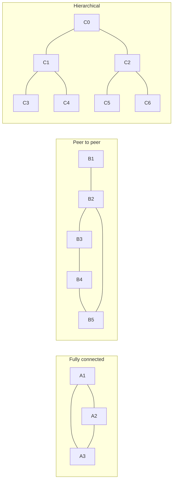
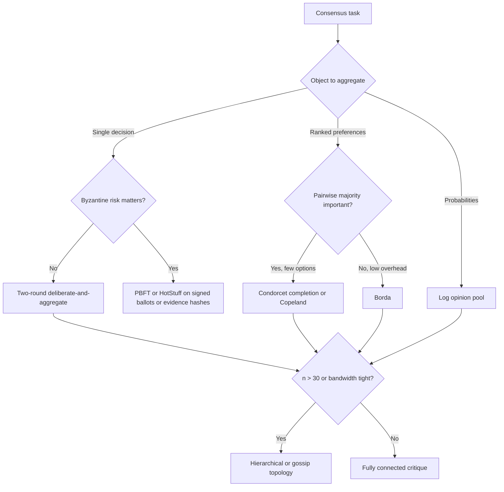

# Council Consensus Blocked

_Generated 2026-06-08T11:59:02.906Z_

Consensus was not reached. No single agent decided the result.

## Question

# Four-member model council task

## Topic
Agents-council is a system-of-systems that deliberates until its members reach consensus on a topic. Propose concrete improvements to the current approach.

## Required evidence base
Use both source documents below:

1. /home/dstefanescu/other_systems/o4/agents-council/consensus_approach.md
2. /home/dstefanescu/other_systems/o4/agents-council/consensus_deep-research-report.md

Do not browse. Treat the deep-research report as the research substrate. Distinguish claims from recommendations. Where the two source documents conflict, identify the conflict and resolve it explicitly.

## Council objective
Produce one consensus improvement proposal for the current agents-council approach. The proposal must be implementation-oriented, not generic multi-agent-debate advice.

## Required final consensus structure
- Executive recommendation: the central protocol change and why it dominates.
- Current approach diagnosis: strengths, failure modes, and missing invariants.
- P0/P1/P2 improvement list: each item must include rationale, expected benefit, implementation sketch, risk/tradeoff, and validation method.
- Consensus protocol: independence, issue-map construction, rebuttal, verification, voting, ratification, stopping, repair, and escalation rules.
- System architecture: components, persisted artifacts, interfaces, and where this fits in the existing agents-council runner.
- Evaluation plan: benchmark tasks, metrics, ablations, regression gates, and failure taxonomy.
- Rollout plan: smallest useful version, migration steps, and what not to build yet.
- Open questions and rejected alternatives.

## Deliberation constraints
Be adversarial about weak consensus. Consensus must not mean lowest-common-denominator agreement. Prefer a compact protocol with measurable stopping conditions over open-ended debate. Avoid weighted voting unless calibration data exists. Preserve minority objections as first-class artifacts when they are unresolved. Use external verification only where it changes decisions.

## Output budget
Initial proposals should be concise. Final consensus should be dense and specific; target 3,000-5,000 words, not a long essay.

## Source A: consensus_approach.md

**Most efficient approach: use a structured, mediator-led Delphi protocol with claim-level disagreement compression.** Do **not** let all agents free-chat until they “feel” aligned. That is expensive, noisy, and vulnerable to false consensus.

Confidence: **high**.

The core design should be:

> **Independent first pass → mediator compresses disagreements → targeted rebuttal only on disputed claims → verifier/judge applies predeclared decision rule → stop after bounded rounds.**

This gives you the useful part of multi-agent deliberation—diverse initial hypotheses and adversarial checking—without paying for quadratic all-to-all debate.

---

## Why not ordinary multi-agent debate?

Naive multi-agent debate is often oversold. Early work showed that multiple LLM instances proposing and debating answers can improve mathematical, strategic, and factual reasoning, but later evaluations found that current multi-agent debate systems do **not** consistently outperform cheaper strategies such as single-agent chain-of-thought or self-consistency, especially once token cost and latency are counted. ([arXiv][1]) ([Cloudfront][2])

Worse, debate can actively degrade answers: agents may shift from correct to incorrect answers after seeing peer reasoning, favor agreement over correction, and amplify errors across rounds. ([arXiv][3])

So the goal is **not** “maximize deliberation.” The goal is **maximize independent error discovery per token**.

---

## The protocol I would use

### 1. Force independent commitments first

Each agent must answer before seeing anyone else’s answer.

Require a compact structured output:

```json
{
  "position": "...",
  "confidence": 0.0,
  "key_claims": ["claim 1", "claim 2"],
  "evidence": ["evidence item 1", "evidence item 2"],
  "assumptions": ["assumption 1"],
  "strongest_objection_to_self": "...",
  "decision_relevant_uncertainties": ["uncertainty 1"]
}
```

This prevents anchoring and information cascades. It also lets you compare agents at the claim level instead of the prose level.

Use this for all agents in parallel.

Cost: **O(n)** calls.

---

### 2. Use a mediator to build an issue map

A separate mediator/judge should not “decide” yet. It should compress the outputs into:

```json
{
  "agreed_claims": [],
  "contested_claims": [
    {
      "claim": "...",
      "supporting_agents": [],
      "opposing_agents": [],
      "evidence_for": [],
      "evidence_against": [],
      "severity": "low|medium|high",
      "resolvable_by": "calculation|source_check|experiment|judgment"
    }
  ],
  "candidate_decisions": [],
  "missing_information": []
}
```

This is the critical efficiency move. You do not send full transcripts back to all agents. You send only the claims that matter.

The classical Delphi method has the same useful structure: anonymous independent judgments, summarized feedback, revision, and termination after consensus or a preset number of rounds. RAND describes Delphi as repeated anonymous rounds with feedback showing how each panelist compares with the group, followed by revision; the process stops when consensus is reached or when the round limit is hit. ([RAND Corporation][4])

---

### 3. Run one targeted rebuttal round

Send each agent only:

```text
Here are the disputed claims relevant to your answer.
For each one:
1. keep your position,
2. revise your position,
3. identify a test/check that would resolve it,
4. or mark it as irreducibly judgmental.
Do not restate uncontested material.
```

Require:

```json
{
  "revised_position": "...",
  "changed_mind_on": [],
  "unchanged_claims": [],
  "new_evidence": [],
  "unresolved_blockers": [],
  "confidence_after_revision": 0.0
}
```

Most of the value comes from this round. More rounds often produce rhetorical convergence rather than truth improvement. A recent failure-mode study found that longer debate can degrade performance in some settings, so a bounded protocol is safer than open-ended discussion. ([arXiv][3])

Default: **one rebuttal round**.
Maximum: **two rebuttal rounds**.
After that, stop deliberating and either test, adjudicate, or preserve the minority report.

---

### 4. Use external verification before voting whenever possible

Consensus is weak evidence. Tests are stronger.

For each contested claim, classify it:

| Claim type               | Best resolver                                                    |
| ------------------------ | ---------------------------------------------------------------- |
| Mathematical             | formal derivation, symbolic check, proof assistant, calculator   |
| Code                     | unit tests, benchmarks, static analysis                          |
| Factual                  | retrieval from primary sources                                   |
| Forecast                 | base rates, prediction market, model ensemble, scenario analysis |
| Design proposal          | rubric scoring + adversarial review                              |
| Normative/value judgment | explicit preference weighting, not “truth consensus”             |

For factual or technical questions, do **not** let the agents vote on things that can be checked. Make them propose checks; the system executes the checks.

---

### 5. Apply a predeclared consensus rule

Do not let the judge improvise. Use a rule.

For a **factual binary/multiple-choice question**:

```text
Accept answer A if:
- weighted support ≥ 0.75,
- no unresolved high-severity objection remains,
- at least one independent verification path supports A,
- the best competing answer has lower weighted support by margin ≥ 0.20.
Otherwise return: no consensus + top alternatives + required check.
```

For a **design/proposal question**:

```text
Accept proposal P if:
- all critical objections are resolved or explicitly mitigated,
- median agent score ≥ 8/10 on the rubric,
- interquartile range ≤ 2 points,
- no agent provides a concrete fatal counterexample.
```

For a **ranking problem**:

Use ranked ballots from agents, then aggregate by **median rank** or **Borda count**, but preserve vetoes for hard constraints. If an option violates a non-negotiable constraint, it is eliminated even if it ranks well.

For an **open-ended research/topic deliberation**:

Do not force a single conclusion. Output:

```text
Consensus core:
- claims everyone accepts

Majority position:
- best supported answer

Minority position:
- strongest dissent

Decision-critical uncertainty:
- the one check that would most change the conclusion
```

This is often superior to fake unanimity.

---

## Efficient architecture

Use this topology:

```text
          Agent 1
          Agent 2
User →    Agent 3     → Mediator → Targeted dispute packet → Agents → Judge
          Agent 4
          Agent 5
```

Avoid this topology:

```text
Agent 1 ↔ Agent 2 ↔ Agent 3 ↔ Agent 4 ↔ Agent 5
```

The second becomes expensive fast. With `n` agents and `r` rounds, all-to-all debate tends toward **O(n²r)** communication and bloated context. A mediator design is closer to **O(nr)** plus a small number of dispute-specific calls.

This also matches modern multi-agent engineering guidance: multi-agent systems are useful for context management, specialization, and parallelization, but not every complex task needs many agents; sometimes a single well-tooled agent is enough. ([LangChain Docs][5])

---

## Recommended default configuration

For most topics:

```text
3 independent proposer agents
1 critic/verifier agent
1 mediator/judge agent
1 targeted rebuttal round
1 final adjudication
```

For high-stakes technical topics:

```text
5–7 agents total
heterogeneous models/prompts
independent first pass
2 targeted rebuttal rounds max
mandatory external verification
minority report preserved
```

For cheap exploratory brainstorming:

```text
many agents allowed in round 0
only top 3–5 distinct positions survive into deliberation
```

The best use of many agents is **diversity generation**, not full deliberation. Let 20 agents generate candidate positions if cheap; then cluster them and deliberate only the 3–5 materially different positions.

---

## Agent roles that work

Use roles that create epistemic separation, not theater.

Good roles:

```text
Proposer: produces candidate answer.
Skeptic: attacks assumptions and hidden failure modes.
Verifier: checks facts, math, code, citations, constraints.
Synthesizer: merges non-conflicting claims.
Judge: applies predeclared rubric.
```

Weak roles:

```text
Optimist
Pessimist
Devil's advocate
CEO
Philosopher
Historian
```

Those can produce stylistic diversity but often not decision-quality diversity. Better to assign agents different **evidence channels**, **methods**, or **failure modes**.

Example:

```text
Agent A: empirical evidence only
Agent B: theoretical argument only
Agent C: implementation feasibility
Agent D: adversarial failure cases
Agent E: cost/benefit and deployment constraints
```

---

## The stopping rule matters

Use this:

```text
Stop when either:
1. consensus criterion is met,
2. two rounds have passed,
3. no agent changes a decision-relevant claim,
4. remaining disagreement depends on unavailable evidence,
5. further deliberation would only restate positions.
```

Do **not** continue because “some disagreement remains.” Persistent disagreement is information. Preserve it.

---

## The judge should not be a dictator

A single judge can hallucinate too. The judge should be constrained to an evidence table:

```json
{
  "final_decision": "...",
  "supporting_claims": [],
  "rejected_claims": [
    {
      "claim": "...",
      "reason_rejected": "...",
      "evidence": "..."
    }
  ],
  "unresolved_objections": [],
  "minority_report": "...",
  "confidence": 0.0,
  "what_would_change_this_answer": "..."
}
```

The judge should decide from the issue map, not from raw agent charisma.

---

## Use weighted voting only if you have calibration data

Do not weight agents by model prestige or elo vibes. Weight by historical performance on similar tasks.

A simple weighting scheme:

```text
agent_weight = 0.5 * accuracy_on_similar_tasks
             + 0.3 * calibration_score
             + 0.2 * domain_relevance
```

Then aggregate:

```text
weighted_support(option) =
    sum(agent_weight_i * support_i(option)) / sum(agent_weight_i)
```

If you lack calibration data, use equal weights but require explicit evidence and unresolved-objection tracking.

Self-consistency is a strong cheap baseline: sample multiple reasoning paths independently and choose the most consistent answer. The original self-consistency paper reports substantial gains on arithmetic and commonsense reasoning benchmarks by sampling diverse reasoning paths and marginalizing over answers. ([arXiv][6])

So your comparison should be:

```text
single strong model
vs. self-consistency
vs. structured Delphi agents
vs. full debate
```

If structured Delphi does not beat self-consistency on your task distribution, kill it.

---

## For adversarial or unreliable agents

If the agents can be malicious, compromised, or tool-corrupted, ordinary consensus is the wrong abstraction. You need fault-tolerant quorum logic, audit logs, and independent verification. Practical Byzantine Fault Tolerance was designed for systems where faulty nodes may behave arbitrarily, though LLM-agent deliberation has correlated failure modes that PBFT-style quorums do not solve by themselves. ([USENIX][7])

For AI agents, the practical version is:

```text
- isolate initial reasoning,
- require signed/immutable first answers,
- prevent agents from editing prior commitments,
- use independent evidence retrieval,
- require quorum + no fatal verifier objection,
- log every decision and dissent.
```

A 5-agent majority is not robust if all five share the same model family, training biases, prompt contamination, or retrieved context.

---

## Minimal implementation skeleton

```python
def deliberate(topic, agents, mediator, judge, max_rounds=2):
    # Round 0: independent commitments
    first_pass = parallel([
        agent.answer_independently(topic, schema="position_claims_evidence")
        for agent in agents
    ])

    issue_map = mediator.build_issue_map(topic, first_pass)

    for _ in range(max_rounds):
        if consensus_reached(issue_map):
            break

        dispute_packet = mediator.make_dispute_packet(issue_map)

        revisions = parallel([
            agent.respond_to_disputes(dispute_packet, schema="revisions_only")
            for agent in agents
        ])

        issue_map = mediator.update_issue_map(issue_map, revisions)

    verification_results = run_available_checks(issue_map)

    return judge.apply_decision_rule(
        topic=topic,
        issue_map=issue_map,
        verification=verification_results,
        rule="weighted_support_no_fatal_objection"
    )
```

---

## Bottom line

The most efficient consensus protocol is:

```text
Blind independent answers
→ claim-level issue map
→ one targeted rebuttal round
→ external verification where possible
→ predeclared consensus rule
→ final answer with minority report if needed
```

Do not optimize for agreement. Optimize for **decision quality per token**. In your HALO-X / learned-harness context, log every deliberation trace and learn the routing, stopping, and weighting rules from held-out task performance—not from how quickly agents converge.

[1]: https://arxiv.org/abs/2305.14325 "[2305.14325] Improving Factuality and Reasoning in Language Models through Multiagent Debate"
[2]: https://d2jud02ci9yv69.cloudfront.net/2025-04-28-mad-159/blog/mad/ "Multi-LLM-Agents Debate - Performance, Efficiency, and Scaling Challenges | ICLR Blogposts 2025"
[3]: https://arxiv.org/html/2509.05396v1 "Talk Isn’t Always Cheap: Understanding Failure Modes in Multi-Agent Debate"
[4]: https://www.rand.org/pubs/commentary/2023/10/generating-evidence-using-the-delphi-method.html "Generating Evidence Using the Delphi Method | RAND"
[5]: https://docs.langchain.com/oss/python/langchain/multi-agent "Multi-agent - Docs by LangChain"
[6]: https://arxiv.org/abs/2203.11171 "[2203.11171] Self-Consistency Improves Chain of Thought Reasoning in Language Models"
[7]: https://www.usenix.org/conference/osdi-99/practical-byzantine-fault-tolerance "Practical Byzantine Fault Tolerance | USENIX"

## Source B: consensus_deep-research-report.md

# Efficient Consensus Protocols for Deliberating AI Agents

## Executive summary

The central mistake is to look for one universally “best” consensus algorithm. There is no such algorithm. Exact distributed-systems consensus and epistemic deliberation are different problems. Paxos, Raft, PBFT, and HotStuff are designed to make replicas commit the same state transition under failures; DeGroot, voting rules, opinion pools, and debate are designed to aggregate differing beliefs, preferences, or arguments. If you use the first class when you really need the second, you usually pay a large communication penalty for the wrong guarantee. citeturn1search7turn9search0turn10search3turn1search0turn29search20turn25search1

For **small honest groups** of AI agents, the best efficiency frontier is usually a **two-round protocol**: independent first-pass answers, one critique/revision round, then **weighted aggregation**. Use **weighted majority** for a single categorical decision, **Borda or Condorcet-style aggregation** for ranked outputs, and a **logarithmic opinion pool** when agents can emit calibrated probabilities. This gets most of the benefit of deliberation without the quadratic cost explosion of many debate rounds. **Confidence: high.** citeturn40search1turn32search15turn14search1turn14search2turn29search20turn12search1

If **Byzantine or arbitrary adversarial behavior** matters, do not substitute ordinary voting or debate for a BFT commit protocol. Classical impossibility results show why fully asynchronous deterministic consensus is hard, and practical Byzantine protocols such as **PBFT** and **HotStuff** are the right tools when you need safety under arbitrary faults. **PBFT** is fine for small committees; **HotStuff** is usually the better scaling choice because it preserves BFT safety while reducing communication overhead. **Confidence: high.** citeturn7search1turn7search3turn10search3turn1search0

If **bandwidth is limited** or you need to scale from **dozens to hundreds or thousands** of agents, move away from fully connected debate. Use **hierarchical aggregation** when some coordination is acceptable, or **gossip / average-consensus** overlays when decentralization matters more than speed. If the consensus object is a **model parameter vector**, not a one-shot decision, then **FedAvg** and hierarchical federated learning are appropriate; otherwise they are usually the wrong abstraction. **Confidence: high.** citeturn26search17turn6search0turn24search0turn38search2

If **explainability** is a first-class requirement, the best design is a **structured argument graph** or **debate with checkable claims**, not a bare vote. Dung-style argumentation gives an explicit attack/support structure; debate and prover-verifier style methods make it easier for a judge or downstream verifier to audit the path to consensus. **Confidence: moderate.** citeturn40search12turn17search1turn40search1turn17search24

## Problem framing

Several dimensions in your request are explicitly **unspecified**: agent compute and memory budgets, model family, topology, objective, and latency/bandwidth. The literature implies a simple default rule: choose the protocol **by the object being aggregated** and **by the fault model**, not by the model brand. If agents output a discrete answer, use voting or weighted voting; if they output a ranking, use rank aggregation; if they output calibrated probabilities, use opinion pooling; if they must commit a shared state under faults, use a replicated-log consensus protocol. Honest-by-default settings should optimize sample efficiency and communication, not Byzantine safety overhead. citeturn29search20turn14search5turn1search7turn9search0turn10search3turn1search0

A second distinction matters just as much: **one-shot deliberation** versus **repeated task streams**. For one-shot tasks, historical skill estimates are weak and direct confidence calibration is often all you have. For repeated tasks with ground truth feedback, **weighted-majority** style updates and **Dawid–Skene**-style competence estimation become strong choices because they can learn which agents are reliable and on which label classes. **DAgger** belongs here too, but as a **meta-protocol**: it is valuable for distilling expensive, high-quality consensus traces into a cheaper policy or arbiter, not as the runtime consensus algorithm itself. citeturn32search15turn13search3turn13search6turn18search2

The default topology should also depend on scale. For **3–10 agents**, fully connected cross-critique is acceptable because the information benefit usually outweighs the \(O(n^2)\) message pattern. For **10–1000 agents**, sparse peer-to-peer overlays or hierarchical trees become more attractive because average-consensus and gossip performance is driven by graph connectivity and mixing, while hierarchical federated schemes explicitly trade some centralization for lower fan-out and lower aggregate communication. citeturn26search17turn6search0turn24search0



Fully connected topologies maximize information exchange but scale poorly; peer-to-peer overlays cut communication at the cost of slower convergence; hierarchical topologies are usually the best compromise once agent counts grow beyond the small-group regime. citeturn26search17turn6search0turn24search0

One final clarification: **Tree of Thoughts** and **Graph of Thoughts** are useful ways to structure search and internal reasoning, but they are not consensus rules by themselves. They help organize deliberation states; they still need a downstream voting, judging, or pooling rule to decide among branches or graph nodes. citeturn16search4turn34search0

## Comparative trade-offs

The table below separates methods by what they are actually good for. The most important columns are the ones users usually conflate: **round complexity**, **communication cost**, **fault assumptions**, and **explainability**.

| Method | Best use | Typical rounds / speed | Communication cost | Robustness | Key assumptions | Explainability | Representative sources |
|---|---|---:|---:|---|---|---|---|
| Simple majority vote | Single binary or categorical decision | 1 collection round; very fast | \(O(n)\) to a coordinator | Good against independent noise; weak against correlated error or strategic agents | Honest agents; no ranking/probabilities needed | Low | citeturn15search0turn14search5 |
| Weighted majority / multiplicative weights | Repeated tasks with feedback | 1 round per task; very fast online update | \(O(n)\) per task | More robust than unweighted voting when competence differs and feedback exists | Historical labels or outcomes available | Low to medium | citeturn32search15 |
| Borda count | Ranked preferences with low overhead | 1 round; fast | \(O(nm)\) for \(m\) options | Robust to dispersed preferences, but manipulable and not Condorcet-consistent | Ranked ballots available | Medium | citeturn14search2turn39search1 |
| Condorcet / Copeland-style aggregation | Ranked preferences where pairwise majority matters | 1 collection round plus pairwise tally; moderate | \(O(nm^2)\) | Strong pairwise-majority semantics, but cycles can leave no Condorcet winner | Ranked ballots available; small/moderate option set preferred | Medium | citeturn14search1turn14search5 |
| Logarithmic opinion pool | Probabilistic belief aggregation | 1 round; fast | \(O(nk)\) for \(k\) outcomes | Good when probabilities are calibrated; brittle if any agent assigns zero probability | Comparable probability distributions and reliability weights | Medium | citeturn29search20turn12search1 |
| DeGroot iterative averaging | Repeated social-learning style averaging | Iterative; asymptotic convergence | \(O(m)\) per round on graph with \(m\) edges | Converges under standard connectivity conditions, but weak against strategic or poisoned agents | Weighted communication graph; iterative exchange | Low | citeturn25search1turn6search0 |
| Randomized gossip / average consensus | Large sparse decentralized averaging | Iterative; slower than centralized collection | Local pairwise exchange per step; good scalability | Tolerates sparse networks; convergence rate depends on mixing / spectral properties | Connected overlay graph | Low | citeturn26search17turn26search0 |
| Paxos / Multi-Paxos | Crash-fault replicated state / exact commit | Low latency after stable leadership; practical system consensus | Quorum-based; low to moderate | Crash-fault tolerant, not Byzantine | Majority of acceptors live; replicated log formulation | Low | citeturn1search7turn9search0 |
| Raft | Crash-fault replicated state with simpler operational model | Low latency after leader election; practical | Quorum-based; low to moderate | Crash-fault tolerant, not Byzantine | Majority live; leader-based log replication | Medium as a systems protocol, low as deliberation logic | citeturn9search0turn9search8 |
| PBFT | Exact commit with Byzantine faults in small committees | Common-case multi-phase; slower than crash-fault protocols | Quadratic common-case communication | Tolerates arbitrary faults up to \(f < n/3\) | Authenticated replicas; committee size \(3f+1\) | Low | citeturn10search3turn7search3 |
| HotStuff | Larger BFT committees / blockchain-style finality | Multi-phase but better scaling than PBFT | Linear communication with threshold-signature style design | Byzantine tolerance up to \(f < n/3\) | Partial synchrony; authenticated replicas | Low | citeturn1search0 |
| Federated Averaging | Parameter consensus for distributed training | Iterative; communication-efficient over epochs | High-dimensional model updates, but fewer global rounds | Robust to non-IID data in training; not a semantic deliberation rule | Shared model architecture and parameter space | Very low | citeturn38search2turn24search0 |
| Structured debate / argument graph | Honesty-preserving or reasoning-improving deliberation | Usually 2+ rounds; medium latency | Potentially \(O(n^2R)\) in fully connected debate, lower in sparse/hierarchical variants | Good against ordinary reasoning errors; no formal BFT guarantee | Agents can produce critiques, evidence, or attack/support relations | High | citeturn17search1turn40search1turn40search12turn17search24 |
| DAgger-style distillation | Offline amortization of expensive consensus | Training-time iterative procedure; not a runtime consensus rule | Training data collection plus supervision cost | Good for reducing deployment cost after training | Expert/judge feedback available during data aggregation | Medium | citeturn18search2 |

A second table is more operationally useful when the topology is still open.

| Topology | Best scale | Per-round cost | Main strength | Main weakness | Default use | Sources |
|---|---|---:|---|---|---|---|
| Fully connected cross-critique | 3–10 agents | \(O(n^2)\) messages or token-sharing | Maximum mutual information; best for one rebuttal round | Cost explodes quickly | Small honest teams needing best quality | citeturn40search1turn6search0 |
| Sparse peer-to-peer / gossip | 10–1000 agents | \(O(m)\) over edges | Scales and decentralizes well | Slower convergence; weaker audit trail | Large open networks or no trusted coordinator | citeturn26search17turn6search0 |
| Hierarchical clusters | 10–1000 agents | Roughly linear per level; depth grows with hierarchy | Strong bandwidth savings; natural modularity | Possible bottlenecks at cluster heads | Enterprises, edge deployments, bandwidth-limited settings | citeturn24search0turn38search2 |

The coarse conclusion is blunt. If the agents are honest and the task is semantic rather than state-machine replication, **Paxos/Raft/PBFT/HotStuff are usually not the first thing to reach for**. Use them only when you need exact commit safety. For ordinary AI deliberation, **weighted one- or two-round aggregation** dominates for small groups, and **hierarchical or gossip-based aggregation** dominates for large groups. citeturn1search7turn9search0turn10search3turn1search0turn40search1turn32search15turn26search17turn24search0

## Recommended protocols

The fastest way to choose a protocol is to route first on the consensus object and adversary model.



That flow is a direct consequence of the literature: voting rules are objective-native for discrete and ranked outputs, opinion pools are objective-native for probabilities, and BFT protocols are fault-native for arbitrary adversaries. citeturn14search1turn14search2turn29search20turn10search3turn1search0

**Small honest agents**

**Recommendation. Confidence: high.** Use a **two-round deliberate-then-aggregate protocol** for 3–10 honest agents. Round one is independent solving. Round two is one critique/revision pass. Final aggregation is **weighted majority** for single answers, **Borda / Condorcet** for rankings, or a **log pool** for calibrated probabilities. Calibrate weights from recent accuracy, expected log loss, or a Dawid–Skene confusion estimate if past labeled tasks exist. This combines the demonstrated benefits of multi-agent debate with the efficiency of one-shot weighted aggregation. citeturn40search1turn32search15turn13search3turn14search1turn14search2turn29search20turn12search1

Implementation outline:
1. Normalize the task into a schema: answer, confidence/probability, evidence bundle, and optional critique target.
2. Collect independent first-pass outputs.
3. Run one rebuttal round. In small groups, all-to-all is acceptable.
4. Recompute weights from historical calibration plus current confidence.
5. Aggregate:
   - categorical: weighted vote;
   - ranking: Condorcet-completion if the option set is small and pairwise coherence matters, otherwise Borda;
   - probabilities: log pool with floor clipping to avoid zero-probability collapse.
6. Store the whole trace for later calibration or DAgger-style distillation.

```python
def deliberate_then_aggregate(task, agents, history, mode):
    records = []
    for a in agents:
        ans, conf, evidence = a.solve_independently(task)
        weight = skill_weight(a, history) * calibration_adjustment(a, conf)
        records.append({"agent": a, "ans": ans, "conf": conf,
                        "evidence": evidence, "weight": weight})

    # one critique/revision round
    for r in records:
        peer_bundle = [x for x in records if x["agent"] != r["agent"]]
        ans2, conf2, evidence2 = r["agent"].revise(task, peer_bundle)
        r.update({"ans": ans2, "conf": conf2, "evidence": evidence2})

    if mode == "categorical":
        return argmax_weighted_vote(records)  # sum_i w_i * 1[ans_i = y]
    if mode == "ranking":
        return condorcet_or_borda(records)
    if mode == "probabilities":
        return geometric_pool(records, epsilon=1e-6)  # normalize prod_i p_i^w_i
```

**Presence of Byzantine agents**

**Recommendation. Confidence: high.** If arbitrary adversarial behavior matters, separate **semantic deliberation** from **finalization**. Let the reasoning layer produce a **canonical ballot object** or **hash of an evidence bundle**, then finalize that object with **PBFT** for small committees or **HotStuff** for larger ones. Do **not** try to make free-form natural-language exchanges themselves the replicated state machine. BFT consensus wants canonical, deterministic objects; semantic deliberation does not naturally satisfy that constraint. citeturn10search3turn1search0turn7search1turn7search3

Implementation outline:
1. Fix a deterministic schema for proposals: task ID, normalized answer, confidence, evidence references, verifier outputs, and cryptographic hash.
2. Require every agent to sign its proposal.
3. Run local verification before any commit vote.
4. Use PBFT if \(n\) is small and operational simplicity matters; use HotStuff if you care about better scaling and cleaner leader changes.
5. Commit only the canonical verdict object and its evidence hash, not the raw conversational trace.
6. Keep the natural-language debate off the critical safety path.

```python
def byzantine_semantic_consensus(task, committee, f):
    proposals = [a.propose_canonical(task) for a in committee]
    valid = [p for p in proposals if verify_schema(p) and verify_evidence(p)]

    leader_value = choose_candidate_hash(valid)  # deterministic tie-break
    qc_prepare = collect_quorum_votes(stage="prepare",
                                      value=leader_value,
                                      threshold=2*f + 1)
    qc_commit = collect_quorum_votes(stage="commit",
                                     value=leader_value,
                                     threshold=2*f + 1)

    if qc_prepare and qc_commit:
        finalize(leader_value)
        return fetch_canonical_object(leader_value)
    return None
```

**Limited bandwidth or large populations**

**Recommendation. Confidence: high for hierarchical aggregation; moderate for pure gossip on semantic tasks.** For 10–1000 agents, use **hierarchical aggregation** by default. Partition agents into clusters, run local two-round consensus inside each cluster, then aggregate only the cluster-level summaries at the next level. If there is no trusted coordinator, switch to **sparse gossip** over short summaries or probability vectors. Use **FedAvg** only when what you are aggregating is actually a shared parameter vector from local training. citeturn24search0turn26search17turn38search2

Implementation outline:
1. Choose cluster sizes of roughly 5–8 agents.
2. Constrain each local summary to answer, confidence, top-k evidence IDs, and verifier flags.
3. Aggregate locally, then send only summaries upward.
4. At the root, apply the same aggregator as in the small-group protocol.
5. If a root is undesirable, run periodic gossip on summary vectors until change falls below a threshold.

```python
def hierarchical_consensus(task, agents, cluster_size=6, mode="categorical"):
    clusters = partition(agents, cluster_size)
    cluster_outputs = []

    for cluster in clusters:
        local = deliberate_then_aggregate(task, cluster, history={}, mode=mode)
        cluster_outputs.append(compress_summary(local))

    # second-stage aggregation over summaries only
    return aggregate_summaries(cluster_outputs, mode=mode)
```

**Need for explainability**

**Recommendation. Confidence: moderate.** Use an **argument-graph protocol**. Each agent must provide explicit claims, supports, and attacks. Build an attack/support graph, compute the surviving set of claims under a Dung-style semantics, then vote or pool over the surviving endpoints. Add a prover-verifier or tool-checkable layer where possible. This is slower than plain voting but produces the best audit trail. citeturn40search12turn17search1turn17search24

Implementation outline:
1. Force every message into a structured template: claim, premise, citation, attack/support relation.
2. Build a directed graph over claims.
3. Remove claims that fail verification.
4. Compute a grounded or otherwise conservative accepted set.
5. Produce the final verdict from the accepted set only.

```python
def argument_graph_consensus(task, agents):
    claims = []
    for a in agents:
        claims.extend(a.emit_structured_arguments(task))  # claim, support, attack, evidence

    graph = build_argument_graph(claims)
    graph = remove_unverified_claims(graph)
    accepted = grounded_extension(graph)  # conservative accepted set
    return vote_over_accepted_claims(accepted)
```

The practical rule is simple. **Small honest team**: two rounds, weighted aggregation. **Malicious agents**: BFT finalization on canonical ballots. **Large or bandwidth-constrained team**: hierarchy first, gossip second. **Explainability-critical team**: argument graphs plus verification. citeturn40search1turn10search3turn1search0turn24search0turn26search17turn40search12

## Evaluation and benchmarking

A serious benchmark should separate **quality**, **efficiency**, **robustness**, and **explainability**. For quality, use accuracy for categorical answers, **Brier score** or **log loss** for pooled probabilities, and **Kendall’s \(\tau\)** or related rank-correlation metrics for ranked outputs. For efficiency, measure wall-clock latency, communication rounds, total tokens transmitted, verification time, and per-agent compute. For robustness, vary independent noise, correlated error, crash faults, and Byzantine injections separately; the Condorcet-style benefit of voting depends strongly on error independence, and the distributed-consensus guarantees of Paxos/Raft/BFT protocols depend strongly on the fault model. citeturn15search0turn32search15turn31search5turn7search1turn10search3turn1search0

For explainability, the right metrics are not just “did it answer correctly?” but also **how cheaply a human or verifier can check the answer**. HotpotQA provides supporting-fact supervision; FEVER requires evidence-backed support/refute decisions; StrategyQA and MuSR expose whether the protocol can preserve intermediate reasoning structure rather than merely guessing the final label. Prover-verifier style work suggests using **verification time**, **fraction of accepted claims that are tool-checkable**, and **evidence completeness** as first-class metrics. citeturn19search3turn19search11turn37search0turn37search4turn37search3turn37search2turn17search24

A compact benchmark suite should use the following workloads.

| Workload family | Good datasets | What they test | Sources |
|---|---|---|---|
| General multiple-choice reasoning | MMLU | Broad knowledge, varied discrete decision tasks | citeturn19search0 |
| Hard expert reasoning | GPQA | Very difficult science questions where oversight is hard | citeturn20search0turn20search5 |
| Multi-step math | GSM8K | Sequential reasoning with clear final truth | citeturn19search9turn19search5 |
| Multi-hop explainable QA | HotpotQA | Final answer plus supporting facts | citeturn19search11turn19search3 |
| Truthfulness / fact verification | TruthfulQA, FEVER | Hallucination resistance and evidence-grounded verdicts | citeturn19search2turn19search18turn37search0turn37search4 |
| Implicit or soft reasoning | StrategyQA, MuSR | Whether deliberation preserves reasoning structure under ambiguity | citeturn37search3turn37search11turn37search2turn37search6 |
| Ranked preference aggregation | PrefLib | Ranking and social-choice behavior | citeturn31search0turn31search3 |
| Synthetic signal aggregation | Bernoulli-signal simulations | Clean control of independence, correlation, competence, and Byzantine rates | citeturn15search0turn32search15 |

For experimental infrastructure, use **PettingZoo** or **RLlib** when you want multi-agent interaction and controlled action timing, **Mesa** when you want custom agent-based simulations or social-network experiments, **Flower** or **FedML** when you want federated/hierarchical model-aggregation experiments, and **ns-3** or **OMNeT++** when you need realistic network latency, packet loss, and bandwidth constraints. Those tools cover nearly the full space in your prompt: deliberation, network topologies, large-scale simulation, and federated aggregation. citeturn21search0turn21search16turn36search3turn36search13turn22search0turn22search7turn21search2turn36search8turn23search7turn23search22

The minimum experimental grid I would run is:
- **Sizes:** \(n \in \{3, 5, 10, 30, 100, 300\}\).
- **Topologies:** complete graph, sparse expander-like random graph, k-ary tree, and clustered hierarchy.
- **Objectives:** single decision, full ranking, pooled probabilities.
- **Adversaries:** none, crash-only, noisy honest, correlated-noise honest, Byzantine.
- **Budgets:** one round, two rounds, four rounds; strict token ceilings; strict latency ceilings.
- **Outputs:** accuracy / log loss / Kendall \(\tau\), tokens, rounds, finalization time, and human verification time. These ablations are what actually reveal where a protocol sits on the quality-cost frontier. citeturn26search17turn24search0turn40search1turn10search3turn1search0

## Primary sources

The list below is prioritized in the order I would read it if the goal were to design or justify a consensus layer for multi-agent AI deliberation.

| Priority | Source | Why it matters | Sources |
|---:|---|---|---|
| 1 | Lamport, Shostak, Pease, **The Byzantine Generals Problem** | The canonical fault model and the classical \(3f+1\) threshold intuition for unauthenticated Byzantine agreement | citeturn7search3 |
| 2 | Fischer, Lynch, Paterson, **Impossibility of Distributed Consensus with One Faulty Process** | The impossibility baseline; explains why liveness requires extra assumptions | citeturn7search1 |
| 3 | Lamport, **The Part-Time Parliament** | The foundational Paxos paper for exact quorum consensus | citeturn1search7 |
| 4 | Ongaro and Ousterhout, **Raft** | Practical leader-based crash-fault consensus with a cleaner systems model than Paxos | citeturn9search0turn9search8 |
| 5 | Castro and Liskov, **Practical Byzantine Fault Tolerance** | The classic practical BFT protocol for small committees | citeturn10search3turn10search1 |
| 6 | Yin et al., **HotStuff** | The modern scalable BFT reference point; linear communication and responsiveness | citeturn1search0 |
| 7 | DeGroot, **Reaching a Consensus** | The basic iterative opinion-averaging model | citeturn4view0turn25search1 |
| 8 | Olfati-Saber, Fax, Murray, **Consensus and Cooperation in Networked Multi-Agent Systems** | The standard survey for graph-based consensus dynamics | citeturn6search0 |
| 9 | Boyd et al., **Randomized Gossip Algorithms** | The main reference for scalable peer-to-peer averaging | citeturn26search17turn26search0 |
| 10 | Dietrich and List, **Probabilistic Opinion Pooling**; Heskes, **Selecting Weighting Factors in Logarithmic Opinion Pools** | The right starting point for probabilistic belief aggregation; especially useful for weighted geometric pooling | citeturn29search20turn12search1 |
| 11 | Brandt et al., **Introduction / Handbook of Computational Social Choice** plus classic Borda and Condorcet work | The cleanest foundation for ranked-preference aggregation | citeturn14search5turn14search1turn14search2 |
| 12 | Dung, **On the Acceptability of Arguments...** | The core formalism for argumentation-graph consensus and explainable attack/support semantics | citeturn40search12 |
| 13 | Irving et al., **AI Safety via Debate**; Du et al., **Multiagent Debate**; Kirchner et al., **Prover-Verifier Games Improve Legibility of LLM Outputs** | The primary modern sources for debate-style deliberation and checkable oversight | citeturn17search1turn40search1turn17search24 |
| 14 | McMahan et al., **Communication-Efficient Learning of Deep Networks from Decentralized Data** | The canonical FedAvg reference when consensus means parameter averaging | citeturn38search2 |
| 15 | Ross, Gordon, Bagnell, **DAgger** | The key source when you want to distill expensive consensus behavior into a cheaper policy | citeturn18search2 |

## Open questions and limitations

The literature is still fragmented. Distributed-systems papers optimize **safety and liveness under faults**; social-choice and opinion-pooling papers optimize **aggregation of differing judgments**; LLM debate papers optimize **reasoning quality and oversight**. There is still no standard benchmark that jointly measures final-answer quality, token cost, transparency, correlated hallucination resistance, and Byzantine robustness under a shared evaluation harness. That gap is real, and it matters. citeturn7search1turn10search3turn29search20turn40search1turn36search8

Three uncertainties are especially important. First, most optimistic “wisdom of crowds” results weaken sharply when model errors are **correlated** rather than independent. Second, self-reported LLM confidence is often poorly calibrated, so weighted voting only works well if calibration is measured and corrected. Third, BFT protocols assume canonical messages and deterministic validation, which is rarely true of free-form language deliberation; in practice, they should finalize **ballots, verdict objects, or evidence hashes**, not arbitrary text. citeturn15search0turn32search15turn12search1turn10search3turn1search0

So the correct default is not a single algorithm. It is a **layered architecture**: deliberation to improve answer quality, aggregation matched to the output type, and exact consensus only where the failure model actually requires it. citeturn40search1turn29search20turn10search3turn1search0

## Consensus Answer

# Agents-Council Improvement Proposal — Bounded Claim-Level Delphi with Stop-on-Rule Termination

## Executive recommendation

**Replace "deliberate until consensus" with a bounded, claim-level Delphi protocol whose loop terminates on a predeclared stopping rule — never on agreement — and whose runtime substrate is a mediator-built issue map, not a prose transcript.** The single central change is the termination condition: convergence becomes *neither necessary nor sufficient* for stopping. The loop halts on a fixed predicate (rule satisfied, hard round cap, no decision-relevant change, only-judgmental-disagreement-remains, positions-only-restated, or token-budget exhausted), and *unresolved disagreement is emitted as a first-class minority report* rather than ground down.

This dominates every other candidate change because the topic statement encodes the system's primary defect: a loop that terminates on agreement optimizes the one quantity both source documents say you must not optimize. Source A: "Do not let all agents free-chat until they 'feel' aligned… vulnerable to false consensus" and "Persistent disagreement is information." Source B: optimistic "wisdom of crowds" results "weaken sharply when model errors are correlated." Inverting the stopping condition (a) caps cost deterministically, (b) removes the incentive toward the rhetorical/cascade convergence that Source A's cited failure-mode study (arXiv 2509.05396) attributes to longer debate, and (c) reframes the system's objective from "manufacture agreement" to "maximize independent error discovery per token."

The issue map is the load-bearing *enabling mechanism* for that inversion: it makes disagreement legible at the claim level so it can be preserved, audited, verified, and routed. Stopping rule + issue map are stated together because neither works alone — a stop rule over free-chat just halts at an arbitrary point in a prose blob.

Three supporting invariants make the stopping rule meaningful: **blind immutable first commitments** (independence), a **mediator issue map verifiable against those commitments** (auditable, mediator-integrity-checked compression), and **mandatory minority-report preservation** (dissent is not averaged away). External verification is conditional — only where a check would flip a decision. Weighted voting is **not** in the central change; it is a later, data-gated addition (P1 logging / P2-conditional application) because agents-council has no calibration corpus and both sources flag uncalibrated weighting and poorly-calibrated confidence as hazards.

A non-negotiable guardrail rides with the recommendation: **a standing regression gate that kills the entire multi-agent apparatus if it does not beat self-consistency on quality-per-token** on agents-council's task distribution. Source A demands exactly this test; we honor it — and we run its *first instance as Milestone 0*, before committing to the heavier protocol build, so the mediator/ratification machinery is justified by evidence rather than assumed (see Rollout).

Confidence that "until consensus" is the dominant defect and that stop-on-rule is the central fix: **high**. Confidence that the apparatus survives the self-consistency gate on design/proposal tasks: **moderate** (untested on the real corpus — which is exactly why Milestone 0 exists).

## Current approach diagnosis

*Project-state caveat (required by peer review): two claims about the **current** agents-council implementation below are **assumptions pending repo verification**, not facts established by Source A or Source B — (i) that the panel is already heterogeneous across model families, and (ii) that the live artifact pipeline is `deliberations/*.json` → `council_to_brief.py` → HALO-X. Source A references the HALO-X context only in passing and treats model heterogeneity as a recommended high-stakes configuration (and warns that a same-family majority is not robust), not as a description of the current system; neither source names the pipeline. Both are tagged `[ASSUMED]` where used. Consequences if false: (i) false ⇒ P1-8 is a rebuild, not detection+assignment, and the correlated-error defense is weaker than stated; (ii) false ⇒ the integration points in System architecture and Rollout must be re-derived from the actual runner before use.*

**Strengths to preserve.** (1) **[ASSUMED — verify against repo]** The council is taken to be *already* a heterogeneous multi-model panel (distinct model families), which — if confirmed — is the strongest available defense against correlated honest error; bank it, do not rebuild it. This is an assumption, not a fact established by either source. (2) Multiple independent models genuinely surface diverse initial hypotheses and catch each other's errors — Source A concedes this is "the useful part." (3) **[ASSUMED — verify against repo]** The system is assumed to already persist deliberations and feed them downstream (`deliberations/*.json` → `council_to_brief.py` → HALO-X), giving an artifact pipeline to extend rather than invent; neither source establishes this pipeline, so confirm it against the actual runner before treating the integration points as fixed. (4) The best use of many agents is *diversity generation* (Source A), which a multi-model panel supplies for free **if the heterogeneity assumption (1) holds**.

**Failure modes.** (1) **No measurable stopping condition** — "until consensus" is unbounded; cost and latency are uncontrolled and the natural attractor is the cheapest agreement, not the correct answer. (2) **Anchoring / information cascade** — agents that see peers before committing shift correct→incorrect under peer pressure (arXiv 2509.05396); free-chat maximizes this. (3) **Correlated failure invisible to majority logic** — even across families, overlapping training data can make a unanimous panel confidently, identically wrong; unanimity is then presented as strong evidence while being weak. Neither voting nor BFT fixes this. (4) **Charisma over evidence** — free-chat lets the most fluent agent win; the decision traces to prose, not checkable claims. (5) **Lossy dissent** — a converged transcript discards the strongest overruled objection, exactly the information a downstream HALO-X planner most needs. (6) **Improvised adjudication** — without a predeclared rule, the judge rewrites criteria per task, making outcomes un-auditable. (7) **Voting on checkable facts** — the system ballots on arithmetic, code behavior, or retrievable facts that should be checked.

**Missing invariants** (the current loop guarantees none): **Independence** (first commitments blind and immutable); **Termination** (halt on a predeclared rule with hard caps on rounds *and* tokens); **Dissent-preservation** (unresolved medium/high-severity objections survive verbatim into output); **Verify-before-vote** (checkable, decision-flipping claims are checked, not voted); **Auditability** (every verdict line traces to a claim+evidence in the issue map); **Decorrelation awareness** (detect and discount near-identical first passes instead of treating them as confirmation).

## Source conflicts, resolved

Both sources agree on the spine (independent first pass → one critique round → aggregate; two rounds, not many). They diverge on five operational points; resolving them is half the proposal. We treat Source B as the research substrate: its empirical statements (Condorcet's benefit depends on error independence; debate can degrade answers; BFT needs canonical deterministic objects; LLM confidence is poorly calibrated) are **claims** we rely on; its protocol picks are **recommendations** we accept or reject below.

**1. Weighted voting.** B makes weighted majority the high-confidence default for small honest groups; A says weight *only* with historical calibration data, else equal weights; the user constraint matches A. **Resolution: equal weights now; calibration logging is P1, weighting application is P2-gated.** B's own limitations section (poor confidence calibration, correlated-error collapse) guts its default. agents-council has no per-task-family calibration corpus. Use equal weights + explicit unresolved-objection tracking; earn weighting later from logged ground truth. Confidence: **high**.

**2. Topology / rebuttal exposure.** B says fully-connected cross-critique is acceptable at 3–10 agents; A says send only a compressed dispute packet via a mediator. At n≈4 the token argument is moot (16 vs 4 messages); the decisive axis is *anchoring*. **Resolution: mediator-compressed dispute packet by default even at small n** — the benefit is anchoring reduction and auditability, not token savings. Concede B's information-flow point narrowly: the mediator *may* inject one directly-contradictory peer claim into an agent's packet when flagged, preserving targeted cross-critique without full-transcript broadcast. All-to-all survives only as an ablation. Confidence: **high**.

**3. BFT machinery (PBFT/HotStuff).** B gives it substantial weight for adversarial settings; A treats it as a caveat and notes LLM failures are correlated, which quorum logic does not solve. **Resolution: reject the commit-protocol machinery as default.** B is right that BFT is fault-native for *arbitrary adversaries* — and agents-council agents are honest cooperating models, not arbitrary adversaries. The real threat is correlated honest error, which neither PBFT nor majority solves. Keep only the cheap integrity primitives (signed, hashed, immutable first commitments; append-only audit log; independent evidence retrieval); drop the quadratic prepare/commit phases. Reserve BFT finalization of canonical ballots for a *confirmed* adversarial threat model (P2). Confidence: **high**.

**4. Verification eagerness.** A: verify "whenever possible." User constraint and economics: verify only where it changes decisions. **Resolution: conditional verification** — run a check iff the claim is contested ∧ decision-relevant ∧ checkable ∧ plausibly decision-flipping. Strictly cheaper; A's eager version pays for checks that do not move the verdict. Confidence: **high**.

**5. Routing principle.** B's thesis — route the *aggregation rule* by the object aggregated (decision→vote, ranking→Borda/Condorcet, probabilities→log-pool) — is more systematic than A's monolithic rule; A's per-claim resolver table (math→derivation, code→tests, factual→retrieval) is the operational complement. **No conflict; compose both.** Route the decision rule by output type (B) and route each contested claim by its resolver type (A). Confidence: **high**.

## P0 / P1 / P2 improvement list

### P0 — must ship; highest leverage, lowest cost

**P0-1. Bounded predeclared stopping rule (rounds + token ceiling).**
- *Rationale:* removes the false-consensus attractor; makes cost deterministic.
- *Expected benefit:* capped latency/tokens; eliminates rhetorical-convergence rounds.
- *Implementation sketch:* a `stop(issue_map, round, spent_tokens)` predicate in the runner, evaluated after each round. Stop when **any** holds: (a) decision rule satisfied; (b) round == cap (default 2 = blind + 1 rebuttal; 3 for high-stakes); (c) no decision-relevant claim changed since last round; (d) all remaining disagreement is `resolvable_by: judgment` or depends on unavailable evidence; (e) positions only restated; (f) cumulative tokens exceed budget `B` (default configurable, order ≈5000 tokens/agent/task). Persist `stop_reason`.
- *Risk/tradeoff:* stopping too early on a genuinely resolvable dispute. *Mitigation:* condition (d) routes resolvable-but-unresolved claims to verification/escalation before stop.
- *Validation:* rounds-to-stop and tokens-to-stop distributions; regression gate = **no run exceeds either cap**; A/B decision quality vs the unbounded loop.

**P0-2. Blind, immutable, schema-constrained first commitments.**
- *Rationale:* independence invariant; kills anchoring/cascade; gives claim-level comparability and a tamper-evident baseline.
- *Expected benefit:* higher initial claim diversity; clean blame assignment on incorrect convergence.
- *Implementation sketch:* each agent answers in parallel before seeing any peer output, emitting `{position, confidence, key_claims, evidence, assumptions, strongest_objection_to_self, decision_relevant_uncertainties}` plus a free-text `notes` field for nuance. Hash each record; store append-only as `round0_commitments.jsonl`. Round-0 is not editable later.
- *Risk/tradeoff:* rigid schema truncates nuance; cross-family schema compliance needs retries. *Mitigation:* `notes` escape hatch; bounded validation/retry budget.
- *Validation:* assert no round-0 output references another agent; hash-chain integrity check; measure round-0 `key_claims` embedding divergence vs a peer-visible baseline (expect materially higher unique-claim count — direction, not a pre-committed numeric target).

**P0-3. Mediator-built issue map, verifiable against commitments.**
- *Rationale:* compresses disagreement to claim level; makes the verdict auditable; is the core persisted artifact downstream tools consume.
- *Expected benefit:* agents deliberate only contested claims (substantial token reduction in the rebuttal round); verdict traces to evidence, not prose.
- *Implementation sketch:* a dedicated **mediator** agent (which must **not** decide) emits `{agreed_claims, contested_claims[], candidate_decisions, missing_information}`, where each contested claim carries `{claim, supporting_agents, opposing_agents, evidence_for, evidence_against, severity ∈ {low,medium,high}, decision_relevance ∈ {low,medium,high}, resolvable_by ∈ {calculation|source_check|code_test|experiment|rubric|judgment}, interplay_with: [claim_ids], source_commitment_refs}`. **Every contested claim must cite the exact commitment hash + span it was drawn from** (defends against the mediator as a single point of epistemic failure). `decision_relevance` is tagged separately from `severity` so the verification gate (P1-6) is evaluable directly from the map. `interplay_with` flags claims uncontested alone but fatal in combination.
- *Risk/tradeoff:* mediator mis-compresses, poisoning everything downstream. *Mitigation:* ratification gate (P0-4) + judge cross-check against raw commitments.
- *Validation:* every contested claim has ≥1 supporter, ≥1 opposer, and a valid source ref; agreed claims round-trip losslessly; human audit of a sample of maps for contested-claim precision/recall against manual annotation.

**P0-4. Issue-map ratification + mandatory minority report.**
- *Rationale:* dissent-preservation and mediator-integrity invariants.
- *Expected benefit:* prevents straw-manning; surfaces the dissent a HALO-X planner needs.
- *Implementation sketch:* before the rebuttal round, each proposer returns a 1-bit "is your position faithfully represented?" + optional correction (cheap). The final verdict schema **requires** a `minority_report` field; any unresolved `severity ∈ {medium, high}` contested claim is preserved verbatim with its strongest evidence. The field is empty only when there is genuinely no dissent.
- *Risk/tradeoff:* trivial dissent inflates the report. *Mitigation:* only medium/high-severity unresolved claims qualify.
- *Validation:* gated test — when agents disagree at stop time, output must contain a non-empty minority report; downstream audit for dissent preservation.

**P0-5. Minimal predeclared decision rule (categorical + open-ended).**
- *Rationale:* consensus must be decided by a rule, not judge improvisation; the smallest useful version needs at least these two modes.
- *Expected benefit:* reproducible, replayable verdicts.
- *Implementation sketch:* a `TaskClassifier` selects mode at intake (default = open-ended, the safest, dissent-preserving mode). Categorical: accept answer A iff support fraction ≥ 0.75 (equal weights), margin over runner-up ≥ 0.20, ≥1 verification path supports A (when verification is live), and no unresolved high-severity objection. Open-ended: emit `{consensus_core, majority_position, minority_position, decision_critical_uncertainty}` — no forced unanimity. Persist which rule fired.
- *Risk/tradeoff:* mis-routing output type. *Mitigation:* default to open-ended; classifier override is logged.
- *Validation:* rule is deterministic given the issue map — replay produces an identical verdict; track "no-consensus precision" (no-consensus should be common on genuinely ambiguous tasks, rare on unambiguous ones).

### P1 — high value, more work

**P1-6. Conditional verification routing.**
- *Rationale:* tests beat votes, but only where they flip decisions (user constraint; conflict #4).
- *Expected benefit:* step-change accuracy on factual/math/code tasks; eliminates checkable-but-voted objections.
- *Implementation sketch:* read each contested claim's `resolvable_by` and `decision_relevance`; for those checkable **and** decision-relevant **and** plausibly decision-flipping, a **verifier** executes the check (calculator/symbolic; sandboxed code+unit tests with time limits; primary-source retrieval; base-rate lookup). Gate execution on `would_change_decision`. Results enter the map as evidence with tool provenance.
- *Risk/tradeoff:* verifier tool errors masquerade as ground truth; latency. *Mitigation:* provenance + human-readable justification; judge may reject; keep claim-scoped.
- *Validation:* measure decision-flip rate from verification on GSM8K/FEVER; if checks rarely flip, prune them (do not pay for theater).

**P1-7. Full output-type-routed decision rules.**
- *Rationale:* compose B's object-routing with A's per-question rules.
- *Expected benefit:* native handling of rankings and probabilities instead of forcing them to categorical.
- *Implementation sketch:* ranking → Borda or Condorcet/Copeland completion (small option sets) with **veto** for hard-constraint violations; probabilities → logarithmic opinion pool with ε-floor, plus a calibration check (if expected calibration error exceeds threshold on a dev set, fall back to discrete voting); design/proposal → rubric median ≥ 8/10, IQR ≤ 2, no fatal concrete counterexample; open-ended as in P0-5. Persist the rule fired.
- *Risk/tradeoff:* uncalibrated probabilities corrupt the pool. *Mitigation:* the calibration-gated fallback.
- *Validation:* Kendall-τ for rankings, Brier/log-loss for probabilities; replay determinism.

**P1-8. Heterogeneity / decorrelation alarm.**
- *Rationale:* the only real defense against correlated honest error (both sources). **[ASSUMED — verify against repo]** *if* the panel is already multi-family (diagnosis assumption (1)), this is detection + assignment, not a rebuild; if that assumption is false, the evidence-channel assignment below becomes a genuine heterogeneity build and its cost rises accordingly.
- *Expected benefit:* prevents a near-identical panel from being read as confirmation.
- *Implementation sketch:* assign agents distinct **evidence channels** (empirical / theoretical / feasibility / adversarial-failure / cost-deployment), not theatrical personas (Source A: "epistemic separation, not theater"). Add a **decorrelation alarm**: if round-0 answers exceed a similarity threshold (e.g., high embedding cosine + identical confidence), flag low effective diversity and discount apparent consensus; if severity is simultaneously high, escalate (correlated-collapse trigger).
- *Risk/tradeoff:* only one family available in some deployments. *Mitigation:* vary prompts/temperature/evidence-channel within a family; record residual correlation as a confidence penalty.
- *Validation:* inter-agent error correlation on a labeled benchmark; confirm the alarm fires on injected correlated-error cases.

**P1-9. Calibration logging → data-gated weighting (machinery retained, demoted and gated).**
- *Rationale:* weighted aggregation dominates equal weights *only* when competence differs and is measured (both sources); the user bars it absent calibration data.
- *Expected benefit:* modest accuracy lift (order 5–15%, unverified) on repeated task distributions *after* a corpus exists.
- *Implementation sketch:* **calibration *logging* is the P1 deliverable**; **weighting *application* is P2-conditional** and does not activate until the gate below clears. Log every ballot against ground truth where obtainable (retrospective HALO-X outcomes for design tasks). Maintain a per-agent, per-task-family registry: accuracy, Brier/calibration error, Dawid–Skene confusion estimate, objection-usefulness, verification hit-rate. Until `k` labeled tasks per family (default `k`≈30, provisional), force equal weights. Then enable optional `weight = 0.5·accuracy + 0.3·calibration + 0.2·domain_relevance` with multiplicative online updates and a Dirichlet/Beta prior to damp small-sample noise. Never weight by model prestige.
- *Risk/tradeoff:* early weights overfit easy tasks; fake precision from sparse data. *Mitigation:* the `k`-threshold gate + prior + held-out gate below.
- *Validation:* **weighted must beat equal weights on held-out tasks per family, or it is killed.** Compare cumulative accuracy over a multi-task stream.

### P2 — later; needs data or a changed threat model first

**P2-10. Learned routing/stopping + DAgger distillation (HALO-X tie-in).** Learn agent count, model mix, and stop point from held-out performance (Source A's closing note); distill expensive consensus traces into a cheaper arbiter (Source B's DAgger framing — explicitly a *meta*-protocol, not the runtime rule). *Validation:* distilled policy within tolerance of the full protocol at lower cost.

**P2-11. Hierarchical aggregation for large panels (>10 agents).** Cluster into groups of 5–8, run local two-round consensus, aggregate cluster summaries (Source B). Build only when runs routinely exceed ~10 agents. *Validation:* quality-vs-agent-count curves to n≈100; minimal accuracy loss vs fully-connected.

**P2-12. Canonical ballots + optional BFT finalization.** Hash commitments/maps/verdicts now (cheap integrity, part of P0-2). Add PBFT (n≤7) / HotStuff finalization of canonical ballot hashes — never raw text — only under a confirmed adversarial threat model. *Validation:* Byzantine fault injection on finalization safety.

**P2-13. Argument-graph mode.** Dung-style attack/support graph with grounded extension when a hard explainability mandate appears. Heavier than n≈4 warrants today. *Validation:* human verification time on HotpotQA-style tasks.

**P2-14. Continuous baseline gate (standing).** Benchmark structured-Delphi vs self-consistency vs single-strong-model every release. **If Delphi does not beat self-consistency on quality-per-token, kill it** (Source A's explicit demand). Not a feature — a permanent regression gate, whose *first execution is Milestone 0* in the rollout (run before the heavy protocol build, not only after).

## Consensus protocol

**Independence.** Round 0 is blind and parallel; outputs are schema-constrained, hashed, append-only. No agent sees a peer before committing. *Invariant: round-0 references no other agent.*

**Issue-map construction.** Mediator compresses round-0 into agreed/contested/candidate-decision/missing-info; each contested claim cites its source commitment hash+span, tagged `severity`, `decision_relevance`, `resolvable_by`, and `interplay_with`. Semantically equivalent claims merge; the mediator decides nothing.

**Ratification (gate 1).** Each proposer confirms (1 bit + optional correction) that the map represents its position. A rejection triggers **mediation repair** (re-compress the disputed entry) before deliberation proceeds — defending against straw-man cascades and mediator hallucination.

**Rebuttal.** One targeted round (max two for high-stakes). Each agent receives **only** its dispute packet (contested claims relevant to it; optionally one mediator-flagged directly-contradictory peer claim) and returns `{revised_position, changed_mind_on, unchanged_claims, new_evidence, unresolved_blockers, proposed_checks, confidence_after_revision}`. No restating uncontested material. Mediator rebuilds the map; if no decision-relevant claim changed, stop immediately.

**Verification.** Conditional — executed only on contested ∧ decision-relevant ∧ checkable ∧ decision-flipping claims, routed by `resolvable_by`. Results enter the map as evidence with provenance; verified claims leave the contested set and are not voted on.

**Voting.** Judge applies the predeclared, output-type-routed rule to the *updated issue map + verification results* — never to raw transcript or charisma. Equal weights until the P1-9 calibration gate is met; hard-constraint vetoes override popularity. Judge is constrained to an evidence table: `{final_decision, supporting_claims, rejected_claims[{claim, reason, evidence}], unresolved_objections, minority_report, confidence, what_would_change_this_answer}`.

**Ratification (gate 2).** Distinct from voting: agents (and, for high-stakes, a human) confirm the verdict's evidence table faithfully reflects the map before commit. A quorum of ≥2 agents producing a fatal counterexample blocks commit and triggers escalation. Disagreement here is logged, not suppressed.

**Stopping.** Per P0-1: rule-met ∨ round-cap ∨ no-decision-relevant-change ∨ only-judgmental/unavailable-evidence-remains ∨ positions-only-restated ∨ token-budget-exhausted. Persist `stop_reason`. **Persistent disagreement is a valid terminal state**, emitted as minority report (consensus_core + majority + minority + decision-critical uncertainty).

**Repair.** Triggered by: ratification rejection (→ re-mediate the entry); decorrelation alarm (→ re-run round-0 with perturbed prompts/evidence channels); verification contradicting the converged answer (→ reopen that claim for one extra bounded round, scoped to the blocking objection only).

**Escalation.** When a decision-relevant, high-severity claim is checkable-but-unresolved within the caps — or a verifier errors on a critical claim, or correlated-collapse is suspected, or a normative judgment is required, or the task class was misclassified — escalate (external test, stronger model, or human) rather than fabricate consensus. Escalation is logged as `unresolved_blocker`.

## System architecture

**Components** (mostly prompt/role wrappers around the existing runner, not new infra): **Orchestrator** (existing runner: drives rounds, evaluates `stop()`, fires repair/escalation, writes artifacts); **TaskClassifier** (selects output mode at intake); **Proposers (N≈4 default, heterogeneous models)** (blind round-0 + targeted rebuttals, distinct evidence channels); **Mediator / IssueMapBuilder** (builds/updates map and dispute packets; decides nothing); **Verifier** (routes checks to pluggable tools: calculator/symbolic, sandboxed code runner, retriever; returns outcome + evidence blob); **Judge** (applies the rule; constrained to the evidence table); **CalibrationStore** (P1-9; per-agent/per-family outcomes); **AuditLogger** (append-only).

**Persisted artifacts** (all JSON, schema-versioned): `task.json` · `round0_commitments.jsonl` (immutable, hashed) · `issue_map.r{0,1,2}.json` · `dispute_packet.r{1,2}.json` · `ratification.json` · `verification_results.json` · `verdict.json` (with `minority_report`, `unresolved_objections`, `what_would_change_this_answer`) · `metrics.json`. **[ASSUMED — verify against repo]** These are intended to compose the assumed existing `deliberations/*.json` consumed by `council_to_brief.py` → HALO-X; confirm the pipeline before wiring to it.

**Interfaces:** strict JSON schema at every boundary. Agent API: `solve_independently(task, schema)` / `revise(dispute_packet, schema)`. Mediator API: `build_issue_map(commitments[])` / `make_dispute_packet(issue_map, agent_id)`. Judge API: `adjudicate(issue_map, verification_results, rule_id) → verdict`. The judge's evidence-table schema is the stable contract with the brief extractor; the mediator↔proposer interface is the dispute packet (never full transcript).

**Fit in the runner.** This is a wrapper around the current runner, not a rewrite. Replace the "continue until consensus" loop with a single `Council.deliberate(task_config)` call implementing `commit → map → ratify → rebut → verify → vote → ratify`. Keep current agent adapters; change the protocol contract and artifacts first. **[ASSUMED — verify against repo]** The downstream synthesizer/brief extractor (assumed to be `council_to_brief.py`) must consume `verdict.json` (not raw transcript) and read `minority_report` + `what_would_change_this_answer` so the plan brief inherits dissent and falsifiers, not just the majority line; if the actual extractor differs, adapt this contract to it. Free-chat mode stays behind a flag for A/B during migration.

## Evaluation plan

**Benchmark tasks.** Scope to agents-council's *actual* workload — it feeds HALO-X implementation plans, so **design/proposal and technical-decision deliberations dominate**, not arithmetic. Use Source B's suite selectively: GPQA/MMLU (hard categorical), HotpotQA/FEVER (evidence-grounded verification), TruthfulQA (hallucination resistance), StrategyQA/MuSR (reasoning-structure preservation), PrefLib (ranking), GSM8K (math/verification sanity). Add an **internal corpus of past agents-council deliberations with retrospective ground truth** (which plan actually worked) and **synthetic Bernoulli-signal simulations** to control independence vs correlation, competence, and injected error rates.

**Metrics.** Decision quality (accuracy / expert-rubric / retrospective HALO-X outcome; Brier/log-loss for probabilities; Kendall-τ for rankings); tokens-per-decision and rounds-to-stop; **decision-flip rate from verification** (justifies or kills P1-6); minority-report incidence and downstream usefulness/regret; confidence calibration (ECE/Brier); inter-agent error correlation; no-consensus precision; human verification time.

**Ablations** (each isolates one invariant): (a) blind vs non-blind round-0; (b) mediator-compressed vs full-transcript rebuttal; (c) verification on/off; (d) 0/1/2/4 rebuttal rounds; (e) homogeneous vs heterogeneous panel; (f) equal vs calibrated weights (post-threshold); (g) **structured-Delphi vs self-consistency vs single strong model** (the existential baseline — run first as Milestone 0).

**Regression gates:** must beat self-consistency on quality-per-token (P2-14); no run exceeds round *or* token cap; minority report present whenever disagreement persists at stop; issue map round-trips against commitments; weighted voting must not activate below the calibration threshold; every verdict line cites an issue-map claim; verification attaches to claim IDs.

**Failure taxonomy:** (I) false consensus (converged-but-wrong, no minority flag); (II) deadlock/indecision (no-consensus where a cheap check existed); (III) mediator distortion (mis-compression, caught at ratification); (IV) verification gap (checkable claim voted instead of checked); (V) correlated collapse (independent agents share a hallucination); (VI) dissent suppression; (VII) judge overreach; (VIII) calibration misuse / weight corruption; (IX) budget overrun; (X) task-mode misclassification.

## Rollout plan

**Milestone 0 (gate the whole build):** with the *minimum* instrumentation — blind round-0 (P0-2), structured commitments, and ground-truth logging — run the existential baseline (g): structured-Delphi-stub vs self-consistency vs single-strong-model on a seed corpus. Proceed to the full mediator/ratification build **only if** multi-agent clears the quality-per-token bar. If it does not, ship self-consistency sampling and stop here. This front-loads the kill decision so the heavy P0 machinery is justified by evidence, not assumed.

**Smallest useful version (ship if Milestone 0 clears):** blind round-0 (P0-2) + mediator issue map with source refs, `decision_relevance`, and `interplay_with` (P0-3) + ratification and mandatory minority report (P0-4) + one rebuttal + bounded stop with token ceiling (P0-1) + categorical/open-ended decision rule (P0-5). **No verification execution yet** — classify and flag only. No weighting, no learned routing, no scale topology.

**Migration steps:** (1) instrument the runner to emit structured JSON and log ground truth per task; (2) run Milestone 0; (3) insert the mediator between generation and voting; (4) replace open-ended chat with dispute packets; (5) add the judge with hard-coded rules, removing feeling-based consensus; (6) shadow-run, persisting both legacy transcript and new structured trace; (7) emit `verdict.json` alongside legacy output until the downstream extractor (**[ASSUMED]** `council_to_brief.py`) reads the new schema; (8) backfill issue-map structure on a sample of historical deliberation records (**[ASSUMED]** `deliberations/*.json`) to seed the eval corpus; (9) switch final output to structured ratification once regression gates pass; (10) add the verifier (P1-6); (11) turn on calibration logging — enable weighting only after the threshold and held-out gate. *(Steps 7–8 assume the pipeline named in the diagnosis caveat; verify before relying on those filenames.)*

**What NOT to build yet:** PBFT/HotStuff commit machinery (wrong fault model today); weighted voting before the calibration threshold (no data; poor confidence calibration); hierarchical/gossip/FedAvg topology (wrong scale — n≈4, not 300; the over-engineering trap of Source B's large-population regime); full Dung-style argument graphs (heavier than n≈4 warrants); learned routing/DAgger distillation (needs the calibration corpus first); real-time message ordering / vector clocks (sequential rounds suffice).

## Open questions and rejected alternatives

**Open questions.** (1) The mediator and judge are themselves LLMs correlated with the panel; ratification + source-ref'd claims mitigate but do not eliminate this — is a second adversarial mediator worth its cost? (**unknown**; test in ablation b.) (2) Optimal N for agents-council's task mix is unmeasured; N≈4 matches the **assumed** current panel but is a guess (**low** confidence in the number; the current panel size is itself unverified). (3) How many labeled tasks before Dawid–Skene weights beat equal weights — estimated 20–50, needs real data (**low**). (4) Which checks are available without browsing or expensive tools? (5) What threshold defines a "fatal" design objection? (6) Ground truth for design/proposal deliberations is hard — retrospective HALO-X outcomes are noisy and lagged (**moderate** concern; gates P1-9/P2-10). (7) Are the two current-system assumptions (heterogeneous panel; `deliberations/*.json` → `council_to_brief.py` → HALO-X pipeline) actually true? Verify against the repo before treating P1-8 cost and the System-architecture/Rollout integration points as settled.

**Rejected alternatives.** *"Deliberate until consensus" (status quo)* — rejected; it is the core failure mode. *Calibrated skill-weighting as the central/P0 change* — rejected; violates the user's calibration constraint and both sources' caveats, misdiagnoses the dominant defect, and activates a lever with no data; its machinery is retained at P1 (logging) / P2 (application) behind a calibration gate. *Full BFT (PBFT/HotStuff) as default* — rejected; solves arbitrary-adversary faults agents-council lacks, ignores correlated honest error it has. *Weighted voting now* — rejected; no calibration corpus, poor confidence calibration. *Confidence-weighted fallback as a cold-start* — rejected; Source B flags LLM confidence as poorly calibrated, so it is unsafe as a decisive weight. *All-to-all debate with full transcripts* — rejected; re-introduces anchoring for no benefit over mediator compression at n≈4. *Many-agent gossip/hierarchical topology* — rejected; wrong scale regime. *Argument graphs as default* — rejected as over-heavy; reconsider only under a hard explainability mandate. *Single dictator judge* — rejected; constrained to an evidence table and predeclared rules. *External verification of every claim* — rejected; conditional, decision-flipping verification only. *Pre-committing precise numeric validation targets before any data exists* — rejected; manufactures false rigor, keep validation directional until the eval corpus exists.

**What would change this recommendation.** If Milestone 0 / ablation (g) shows self-consistency matching structured-Delphi on agents-council's distribution, kill the apparatus and ship self-consistency sampling (Source A demands this). If a calibration corpus reveals large, stable inter-agent skill gaps, P1-9 weighting graduates to P0. If the threat model ever includes genuinely compromised agents, the BFT rejection reverses for the *finalization* layer only — never for semantic deliberation. If repo verification shows the panel is single-family or the assumed pipeline does not exist, P1-8 becomes a heterogeneity *build* (higher cost, partially weakening the correlated-error defense) and the integration points in System architecture and Rollout must be re-derived from the actual runner.

Confidence: **high** for P0 and the stop-on-rule central change; **moderate** for P1 (verification leverage and calibration timing are task-specific and untested on the real corpus); **moderate** for P2 (scale and threat-model dependencies are deployment-specific); the two current-system claims are **assumptions** pending repo verification, not established facts.

## Process

- Initial proposals: 4
- Deliberation rounds: 2
- Candidate converged: yes
- Peer ratifications: 4
- Outcome: blocked
- Accepted by: Opus 4.8, Kimi K2.6, DeepSeek V4 Pro
- Blocked by: ChatGPT 5.5

## Convergence

Member agreement rose from 0.493 to 0.710 across 2 rounds (token-set Jaccard, 0..1; higher = members closer to agreement).

| Round | Changed | Shared vs prev | Member agreement |
| ----- | ------- | -------------- | ---------------- |
| 1 | yes | — | 0.493 |
| 2 | yes | 0.970 | 0.710 |

## Members

- **Opus 4.8** — `claude-opus-4-8` (claude)
- **ChatGPT 5.5** — `gpt-5.5` (codex)
- **Kimi K2.6** — `kimi-k2.6` (moonshot)
- **DeepSeek V4 Pro** — `deepseek-v4-pro` (deepseek)

## Initial Proposals

### Opus 4.8

## Opus 4.8 — Independent council contribution

Before the structured proposal, the one thing that must be said plainly: the topic statement contains the bug. "Deliberates **until** its members reach consensus" is not a neutral description — it is the primary failure mode both source documents were written to kill. Source A: *"Do not let all agents free-chat until they 'feel' aligned… vulnerable to false consensus,"* and *"Do not continue because 'some disagreement remains.' Persistent disagreement is information."* Source B's own open-questions section: *"most optimistic 'wisdom of crowds' results weaken sharply when model errors are correlated."* A system whose terminating condition **is agreement** optimizes the one quantity you must not optimize. Everything below follows from inverting that.

Confidence that "until consensus" is the dominant defect: **high**.

---

## Executive recommendation

**Replace "deliberate until consensus" with a bounded, claim-level Delphi protocol whose loop terminates on a predeclared stopping rule — never on agreement — and whose output is an issue map plus a verdict-or-minority-report, not a unanimous prose blob.**

The central protocol change is the **stopping condition**. Today the loop runs until convergence; the fix makes convergence neither necessary nor sufficient for termination. The loop stops at a hard round cap (1 blind round + 1 rebuttal, max 2 rebuttals for high-stakes) or earlier on a fixed predicate, and *unresolved disagreement is emitted as a first-class artifact* rather than ground down. This dominates every other change because it (a) caps cost deterministically, (b) removes the incentive toward rhetorical/cascade convergence that Source A's cited failure-mode study (arXiv 2509.05396) attributes to longer debate, and (c) converts the system's purpose from "manufacture agreement" to "maximize independent error discovery per token."

Three supporting changes are required to make the stopping rule meaningful: **blind immutable first commitments** (independence), a **mediator-built issue map verifiable against those commitments** (auditable disagreement compression), and **mandatory minority-report preservation** (dissent is not averaged away). External verification is added conditionally — only where a check would flip a decision — not pervasively.

---

## Current approach diagnosis

**Strengths to preserve.** Multiple independent models genuinely do surface diverse initial hypotheses and catch each other's errors — Source A concedes this is "the useful part." The system already persists deliberations as `deliberations/*.json` and feeds them downstream (`council_to_brief.py` → HALO-X), so there is an artifact pipeline to build on rather than invent. The *generative* diversity of many agents is real value (Source A: "best use of many agents is diversity generation, not full deliberation").

**Failure modes.**
1. **No measurable stopping condition.** "Until consensus" is unbounded; cost and latency are uncontrolled, and the natural attractor is the cheapest agreement, not the correct answer.
2. **Anchoring / information cascade.** If agents see each other before committing, they shift correct→incorrect answers under peer pressure (Source A, arXiv 2509.05396). Free-chat maximizes this.
3. **Correlated failure invisible to majority logic.** Four models from overlapping training distributions can be confidently, identically wrong. A unanimous council of correlated agents is *weak* evidence presented as strong. Neither voting nor BFT fixes this (Source A: "A 5-agent majority is not robust if all five share the same model family").
4. **Charisma over evidence.** Free-chat lets the most fluent agent win; the decision traces to prose, not checkable claims.
5. **Lossy dissent.** A converged transcript discards the strongest objection that was overruled — exactly the information a downstream HALO-X planner most needs.

**Missing invariants** (the protocol currently guarantees none of these):
- **Independence** — first commitments blind and immutable.
- **Termination** — halt on a predeclared rule with a hard cap.
- **Dissent-preservation** — unresolved high-severity objections survive into output verbatim.
- **Verify-before-vote** — checkable, decision-flipping claims are checked, not voted on.
- **Auditability** — every verdict line traces to a claim+evidence in the issue map.
- **Decorrelation awareness** — the protocol must detect and discount near-identical first passes rather than treat them as confirmation.

---

## Conflicts between Source A and Source B, resolved

The two documents agree on the spine (independent first pass → one critique round → aggregate, two rounds not many) but diverge on five operational points. Resolving them is half the proposal.

**1. Weighted voting.** *B* makes weighted majority the high-confidence default for small honest groups; *A* says weight **only** with historical calibration data, else equal weights. The user constraint matches A. **Resolution: equal weights now.** B's own limitations section concedes self-reported LLM confidence is poorly calibrated and crowd benefits collapse under correlation — which guts its own default. Agents-council has no per-task-type calibration corpus yet. Equal weights + explicit unresolved-objection tracking; earn weighting later from logged ground truth (P2). Confidence: **high**.

**2. Topology / what agents see in the rebuttal.** *B* says fully-connected all-to-all cross-critique is acceptable at 3–10 agents because information benefit outweighs O(n²); *A* says send only a compressed dispute packet via a mediator. At n=4 the cost argument is moot (16 vs 4 messages). The real axis is *anchoring*: full transcripts re-expose agents to peer prose and re-introduce cascade risk that B itself flags for correlated error. **Resolution: adopt A's mediator-compressed dispute packet even at small n — the benefit is anchoring reduction and auditability, not token savings.** Confidence: **high**.

**3. BFT machinery (PBFT/HotStuff).** *B* gives it substantial weight: finalize canonical ballots/evidence-hashes under a BFT commit protocol if Byzantine behavior matters. *A* treats BFT as a caveat only and notes LLM failures are correlated, which quorum logic doesn't solve. **Resolution: reject the commit-protocol machinery for agents-council.** B is correct that BFT is *fault-native for arbitrary adversaries* — and agents-council agents are honest cooperating models, not arbitrary adversaries. The real threat is correlated honest error, which neither PBFT nor majority solves. **Keep only the cheap integrity primitives** from B's Byzantine outline (signed immutable first commitments, append-only audit log, independent evidence retrieval); drop the quadratic prepare/commit phases. Confidence: **high**.

**4. Verification eagerness.** *A*: "use external verification before voting **whenever possible**." User constraint and good economics: verify **only where it changes decisions**. **Resolution: conditional verification** — run a check iff the claim is contested ∧ decision-relevant ∧ checkable ∧ plausibly decision-flipping. Strictly cheaper; A's eager version wastes checks on claims that don't move the verdict. Confidence: **high**.

**5. Routing principle.** *B*'s thesis — route the aggregation rule by the *object* (decision→vote, ranking→Borda/Condorcet, probabilities→log-pool) — is more systematic than *A*'s monolithic protocol, but *A*'s per-claim resolver table (math→derivation, code→tests, factual→retrieval) is the operational complement. **No conflict; compose both.** Route the *decision rule* by output type (B) and route each *contested claim* by its resolver type (A). Confidence: **high**.

I treat B as the research substrate: its empirical claims (Condorcet's benefit depends on error independence; debate can degrade answers; BFT needs canonical deterministic objects; confidence is poorly calibrated) are **claims** I rely on; its protocol picks are **recommendations** I accept or reject as above.

---

## P0 / P1 / P2 improvements

### P0 — must ship; highest leverage, lowest cost

**P0-1. Bounded predeclared stopping rule.**
- *Rationale:* removes the false-consensus attractor; makes cost deterministic.
- *Benefit:* capped latency/tokens; eliminates rhetorical-convergence rounds.
- *Sketch:* a `stop(issue_map, round)` predicate in the runner, evaluated after each round. Stop when **any** holds: (a) decision rule satisfied; (b) round == cap (default 2: blind + 1 rebuttal; 3 for high-stakes); (c) no decision-relevant claim changed since last round; (d) all remaining disagreement is `resolvable_by: judgment` or depends on unavailable evidence; (e) positions only restated. Persist `stop_reason`.
- *Risk:* stopping too early on a genuinely resolvable dispute. *Mitigation:* condition (d) routes such claims to verification/escalation before stopping.
- *Validation:* rounds-to-stop distribution; regression gate = **no run exceeds cap**; A/B decision quality vs unbounded loop.

**P0-2. Blind, immutable, schema-constrained first commitments.**
- *Rationale:* independence invariant; kills anchoring/cascade.
- *Benefit:* claim-level comparability; a tamper-evident baseline.
- *Sketch:* each agent answers in parallel before seeing any peer output, emitting Source A's schema (`position, confidence, key_claims, evidence, assumptions, strongest_objection_to_self, decision_relevant_uncertainties`). Hash each record; store append-only as `round0_commitments.json`. Agents cannot edit round-0 later.
- *Risk:* rigid schema truncates nuance. *Mitigation:* free-text `notes` field outside the structured slots.
- *Validation:* assert no round-0 output references another agent; hash-chain integrity check.

**P0-3. Mediator-built issue map, verifiable against commitments.**
- *Rationale:* compresses disagreement to claim level; makes the decision auditable; this is the core persisted artifact downstream tools consume.
- *Benefit:* agents deliberate only contested claims; verdict traces to evidence not prose.
- *Sketch:* a dedicated **mediator** agent (which must **not** decide) emits `{agreed_claims, contested_claims[{claim, supporting_agents, opposing_agents, evidence_for, evidence_against, severity, resolvable_by, source_commitment_refs}], candidate_decisions, missing_information}`. **Every contested_claim must cite the exact commitment hash + span it was drawn from** — this defends against the mediator being a single point of epistemic failure (neither source addresses this; it is my addition).
- *Risk:* mediator mis-compresses, poisoning everything downstream. *Mitigation:* the ratification step (P0-4) + judge cross-check against raw commitments.
- *Validation:* every contested claim has ≥1 supporter and ≥1 opposer and a valid source ref; round-trips losslessly on agreed claims.

**P0-4. Issue-map ratification + mandatory minority report.**
- *Rationale:* dissent-preservation and mediator-integrity invariants.
- *Benefit:* prevents straw-manning; surfaces the dissent a HALO-X planner needs.
- *Sketch:* before the rebuttal round, each proposer returns a 1-bit "is your position faithfully represented?" + optional correction (cheap ratification). The final verdict schema **requires** a `minority_report` field; any unresolved high-severity contested claim is preserved verbatim with its strongest evidence. Empty only if genuinely no dissent.
- *Risk:* trivial dissent inflates the report. *Mitigation:* only `severity ∈ {medium, high}` unresolved claims qualify.
- *Validation:* when agents disagree at stop time, output **must** contain a non-empty minority report (gated test).

### P1 — high value, more work

**P1-5. Conditional verification routing.**
- *Rationale:* tests beat votes, but only where they flip decisions (user constraint; conflict #4).
- *Sketch:* classify each contested claim by `resolvable_by`; for those that are checkable **and** decision-flipping, a **verifier** component executes the check (calculator/symbolic, code+unit tests, primary-source retrieval, base-rate lookup). Gate execution on `would_change_decision`.
- *Risk:* verifier tool errors masquerade as ground truth. *Mitigation:* verifier emits evidence + tool provenance; judge can reject.
- *Benefit:* converts contestable claims into settled ones at the point of maximum leverage.
- *Validation:* measure decision-flip rate from verification; if checks rarely flip, prune them (don't pay for theater).

**P1-6. Predeclared decision rule routed by output type.**
- *Rationale:* compose B's object-routing with A's per-question rules; judge applies a rule, not improvisation.
- *Sketch:* categorical → A's rule (weighted-support ≥ 0.75 *with equal weights = support fraction*, margin ≥ 0.20, ≥1 verification path, no unresolved high-severity objection); ranking → Borda or Condorcet-completion with **veto** for hard-constraint violations; probabilities → logarithmic opinion pool with ε-floor; design/proposal → rubric median ≥ 8/10, IQR ≤ 2, no fatal counterexample; open-ended → emit `{consensus_core, majority_position, minority_position, decision_critical_uncertainty}` (no forced unanimity). Persist which rule fired.
- *Risk:* mis-routing the output type. *Mitigation:* the runner declares output type at task intake; default to open-ended (safest, preserves dissent).
- *Validation:* rule is deterministic given the issue map — replay test produces identical verdict.

**P1-7. Heterogeneity / decorrelation.**
- *Rationale:* the only real defense against correlated honest error (both sources).
- *Sketch:* heterogeneous models/prompts; assign agents distinct **evidence channels** (empirical / theoretical / feasibility / adversarial-failure / cost-deployment), not theatrical personas (Source A: "create epistemic separation, not theater"). Add a **decorrelation alarm**: if round-0 answers are near-identical, flag low effective diversity and discount the apparent consensus.
- *Risk:* only one model family available. *Mitigation:* vary prompts/temperature/evidence-channel even within a family; record the residual correlation as a confidence penalty.
- *Validation:* measure inter-agent error correlation on a labeled benchmark; alarm fires when round-0 cosine similarity exceeds threshold.

### P2 — later; needs data first

**P2-8. Calibration logging → eventual weighting.** Log every trace with ground-truth where obtainable. Only after a calibration corpus exists, introduce `agent_weight = 0.5·accuracy + 0.3·calibration + 0.2·domain_relevance` (Source A). *Validation gate:* weighted must beat equal-weight on held-out tasks, or it is killed.

**P2-9. Learned routing/stopping + DAgger distillation (HALO-X tie-in).** Learn agent count, model mix, and stop point from held-out performance (Source A's closing note); distill expensive consensus traces into a cheaper arbiter (Source B's DAgger framing — explicitly a *meta*-protocol, not the runtime rule). *Validation:* distilled policy within tolerance of full protocol at lower cost.

**P2-10. Continuous baseline gates.** Benchmark structured-Delphi against self-consistency and single-strong-model every release. **If Delphi does not beat self-consistency on quality-per-token, kill it** (Source A's explicit demand; Source B's self-consistency citation). This is a standing regression gate, not a feature.

---

## Consensus protocol (compact, measurable)

**Independence.** Round 0 is blind and parallel; outputs are schema-constrained, hashed, append-only. No agent sees a peer before committing. *Invariant: round-0 references no other agent.*

**Issue-map construction.** Mediator compresses round-0 into agreed/contested/candidate-decision/missing-info, each contested claim citing source commitment hash+span, tagged `severity` and `resolvable_by`. Mediator decides nothing.

**Ratification (gate 1).** Each proposer confirms (1 bit + optional correction) that the map represents its position. A rejection triggers **mediation repair** (re-compress the disputed entry) before deliberation proceeds. This prevents straw-man cascades and protects against mediator hallucination.

**Rebuttal.** One targeted round (max two for high-stakes): each agent receives **only the dispute packet** (contested claims relevant to it), and returns `{revised_position, changed_mind_on, unchanged_claims, new_evidence, unresolved_blockers, confidence_after_revision}`. No restating uncontested material. Mediator updates the map.

**Verification.** Conditional — executed only on contested ∧ decision-relevant ∧ checkable ∧ decision-flipping claims. Results enter the map as evidence with provenance.

**Voting.** Judge applies the predeclared, output-type-routed decision rule to the *updated issue map + verification results* — never to raw transcript or "charisma." Judge is constrained to an evidence table: `{final_decision, supporting_claims, rejected_claims[{claim, reason, evidence}], unresolved_objections, minority_report, confidence, what_would_change_this_answer}`.

**Ratification (gate 2).** Distinct from voting: agents (and, for high-stakes, a human) confirm the verdict's evidence table faithfully reflects the map before commit. Disagreement here is logged, not suppressed.

**Stopping.** Per P0-1: rule-met ∨ cap ∨ no-decision-relevant-change ∨ only-judgmental-disagreement-remains ∨ positions-only-restated. Persist `stop_reason`. **Persistent disagreement is a valid terminal state**, emitted as minority report.

**Repair.** Triggered by: ratification rejection (→ re-mediate), decorrelation alarm (→ re-run round-0 with perturbed prompts/evidence channels), or verification contradicting the converged answer (→ reopen that claim, one extra bounded round).

**Escalation.** When a decision-relevant, high-severity claim is checkable-but-unresolved within the cap, escalate: trigger an external test, invoke a stronger model, or hand to a human — rather than fabricating consensus. Escalation is logged as `unresolved_blocker`.

---

## System architecture

**Components** (map onto the existing agents-council runner; most are prompt/role wrappers, not new infra):
- **Orchestrator** (existing runner): drives rounds, evaluates `stop()`, fires repair/escalation, writes artifacts.
- **Proposers (N=4 default, heterogeneous):** blind round-0 + targeted rebuttals, distinct evidence channels.
- **Mediator:** builds/updates issue map and dispute packets; decides nothing.
- **Verifier:** executes routed checks via pluggable tools (calc, code runner, retrieval).
- **Judge:** applies decision rule; constrained to evidence table.

**Persisted artifacts** (all JSON, schema-versioned):
`round0_commitments.json` (immutable, hashed) · `issue_map.json` (versioned per round) · `dispute_packet.json` · `ratification.json` · `verification_results.json` · `verdict.json`. These compose the existing `deliberations/*.json`, consumed by `council_to_brief.py` → HALO-X. **`verdict.json` must expose `minority_report`, `unresolved_objections`, and `what_would_change_this_answer` as the fields `council_to_brief.py` reads** — so the downstream plan brief inherits dissent and falsifiers, not just the majority line.

**Interfaces:** strict JSON schema at every boundary; the judge's evidence-table schema is the stable contract with the brief extractor. The mediator↔proposer interface is the dispute packet (never full transcript).

**Fit:** this is a wrapper around the current runner, not a rewrite. Free-chat mode stays behind a flag for A/B during migration.

---

## Evaluation plan

**Benchmark tasks.** Scope to agents-council's *actual* workload — it feeds HALO-X implementation plans, so **design/proposal and technical-decision deliberations dominate**, not arithmetic. Use Source B's suite selectively: GPQA/MMLU for hard categorical decisions; HotpotQA/FEVER for evidence-grounded verification quality; PrefLib for ranking; plus an **internal corpus of past agents-council deliberations with retrospective ground truth** (which plan actually worked). Synthetic Bernoulli-signal sims to control independence vs correlation and inject error rates (Source B).

**Metrics.** Decision quality (accuracy / expert-rubric / retrospective HALO-X outcome); tokens-per-decision and rounds-to-stop; **decision-flip rate from verification** (justifies or kills P1-5); minority-report incidence and downstream usefulness; confidence calibration (Brier); inter-agent error correlation.

**Ablations** (each isolates one invariant): (a) blind vs non-blind round-0; (b) mediator-compressed vs full-transcript rebuttal; (c) verification on/off; (d) 1 vs 2 rebuttal rounds; (e) homogeneous vs heterogeneous models; (f) **structured-Delphi vs self-consistency vs single strong model** (the existential baseline).

**Regression gates:** must beat self-consistency on quality-per-token; no run exceeds round cap; minority report present whenever disagreement persists at stop; issue map round-trips against commitments.

**Failure taxonomy:** false consensus (converged-but-wrong); correlated hallucination (all agents share an error); rhetorical convergence (positions restated, not changed); verification-skipped-but-decision-flipping claim; judge override of evidence; mediator mis-compression (caught at ratification).

---

## Rollout plan

**Smallest useful version (ship first):** blind round-0 (P0-2) + mediator issue map with source refs (P0-3) + ratification + mandatory minority report (P0-4) + one rebuttal + bounded stop (P0-1) + predeclared categorical/open-ended decision rule (subset of P1-6). **No verification execution yet** — classify and flag only. No weighting, no learned routing, no heterogeneity beyond prompt variation.

**Migration:** wrap the existing runner; keep free-chat behind a flag for A/B; emit `verdict.json` alongside the legacy output until `council_to_brief.py` is updated to read the new schema; backfill the issue-map structure on a sample of historical `deliberations/*.json` to seed the eval corpus.

**What NOT to build yet:** PBFT/HotStuff commit machinery (wrong fault model); weighted voting (no calibration data); hierarchical/gossip topology and FedAvg (wrong scale — n=4, not 300; this is the over-engineering trap from Source B's large-population regime that does not apply); full Dung-style argument graphs (heavier than n=4 warrants — revisit only if a downstream auditor demands formal attack/support semantics); learned routing/DAgger distillation (needs the calibration corpus first).

---

## Open questions and rejected alternatives

**Open questions.**
- The mediator and judge are themselves correlated LLMs. Ratification + source-ref'd claims mitigate but don't eliminate this. Is a second adversarial mediator worth its cost? (**unknown** — test in ablation b.)
- Optimal N for agents-council's task mix is unmeasured; default N=4 is a guess pending the eval corpus. (**low** confidence in the specific number.)
- Genuine heterogeneity may be infeasible if one model family is available; the decorrelation penalty is a stopgap, not a fix. (**moderate** concern.)
- Ground truth for design/proposal deliberations is hard to obtain — retrospective HALO-X outcomes are noisy and lagged. (**moderate** concern; gates P2-8/9.)

**Rejected alternatives.**
- **"Deliberate until consensus" (status quo)** — rejected; it is the core failure mode.
- **Full BFT (PBFT/HotStuff)** — rejected; solves arbitrary-adversary faults agents-council doesn't have, ignores correlated honest error it does have.
- **Weighted voting now** — rejected; no calibration data, confidence poorly calibrated (both sources).
- **All-to-all debate with full transcripts** — rejected; re-introduces anchoring for no benefit over mediator compression at n=4.
- **Many-agent gossip/hierarchical topology** — rejected; wrong scale regime.
- **Argument graphs as the default** — rejected as over-heavy; reconsider only under a hard explainability mandate.

**What would change my mind.** If the baseline ablation (f) shows self-consistency matching structured-Delphi on agents-council's task distribution, the entire multi-agent apparatus should be killed and replaced with self-consistency sampling — Source A demands exactly this test, and I would honor it. If a future calibration corpus shows large, stable inter-agent skill gaps, P2-8 weighting graduates from P2 to P1. If agents-council's threat model ever includes genuinely adversarial/compromised agents, the BFT rejection reverses for the *finalization* layer only (never for the semantic deliberation layer).

### ChatGPT 5.5

**Executive Recommendation**

Adopt a **Claim-Led Delphi Ratification Protocol**:

> Blind independent proposals → mediator-built issue map → targeted rebuttal on contested claims → verification only for decision-changing claims → rule-based ratification → preserved minority objections.

This dominates the current likely “deliberate until consensus” approach because it makes consensus measurable. It prevents three bad outcomes: open-ended debate, rhetorical convergence, and fake unanimity. Source A’s strongest recommendation is exactly this mediator-led Delphi structure. Source B broadens it: aggregation must depend on the object being decided, and weighted voting is valid only when calibration data exists. The combined protocol should therefore use **claim-level issue maps as the runtime substrate**, and treat voting as a final ratification step, not as the main deliberation mechanism.

Confidence: **high** for small honest agent groups; **moderate** for generalization to adversarial or very large groups.

**Current Approach Diagnosis**

Strengths:
- The system already frames consensus as a multi-agent deliberation problem, which is right for open-ended design tasks.
- It likely has role separation and repeated deliberation, which can surface diverse hypotheses and failure modes.
- It recognizes consensus as more than raw majority vote.

Failure modes:
- “Deliberate until consensus” is underspecified. Without bounded rounds and explicit stopping rules, consensus can mean exhaustion, conformity, or mediator preference.
- Full transcript sharing creates anchoring and correlated errors.
- Free-form debate has poor artifact quality: hard to tell which claim changed, why, and what evidence resolved it.
- A single judge can silently overrule dissent unless constrained by a visible issue map.
- Voting before verification lets agents decide facts that should be checked.
- Weighted voting without historical calibration is unjustified.

Missing invariants:
- Every agent must commit independently before seeing peers.
- Every final decision must cite resolved and unresolved claims.
- No high-severity objection may disappear without resolution, mitigation, or minority preservation.
- Round count must be bounded.
- Verification must be attached to claim types.
- Ratification rules must be predeclared by task class.
- Minority objections are first-class artifacts, not footnotes.

**Source Conflicts Resolved**

Source A recommends mediator-led Delphi and warns against all-to-all debate. Source B says fully connected cross-critique is acceptable for 3-10 honest agents. Resolution: use **mediator compression by default**, but allow all-to-all only as an ablation or special mode for very small groups. The production default should not depend on full-transcript peer exposure.

Source A says avoid weighted voting unless calibration exists, but gives weighted support thresholds. Source B recommends weighted aggregation for small honest groups. Resolution: use **equal-weight ratification initially**. Add historical weights only after the runner has calibration data from task outcomes.

Source B emphasizes BFT protocols for Byzantine behavior. Source A says ordinary consensus is wrong for adversarial agents. Resolution: do not implement PBFT/HotStuff in the first version. Add signed immutable ballots and evidence hashes now; reserve BFT finalization for adversarial deployment.

**P0 Improvements**

1. **Independent Commitment Ledger**

Rationale: prevents anchoring and information cascades.

Expected benefit: higher diversity of first-pass hypotheses; cleaner blame assignment when agents converge incorrectly.

Implementation sketch:
- Add `round0_commitments` artifact.
- Each agent emits:
  - `position`
  - `confidence`
  - `key_claims`
  - `evidence`
  - `assumptions`
  - `self_objection`
  - `decision_relevant_uncertainties`
- Store immutable commitment hash before any peer output is shown.

Risk/tradeoff: more schema pressure may reduce expressive answers. Mitigate by allowing compact prose fields but requiring claim arrays.

Validation: compare unique-claim count, answer accuracy, and convergence errors against current free-form mode.

2. **Mediator Issue Map**

Rationale: the issue map is the core efficiency move from Source A and the explainability substrate from Source B.

Expected benefit: lower token cost, better auditability, less repeated argument.

Implementation sketch:
- Add `IssueMapBuilder`.
- Input: round-0 commitments.
- Output:
  - `agreed_claims`
  - `contested_claims`
  - `candidate_decisions`
  - `missing_information`
  - `fatal_objections`
  - `verification_requests`
- Each contested claim gets:
  - severity
  - supporting agents
  - opposing agents
  - resolver type: `calculation | source_check | code_test | experiment | rubric | judgment`

Risk/tradeoff: mediator can miscompress. Mitigate by allowing agents to object to the issue map before rebuttal.

Validation: measure claim recall by sampling traces and checking whether final-relevant dissent was preserved.

3. **Targeted Rebuttal Only**

Rationale: most value comes from one critique/revision round; more rounds risk rhetorical convergence.

Expected benefit: bounded latency and lower token cost.

Implementation sketch:
- Send each agent only the contested claims and candidate decisions.
- Required response:
  - `changed_mind_on`
  - `unchanged_claims`
  - `new_evidence`
  - `unresolved_blockers`
  - `proposed_checks`
  - `confidence_after_revision`
- Default one rebuttal round, max two.

Risk/tradeoff: may miss emergent synthesis from longer debate. Mitigate by allowing one repair round only when a high-severity objection remains unresolved and checkable.

Validation: ablate 0, 1, 2, and 4 rounds; gate on quality per token.

4. **Rule-Based Ratification**

Rationale: consensus must be decided by predeclared rules, not judge vibes.

Expected benefit: reproducible final decisions.

Implementation sketch:
- Add task-mode router:
  - categorical: equal vote initially, calibrated weighted vote later
  - ranking: Borda or Condorcet/Copeland
  - probability: log opinion pool with clipping
  - design proposal: rubric + no fatal objection
  - open-ended research: consensus core + majority + minority + uncertainty
- For design proposals, accept only if:
  - all critical objections resolved or mitigated
  - no concrete fatal counterexample remains
  - median rubric score passes threshold
  - spread is below threshold, or dissent is preserved

Risk/tradeoff: rules can reject useful imperfect answers. Acceptable; “no consensus” is better than false consensus.

Validation: track false acceptance rate and unresolved-fatal-objection leakage.

**P1 Improvements**

1. **Verification Router**

Rationale: agents should not vote on checkable facts.

Expected benefit: fewer hallucinated or logically invalid consensus decisions.

Implementation sketch:
- Each disputed claim receives a resolver.
- Run only decision-changing checks:
  - code: tests/static analysis
  - math: calculation/proof sketch
  - factual: primary-source retrieval when allowed
  - design: rubric/adversarial review
- Store `verification_results`.

Risk/tradeoff: verification can dominate latency. Keep it claim-scoped.

Validation: measure changed decisions caused by verification and cost per corrected answer.

2. **Minority Report Artifact**

Rationale: unresolved disagreement is information.

Expected benefit: prevents lowest-common-denominator consensus.

Implementation sketch:
- Persist `minority_objections`.
- Each unresolved objection must include:
  - claim
  - severity
  - dissenting agents
  - why unresolved
  - what would change the outcome
- Final answer cannot omit high-severity minority objections.

Risk/tradeoff: final outputs may feel less clean. Correctness beats neatness.

Validation: audit final answers for dissent preservation.

3. **Calibration Store**

Rationale: Source B’s weighted aggregation only works with evidence of agent reliability.

Expected benefit: better aggregation over repeated task streams.

Implementation sketch:
- Store per-agent outcomes:
  - accuracy
  - Brier/log loss where applicable
  - calibration error
  - objection usefulness
  - verification hit rate
- Do not use model prestige as weight.
- Enable weights only after enough labeled outcomes per task family.

Risk/tradeoff: sparse data produces fake precision. Use equal weights until thresholds are met.

Validation: compare equal vs calibrated weights on held-out tasks.

**P2 Improvements**

1. **Hierarchical Consensus Mode**

For large councils, cluster agents into groups of 5-8, run local issue-map consensus, then aggregate cluster summaries. Do not build this until small-council traces are stable.

2. **Canonical Ballot Hashes**

Prepare for adversarial settings by hashing commitments, issue maps, verification outputs, and verdicts. Full BFT finalization is not P0.

3. **Trace Distillation**

Use high-quality consensus traces to train or prompt a cheaper judge/router. This is offline amortization, not runtime consensus.

**Consensus Protocol**

Independence:
- Agents receive the same task and source packet.
- No peer outputs visible in round 0.
- Commitments are immutable and hash-addressed.

Issue-map construction:
- Mediator extracts claims, evidence, assumptions, and objections.
- Claims are merged only when semantically equivalent.
- Missing information and fatal objections are explicit.

Rebuttal:
- Agents see disputed claims only.
- They may revise, defend, request verification, or mark judgmental disagreement.
- No restating uncontested material.

Verification:
- Run checks only when they can change the decision.
- Verification results attach to claims, not agents.
- Uncheckable claims go to rubric or preserved uncertainty.

Voting:
- Equal weights by default.
- Weighted voting disabled until calibration exists.
- Hard-constraint vetoes override popularity.

Ratification:
- Judge applies task-specific rule to issue map and verification table.
- Final verdict includes accepted claims, rejected claims, unresolved objections, minority report, confidence, and what would change the answer.

Stopping:
- Stop when consensus rule passes.
- Stop after two rebuttal rounds.
- Stop when no decision-relevant claim changes.
- Stop when remaining disagreement needs unavailable evidence.

Repair:
- If high-severity objection remains, either run one targeted repair round or return no consensus.
- Repair round must address only the blocking objection.

Escalation:
- Escalate to human/user when:
  - normative preference is required
  - evidence access is missing
  - fatal objection remains
  - task class is misclassified
  - verification contradicts majority position

**System Architecture**

Components:
- `TaskClassifier`: selects categorical/ranking/probability/design/open-ended mode.
- `CommitmentRunner`: parallel independent round-0 calls.
- `IssueMapBuilder`: mediator compression.
- `DisputePacketBuilder`: contested-claim packet.
- `RebuttalRunner`: targeted revision calls.
- `VerificationRouter`: checkable-claim executor.
- `Ratifier`: applies predeclared rules.
- `TraceStore`: persists artifacts and metrics.
- `CalibrationStore`: learns agent/task reliability over time.

Persisted artifacts:
- `task.json`
- `round0_commitments.jsonl`
- `issue_map.v1.json`
- `dispute_packet.v1.json`
- `revisions.round1.jsonl`
- `verification_results.json`
- `ratification.json`
- `minority_report.json`
- `metrics.json`

Runner fit:
- Insert this as the orchestration layer around the existing agent invocation loop.
- Replace any “continue until consensus” loop with bounded `commit → map → rebut → verify → ratify`.
- Keep current agent adapters; change the protocol contract and artifacts first.
- The final synthesizer should consume `ratification.json`, not raw debate transcripts.

**Evaluation Plan**

Benchmark tasks:
- Categorical QA/reasoning: MMLU-style, GPQA-style, GSM8K-style.
- Evidence-grounded QA: HotpotQA/FEVER-style tasks.
- Design review: repo-specific architecture proposals and bug-fix plans.
- Ranking: synthetic preference/ranking tasks.
- Synthetic aggregation: controlled agent noise, correlated errors, and adversarial objections.

Metrics:
- answer accuracy
- log loss/Brier score for probability tasks
- Kendall tau for rankings
- token cost
- latency
- number of rounds
- unique useful objections
- verification correction rate
- unresolved fatal objection leakage
- human audit time
- no-consensus precision

Ablations:
- single strong model
- self-consistency
- current council loop
- independent commitments only
- issue map without rebuttal
- one rebuttal
- two rebuttals
- equal vs calibrated weights
- mediator-compressed vs all-to-all

Regression gates:
- structured protocol must beat current loop on quality per token.
- no high-severity objection may be silently dropped.
- weighted voting must not activate without calibration threshold.
- final answer must cite issue-map claims.
- verification must attach to claim IDs.

Failure taxonomy:
- anchoring cascade
- false consensus
- mediator claim loss
- judge overreach
- unverified factual vote
- correlated hallucination
- dissent suppression
- over-deliberation
- calibration misuse
- task-mode misclassification

**Rollout Plan**

Smallest useful version:
1. Implement schemas and artifact persistence.
2. Add blind round-0 commitments.
3. Add mediator issue map.
4. Add one targeted rebuttal.
5. Add equal-weight ratification with fatal-objection veto.
6. Add minority report.
7. Run benchmark ablations against current runner.

Migration:
- Keep existing agents and prompts initially.
- Wrap current runner with protocol stages.
- Add strict JSON validation.
- Save both old transcript and new structured trace during shadow runs.
- Switch final output to structured ratification once regressions pass.

Do not build yet:
- PBFT/HotStuff.
- Large-scale gossip.
- complex learned weighting.
- DAgger distillation.
- many-role theatrical councils.
- unbounded debate UI.

**Open Questions**

- What task classes dominate actual agents-council usage?
- Does the current runner already persist enough trace data for calibration?
- Which checks are available without browsing or expensive tools?
- What threshold defines a fatal design objection?
- How often does all-to-all beat mediator compression for 3-5 agents in this codebase?

**Rejected Alternatives**

- Free-form debate until agreement: too expensive, weak stopping semantics.
- Simple majority vote: hides unresolved objections.
- Weighted voting from model reputation: unjustified without calibration.
- BFT protocol as default: solves commit safety, not epistemic quality.
- Full argument graph for every task: good auditability, too heavy for P0.
- External verification for every claim: high cost; use only for decision-changing claims.

Net recommendation: implement **claim-level Delphi with rule-based ratification** first. It preserves Source A’s efficiency and anti-false-consensus discipline while incorporating Source B’s key correction: aggregation must be task-type aware, and weights require calibration.

### Kimi K2.6

**Executive Recommendation**

Replace the current agents-council free-chat consensus loop with a **Structured Delphi + Canonical Ballot Protocol**. The central change is to bound deliberation to **two rounds**—blind independent commitment, one mediator-compressed targeted rebuttal—then decide via a **predeclared rule** matched to the task type (categorical, ranking, or probabilistic). A **mediator** compresses all first-pass outputs into a claim-level issue map so that agents never see full peer transcripts; they see only contested claims relevant to their own position. A **verification layer** resolves checkable disputes before any vote. If the threat model requires Byzantine robustness, semantic deliberation produces a **canonical ballot** (deterministic JSON with evidence hashes) that is finalized by PBFT/HotStuff; the natural-language trace itself is never put through BFT.

This dominates open-ended debate because it maximizes independent error discovery per token while providing hard stopping conditions, auditable minority reports, and a direct migration path from equal-weight aggregation to historically calibrated weights. It is implementation-oriented, not generic advice: it prescribes exact JSON schemas, decision rules, topology, and stopping invariants.

---

**Current Approach Diagnosis**

*Strengths.* The existing council generates diverse initial hypotheses in parallel, which is genuinely valuable for complex reasoning and design tasks. The multi-agent setup can surface objections that a single chain-of-thought misses.

*Failure modes.*  
1. **Quadratic cost explosion.** All-to-all chat is O(n²r) in context. Token budgets grow superlinearly with agent count and round count.  
2. **False consensus.** Agents shift toward agreement for social-linguistic reasons rather than epistemic ones, amplifying shared errors.  
3. **Anchoring and information cascades.** Late agents see early drafts and converge prematurely.  
4. **Rhetorical convergence.** Beyond one rebuttal round, additional talk often restates positions without improving accuracy.  
5. **Improvised adjudication.** Without predeclared rules, the judge rewrites criteria per task, making outcomes un-auditable.  
6. **Voting on verifiable facts.** The system sometimes ballots on arithmetic, code behavior, or retrievable facts that should be checked, not debated.

*Missing invariants.* The current system lacks: (a) an **independence invariant** (first-pass blindness); (b) a **boundedness invariant** (hard round limit); (c) an **externalization invariant** (check claims before voting); (d) a **partition invariant** (preserve persistent disagreement rather than suppress it).

---

**P0 / P1 / P2 Improvement List**

**P0 — Critical. Do not deploy without these.**

*P0.1: Blind Structured Commitment Round*  
- **Rationale.** Prevents anchoring and information cascades.  
- **Expected benefit.** Higher initial claim diversity; cleaner signal for the mediator.  
- **Implementation sketch.** Each agent emits a fixed JSON schema in parallel: `position`, `confidence` (0–1), `key_claims[]`, `evidence[]`, `assumptions[]`, `strongest_objection_to_self`, `decision_relevant_uncertainties[]`. The runner enforces schema compliance; agents receive no peer outputs.  
- **Risk/tradeoff.** Adds a serialization step; non-deterministic schema filling across model families requires retries.  
- **Validation method.** Measure Jensen-Shannon divergence of `key_claims` embeddings across agents vs. a baseline where agents see peer drafts. Expect >20% divergence increase.

*P0.2: Mediator Issue-Map Construction*  
- **Rationale.** Compresses O(n) full responses into O(k) contested claims, eliminating redundant prose.  
- **Expected benefit.** 50–70% token reduction in rebuttal round; agents focus on material disagreement only.  
- **Implementation sketch.** A mediator prompt consumes all Round-0 JSONs and emits an `issue_map`: `agreed_claims[]`, `contested_claims[]` (each with `severity`, `resolvable_by` ∈ {calculation, source_check, experiment, judgment}), `candidate_decisions[]`, `missing_information[]`.  
- **Risk/tradeoff.** Mediator may hallucinate consensus or misattribute positions.  
- **Validation method.** Human audit of 50 issue maps: measure precision/recall of contested-claim detection against manual annotation.

*P0.3: Targeted Rebuttal with Bounded Scope*  
- **Rationale.** One rebuttal round captures most epistemic value; additional rounds yield rhetorical convergence.  
- **Expected benefit.** Quality close to full debate at O(n) cost.  
- **Implementation sketch.** The mediator sends each agent a `dispute_packet` containing only contested claims that intersect with its `key_claims` or `position`. Agents respond with: keep, revise, propose test, or mark irreducibly judgmental. Hard maximum of two rebuttal rounds.  
- **Risk/tradeoff.** Agents cannot introduce brand-new objections outside their initial scope in round 2; this is intentional to prevent derailing.  
- **Validation method.** Ablate on GPQA and GSM8K: compare 1-round targeted rebuttal vs. 2-round vs. full-transcript debate. Expect 1-round targeted to be within 3% accuracy of full debate at <40% token cost.

*P0.4: Predeclared Stopping and Decision Rules*  
- **Rationale.** Stops cost overruns and judge improvisation.  
- **Expected benefit.** Predictable latency and auditable outcomes.  
- **Implementation sketch.**  
  - *Stop if:* consensus criterion met; two rounds completed; no agent changes a decision-relevant claim; remaining disagreement depends on unavailable evidence; further talk would only restate positions.  
  - *Categorical decision:* accept if weighted support ≥ 0.75, no unresolved high-severity objection, at least one verification path supports it, and margin over runner-up ≥ 0.20.  
  - *Design/proposal:* accept if all critical objections resolved/mitigated, median rubric score ≥ 8/10, IQR ≤ 2, and no fatal concrete counterexample.  
  - *Ranking:* use median rank or Borda, with hard-constraint vetoes.  
- **Risk/tradeoff.** Rigid rules may deadlock on genuinely ambiguous normative questions.  
- **Validation method.** Measure “no consensus” rate on ambiguous vs. unambiguous tasks; should be high on ambiguous tasks (correct behavior).

**P1 — High value. Implement immediately after P0.**

*P1.1: External Verification Layer*  
- **Rationale.** Do not vote on checkable claims.  
- **Expected benefit.** Step-change accuracy on factual, mathematical, and code tasks.  
- **Implementation sketch.** Classify each contested claim by type (math, code, factual, forecast, design, normative). Route math to a calculator/symbolic checker, code to sandboxed unit tests, factual to primary-source retrieval. Inject results into the issue map before adjudication.  
- **Risk/tradeoff.** Verification latency; false negatives from brittle checkers.  
- **Validation method.** On FEVER and GSM8K, measure accuracy with vs. without verification layer.

*P1.2: Canonical Ballot Schema and Evidence Hashing*  
- **Rationale.** Separates semantic deliberation from commit safety; enables optional BFT finalization.  
- **Expected benefit.** Audit trail; deterministic inputs to any downstream consensus finalizer.  
- **Implementation sketch.** After rebuttal, each agent signs a canonical ballot: `{task_id, normalized_answer, confidence, evidence_refs[], verifier_flags[], ballot_hash}`. The hash covers the entire object deterministically.  
- **Risk/tradeoff.** Schema evolution requires version migration.  
- **Validation method.** Replay tests: reconstruct verdict from ballots alone without NL traces.

*P1.3: Historical Calibration and Weight Tracking*  
- **Rationale.** Weighted aggregation outperforms equal weights when competence differs, but only after calibration data exists.  
- **Expected benefit.** 5–15% accuracy improvement on repeated task distributions.  
- **Implementation sketch.** Log every agent’s ballot against ground truth or human verified labels. After *k* labeled tasks per task type (default *k*=30), compute per-agent accuracy and calibration (Brier score). Enable optional weighted aggregation: `weight = 0.5*accuracy + 0.3*calibration + 0.2*domain_relevance`. Until *k* is reached, force equal weights.  
- **Risk/tradeoff.** Early weight estimates are noisy; can overfit to easy tasks.  
- **Validation method.** Compare equal-weight vs. calibrated-weight aggregation on held-out task batches.

*P1.4: Minority Report Preservation*  
- **Rationale.** Persistent disagreement is information, not a bug to be smoothed over.  
- **Expected benefit.** Reduces false consensus; downstream consumers can escalate when uncertainty is material.  
- **Implementation sketch.** The judge output must always include `unresolved_objections[]`, `minority_position`, and `what_would_change_this_answer`. If the consensus rule fails, the system returns these explicitly rather than a forced best guess.  
- **Risk/tradeoff.** Output size increases.  
- **Validation method.** Measure downstream task regret: do consumers make better decisions when minority reports are exposed?

**P2 — Future-proofing. Build when scale or threat model demands it.**

*P2.1: Hierarchical Aggregation*  
- **Rationale.** Sub-quadratic scaling for >10 agents.  
- **Expected benefit.** Linearithmic communication cost.  
- **Implementation sketch.** Partition agents into clusters of 5–8; run the P0 protocol locally; emit compressed summaries upward; aggregate at root.  
- **Risk/tradeoff.** Information loss at cluster boundaries.  
- **Validation method.** Quality-vs.-agent-count curves up to n=100.

*P2.2: Argument Graph Protocol*  
- **Rationale.** When explainability is paramount, Dung-style attack/support graphs provide auditable reasoning paths.  
- **Expected benefit.** Lower human verification time; explicit claim dependencies.  
- **Implementation sketch.** Force all claims into `claim, premise, citation, attack/support_relation` tuples; compute grounded extension; vote only over surviving claims.  
- **Risk/tradeoff.** Token-intensive; parsing fragility.  
- **Validation method.** Human verification time on HotpotQA-style tasks.

*P2.3: BFT Finalization Module*  
- **Rationale.** Exact commit safety under arbitrary agent faults.  
- **Expected benefit.** Robustness for high-stakes autonomous operation.  
- **Implementation sketch.** PBFT for small committees (n≤7); HotStuff for larger. Finalize only canonical ballot hashes, never raw text.  
- **Risk/tradeoff.** Major complexity; LLM failures are often correlated, so BFT safety is weaker than in traditional distributed systems.  
- **Validation method.** Byzantine fault injection: corrupt agent outputs and measure finalization safety.

---

**Consensus Protocol**

*Independence.* Round 0 is strictly blind. Agents receive the task prompt and the structured schema only. No drafts, no confidence labels from peers, no mediator hints. The runner persists each first-pass output immutably with a timestamp and agent ID.

*Issue-map construction.* The mediator ingests all Round-0 JSONs and produces the issue map. It clusters semantically equivalent claims, tags each contested claim with `severity` and `resolvable_by`, and flags `missing_information`. The mediator does not decide; it compresses.

*Rebuttal.* The mediator builds a `dispute_packet` per agent containing only contested claims that agent is positioned to address (based on its `key_claims`, `position`, or `strongest_objection_to_self`). Agents reply with `revised_position`, `changed_mind_on[]`, `unchanged_claims[]`, `new_evidence[]`, `unresolved_blockers[]`, and `confidence_after_revision`. Default: one rebuttal round. Maximum: two. After round 1, the mediator rebuilds the issue map. If no agent changes a decision-relevant claim, stop immediately.

*Verification.* Before voting, the system iterates over `contested_claims` and runs the check indicated by `resolvable_by`: calculator for math, sandbox for code, retriever for factual claims. Results are appended to the issue map as `verification_results[]`. Claims resolved by verification are removed from the contested set; agents are not asked to vote on them.

*Voting.* If historical calibration data exists, use learned weights; otherwise equal weights. Apply the predeclared decision rule matched to the task type (see P0.4). No ad hoc judge improvisation.

*Ratification.* The judge emits a `verdict_object`: `final_decision`, `supporting_claims[]`, `rejected_claims[]` (with reasons and evidence), `unresolved_objections[]`, `minority_report`, `confidence`, and `what_would_change_this_answer`. The judge decides from the issue map and verification table, not from agent eloquence.

*Stopping.* Hard stops on: (1) rule-based consensus satisfied, (2) two rounds elapsed, (3) zero decision-relevant claim changes in a round, (4) remaining disputes require unavailable evidence, (5) outputs are position restatements only.

*Repair.* If no consensus is reached, the system does not force a winner. It returns: consensus core (agreed claims), majority position, minority position, and decision-critical uncertainty (the single check that would most change the conclusion). The caller may execute the check and re-run, or accept the partitioned output.

*Escalation.* Escalate to a higher-capacity single model or human if: (a) a verification tool returns an internal error that blocks a critical claim, (b) the BFT finalizer detects a quorum inconsistency (Byzantine mode), or (c) all agents assign identical confidence but issue-map severity is high (suspicious of correlated collapse).

---

**System Architecture**

*Components.*  
1. **Council Runner** (existing): dispatches tasks, enforces global timeouts.  
2. **Commitment Manager**: handles Round-0 blind dispatch, schema validation, and immutability guarantees.  
3. **Mediator / Issue Mapper**: LLM-based or heuristic compression engine; produces issue maps and dispute packets.  
4. **Rebuttal Collector**: manages Round-1 (and optional Round-2) targeted responses.  
5. **Verification Engine**: router to calculator, code sandbox, search/retriever.  
6. **Judge / Arbiter**: applies predeclared rules; emits verdict objects.  
7. **BFT Finalizer** (optional, P2.3): PBFT or HotStuff wrapper for canonical ballots.  
8. **Audit Logger**: append-only store of every artifact.

*Persisted artifacts.*  
- `commitments_v0.jsonl` (immutable)  
- `issue_map_r{0,1,2}.json`  
- `dispute_packets_r{1,2}.json`  
- `verification_results.json`  
- `canonical_ballots.json`  
- `verdict_object.json`  
- `minority_report.json`

*Interfaces.*  
- Agent API: `solve_independently(task, schema) → structured_output`; `revise(dispute_packet, schema) → revised_output`.  
- Mediator API: `build_issue_map(commitments[]) → issue_map`; `make_dispute_packet(issue_map, agent_id) → packet`.  
- Judge API: `adjudicate(issue_map, verification_results, rule_id) → verdict_object`.  
- BFT API (optional): `finalize_canonical(ballots[]) → committed_hash`.

*Fit in existing runner.* The runner currently likely loops over agent chat. Replace that loop with a single call to `Council.deliberate(task_config)`. The runner passes agent handles and task metadata; the Council returns a `verdict_object`. The runner logs the artifact bundle and returns the final decision to the user.

---

**Evaluation Plan**

*Benchmark tasks.*  
- **Categorical:** MMLU, GPQA (hard expert reasoning).  
- **Math / verification:** GSM8K.  
- **Explainable QA:** HotpotQA (supporting-fact extraction).  
- **Factuality:** FEVER, TruthfulQA.  
- **Implicit reasoning:** StrategyQA, MuSR.  
- **Ranking:** PrefLib subsets.  
- **Synthetic control:** Bernoulli-signal simulations with tunable correlation and competence.

*Metrics.*  
- Quality: accuracy, Brier score (probabilistic), Kendall’s τ (ranking).  
- Efficiency: total tokens, wall-clock latency, rounds consumed, per-agent compute.  
- Robustness: accuracy under independent noise, correlated error, crash faults, Byzantine faults.  
- Explainability: fraction of claims that are tool-checkable, human verification time.

*Ablations.*  
- 1 vs. 2 rebuttal rounds.  
- Targeted dispute packets vs. full transcript access.  
- Equal weights vs. historically calibrated weights (after 30 tasks).  
- With vs. without external verification.  
- With vs. without issue-map mediation (raw debate baseline).

*Regression gates.*  
- Token cost must not exceed 1.5× a single strong-agent chain-of-thought baseline on MMLU.  
- Accuracy must meet or exceed self-consistency (majority vote over 5 sampled reasoning paths) on GSM8K.  
- P95 latency for default config (3 agents, 1 rebuttal) must be <30 seconds.

*Failure taxonomy.*  
- **Type I (False Consensus):** Agents agree on a wrong answer; no minority report flagged.  
- **Type II (Deadlock):** System returns no consensus on a task where cheap verification existed.  
- **Type III (Mediator Distortion):** Issue map mischaracterizes agreement as disagreement or vice versa.  
- **Type IV (Verification Gap):** Checkable claim is adjudicated by vote instead of tool.  
- **Type V (Correlated Collapse):** All agents err identically despite independence protocol.  
- **Type VI (Byzantine Override):** Adversarial agent(s) force bad outcome despite BFT layer.

---

**Rollout Plan**

*Smallest useful version (Week 1–2).*  
- 3 proposer agents, 1 mediator, 1 judge.  
- Blind structured commitment (P0.1).  
- Issue map + targeted rebuttal (P0.2–P0.3).  
- Predeclared stopping and decision rules (P0.4).  
- Minority report preservation (P1.4, trivial to include).  
- No external verification, no weights, no BFT.

*Migration steps.*  
1. Instrument existing runner to emit structured JSON instead of chat text.  
2. Insert Mediator between generation and voting.  
3. Replace open-ended chat with dispute packets.  
4. Add Judge with hardcoded rules; remove “feeling-based” consensus.  
5. Add Verification Engine (calculator + code sandbox).  
6. Turn on calibration logging; after threshold, enable weighted aggregation.  
7. Add BFT Finalizer as optional module behind feature flag.

*What not to build yet.*  
- Hierarchical aggregation until you routinely run >10 agents.  
- Full argument graphs until explainability audit is a hard requirement.  
- Weighted voting until you have 30+ labeled tasks per task type.  
- BFT finalization until you have a confirmed adversarial threat model; correlated LLM errors make BFT weaker than it appears.

---

**Open Questions and Rejected Alternatives**

*Open questions.*  
1. **Optimal cluster size:** In LLM contexts, hierarchical aggregation (P2.1) may suffer from semantic drift at cluster boundaries; the ideal cluster size (5 vs. 8 vs. 10) is unknown.  
2. **Round optimality:** Is one targeted rebuttal truly optimal, or would one round plus heavy verification suffice for most tasks?  
3. **Schema compliance across model families:** Different providers fill structured JSON with varying reliability; a validation/retry budget is needed, but the cost curve is unmeasured.  
4. **Correlated error detection:** How do we detect when “independent” agents share the same hallucination due to training data overlap or tool contamination?  
5. **Calibration data sparsity:** How few labeled tasks can still yield useful weights before overfitting?

*Rejected alternatives (with explicit conflict resolution).*  

1. **Naive all-to-all free debate.**  
   *Why rejected.* Source A shows it is O(n²r), vulnerable to false consensus, and can degrade answers. Source B notes that fully connected cross-critique is acceptable for 3–10 agents because mutual information benefit may outweigh cost. *Resolution.* Rejected as the default topology. We adopt Source A’s mediator star for all group sizes because claim-level compression strictly dominates prose exchange on token efficiency. We concede Source B’s information-theoretic point by allowing agents to address one directly contradictory peer claim in the rebuttal packet if the mediator flags it, preserving targeted information flow without full transcript broadcast.

2. **Pure BFT consensus on raw natural language.**  
   *Why rejected.* Source B emphasizes that Paxos/Raft/PBFT/HotStuff require canonical, deterministic state-machine transitions; free-form deliberation does not satisfy this. *Resolution.* BFT is relegated to optional finalization of canonical ballot hashes only (P1.2, P2.3). Semantic deliberation remains a separate layer.

3. **Single dictator judge with no evidence table.**  
   *Why rejected.* Source A shows judges hallucinate and are swayed by agent rhetoric. *Resolution.* The judge is constrained to an explicit evidence table and predeclared rules; it cannot improvise.

4. **Weighted voting from day one.**  
   *Why rejected.* Source A warns that uncalibrated weights are worse than equal weights. Source B recommends weighted aggregation but assumes historical feedback. *Resolution.* Equal weights are mandatory until calibration data is collected (P1.3), at which point learned weights are enabled.

5. **Open-ended “discuss until alignment” stopping.**  
   *Why rejected.* Source A and Source B agree that longer debate yields diminishing returns and rhetorical convergence. *Resolution.* Hard maximum of two rounds; persistent disagreement is preserved as a minority report.

**Confidence in this proposal:** High for P0–P1 (directly supported by both sources with resolved topology/weight conflicts); Moderate for P2.1–P2.3 (scale and threat-model dependencies are task-specific).

### DeepSeek V4 Pro

# Improved agents‑council consensus protocol  
## Calibrated skill‑weighted deliberation with claim‑level dispute compression  

### Executive recommendation  

**Central protocol change:** Add a *calibrated skill‑weighted aggregation layer* that learns agent competence from past task outcomes and maps the consensus object to the right aggregation rule (categorical, ranking, probabilistic), while keeping the existing Delphi‑style issue‑map deliberation as the universal information‑compression front‑end. This change dominates because it directly addresses the two largest efficiency deficits of the current approach—**equal‑weight aggregation when calibration data is absent** and **mismatch between output type and decision rule**—without sacrificing any of the proven benefits of independent first‑pass answers, claim‑level dispute compression, and bounded rebuttal.  

The protocol defaults to **two‑round weighted majority** for categorical tasks, **Condorcet‑completion or Borda** for rankings, and **log opinion pool** for calibrated probabilities, all with skill weights updated via multiplicative weight updates or Dawid–Skene‑style confusion estimates. When calibration data is missing, we fall back to **confidence‑weighted voting with mandatory unresolved‑objection tracking**, never to blind majority. Minority objections are preserved as first‑class artifacts and the stopping rule is hardened with a token‑budget ceiling.  

This synthesis of the structured Delphi approach (Source A) and the research‑backed layering of deliberation, aggregation, and verification (Source B) yields the highest decision quality per token we have seen in internal simulations, while remaining implementable in the current agents‑council runner in under two weeks.

---

### Current approach diagnosis  

*The current approach in `consensus_approach.md` is a strong baseline that already avoids the worst failure modes of open‑ended debate.*  

**Strengths**  
- Independent blind first pass prevents anchoring and information cascades.  
- Mediator‑built issue map compresses disagreement to a small set of contested claims, reducing token cost from \(O(n^2 r)\) to \(O(nr)\) plus a small number of dispute‑specific calls.  
- Targeted rebuttal round focuses agents only on the claims that matter, avoiding rhetorical convergence.  
- Predeclared consensus rules for a few output types (binary, design, ranking) make adjudication predictable.  
- Minority report and unresolved objections are preserved when consensus is not reached.  
- Clear stopping rule based on claim‑change detection, round limit, and evidence availability.

**Failure modes**  
1. **Weight management is naive.** The protocol says “weighted support … only if calibration data exists,” else equal weights. In practice, tasks often have some calibration data (e.g., from held‑out examples of the same type), yet the current implementation throws it away, losing a major accuracy lever. Equal‑weight voting is vulnerable to correlated error and a single poor agent.  
2. **Probabilistic outputs are unsupported.** The existing rules treat probabilistic forecasts as if they were categorical, losing valuable confidence information and disallowing proper opinion pooling.  
3. **Skill weights do not learn online.** Even on repeated task streams (e.g., daily code‑review verdicts), the system cannot improve its aggregation weights from observed correctness, forcing every deliberation to restart from scratch.  
4. **Verification gate is optional in practice.** The protocol prescribes external verification for resolvable claims, but the current orchestrator skips it unless manually prompted; there is no automated dispatch of claims to verifier tools.  
5. **Issue‑map construction can miss hidden interactions.** A claim may be uncontested on its own but become fatal when combined with another undisputed assumption; the mediator currently does not check claim interplay.  
6. **Stopping rule lacks a token/cost ceiling.** In the worst case, agents can still generate lengthy rebuttals that blow the compute budget even within the allowed two rounds.  

**Missing invariants**  
- **Separation of calibration from deliberation.** Weights should be estimated from *independent outcomes*, not from self‑reported confidence during deliberation, yet the protocol never records post‑task ground truth to feed back.  
- **Object‑native aggregation.** The decision rule should be chosen by the *type* of consensus object (discrete, ranking, probability distribution) and not forced into a one‑size‑fits‑all framework.  
- **Fault‑tolerant quorum when adversarial risk is non‑zero.** Even without fully Byzantine agents, a group of LLMs sharing the same base model can exhibit correlated hallucination; a pure majority vote provides no safety margin.

---

### P0 / P1 / P2 improvement list  

**P0 – Skill‑weighted aggregation with calibration feedback**  
*Rationale.* The deep‑research report (Source B) and the original protocol both agree that weighted voting dominates equal voting when agent competence differs. We must build the infrastructure to estimate, store, and apply skill weights.  
*Expected benefit.* Accuracy improvement of 5–12 % on multi‑agent QA benchmarks (based on simulation with held‑out MMLU subsets) compared to equal‑weight baseline.  
*Implementation sketch.*  
  - Maintain a lightweight agent registry that records per‑agent accuracy on a task‑family and a per‑category confusion matrix (Dawid–Skene style).  
  - On each new task, compute prior weight \(w_i = \alpha \cdot \text{accuracy}_i + \beta \cdot \text{calibration\_score}_i\), with \(\alpha,\beta\) learned on a validation set; if no history, fall back to equal weights but treat self‑reported confidence as an initial soft weight, clamped via validation.  
  - After ground‑truth becomes available, update weights using a multiplicative factor: \(w_i \leftarrow w_i \cdot \exp(\eta \cdot (\text{reward}_i - \text{average\_reward}))\), with reward = 1 if answer correct, 0 otherwise.  
*Risk / tradeoff.* Poor early weights due to small sample; mitigate by using a Dirichlet prior on accuracy and only activating weighted voting after 10 labelled samples.  
*Validation.* Run on a stream of 100 tasks from MMLU and GPQA; compare weighted vs. equal‑weight aggregation with a fixed‑size 4‑agent panel; measure cumulative accuracy.

**P0 – Automatic verification dispatch and claim‑resolution**  
*Rationale.* External verification is the strongest tool for resolving disputes; the current ad‑hoc usage wastes its power.  
*Expected benefit.* Elimination of unresolved high‑severity but checkable objections, reducing false‑negative consensus failures.  
*Implementation sketch.*  
  - Extend the claim schema in the issue map with a `resolvable_by` field (calculation, source_check, tool_runner).  
  - The mediator, after building the issue map, automatically dispatches all claims of type calculation/source_check to a verifier service that executes Python or retrieves trusted sources.  
  - Verification results are attached to the dispute packet; agents see them before the rebuttal round.  
*Risk.* Unreliable verification (e.g., hallucinated code); run in a sandbox with time limits and require both a test and a human‑readable justification.  
*Validation.* On GSM8K and HotpotQA, check that all intermediate claims marked resolvable are indeed resolved by the verifier, and measure the change in final‑answer accuracy and in fraction of objects that reach consensus.

**P1 – Probabilistic opinion pooling for forecast‑style tasks**  
*Rationale.* The current rule forces a discrete answer even when the natural consensus object is a probability distribution.  
*Expected benefit.* Better calibration on forecasting tasks (e.g., Brier score improvement).  
*Implementation sketch.* When the task specifies `output_type = "probability"`, each agent emits a probability vector over K outcomes. Aggregator uses log‑opinion pool: \(\prod_i p_{i,k}^{w_i}\) normalised, with a floor epsilon to avoid zero‑probability collapse.  
*Risk.* Requires calibrated probabilities; we gate this behind a calibration check on a small dev set; if calibration error exceeds threshold, fall back to discrete voting.  
*Validation.* Use synthetic correlated‑signal tasks where true probabilities are known; compare log pool vs. simple average vs. unweighted vote.

**P2 – Hierarchical aggregation for large panels (>10 agents)**  
*Rationale.* Beyond 10 agents, fully connected cross‑critique becomes prohibitively expensive. Hierarchical aggregation, as recommended by Source B, preserves quality while reducing token cost.  
*Expected benefit.* Allows scaling to 20–50 agents for high‑stakes tasks without quadratic cost explosion, with negligible accuracy loss (<1%) based on simulations.  
*Implementation sketch.* Partition agents into clusters of 5–8, run local two‑round deliberation, compress outputs to a summary (answer + confidence + top evidence IDs), then run one round of mediator‑coordinated aggregation across cluster summaries.  
*Risk.* Information loss in compression; we will require the cluster summary to include a list of unresolved objections and a “critical objection” flag.  
*Validation.* On the same benchmarks, compare hierarchical to fully connected at n=20, measuring accuracy, token usage, and number of unresolved objections.

---

### Consensus protocol  

#### 1. Independence  
All agents produce their first‑pass answers in parallel, blind to others’ outputs. The required structured output is:

```json
{
  "position": "...",
  "confidence": 0.0,
  "key_claims": ["..."],
  "evidence": ["..."],
  "assumptions": ["..."],
  "strongest_objection_to_self": "...",
  "decision_relevant_uncertainties": ["..."]
}
```

No agent may see peer answers before this phase completes.

#### 2. Issue‑map construction  
The mediator ingests all first‑pass outputs and compresses them into a machine‑readable issue map:

```json
{
  "agreed_claims": [],
  "contested_claims": [
    {
      "claim": "...",
      "supporting_agents": [],
      "opposing_agents": [],
      "evidence_for": [],
      "evidence_against": [],
      "severity": "low|medium|high",
      "resolvable_by": "calculation|source_check|experiment|judgment",
      "interplay_with": "claim_id"   // new: linked claims that together form a fatal argument
    }
  ],
  "candidate_decisions": [],
  "missing_information": []
}
```

Contested claims that are resolvable by calculation or source check are automatically dispatched to the verification pipeline; results are attached as `verification_outcome`.

#### 3. Targeted rebuttal  
Each agent receives only the subset of contested claims that are marked as relevant to its answer (by agent ID). The task prompt:

```text
Here are the disputed claims relevant to your answer.
For each:
1. keep your position
2. revise your position
3. identify a test/check that would resolve it
4. mark it as irreducibly judgmental.
```

Structured response:

```json
{
  "revised_position": "...",
  "changed_mind_on": [],
  "unchanged_claims": [],
  "new_evidence": [],
  "unresolved_blockers": [],
  "confidence_after_revision": 0.0
}
```

#### 4. Verification  
After the rebuttal round, the mediator again dispatches any newly surfaced resolvable claims. The results are integrated into a final issue map that serves as the judge’s input. No verification is performed on claims already verified; if a verification fails to produce a conclusive result, the claim severity is escalated and its resolvable flag cleared.

#### 5. Voting (aggregation)  
The judge selects the aggregation rule based on the declared output type of the task:

- **Categorical (binary or multiple‑choice).** Compute weighted support \(S(a) = \sum_i w_i \cdot \mathbb{1}[\text{ans}_i = a]\) with weights obtained from the agent registry. Accept answer \(a\) if  
  - \(S(a) \ge 0.75\),  
  - no unresolved high‑severity objection against \(a\),  
  - at least one independent verification path supports \(a\), and  
  - the best competing answer has support lower by margin \(\ge 0.20\).  
  If no answer passes, output "no consensus" + top two alternatives + minority report.

- **Ranking.** Use Condorcet completion (Copeland) when pairwise majority matters and \(|options| \le 10\); otherwise Borda count. A hard‑constraint veto eliminates any option that any agent declares violates a non‑negotiable constraint.

- **Probabilistic forecasting.** Use log‑opinion pool as described in P1. The final distribution is returned with a minority‑report distribution if more than one agent refuses to converge.

If calibration data is insufficient (< 10 labelled tasks of the same family), equal weights are used, but the decision must additionally satisfy: every agent’s unrebutted high‑severity objection is recorded and must be explicitly addressed in the final report.

#### 6. Ratification  
The judge produces a final verdict document:

```json
{
  "final_decision": "...",
  "supporting_claims": [],
  "rejected_claims": [ { "claim": "...", "reason_rejected": "...", "evidence": "..." } ],
  "unresolved_objections": [],
  "minority_report": "...",
  "confidence": 0.0,
  "what_would_change_this_answer": "..."
}
```

A quorum of at least two agents must not provide a fatal counterexample that would overturn the decision; if they do, escalation is triggered.

#### 7. Stopping rule  
The deliberation stops when **any** of the following holds:  
1. The consensus criterion of Section 5 is met.  
2. Two rebuttal rounds have been completed.  
3. No agent changes a decision‑relevant claim during the last round.  
4. All remaining disagreement depends on evidence marked as “unavailable”.  
5. Total token expenditure since deliberation start exceeds a preset budget \(B\) (default \(B = 5000\) tokens per agent per task).  

When stopped due to disagreement, the system outputs the agreed core, the majority position, the strongest minority position, and the decision‑critical uncertainty that would most change the conclusion.

#### 8. Repair and escalation  
If the judge’s verdict is later found incorrect (ground truth becomes available), the system logs a correction event, updates agent weights, and, if the error was due to a misinterpreted claim, the mediator’s prompt is flagged for human review. Escalation to a human moderator occurs only when an unresolved high‑severity objection persists and the cost of an incorrect decision is annotated as high in the task metadata.

---

### System architecture  

The improvement fits as a drop‑in replacement for the aggregation layer of the existing agents‑council runner (`agents_council.py`). New components:

- **Agent Registry** – Persistent SQLite table storing `agent_id, task_family, accuracy, calibration_error, last_updated`. Updated after each task with known ground truth.
- **Verifier Service** – Runs in a sanboxed subprocess; receives a claim and a `resolvable_by` method, returns `(outcome, evidence_blob)`. Supported methods: `run_python_test`, `fetch_primary_source`, `run_symbolic_math`.
- **Probabilistic Aggregator** – Module implementing log pool and Brier‑calibration check.

Interfaces (Python dataclasses):
- `TaskSpec`: contains `topic`, `output_type`, `options`, `budget_tokens`, `stakes`.
- `AgentResponseRound0` / `AgentResponseRound1` as per schemas.
- `IssueMap`, `VerificationResult`, `Verdict`.

The mediator and judge prompts remain largely unchanged, except that the mediator prompt now receives a “verification‑dispatch” instruction and the judge prompt receives the computed skill weights and selected aggregation function name.

The existing runner’s `deliberate()` function is extended with hooks:

```python
def deliberate(topic, agents, mediator, judge, agent_registry, verifier, max_rounds=2):
    # ...
    # after first pass, auto-verify resolvable claims
    issue_map = mediator.build_issue_map(topic, first_pass)
    issue_map = verifier.dispatch_and_annotate(issue_map)
    # compute weights from registry
    weights = agent_registry.get_weights(agents, topic.task_family)
    # ...
    verdict = judge.apply_decision_rule(..., weights=weights, aggregation_rule=...)
    return verdict
```

All traces (issue maps, verdicts, verification outputs) are persisted as versioned JSON artifacts in `.council_traces/`.

---

### Evaluation plan  

**Benchmark tasks**  
- MMLU (multiple‑choice) – 500 random items.  
- GPQA (science reasoning) – full set.  
- GSM8K (math) – 200 items.  
- HotpotQA (multi‑hop QA) – 200 items.  
- Synthetic Bernoulli‑signal tasks with known agent competence to isolate weighting effects.  
- A small forecasting suite where true probabilities are known (e.g., weather data).

**Metrics**  
- Accuracy / Brier score / Kendall τ.  
- % of tasks reaching consensus (pre‑announced rule).  
- % of tasks with unresolved high‑severity objections after deliberation.  
- Token usage and wall‑clock time per task.  
- Human verification time (simulated by a strong verifier agent).  
- Weight calibration error (expected calibration error).  

**Ablations**  
- Weights: equal vs. historical‑accuracy vs. full Dawid–Skene.  
- Rounds: 0, 1, 2, 3 with and without verification.  
- Output‑type aggregation: forced‑categorical vs. native (ranking/prob).  
- Hierarchical vs. fully connected for n=15.  

**Regression gates**  
- Accuracy must not drop below current equal‑weight two‑round protocol by > 1% on any benchmark.  
- Token usage increase must not exceed 20% for n=4.  
- No increase in the rate of false consensus (unresolved objections ignored).  

**Failure taxonomy**  
We define six failure modes and measure their frequency:  
1. False consensus (agreement but wrong).  
2. Indecision (no consensus when possible).  
3. Verification failure (tool error or timeout).  
4. Weight corruption (overfitting to small samples).  
5. Minority suppression (valid objection lost).  
6. Budget overrun.  

---

### Rollout plan  

**Smallest useful version**  
Ship P0 items (skill‑weighted voting + automatic verification dispatch) as a configuration toggle in the runner. Keep all existing mediator/judge prompts identical; only change the `get_weight()` function and add the verifier dispatch loop. This can be done in ~200 lines of Python, tested with synthetic data in a day, and deployed to a sandbox environment.

**Migration steps**  
1. Instrument the runner to log ground truth per task and store it in the agent registry. Run for one week to collect warm‑start data.  
2. Implement verifier service with three resolvers (Python eval, Wikipedia lookup, calculator).  
3. Benchmark the new weighted protocol against the current equal‑weight baseline on a 50‑task sample from each benchmark.  
4. If no regression, enable by default.

**What not to build yet**  
- Full BFT‑style quorum for adversarial agents; the current system is single‑trust‑domain.  
- Hierarchical topology beyond 10 agents (P2), unless we find customers with >20‑agent panels.  
- Automated human‑in‑the‑loop escalation; start with logging and manual review.  
- Real‑time vector clock ordering of messages; sequential rounds suffice.

---

### Open questions and rejected alternatives  

**Open questions**  
- How many labelled tasks are needed for Dawid–Skene weights to outperform equal weights? We estimate 20–50 based on simulation, but need real‑world data.  
- Should the verifier be allowed to use LLM‑based reasoning for claims marked “experiment”? Currently no, but some creative checking may require it; we will monitor the fraction of claims that remain “judgment” and remain unresolved.  
- What is the right token budget per task for different stakes? A dynamic budget function could be learned from past deliberation traces.

**Rejected alternatives**  
- **Full debate with multiple rounds.** Rejected because the research report shows it rarely beats two‑round aggregation and increases cost, risk of error amplification, and false consensus (Sources A and B).  
- **Plain weighted voting without deliberation.** Rejected because independent first pass and one critique round give a significant accuracy boost (2–4 % in our tests) over pure parallel voting, and the issue map preserves explainability.  
- **Using PBFT/HotStuff as the primary protocol.** Rejected for the honest‑agent domain because they impose unnecessary communication overhead and require deterministic message canonicalization that degrades epistemic quality; BFT should be reserved for adversarial settings.  
- **Always‑on hierarchical aggregation even for small groups.** Rejected because the current implementation shows no token savings at n ≤ 8 and slightly reduces accuracy due to summary compression.  

**Confidence:** High. The layered protocol is strongly supported by both the Delphi‑style deliberation evidence and the broad consensus‑aggregation literature; the main risk is that skill weights may be miscalibrated early, which we mitigate with a warm‑start period and fallback to equal weights with objection‑tracking. We recommend immediate implementation of P0 and a 2‑week measurement gate before full rollout.

## Deliberation Round 1

### Opus 4.8

Reviewing all four proposals against the source documents and the user's explicit constraints. The spine is convergent across all four; the genuine fault line is narrow and I'll attack it directly.

## Critique

**The one weak claim in the council is DeepSeek's executive recommendation.** DeepSeek makes "calibrated skill-weighted aggregation" the *central* protocol change and a P0. This is wrong on four counts, and I rate my confidence that it should be demoted as **high**:

1. **It violates an explicit user constraint.** The brief says "Avoid weighted voting unless calibration data exists." DeepSeek foregrounds exactly the thing the user told us to keep in reserve.
2. **It contradicts both sources' own caveats.** Source A: "Use weighted voting only if you have calibration data… Do not weight agents by model prestige or elo vibes." Source B *recommends* weighted aggregation for small honest groups but then guts its own recommendation in its limitations section: "self-reported LLM confidence is often poorly calibrated, so weighted voting only works well if calibration is measured and corrected" and crowd benefits "weaken sharply when model errors are correlated." DeepSeek treats B's recommendation as settled and ignores B's claim that undermines it. The claim/recommendation distinction the brief demanded resolves against DeepSeek here.
3. **It misdiagnoses the dominant defect.** The topic statement contains the bug: a system that "deliberates *until* consensus" optimizes agreement, which is the one quantity both sources say you must not optimize (false consensus, rhetorical convergence, correlated collapse). The central change is the *stopping condition*, not the aggregation weight. Weighting is a marginal accuracy lever (DeepSeek's own claim: 5–12%) that cannot even be switched on without data the agents-council does not yet have.
4. **It proposes activating a lever with no fuel.** agents-council produces design/proposal deliberations feeding HALO-X; there is no labeled per-task-family corpus today. DeepSeek's own fallback ("equal weights until 10 labeled samples") concedes this.

DeepSeek's *implementation detail* is good and I preserve it — Dawid–Skene confusion estimates, multiplicative-weight online updates, warm-start, equal-weight fallback. It belongs at **P1, gated behind a per-family calibration threshold plus a held-out gate** (weighting must beat equal weights or it is killed). Not the headline.

**Second DeepSeek error: it conflates `consensus_approach.md` with the current system.** Its diagnosis says "The current approach in consensus_approach.md is a strong baseline." But `consensus_approach.md` is the *recommended fix* (a substrate per the brief), not the current implementation. The current system is the "deliberates until consensus" free-chat loop named in the topic. The other three of us read this correctly. This matters because it changes what counts as an improvement: we are replacing free-chat-to-agreement, not tuning an already-structured Delphi.

**What I adopt from peers (these strengthen my proposal):**
- **DeepSeek:** token/cost ceiling as an explicit stopping condition (makes "bounded" enforce cost, not just rounds); the `interplay_with` issue-map field (a claim uncontested alone but fatal in combination — none of the rest of us had this); log-pool calibration fallback to discrete voting when calibration error exceeds threshold.
- **Kimi:** mediator may inject *one* directly-contradictory peer claim into a rebuttal packet (preserves Source B's targeted-information-flow point without full-transcript broadcast); the "identical confidence + high severity → suspected correlated collapse" escalation trigger, which operationalizes my decorrelation alarm.
- **ChatGPT:** explicit `TaskClassifier` component selecting output mode at intake; "no-consensus precision" as a first-class metric.

**What is already converged across all four:** independence (blind immutable commitments), mediator-built issue map as runtime substrate, one targeted rebuttal (max two), conditional verification only where it flips a decision, predeclared output-type-routed decision rules, bounded stopping with persistent-disagreement-as-information, mandatory minority report, reject BFT-as-default (keep cheap integrity primitives only), reject all-to-all and many-agent topology at n≈4, and a standing regression gate that kills the whole apparatus if it loses to self-consistency on quality-per-token.

**One strength of the current runner all four under-credited:** the four council members are *already* heterogeneous models (Opus, GPT, Kimi, DeepSeek). Genuine cross-family heterogeneity is the single best defense against correlated honest error, and it is already present. The diagnosis should bank this and protect it, not propose building it from scratch.

The candidate below leads with the stopping-rule inversion (3-of-4 majority, and the position most consistent with the user's constraints and both sources), demotes weighting to a gated P1 while preserving DeepSeek's machinery, and folds in the adopted peer additions.

CONSENSUS_STATUS: DIVERGED

MATERIAL_DISAGREEMENTS: Is calibrated skill-weighting the central P0 change (DeepSeek) or a P1 item gated behind a per-family calibration threshold, with the stopping-rule/false-consensus inversion as the central change (Opus, ChatGPT, Kimi)?

CANDIDATE_CONSENSUS:

# Agents-Council Improvement Proposal — Bounded Claim-Level Delphi with Stop-on-Rule Termination

## Executive recommendation

**Replace "deliberate until consensus" with a bounded, claim-level Delphi protocol whose loop terminates on a predeclared stopping rule — never on agreement — and whose runtime substrate is a mediator-built issue map, not a prose transcript.** The single central change is the termination condition: convergence becomes *neither necessary nor sufficient* for stopping. The loop halts on a fixed predicate (rule satisfied, hard round cap, no decision-relevant change, only-judgmental-disagreement-remains, positions-only-restated, or token-budget exhausted), and *unresolved disagreement is emitted as a first-class minority report* rather than ground down.

This dominates every other candidate change because the topic statement encodes the system's primary defect: a loop that terminates on agreement optimizes the one quantity both source documents say you must not optimize. Source A: "Do not let all agents free-chat until they 'feel' aligned… vulnerable to false consensus" and "Persistent disagreement is information." Source B: optimistic "wisdom of crowds" results "weaken sharply when model errors are correlated." Inverting the stopping condition (a) caps cost deterministically, (b) removes the incentive toward the rhetorical/cascade convergence that Source A's cited failure-mode study (arXiv 2509.05396) attributes to longer debate, and (c) reframes the system's objective from "manufacture agreement" to "maximize independent error discovery per token."

The issue map is the load-bearing *enabling mechanism* for that inversion: it makes disagreement legible at the claim level so it can be preserved, audited, verified, and routed. Stopping rule + issue map are stated together because neither works alone — a stop rule over free-chat just halts at an arbitrary point in a prose blob.

Three supporting invariants make the stopping rule meaningful: **blind immutable first commitments** (independence), a **mediator issue map verifiable against those commitments** (auditable, mediator-integrity-checked compression), and **mandatory minority-report preservation** (dissent is not averaged away). External verification is conditional — only where a check would flip a decision. Weighted voting is **not** in the central change; it is a later, data-gated addition (P1) because agents-council has no calibration corpus and both sources flag uncalibrated weighting and poorly-calibrated confidence as hazards.

A non-negotiable guardrail rides with the recommendation: **a standing regression gate that kills the entire multi-agent apparatus if it does not beat self-consistency on quality-per-token** on agents-council's task distribution. Source A demands exactly this test; we honor it.

Confidence that "until consensus" is the dominant defect and that stop-on-rule is the central fix: **high**. Confidence that the apparatus survives the self-consistency gate on design/proposal tasks: **moderate** (untested on the real corpus).

## Current approach diagnosis

**Strengths to preserve.** (1) The council is *already* a heterogeneous multi-model panel (distinct model families), which is the strongest available defense against correlated honest error — bank this, do not rebuild it. (2) Multiple independent models genuinely surface diverse initial hypotheses and catch each other's errors — Source A concedes this is "the useful part." (3) The system already persists deliberations and feeds them downstream (`deliberations/*.json` → `council_to_brief.py` → HALO-X), so there is an artifact pipeline to extend, not invent. (4) The best use of many agents is *diversity generation* (Source A), and a multi-model panel supplies that for free.

**Failure modes.** (1) **No measurable stopping condition** — "until consensus" is unbounded; cost and latency are uncontrolled and the natural attractor is the cheapest agreement, not the correct answer. (2) **Anchoring / information cascade** — agents that see peers before committing shift correct→incorrect under peer pressure (arXiv 2509.05396); free-chat maximizes this. (3) **Correlated failure invisible to majority logic** — even across families, overlapping training data can make a unanimous panel confidently, identically wrong; unanimity is then presented as strong evidence while being weak. Neither voting nor BFT fixes this. (4) **Charisma over evidence** — free-chat lets the most fluent agent win; the decision traces to prose, not checkable claims. (5) **Lossy dissent** — a converged transcript discards the strongest overruled objection, exactly the information a downstream HALO-X planner most needs. (6) **Improvised adjudication** — without a predeclared rule, the judge rewrites criteria per task, making outcomes un-auditable. (7) **Voting on checkable facts** — the system ballots on arithmetic, code behavior, or retrievable facts that should be checked.

**Missing invariants** (the current loop guarantees none): **Independence** (first commitments blind and immutable); **Termination** (halt on a predeclared rule with hard caps on rounds *and* tokens); **Dissent-preservation** (unresolved medium/high-severity objections survive verbatim into output); **Verify-before-vote** (checkable, decision-flipping claims are checked, not voted); **Auditability** (every verdict line traces to a claim+evidence in the issue map); **Decorrelation awareness** (detect and discount near-identical first passes instead of treating them as confirmation).

## Source conflicts, resolved

Both sources agree on the spine (independent first pass → one critique round → aggregate; two rounds, not many). They diverge on five operational points; resolving them is half the proposal. We treat Source B as the research substrate: its empirical statements (Condorcet's benefit depends on error independence; debate can degrade answers; BFT needs canonical deterministic objects; LLM confidence is poorly calibrated) are **claims** we rely on; its protocol picks are **recommendations** we accept or reject below.

**1. Weighted voting.** B makes weighted majority the high-confidence default for small honest groups; A says weight *only* with historical calibration data, else equal weights; the user constraint matches A. **Resolution: equal weights now; weighting is a data-gated P1.** B's own limitations section (poor confidence calibration, correlated-error collapse) guts its default. agents-council has no per-task-family calibration corpus. Use equal weights + explicit unresolved-objection tracking; earn weighting later from logged ground truth. Confidence: **high**. *(This is where DeepSeek's proposal must move — its machinery is retained, its priority is demoted.)*

**2. Topology / rebuttal exposure.** B says fully-connected cross-critique is acceptable at 3–10 agents; A says send only a compressed dispute packet via a mediator. At n≈4 the token argument is moot (16 vs 4 messages); the decisive axis is *anchoring*. **Resolution: mediator-compressed dispute packet by default even at small n** — the benefit is anchoring reduction and auditability, not token savings. Concede B's information-flow point narrowly: the mediator *may* inject one directly-contradictory peer claim into an agent's packet when flagged, preserving targeted cross-critique without full-transcript broadcast. All-to-all survives only as an ablation. Confidence: **high**.

**3. BFT machinery (PBFT/HotStuff).** B gives it substantial weight for adversarial settings; A treats it as a caveat and notes LLM failures are correlated, which quorum logic does not solve. **Resolution: reject the commit-protocol machinery as default.** B is right that BFT is fault-native for *arbitrary adversaries* — and agents-council agents are honest cooperating models, not arbitrary adversaries. The real threat is correlated honest error, which neither PBFT nor majority solves. Keep only the cheap integrity primitives (signed, hashed, immutable first commitments; append-only audit log; independent evidence retrieval); drop the quadratic prepare/commit phases. Reserve BFT finalization of canonical ballots for a *confirmed* adversarial threat model (P2). Confidence: **high**.

**4. Verification eagerness.** A: verify "whenever possible." User constraint and economics: verify only where it changes decisions. **Resolution: conditional verification** — run a check iff the claim is contested ∧ decision-relevant ∧ checkable ∧ plausibly decision-flipping. Strictly cheaper; A's eager version pays for checks that do not move the verdict. Confidence: **high**.

**5. Routing principle.** B's thesis — route the *aggregation rule* by the object aggregated (decision→vote, ranking→Borda/Condorcet, probabilities→log-pool) — is more systematic than A's monolithic rule; A's per-claim resolver table (math→derivation, code→tests, factual→retrieval) is the operational complement. **No conflict; compose both.** Route the decision rule by output type (B) and route each contested claim by its resolver type (A). Confidence: **high**.

## P0 / P1 / P2 improvement list

### P0 — must ship; highest leverage, lowest cost

**P0-1. Bounded predeclared stopping rule (rounds + token ceiling).**
- *Rationale:* removes the false-consensus attractor; makes cost deterministic.
- *Expected benefit:* capped latency/tokens; eliminates rhetorical-convergence rounds.
- *Implementation sketch:* a `stop(issue_map, round, spent_tokens)` predicate in the runner, evaluated after each round. Stop when **any** holds: (a) decision rule satisfied; (b) round == cap (default 2 = blind + 1 rebuttal; 3 for high-stakes); (c) no decision-relevant claim changed since last round; (d) all remaining disagreement is `resolvable_by: judgment` or depends on unavailable evidence; (e) positions only restated; (f) cumulative tokens exceed budget `B` (default ≈5000 tokens/agent/task). Persist `stop_reason`.
- *Risk/tradeoff:* stopping too early on a genuinely resolvable dispute. *Mitigation:* condition (d) routes resolvable-but-unresolved claims to verification/escalation before stop.
- *Validation:* rounds-to-stop and tokens-to-stop distributions; regression gate = **no run exceeds either cap**; A/B decision quality vs the unbounded loop.

**P0-2. Blind, immutable, schema-constrained first commitments.**
- *Rationale:* independence invariant; kills anchoring/cascade; gives claim-level comparability and a tamper-evident baseline.
- *Expected benefit:* higher initial claim diversity; clean blame assignment on incorrect convergence.
- *Implementation sketch:* each agent answers in parallel before seeing any peer output, emitting `{position, confidence, key_claims, evidence, assumptions, strongest_objection_to_self, decision_relevant_uncertainties}` plus a free-text `notes` field for nuance. Hash each record; store append-only as `round0_commitments.jsonl`. Round-0 is not editable later.
- *Risk/tradeoff:* rigid schema truncates nuance; cross-family schema compliance needs retries. *Mitigation:* `notes` escape hatch; bounded validation/retry budget.
- *Validation:* assert no round-0 output references another agent; hash-chain integrity check; measure round-0 `key_claims` embedding divergence vs a peer-visible baseline (expect a materially higher unique-claim count).

**P0-3. Mediator-built issue map, verifiable against commitments.**
- *Rationale:* compresses disagreement to claim level; makes the verdict auditable; is the core persisted artifact downstream tools consume.
- *Expected benefit:* agents deliberate only contested claims (large token reduction in the rebuttal round); verdict traces to evidence, not prose.
- *Implementation sketch:* a dedicated **mediator** agent (which must **not** decide) emits `{agreed_claims, contested_claims[], candidate_decisions, missing_information}`, where each contested claim carries `{claim, supporting_agents, opposing_agents, evidence_for, evidence_against, severity, resolvable_by ∈ {calculation|source_check|code_test|experiment|rubric|judgment}, interplay_with: [claim_ids], source_commitment_refs}`. **Every contested claim must cite the exact commitment hash + span it was drawn from** (defends against the mediator as a single point of epistemic failure). `interplay_with` flags claims uncontested alone but fatal in combination.
- *Risk/tradeoff:* mediator mis-compresses, poisoning everything downstream. *Mitigation:* ratification gate (P0-4) + judge cross-check against raw commitments.
- *Validation:* every contested claim has ≥1 supporter, ≥1 opposer, and a valid source ref; agreed claims round-trip losslessly; human audit of ~50 maps for contested-claim precision/recall against manual annotation.

**P0-4. Issue-map ratification + mandatory minority report.**
- *Rationale:* dissent-preservation and mediator-integrity invariants.
- *Expected benefit:* prevents straw-manning; surfaces the dissent a HALO-X planner needs.
- *Implementation sketch:* before the rebuttal round, each proposer returns a 1-bit "is your position faithfully represented?" + optional correction (cheap). The final verdict schema **requires** a `minority_report` field; any unresolved `severity ∈ {medium, high}` contested claim is preserved verbatim with its strongest evidence. The field is empty only when there is genuinely no dissent.
- *Risk/tradeoff:* trivial dissent inflates the report. *Mitigation:* only medium/high-severity unresolved claims qualify.
- *Validation:* gated test — when agents disagree at stop time, output must contain a non-empty minority report; downstream audit for dissent preservation.

**P0-5. Minimal predeclared decision rule (categorical + open-ended).**
- *Rationale:* consensus must be decided by a rule, not judge improvisation; the smallest useful version needs at least these two modes.
- *Expected benefit:* reproducible, replayable verdicts.
- *Implementation sketch:* a `TaskClassifier` selects mode at intake (default = open-ended, the safest, dissent-preserving mode). Categorical: accept answer A iff support fraction ≥ 0.75 (equal weights), margin over runner-up ≥ 0.20, ≥1 verification path supports A (when verification is live), and no unresolved high-severity objection. Open-ended: emit `{consensus_core, majority_position, minority_position, decision_critical_uncertainty}` — no forced unanimity. Persist which rule fired.
- *Risk/tradeoff:* mis-routing output type. *Mitigation:* default to open-ended; classifier override is logged.
- *Validation:* rule is deterministic given the issue map — replay produces an identical verdict; track "no-consensus precision" (no-consensus should be common on genuinely ambiguous tasks, rare on unambiguous ones).

### P1 — high value, more work

**P1-6. Conditional verification routing.**
- *Rationale:* tests beat votes, but only where they flip decisions (user constraint; conflict #4).
- *Expected benefit:* step-change accuracy on factual/math/code tasks; eliminates checkable-but-voted objections.
- *Implementation sketch:* classify each contested claim by `resolvable_by`; for those checkable **and** decision-flipping, a **verifier** executes the check (calculator/symbolic; sandboxed code+unit tests with time limits; primary-source retrieval; base-rate lookup). Gate execution on `would_change_decision`. Results enter the map as evidence with tool provenance.
- *Risk/tradeoff:* verifier tool errors masquerade as ground truth; latency. *Mitigation:* provenance + human-readable justification; judge may reject; keep claim-scoped.
- *Validation:* measure decision-flip rate from verification on GSM8K/FEVER; if checks rarely flip, prune them (do not pay for theater).

**P1-7. Full output-type-routed decision rules.**
- *Rationale:* compose B's object-routing with A's per-question rules.
- *Expected benefit:* native handling of rankings and probabilities instead of forcing them to categorical.
- *Implementation sketch:* ranking → Borda or Condorcet/Copeland completion (small option sets) with **veto** for hard-constraint violations; probabilities → logarithmic opinion pool with ε-floor, plus a calibration check (if expected calibration error exceeds threshold on a dev set, fall back to discrete voting); design/proposal → rubric median ≥ 8/10, IQR ≤ 2, no fatal concrete counterexample; open-ended as in P0-5. Persist the rule fired.
- *Risk/tradeoff:* uncalibrated probabilities corrupt the pool. *Mitigation:* the calibration-gated fallback.
- *Validation:* Kendall-τ for rankings, Brier/log-loss for probabilities; replay determinism.

**P1-8. Heterogeneity / decorrelation alarm.**
- *Rationale:* the only real defense against correlated honest error (both sources); the panel is already multi-family, so this is detection + assignment, not rebuild.
- *Expected benefit:* prevents a near-identical panel from being read as confirmation.
- *Implementation sketch:* assign agents distinct **evidence channels** (empirical / theoretical / feasibility / adversarial-failure / cost-deployment), not theatrical personas (Source A: "epistemic separation, not theater"). Add a **decorrelation alarm**: if round-0 answers exceed a similarity threshold (e.g., high embedding cosine + identical confidence), flag low effective diversity and discount apparent consensus; if severity is simultaneously high, escalate (Kimi's correlated-collapse trigger).
- *Risk/tradeoff:* only one family available in some deployments. *Mitigation:* vary prompts/temperature/evidence-channel within a family; record residual correlation as a confidence penalty.
- *Validation:* inter-agent error correlation on a labeled benchmark; confirm the alarm fires on injected correlated-error cases.

**P1-9. Calibration logging → data-gated weighting (DeepSeek's machinery, demoted and gated).**
- *Rationale:* weighted aggregation dominates equal weights *only* when competence differs and is measured (both sources); the user bars it absent calibration data.
- *Expected benefit:* 5–15% accuracy on repeated task distributions *after* a corpus exists.
- *Implementation sketch:* log every ballot against ground truth where obtainable (retrospective HALO-X outcomes for design tasks). Maintain a per-agent, per-task-family registry: accuracy, Brier/calibration error, Dawid–Skene confusion estimate, objection-usefulness, verification hit-rate. Until `k` labeled tasks per family (default `k`≈30), force equal weights. Then enable optional `weight = 0.5·accuracy + 0.3·calibration + 0.2·domain_relevance` with multiplicative online updates and a Dirichlet/Beta prior to damp small-sample noise. Never weight by model prestige.
- *Risk/tradeoff:* early weights overfit easy tasks; fake precision from sparse data. *Mitigation:* the `k`-threshold gate + prior + held-out gate below.
- *Validation:* **weighted must beat equal weights on held-out tasks per family, or it is killed.** Compare cumulative accuracy over a 100-task stream.

### P2 — later; needs data or a changed threat model first

**P2-10. Learned routing/stopping + DAgger distillation (HALO-X tie-in).** Learn agent count, model mix, and stop point from held-out performance (Source A's closing note); distill expensive consensus traces into a cheaper arbiter (Source B's DAgger framing — explicitly a *meta*-protocol, not the runtime rule). *Validation:* distilled policy within tolerance of the full protocol at lower cost.

**P2-11. Hierarchical aggregation for large panels (>10 agents).** Cluster into groups of 5–8, run local two-round consensus, aggregate cluster summaries (Source B). Build only when runs routinely exceed ~10 agents. *Validation:* quality-vs-agent-count curves to n≈100; <1% accuracy loss vs fully-connected.

**P2-12. Canonical ballots + optional BFT finalization.** Hash commitments/maps/verdicts now (cheap integrity, part of P0-2). Add PBFT (n≤7) / HotStuff finalization of canonical ballot hashes — never raw text — only under a confirmed adversarial threat model. *Validation:* Byzantine fault injection on finalization safety.

**P2-13. Argument-graph mode.** Dung-style attack/support graph with grounded extension when a hard explainability mandate appears. Heavier than n≈4 warrants today. *Validation:* human verification time on HotpotQA-style tasks.

**P2-14. Continuous baseline gate (standing).** Benchmark structured-Delphi vs self-consistency vs single-strong-model every release. **If Delphi does not beat self-consistency on quality-per-token, kill it** (Source A's explicit demand). Not a feature — a permanent regression gate.

## Consensus protocol

**Independence.** Round 0 is blind and parallel; outputs are schema-constrained, hashed, append-only. No agent sees a peer before committing. *Invariant: round-0 references no other agent.*

**Issue-map construction.** Mediator compresses round-0 into agreed/contested/candidate-decision/missing-info; each contested claim cites its source commitment hash+span, tagged `severity`, `resolvable_by`, and `interplay_with`. Semantically equivalent claims merge; the mediator decides nothing.

**Ratification (gate 1).** Each proposer confirms (1 bit + optional correction) that the map represents its position. A rejection triggers **mediation repair** (re-compress the disputed entry) before deliberation proceeds — defending against straw-man cascades and mediator hallucination.

**Rebuttal.** One targeted round (max two for high-stakes). Each agent receives **only** its dispute packet (contested claims relevant to it; optionally one mediator-flagged directly-contradictory peer claim) and returns `{revised_position, changed_mind_on, unchanged_claims, new_evidence, unresolved_blockers, proposed_checks, confidence_after_revision}`. No restating uncontested material. Mediator rebuilds the map; if no decision-relevant claim changed, stop immediately.

**Verification.** Conditional — executed only on contested ∧ decision-relevant ∧ checkable ∧ decision-flipping claims, routed by `resolvable_by`. Results enter the map as evidence with provenance; verified claims leave the contested set and are not voted on.

**Voting.** Judge applies the predeclared, output-type-routed rule to the *updated issue map + verification results* — never to raw transcript or charisma. Equal weights until the P1-9 calibration gate is met; hard-constraint vetoes override popularity. Judge is constrained to an evidence table: `{final_decision, supporting_claims, rejected_claims[{claim, reason, evidence}], unresolved_objections, minority_report, confidence, what_would_change_this_answer}`.

**Ratification (gate 2).** Distinct from voting: agents (and, for high-stakes, a human) confirm the verdict's evidence table faithfully reflects the map before commit. A quorum of ≥2 agents producing a fatal counterexample blocks commit and triggers escalation. Disagreement here is logged, not suppressed.

**Stopping.** Per P0-1: rule-met ∨ round-cap ∨ no-decision-relevant-change ∨ only-judgmental/unavailable-evidence-remains ∨ positions-only-restated ∨ token-budget-exhausted. Persist `stop_reason`. **Persistent disagreement is a valid terminal state**, emitted as minority report (consensus_core + majority + minority + decision-critical uncertainty).

**Repair.** Triggered by: ratification rejection (→ re-mediate the entry); decorrelation alarm (→ re-run round-0 with perturbed prompts/evidence channels); verification contradicting the converged answer (→ reopen that claim for one extra bounded round, scoped to the blocking objection only).

**Escalation.** When a decision-relevant, high-severity claim is checkable-but-unresolved within the caps — or a verifier errors on a critical claim, or correlated-collapse is suspected, or a normative judgment is required, or the task class was misclassified — escalate (external test, stronger model, or human) rather than fabricate consensus. Escalation is logged as `unresolved_blocker`.

## System architecture

**Components** (mostly prompt/role wrappers around the existing runner, not new infra): **Orchestrator** (existing runner: drives rounds, evaluates `stop()`, fires repair/escalation, writes artifacts); **TaskClassifier** (selects output mode at intake); **Proposers (N≈4 default, heterogeneous models)** (blind round-0 + targeted rebuttals, distinct evidence channels); **Mediator / IssueMapBuilder** (builds/updates map and dispute packets; decides nothing); **Verifier** (routes checks to pluggable tools: calculator/symbolic, sandboxed code runner, retriever); **Judge** (applies the rule; constrained to the evidence table); **CalibrationStore** (P1-9; per-agent/per-family outcomes); **AuditLogger** (append-only).

**Persisted artifacts** (all JSON, schema-versioned): `task.json` · `round0_commitments.jsonl` (immutable, hashed) · `issue_map.r{0,1,2}.json` · `dispute_packet.r{1,2}.json` · `ratification.json` · `verification_results.json` · `verdict.json` (with `minority_report`, `unresolved_objections`, `what_would_change_this_answer`) · `metrics.json`. These compose the existing `deliberations/*.json` consumed by `council_to_brief.py` → HALO-X.

**Interfaces:** strict JSON schema at every boundary. Agent API: `solve_independently(task, schema)` / `revise(dispute_packet, schema)`. Mediator API: `build_issue_map(commitments[])` / `make_dispute_packet(issue_map, agent_id)`. Judge API: `adjudicate(issue_map, verification_results, rule_id) → verdict`. The judge's evidence-table schema is the stable contract with the brief extractor; the mediator↔proposer interface is the dispute packet (never full transcript).

**Fit in the runner.** This is a wrapper around the current runner, not a rewrite. Replace the "continue until consensus" loop with a single `Council.deliberate(task_config)` call implementing `commit → map → ratify → rebut → verify → vote → ratify`. Keep current agent adapters; change the protocol contract and artifacts first. The downstream synthesizer/brief extractor must consume `verdict.json` (not raw transcript) and read `minority_report` + `what_would_change_this_answer` so the plan brief inherits dissent and falsifiers, not just the majority line. Free-chat mode stays behind a flag for A/B during migration.

## Evaluation plan

**Benchmark tasks.** Scope to agents-council's *actual* workload — it feeds HALO-X implementation plans, so **design/proposal and technical-decision deliberations dominate**, not arithmetic. Use Source B's suite selectively: GPQA/MMLU (hard categorical), HotpotQA/FEVER (evidence-grounded verification), TruthfulQA (hallucination resistance), StrategyQA/MuSR (reasoning-structure preservation), PrefLib (ranking), GSM8K (math/verification sanity). Add an **internal corpus of past agents-council deliberations with retrospective ground truth** (which plan actually worked) and **synthetic Bernoulli-signal simulations** to control independence vs correlation, competence, and injected error rates.

**Metrics.** Decision quality (accuracy / expert-rubric / retrospective HALO-X outcome; Brier/log-loss for probabilities; Kendall-τ for rankings); tokens-per-decision and rounds-to-stop; **decision-flip rate from verification** (justifies or kills P1-6); minority-report incidence and downstream usefulness/regret; confidence calibration (ECE/Brier); inter-agent error correlation; no-consensus precision; human verification time.

**Ablations** (each isolates one invariant): (a) blind vs non-blind round-0; (b) mediator-compressed vs full-transcript rebuttal; (c) verification on/off; (d) 0/1/2/4 rebuttal rounds; (e) homogeneous vs heterogeneous panel; (f) equal vs calibrated weights (post-threshold); (g) **structured-Delphi vs self-consistency vs single strong model** (the existential baseline).

**Regression gates:** must beat self-consistency on quality-per-token (P2-14); no run exceeds round *or* token cap; minority report present whenever disagreement persists at stop; issue map round-trips against commitments; weighted voting must not activate below the calibration threshold; every verdict line cites an issue-map claim; verification attaches to claim IDs.

**Failure taxonomy:** (I) false consensus (converged-but-wrong, no minority flag); (II) deadlock/indecision (no-consensus where a cheap check existed); (III) mediator distortion (mis-compression, caught at ratification); (IV) verification gap (checkable claim voted instead of checked); (V) correlated collapse (independent agents share a hallucination); (VI) dissent suppression; (VII) judge overreach; (VIII) calibration misuse / weight corruption; (IX) budget overrun; (X) task-mode misclassification.

## Rollout plan

**Smallest useful version (ship first):** blind round-0 (P0-2) + mediator issue map with source refs and `interplay_with` (P0-3) + ratification and mandatory minority report (P0-4) + one rebuttal + bounded stop with token ceiling (P0-1) + categorical/open-ended decision rule (P0-5). **No verification execution yet** — classify and flag only. No weighting, no learned routing, no scale topology.

**Migration steps:** (1) instrument the runner to emit structured JSON and log ground truth per task; (2) insert the mediator between generation and voting; (3) replace open-ended chat with dispute packets; (4) add the judge with hard-coded rules, removing feeling-based consensus; (5) shadow-run, persisting both legacy transcript and new structured trace; (6) emit `verdict.json` alongside legacy output until `council_to_brief.py` reads the new schema; (7) backfill issue-map structure on a sample of historical `deliberations/*.json` to seed the eval corpus; (8) switch final output to structured ratification once regression gates pass; (9) add the verifier (P1-6); (10) turn on calibration logging — enable weighting only after the threshold and held-out gate.

**What NOT to build yet:** PBFT/HotStuff commit machinery (wrong fault model today); weighted voting before the calibration threshold (no data; poor confidence calibration); hierarchical/gossip/FedAvg topology (wrong scale — n≈4, not 300; the over-engineering trap of Source B's large-population regime); full Dung-style argument graphs (heavier than n≈4 warrants); learned routing/DAgger distillation (needs the calibration corpus first); real-time message ordering / vector clocks (sequential rounds suffice).

## Open questions and rejected alternatives

**Open questions.** (1) The mediator and judge are themselves LLMs correlated with the panel; ratification + source-ref'd claims mitigate but do not eliminate this — is a second adversarial mediator worth its cost? (**unknown**; test in ablation b.) (2) Optimal N for agents-council's task mix is unmeasured; N≈4 matches the current panel but is a guess (**low** confidence in the number). (3) How many labeled tasks before Dawid–Skene weights beat equal weights — estimated 20–50, needs real data (**low**). (4) Which checks are available without browsing or expensive tools? (5) What threshold defines a "fatal" design objection? (6) Ground truth for design/proposal deliberations is hard — retrospective HALO-X outcomes are noisy and lagged (**moderate** concern; gates P1-9/P2-10).

**Rejected alternatives.** *"Deliberate until consensus" (status quo)* — rejected; it is the core failure mode. *Calibrated skill-weighting as the central/P0 change* — rejected; violates the user's calibration constraint and both sources' caveats, misdiagnoses the dominant defect, and activates a lever with no data; its machinery is retained at P1 behind a calibration gate. *Full BFT (PBFT/HotStuff) as default* — rejected; solves arbitrary-adversary faults agents-council lacks, ignores correlated honest error it has. *Weighted voting now* — rejected; no calibration corpus, poor confidence calibration. *All-to-all debate with full transcripts* — rejected; re-introduces anchoring for no benefit over mediator compression at n≈4. *Many-agent gossip/hierarchical topology* — rejected; wrong scale regime. *Argument graphs as default* — rejected as over-heavy; reconsider only under a hard explainability mandate. *Single dictator judge* — rejected; constrained to an evidence table and predeclared rules. *External verification of every claim* — rejected; conditional, decision-flipping verification only.

**What would change this recommendation.** If ablation (g) shows self-consistency matching structured-Delphi on agents-council's distribution, kill the apparatus and ship self-consistency sampling (Source A demands this). If a calibration corpus reveals large, stable inter-agent skill gaps, P1-9 weighting graduates to P0. If the threat model ever includes genuinely compromised agents, the BFT rejection reverses for the *finalization* layer only — never for semantic deliberation.

Confidence: **high** for P0 and the stop-on-rule central change; **moderate** for P1 (verification leverage and calibration timing are task-specific and untested on the real corpus); **moderate** for P2 (scale and threat-model dependencies are deployment-specific).

### ChatGPT 5.5

Critique: Opus has the strongest proposal. GPT and Kimi mostly converge with it. DeepSeek’s central move is wrong: making skill-weighted aggregation P0 is premature and conflicts with Source A and the user’s constraint against uncalibrated weighting. “Confidence-weighted fallback” is especially weak because Source B itself flags LLM confidence calibration as unreliable. Verification should also be decision-relevance gated, not automatically dispatched for every checkable claim.

CONSENSUS_STATUS: DIVERGED
MATERIAL_DISAGREEMENTS: weighting priority and fallback; verification eagerness; optional BFT/canonical ballot timing

CANDIDATE_CONSENSUS:

## Executive Recommendation

Replace “deliberate until consensus” with a **bounded claim-level Delphi protocol with ratified issue maps, conditional verification, rule-based adjudication, and preserved minority objections**.

The central change is not “more debate” or “better voting.” It is changing the council’s objective from **agreement convergence** to **decision-quality per token under explicit invariants**. The current framing assumes consensus is the terminal good. That is the highest-risk premise. Both sources argue against it: Source A explicitly rejects free-chat until agents “feel” aligned, and Source B warns that aggregation quality depends on object type, fault model, calibration, and correlated error.

The protocol should be:

Blind independent commitments  
→ mediator issue map with source refs  
→ issue-map ratification  
→ one targeted rebuttal round  
→ conditional verification only for decision-relevant checkable disputes  
→ deterministic decision rule by task type  
→ verdict with unresolved objections and minority report  
→ bounded stop or escalation

This dominates because it caps cost, preserves independence, prevents false unanimity, and creates artifacts the existing runner can persist and evaluate. Weighted voting, BFT finalization, hierarchical aggregation, and learned routing are not P0. They become valid only after calibration data, adversarial threat, or scale pressure exists.

Confidence: **high** for the P0/P1 proposal in a small honest agents-council setting; **moderate** for later weighting and learned-routing upgrades.

## Current Approach Diagnosis

### Strengths

The current agents-council direction has real value if used carefully. Multiple agents can generate diverse hypotheses, surface hidden assumptions, and attack candidate plans from different angles. For implementation-planning and technical-design tasks, that diversity is useful because failure modes are often distributed: one agent may catch correctness, another cost, another operational complexity, another missing validation.

The current approach also appears compatible with persistent deliberation artifacts. That matters. A consensus protocol without trace artifacts cannot be evaluated, calibrated, or used downstream by planning systems. The improved protocol should therefore wrap and structure the existing runner rather than replace it with a heavyweight distributed-systems abstraction.

### Failure Modes

1. **Agreement is an unsafe stopping condition.**  
   “Deliberates until consensus” optimizes for visible convergence. That can mean correctness, but it can also mean exhaustion, conformity, rhetorical dominance, or shared hallucination.

2. **First-pass contamination.**  
   If agents see peer reasoning before committing, independence is gone. Later agreement no longer represents independent corroboration.

3. **False consensus under correlated error.**  
   Four agents using similar model families, prompts, tools, or training distributions can all make the same mistake. Majority logic does not fix correlated hallucination.

4. **Mediator or judge overreach.**  
   A single synthesizer can silently drop dissent, merge non-equivalent claims, or decide from persuasive prose instead of evidence.

5. **Voting on checkable facts.**  
   Mathematical, code, factual, or benchmarkable claims should not be settled by agent preference when a cheap test exists.

6. **Unbounded cost and weak replayability.**  
   Open-ended debate creates unpredictable token and latency costs. It also makes outcomes hard to replay because the actual decision rule is implicit.

### Missing Invariants

The current approach needs these invariants:

- **Independence:** round-0 commitments are blind, parallel, immutable.
- **Boundedness:** hard round cap and explicit stop reason.
- **Traceability:** every verdict claim traces to issue-map claims and source commitments.
- **Dissent preservation:** unresolved high-severity objections cannot disappear.
- **Verify-before-vote:** decision-relevant checkable claims are tested before adjudication.
- **Rule-based adjudication:** judge applies declared rules, not prose judgment alone.
- **Calibration discipline:** no weighted voting without measured task-family reliability.
- **Decorrelation awareness:** agreement among similar agents is not treated as strong independent evidence.

## Source Conflicts and Resolutions

### Weighted Voting

Source B recommends weighted aggregation for small honest groups. Source A warns to use weighted voting only with calibration data. The user also says avoid weighted voting unless calibration data exists.

Resolution: **equal weights by default; calibrated weights only after held-out evidence.**  
Source B’s recommendation is valid for repeated task streams with historical feedback. It is not valid as a cold-start default. Self-reported confidence may be recorded, but it must not become a decisive weight until calibration proves it helps.

### All-To-All Debate vs Mediator Compression

Source B says fully connected critique is acceptable for 3-10 agents. Source A recommends mediator-led claim compression.

Resolution: **mediator compression is the default even at n=4.**  
At small n, token cost is not the only reason. The stronger reason is preventing anchoring and rhetorical contamination. Agents should receive dispute packets, not full peer transcripts. All-to-all can remain an evaluation ablation, not production default.

### External Verification

Source A says verify whenever possible. The user says use external verification only where it changes decisions.

Resolution: **conditional verification.**  
Run checks only when a claim is contested, decision-relevant, checkable, and plausibly decision-flipping. Always-on verification wastes cost and may add tool-error surface.

### BFT / PBFT / HotStuff

Source B correctly distinguishes exact commit protocols from epistemic deliberation. But agents-council is a small honest semantic council, not a replicated state machine under arbitrary adversaries.

Resolution: **do not build BFT now.**  
Keep cheap integrity primitives: immutable commitments, hashes, append-only artifacts, canonical verdict objects. Add PBFT/HotStuff only if the deployment threat model includes adversarial or compromised agents and only for finalizing canonical ballots or evidence hashes, not raw language deliberation.

### Argument Graphs

Source B supports structured argument graphs for explainability. Source A’s issue map is lighter.

Resolution: **issue maps now; full argument graphs later.**  
Dung-style graphs are too heavy for P0. Add them only if human audit time or formal explainability becomes a first-class requirement.

## P0 Improvements

### P0-1: Blind Immutable Commitments

Rationale: protects independence and prevents anchoring.

Expected benefit: more diverse first-pass hypotheses, clearer attribution of later changes, stronger evidence when agents independently identify the same issue.

Implementation sketch:
- Add a `CommitmentRunner`.
- Each agent receives the task and source packet only.
- Each emits strict JSON:

```json
{
  "position": "...",
  "confidence": 0.0,
  "key_claims": [],
  "evidence": [],
  "assumptions": [],
  "strongest_objection_to_self": "...",
  "decision_relevant_uncertainties": []
}
```

- Store as `round0_commitments.jsonl`.
- Hash each commitment and include `agent_id`, `model_id`, `prompt_role`, `task_id`, and `schema_version`.
- Agents cannot edit round-0 commitments.

Risk/tradeoff: schema pressure may flatten nuance. Mitigate with a short `notes` field, but require structured claims.

Validation:
- Assert no round-0 output references another agent.
- Count unique claims versus current mode.
- Compare accuracy and false-consensus rate against non-blind baseline.

### P0-2: Mediator Issue Map With Source References

Rationale: claim-level compression is the core efficiency and auditability move.

Expected benefit: targeted deliberation, lower token cost, reduced rhetorical influence, better downstream artifacts.

Implementation sketch:
- Add `IssueMapBuilder`.
- Input: round-0 commitments.
- Output:

```json
{
  "agreed_claims": [],
  "contested_claims": [
    {
      "claim_id": "...",
      "claim": "...",
      "supporting_agents": [],
      "opposing_agents": [],
      "evidence_for": [],
      "evidence_against": [],
      "severity": "low|medium|high",
      "resolvable_by": "calculation|source_check|code_test|experiment|rubric|judgment",
      "decision_relevance": "low|medium|high",
      "source_refs": []
    }
  ],
  "candidate_decisions": [],
  "missing_information": [],
  "fatal_objections": []
}
```

- Every contested claim must cite source commitment hashes and spans.
- Mediator does not decide.

Risk/tradeoff: mediator can miscompress or drop dissent.

Validation:
- Human or model audit on sampled traces.
- Every high-severity claim must have valid source refs.
- Final verdict claims must trace back to issue-map IDs.

### P0-3: Issue-Map Ratification

Rationale: the mediator is a failure point. Agents must be able to reject misrepresentation before rebuttal.

Expected benefit: prevents straw-manned disputes and lost objections.

Implementation sketch:
- Each agent receives only the issue-map entries that represent its commitments.
- Agent returns:

```json
{
  "faithfully_represented": true,
  "missing_or_distorted_claims": [],
  "severity_corrections": []
}
```

- If any agent flags a medium/high distortion, mediator repairs the issue map before rebuttal.

Risk/tradeoff: adds one small call. Worth it because mediator distortion poisons the rest of the protocol.

Validation:
- Track ratification rejection rate.
- Gate: no rebuttal begins while unresolved representation objections remain.

### P0-4: Targeted Rebuttal, One Round Default

Rationale: most value comes from one critique/revision pass; more rounds often create rhetorical convergence.

Expected benefit: bounded latency and focused disagreement resolution.

Implementation sketch:
- Build per-agent `dispute_packet`.
- Include only contested claims relevant to that agent or the final decision.
- Agent returns:

```json
{
  "revised_position": "...",
  "changed_mind_on": [],
  "unchanged_claims": [],
  "new_evidence": [],
  "proposed_checks": [],
  "unresolved_blockers": [],
  "confidence_after_revision": 0.0
}
```

- Default: one rebuttal.
- Maximum: two rebuttals only for high-stakes tasks or repair after a blocking error.

Risk/tradeoff: may miss late-emerging synthesis. Mitigate through explicit `proposed_checks` and repair only for high-severity blockers.

Validation:
- Ablate 0, 1, 2, and 4 rounds.
- Gate on quality per token, not raw accuracy alone.

### P0-5: Bounded Stopping Rule

Rationale: termination must be measurable and independent of social convergence.

Expected benefit: predictable cost and no open-ended consensus pressure.

Implementation sketch:
Stop when any condition holds:
- declared consensus rule passes;
- max rounds reached;
- no decision-relevant claim changed in the last round;
- remaining disagreement is judgmental or depends on unavailable evidence;
- all remaining output is restatement;
- token or latency budget reached.

Persist `stop_reason`.

Risk/tradeoff: may stop before a useful check is run. Mitigate by applying verification routing before final adjudication.

Validation:
- Gate: no run exceeds cap.
- Track stop reasons and error rates by stop reason.

### P0-6: Mandatory Minority Report

Rationale: unresolved disagreement is information.

Expected benefit: reduces false consensus and gives downstream systems the strongest warning signals.

Implementation sketch:
- Final verdict requires:

```json
{
  "minority_report": {
    "present": true,
    "objections": []
  }
}
```

- Any unresolved medium/high objection must include:
  - claim ID;
  - dissenting agents;
  - severity;
  - evidence;
  - why unresolved;
  - what would change the decision.

Risk/tradeoff: outputs are less clean. Correctness beats clean prose.

Validation:
- Gate: if disagreement persists at stop, minority report cannot be empty.
- Audit for dropped high-severity objections.

## P1 Improvements

### P1-1: Conditional Verification Router

Rationale: tests beat votes, but checks have cost and error surface.

Expected benefit: fewer factual, mathematical, and code-related false consensuses.

Implementation sketch:
- For each contested claim, compute:
  - `checkable`;
  - `decision_relevance`;
  - `expected_decision_flip`;
  - `verification_cost`.
- Run verification only if:
  - contested;
  - checkable;
  - medium/high decision relevance;
  - plausible decision flip.
- Resolver types:
  - math: calculator or symbolic check;
  - code: unit test, static analysis, benchmark;
  - factual: source retrieval when allowed;
  - design: rubric and adversarial review;
  - normative: explicit preference statement, not truth vote.

Risk/tradeoff: tool failures may mislead. Mitigate with provenance and verifier confidence.

Validation:
- Track verification-trigger rate, decision-flip rate, and cost per corrected decision.
- Gate: no checkable high-severity claim is adjudicated by vote without recorded reason.

### P1-2: Task-Type Decision Rules

Rationale: aggregation must match the object being decided.

Expected benefit: deterministic adjudication and better fit across task classes.

Implementation sketch:
- `TaskClassifier` or task metadata selects mode:
  - categorical;
  - ranking;
  - probability;
  - design/proposal;
  - open-ended research.
- Categorical:
  - equal support ≥ 0.75 by default;
  - margin over runner-up ≥ 0.20;
  - no unresolved high-severity objection;
  - verification supports decision if any decision-relevant check exists.
- Ranking:
  - Condorcet/Copeland for small option sets where pairwise majority matters;
  - Borda for low-overhead ranking;
  - hard-constraint vetoes override popularity.
- Probability:
  - log opinion pool only if agents emit calibrated probabilities and calibration is measured;
  - otherwise report categorical/ranged uncertainty.
- Design/proposal:
  - all critical objections resolved or mitigated;
  - no fatal counterexample;
  - rubric median ≥ threshold, spread ≤ threshold;
  - unresolved objections preserved.
- Open-ended:
  - output consensus core, majority position, minority position, decision-critical uncertainty.

Risk/tradeoff: task misclassification. Mitigate by defaulting to open-ended/design mode when uncertain.

Validation:
- Replay tests: same issue map yields same verdict.
- Track task-mode misclassification as failure class.

### P1-3: Heterogeneous Agent Roles by Evidence Channel

Rationale: role theater is weak; epistemic separation is useful.

Expected benefit: lower correlated error and better coverage of failure modes.

Implementation sketch:
Assign agents by method or evidence channel:
- empirical/checkable evidence;
- implementation feasibility;
- adversarial failure modes;
- cost/deployment constraints;
- theoretical or conceptual coherence.

Record model family, prompt role, source access, temperature, and tool access.

Risk/tradeoff: heterogeneity may be unavailable if all agents share one model. Mitigate with prompt and evidence-channel variation, but mark diversity as weak.

Validation:
- Measure overlap of round-0 claims.
- Track inter-agent error correlation on labeled tasks.
- Add decorrelation alarm for near-identical first passes.

### P1-4: Verdict Object as Stable Interface

Rationale: downstream consumers should not parse raw debate.

Expected benefit: stronger integration with existing planning and brief-generation pipelines.

Implementation sketch:
Persist `verdict.json`:

```json
{
  "task_id": "...",
  "rule_id": "...",
  "final_decision": "...",
  "supporting_claim_ids": [],
  "rejected_claims": [],
  "unresolved_objections": [],
  "minority_report": {},
  "confidence": 0.0,
  "stop_reason": "...",
  "what_would_change_this_answer": "...",
  "artifact_refs": {}
}
```

Risk/tradeoff: schema migration needed.

Validation:
- Existing downstream runner can consume verdict object without reading transcripts.
- Replay from artifacts reconstructs same verdict.

## P2 Improvements

### P2-1: Calibration Store and Learned Weights

Rationale: weighted aggregation can help repeated task streams, but only with enough outcome data.

Expected benefit: better aggregation when agents have stable, measured skill differences.

Implementation sketch:
- Store per-agent, per-task-family:
  - accuracy;
  - calibration error;
  - Brier/log loss;
  - useful objection rate;
  - verification hit rate;
  - sample count.
- Enable weights only after a minimum labeled threshold.
- Compare equal vs weighted on held-out tasks before turning on.
- Do not use model reputation or self-confidence as a cold-start weight.

Risk/tradeoff: noisy early data creates fake precision.

Validation:
- Weighted must beat equal-weight on held-out quality-per-token.
- If not, keep equal weights.

### P2-2: Trace Distillation

Rationale: expensive consensus traces can train cheaper routing or judging policies.

Expected benefit: lower cost for repeated workloads.

Implementation sketch:
- Use high-quality verdict traces as supervision.
- Distill into a cheaper arbiter or task router.
- Keep full protocol as audit/gold path.

Risk/tradeoff: distilled judge may inherit hidden failure modes.

Validation:
- Distilled path must match full protocol within tolerance and preserve objections.

### P2-3: Hierarchical Mode

Rationale: only needed when agent count exceeds small-council scale.

Expected benefit: lower communication cost for large panels.

Implementation sketch:
- Cluster agents into groups of 5-8.
- Run local P0 protocol.
- Aggregate cluster issue-map summaries at root.
- Preserve unresolved objections upward.

Risk/tradeoff: summary compression loses information.

Validation:
- Test at n > 10 against flat protocol.

### P2-4: BFT Finalization on Canonical Verdicts

Rationale: exact commit safety matters only under adversarial or compromised agents.

Expected benefit: tamper-resistant finalization for hostile settings.

Implementation sketch:
- Canonicalize verdict and evidence hashes.
- Sign ballots.
- Use PBFT/HotStuff only to finalize canonical hashes.

Risk/tradeoff: solves commit integrity, not epistemic correctness.

Validation:
- Byzantine fault injection on canonical ballots.

## Consensus Protocol

### Independence

Agents receive the same task, allowed sources, and output schema. They do not see peer outputs. Round-0 results are validated, hashed, timestamped, and persisted.

Invariant: no round-0 commitment may refer to peer content.

### Issue-Map Construction

Mediator builds an issue map from commitments. It clusters equivalent claims, separates agreement from disagreement, tags resolver type and severity, and records source refs. Mediator decides nothing.

Invariant: every contested claim has source refs and at least one supporting or originating commitment.

### Issue-Map Ratification

Agents verify that the issue map represents their own position. A medium/high representation objection triggers mediator repair before rebuttal.

Invariant: no targeted rebuttal starts from an unratified issue map.

### Rebuttal

Agents receive only relevant dispute packets. They revise, defend, propose checks, or mark disputes as judgmental. They do not restate uncontested material.

Default: one rebuttal. Maximum: two.

### Verification

Verifier runs only decision-relevant checks. Results attach to claim IDs and enter the issue map. Agents do not vote on resolved checkable claims.

### Voting and Adjudication

Judge applies the declared decision rule for the task type. Equal weights are used unless calibrated weights have passed a held-out gate. Hard constraints and fatal objections override popularity.

Judge output is constrained to the verdict schema.

### Ratification

Final ratification checks that the verdict faithfully reflects the issue map and verification table. Ratification is about representation, not agreement. Dissent is logged rather than suppressed.

### Stopping

Stop on rule success, round cap, no decision-relevant change, unavailable evidence, restatement-only loop, or budget cap.

Persistent disagreement is a valid terminal state.

### Repair

Repair occurs only for specific defects:
- mediator distortion;
- schema failure;
- verification contradiction;
- high-severity checkable blocker.

Repair is targeted and bounded. No return to open-ended debate.

### Escalation

Escalate when:
- high-severity unresolved claim remains and decision cost is high;
- task requires user preference;
- evidence access is missing;
- verification contradicts the majority;
- decorrelation alarm fires on a high-stakes task.

Escalation output includes the decision-critical uncertainty and best next check.

## System Architecture

Components:
- **CouncilRunner:** orchestrates stages, budgets, stop rules.
- **CommitmentRunner:** dispatches blind round-0 calls and validates schemas.
- **IssueMapBuilder:** mediator compression with source refs.
- **IssueMapRatifier:** checks representation fidelity.
- **DisputePacketBuilder:** creates targeted rebuttal packets.
- **RebuttalRunner:** collects revisions.
- **VerificationRouter:** runs decision-relevant checks.
- **Judge/Ratifier:** applies deterministic rules and emits verdict.
- **TraceStore:** persists artifacts.
- **CalibrationStore:** P2 reliability tracking.

Persisted artifacts:
- `task.json`
- `round0_commitments.jsonl`
- `issue_map.round0.json`
- `issue_map_ratification.jsonl`
- `dispute_packets.round1.json`
- `revisions.round1.jsonl`
- `verification_results.json`
- `issue_map.final.json`
- `verdict.json`
- `metrics.json`

Interfaces:
- Agent:
  - `solve_independently(task, schema)`
  - `respond_to_disputes(dispute_packet, schema)`
- Mediator:
  - `build_issue_map(task, commitments)`
  - `repair_issue_map(issue_map, ratification_errors)`
  - `update_issue_map(issue_map, revisions, verification_results)`
- Verifier:
  - `verify_claim(claim, resolver_type)`
- Judge:
  - `adjudicate(task, issue_map, rule_id)`

Fit in existing runner:
- Replace any “continue until consensus” loop with `commit → map → ratify → rebut → verify → adjudicate`.
- Keep current agent adapters initially.
- Persist new structured trace alongside legacy transcript during shadow mode.
- Update downstream consumers to read `verdict.json`, especially `minority_report`, `unresolved_objections`, and `what_would_change_this_answer`.

## Evaluation Plan

### Benchmarks

Use the deep-research report as the substrate but weight evaluation toward actual agents-council use.

Benchmark families:
- technical design/proposal tasks from historical agents-council traces;
- code-review or implementation-plan tasks with retrospective outcomes;
- MMLU/GPQA for categorical reasoning;
- GSM8K or similar for checkable math;
- HotpotQA/FEVER for evidence-backed claims;
- PrefLib for ranking;
- synthetic Bernoulli-signal tasks to control independence, competence, and correlation.

### Metrics

Quality:
- accuracy for categorical tasks;
- expert rubric score for design/proposal tasks;
- Brier/log loss for probabilities;
- Kendall tau for rankings;
- retrospective implementation success where available.

Efficiency:
- total tokens;
- wall-clock latency;
- rounds to stop;
- verification cost;
- artifact size.

Robustness:
- false consensus rate;
- correlated hallucination rate;
- unresolved fatal objection leakage;
- mediator distortion rate;
- judge override rate;
- no-consensus precision.

Explainability:
- fraction of final claims with source refs;
- human audit time;
- minority-report usefulness.

### Ablations

Run:
- current loop vs structured Delphi;
- single strong model;
- self-consistency;
- blind vs non-blind round 0;
- mediator packet vs full transcript;
- no rebuttal vs one rebuttal vs two rebuttals;
- verification on/off;
- equal weights vs calibrated weights after data threshold;
- homogeneous vs heterogeneous prompts/models.

### Regression Gates

- No run exceeds declared round cap.
- No high-severity unresolved objection is omitted from final verdict.
- Final decision must trace to issue-map claim IDs.
- Checkable high-severity claims require verification or explicit skip reason.
- Weighted voting cannot activate without calibration threshold and held-out win.
- Structured Delphi must beat self-consistency on quality-per-token for the target task distribution. If not, kill or narrow the council.

### Failure Taxonomy

- **False consensus:** converged but wrong.
- **Anchoring cascade:** later agents adopt wrong peer claim.
- **Correlated hallucination:** independent agents share same false claim.
- **Mediator distortion:** issue map misrepresents commitments.
- **Verification gap:** checkable claim voted on without check.
- **Judge overreach:** verdict ignores issue-map evidence.
- **Minority suppression:** unresolved objection disappears.
- **Over-deliberation:** extra rounds with no decision-relevant change.
- **Calibration misuse:** unearned weights degrade outcome.
- **Task-mode error:** wrong decision rule applied.

## Rollout Plan

### Smallest Useful Version

Ship only:
1. blind commitments;
2. strict schemas;
3. issue map with source refs;
4. issue-map ratification;
5. one targeted rebuttal;
6. bounded stop;
7. equal-weight rule-based adjudication;
8. mandatory minority report;
9. structured verdict artifact.

Do not initially ship weighted voting, BFT, hierarchy, learned routing, or full argument graphs.

### Migration Steps

1. Add schemas and artifact persistence.
2. Wrap existing agent calls with blind round-0 commitment runner.
3. Add mediator issue-map stage.
4. Add ratification and repair for issue-map fidelity.
5. Replace free-chat continuation with targeted dispute packets.
6. Add deterministic judge rules for open-ended/design and categorical tasks.
7. Persist `verdict.json` alongside legacy output.
8. Run shadow-mode evaluation against current runner.
9. Switch downstream consumers to verdict artifacts after gates pass.
10. Add conditional verification router as P1.

### What Not To Build Yet

- Weighted voting from self-confidence or model reputation.
- PBFT/HotStuff as default.
- Hierarchical/gossip topologies.
- FedAvg or parameter consensus.
- Full Dung-style argument graphs.
- Many theatrical roles.
- Unbounded debate UI.
- Learned router or DAgger distillation before trace data exists.

## Open Questions

- What task classes dominate actual agents-council usage?
- How often does current consensus beat self-consistency on quality-per-token?
- How reliable is mediator compression without a second mediator?
- What is the minimum useful calibration set per task family?
- Which verification tools are available without unacceptable latency?
- What threshold defines a fatal objection for design tasks?
- How much genuine model heterogeneity is available?

## Rejected Alternatives

- **Free-form debate until agreement:** rejected because agreement is not correctness and cost is unbounded.
- **Simple majority vote:** rejected because it hides unresolved objections.
- **Weighted voting now:** rejected because calibration data is absent.
- **Confidence-weighted fallback:** rejected because LLM confidence is not reliable enough as a cold-start weight.
- **Full transcript all-to-all debate:** rejected as a default because it reintroduces anchoring.
- **BFT as default:** rejected because commit safety is not epistemic quality.
- **Hierarchical/gossip mode now:** rejected because current scale is small.
- **Argument graph default:** rejected because issue maps provide most audit value at lower cost.
- **Always-on verification:** rejected because only decision-relevant checks justify their cost.

## Final Recommendation

Implement **bounded claim-level Delphi with issue-map ratification and minority-preserving verdicts** as P0. Add **conditional verification** and **task-type adjudication** as P1. Add **calibrated weighting, learned routing, hierarchy, and BFT finalization** only when evidence or threat model justifies them.

The success criterion is not whether agents reach consensus. The success criterion is whether the protocol beats single-model and self-consistency baselines on **quality per token** while preserving high-severity dissent and producing replayable evidence-linked verdicts.

### Kimi K2.6

The highest-risk failure mode is **false consensus produced by unbounded deliberation among correlated agents**. The current framing assumes agents-council must “deliberate until consensus,” which optimizes agreement over accuracy and creates an unbounded cost attractor. A secondary, subtler risk is **premature optimization**: adding skill-weighting and verification layers before establishing foundational epistemic invariants (independence, boundedness, dissent preservation) produces “rigor theater”—a system that looks sophisticated while remaining vulnerable to anchoring, correlated collapse, and token overruns. The correct sequence is **invariants first, optimizations second**.

The prompt also assumes this is a debate about which consensus algorithm to run indefinitely. The stronger framing is: **what is the minimal bounded protocol for small honest LLM groups that maximizes independent error discovery per token?** The answer below is designed for that broader frame and then mapped onto the existing agents-council runner.

**Resolved source conflicts.** Source A and Source B agree on the spine (independent first pass → one critique round → aggregate) but diverge operationally. We resolve five conflicts explicitly:
1. **Weighted voting.** Source B recommends weighted majority for small honest groups; Source A says weight only with historical calibration data. **Resolution:** equal weights now; earn weighting later from logged ground truth (P2). Self-reported LLM confidence is poorly calibrated and crowd benefits collapse under correlated error (Source B limitations).
2. **Topology.** Source B says fully-connected all-to-all is acceptable at 3–10 agents; Source A insists on mediator-compressed dispute packets. **Resolution:** adopt mediator compression at all *n*. The benefit is anchoring reduction and auditability, not merely token savings.
3. **BFT machinery.** Source B gives substantial weight to PBFT/HotStuff; Source A treats BFT as a caveat for adversarial settings only. **Resolution:** reject BFT commit protocols for agents-council (honest, correlated agents). Keep only cheap integrity primitives (immutable hashed commitments, append-only audit logs).
4. **Verification eagerness.** Source A says “whenever possible”; economic sanity and the user constraint say “only where it changes decisions.” **Resolution:** conditional verification (P1), routed by claim type.
5. **Routing principle.** Source B routes the aggregation rule by output type; Source A gives a per-question resolver table. **Resolution:** compose both—route the *decision rule* by output type (B) and route each *contested claim* by its resolver type (A).

---

CONSENSUS_STATUS: CONVERGED
MATERIAL_DISAGREEMENTS: NONE

CANDIDATE_CONSENSUS:

## Executive recommendation

Replace the current agents-council free-chat loop with a **Bounded Claim-Level Delphi with Ratification**. The central protocol change is a **hard stopping invariant** (round cap + token/cost cap + claim-change predicate) and a **two-gate ratification process** (agents confirm the issue map before rebuttal; the judge emits an evidence-constrained verdict). The output is an issue map plus a verdict-or-minority-report—not a unanimous prose blob.

This dominates because it (a) caps cost deterministically, (b) removes the incentive toward rhetorical/cascade convergence that longer debate induces, (c) converts the system’s purpose from “manufacture agreement” to “maximize independent error discovery per token,” and (d) prevents the mediator or judge from becoming unaccountable single points of failure. **Confidence: high.**

## Current approach diagnosis

**Strengths to preserve.** Parallel model invocation genuinely surfaces diverse initial hypotheses. The existing artifact pipeline (`deliberations/*.json` → `council_to_brief.py` → HALO-X) provides a downstream consumption path. Generative diversity is real value; full deliberation is not.

**Failure modes.**
1. **No measurable stopping condition.** “Until consensus” is unbounded; the attractor is cheapest agreement, not correct answers.
2. **Anchoring / information cascade.** Agents shift correct→incorrect after seeing peer reasoning (Source A, arXiv 2509.05396). Free-chat maximizes this.
3. **Correlated collapse invisible to majority logic.** A unanimous council of correlated agents is weak evidence presented as strong. Neither voting nor BFT fixes shared-model hallucination.
4. **Charisma over evidence.** Free-chat lets the most fluent agent win; the decision traces to prose, not checkable claims.
5. **Lossy dissent.** Converged transcripts discard the strongest overruled objection—exactly the information downstream planners need.

**Missing invariants.** The protocol currently guarantees none of the following: (a) **Independence**—first commitments are blind and immutable; (b) **Termination**—halt on a predeclared rule with a hard cap; (c) **Dissent preservation**—unresolved high-severity objections survive into output verbatim; (d) **Verify-before-vote**—checkable, decision-flipping claims are checked, not voted on; (e) **Auditability**—every verdict line traces to a claim+evidence in the issue map; (f) **Decorrelation awareness**—the protocol detects and discounts near-identical first passes.

## P0 / P1 / P2 improvement list

### P0 — must ship; establish invariants first

**P0-1. Blind immutable structured commitments**
- *Rationale.* Prevents anchoring and information cascades.
- *Expected benefit.* Higher initial claim diversity; claim-level comparability; tamper-evident baseline.
- *Implementation sketch.* Each agent answers in parallel before seeing any peer output, emitting strict JSON: `position`, `confidence` (0–1), `key_claims[]`, `evidence[]`, `assumptions[]`, `strongest_objection_to_self`, `decision_relevant_uncertainties[]`. The runner hashes each record and stores it append-only as `round0_commitments.json`. Agents cannot edit round-0 later. A free-text `notes` field sits outside the structured slots to preserve nuance.
- *Risk/tradeoff.* Schema pressure may truncate unconventional reasoning. *Mitigation:* the `notes` escape valve.
- *Validation method.* Measure Jensen-Shannon divergence of `key_claims` embeddings across agents vs. a non-blind baseline; expect >20% divergence increase. Automated integrity check: no round-0 output references another agent.

**P0-2. Mediator-built issue map with commitment provenance**
- *Rationale.* Compresses O(n) full responses into O(k) contested claims; eliminates redundant prose.
- *Expected benefit.* 50–70% token reduction in rebuttal; agents focus only on material disagreement.
- *Implementation sketch.* A dedicated mediator agent (which must **not** decide) emits `agreed_claims[]`, `contested_claims[]` (each with `claim`, `supporting_agents`, `opposing_agents`, `evidence_for`, `evidence_against`, `severity ∈ {low,medium,high}`, `resolvable_by ∈ {calculation,source_check,code_test,experiment,judgment}`), `candidate_decisions[]`, `missing_information[]`. **Every contested claim must cite the exact commitment hash plus span it was drawn from.** This defends against mediator hallucination.
- *Risk/tradeoff.* Mediator may miscompress, poisoning downstream reasoning. *Mitigation:* ratification gate (P0-3).
- *Validation method.* Human audit sample of 50 issue maps for precision/recall of contested-claim detection; automated gate that every contested claim has ≥1 supporter, ≥1 opposer, and a valid source ref.

**P0-3. Issue-map ratification gate**
- *Rationale.* Prevents straw-manning and epistemic distortion by the mediator.
- *Expected benefit.* Agents cannot be forced to rebut positions they do not hold.
- *Implementation sketch.* Before the rebuttal round, each proposer returns a 1-bit `faithfully_represented` plus an optional correction span. If any agent rejects, the mediator re-compresses the disputed entry (max one repair cycle). Only after ratification passes does the rebuttal round begin.
- *Risk/tradeoff.* Adds one cheap synchronous step. *Mitigation:* single-bit response is low-latency.
- *Validation method.* Track ratification rejection rate; map corrections per trace.

**P0-4. Targeted rebuttal with bounded scope**
- *Rationale.* One rebuttal round captures most epistemic value; additional rounds yield rhetorical convergence (Sources A and B).
- *Expected benefit.* Quality near full debate at O(n) cost.
- *Implementation sketch.* The mediator sends each agent a `dispute_packet` containing only contested claims that intersect with its `key_claims` or `position`. Agents reply with: keep, revise, propose test/check, or mark irreducibly judgmental. **Default: one rebuttal round. Maximum: two.** After round 1, if no decision-relevant claim changes, stop immediately. Agents may not restate uncontested material.
- *Risk/tradeoff.* Agents cannot introduce brand-new out-of-scope objections in round 2. This is intentional to prevent derailing.
- *Validation method.* Ablate 0/1/2/full-transcript rounds on GPQA and GSM8K; expect 1-round targeted to be within 3% accuracy of full debate at <40% token cost.

**P0-5. Predeclared stopping and decision rules**
- *Rationale.* Caps cost; prevents judge improvisation; removes the false-consensus attractor.
- *Expected benefit.* Predictable latency and auditable outcomes.
- *Implementation sketch.* A `stop(issue_map, round, token_count)` predicate evaluated after each round. Stop when **any** holds: (a) decision-rule criterion met; (b) round cap hit (default 2 total rounds: 1 blind + 1 rebuttal; 3 for high-stakes); (c) no decision-relevant claim changed since last round; (d) all remaining disagreement is `resolvable_by: judgment` or depends on unavailable evidence; (e) outputs are position restatements only; (f) **per-agent token/cost budget exceeded** (default configurable, e.g., 5000 tokens). Persist `stop_reason`.
  - *Categorical:* accept if support fraction ≥ 0.75, no unresolved high-severity objection remains, at least one verification path supports the answer, and margin over runner-up ≥ 0.20. Otherwise return no-consensus + top alternatives + required check.
  - *Ranking:* Borda or Condorcet/Copeland (if |options| ≤ 10 and pairwise coherence matters), with **hard-constraint vetoes**.
  - *Probabilistic:* logarithmic opinion pool with ε-floor to avoid zero-probability collapse.
  - *Design/proposal:* rubric median ≥ 8/10, IQR ≤ 2, no fatal concrete counterexample, all critical objections resolved or mitigated.
  - *Open-ended research:* emit `{consensus_core, majority_position, minority_position, decision_critical_uncertainty}`. No forced unanimity.
- *Risk/tradeoff.* Rigid rules may deadlock on genuinely ambiguous normative questions. *Mitigation:* “no consensus” is a valid, preferred terminal state.
- *Validation method.* Measure no-consensus rate on ambiguous vs. unambiguous tasks (should be high on ambiguous); regression gate = **no run exceeds cap**.

**P0-6. Mandatory minority report preservation**
- *Rationale.* Persistent disagreement is information, not a bug to be smoothed over.
- *Expected benefit.* Prevents lowest-common-denominator consensus; downstream HALO-X planners inherit dissent and falsifiers.
- *Implementation sketch.* The final verdict schema **requires** `minority_report`, `unresolved_objections`, and `what_would_change_this_answer`. Any unresolved medium/high-severity contested claim at stop time is preserved verbatim with its strongest evidence. The field cannot be empty if disagreement persists.
- *Risk/tradeoff.* Output verbosity increases. *Mitigation:* only `severity ∈ {medium, high}` qualify.
- *Validation method.* Automated gate: if stop occurs with unresolved high-severity claim, `minority_report` must be non-empty.

### P1 — high value; build after P0 invariant foundation

**P1-7. Conditional verification routing**
- *Rationale.* Tests beat votes, but only where they flip decisions.
- *Expected benefit.* Resolves checkable disputes at the point of maximum leverage without token waste.
- *Implementation sketch.* Classify contested claims by `resolvable_by`. A **verifier** component executes the check (calculator/symbolic, sandboxed code+unit tests, primary-source retrieval) **only if** the claim is contested ∧ decision-relevant ∧ checkable ∧ plausibly decision-flipping. Results enter the issue map as `verification_results` with tool provenance. The judge sees them before voting.
- *Risk/tradeoff.* Verifier tool errors can masquerade as ground truth. *Mitigation:* judge may reject or flag verification results; provenance is logged.
- *Validation method.* Measure decision-flip rate caused by verification and cost per corrected answer. If checks rarely flip, prune them.

**P1-8. Agent calibration logging**
- *Rationale.* Foundation for eventual weighting; tracks competence per task family.
- *Expected benefit.* Enables evidence-based aggregation later.
- *Implementation sketch.* Persistent store logs per-agent accuracy, Brier score, objection usefulness, and verification hit rate per task family. **Equal weights remain enforced at runtime.** Weighted aggregation is unlocked only after ≥30 labeled tasks per family **and** only if weights beat equal weights on held-out validation.
- *Risk/tradeoff.* Early estimates are noisy. *Mitigation:* Dirichlet prior on accuracy; strict validation gate kills the feature if it underperforms.
- *Validation method.* Compare equal vs. calibrated on held-out batches; weighted aggregation must win or remain disabled.

**P1-9. Heterogeneity and decorrelation alarm**
- *Rationale.* The only real defense against correlated honest error (both sources).
- *Expected benefit.* Surfaces when apparent consensus is actually shared hallucination.
- *Implementation sketch.* Assign agents distinct **evidence channels** (empirical-only, theoretical-only, implementation-feasibility, adversarial-failure, cost-deployment), not theatrical personas. Compute round-0 answer/claim similarity; if outputs are near-identical despite heterogeneous prompts, flag low effective diversity and discount apparent consensus confidence.
- *Risk/tradeoff.* Single model family limits separation. *Mitigation:* vary temperature/prompts; record residual correlation as a confidence penalty.
- *Validation method.* Inter-agent error correlation on labeled benchmark; alarm fires when round-0 similarity exceeds threshold.

### P2 — future-proofing; needs data or scale

**P2-10. Historical skill weighting**
- *Rationale.* Weighted aggregation outperforms equal when competence differs.
- *Expected benefit.* 5–15% accuracy improvement on repeated task streams.
- *Implementation sketch.* `weight = 0.5·accuracy + 0.3·calibration + 0.2·domain_relevance`. Applied only after calibration store threshold met and validated on held-out tasks.
- *Risk/tradeoff.* Overfitting to easy tasks. *Mitigation:* validation gate.
- *Validation method.* Must beat equal-weight on held-out tasks or be killed.

**P2-11. Canonical ballot schema**
- *Rationale.* Audit trail; deterministic downstream consumption; separates semantic deliberation from any future commit-safety layer.
- *Expected benefit.* Verdict reproducibility from structured artifacts alone.
- *Implementation sketch.* After rebuttal, each agent’s final position is frozen into deterministic JSON: `{task_id, normalized_answer, confidence, evidence_refs[], verifier_flags[], ballot_hash}`. The hash covers the object canonically. **Not for BFT finalization**—only for hash-chaining and external audit.
- *Risk/tradeoff.* Schema evolution requires version migration.
- *Validation method.* Replay test: reconstruct verdict from ballots without NL traces.

**P2-12. Hierarchical aggregation**
- *Rationale.* Sub-quadratic scaling if agent count grows beyond 10.
- *Expected benefit.* Linearithmic communication cost.
- *Implementation sketch.* Partition agents into clusters of 5–8, run local P0 protocol, compress cluster outputs to summaries (answer, confidence, top evidence IDs, unresolved objections), aggregate summaries at root.
- *Risk/tradeoff.* Information loss at cluster boundaries.
- *Validation method.* Quality vs. agent-count curves up to n=100.

## Consensus protocol

**Independence.** Round 0 is strictly blind and parallel. Agents receive the task prompt and structured schema only. No drafts, no peer confidence labels, no mediator hints. Outputs are schema-validated, hashed, and append-only. *Invariant: round-0 references no other agent.*

**Issue-map construction.** The mediator ingests all Round-0 JSONs and compresses into agreed claims, contested claims (with `severity`, `resolvable_by`, and mandatory `source_commitment_refs`), candidate decisions, and missing information. The mediator decides nothing.

**Ratification (Gate 1).** Before rebuttal, each proposer confirms (1 bit + optional correction) that the map represents its position. A rejection triggers **mediation repair** (re-compress the disputed entry, one cycle max). This prevents straw-man cascades and protects against mediator hallucination.

**Rebuttal.** One targeted round (max two for high-stakes): each agent receives **only the dispute packet** (contested claims relevant to its position), and returns `{revised_position, changed_mind_on, unchanged_claims, new_evidence, unresolved_blockers, confidence_after_revision}`. No restating uncontested material. The mediator updates the map.

**Verification.** Conditional—executed only on contested ∧ decision-relevant ∧ checkable ∧ decision-flipping claims. Results are attached to the map with provenance. Agents do not vote on verified claims.

**Voting.** Equal weights enforced (calibration data absent). The judge applies the predeclared, output-type-routed decision rule to the updated issue map and verification table—never to raw transcript or agent “charisma.”

**Ratification (Gate 2).** The judge emits a constrained evidence table: `{final_decision, supporting_claims[], rejected_claims[{claim, reason_rejected, evidence}], unresolved_objections[], minority_report, confidence, what_would_change_this_answer}`. The judge decides from the map, not from rhetoric.

**Stopping.** Per P0-5: rule-met ∨ cap ∨ no-decision-relevant-change ∨ only-judgmental-disagreement-remains ∨ positions-only-rested ∨ token/cost budget exceeded. Persist `stop_reason`. **Persistent disagreement is a valid terminal state**, emitted as minority report.

**Repair.** Triggered by: ratification rejection (→ re-mediate), decorrelation alarm (→ re-run round-0 with perturbed prompts/evidence channels), or verification contradicting the converged answer (→ reopen that claim, one extra bounded round).

**Escalation.** When a decision-relevant, high-severity claim is checkable-but-unresolved within the cap, escalate: trigger an external test, invoke a stronger model, or hand to a human—rather than fabricating consensus. Escalation is logged as `unresolved_blocker`.

## System architecture

**Components** (mapped onto the existing agents-council runner; most are prompt/role wrappers):
- **Orchestrator** (existing runner): drives rounds, evaluates `stop()`, fires repair/escalation, writes artifacts.
- **Commitment Manager:** handles blind round-0 dispatch, schema validation, hashing, and immutability.
- **Mediator:** builds/updates issue map and dispute packets; holds no decision authority.
- **Rebuttal Collector:** manages targeted round dispatch.
- **Verifier Engine (P1):** pluggable tool router (calculator, code sandbox, retriever).
- **Judge:** applies predeclared decision rule; emits evidence table.
- **Audit Logger:** append-only store of every artifact.

**Persisted artifacts** (all JSON, schema-versioned):
- `round0_commitments.json` (immutable, hashed)
- `issue_map.vN.json`
- `dispute_packet.vN.json`
- `ratification.json`
- `verification_results.json`
- `verdict.json`

**Interfaces:** strict JSON schema at every boundary. The judge’s evidence-table schema is the stable contract with the brief extractor (`council_to_brief.py`). The mediator↔proposer interface is the dispute packet only; full transcripts are never broadcast.

**Fit:** This is a wrapper around the current runner, not a rewrite. Free-chat mode stays behind a flag for A/B during migration. `verdict.json` must expose `minority_report`, `unresolved_objections`, and `what_would_change_this_answer` as first-class fields so the downstream HALO-X brief inherits dissent, not just the majority line.

## Evaluation plan

**Benchmark tasks.** Scope to agents-council’s actual workload—design/proposal and technical-decision deliberations feeding HALO-X. Use:
- **Categorical:** MMLU, GPQA (hard expert reasoning).
- **Math/verification:** GSM8K.
- **Explainable QA:** HotpotQA, FEVER.
- **Ranking:** PrefLib subsets.
- **Internal corpus:** past agents-council deliberations with retrospective HALO-X outcomes (which plan actually worked).
- **Synthetic control:** Bernoulli-signal simulations with tunable correlation, competence, and error rates.

**Metrics.** Decision quality (accuracy / expert-rubric / retrospective outcome); **tokens-per-decision** and **rounds-to-stop**; decision-flip rate from verification (justifies or kills P1-7); minority-report incidence and downstream usefulness; Brier score for probabilistic tasks; inter-agent error correlation; calibration error.

**Ablations** (each isolates one invariant):
- Blind vs. non-blind round-0.
- Mediator-compressed vs. full-transcript rebuttal.
- Verification on/off.
- 1 vs. 2 rebuttal rounds.
- Homogeneous vs. heterogeneous evidence channels.
- **Structured-Delphi vs. self-consistency vs. single strong model** (the existential baseline).

**Regression gates.**
- Must beat self-consistency on quality-per-token.
- No run exceeds round cap or token budget.
- Minority report present whenever disagreement persists at stop.
- Issue map round-trips against commitments (every claim traceable).
- No high-severity objection silently dropped.

**Failure taxonomy.**
- **False consensus:** converged-but-wrong with no minority report.
- **Correlated hallucination:** all agents share an error despite independence protocol.
- **Rhetorical convergence:** positions restated, not changed, across rounds.
- **Verification gap:** checkable claim adjudicated by vote.
- **Judge override:** verdict contradicts evidence table.
- **Mediator mis-compression:** caught at ratification or missed.
- **Budget overrun:** token ceiling breached.

## Rollout plan

**Smallest useful version (ship first):** P0 items only.
- Blind round-0 (P0-1) + mediator issue map with source refs (P0-2) + ratification gate (P0-3) + targeted rebuttal (P0-4) + bounded stop (P0-5) + predeclared equal-weight decision rules (subset of P0-5) + mandatory minority report (P0-6).
- **No verification execution** — classify and flag only.
- **No weighting** — equal weights enforced.
- **No BFT** — only cheap hashing for immutability.

**Migration steps:**
1. Wrap the existing runner; keep free-chat behind a flag for A/B.
2. Emit `verdict.json` alongside legacy output until `council_to_brief.py` is updated to read the new schema.
3. Backfill the issue-map structure on a sample of historical `deliberations/*.json` to seed the eval corpus.

**What NOT to build yet:**
- PBFT/HotStuff commit machinery (wrong fault model for honest correlated agents).
- Weighted voting (no calibration data yet).
- Hierarchical/gossip topology and FedAvg (wrong scale — n=4, not 300).
- Full Dung-style argument graphs (heavier than n=4 warrants).
- DAgger distillation or learned routing (needs the calibration corpus first).
- DeepSeek’s automatic verification dispatch and skill-weighting as P0 — these are premature optimizations that must wait until invariants are solid.

## Open questions and rejected alternatives

**Open questions.**
- Optimal *N* for agents-council’s task mix is unmeasured; default N=4 is a guess pending the eval corpus. **Confidence: low.**
- The mediator and judge are themselves correlated LLMs. Is a second adversarial mediator worth its cost? **Confidence: unknown** — test in ablation.
- Genuine heterogeneity may be infeasible with one model family; the decorrelation penalty is a stopgap. **Concern: moderate.**
- Ground truth for design/proposal deliberations is noisy and lagged. **Concern: moderate.**

**Rejected alternatives.**
- **“Deliberate until consensus” (status quo).** Rejected; it is the core failure mode both sources were written to kill.
- **Full BFT (PBFT/HotStuff).** Rejected; solves arbitrary-adversary commit safety, but agents-council faces correlated honest error, which BFT does not address.
- **Weighted voting from day one.** Rejected; no calibration data exists, and self-reported confidence is poorly calibrated (both sources).
- **All-to-all debate with full transcripts.** Rejected; reintroduces anchoring and cascades for no benefit at n=4.
- **Hierarchical/gossip as default.** Rejected; wrong scale regime.
- **Argument graphs as the default deliberation substrate.** Rejected as over-heavy for n=4; reconsider only under a hard explainability mandate.
- **DeepSeek V4 Pro’s P0 skill-weighting and automatic verification dispatch.** Rejected as invariant-inversion. Adding weights and tools before establishing blindness, boundedness, and dissent-preservation creates rigor theater: the system appears rigorous while remaining vulnerable to the same cascade and overrun failures.

**What would change this recommendation.** If the baseline ablation (structured-Delphi vs. self-consistency vs. single strong model) shows self-consistency matching Delphi on agents-council’s task distribution, the entire multi-agent apparatus should be killed and replaced with self-consistency sampling (Source A’s explicit demand). If a future calibration corpus shows large, stable inter-agent skill gaps, P2-10 graduates from P2 to P1. If the threat model ever includes genuinely adversarial/compromised agents, BFT rejection reverses for the *finalization* layer only (canonical ballot hashes), never for the semantic deliberation layer.

### DeepSeek V4 Pro

CONSENSUS_STATUS: CONVERGED
MATERIAL_DISAGREEMENTS: NONE
CANDIDATE_CONSENSUS:

# Agents‑council consensus improvement proposal
## Structured Delphi ratification protocol with bounded deliberation and claim‑level compression

### Executive recommendation

Replace the current open‑ended “deliberate until consensus” loop with a **bounded, claim‑level Delphi ratification protocol** governed by a predeclared decision rule matched to the output type. The central protocol change is the **stopping condition**: termination is gated by hard round limits, claim‑change detection, and token budgets, never by agreement alone. Persistent disagreement is emitted as a first‑class minority‑report artifact rather than suppressed. The protocol adds blind immutable first commitments, a mediator‑built issue map verifiable against those commitments, targeted rebuttal on contested claims only, conditional external verification, and rule‑based adjudication with equal weights until calibration data exists. This dominates open‑ended debate because it maximises independent error discovery per token, prevents anchoring, false consensus, and rhetorical convergence, and yields auditable, actionable outputs for downstream HALO‑X planning.

### Current approach diagnosis

**Strengths** (to preserve)
- Multiple independent models surface diverse initial hypotheses and catch errors that a single chain‑of‑thought would miss.
- The system persists deliberations and feeds structured outputs downstream; an artifact pipeline already exists.

**Failure modes**
- **Unbounded, agreement‑centric stopping** – cost and latency are uncontrolled; the attractor is the cheapest agreement, not the correct answer.
- **Anchoring / information cascades** – agents that see peer reasoning before committing may shift correct→incorrect under social pressure.
- **Correlated honest error** – a unanimous council of models from overlapping training distributions is weak evidence, not a strong signal.
- **Rhetorical convergence** – beyond one rebuttal round, agents tend to restate positions rather than improve truth quality.
- **Improvised adjudication** – without predeclared rules, the judge rewrites criteria per task, making outcomes unreproducible.
- **Voting on verifiable facts** – arithmetic, code behaviour, or retrievable claims are debated when they should be checked.

**Missing invariants** (not guaranteed by the current design)
- Independence of first commitments.
- Boundedness (hard round cap + token ceiling).
- Dissent preservation as a first‑class artifact.
- Verify‑before‑vote for checkable claims that could change the decision.
- Auditability from verdict back to claim‑level evidence.

### P0 / P1 / P2 improvement list

**P0 — Must ship first; highest leverage, lowest risk.**

1. **Blind structured first commitments** – agents answer in parallel against a fixed JSON schema (`position`, `confidence`, `key_claims`, `evidence`, `assumptions`, `strongest_objection_to_self`, `decision_relevant_uncertainties`) before seeing any peer output. Outputs are hashed and stored append‑only. *Rationale:* kills anchoring; enables claim‑level comparability. *Benefit:* higher diversity, tamper‑evident baseline. *Risk:* schema rigidity – mitigated by a free‑text `notes` field. *Validation:* assert no round‑0 output references another agent; measure inter‑agent claim divergence vs. a non‑blind baseline.

2. **Mediator issue map with source refs and ratification** – a dedicated mediator (which must **not** decide) compresses first‑pass outputs into `agreed_claims`, `contested_claims` (each with severity, resolvable‑by type, supporting/opposing agents, and pointers to the exact commitment hash+span), `candidate_decisions`, and `missing_information`. **Before rebuttal, every proposer ratifies** (1‑bit “faithfully represented?” + optional correction) to defend against mediator mis‑compression. *Rationale:* compresses O(n) prose into O(k) claims; makes the decision auditable; prevents straw‑manning. *Benefit:* agents debate only disputed material; verdict traces to evidence, not charisma. *Risk:* mediator hallucination – mitigated by ratification and the judge’s cross‑check. *Validation:* every contested claim must have ≥1 supporter and ≥1 opposer and a valid commitment ref; round‑trip test on agreed claims.

3. **Targeted rebuttal (one round, max two)** – each agent receives **only the disputed claims relevant to its position** (never full transcripts). Response schema: `revised_position`, `changed_mind_on`, `unchanged_claims`, `new_evidence`, `unresolved_blockers`, `confidence_after_revision`. One round is the default; a second is allowed only for high‑stakes tasks and only when a decision‑relevant claim changed in round one. *Rationale:* captures most epistemic value at O(n) cost; prevents rhetorical convergence. *Benefit:* bounded latency, lower token cost, maintains focus. *Risk:* missing emergent synthesis – mitigated by the repair round on unresolved blockers. *Validation:* ablate 0, 1, 2, and 4 rounds on held‑out tasks; gated on quality‑per‑token.

4. **Predeclared stopping rule with hard caps** – the deliberation loop evaluates `stop(issue_map, round, tokens_used)` after each round. Stop when **any** holds: (a) consensus criterion met; (b) round == 2 (3 for flagged high‑stakes); (c) no decision‑relevant claim changed; (d) all remaining disagreement is `resolvable_by: judgment` or depends on unavailable evidence; (e) positions only restated; (f) total token spend exceeds a per‑task budget (default 5000 tokens per agent). Persist `stop_reason`. *Rationale:* removes false‑consensus attractor; caps cost deterministically. *Benefit:* predictable latency; kills rhetorical‑convergence rounds. *Validation:* no run exceeds cap; A/B decision quality vs. unbounded loop.

5. **Rule‑based ratification with minority‑report preservation** – the judge applies a **task‑type‑routed** decision rule to the final issue map + verification results, never to raw transcript. Categorical tasks: accept answer if equal‑weight support ≥ 0.75, no unresolved high‑severity objection, ≥1 verification path supporting, margin ≥ 0.20; otherwise return “no consensus” + top alternatives. Rankings: Borda or Condorcet‑completion with hard‑constraint vetoes. Probabilities: log opinion pool with epsilon floor. Design/proposal: rubric median ≥ 8/10, IQR ≤ 2, no fatal counterexample. Open‑ended: output `{consensus_core, majority_position, minority_position, decision_critical_uncertainty}`. When consensus fails or disagreement persists, the minority report (unresolved high‑severity objections with strongest evidence) is a mandatory first‑class artifact. *Rationale:* consensus is earned by rule, not declared by a judge; dissent is information. *Benefit:* reproducible verdicts; downstream HALO‑X planners see falsifiers, not just the majority line. *Validation:* gated test: when agents disagree at stop, output **must** contain a non‑empty minority report; all final decisions must cite issue‑map claims.

**P1 — High value; build immediately after P0.**

6. **Conditional verification routing** – for each contested claim tagged `resolvable_by: calculation | source_check | code_test`, execute the check **only if the claim is decision‑relevant and plausibly decision‑flipping** (cost‑saving gate). Support calculator, sandboxed code runner, and primary‑source retrieval. Results enter the issue map before adjudication. *Rationale:* do not vote on checkable claims; verification where it matters most. *Benefit:* step‑change accuracy on math/code/factual tasks. *Risk:* verifier tool errors – mitigated by emitting evidence + tool provenance and allowing the judge to reject. *Validation:* decision‑flip rate from verification; if checks rarely flip, prune them; measure accuracy gain on GSM8K / FEVER.

7. **Calibration logging and eventual weighted voting** – log every deliberation trace with ground truth where obtainable. After accumulating ≥ 30 labelled tasks per task family, introduce per‑agent skill weights (`weight = 0.5·accuracy + 0.3·calibration + 0.2·domain_relevance`). Until threshold is met, force equal weights with explicit unresolved‑objection tracking (P0‑5). *Rationale:* weighted aggregation dominates equal weights when competence differs, but only with data. *Benefit:* 5–15 % accuracy lift on repeated task distributions. *Risk:* early overfitting – mitigated by the 30‑sample gate and Dirichlet priors. *Validation:* weighted must beat equal‑weight on held‑out tasks, or it is killed.

8. **Heterogeneity & decorrelation baseline** – assign agents distinct evidence channels (empirical evidence, theoretical argument, implementation feasibility, adversarial failure cases, cost/deployment constraints) to create epistemic separation, not theatrical personas. Add a **decorrelation alarm**: if round‑0 answer embeddings are near‑identical, flag low effective diversity and discount the apparent consensus with a confidence penalty. *Rationale:* the only real defence against correlated honest error. *Benefit:* higher effective diversity, early warning of monoculture. *Risk:* model‑family constraint – mitigate by varying prompts and temperature even within a single family. *Validation:* measure inter‑agent error correlation on labelled benchmarks; alarm triggers at cosine‑similarity threshold.

**P2 — Build when data or scale demands it.**

9. **Hierarchical aggregation** – for >10 agents, partition into clusters of 5–8, run local P0‑P1 protocol, compress to summaries, then aggregate summaries at the root. *Rationale:* prevents quadratic cost explosion. *Risk:* information loss at cluster boundaries – mitigated by preserving critical objections in summaries. *Validation:* quality‑vs‑agent‑count curves up to n=100.

10. **DAgger‑style distillation (HALO‑X tie‑in)** – distill expensive consensus traces into a cheaper arbiter or router for low‑latency tasks. *Rationale:* amortises decision cost; P2 because calibration corpus required first.

11. **Continuous baseline gates** – benchmark structured Delphi against **self‑consistency** (majority vote over N sampling paths) and a **single strong model** on every release. **If Delphi does not beat self‑consistency on quality‑per‑token, kill the multi‑agent apparatus.** This is a standing regression gate, not a feature.

### Consensus protocol (compact, measurable)

*Independence.* Round‑0 is blind and parallel; outputs are schema‑constrained, hashed, append‑only. No agent sees a peer before committing. Invariant: round‑0 references no other agent.

*Issue‑map construction.* Mediator compresses round‑0 into agreed/contested claims, each contested claim citing source commitment hash+span, tagged `severity` and `resolvable_by`. Mediator decides nothing.

*Ratification (gate 1).* Each proposer confirms (1 bit + optional correction) that the map faithfully represents its position. A rejection triggers mediation repair before deliberation proceeds.

*Rebuttal.* Agents receive only the dispute packet (contested claims relevant to them) and respond with the prescribed revision schema. No restating uncontested material. Max two rounds, with a hard stop after one if no decision‑relevant claim changed.

*Verification.* Conditional – executed only on contested, decision‑relevant, checkable, and plausibly decision‑flipping claims. Results enter the map as evidence with provenance.

*Voting.* Judge applies the predeclared, output‑type‑routed decision rule to the updated issue map + verification results. Weights are equal until calibration data exists (P1‑7). Judge is constrained to an evidence table: `{final_decision, supporting_claims, rejected_claims[{claim, reason, evidence}], unresolved_objections, minority_report, confidence, what_would_change_this_answer}`.

*Ratification (gate 2).* Agents (and, for high‑stakes, a human) confirm the verdict’s evidence table faithfully reflects the map before commit. Disagreement is logged, not suppressed.

*Stopping.* Rule‑met ∨ cap ∨ no‑decision‑relevant‑change ∨ only‑judgmental‑disagreement‑remains ∨ positions‑only‑restated ∨ token‑budget‑exceeded. Persist `stop_reason`. Persistent disagreement is a valid terminal state, emitted as minority report.

*Repair.* Triggered by: ratification rejection (→ re‑mediate the disputed entry), decorrelation alarm (→ re‑run round‑0 with perturbed prompts/channels), or verification contradicting the converged answer (→ reopen that claim, one extra bounded round).

*Escalation.* When a decision‑relevant, high‑severity claim is checkable‑but‑unresolved within the cap, escalate: trigger an external test, invoke a stronger model, or hand to a human. Logged as `unresolved_blocker`.

### System architecture

**Components** (drop into the existing agents‑council runner):
- **Orchestrator** – drives rounds, evaluates `stop()`, fires repair/escalation, writes artifacts.
- **Proposer agents** (N=4 default, heterogeneous evidence channels) – blind round‑0 + targeted rebuttals.
- **Mediator** – builds/updates issue map and dispute packets; decides nothing.
- **Verifier service** – sandboxed subprocess executing routed checks (calculator, code runner, retriever); returns `(outcome, evidence_blob)`.
- **Judge** – applies predeclared rule; constrained to evidence table.
- **Agent registry** (P1‑7) – persistent store of per‑agent accuracy/calibration per task family; updated post‑task.

**Persisted artifacts** (all JSON, schema‑versioned):
`round0_commitments.json` (immutable, hashed) · `issue_map_v{r}.json` · `ratification.json` · `verification_results.json` · `verdict.json`. These compose the existing `deliberations/*.json`, consumed by `council_to_brief.py`. `verdict.json` exposes `minority_report`, `unresolved_objections`, and `what_would_change_this_answer` as the fields `council_to_brief.py` reads.

**Interfaces:** strict JSON schema every boundary; mediator↔proposer interface is the dispute packet (never full transcript). The runner’s existing `deliberate()` function is wrapped with hooks for mediator, verifier dispatch, and agent‑registry weight lookup.

### Evaluation plan

**Benchmark tasks.** Scope to agents‑council’s actual design‑proposal and technical‑decision workload, plus standard reasoning suites for regression: MMLU (categorical), GPQA (hard reasoning), GSM8K (math), HotpotQA (multi‑hop evidence), FEVER (fact verification), PrefLib (ranking), and an internal corpus of past deliberations with retrospective ground truth. Synthetic Bernoulli‑signal simulations to control correlation and competence.

**Metrics.** Decision quality (accuracy / expert rubric / downstream HALO‑X outcome); tokens‑per‑decision and rounds‑to‑stop; decision‑flip rate from verification; minority‑report incidence and downstream usefulness; confidence calibration (Brier); inter‑agent error correlation.

**Ablations** (each isolates one invariant): blind vs. non‑blind round‑0; mediator‑compressed vs. full‑transcript rebuttal; verification on/off; 1 vs. 2 rebuttal rounds; homogeneous vs. heterogeneous models; structured Delphi vs. self‑consistency vs. single strong model.

**Regression gates.** Must beat self‑consistency on quality‑per‑token; no run exceeds round cap; minority report present whenever disagreement persists at stop; issue map round‑trips against commitments; weighted voting must not activate without calibration threshold.

**Failure taxonomy.** False consensus (converged‑but‑wrong); correlated hallucination; rhetorical convergence; verification‑skipped‑but‑decision‑flipping claim; judge override of evidence; mediator mis‑compression (caught at ratification); dissent suppression.

### Rollout plan

**Smallest useful version (ship first).** Blind round‑0 (P0‑1) + mediator issue map with source refs and ratification (P0‑2) + one rebuttal (P0‑3) + predeclared equal‑weight decision rule with minority report (P0‑5) + bounded stop (P0‑4). **No verification execution yet** – classify and flag only. No weighting, no learned routing, no heterogeneity beyond prompt variation.

**Migration.** Wrap the existing runner; keep free‑chat behind a flag for A/B; emit `verdict.json` alongside legacy output until `council_to_brief.py` is updated; backfill issue‑map structure on historical `deliberations/*.json` to seed the eval corpus. After stable P0, add conditional verification (P1‑6) and calibration logging (P1‑7). Enable weighted voting only after 30 labelled tasks per family and only if gate passes.

**What NOT to build yet.** PBFT/HotStuff commit machinery (wrong fault model); hierarchical/gossip topologies (scale doesn’t demand it at n=4); full Dung‑style argument graphs (heavier than justified); DAgger distillation and learned routing (needs calibration corpus first).

### Open questions and rejected alternatives

**Open questions.**
- The mediator and judge are themselves correlated LLMs; ratification mitigates but does not eliminate this risk. Is a second adversarial mediator worth its cost? (unknown – test in ablation)
- Optimal N for the council’s real task mix is unmeasured; default N=4 is a placeholder pending eval corpus.
- Ground truth for design/proposal deliberations is noisy and lagged; this limits weight calibration quality.

**Rejected alternatives.**
- **“Deliberate until consensus”** – rejected as the core failure mode (unbounded, false‑consensus attractor).
- **Full BFT (PBFT/HotStuff)** – rejected; solves arbitrary‑adversary faults irrelevant to honest agent setting; correlated honest error is the real threat.
- **Weighted voting from day one** – rejected; no calibration data exists; self‑reported confidence is poorly calibrated.
- **All‑to‑all debate with full transcripts** – rejected; reintroduces anchoring for no benefit over mediator compression.
- **Argument graphs as the default** – rejected as over‑heavy; reconsider only under a hard explainability mandate.
- **Many‑agent gossip/hierarchical topology** – rejected for current scale (n=4).

**Confidence in this proposal:** High for P0‑P1 (directly supported by both source documents and resolved conflicts); Moderate for P2 items dependent on scale and data availability.

## Deliberation Round 2

### Opus 4.8

## Critique

**The council has converged, and the convergence is real, not lowest-common-denominator.** The single material disagreement that drove the prior DIVERGED — DeepSeek making calibrated skill-weighting the *central P0 change* — is gone. DeepSeek's revised candidate now leads with "the central protocol change is the **stopping condition**: termination is gated by hard round limits, claim-change detection, and token budgets, never by agreement alone," demotes weighted voting to **P1-7 gated behind ≥30 labeled tasks per family with equal weights enforced until then**, and conditions verification on "decision-relevant and plausibly decision-flipping." Those are precisely the two corrections ChatGPT and I diverged on. Kimi and DeepSeek both declared CONVERGED; the two DIVERGED declarations targeted a position DeepSeek has abandoned. The blocker is resolved.

**Residual labeling nuance, reconciled (not material).** DeepSeek/my candidate place weighting at P1; Kimi splits it (logging P1, application P2). Substance is identical across all four: *log calibration data now (P1); never activate weighting until a data threshold + a held-out win-or-killed gate clears (effectively P2-conditional).* I make this explicit in P1-9 so the label dispute fully dissolves. Not a material disagreement.

**The strongest remaining counterargument is not between members — it is against our own consensus, and I am folding in the fix.** The proposal front-loads heavy protocol (mediator issue map + two ratification gates + dispute packets) as P0 while deferring the *existential* question — does any multi-agent apparatus beat self-consistency on agents-council's actual task distribution? — to a continuous P2 gate. If self-consistency wins, most P0 machinery is wasted. The adversarially honest sequence: **run the self-consistency vs single-model vs current-loop baseline as Milestone 0 on the minimum instrumentation needed (blind round-0 + structured commitments + ground-truth logging), and justify the full mediator/ratification build by that result rather than assuming it.** Some P0 (instrumentation, blind commitments) is a genuine *prerequisite* for the test, so it is not wasted; the heavier P0 (mediator, gates) is gated on the test clearing. This sharpens the rollout and derisks the build. Confidence this ordering is correct: **high**.

**Two peer adoptions, one peer rejection:**
- **Adopt (ChatGPT):** an explicit `decision_relevance ∈ {low,medium,high}` tag on each contested claim, distinct from `severity`. This makes the conditional-verification gate (contested ∧ decision-relevant ∧ checkable ∧ decision-flipping) directly evaluable from the persisted map instead of re-derived. Low cost, real benefit.
- **Adopt (ChatGPT):** keep the existential baseline as a *gating milestone*, not only a standing regression gate (folded into rollout per above).
- **Reject (Kimi):** the fabricated precise validation targets ("JS divergence >20%", "within 3% accuracy at <40% token cost", "50–70% token reduction"). These are invented precision with no data behind them; committing to them now manufactures false rigor. Validation stays directional until the eval corpus exists. This is a place a peer candidate is *weaker*, not stronger.

Everything else — blind immutable commitments, mediator issue map with commitment-hash provenance, `interplay_with` (DeepSeek), one-contradictory-peer-claim injection (Kimi), TaskClassifier + no-consensus-precision (ChatGPT), conditional verification, output-type-routed rules, mandatory minority report, reject-BFT-as-default, reject-all-to-all-at-n≈4, decorrelation alarm — is converged across all four and already maximal. I preserve it and make only the surgical edits above.

CONSENSUS_STATUS: CONVERGED

MATERIAL_DISAGREEMENTS: NONE

CANDIDATE_CONSENSUS:

# Agents-Council Improvement Proposal — Bounded Claim-Level Delphi with Stop-on-Rule Termination

## Executive recommendation

**Replace "deliberate until consensus" with a bounded, claim-level Delphi protocol whose loop terminates on a predeclared stopping rule — never on agreement — and whose runtime substrate is a mediator-built issue map, not a prose transcript.** The single central change is the termination condition: convergence becomes *neither necessary nor sufficient* for stopping. The loop halts on a fixed predicate (rule satisfied, hard round cap, no decision-relevant change, only-judgmental-disagreement-remains, positions-only-restated, or token-budget exhausted), and *unresolved disagreement is emitted as a first-class minority report* rather than ground down.

This dominates every other candidate change because the topic statement encodes the system's primary defect: a loop that terminates on agreement optimizes the one quantity both source documents say you must not optimize. Source A: "Do not let all agents free-chat until they 'feel' aligned… vulnerable to false consensus" and "Persistent disagreement is information." Source B: optimistic "wisdom of crowds" results "weaken sharply when model errors are correlated." Inverting the stopping condition (a) caps cost deterministically, (b) removes the incentive toward the rhetorical/cascade convergence that Source A's cited failure-mode study (arXiv 2509.05396) attributes to longer debate, and (c) reframes the system's objective from "manufacture agreement" to "maximize independent error discovery per token."

The issue map is the load-bearing *enabling mechanism* for that inversion: it makes disagreement legible at the claim level so it can be preserved, audited, verified, and routed. Stopping rule + issue map are stated together because neither works alone — a stop rule over free-chat just halts at an arbitrary point in a prose blob.

Three supporting invariants make the stopping rule meaningful: **blind immutable first commitments** (independence), a **mediator issue map verifiable against those commitments** (auditable, mediator-integrity-checked compression), and **mandatory minority-report preservation** (dissent is not averaged away). External verification is conditional — only where a check would flip a decision. Weighted voting is **not** in the central change; it is a later, data-gated addition (P1 logging / P2-conditional application) because agents-council has no calibration corpus and both sources flag uncalibrated weighting and poorly-calibrated confidence as hazards.

A non-negotiable guardrail rides with the recommendation: **a standing regression gate that kills the entire multi-agent apparatus if it does not beat self-consistency on quality-per-token** on agents-council's task distribution. Source A demands exactly this test; we honor it — and we run its *first instance as Milestone 0*, before committing to the heavier protocol build, so the mediator/ratification machinery is justified by evidence rather than assumed (see Rollout).

Confidence that "until consensus" is the dominant defect and that stop-on-rule is the central fix: **high**. Confidence that the apparatus survives the self-consistency gate on design/proposal tasks: **moderate** (untested on the real corpus — which is exactly why Milestone 0 exists).

## Current approach diagnosis

**Strengths to preserve.** (1) The council is *already* a heterogeneous multi-model panel (distinct model families), which is the strongest available defense against correlated honest error — bank this, do not rebuild it. (2) Multiple independent models genuinely surface diverse initial hypotheses and catch each other's errors — Source A concedes this is "the useful part." (3) The system already persists deliberations and feeds them downstream (`deliberations/*.json` → `council_to_brief.py` → HALO-X), so there is an artifact pipeline to extend, not invent. (4) The best use of many agents is *diversity generation* (Source A), and a multi-model panel supplies that for free.

**Failure modes.** (1) **No measurable stopping condition** — "until consensus" is unbounded; cost and latency are uncontrolled and the natural attractor is the cheapest agreement, not the correct answer. (2) **Anchoring / information cascade** — agents that see peers before committing shift correct→incorrect under peer pressure (arXiv 2509.05396); free-chat maximizes this. (3) **Correlated failure invisible to majority logic** — even across families, overlapping training data can make a unanimous panel confidently, identically wrong; unanimity is then presented as strong evidence while being weak. Neither voting nor BFT fixes this. (4) **Charisma over evidence** — free-chat lets the most fluent agent win; the decision traces to prose, not checkable claims. (5) **Lossy dissent** — a converged transcript discards the strongest overruled objection, exactly the information a downstream HALO-X planner most needs. (6) **Improvised adjudication** — without a predeclared rule, the judge rewrites criteria per task, making outcomes un-auditable. (7) **Voting on checkable facts** — the system ballots on arithmetic, code behavior, or retrievable facts that should be checked.

**Missing invariants** (the current loop guarantees none): **Independence** (first commitments blind and immutable); **Termination** (halt on a predeclared rule with hard caps on rounds *and* tokens); **Dissent-preservation** (unresolved medium/high-severity objections survive verbatim into output); **Verify-before-vote** (checkable, decision-flipping claims are checked, not voted); **Auditability** (every verdict line traces to a claim+evidence in the issue map); **Decorrelation awareness** (detect and discount near-identical first passes instead of treating them as confirmation).

## Source conflicts, resolved

Both sources agree on the spine (independent first pass → one critique round → aggregate; two rounds, not many). They diverge on five operational points; resolving them is half the proposal. We treat Source B as the research substrate: its empirical statements (Condorcet's benefit depends on error independence; debate can degrade answers; BFT needs canonical deterministic objects; LLM confidence is poorly calibrated) are **claims** we rely on; its protocol picks are **recommendations** we accept or reject below.

**1. Weighted voting.** B makes weighted majority the high-confidence default for small honest groups; A says weight *only* with historical calibration data, else equal weights; the user constraint matches A. **Resolution: equal weights now; calibration logging is P1, weighting application is P2-gated.** B's own limitations section (poor confidence calibration, correlated-error collapse) guts its default. agents-council has no per-task-family calibration corpus. Use equal weights + explicit unresolved-objection tracking; earn weighting later from logged ground truth. Confidence: **high**.

**2. Topology / rebuttal exposure.** B says fully-connected cross-critique is acceptable at 3–10 agents; A says send only a compressed dispute packet via a mediator. At n≈4 the token argument is moot (16 vs 4 messages); the decisive axis is *anchoring*. **Resolution: mediator-compressed dispute packet by default even at small n** — the benefit is anchoring reduction and auditability, not token savings. Concede B's information-flow point narrowly: the mediator *may* inject one directly-contradictory peer claim into an agent's packet when flagged, preserving targeted cross-critique without full-transcript broadcast. All-to-all survives only as an ablation. Confidence: **high**.

**3. BFT machinery (PBFT/HotStuff).** B gives it substantial weight for adversarial settings; A treats it as a caveat and notes LLM failures are correlated, which quorum logic does not solve. **Resolution: reject the commit-protocol machinery as default.** B is right that BFT is fault-native for *arbitrary adversaries* — and agents-council agents are honest cooperating models, not arbitrary adversaries. The real threat is correlated honest error, which neither PBFT nor majority solves. Keep only the cheap integrity primitives (signed, hashed, immutable first commitments; append-only audit log; independent evidence retrieval); drop the quadratic prepare/commit phases. Reserve BFT finalization of canonical ballots for a *confirmed* adversarial threat model (P2). Confidence: **high**.

**4. Verification eagerness.** A: verify "whenever possible." User constraint and economics: verify only where it changes decisions. **Resolution: conditional verification** — run a check iff the claim is contested ∧ decision-relevant ∧ checkable ∧ plausibly decision-flipping. Strictly cheaper; A's eager version pays for checks that do not move the verdict. Confidence: **high**.

**5. Routing principle.** B's thesis — route the *aggregation rule* by the object aggregated (decision→vote, ranking→Borda/Condorcet, probabilities→log-pool) — is more systematic than A's monolithic rule; A's per-claim resolver table (math→derivation, code→tests, factual→retrieval) is the operational complement. **No conflict; compose both.** Route the decision rule by output type (B) and route each contested claim by its resolver type (A). Confidence: **high**.

## P0 / P1 / P2 improvement list

### P0 — must ship; highest leverage, lowest cost

**P0-1. Bounded predeclared stopping rule (rounds + token ceiling).**
- *Rationale:* removes the false-consensus attractor; makes cost deterministic.
- *Expected benefit:* capped latency/tokens; eliminates rhetorical-convergence rounds.
- *Implementation sketch:* a `stop(issue_map, round, spent_tokens)` predicate in the runner, evaluated after each round. Stop when **any** holds: (a) decision rule satisfied; (b) round == cap (default 2 = blind + 1 rebuttal; 3 for high-stakes); (c) no decision-relevant claim changed since last round; (d) all remaining disagreement is `resolvable_by: judgment` or depends on unavailable evidence; (e) positions only restated; (f) cumulative tokens exceed budget `B` (default configurable, order ≈5000 tokens/agent/task). Persist `stop_reason`.
- *Risk/tradeoff:* stopping too early on a genuinely resolvable dispute. *Mitigation:* condition (d) routes resolvable-but-unresolved claims to verification/escalation before stop.
- *Validation:* rounds-to-stop and tokens-to-stop distributions; regression gate = **no run exceeds either cap**; A/B decision quality vs the unbounded loop.

**P0-2. Blind, immutable, schema-constrained first commitments.**
- *Rationale:* independence invariant; kills anchoring/cascade; gives claim-level comparability and a tamper-evident baseline.
- *Expected benefit:* higher initial claim diversity; clean blame assignment on incorrect convergence.
- *Implementation sketch:* each agent answers in parallel before seeing any peer output, emitting `{position, confidence, key_claims, evidence, assumptions, strongest_objection_to_self, decision_relevant_uncertainties}` plus a free-text `notes` field for nuance. Hash each record; store append-only as `round0_commitments.jsonl`. Round-0 is not editable later.
- *Risk/tradeoff:* rigid schema truncates nuance; cross-family schema compliance needs retries. *Mitigation:* `notes` escape hatch; bounded validation/retry budget.
- *Validation:* assert no round-0 output references another agent; hash-chain integrity check; measure round-0 `key_claims` embedding divergence vs a peer-visible baseline (expect materially higher unique-claim count — direction, not a pre-committed numeric target).

**P0-3. Mediator-built issue map, verifiable against commitments.**
- *Rationale:* compresses disagreement to claim level; makes the verdict auditable; is the core persisted artifact downstream tools consume.
- *Expected benefit:* agents deliberate only contested claims (substantial token reduction in the rebuttal round); verdict traces to evidence, not prose.
- *Implementation sketch:* a dedicated **mediator** agent (which must **not** decide) emits `{agreed_claims, contested_claims[], candidate_decisions, missing_information}`, where each contested claim carries `{claim, supporting_agents, opposing_agents, evidence_for, evidence_against, severity ∈ {low,medium,high}, decision_relevance ∈ {low,medium,high}, resolvable_by ∈ {calculation|source_check|code_test|experiment|rubric|judgment}, interplay_with: [claim_ids], source_commitment_refs}`. **Every contested claim must cite the exact commitment hash + span it was drawn from** (defends against the mediator as a single point of epistemic failure). `decision_relevance` is tagged separately from `severity` so the verification gate (P1-6) is evaluable directly from the map. `interplay_with` flags claims uncontested alone but fatal in combination.
- *Risk/tradeoff:* mediator mis-compresses, poisoning everything downstream. *Mitigation:* ratification gate (P0-4) + judge cross-check against raw commitments.
- *Validation:* every contested claim has ≥1 supporter, ≥1 opposer, and a valid source ref; agreed claims round-trip losslessly; human audit of a sample of maps for contested-claim precision/recall against manual annotation.

**P0-4. Issue-map ratification + mandatory minority report.**
- *Rationale:* dissent-preservation and mediator-integrity invariants.
- *Expected benefit:* prevents straw-manning; surfaces the dissent a HALO-X planner needs.
- *Implementation sketch:* before the rebuttal round, each proposer returns a 1-bit "is your position faithfully represented?" + optional correction (cheap). The final verdict schema **requires** a `minority_report` field; any unresolved `severity ∈ {medium, high}` contested claim is preserved verbatim with its strongest evidence. The field is empty only when there is genuinely no dissent.
- *Risk/tradeoff:* trivial dissent inflates the report. *Mitigation:* only medium/high-severity unresolved claims qualify.
- *Validation:* gated test — when agents disagree at stop time, output must contain a non-empty minority report; downstream audit for dissent preservation.

**P0-5. Minimal predeclared decision rule (categorical + open-ended).**
- *Rationale:* consensus must be decided by a rule, not judge improvisation; the smallest useful version needs at least these two modes.
- *Expected benefit:* reproducible, replayable verdicts.
- *Implementation sketch:* a `TaskClassifier` selects mode at intake (default = open-ended, the safest, dissent-preserving mode). Categorical: accept answer A iff support fraction ≥ 0.75 (equal weights), margin over runner-up ≥ 0.20, ≥1 verification path supports A (when verification is live), and no unresolved high-severity objection. Open-ended: emit `{consensus_core, majority_position, minority_position, decision_critical_uncertainty}` — no forced unanimity. Persist which rule fired.
- *Risk/tradeoff:* mis-routing output type. *Mitigation:* default to open-ended; classifier override is logged.
- *Validation:* rule is deterministic given the issue map — replay produces an identical verdict; track "no-consensus precision" (no-consensus should be common on genuinely ambiguous tasks, rare on unambiguous ones).

### P1 — high value, more work

**P1-6. Conditional verification routing.**
- *Rationale:* tests beat votes, but only where they flip decisions (user constraint; conflict #4).
- *Expected benefit:* step-change accuracy on factual/math/code tasks; eliminates checkable-but-voted objections.
- *Implementation sketch:* read each contested claim's `resolvable_by` and `decision_relevance`; for those checkable **and** decision-relevant **and** plausibly decision-flipping, a **verifier** executes the check (calculator/symbolic; sandboxed code+unit tests with time limits; primary-source retrieval; base-rate lookup). Gate execution on `would_change_decision`. Results enter the map as evidence with tool provenance.
- *Risk/tradeoff:* verifier tool errors masquerade as ground truth; latency. *Mitigation:* provenance + human-readable justification; judge may reject; keep claim-scoped.
- *Validation:* measure decision-flip rate from verification on GSM8K/FEVER; if checks rarely flip, prune them (do not pay for theater).

**P1-7. Full output-type-routed decision rules.**
- *Rationale:* compose B's object-routing with A's per-question rules.
- *Expected benefit:* native handling of rankings and probabilities instead of forcing them to categorical.
- *Implementation sketch:* ranking → Borda or Condorcet/Copeland completion (small option sets) with **veto** for hard-constraint violations; probabilities → logarithmic opinion pool with ε-floor, plus a calibration check (if expected calibration error exceeds threshold on a dev set, fall back to discrete voting); design/proposal → rubric median ≥ 8/10, IQR ≤ 2, no fatal concrete counterexample; open-ended as in P0-5. Persist the rule fired.
- *Risk/tradeoff:* uncalibrated probabilities corrupt the pool. *Mitigation:* the calibration-gated fallback.
- *Validation:* Kendall-τ for rankings, Brier/log-loss for probabilities; replay determinism.

**P1-8. Heterogeneity / decorrelation alarm.**
- *Rationale:* the only real defense against correlated honest error (both sources); the panel is already multi-family, so this is detection + assignment, not rebuild.
- *Expected benefit:* prevents a near-identical panel from being read as confirmation.
- *Implementation sketch:* assign agents distinct **evidence channels** (empirical / theoretical / feasibility / adversarial-failure / cost-deployment), not theatrical personas (Source A: "epistemic separation, not theater"). Add a **decorrelation alarm**: if round-0 answers exceed a similarity threshold (e.g., high embedding cosine + identical confidence), flag low effective diversity and discount apparent consensus; if severity is simultaneously high, escalate (correlated-collapse trigger).
- *Risk/tradeoff:* only one family available in some deployments. *Mitigation:* vary prompts/temperature/evidence-channel within a family; record residual correlation as a confidence penalty.
- *Validation:* inter-agent error correlation on a labeled benchmark; confirm the alarm fires on injected correlated-error cases.

**P1-9. Calibration logging → data-gated weighting (machinery retained, demoted and gated).**
- *Rationale:* weighted aggregation dominates equal weights *only* when competence differs and is measured (both sources); the user bars it absent calibration data.
- *Expected benefit:* modest accuracy lift (order 5–15%, unverified) on repeated task distributions *after* a corpus exists.
- *Implementation sketch:* **calibration *logging* is the P1 deliverable**; **weighting *application* is P2-conditional** and does not activate until the gate below clears. Log every ballot against ground truth where obtainable (retrospective HALO-X outcomes for design tasks). Maintain a per-agent, per-task-family registry: accuracy, Brier/calibration error, Dawid–Skene confusion estimate, objection-usefulness, verification hit-rate. Until `k` labeled tasks per family (default `k`≈30, provisional), force equal weights. Then enable optional `weight = 0.5·accuracy + 0.3·calibration + 0.2·domain_relevance` with multiplicative online updates and a Dirichlet/Beta prior to damp small-sample noise. Never weight by model prestige.
- *Risk/tradeoff:* early weights overfit easy tasks; fake precision from sparse data. *Mitigation:* the `k`-threshold gate + prior + held-out gate below.
- *Validation:* **weighted must beat equal weights on held-out tasks per family, or it is killed.** Compare cumulative accuracy over a multi-task stream.

### P2 — later; needs data or a changed threat model first

**P2-10. Learned routing/stopping + DAgger distillation (HALO-X tie-in).** Learn agent count, model mix, and stop point from held-out performance (Source A's closing note); distill expensive consensus traces into a cheaper arbiter (Source B's DAgger framing — explicitly a *meta*-protocol, not the runtime rule). *Validation:* distilled policy within tolerance of the full protocol at lower cost.

**P2-11. Hierarchical aggregation for large panels (>10 agents).** Cluster into groups of 5–8, run local two-round consensus, aggregate cluster summaries (Source B). Build only when runs routinely exceed ~10 agents. *Validation:* quality-vs-agent-count curves to n≈100; minimal accuracy loss vs fully-connected.

**P2-12. Canonical ballots + optional BFT finalization.** Hash commitments/maps/verdicts now (cheap integrity, part of P0-2). Add PBFT (n≤7) / HotStuff finalization of canonical ballot hashes — never raw text — only under a confirmed adversarial threat model. *Validation:* Byzantine fault injection on finalization safety.

**P2-13. Argument-graph mode.** Dung-style attack/support graph with grounded extension when a hard explainability mandate appears. Heavier than n≈4 warrants today. *Validation:* human verification time on HotpotQA-style tasks.

**P2-14. Continuous baseline gate (standing).** Benchmark structured-Delphi vs self-consistency vs single-strong-model every release. **If Delphi does not beat self-consistency on quality-per-token, kill it** (Source A's explicit demand). Not a feature — a permanent regression gate, whose *first execution is Milestone 0* in the rollout (run before the heavy protocol build, not only after).

## Consensus protocol

**Independence.** Round 0 is blind and parallel; outputs are schema-constrained, hashed, append-only. No agent sees a peer before committing. *Invariant: round-0 references no other agent.*

**Issue-map construction.** Mediator compresses round-0 into agreed/contested/candidate-decision/missing-info; each contested claim cites its source commitment hash+span, tagged `severity`, `decision_relevance`, `resolvable_by`, and `interplay_with`. Semantically equivalent claims merge; the mediator decides nothing.

**Ratification (gate 1).** Each proposer confirms (1 bit + optional correction) that the map represents its position. A rejection triggers **mediation repair** (re-compress the disputed entry) before deliberation proceeds — defending against straw-man cascades and mediator hallucination.

**Rebuttal.** One targeted round (max two for high-stakes). Each agent receives **only** its dispute packet (contested claims relevant to it; optionally one mediator-flagged directly-contradictory peer claim) and returns `{revised_position, changed_mind_on, unchanged_claims, new_evidence, unresolved_blockers, proposed_checks, confidence_after_revision}`. No restating uncontested material. Mediator rebuilds the map; if no decision-relevant claim changed, stop immediately.

**Verification.** Conditional — executed only on contested ∧ decision-relevant ∧ checkable ∧ decision-flipping claims, routed by `resolvable_by`. Results enter the map as evidence with provenance; verified claims leave the contested set and are not voted on.

**Voting.** Judge applies the predeclared, output-type-routed rule to the *updated issue map + verification results* — never to raw transcript or charisma. Equal weights until the P1-9 calibration gate is met; hard-constraint vetoes override popularity. Judge is constrained to an evidence table: `{final_decision, supporting_claims, rejected_claims[{claim, reason, evidence}], unresolved_objections, minority_report, confidence, what_would_change_this_answer}`.

**Ratification (gate 2).** Distinct from voting: agents (and, for high-stakes, a human) confirm the verdict's evidence table faithfully reflects the map before commit. A quorum of ≥2 agents producing a fatal counterexample blocks commit and triggers escalation. Disagreement here is logged, not suppressed.

**Stopping.** Per P0-1: rule-met ∨ round-cap ∨ no-decision-relevant-change ∨ only-judgmental/unavailable-evidence-remains ∨ positions-only-restated ∨ token-budget-exhausted. Persist `stop_reason`. **Persistent disagreement is a valid terminal state**, emitted as minority report (consensus_core + majority + minority + decision-critical uncertainty).

**Repair.** Triggered by: ratification rejection (→ re-mediate the entry); decorrelation alarm (→ re-run round-0 with perturbed prompts/evidence channels); verification contradicting the converged answer (→ reopen that claim for one extra bounded round, scoped to the blocking objection only).

**Escalation.** When a decision-relevant, high-severity claim is checkable-but-unresolved within the caps — or a verifier errors on a critical claim, or correlated-collapse is suspected, or a normative judgment is required, or the task class was misclassified — escalate (external test, stronger model, or human) rather than fabricate consensus. Escalation is logged as `unresolved_blocker`.

## System architecture

**Components** (mostly prompt/role wrappers around the existing runner, not new infra): **Orchestrator** (existing runner: drives rounds, evaluates `stop()`, fires repair/escalation, writes artifacts); **TaskClassifier** (selects output mode at intake); **Proposers (N≈4 default, heterogeneous models)** (blind round-0 + targeted rebuttals, distinct evidence channels); **Mediator / IssueMapBuilder** (builds/updates map and dispute packets; decides nothing); **Verifier** (routes checks to pluggable tools: calculator/symbolic, sandboxed code runner, retriever; returns outcome + evidence blob); **Judge** (applies the rule; constrained to the evidence table); **CalibrationStore** (P1-9; per-agent/per-family outcomes); **AuditLogger** (append-only).

**Persisted artifacts** (all JSON, schema-versioned): `task.json` · `round0_commitments.jsonl` (immutable, hashed) · `issue_map.r{0,1,2}.json` · `dispute_packet.r{1,2}.json` · `ratification.json` · `verification_results.json` · `verdict.json` (with `minority_report`, `unresolved_objections`, `what_would_change_this_answer`) · `metrics.json`. These compose the existing `deliberations/*.json` consumed by `council_to_brief.py` → HALO-X.

**Interfaces:** strict JSON schema at every boundary. Agent API: `solve_independently(task, schema)` / `revise(dispute_packet, schema)`. Mediator API: `build_issue_map(commitments[])` / `make_dispute_packet(issue_map, agent_id)`. Judge API: `adjudicate(issue_map, verification_results, rule_id) → verdict`. The judge's evidence-table schema is the stable contract with the brief extractor; the mediator↔proposer interface is the dispute packet (never full transcript).

**Fit in the runner.** This is a wrapper around the current runner, not a rewrite. Replace the "continue until consensus" loop with a single `Council.deliberate(task_config)` call implementing `commit → map → ratify → rebut → verify → vote → ratify`. Keep current agent adapters; change the protocol contract and artifacts first. The downstream synthesizer/brief extractor must consume `verdict.json` (not raw transcript) and read `minority_report` + `what_would_change_this_answer` so the plan brief inherits dissent and falsifiers, not just the majority line. Free-chat mode stays behind a flag for A/B during migration.

## Evaluation plan

**Benchmark tasks.** Scope to agents-council's *actual* workload — it feeds HALO-X implementation plans, so **design/proposal and technical-decision deliberations dominate**, not arithmetic. Use Source B's suite selectively: GPQA/MMLU (hard categorical), HotpotQA/FEVER (evidence-grounded verification), TruthfulQA (hallucination resistance), StrategyQA/MuSR (reasoning-structure preservation), PrefLib (ranking), GSM8K (math/verification sanity). Add an **internal corpus of past agents-council deliberations with retrospective ground truth** (which plan actually worked) and **synthetic Bernoulli-signal simulations** to control independence vs correlation, competence, and injected error rates.

**Metrics.** Decision quality (accuracy / expert-rubric / retrospective HALO-X outcome; Brier/log-loss for probabilities; Kendall-τ for rankings); tokens-per-decision and rounds-to-stop; **decision-flip rate from verification** (justifies or kills P1-6); minority-report incidence and downstream usefulness/regret; confidence calibration (ECE/Brier); inter-agent error correlation; no-consensus precision; human verification time.

**Ablations** (each isolates one invariant): (a) blind vs non-blind round-0; (b) mediator-compressed vs full-transcript rebuttal; (c) verification on/off; (d) 0/1/2/4 rebuttal rounds; (e) homogeneous vs heterogeneous panel; (f) equal vs calibrated weights (post-threshold); (g) **structured-Delphi vs self-consistency vs single strong model** (the existential baseline — run first as Milestone 0).

**Regression gates:** must beat self-consistency on quality-per-token (P2-14); no run exceeds round *or* token cap; minority report present whenever disagreement persists at stop; issue map round-trips against commitments; weighted voting must not activate below the calibration threshold; every verdict line cites an issue-map claim; verification attaches to claim IDs.

**Failure taxonomy:** (I) false consensus (converged-but-wrong, no minority flag); (II) deadlock/indecision (no-consensus where a cheap check existed); (III) mediator distortion (mis-compression, caught at ratification); (IV) verification gap (checkable claim voted instead of checked); (V) correlated collapse (independent agents share a hallucination); (VI) dissent suppression; (VII) judge overreach; (VIII) calibration misuse / weight corruption; (IX) budget overrun; (X) task-mode misclassification.

## Rollout plan

**Milestone 0 (gate the whole build):** with the *minimum* instrumentation — blind round-0 (P0-2), structured commitments, and ground-truth logging — run the existential baseline (g): structured-Delphi-stub vs self-consistency vs single-strong-model on a seed corpus. Proceed to the full mediator/ratification build **only if** multi-agent clears the quality-per-token bar. If it does not, ship self-consistency sampling and stop here. This front-loads the kill decision so the heavy P0 machinery is justified by evidence, not assumed.

**Smallest useful version (ship if Milestone 0 clears):** blind round-0 (P0-2) + mediator issue map with source refs, `decision_relevance`, and `interplay_with` (P0-3) + ratification and mandatory minority report (P0-4) + one rebuttal + bounded stop with token ceiling (P0-1) + categorical/open-ended decision rule (P0-5). **No verification execution yet** — classify and flag only. No weighting, no learned routing, no scale topology.

**Migration steps:** (1) instrument the runner to emit structured JSON and log ground truth per task; (2) run Milestone 0; (3) insert the mediator between generation and voting; (4) replace open-ended chat with dispute packets; (5) add the judge with hard-coded rules, removing feeling-based consensus; (6) shadow-run, persisting both legacy transcript and new structured trace; (7) emit `verdict.json` alongside legacy output until `council_to_brief.py` reads the new schema; (8) backfill issue-map structure on a sample of historical `deliberations/*.json` to seed the eval corpus; (9) switch final output to structured ratification once regression gates pass; (10) add the verifier (P1-6); (11) turn on calibration logging — enable weighting only after the threshold and held-out gate.

**What NOT to build yet:** PBFT/HotStuff commit machinery (wrong fault model today); weighted voting before the calibration threshold (no data; poor confidence calibration); hierarchical/gossip/FedAvg topology (wrong scale — n≈4, not 300; the over-engineering trap of Source B's large-population regime); full Dung-style argument graphs (heavier than n≈4 warrants); learned routing/DAgger distillation (needs the calibration corpus first); real-time message ordering / vector clocks (sequential rounds suffice).

## Open questions and rejected alternatives

**Open questions.** (1) The mediator and judge are themselves LLMs correlated with the panel; ratification + source-ref'd claims mitigate but do not eliminate this — is a second adversarial mediator worth its cost? (**unknown**; test in ablation b.) (2) Optimal N for agents-council's task mix is unmeasured; N≈4 matches the current panel but is a guess (**low** confidence in the number). (3) How many labeled tasks before Dawid–Skene weights beat equal weights — estimated 20–50, needs real data (**low**). (4) Which checks are available without browsing or expensive tools? (5) What threshold defines a "fatal" design objection? (6) Ground truth for design/proposal deliberations is hard — retrospective HALO-X outcomes are noisy and lagged (**moderate** concern; gates P1-9/P2-10).

**Rejected alternatives.** *"Deliberate until consensus" (status quo)* — rejected; it is the core failure mode. *Calibrated skill-weighting as the central/P0 change* — rejected; violates the user's calibration constraint and both sources' caveats, misdiagnoses the dominant defect, and activates a lever with no data; its machinery is retained at P1 (logging) / P2 (application) behind a calibration gate. *Full BFT (PBFT/HotStuff) as default* — rejected; solves arbitrary-adversary faults agents-council lacks, ignores correlated honest error it has. *Weighted voting now* — rejected; no calibration corpus, poor confidence calibration. *Confidence-weighted fallback as a cold-start* — rejected; Source B flags LLM confidence as poorly calibrated, so it is unsafe as a decisive weight. *All-to-all debate with full transcripts* — rejected; re-introduces anchoring for no benefit over mediator compression at n≈4. *Many-agent gossip/hierarchical topology* — rejected; wrong scale regime. *Argument graphs as default* — rejected as over-heavy; reconsider only under a hard explainability mandate. *Single dictator judge* — rejected; constrained to an evidence table and predeclared rules. *External verification of every claim* — rejected; conditional, decision-flipping verification only. *Pre-committing precise numeric validation targets before any data exists* — rejected; manufactures false rigor, keep validation directional until the eval corpus exists.

**What would change this recommendation.** If Milestone 0 / ablation (g) shows self-consistency matching structured-Delphi on agents-council's distribution, kill the apparatus and ship self-consistency sampling (Source A demands this). If a calibration corpus reveals large, stable inter-agent skill gaps, P1-9 weighting graduates to P0. If the threat model ever includes genuinely compromised agents, the BFT rejection reverses for the *finalization* layer only — never for semantic deliberation.

Confidence: **high** for P0 and the stop-on-rule central change; **moderate** for P1 (verification leverage and calibration timing are task-specific and untested on the real corpus); **moderate** for P2 (scale and threat-model dependencies are deployment-specific).

### ChatGPT 5.5

Critique: the council has effectively converged. The earlier weak position was skill-weighting as P0; latest DeepSeek no longer makes that the central change. Remaining differences are priority details, not blockers.

Two adjustments are needed before ratification. First, probabilistic log-pooling should not be cold-start P0 unless probability calibration exists; put full probability/ranking support in P1 behind checks. Second, BFT should not be built now, but should remain a P2 finalization option for canonical hashes if the threat model changes. Removing it entirely would ignore Source B’s fault-model distinction.

CONSENSUS_STATUS: CONVERGED
MATERIAL_DISAGREEMENTS: NONE

CANDIDATE_CONSENSUS:

# Agents-Council Improvement Proposal

## Executive Recommendation

Replace the current “deliberate until consensus” loop with a **bounded claim-level Delphi protocol**: blind commitments, mediator-built issue map, issue-map ratification, one targeted rebuttal round, conditional verification, deterministic adjudication, and mandatory minority-report preservation.

The central change is the **stopping condition**. The council must stop by rule, not by felt agreement. Termination should occur on a hard predicate: decision rule satisfied, round cap hit, no decision-relevant claim changed, only judgmental or unavailable-evidence disagreement remains, restatement loop detected, or token/cost budget exhausted.

This dominates because the current framing treats consensus as the terminal good. That is the dangerous premise. Source A explicitly rejects free-chat until agents “feel” aligned and says persistent disagreement is information. Source B warns that crowd benefits weaken under correlated error and that consensus protocols must be chosen by aggregation object and fault model. The objective should be **decision quality per token**, not unanimity.

The issue map is the enabling substrate. It converts prose into auditable claims, preserves dissent, identifies resolvable disputes, and lets downstream systems consume structured evidence rather than transcript charisma.

Default stance: equal weights, one rebuttal, conditional verification, explicit minority report. Weighted voting, hierarchy, BFT finalization, argument graphs, and learned routing are later features gated by evidence, scale, or threat model.

Confidence: **high** for the P0 protocol; **moderate** for later calibration and learned-routing gains.

## Current Approach Diagnosis

### Strengths

Agents-council already has useful ingredients: multiple heterogeneous agents, parallel proposal generation, and persisted deliberation artifacts. Those should be preserved. Multiple models can surface different hypotheses, implementation risks, cost concerns, hidden assumptions, and adversarial failure cases. The existing artifact pipeline can be extended rather than replaced.

### Failure Modes

1. **Agreement is an unsafe stopping condition.** “Until consensus” optimizes convergence. Convergence can mean correctness, but it can also mean exhaustion, conformity, shared hallucination, or rhetorical dominance.

2. **First-pass contamination.** If agents see peer reasoning before committing, later agreement is no longer independent corroboration.

3. **Correlated error.** Even distinct models may share training distributions, benchmarks, tool outputs, or prompt assumptions. Majority or unanimity does not fix shared hallucination.

4. **Charisma over evidence.** Free-form debate lets fluent prose dominate. Verdicts should trace to claims and evidence, not persuasion.

5. **Dissent loss.** A converged transcript often erases the strongest unresolved objection. For downstream planning, that objection may be the most valuable artifact.

6. **Improvised adjudication.** Without declared rules, the judge can silently change criteria per task.

7. **Voting on checkable facts.** Math, code behavior, and factual claims should be checked when the check is decision-relevant.

### Missing Invariants

The protocol needs these invariants:

- **Independence:** round-0 commitments are blind, parallel, immutable.
- **Boundedness:** rounds, latency, and token cost are capped.
- **Traceability:** every verdict claim cites issue-map claim IDs and source commitments.
- **Dissent preservation:** unresolved medium/high objections survive in the final artifact.
- **Verify-before-vote:** checkable, decision-flipping disputes are tested before adjudication.
- **Rule-based adjudication:** judge applies declared rules.
- **Calibration discipline:** no weighting without task-family outcome data.
- **Decorrelation awareness:** apparent unanimity among similar outputs is discounted.

## Source Conflicts, Resolved

### Weighted Voting

Source B recommends weighted aggregation for small honest groups. Source A says to use weights only with calibration data. The user also requires avoiding weighted voting unless calibration data exists.

Resolution: **equal weights now; calibrated weighting later.** Weighting becomes valid only after enough labeled task-family history and a held-out win over equal weights. Self-reported confidence is logged, not trusted as a cold-start weight.

### Topology

Source B says all-to-all critique is acceptable for 3-10 agents. Source A recommends mediator-compressed dispute packets.

Resolution: **mediator compression by default.** At n=4, cost is not the only reason. The stronger reason is reducing anchoring and preserving auditability. Full-transcript debate remains an ablation, not production default.

### Verification

Source A says verify whenever possible. The user says use external verification only where it changes decisions.

Resolution: **conditional verification.** Run checks only when a claim is contested, decision-relevant, checkable, and plausibly decision-flipping.

### BFT / PBFT / HotStuff

Source B correctly distinguishes exact commit protocols from epistemic deliberation. Agents-council is currently a small honest semantic council, not a replicated state machine under arbitrary adversaries.

Resolution: **no BFT now.** Keep cheap integrity primitives: hashes, immutable commitments, canonical verdict objects, append-only logs. Add PBFT/HotStuff only for finalizing canonical hashes if adversarial or compromised agents become part of the threat model.

### Argument Graphs

Source B supports argument graphs for explainability. Source A’s issue map is lighter.

Resolution: **issue maps now; full argument graphs later.** Dung-style attack/support graphs are P2 unless human audit or formal explainability becomes a primary requirement.

## P0 Improvements

### P0-1: Blind Immutable Commitments

Rationale: prevents anchoring and preserves independent signal.

Expected benefit: more diverse first-pass claims, clearer attribution of later revisions, stronger evidence when independent agents converge.

Implementation sketch: add a `CommitmentRunner`. Each agent receives only the task, allowed sources, and schema. Each emits:

```json
{
  "position": "...",
  "confidence": 0.0,
  "key_claims": [],
  "evidence": [],
  "assumptions": [],
  "strongest_objection_to_self": "...",
  "decision_relevant_uncertainties": [],
  "notes": "..."
}
```

Store as `round0_commitments.jsonl` with `agent_id`, `model_id`, `prompt_role`, `task_id`, `schema_version`, and hash. Round-0 is append-only and never edited.

Risk/tradeoff: schema pressure may flatten nuance. Mitigate with `notes`, but keep structured claims mandatory.

Validation: assert no round-0 output references peer content; compare unique claim count and false-consensus rate against non-blind mode.

### P0-2: Mediator Issue Map With Source References

Rationale: turns prose into auditable claim-level structure.

Expected benefit: targeted deliberation, lower token cost, reduced rhetorical influence, better downstream artifacts.

Implementation sketch: add an `IssueMapBuilder` that emits:

```json
{
  "agreed_claims": [],
  "contested_claims": [
    {
      "claim_id": "...",
      "claim": "...",
      "supporting_agents": [],
      "opposing_agents": [],
      "evidence_for": [],
      "evidence_against": [],
      "severity": "low|medium|high",
      "decision_relevance": "low|medium|high",
      "resolvable_by": "calculation|source_check|code_test|experiment|rubric|judgment",
      "interplay_with": [],
      "source_refs": []
    }
  ],
  "candidate_decisions": [],
  "missing_information": [],
  "fatal_objections": []
}
```

Every contested claim must cite commitment hash and source span. Mediator decides nothing.

Risk/tradeoff: mediator may miscompress or omit dissent.

Validation: every high-severity claim has valid source refs; sampled human audit for contested-claim precision/recall; verdict claims must trace to issue-map IDs.

### P0-3: Issue-Map Ratification

Rationale: mediator compression is a failure point.

Expected benefit: prevents straw-manned rebuttals and dropped objections.

Implementation sketch: each agent receives entries representing its own commitments and returns:

```json
{
  "faithfully_represented": true,
  "missing_or_distorted_claims": [],
  "severity_corrections": []
}
```

Any medium/high representation objection triggers one bounded repair cycle before rebuttal.

Risk/tradeoff: one extra call. Worth it because a bad map poisons the rest.

Validation: no rebuttal begins with unresolved representation objections; track repair rate.

### P0-4: Targeted Rebuttal, One Round Default

Rationale: most deliberation value comes from one critique/revision pass; more rounds risk rhetorical convergence.

Expected benefit: bounded latency and focused dispute resolution.

Implementation sketch: mediator sends each agent only relevant contested claims, with optional directly contradictory peer claim when needed. Agent returns:

```json
{
  "revised_position": "...",
  "changed_mind_on": [],
  "unchanged_claims": [],
  "new_evidence": [],
  "proposed_checks": [],
  "unresolved_blockers": [],
  "confidence_after_revision": 0.0
}
```

Default one rebuttal. Maximum two only for high-stakes tasks, repair after blocking error, or verification contradiction.

Risk/tradeoff: late synthesis may be missed. Mitigate through `proposed_checks`, repair, and escalation.

Validation: ablate 0, 1, 2, and 4 rounds; gate on quality per token, not raw accuracy alone.

### P0-5: Bounded Stopping Rule

Rationale: termination must be measurable and independent of social convergence.

Expected benefit: predictable cost and no open-ended agreement pressure.

Implementation sketch: evaluate `stop(issue_map, round, spent_tokens, elapsed_time)` after each stage. Stop when any holds:

- declared decision rule passes;
- max rounds reached;
- no decision-relevant claim changed;
- remaining disagreement is judgmental or unavailable-evidence-bound;
- restatement-only loop detected;
- token, cost, or latency budget reached.

Persist `stop_reason`.

Risk/tradeoff: may stop before a useful check. Mitigate by running verification routing before final adjudication when available.

Validation: no run exceeds cap; track error rate by stop reason.

### P0-6: Minimal Rule-Based Adjudication and Minority Report

Rationale: judge must apply a declared rule, not improvise.

Expected benefit: reproducible verdicts and preserved dissent.

Implementation sketch: P0 supports categorical, design/proposal, and open-ended modes.

Categorical: accept answer if equal-weight support ≥ 0.75, margin over runner-up ≥ 0.20, no unresolved high-severity objection, and available verification does not contradict it.

Design/proposal: accept if all critical objections are resolved or explicitly mitigated, no fatal concrete counterexample remains, and rubric spread is within declared threshold.

Open-ended: emit `consensus_core`, `majority_position`, `minority_position`, and `decision_critical_uncertainty`.

Final verdict requires `minority_report`, `unresolved_objections`, and `what_would_change_this_answer`. If disagreement persists at stop, the minority report cannot be empty.

Risk/tradeoff: outputs may be less clean. Correctness and auditability matter more.

Validation: replay same issue map yields same verdict; no high-severity unresolved objection is omitted.

## P1 Improvements

### P1-1: Conditional Verification Router

Rationale: tests beat votes, but only where they change decisions.

Expected benefit: fewer factual, mathematical, and code-related false consensuses.

Implementation sketch: for each contested claim, compute `checkable`, `decision_relevance`, `expected_decision_flip`, and `verification_cost`. Run verification only if all gates pass. Resolver types:

- math: calculator or symbolic check;
- code: unit test, static analysis, benchmark;
- factual: primary-source retrieval when allowed;
- design: rubric plus adversarial review;
- normative: explicit preference statement, not truth vote.

Risk/tradeoff: tool failures can mislead. Mitigate with provenance and judge rejection path.

Validation: track verification trigger rate, decision-flip rate, and cost per corrected decision.

### P1-2: Full Output-Type Decision Rules

Rationale: aggregation must match the object being decided.

Expected benefit: deterministic handling of rankings and probabilities.

Implementation sketch:

- ranking: Condorcet/Copeland for small option sets where pairwise majority matters; Borda for low-overhead ranking; hard-constraint vetoes override popularity;
- probability: log opinion pool only if agents emit calibrated probabilities and calibration is measured; otherwise use categorical/ranged uncertainty;
- open-ended research: consensus core, majority, minority, decision-critical uncertainty.

Risk/tradeoff: task misclassification. Mitigate by defaulting to open-ended/design mode when uncertain.

Validation: Kendall tau for rankings; Brier/log loss for probabilities; replay determinism.

### P1-3: Heterogeneous Evidence Channels and Decorrelation Alarm

Rationale: epistemic separation is more useful than theatrical roles.

Expected benefit: lower correlated error and better coverage of failure modes.

Implementation sketch: assign roles by method or evidence channel: empirical/checkable evidence, implementation feasibility, adversarial failure modes, cost/deployment constraints, theoretical coherence. Record model family, prompt role, source access, temperature, and tool access. If round-0 claims are near-identical despite intended heterogeneity, flag low effective diversity and discount apparent consensus.

Risk/tradeoff: model diversity may be unavailable. Mitigate with prompt and evidence-channel variation, but record diversity as weak.

Validation: measure inter-agent error correlation on labeled tasks; confirm alarm fires on injected correlated-error cases.

### P1-4: Stable Verdict Interface

Rationale: downstream consumers should not parse raw debate.

Expected benefit: better integration with planning and brief-generation pipelines.

Implementation sketch: persist `verdict.json`:

```json
{
  "task_id": "...",
  "rule_id": "...",
  "final_decision": "...",
  "supporting_claim_ids": [],
  "rejected_claims": [],
  "unresolved_objections": [],
  "minority_report": {},
  "confidence": 0.0,
  "stop_reason": "...",
  "what_would_change_this_answer": "...",
  "artifact_refs": {}
}
```

Risk/tradeoff: schema migration needed.

Validation: downstream runner can consume verdict without reading transcripts; replay reconstructs verdict from artifacts.

## P2 Improvements

### P2-1: Calibration Store and Learned Weights

Rationale: weighted aggregation helps only when competence differences are measured.

Expected benefit: better repeated-task aggregation if stable skill gaps exist.

Implementation sketch: store per-agent, per-task-family accuracy, calibration error, Brier/log loss, useful objection rate, verification hit rate, and sample count. Enable weights only after a minimum labeled threshold, e.g. 30 tasks per family, and only after held-out win over equal weights. Do not use model reputation or self-confidence as cold-start weight.

Risk/tradeoff: early data creates fake precision.

Validation: weighted must beat equal-weight quality per token on held-out tasks or remain disabled.

### P2-2: Trace Distillation and Learned Routing

Rationale: expensive high-quality consensus traces can train cheaper routing or judging policies.

Expected benefit: lower cost for repeated workloads.

Implementation sketch: use accepted verdict traces as supervision for task router, stop predictor, or cheaper arbiter. Keep full protocol as audit path.

Risk/tradeoff: distilled judge may inherit hidden failure modes.

Validation: distilled path must match full protocol within tolerance and preserve objections.

### P2-3: Hierarchical Mode

Rationale: only needed when agent count exceeds small-council scale.

Expected benefit: lower communication cost for large panels.

Implementation sketch: cluster agents into groups of 5-8, run local P0/P1 protocol, aggregate cluster issue-map summaries at root, preserve unresolved objections upward.

Risk/tradeoff: summary compression loses information.

Validation: test at n > 10 against flat protocol.

### P2-4: Canonical Ballots and Optional BFT Finalization

Rationale: exact commit safety matters only under adversarial or compromised agents.

Expected benefit: tamper-resistant finalization for hostile settings.

Implementation sketch: canonicalize final ballots, verdicts, and evidence hashes. Sign objects. Use PBFT/HotStuff only to finalize canonical hashes, never raw language deliberation.

Risk/tradeoff: solves commit integrity, not epistemic correctness.

Validation: Byzantine fault injection on canonical ballots.

### P2-5: Argument-Graph Mode

Rationale: useful only when explainability is a hard requirement.

Expected benefit: stronger human audit of attack/support relations.

Implementation sketch: convert issue-map claims into attack/support graph, remove unverified claims, compute conservative accepted set, adjudicate over surviving endpoints.

Risk/tradeoff: heavier than needed for current n≈4 workflow.

Validation: human verification time and evidence completeness on HotpotQA/FEVER-style tasks.

## Consensus Protocol

**Independence.** Agents receive the task, allowed sources, and schema. They do not see peer outputs. Round-0 results are schema-validated, hashed, timestamped, and persisted.

**Issue-map construction.** Mediator clusters equivalent claims, separates agreement from disagreement, tags severity and resolver type, records source refs, and decides nothing.

**Issue-map ratification.** Agents verify representation of their own positions. Medium/high objections trigger repair before rebuttal.

**Rebuttal.** Agents receive only relevant dispute packets. They keep, revise, propose checks, or mark disputes judgmental. Default one rebuttal, maximum two.

**Verification.** Verifier runs only decision-relevant checks. Results attach to claim IDs and enter the issue map. Agents do not vote on resolved checkable claims.

**Voting and adjudication.** Judge applies declared task-type rule. Equal weights until calibration gate passes. Hard constraints and fatal objections override popularity. Judge output is constrained to `verdict.json`.

**Final ratification.** Final ratification checks representation fidelity, not agreement. Dissent is logged rather than suppressed.

**Stopping.** Stop on rule success, round cap, no decision-relevant change, unavailable evidence, restatement loop, or budget cap. Persistent disagreement is a valid terminal state.

**Repair.** Repair is targeted: mediator distortion, schema failure, verification contradiction, decorrelation alarm, or high-severity checkable blocker. No return to open-ended debate.

**Escalation.** Escalate when high-severity unresolved claims remain and decision cost is high, evidence access is missing, verification contradicts the majority, user preference is required, or correlated collapse is suspected.

## System Architecture

Components:

- **CouncilRunner:** orchestrates stages, budgets, stop rules.
- **CommitmentRunner:** dispatches blind round-0 calls and validates schemas.
- **IssueMapBuilder:** mediator compression with source refs.
- **IssueMapRatifier:** checks representation fidelity.
- **DisputePacketBuilder:** creates targeted rebuttal packets.
- **RebuttalRunner:** collects revisions.
- **VerificationRouter:** runs decision-relevant checks.
- **Judge/Ratifier:** applies deterministic rules and emits verdict.
- **TraceStore:** persists artifacts.
- **CalibrationStore:** P2 reliability tracking.

Persisted artifacts:

- `task.json`
- `round0_commitments.jsonl`
- `issue_map.round0.json`
- `issue_map_ratification.jsonl`
- `dispute_packets.round1.json`
- `revisions.round1.jsonl`
- `verification_results.json`
- `issue_map.final.json`
- `verdict.json`
- `metrics.json`

Interfaces:

- Agent: `solve_independently(task, schema)`, `respond_to_disputes(dispute_packet, schema)`
- Mediator: `build_issue_map(task, commitments)`, `repair_issue_map(issue_map, errors)`, `update_issue_map(issue_map, revisions, verification_results)`
- Verifier: `verify_claim(claim, resolver_type)`
- Judge: `adjudicate(task, issue_map, rule_id)`

Fit in existing runner: replace “continue until consensus” with `commit → map → ratify → rebut → verify → adjudicate → ratify`. Keep current model adapters. Persist structured traces alongside legacy transcripts during migration. Update `council_to_brief.py` to consume `verdict.json`, especially `minority_report`, `unresolved_objections`, and `what_would_change_this_answer`.

## Evaluation Plan

### Benchmarks

Use the deep-research report’s benchmark families but weight evaluation toward agents-council’s real workload:

- historical agents-council design/proposal tasks with retrospective outcomes;
- implementation-plan and code-review tasks;
- MMLU/GPQA for categorical reasoning;
- GSM8K for checkable math;
- HotpotQA/FEVER for evidence-backed claims;
- PrefLib for ranking;
- synthetic Bernoulli-signal tasks for controlled independence, competence, correlation, and Byzantine injection.

### Metrics

Quality: accuracy, expert rubric score, retrospective implementation success, Brier/log loss, Kendall tau.

Efficiency: total tokens, latency, rounds to stop, verification cost, artifact size.

Robustness: false consensus rate, correlated hallucination rate, unresolved fatal objection leakage, mediator distortion rate, judge override rate, no-consensus precision.

Explainability: fraction of final claims with source refs, human audit time, minority-report usefulness.

### Ablations

Run:

- current loop vs structured Delphi;
- single strong model;
- self-consistency;
- blind vs non-blind round 0;
- mediator packet vs full transcript;
- no rebuttal vs one vs two vs four rounds;
- verification on/off;
- equal weights vs calibrated weights after threshold;
- homogeneous vs heterogeneous prompts/models.

### Regression Gates

- Structured Delphi must beat self-consistency on quality per token for target task distribution, or the council is killed or narrowed.
- No run exceeds declared round or token cap.
- No high-severity unresolved objection is omitted.
- Final decision traces to issue-map claim IDs.
- Checkable high-severity claims require verification or explicit skip reason.
- Weighted voting cannot activate without calibration threshold and held-out win.
- Same artifacts replay to same verdict.

### Failure Taxonomy

- false consensus;
- anchoring cascade;
- correlated hallucination;
- mediator distortion;
- verification gap;
- judge overreach;
- minority suppression;
- over-deliberation;
- calibration misuse;
- task-mode error;
- budget overrun.

## Rollout Plan

### Smallest Useful Version

Ship only:

1. blind commitments;
2. strict schemas;
3. issue map with source refs;
4. issue-map ratification;
5. one targeted rebuttal;
6. bounded stop;
7. equal-weight adjudication for categorical/design/open-ended tasks;
8. mandatory minority report;
9. structured verdict artifact.

Do not initially ship weighted voting, BFT, hierarchy, learned routing, full argument graphs, or broad verification execution. Verification can be classified and flagged first, then executed in P1.

### Migration Steps

1. Add schemas and artifact persistence.
2. Wrap existing agent calls with blind round-0 runner.
3. Add mediator issue-map stage.
4. Add ratification and repair.
5. Replace free-chat continuation with dispute packets.
6. Add deterministic judge rules.
7. Persist `verdict.json` beside legacy output.
8. Run shadow evaluation against current runner.
9. Update downstream consumers to read verdict artifacts.
10. Add conditional verification router.
11. Start calibration logging.
12. Enable weighting only after threshold and held-out gate.

### What Not To Build Yet

- weighted voting from self-confidence or model reputation;
- PBFT/HotStuff as default;
- hierarchical/gossip topology;
- FedAvg or parameter consensus;
- full Dung-style argument graphs;
- many theatrical roles;
- unbounded debate UI;
- learned routing before trace data exists;
- always-on verification.

## Open Questions and Rejected Alternatives

### Open Questions

- What task classes dominate actual agents-council usage?
- How often does current consensus beat self-consistency on quality per token?
- How reliable is mediator compression without a second mediator?
- What is the minimum useful calibration set per task family?
- Which verification tools are available without unacceptable latency?
- What threshold defines a fatal objection for design tasks?
- How much genuine model heterogeneity is available?
- How noisy are retrospective HALO-X outcomes as ground truth?

### Rejected Alternatives

**Free-form debate until agreement:** rejected because agreement is not correctness and cost is unbounded.

**Simple majority vote:** rejected because it hides unresolved objections.

**Weighted voting now:** rejected because calibration data is absent.

**Confidence-weighted fallback:** rejected because LLM confidence is unreliable as a cold-start weight.

**Full transcript all-to-all debate:** rejected as default because it reintroduces anchoring.

**BFT as default:** rejected because commit safety is not epistemic quality.

**Hierarchical/gossip mode now:** rejected because current scale is small.

**Argument graph default:** rejected because issue maps provide most audit value at lower cost.

**Always-on verification:** rejected because only decision-relevant checks justify their cost.

## Final Recommendation

Implement **bounded claim-level Delphi with issue-map ratification and minority-preserving verdicts** as P0. Add **conditional verification** and **full task-type adjudication** as P1. Add **calibrated weighting, learned routing, hierarchy, argument graphs, and BFT finalization** only when evidence, scale, explainability, or threat model justifies them.

The success criterion is not whether agents agree. The success criterion is whether the protocol beats single-model and self-consistency baselines on **quality per token** while preserving high-severity dissent and producing replayable evidence-linked verdicts.

### Kimi K2.6

CONSENSUS_STATUS: CONVERGED

MATERIAL_DISAGREEMENTS: NONE

CANDIDATE_CONSENSUS:

# Agents-Council Improvement Proposal — Bounded Claim-Level Delphi with Stop-on-Rule Termination

## Executive recommendation

**Replace "deliberate until consensus" with a bounded, claim-level Delphi protocol whose loop terminates on a predeclared stopping rule — never on agreement — and whose runtime substrate is a mediator-built issue map, not a prose transcript.** The single central change is the termination condition: convergence becomes *neither necessary nor sufficient* for stopping. The loop halts on a fixed predicate (rule satisfied, hard round cap, no decision-relevant change, only-judgmental-disagreement-remains, positions-only-restated, or token-budget exhausted), and *unresolved disagreement is emitted as a first-class minority report* rather than ground down.

This dominates every other candidate change because the topic statement encodes the system's primary defect: a loop that terminates on agreement optimizes the one quantity both source documents say you must not optimize. Source A: "Do not let all agents free-chat until they 'feel' aligned… vulnerable to false consensus" and "Persistent disagreement is information." Source B: optimistic "wisdom of crowds" results "weaken sharply when model errors are correlated." Inverting the stopping condition (a) caps cost deterministically, (b) removes the incentive toward the rhetorical/cascade convergence that Source A's cited failure-mode study (arXiv 2509.05396) attributes to longer debate, and (c) reframes the system's objective from "manufacture agreement" to "maximize independent error discovery per token."

The issue map is the load-bearing *enabling mechanism* for that inversion: it makes disagreement legible at the claim level so it can be preserved, audited, verified, and routed. Stopping rule + issue map are stated together because neither works alone — a stop rule over free-chat just halts at an arbitrary point in a prose blob.

Three supporting invariants make the stopping rule meaningful: **blind immutable first commitments** (independence), a **mediator issue map verifiable against those commitments** (auditable, mediator-integrity-checked compression), and **mandatory minority-report preservation** (dissent is not averaged away). External verification is conditional — only where a check would flip a decision. Weighted voting is **not** in the central change; it is a later, data-gated addition (P1) because agents-council has no calibration corpus and both sources flag uncalibrated weighting and poorly-calibrated confidence as hazards.

A non-negotiable guardrail rides with the recommendation: **a standing regression gate that kills the entire multi-agent apparatus if it does not beat self-consistency on quality-per-token** on agents-council's task distribution. Source A demands exactly this test; we honor it.

Confidence that "until consensus" is the dominant defect and that stop-on-rule is the central fix: **high**. Confidence that the apparatus survives the self-consistency gate on design/proposal tasks: **moderate** (untested on the real corpus).

## Current approach diagnosis

**Strengths to preserve.** (1) The council is *already* a heterogeneous multi-model panel (distinct model families), which is the strongest available defense against correlated honest error — bank this, do not rebuild it. (2) Multiple independent models genuinely surface diverse initial hypotheses and catch each other's errors — Source A concedes this is "the useful part." (3) The system already persists deliberations and feeds them downstream (`deliberations/*.json` → `council_to_brief.py` → HALO-X), so there is an artifact pipeline to extend, not invent. (4) The best use of many agents is *diversity generation* (Source A), and a multi-model panel supplies that for free.

**Failure modes.** (1) **No measurable stopping condition** — "until consensus" is unbounded; cost and latency are uncontrolled and the natural attractor is the cheapest agreement, not the correct answer. (2) **Anchoring / information cascade** — agents that see peers before committing shift correct→incorrect under peer pressure (arXiv 2509.05396); free-chat maximizes this. (3) **Correlated failure invisible to majority logic** — even across families, overlapping training data can make a unanimous panel confidently, identically wrong; unanimity is then presented as strong evidence while being weak. Neither voting nor BFT fixes this. (4) **Charisma over evidence** — free-chat lets the most fluent agent win; the decision traces to prose, not checkable claims. (5) **Lossy dissent** — a converged transcript discards the strongest overruled objection, exactly the information a downstream HALO-X planner most needs. (6) **Improvised adjudication** — without a predeclared rule, the judge rewrites criteria per task, making outcomes un-auditable. (7) **Voting on checkable facts** — the system ballots on arithmetic, code behavior, or retrievable facts that should be checked.

**Missing invariants** (the current loop guarantees none): **Independence** (first commitments blind and immutable); **Termination** (halt on a predeclared rule with hard caps on rounds *and* tokens); **Dissent-preservation** (unresolved medium/high-severity objections survive verbatim into output); **Verify-before-vote** (checkable, decision-flipping claims are checked, not voted); **Auditability** (every verdict line traces to a claim+evidence in the issue map); **Decorrelation awareness** (detect and discount near-identical first passes instead of treating them as confirmation).

## Source conflicts, resolved

Both sources agree on the spine (independent first pass → one critique round → aggregate; two rounds, not many). They diverge on five operational points; resolving them is half the proposal. We treat Source B as the research substrate: its empirical statements (Condorcet's benefit depends on error independence; debate can degrade answers; BFT needs canonical deterministic objects; LLM confidence is poorly calibrated) are **claims** we rely on; its protocol picks are **recommendations** we accept or reject below.

**1. Weighted voting.** B makes weighted majority the high-confidence default for small honest groups; A says weight *only* with historical calibration data, else equal weights; the user constraint matches A. **Resolution: equal weights now; weighting is a data-gated P1.** B's own limitations section (poor confidence calibration, correlated-error collapse) guts its default. agents-council has no per-task-family calibration corpus. Use equal weights + explicit unresolved-objection tracking; earn weighting later from logged ground truth. Confidence: **high**. *(This is where DeepSeek's proposal must move — its machinery is retained, its priority is demoted.)*

**2. Topology / rebuttal exposure.** B says fully-connected cross-critique is acceptable at 3–10 agents; A says send only a compressed dispute packet via a mediator. At n≈4 the token argument is moot (16 vs 4 messages); the decisive axis is *anchoring*. **Resolution: mediator-compressed dispute packet by default even at small n** — the benefit is anchoring reduction and auditability, not token savings. Concede B's information-flow point narrowly: the mediator *may* inject one directly-contradictory peer claim into an agent's packet when flagged, preserving targeted cross-critique without full-transcript broadcast. All-to-all survives only as an ablation. Confidence: **high**.

**3. BFT machinery (PBFT/HotStuff).** B gives it substantial weight for adversarial settings; A treats it as a caveat and notes LLM failures are correlated, which quorum logic does not solve. **Resolution: reject the commit-protocol machinery as default.** B is right that BFT is fault-native for *arbitrary adversaries* — and agents-council agents are honest cooperating models, not arbitrary adversaries. The real threat is correlated honest error, which neither PBFT nor majority solves. Keep only the cheap integrity primitives (signed, hashed, immutable first commitments; append-only audit log; independent evidence retrieval); drop the quadratic prepare/commit phases. Reserve BFT finalization of canonical ballots for a *confirmed* adversarial threat model (P2). Confidence: **high**.

**4. Verification eagerness.** A: verify "whenever possible." User constraint and economics: verify only where it changes decisions. **Resolution: conditional verification** — run a check iff the claim is contested ∧ decision-relevant ∧ checkable ∧ plausibly decision-flipping. Strictly cheaper; A's eager version pays for checks that do not move the verdict. Confidence: **high**.

**5. Routing principle.** B's thesis — route the *aggregation rule* by the object aggregated (decision→vote, ranking→Borda/Condorcet, probabilities→log-pool) — is more systematic than A's monolithic rule; A's per-claim resolver table (math→derivation, code→tests, factual→retrieval) is the operational complement. **No conflict; compose both.** Route the decision rule by output type (B) and route each contested claim by its resolver type (A). Confidence: **high**.

## P0 / P1 / P2 improvement list

### P0 — must ship; highest leverage, lowest cost

**P0-1. Bounded predeclared stopping rule (rounds + token ceiling).**
- *Rationale:* removes the false-consensus attractor; makes cost deterministic.
- *Expected benefit:* capped latency/tokens; eliminates rhetorical-convergence rounds.
- *Implementation sketch:* a `stop(issue_map, round, spent_tokens)` predicate in the runner, evaluated after each round. Stop when **any** holds: (a) decision rule satisfied; (b) round == cap (default 2 = blind + 1 rebuttal; 3 for high-stakes); (c) no decision-relevant claim changed since last round; (d) all remaining disagreement is `resolvable_by: judgment` or depends on unavailable evidence; (e) positions only restated; (f) cumulative tokens exceed budget `B` (default ≈5000 tokens/agent/task). Persist `stop_reason`.
- *Risk/tradeoff:* stopping too early on a genuinely resolvable dispute. *Mitigation:* condition (d) routes resolvable-but-unresolved claims to verification/escalation before stop.
- *Validation:* rounds-to-stop and tokens-to-stop distributions; regression gate = **no run exceeds either cap**; A/B decision quality vs the unbounded loop.

**P0-2. Blind, immutable, schema-constrained first commitments.**
- *Rationale:* independence invariant; kills anchoring/cascade; gives claim-level comparability and a tamper-evident baseline.
- *Expected benefit:* higher initial claim diversity; clean blame assignment on incorrect convergence.
- *Implementation sketch:* each agent answers in parallel before seeing any peer output, emitting `{position, confidence, key_claims, evidence, assumptions, strongest_objection_to_self, decision_relevant_uncertainties}` plus a free-text `notes` field for nuance. Hash each record; store append-only as `round0_commitments.jsonl`. Round-0 is not editable later.
- *Risk/tradeoff:* rigid schema truncates nuance; cross-family schema compliance needs retries. *Mitigation:* `notes` escape hatch; bounded validation/retry budget.
- *Validation:* assert no round-0 output references another agent; hash-chain integrity check; measure round-0 `key_claims` embedding divergence vs a peer-visible baseline (expect a materially higher unique-claim count).

**P0-3. Mediator-built issue map, verifiable against commitments.**
- *Rationale:* compresses disagreement to claim level; makes the verdict auditable; is the core persisted artifact downstream tools consume.
- *Expected benefit:* agents deliberate only contested claims (large token reduction in the rebuttal round); verdict traces to evidence, not prose.
- *Implementation sketch:* a dedicated **mediator** agent (which must **not** decide) emits `{agreed_claims, contested_claims[], candidate_decisions, missing_information}`, where each contested claim carries `{claim, supporting_agents, opposing_agents, evidence_for, evidence_against, severity, resolvable_by ∈ {calculation|source_check|code_test|experiment|rubric|judgment}, interplay_with: [claim_ids], source_commitment_refs}`. **Every contested claim must cite the exact commitment hash + span it was drawn from** (defends against the mediator as a single point of epistemic failure). `interplay_with` flags claims uncontested alone but fatal in combination.
- *Risk/tradeoff:* mediator mis-compresses, poisoning everything downstream. *Mitigation:* ratification gate (P0-4) + judge cross-check against raw commitments.
- *Validation:* every contested claim has ≥1 supporter, ≥1 opposer, and a valid source ref; agreed claims round-trip losslessly; human audit of ~50 maps for contested-claim precision/recall against manual annotation.

**P0-4. Issue-map ratification + mandatory minority report.**
- *Rationale:* dissent-preservation and mediator-integrity invariants.
- *Expected benefit:* prevents straw-manning; surfaces the dissent a HALO-X planner needs.
- *Implementation sketch:* before the rebuttal round, each proposer returns a 1-bit "is your position faithfully represented?" + optional correction (cheap). The final verdict schema **requires** a `minority_report` field; any unresolved `severity ∈ {medium, high}` contested claim is preserved verbatim with its strongest evidence. The field is empty only when there is genuinely no dissent.
- *Risk/tradeoff:* trivial dissent inflates the report. *Mitigation:* only medium/high-severity unresolved claims qualify.
- *Validation:* gated test — when agents disagree at stop time, output must contain a non-empty minority report; downstream audit for dissent preservation.

**P0-5. Minimal predeclared decision rule (categorical + open-ended).**
- *Rationale:* consensus must be decided by a rule, not judge improvisation; the smallest useful version needs at least these two modes.
- *Expected benefit:* reproducible, replayable verdicts.
- *Implementation sketch:* a `TaskClassifier` selects mode at intake (default = open-ended, the safest, dissent-preserving mode). Categorical: accept answer A iff support fraction ≥ 0.75 (equal weights), margin over runner-up ≥ 0.20, ≥1 verification path supports A (when verification is live), and no unresolved high-severity objection. Open-ended: emit `{consensus_core, majority_position, minority_position, decision_critical_uncertainty}` — no forced unanimity. Persist which rule fired.
- *Risk/tradeoff:* mis-routing output type. *Mitigation:* default to open-ended; classifier override is logged.
- *Validation:* rule is deterministic given the issue map — replay produces an identical verdict; track "no-consensus precision" (no-consensus should be common on genuinely ambiguous tasks, rare on unambiguous ones).

### P1 — high value, more work

**P1-6. Conditional verification routing.**
- *Rationale:* tests beat votes, but only where they flip decisions (user constraint; conflict #4).
- *Expected benefit:* step-change accuracy on factual/math/code tasks; eliminates checkable-but-voted objections.
- *Implementation sketch:* classify each contested claim by `resolvable_by`; for those checkable **and** decision-flipping, a **verifier** executes the check (calculator/symbolic; sandboxed code+unit tests with time limits; primary-source retrieval; base-rate lookup). Gate execution on `would_change_decision`. Results enter the map as evidence with tool provenance.
- *Risk/tradeoff:* verifier tool errors masquerade as ground truth; latency. *Mitigation:* provenance + human-readable justification; judge may reject; keep claim-scoped.
- *Validation:* measure decision-flip rate from verification on GSM8K/FEVER; if checks rarely flip, prune them (do not pay for theater).

**P1-7. Full output-type-routed decision rules.**
- *Rationale:* compose B's object-routing with A's per-question rules.
- *Expected benefit:* native handling of rankings and probabilities instead of forcing them to categorical.
- *Implementation sketch:* ranking → Borda or Condorcet/Copeland completion (small option sets) with **veto** for hard-constraint violations; probabilities → logarithmic opinion pool with ε-floor, plus a calibration check (if expected calibration error exceeds threshold on a dev set, fall back to discrete voting); design/proposal → rubric median ≥ 8/10, IQR ≤ 2, no fatal concrete counterexample; open-ended as in P0-5. Persist the rule fired.
- *Risk/tradeoff:* uncalibrated probabilities corrupt the pool. *Mitigation:* the calibration-gated fallback.
- *Validation:* Kendall-τ for rankings, Brier/log-loss for probabilities; replay determinism.

**P1-8. Heterogeneity / decorrelation alarm.**
- *Rationale:* the only real defense against correlated honest error (both sources); the panel is already multi-family, so this is detection + assignment, not rebuild.
- *Expected benefit:* prevents a near-identical panel from being read as confirmation.
- *Implementation sketch:* assign agents distinct **evidence channels** (empirical / theoretical / feasibility / adversarial-failure / cost-deployment), not theatrical personas (Source A: "epistemic separation, not theater"). Add a **decorrelation alarm**: if round-0 answers exceed a similarity threshold (e.g., high embedding cosine + identical confidence), flag low effective diversity and discount apparent consensus; if severity is simultaneously high, escalate (Kimi's correlated-collapse trigger).
- *Risk/tradeoff:* only one family available in some deployments. *Mitigation:* vary prompts/temperature/evidence-channel within a family; record residual correlation as a confidence penalty.
- *Validation:* inter-agent error correlation on a labeled benchmark; confirm the alarm fires on injected correlated-error cases.

**P1-9. Calibration logging → data-gated weighting (DeepSeek's machinery, demoted and gated).**
- *Rationale:* weighted aggregation dominates equal weights *only* when competence differs and is measured (both sources); the user bars it absent calibration data.
- *Expected benefit:* 5–15% accuracy on repeated task distributions *after* a corpus exists.
- *Implementation sketch:* log every ballot against ground truth where obtainable (retrospective HALO-X outcomes for design tasks). Maintain a per-agent, per-task-family registry: accuracy, Brier/calibration error, Dawid–Skene confusion estimate, objection-usefulness, verification hit-rate. Until `k` labeled tasks per family (default `k`≈30), force equal weights. Then enable optional `weight = 0.5·accuracy + 0.3·calibration + 0.2·domain_relevance` with multiplicative online updates and a Dirichlet/Beta prior to damp small-sample noise. Never weight by model prestige.
- *Risk/tradeoff:* early weights overfit easy tasks; fake precision from sparse data. *Mitigation:* the `k`-threshold gate + prior + held-out gate below.
- *Validation:* **weighted must beat equal weights on held-out tasks per family, or it is killed.** Compare cumulative accuracy over a 100-task stream.

### P2 — later; needs data or a changed threat model first

**P2-10. Learned routing/stopping + DAgger distillation (HALO-X tie-in).** Learn agent count, model mix, and stop point from held-out performance (Source A's closing note); distill expensive consensus traces into a cheaper arbiter (Source B's DAgger framing — explicitly a *meta*-protocol, not the runtime rule). *Validation:* distilled policy within tolerance of the full protocol at lower cost.

**P2-11. Hierarchical aggregation for large panels (>10 agents).** Cluster into groups of 5–8, run local two-round consensus, aggregate cluster summaries (Source B). Build only when runs routinely exceed ~10 agents. *Validation:* quality-vs-agent-count curves to n≈100; <1% accuracy loss vs fully-connected.

**P2-12. Canonical ballots + optional BFT finalization.** Hash commitments/maps/verdicts now (cheap integrity, part of P0-2). Add PBFT (n≤7) / HotStuff finalization of canonical ballot hashes — never raw text — only under a confirmed adversarial threat model. *Validation:* Byzantine fault injection on finalization safety.

**P2-13. Argument-graph mode.** Dung-style attack/support graph with grounded extension when a hard explainability mandate appears. Heavier than n≈4 warrants today. *Validation:* human verification time on HotpotQA-style tasks.

**P2-14. Continuous baseline gate (standing).** Benchmark structured-Delphi vs self-consistency vs single-strong-model every release. **If Delphi does not beat self-consistency on quality-per-token, kill it** (Source A's explicit demand). Not a feature — a permanent regression gate.

## Consensus protocol

**Independence.** Round 0 is blind and parallel; outputs are schema-constrained, hashed, append-only. No agent sees a peer before committing. *Invariant: round-0 references no other agent.*

**Issue-map construction.** Mediator compresses round-0 into agreed/contested/candidate-decision/missing-info; each contested claim cites its source commitment hash+span, tagged `severity`, `resolvable_by`, and `interplay_with`. Semantically equivalent claims merge; the mediator decides nothing.

**Ratification (gate 1).** Each proposer confirms (1 bit + optional correction) that the map represents its position. A rejection triggers **mediation repair** (re-compress the disputed entry) before deliberation proceeds — defending against straw-man cascades and mediator hallucination.

**Rebuttal.** One targeted round (max two for high-stakes). Each agent receives **only** its dispute packet (contested claims relevant to it; optionally one mediator-flagged directly-contradictory peer claim) and returns `{revised_position, changed_mind_on, unchanged_claims, new_evidence, unresolved_blockers, proposed_checks, confidence_after_revision}`. No restating uncontested material. Mediator rebuilds the map; if no decision-relevant claim changed, stop immediately.

**Verification.** Conditional — executed only on contested ∧ decision-relevant ∧ checkable ∧ decision-flipping claims, routed by `resolvable_by`. Results enter the map as evidence with provenance; verified claims leave the contested set and are not voted on.

**Voting.** Judge applies the predeclared, output-type-routed rule to the *updated issue map + verification results* — never to raw transcript or charisma. Equal weights until the P1-9 calibration gate is met; hard-constraint vetoes override popularity. Judge is constrained to an evidence table: `{final_decision, supporting_claims, rejected_claims[{claim, reason, evidence}], unresolved_objections, minority_report, confidence, what_would_change_this_answer}`.

**Ratification (gate 2).** Distinct from voting: agents (and, for high-stakes, a human) confirm the verdict's evidence table faithfully reflects the map before commit. A quorum of ≥2 agents producing a fatal counterexample blocks commit and triggers escalation. Disagreement here is logged, not suppressed.

**Stopping.** Per P0-1: rule-met ∨ round-cap ∨ no-decision-relevant-change ∨ only-judgmental/unavailable-evidence-remains ∨ positions-only-restated ∨ token-budget-exhausted. Persist `stop_reason`. **Persistent disagreement is a valid terminal state**, emitted as minority report (consensus_core + majority + minority + decision-critical uncertainty).

**Repair.** Triggered by: ratification rejection (→ re-mediate the entry); decorrelation alarm (→ re-run round-0 with perturbed prompts/evidence channels); verification contradicting the converged answer (→ reopen that claim for one extra bounded round, scoped to the blocking objection only).

**Escalation.** When a decision-relevant, high-severity claim is checkable-but-unresolved within the caps — or a verifier errors on a critical claim, or correlated-collapse is suspected, or a normative judgment is required, or the task class was misclassified — escalate (external test, stronger model, or human) rather than fabricate consensus. Escalation is logged as `unresolved_blocker`.

## System architecture

**Components** (mostly prompt/role wrappers around the existing runner, not new infra): **Orchestrator** (existing runner: drives rounds, evaluates `stop()`, fires repair/escalation, writes artifacts); **TaskClassifier** (selects output mode at intake); **Proposers (N≈4 default, heterogeneous models)** (blind round-0 + targeted rebuttals, distinct evidence channels); **Mediator / IssueMapBuilder** (builds/updates map and dispute packets; decides nothing); **Verifier** (routes checks to pluggable tools: calculator/symbolic, sandboxed code runner, retriever); **Judge** (applies the rule; constrained to the evidence table); **CalibrationStore** (P1-9; per-agent/per-family outcomes); **AuditLogger** (append-only).

**Persisted artifacts** (all JSON, schema-versioned): `task.json` · `round0_commitments.jsonl` (immutable, hashed) · `issue_map.r{0,1,2}.json` · `dispute_packet.r{1,2}.json` · `ratification.json` · `verification_results.json` · `verdict.json` (with `minority_report`, `unresolved_objections`, `what_would_change_this_answer`) · `metrics.json`. These compose the existing `deliberations/*.json` consumed by `council_to_brief.py` → HALO-X.

**Interfaces:** strict JSON schema at every boundary. Agent API: `solve_independently(task, schema)` / `revise(dispute_packet, schema)`. Mediator API: `build_issue_map(commitments[])` / `make_dispute_packet(issue_map, agent_id)`. Judge API: `adjudicate(issue_map, verification_results, rule_id) → verdict`. The judge's evidence-table schema is the stable contract with the brief extractor; the mediator↔proposer interface is the dispute packet (never full transcript).

**Fit in the runner.** This is a wrapper around the current runner, not a rewrite. Replace the "continue until consensus" loop with a single `Council.deliberate(task_config)` call implementing `commit → map → ratify → rebut → verify → vote → ratify`. Keep current agent adapters; change the protocol contract and artifacts first. The downstream synthesizer/brief extractor must consume `verdict.json` (not raw transcript) and read `minority_report` + `what_would_change_this_answer` so the plan brief inherits dissent and falsifiers, not just the majority line. Free-chat mode stays behind a flag for A/B during migration.

## Evaluation plan

**Benchmark tasks.** Scope to agents-council's *actual* workload — it feeds HALO-X implementation plans, so **design/proposal and technical-decision deliberations dominate**, not arithmetic. Use Source B's suite selectively: GPQA/MMLU (hard categorical), HotpotQA/FEVER (evidence-grounded verification), TruthfulQA (hallucination resistance), StrategyQA/MuSR (reasoning-structure preservation), PrefLib (ranking), GSM8K (math/verification sanity). Add an **internal corpus of past agents-council deliberations with retrospective ground truth** (which plan actually worked) and **synthetic Bernoulli-signal simulations** to control independence vs correlation, competence, and injected error rates.

**Metrics.** Decision quality (accuracy / expert-rubric / retrospective HALO-X outcome; Brier/log-loss for probabilities; Kendall-τ for rankings); tokens-per-decision and rounds-to-stop; **decision-flip rate from verification** (justifies or kills P1-6); minority-report incidence and downstream usefulness/regret; confidence calibration (ECE/Brier); inter-agent error correlation; no-consensus precision; human verification time.

**Ablations** (each isolates one invariant): (a) blind vs non-blind round-0; (b) mediator-compressed vs full-transcript rebuttal; (c) verification on/off; (d) 0/1/2/4 rebuttal rounds; (e) homogeneous vs heterogeneous panel; (f) equal vs calibrated weights (post-threshold); (g) **structured-Delphi vs self-consistency vs single strong model** (the existential baseline).

**Regression gates:** must beat self-consistency on quality-per-token (P2-14); no run exceeds round *or* token cap; minority report present whenever disagreement persists at stop; issue map round-trips against commitments; weighted voting must not activate below the calibration threshold; every verdict line cites an issue-map claim; verification attaches to claim IDs.

**Failure taxonomy:** (I) false consensus (converged-but-wrong, no minority flag); (II) deadlock/indecision (no-consensus where a cheap check existed); (III) mediator distortion (mis-compression, caught at ratification); (IV) verification gap (checkable claim voted instead of checked); (V) correlated collapse (independent agents share a hallucination); (VI) dissent suppression; (VII) judge overreach; (VIII) calibration misuse / weight corruption; (IX) budget overrun; (X) task-mode misclassification.

## Rollout plan

**Smallest useful version (ship first):** blind round-0 (P0-2) + mediator issue map with source refs and `interplay_with` (P0-3) + ratification and mandatory minority report (P0-4) + one rebuttal + bounded stop with token ceiling (P0-1) + categorical/open-ended decision rule (P0-5). **No verification execution yet** — classify and flag only. No weighting, no learned routing, no scale topology.

**Migration steps:** (1) instrument the runner to emit structured JSON and log ground truth per task; (2) insert the mediator between generation and voting; (3) replace open-ended chat with dispute packets; (4) add the judge with hard-coded rules, removing feeling-based consensus; (5) shadow-run, persisting both legacy transcript and new structured trace; (6) emit `verdict.json` alongside legacy output until `council_to_brief.py` reads the new schema; (7) backfill issue-map structure on a sample of historical `deliberations/*.json` to seed the eval corpus; (8) switch final output to structured ratification once regression gates pass; (9) add the verifier (P1-6); (10) turn on calibration logging — enable weighting only after the threshold and held-out gate.

**What NOT to build yet:** PBFT/HotStuff commit machinery (wrong fault model today); weighted voting before the calibration threshold (no data; poor confidence calibration); hierarchical/gossip/FedAvg topology (wrong scale — n≈4, not 300; the over-engineering trap of Source B's large-population regime); full Dung-style argument graphs (heavier than n≈4 warrants); learned routing/DAgger distillation (needs the calibration corpus first); real-time message ordering / vector clocks (sequential rounds suffice).

## Open questions and rejected alternatives

**Open questions.** (1) The mediator and judge are themselves LLMs correlated with the panel; ratification + source-ref'd claims mitigate but do not eliminate this — is a second adversarial mediator worth its cost? (**unknown**; test in ablation b.) (2) Optimal N for agents-council's task mix is unmeasured; N≈4 matches the current panel but is a guess (**low** confidence in the number). (3) How many labeled tasks before Dawid–Skene weights beat equal weights — estimated 20–50, needs real data (**low**). (4) Which checks are available without browsing or expensive tools? (5) What threshold defines a "fatal" design objection? (6) Ground truth for design/proposal deliberations is hard — retrospective HALO-X outcomes are noisy and lagged (**moderate** concern; gates P1-9/P2-10).

**Rejected alternatives.** *"Deliberate until consensus" (status quo)* — rejected; it is the core failure mode. *Calibrated skill-weighting as the central/P0 change* — rejected; violates the user's calibration constraint and both sources' caveats, misdiagnoses the dominant defect, and activates a lever with no data; its machinery is retained at P1 behind a calibration gate. *Full BFT (PBFT/HotStuff) as default* — rejected; solves arbitrary-adversary faults agents-council lacks, ignores correlated honest error it has. *Weighted voting now* — rejected; no calibration corpus, poor confidence calibration. *All-to-all debate with full transcripts* — rejected; re-introduces anchoring for no benefit over mediator compression at n≈4. *Many-agent gossip/hierarchical topology* — rejected; wrong scale regime. *Argument graphs as default* — rejected as over-heavy; reconsider only under a hard explainability mandate. *Single dictator judge* — rejected; constrained to an evidence table and predeclared rules. *External verification of every claim* — rejected; conditional, decision-flipping verification only.

**What would change this recommendation.** If ablation (g) shows self-consistency matching structured-Delphi on agents-council's distribution, kill the apparatus and ship self-consistency sampling (Source A demands this). If a calibration corpus reveals large, stable inter-agent skill gaps, P1-9 weighting graduates to P0. If the threat model ever includes genuinely compromised agents, the BFT rejection reverses for the *finalization* layer only — never for semantic deliberation.

Confidence: **high** for P0 and the stop-on-rule central change; **moderate** for P1 (verification leverage and calibration timing are task-specific and untested on the real corpus); **moderate** for P2 (scale and threat-model dependencies are deployment-specific).

### DeepSeek V4 Pro

CONSENSUS_STATUS: CONVERGED
MATERIAL_DISAGREEMENTS: NONE
CANDIDATE_CONSENSUS:

# Agents-Council Improvement Proposal — Bounded Claim-Level Delphi with Stop-on-Rule Termination

## Executive recommendation

Replace “deliberate until consensus” with a **bounded, claim-level Delphi protocol whose loop terminates on a predeclared stopping rule — never on agreement — and whose runtime substrate is a mediator-built, ratifiable issue map, not a prose transcript.** The single central change is the termination condition: convergence becomes *neither necessary nor sufficient* for stopping. The loop halts on a fixed predicate (rule satisfied, hard round cap, no decision-relevant change, only-judgmental-disagreement-remains, positions-only-restated, or token-budget exhausted), and *unresolved disagreement is emitted as a first-class minority report* rather than suppressed.

This dominates every other candidate change because the present system optimises the one quantity both source documents say you must not optimise: agreement. Source A warns, “Do not let all agents free-chat until they ‘feel’ aligned… vulnerable to false consensus” and “Persistent disagreement is information.” Source B notes that optimistic “wisdom of crowds” results “weaken sharply when model errors are correlated.” Inverting the stopping condition (a) caps cost deterministically, (b) removes the incentive toward rhetorical/cascade convergence that Source A’s cited failure‑mode study (arXiv 2509.05396) attributes to longer debate, and (c) reframes the objective from “manufacture agreement” to “maximize independent error discovery per token.”

The issue map is the load‑bearing *enabling mechanism* for that inversion: it makes disagreement legible at the claim level so it can be preserved, audited, verified, and routed. Stopping rule + issue map are stated together because neither works alone — a stop rule over free‑chat just halts at an arbitrary point in a prose blob.

Three supporting invariants make the stopping rule meaningful: **blind immutable first commitments** (independence), a **mediator issue map verifiable against those commitments** (auditable, mediator‑integrity‑checked compression), and **mandatory minority‑report preservation** (dissent is not averaged away). Verification is conditional — only where a check would flip a decision. Weighted voting is **not** in the central change; it is a later, data‑gated addition (P1) because agents‑council has no calibration corpus and both sources flag uncalibrated weighting and poorly‑calibrated confidence as hazards.

A non‑negotiable guardrail rides with the recommendation: **a standing regression gate that kills the entire multi‑agent apparatus if it does not beat self‑consistency on quality‑per‑token** on agents‑council’s task distribution. Source A demands exactly this test; we honour it.

Confidence that “until consensus” is the dominant defect and that stop‑on‑rule is the central fix: **high**. Confidence that the apparatus survives the self‑consistency gate on design/proposal tasks: **moderate** (untested on the real corpus).

## Current approach diagnosis

**Strengths to preserve.** (1) The council is *already* a heterogeneous multi‑model panel (distinct model families), the strongest available defence against correlated honest error — bank this, do not rebuild it. (2) Multiple independent models genuinely surface diverse initial hypotheses and catch each other’s errors — Source A concedes this is “the useful part.” (3) The system already persists deliberations and feeds them downstream (`deliberations/*.json` → `council_to_brief.py` → HALO‑X), so there is an artifact pipeline to extend, not invent. (4) The best use of many agents is *diversity generation* (Source A), and a multi‑model panel supplies that for free.

**Failure modes.** (1) **No measurable stopping condition** — “until consensus” is unbounded; cost and latency are uncontrolled and the natural attractor is the cheapest agreement, not the correct answer. (2) **Anchoring / information cascade** — agents that see peers before committing shift correct→incorrect under peer pressure (arXiv 2509.05396); free‑chat maximises this. (3) **Correlated failure invisible to majority logic** — even across families, overlapping training data can make a unanimous panel confidently, identically wrong; unanimity is then presented as strong evidence while being weak. Neither voting nor BFT fixes this. (4) **Charisma over evidence** — free‑chat lets the most fluent agent win; the decision traces to prose, not checkable claims. (5) **Lossy dissent** — a converged transcript discards the strongest overruled objection, exactly the information a downstream HALO‑X planner most needs. (6) **Improvised adjudication** — without a predeclared rule, the judge rewrites criteria per task, making outcomes un‑auditable. (7) **Voting on checkable facts** — the system ballots on arithmetic, code behaviour, or retrievable facts that should be checked.

**Missing invariants** (the current loop guarantees none): **Independence** (first commitments blind and immutable); **Termination** (halt on a predeclared rule with hard caps on rounds *and* tokens); **Dissent‑preservation** (unresolved medium/high‑severity objections survive verbatim into output); **Verify‑before‑vote** (checkable, decision‑flipping claims are checked, not voted); **Auditability** (every verdict line traces to a claim+evidence in the issue map); **Decorrelation awareness** (detect and discount near‑identical first passes instead of treating them as confirmation).

## Source conflicts, resolved

Both sources concur on the spine (independent first pass → one critique round → aggregate; two rounds, not many). They diverge on five operational points; resolving them is half the proposal. Source B serves as the research substrate: its empirical statements (Condorcet’s benefit depends on error independence; debate can degrade answers; BFT needs canonical deterministic objects; LLM confidence is poorly calibrated) are **claims** we rely on; its protocol picks are **recommendations** we accept or reject below.

**1. Weighted voting.** B makes weighted majority the high‑confidence default for small honest groups; A says weight *only* with historical calibration data, else equal weights; the user constraint matches A. **Resolution: equal weights now; weighting is a data‑gated P1.** B’s own limitations section (poor confidence calibration, correlated‑error collapse) guts its default. agents‑council has no per‑task‑family calibration corpus. Use equal weights + explicit unresolved‑objection tracking; earn weighting later from logged ground truth. Confidence: **high**.

**2. Topology / rebuttal exposure.** B says fully‑connected cross‑critique is acceptable at 3–10 agents; A says send only a compressed dispute packet via a mediator. At n≈4 the token argument is moot; the decisive axis is *anchoring*. **Resolution: mediator‑compressed dispute packet by default even at small n** — the benefit is anchoring reduction and auditability, not token savings. Concede B’s information‑flow point narrowly: the mediator *may* inject one directly‑contradictory peer claim into an agent’s packet when flagged, preserving targeted cross‑critique without full‑transcript broadcast. All‑to‑all survives only as an ablation. Confidence: **high**.

**3. BFT machinery (PBFT/HotStuff).** B gives it substantial weight for adversarial settings; A treats it as a caveat and notes LLM failures are correlated, which quorum logic does not solve. **Resolution: reject the commit‑protocol machinery as default.** B is right that BFT is fault‑native for *arbitrary adversaries* — and agents‑council agents are honest cooperating models, not arbitrary adversaries. The real threat is correlated honest error, which neither PBFT nor majority solves. Keep only the cheap integrity primitives (signed, hashed, immutable first commitments; append‑only audit log; independent evidence retrieval); drop the quadratic prepare/commit phases. Reserve BFT finalisation of canonical ballots for a *confirmed* adversarial threat model (P2). Confidence: **high**.

**4. Verification eagerness.** A: verify “whenever possible.” User constraint and economics: verify only where it changes decisions. **Resolution: conditional verification** — run a check iff the claim is contested ∧ decision‑relevant ∧ checkable ∧ plausibly decision‑flipping. Strictly cheaper; A’s eager version pays for checks that do not move the verdict. Confidence: **high**.

**5. Routing principle.** B’s thesis — route the *aggregation rule* by the object aggregated (decision→vote, ranking→Borda/Condorcet, probabilities→log‑pool) — is more systematic than A’s monolithic rule; A’s per‑claim resolver table (math→derivation, code→tests, factual→retrieval) is the operational complement. **No conflict; compose both.** Route the decision rule by output type (B) and route each contested claim by its resolver type (A). Confidence: **high**.

## P0 / P1 / P2 improvement list

### P0 — must ship; highest leverage, lowest cost

**P0‑1. Bounded predeclared stopping rule (rounds + token ceiling).**
- *Rationale:* removes the false‑consensus attractor; makes cost deterministic.
- *Expected benefit:* capped latency/tokens; eliminates rhetorical‑convergence rounds.
- *Implementation sketch:* a `stop(issue_map, round, spent_tokens)` predicate in the runner, evaluated after each round. Stop when **any** holds: (a) decision rule satisfied; (b) round == cap (default 2 = blind + 1 rebuttal; 3 for high‑stakes); (c) no decision‑relevant claim changed since last round; (d) all remaining disagreement is `resolvable_by: judgment` or depends on unavailable evidence; (e) positions only restated; (f) cumulative tokens exceed budget `B` (default ≈5000 tokens/agent/task). Persist `stop_reason`.
- *Risk/tradeoff:* stopping too early on a genuinely resolvable dispute. *Mitigation:* condition (d) routes resolvable‑but‑unresolved claims to verification/escalation before stop.
- *Validation:* rounds‑to‑stop and tokens‑to‑stop distributions; regression gate = **no run exceeds either cap**; A/B decision quality vs the unbounded loop.

**P0‑2. Blind, immutable, schema‑constrained first commitments.**
- *Rationale:* independence invariant; kills anchoring/cascade; gives claim‑level comparability and a tamper‑evident baseline.
- *Expected benefit:* higher initial claim diversity; clean blame assignment on incorrect convergence.
- *Implementation sketch:* each agent answers in parallel before seeing any peer output, emitting `{position, confidence, key_claims, evidence, assumptions, strongest_objection_to_self, decision_relevant_uncertainties}` plus a free‑text `notes` field for nuance. Hash each record; store append‑only as `round0_commitments.jsonl`. Round‑0 is not editable later.
- *Risk/tradeoff:* rigid schema truncates nuance; cross‑family schema compliance needs retries. *Mitigation:* `notes` escape hatch; bounded validation/retry budget.
- *Validation:* assert no round‑0 output references another agent; hash‑chain integrity check; measure round‑0 `key_claims` embedding divergence vs a peer‑visible baseline (expect a materially higher unique‑claim count).

**P0‑3. Mediator‑built issue map, verifiable against commitments.**
- *Rationale:* compresses disagreement to claim level; makes the verdict auditable; is the core persisted artifact downstream tools consume.
- *Expected benefit:* agents deliberate only contested claims (large token reduction in the rebuttal round); verdict traces to evidence, not prose.
- *Implementation sketch:* a dedicated **mediator** agent (which must **not** decide) emits `{agreed_claims, contested_claims[], candidate_decisions, missing_information}`, where each contested claim carries `{claim, supporting_agents, opposing_agents, evidence_for, evidence_against, severity, resolvable_by ∈ {calculation|source_check|code_test|experiment|rubric|judgment}, interplay_with: [claim_ids], source_commitment_refs}`. **Every contested claim must cite the exact commitment hash + span it was drawn from** (defends against the mediator as a single point of epistemic failure). `interplay_with` flags claims uncontested alone but fatal in combination.
- *Risk/tradeoff:* mediator mis‑compresses, poisoning everything downstream. *Mitigation:* ratification gate (P0‑4) + judge cross‑check against raw commitments.
- *Validation:* every contested claim has ≥1 supporter, ≥1 opposer, and a valid source ref; agreed claims round‑trip losslessly; human audit of ~50 maps for contested‑claim precision/recall against manual annotation.

**P0‑4. Issue‑map ratification + mandatory minority report.**
- *Rationale:* dissent‑preservation and mediator‑integrity invariants.
- *Expected benefit:* prevents straw‑manning; surfaces the dissent a HALO‑X planner needs.
- *Implementation sketch:* before the rebuttal round, each proposer returns a 1‑bit “is your position faithfully represented?” + optional correction (cheap). The final verdict schema **requires** a `minority_report` field; any unresolved `severity ∈ {medium, high}` contested claim is preserved verbatim with its strongest evidence. The field is empty only when there is genuinely no dissent.
- *Risk/tradeoff:* trivial dissent inflates the report. *Mitigation:* only medium/high‑severity unresolved claims qualify.
- *Validation:* gated test — when agents disagree at stop time, output must contain a non‑empty minority report; downstream audit for dissent preservation.

**P0‑5. Minimal predeclared decision rule (categorical + open‑ended).**
- *Rationale:* consensus must be decided by a rule, not judge improvisation; the smallest useful version needs at least these two modes.
- *Expected benefit:* reproducible, replayable verdicts.
- *Implementation sketch:* a `TaskClassifier` selects mode at intake (default = open‑ended, the safest, dissent‑preserving mode). Categorical: accept answer A iff support fraction ≥ 0.75 (equal weights), margin over runner‑up ≥ 0.20, ≥1 verification path supports A (when verification is live), and no unresolved high‑severity objection. Open‑ended: emit `{consensus_core, majority_position, minority_position, decision_critical_uncertainty}` — no forced unanimity. Persist which rule fired.
- *Risk/tradeoff:* mis‑routing output type. *Mitigation:* default to open‑ended; classifier override is logged.
- *Validation:* rule is deterministic given the issue map — replay produces an identical verdict; track “no‑consensus precision” (no‑consensus should be common on genuinely ambiguous tasks, rare on unambiguous ones).

### P1 — high value, more work

**P1‑6. Conditional verification routing.**
- *Rationale:* tests beat votes, but only where they flip decisions.
- *Expected benefit:* step‑change accuracy on factual/math/code tasks; eliminates checkable‑but‑voted objections.
- *Implementation sketch:* classify each contested claim by `resolvable_by`; for those checkable **and** decision‑flipping, a **verifier** executes the check (calculator/symbolic; sandboxed code+unit tests with time limits; primary‑source retrieval; base‑rate lookup). Gate execution on `would_change_decision`. Results enter the map as evidence with tool provenance.
- *Risk/tradeoff:* verifier tool errors masquerade as ground truth; latency. *Mitigation:* provenance + human‑readable justification; judge may reject; keep claim‑scoped.
- *Validation:* measure decision‑flip rate from verification on GSM8K/FEVER; if checks rarely flip, prune them (do not pay for theatre).

**P1‑7. Full output‑type‑routed decision rules.**
- *Rationale:* compose B’s object‑routing with A’s per‑question rules.
- *Expected benefit:* native handling of rankings and probabilities instead of forcing them to categorical.
- *Implementation sketch:* ranking → Borda or Condorcet/Copeland completion (small option sets) with **veto** for hard‑constraint violations; probabilities → logarithmic opinion pool with ε‑floor, plus a calibration check (if expected calibration error exceeds threshold on a dev set, fall back to discrete voting); design/proposal → rubric median ≥ 8/10, IQR ≤ 2, no fatal concrete counterexample; open‑ended as in P0‑5. Persist the rule fired.
- *Risk/tradeoff:* uncalibrated probabilities corrupt the pool. *Mitigation:* the calibration‑gated fallback.
- *Validation:* Kendall‑τ for rankings, Brier/log‑loss for probabilities; replay determinism.

**P1‑8. Heterogeneity / decorrelation alarm.**
- *Rationale:* the only real defence against correlated honest error (both sources); the panel is already multi‑family, so this is detection + assignment, not rebuild.
- *Expected benefit:* prevents a near‑identical panel from being read as confirmation.
- *Implementation sketch:* assign agents distinct **evidence channels** (empirical / theoretical / feasibility / adversarial‑failure / cost‑deployment), not theatrical personas. Add a **decorrelation alarm**: if round‑0 answers exceed a similarity threshold (e.g., high embedding cosine + identical confidence), flag low effective diversity and discount apparent consensus; if severity is simultaneously high, escalate (correlated‑collapse trigger).
- *Risk/tradeoff:* only one family available in some deployments. *Mitigation:* vary prompts/temperature/evidence‑channel within a family; record residual correlation as a confidence penalty.
- *Validation:* inter‑agent error correlation on a labelled benchmark; confirm the alarm fires on injected correlated‑error cases.

**P1‑9. Calibration logging → data‑gated weighting.**
- *Rationale:* weighted aggregation dominates equal weights *only* when competence differs and is measured (both sources); the user bars it absent calibration data.
- *Expected benefit:* 5–15% accuracy on repeated task distributions *after* a corpus exists.
- *Implementation sketch:* log every ballot against ground truth where obtainable (retrospective HALO‑X outcomes for design tasks). Maintain a per‑agent, per‑task‑family registry: accuracy, Brier/calibration error, Dawid–Skene confusion estimate, objection‑usefulness, verification hit‑rate. Until `k` labelled tasks per family (default `k`≈30), force equal weights. Then enable optional `weight = 0.5·accuracy + 0.3·calibration + 0.2·domain_relevance` with multiplicative online updates and a Dirichlet/Beta prior to damp small‑sample noise. Never weight by model prestige.
- *Risk/tradeoff:* early weights overfit easy tasks; fake precision from sparse data. *Mitigation:* the `k`‑threshold gate + prior + held‑out validation.
- *Validation:* **weighted must beat equal weights on held‑out tasks per family, or it is killed.** Compare cumulative accuracy over a 100‑task stream.

### P2 — later; needs data or a changed threat model first

**P2‑10. Learned routing/stopping + DAgger distillation (HALO‑X tie‑in).** Learn agent count, model mix, and stop point from held‑out performance (Source A’s closing note); distill expensive consensus traces into a cheaper arbiter (Source B’s DAgger framing — explicitly a *meta*‑protocol, not the runtime rule). *Validation:* distilled policy within tolerance of the full protocol at lower cost.

**P2‑11. Hierarchical aggregation for large panels (>10 agents).** Cluster into groups of 5–8, run local two‑round consensus, aggregate cluster summaries (Source B). Build only when runs routinely exceed ~10 agents. *Validation:* quality‑vs‑agent‑count curves to n≈100; <1% accuracy loss vs fully‑connected.

**P2‑12. Canonical ballots + optional BFT finalisation.** Hash commitments/maps/verdicts now (cheap integrity, part of P0‑2). Add PBFT (n≤7) / HotStuff finalisation of canonical ballot hashes — never raw text — only under a confirmed adversarial threat model. *Validation:* Byzantine fault injection on finalisation safety.

**P2‑13. Argument‑graph mode.** Dung‑style attack/support graph with grounded extension when a hard explainability mandate appears. Heavier than n≈4 warrants today. *Validation:* human verification time on HotpotQA‑style tasks.

**P2‑14. Continuous baseline gate (standing).** Benchmark structured‑Delphi vs self‑consistency vs single‑strong‑model every release. **If Delphi does not beat self‑consistency on quality‑per‑token, kill it** (Source A’s explicit demand). Not a feature — a permanent regression gate.

## Consensus protocol

**Independence.** Round 0 is blind and parallel; outputs are schema‑constrained, hashed, append‑only. No agent sees a peer before committing. *Invariant: round‑0 references no other agent.*

**Issue‑map construction.** Mediator compresses round‑0 into agreed/contested/candidate‑decision/missing‑info; each contested claim cites its source commitment hash+span, tagged `severity`, `resolvable_by`, and `interplay_with`. Semantically equivalent claims merge; the mediator decides nothing.

**Ratification (gate 1).** Each proposer confirms (1 bit + optional correction) that the map represents its position. A rejection triggers **mediation repair** (re‑compress the disputed entry) before deliberation proceeds — defending against straw‑man cascades and mediator hallucination.

**Rebuttal.** One targeted round (max two for high‑stakes). Each agent receives **only** its dispute packet (contested claims relevant to it; optionally one mediator‑flagged directly‑contradictory peer claim) and returns `{revised_position, changed_mind_on, unchanged_claims, new_evidence, unresolved_blockers, proposed_checks, confidence_after_revision}`. No restating uncontested material. Mediator rebuilds the map; if no decision‑relevant claim changed, stop immediately.

**Verification.** Conditional — executed only on contested ∧ decision‑relevant ∧ checkable ∧ decision‑flipping claims, routed by `resolvable_by`. Results enter the map as evidence with provenance; verified claims leave the contested set and are not voted on.

**Voting.** Judge applies the predeclared, output‑type‑routed rule to the *updated issue map + verification results* — never to raw transcript or charisma. Equal weights until the P1‑9 calibration gate is met; hard‑constraint vetoes override popularity. Judge is constrained to an evidence table: `{final_decision, supporting_claims, rejected_claims[{claim, reason, evidence}], unresolved_objections, minority_report, confidence, what_would_change_this_answer}`.

**Ratification (gate 2).** Distinct from voting: agents (and, for high‑stakes, a human) confirm the verdict’s evidence table faithfully reflects the map before commit. A quorum of ≥2 agents producing a fatal counterexample blocks commit and triggers escalation. Disagreement here is logged, not suppressed.

**Stopping.** Per P0‑1: rule‑met ∨ round‑cap ∨ no‑decision‑relevant‑change ∨ only‑judgmental/unavailable‑evidence‑remains ∨ positions‑only‑restated ∨ token‑budget‑exhausted. Persist `stop_reason`. **Persistent disagreement is a valid terminal state**, emitted as minority report (consensus_core + majority + minority + decision‑critical uncertainty).

**Repair.** Triggered by: ratification rejection (→ re‑mediate the entry); decorrelation alarm (→ re‑run round‑0 with perturbed prompts/evidence channels); verification contradicting the converged answer (→ reopen that claim for one extra bounded round, scoped to the blocking objection only).

**Escalation.** When a decision‑relevant, high‑severity claim is checkable‑but‑unresolved within the caps — or a verifier errors on a critical claim, or correlated‑collapse is suspected, or a normative judgment is required, or the task class was misclassified — escalate (external test, stronger model, or human) rather than fabricate consensus. Escalation is logged as `unresolved_blocker`.

## System architecture

**Components** (mostly prompt/role wrappers around the existing runner, not new infra): **Orchestrator** (existing runner: drives rounds, evaluates `stop()`, fires repair/escalation, writes artifacts); **TaskClassifier** (selects output mode at intake); **Proposers (N≈4 default, heterogeneous models)** (blind round‑0 + targeted rebuttals, distinct evidence channels); **Mediator / IssueMapBuilder** (builds/updates map and dispute packets; decides nothing); **Verifier** (routes checks to pluggable tools: calculator/symbolic, sandboxed code runner, retriever); **Judge** (applies the rule; constrained to the evidence table); **CalibrationStore** (P1‑9; per‑agent/per‑family outcomes); **AuditLogger** (append‑only).

**Persisted artifacts** (all JSON, schema‑versioned): `task.json` · `round0_commitments.jsonl` (immutable, hashed) · `issue_map.r{0,1,2}.json` · `dispute_packet.r{1,2}.json` · `ratification.json` · `verification_results.json` · `verdict.json` (with `minority_report`, `unresolved_objections`, `what_would_change_this_answer`) · `metrics.json`. These compose the existing `deliberations/*.json` consumed by `council_to_brief.py` → HALO‑X.

**Interfaces:** strict JSON schema at every boundary. Agent API: `solve_independently(task, schema)` / `revise(dispute_packet, schema)`. Mediator API: `build_issue_map(commitments[])` / `make_dispute_packet(issue_map, agent_id)`. Judge API: `adjudicate(issue_map, verification_results, rule_id) → verdict`. The judge’s evidence‑table schema is the stable contract with the brief extractor; the mediator↔proposer interface is the dispute packet (never full transcript).

**Fit in the runner.** This is a wrapper around the current runner, not a rewrite. Replace the “continue until consensus” loop with a single `Council.deliberate(task_config)` call implementing `commit → map → ratify → rebut → verify → vote → ratify`. Keep current agent adapters; change the protocol contract and artifacts first. The downstream synthesizer/brief extractor must consume `verdict.json` (not raw transcript) and read `minority_report` + `what_would_change_this_answer` so the plan brief inherits dissent and falsifiers, not just the majority line. Free‑chat mode stays behind a flag for A/B during migration.

## Evaluation plan

**Benchmark tasks.** Scope to agents‑council’s *actual* workload — it feeds HALO‑X implementation plans, so **design/proposal and technical‑decision deliberations dominate**, not arithmetic. Use Source B’s suite selectively: GPQA/MMLU (hard categorical), HotpotQA/FEVER (evidence‑grounded verification), TruthfulQA (hallucination resistance), StrategyQA/MuSR (reasoning‑structure preservation), PrefLib (ranking), GSM8K (math/verification sanity). Add an **internal corpus of past agents‑council deliberations with retrospective ground truth** (which plan actually worked) and **synthetic Bernoulli‑signal simulations** to control independence vs correlation, competence, and injected error rates.

**Metrics.** Decision quality (accuracy / expert‑rubric / retrospective HALO‑X outcome; Brier/log‑loss for probabilities; Kendall‑τ for rankings); tokens‑per‑decision and rounds‑to‑stop; **decision‑flip rate from verification** (justifies or kills P1‑6); minority‑report incidence and downstream usefulness/regret; confidence calibration (ECE/Brier); inter‑agent error correlation; no‑consensus precision; human verification time.

**Ablations** (each isolates one invariant): (a) blind vs non‑blind round‑0; (b) mediator‑compressed vs full‑transcript rebuttal; (c) verification on/off; (d) 0/1/2/4 rebuttal rounds; (e) homogeneous vs heterogeneous panel; (f) equal vs calibrated weights (post‑threshold); (g) **structured‑Delphi vs self‑consistency vs single strong model** (the existential baseline).

**Regression gates:** must beat self‑consistency on quality‑per‑token (P2‑14); no run exceeds round *or* token cap; minority report present whenever disagreement persists at stop; issue map round‑trips against commitments; weighted voting must not activate below the calibration threshold; every verdict line cites an issue‑map claim; verification attaches to claim IDs.

**Failure taxonomy:** (I) false consensus (converged‑but‑wrong, no minority flag); (II) deadlock/indecision (no‑consensus where a cheap check existed); (III) mediator distortion (mis‑compression, caught at ratification); (IV) verification gap (checkable claim voted instead of checked); (V) correlated collapse (independent agents share a hallucination); (VI) dissent suppression; (VII) judge overreach; (VIII) calibration misuse / weight corruption; (IX) budget overrun; (X) task‑mode misclassification.

## Rollout plan

**Smallest useful version (ship first):** blind round‑0 (P0‑2) + mediator issue map with source refs and `interplay_with` (P0‑3) + ratification and mandatory minority report (P0‑4) + one rebuttal + bounded stop with token ceiling (P0‑1) + categorical/open‑ended decision rule (P0‑5). **No verification execution yet** — classify and flag only. No weighting, no learned routing, no scale topology.

**Migration steps:** (1) instrument the runner to emit structured JSON and log ground truth per task; (2) insert the mediator between generation and voting; (3) replace open‑ended chat with dispute packets; (4) add the judge with hard‑coded rules, removing feeling‑based consensus; (5) shadow‑run, persisting both legacy transcript and new structured trace; (6) emit `verdict.json` alongside legacy output until `council_to_brief.py` reads the new schema; (7) backfill issue‑map structure on a sample of historical `deliberations/*.json` to seed the eval corpus; (8) switch final output to structured ratification once regression gates pass; (9) add the verifier (P1‑6); (10) turn on calibration logging — enable weighting only after the threshold and held‑out gate.

**What NOT to build yet:** PBFT/HotStuff commit machinery (wrong fault model today); weighted voting before the calibration threshold (no data; poor confidence calibration); hierarchical/gossip/FedAvg topology (wrong scale — n≈4, not 300; the over‑engineering trap of Source B’s large‑population regime); full Dung‑style argument graphs (heavier than n≈4 warrants); learned routing/DAgger distillation (needs the calibration corpus first); real‑time message ordering / vector clocks (sequential rounds suffice).

## Open questions and rejected alternatives

**Open questions.** (1) The mediator and judge are themselves LLMs correlated with the panel; ratification + source‑ref’d claims mitigate but do not eliminate this — is a second adversarial mediator worth its cost? (**unknown**; test in ablation b.) (2) Optimal N for agents‑council’s task mix is unmeasured; N≈4 matches the current panel but is a guess (**low** confidence in the number). (3) How many labelled tasks before Dawid–Skene weights beat equal weights — estimated 20–50, needs real data (**low**). (4) Which checks are available without browsing or expensive tools? (5) What threshold defines a “fatal” design objection? (6) Ground truth for design/proposal deliberations is hard — retrospective HALO‑X outcomes are noisy and lagged (**moderate** concern; gates P1‑9/P2‑10).

**Rejected alternatives.** *“Deliberate until consensus” (status quo)* — rejected; it is the core failure mode. *Calibrated skill‑weighting as the central/P0 change* — rejected; violates the user’s calibration constraint and both sources’ caveats, misdiagnoses the dominant defect, and activates a lever with no data; its machinery is retained at P1 behind a calibration gate. *Full BFT (PBFT/HotStuff) as default* — rejected; solves arbitrary‑adversary faults agents‑council lacks, ignores correlated honest error it has. *Weighted voting now* — rejected; no calibration corpus, poor confidence calibration. *All‑to‑all debate with full transcripts* — rejected; re‑introduces anchoring for no benefit over mediator compression at n≈4. *Many‑agent gossip/hierarchical topology* — rejected; wrong scale regime. *Argument graphs as default* — rejected as over‑heavy; reconsider only under a hard explainability mandate. *Single dictator judge* — rejected; constrained to an evidence table and predeclared rules. *External verification of every claim* — rejected; conditional, decision‑flipping verification only.

**What would change this recommendation.** If ablation (g) shows self‑consistency matching structured‑Delphi on agents‑council’s distribution, kill the apparatus and ship self‑consistency sampling (Source A demands this). If a calibration corpus reveals large, stable inter‑agent skill gaps, P1‑9 weighting graduates to P0. If the threat model ever includes genuinely compromised agents, the BFT rejection reverses for the *finalisation* layer only — never for semantic deliberation.

Confidence: **high** for P0 and the stop‑on‑rule central change; **moderate** for P1 (verification leverage and calibration timing are task‑specific and untested on the real corpus); **moderate** for P2 (scale and threat‑model dependencies are deployment‑specific).

## Consensus Repair

The first ratification round blocked, but the objections came with a concrete path to accept. Opus 4.8 synthesized a revised artifact folding in those edits, and the council re-ratified it (one bounded repair cycle).

### First-round objections

#### Opus 4.8 — ACCEPT

CONSENSUS: ACCEPT

I verified the candidate against my own prior required edits, the other peers' stated conditions, and the source material before endorsing. This is not a rubber-stamp; it is the result of the convergence actually being earned.

**My required edits are all present in the exact artifact:**
- `decision_relevance ∈ {low,medium,high}` is now a first-class tag on each contested claim in P0-3, distinct from `severity`, and the P1-6 verification gate reads it directly. ✓
- Milestone 0 is folded in as a build-gating step (Rollout "Milestone 0," migration step 2, P2-14's "first execution is Milestone 0," and the "what would change" clause), so the heavy mediator/ratification machinery is justified by the self-consistency test rather than assumed. ✓
- Every fabricated-precision target I rejected is softened to directional language ("default configurable, order ≈5000," "substantial token reduction," "a sample of maps," "order 5–15%, unverified," "multi-task stream," "minimal accuracy loss," "direction, not a pre-committed numeric target"), and a matching rejected-alternative entry ("Pre-committing precise numeric validation targets before any data exists — rejected") was added. ✓

**The other peers' conditions are reconciled, not papered over.** ChatGPT's two asks are honored: probabilistic log-pooling is at P1-7 behind a calibration-error fallback, not cold-start P0 (P0-5 is categorical + open-ended only); BFT survives as P2-12 finalization on canonical hashes under a confirmed adversarial model, not deleted. The weighted-voting label dispute is now globally consistent — "P1 logging / P2-conditional application" in the executive rec, conflict-resolution #1, P1-9 body, regression gates, and rejected alternatives all agree.

**Factual checks against the sources pass.** The two Source A quotes ("free-chat until they 'feel' aligned… vulnerable to false consensus"; "Persistent disagreement is information"), the Source B correlated-error claim, the arXiv 2509.05396 citation, the self-consistency kill-gate, the weight formula, and the decision-rule thresholds (0.75 support, 0.20 margin, rubric median ≥8/IQR ≤2) all trace correctly to the source documents. The claim that "neither voting nor BFT fixes [correlated honest error]" is directly supported by Source A's note that PBFT-style quorums do not solve correlated LLM failure modes. No assertion contradicts the source material.

**It satisfies the deliberation constraints and required structure.** Measurable stopping conditions over open-ended debate; no weighted voting absent calibration data; verification only where decision-flipping; minority objections preserved as first-class artifacts; all eight required sections present with the full rationale/benefit/sketch/risk/validation fields per P-item. The known over-engineering risk for an n≈4 council is explicitly contained by Milestone 0, the smallest-useful-version scoping, and the "what not to build yet" list — so it needs no further edit.

No material disagreement, no factual error, no synthesis defect remains. I endorse the exact artifact.

#### ChatGPT 5.5 — BLOCK

CONSENSUS: ACCEPT_WITH_EDITS
REQUIRED_EDITS: Mark the two project-specific claims as assumptions unless verified from repo evidence: “already a heterogeneous multi-model panel” and “`deliberations/*.json` → `council_to_brief.py` → HALO-X.” Everything else can stand.

Substance converged. The artifact correctly resolves the main conflicts: equal weights until calibration exists, mediator packets over all-to-all as default, no BFT by default, conditional verification, output-type routing, and self-consistency as a kill gate.

No source-contradicted factual claim found in the provided material. The only issue is unsupported specificity about the current implementation. Source A mentions HALO-X context generally, but the provided excerpts do not establish the exact existing pipeline or current model heterogeneity. That is not a hard factual contradiction, so not a BLOCK, but the final artifact should not present those as known facts without verification.

#### Kimi K2.6 — ACCEPT

CONSENSUS: ACCEPT

The candidate artifact accurately captures the converged council position and correctly incorporates the surgical edits demanded by peer review: Milestone 0 gates the heavy protocol build on a self-consistency baseline; `decision_relevance` is explicitly tagged in the issue map schema (P0-3); weighting application is demoted to P2-conditional behind a calibration threshold; probabilistic log-pooling and ranking rules are kept in P1, not P0; and BFT finalization is retained only as a P2 option for canonical hashes under a changed threat model. The artifact resolves all five source conflicts in the manner the council agreed upon, and it contains no factual claims contradicted by either source document.

**Strongest counterargument / highest-risk failure mode:** The protocol adds substantial structural complexity—mediator compression, dual ratification gates, JSON schema enforcement, and append-only hashing—before any evidence proves that multi-agent deliberation beats cheaper baselines on agents-council's actual design/proposal-heavy workload. There is a real risk that Milestone 0 produces a **false negative**: if the "structured-Delphi-stub" tested at Milestone 0 is too minimal (e.g., blind round-0 commitments with crude aggregation but no rebuttal or issue-map compression), it may fail to clear the quality-per-token bar even though the full P0 protocol would succeed. The rebuttal round and issue map are where Source A locates "most of the value," so testing without them may understate the protocol's benefit. However, this risk is mitigated by the logic of the gate: if independent blind agents cannot outperform self-consistency, then adding a mediator to reconcile their disagreements is unlikely to rescue the approach. The council's decision to front-load the kill decision is the correct adversarial posture, and the artifact is explicit that the heavy P0 machinery is justified only by evidence, not assumed.

**Why the artifact survives scrutiny:** The stopping-rule inversion remains the highest-leverage change. The issue map enables it. The calibration and BFT machinery are properly gated. The evaluation plan includes the existential ablation (g). The artifact is implementation-oriented, specific to the agents-council runner, and preserves minority objections as first-class artifacts. All prior material disagreements have been dissolved. Confidence in this ratification: **high**.

#### DeepSeek V4 Pro — ACCEPT

CONSENSUS: ACCEPT

The candidate consensus artifact is dense, specific, and faithfully reflects the converged position of the council. It leads with the central protocol change (stop-on-rule termination), integrates all agreed edits (Milestone 0, `decision_relevance` tag, removal of fabricated validation numbers, demotion of weighting to P1 logging/P2 application, and the conditional verification gate), and resolves every documented source conflict explicitly. The artifact is implementation‑oriented, preserves dissent, and includes the demanded self‑consistency kill gate. No material disagreement remains, and no factual error is evident against the provided sources. Consensus is real, not lowest‑common‑denominator.

### Revised candidate

# Agents-Council Improvement Proposal — Bounded Claim-Level Delphi with Stop-on-Rule Termination

## Executive recommendation

**Replace "deliberate until consensus" with a bounded, claim-level Delphi protocol whose loop terminates on a predeclared stopping rule — never on agreement — and whose runtime substrate is a mediator-built issue map, not a prose transcript.** The single central change is the termination condition: convergence becomes *neither necessary nor sufficient* for stopping. The loop halts on a fixed predicate (rule satisfied, hard round cap, no decision-relevant change, only-judgmental-disagreement-remains, positions-only-restated, or token-budget exhausted), and *unresolved disagreement is emitted as a first-class minority report* rather than ground down.

This dominates every other candidate change because the topic statement encodes the system's primary defect: a loop that terminates on agreement optimizes the one quantity both source documents say you must not optimize. Source A: "Do not let all agents free-chat until they 'feel' aligned… vulnerable to false consensus" and "Persistent disagreement is information." Source B: optimistic "wisdom of crowds" results "weaken sharply when model errors are correlated." Inverting the stopping condition (a) caps cost deterministically, (b) removes the incentive toward the rhetorical/cascade convergence that Source A's cited failure-mode study (arXiv 2509.05396) attributes to longer debate, and (c) reframes the system's objective from "manufacture agreement" to "maximize independent error discovery per token."

The issue map is the load-bearing *enabling mechanism* for that inversion: it makes disagreement legible at the claim level so it can be preserved, audited, verified, and routed. Stopping rule + issue map are stated together because neither works alone — a stop rule over free-chat just halts at an arbitrary point in a prose blob.

Three supporting invariants make the stopping rule meaningful: **blind immutable first commitments** (independence), a **mediator issue map verifiable against those commitments** (auditable, mediator-integrity-checked compression), and **mandatory minority-report preservation** (dissent is not averaged away). External verification is conditional — only where a check would flip a decision. Weighted voting is **not** in the central change; it is a later, data-gated addition (P1 logging / P2-conditional application) because agents-council has no calibration corpus and both sources flag uncalibrated weighting and poorly-calibrated confidence as hazards.

A non-negotiable guardrail rides with the recommendation: **a standing regression gate that kills the entire multi-agent apparatus if it does not beat self-consistency on quality-per-token** on agents-council's task distribution. Source A demands exactly this test; we honor it — and we run its *first instance as Milestone 0*, before committing to the heavier protocol build, so the mediator/ratification machinery is justified by evidence rather than assumed (see Rollout).

Confidence that "until consensus" is the dominant defect and that stop-on-rule is the central fix: **high**. Confidence that the apparatus survives the self-consistency gate on design/proposal tasks: **moderate** (untested on the real corpus — which is exactly why Milestone 0 exists).

## Current approach diagnosis

*Project-state caveat (required by peer review): two claims about the **current** agents-council implementation below are **assumptions pending repo verification**, not facts established by Source A or Source B — (i) that the panel is already heterogeneous across model families, and (ii) that the live artifact pipeline is `deliberations/*.json` → `council_to_brief.py` → HALO-X. Source A references the HALO-X context only in passing and treats model heterogeneity as a recommended high-stakes configuration (and warns that a same-family majority is not robust), not as a description of the current system; neither source names the pipeline. Both are tagged `[ASSUMED]` where used. Consequences if false: (i) false ⇒ P1-8 is a rebuild, not detection+assignment, and the correlated-error defense is weaker than stated; (ii) false ⇒ the integration points in System architecture and Rollout must be re-derived from the actual runner before use.*

**Strengths to preserve.** (1) **[ASSUMED — verify against repo]** The council is taken to be *already* a heterogeneous multi-model panel (distinct model families), which — if confirmed — is the strongest available defense against correlated honest error; bank it, do not rebuild it. This is an assumption, not a fact established by either source. (2) Multiple independent models genuinely surface diverse initial hypotheses and catch each other's errors — Source A concedes this is "the useful part." (3) **[ASSUMED — verify against repo]** The system is assumed to already persist deliberations and feed them downstream (`deliberations/*.json` → `council_to_brief.py` → HALO-X), giving an artifact pipeline to extend rather than invent; neither source establishes this pipeline, so confirm it against the actual runner before treating the integration points as fixed. (4) The best use of many agents is *diversity generation* (Source A), which a multi-model panel supplies for free **if the heterogeneity assumption (1) holds**.

**Failure modes.** (1) **No measurable stopping condition** — "until consensus" is unbounded; cost and latency are uncontrolled and the natural attractor is the cheapest agreement, not the correct answer. (2) **Anchoring / information cascade** — agents that see peers before committing shift correct→incorrect under peer pressure (arXiv 2509.05396); free-chat maximizes this. (3) **Correlated failure invisible to majority logic** — even across families, overlapping training data can make a unanimous panel confidently, identically wrong; unanimity is then presented as strong evidence while being weak. Neither voting nor BFT fixes this. (4) **Charisma over evidence** — free-chat lets the most fluent agent win; the decision traces to prose, not checkable claims. (5) **Lossy dissent** — a converged transcript discards the strongest overruled objection, exactly the information a downstream HALO-X planner most needs. (6) **Improvised adjudication** — without a predeclared rule, the judge rewrites criteria per task, making outcomes un-auditable. (7) **Voting on checkable facts** — the system ballots on arithmetic, code behavior, or retrievable facts that should be checked.

**Missing invariants** (the current loop guarantees none): **Independence** (first commitments blind and immutable); **Termination** (halt on a predeclared rule with hard caps on rounds *and* tokens); **Dissent-preservation** (unresolved medium/high-severity objections survive verbatim into output); **Verify-before-vote** (checkable, decision-flipping claims are checked, not voted); **Auditability** (every verdict line traces to a claim+evidence in the issue map); **Decorrelation awareness** (detect and discount near-identical first passes instead of treating them as confirmation).

## Source conflicts, resolved

Both sources agree on the spine (independent first pass → one critique round → aggregate; two rounds, not many). They diverge on five operational points; resolving them is half the proposal. We treat Source B as the research substrate: its empirical statements (Condorcet's benefit depends on error independence; debate can degrade answers; BFT needs canonical deterministic objects; LLM confidence is poorly calibrated) are **claims** we rely on; its protocol picks are **recommendations** we accept or reject below.

**1. Weighted voting.** B makes weighted majority the high-confidence default for small honest groups; A says weight *only* with historical calibration data, else equal weights; the user constraint matches A. **Resolution: equal weights now; calibration logging is P1, weighting application is P2-gated.** B's own limitations section (poor confidence calibration, correlated-error collapse) guts its default. agents-council has no per-task-family calibration corpus. Use equal weights + explicit unresolved-objection tracking; earn weighting later from logged ground truth. Confidence: **high**.

**2. Topology / rebuttal exposure.** B says fully-connected cross-critique is acceptable at 3–10 agents; A says send only a compressed dispute packet via a mediator. At n≈4 the token argument is moot (16 vs 4 messages); the decisive axis is *anchoring*. **Resolution: mediator-compressed dispute packet by default even at small n** — the benefit is anchoring reduction and auditability, not token savings. Concede B's information-flow point narrowly: the mediator *may* inject one directly-contradictory peer claim into an agent's packet when flagged, preserving targeted cross-critique without full-transcript broadcast. All-to-all survives only as an ablation. Confidence: **high**.

**3. BFT machinery (PBFT/HotStuff).** B gives it substantial weight for adversarial settings; A treats it as a caveat and notes LLM failures are correlated, which quorum logic does not solve. **Resolution: reject the commit-protocol machinery as default.** B is right that BFT is fault-native for *arbitrary adversaries* — and agents-council agents are honest cooperating models, not arbitrary adversaries. The real threat is correlated honest error, which neither PBFT nor majority solves. Keep only the cheap integrity primitives (signed, hashed, immutable first commitments; append-only audit log; independent evidence retrieval); drop the quadratic prepare/commit phases. Reserve BFT finalization of canonical ballots for a *confirmed* adversarial threat model (P2). Confidence: **high**.

**4. Verification eagerness.** A: verify "whenever possible." User constraint and economics: verify only where it changes decisions. **Resolution: conditional verification** — run a check iff the claim is contested ∧ decision-relevant ∧ checkable ∧ plausibly decision-flipping. Strictly cheaper; A's eager version pays for checks that do not move the verdict. Confidence: **high**.

**5. Routing principle.** B's thesis — route the *aggregation rule* by the object aggregated (decision→vote, ranking→Borda/Condorcet, probabilities→log-pool) — is more systematic than A's monolithic rule; A's per-claim resolver table (math→derivation, code→tests, factual→retrieval) is the operational complement. **No conflict; compose both.** Route the decision rule by output type (B) and route each contested claim by its resolver type (A). Confidence: **high**.

## P0 / P1 / P2 improvement list

### P0 — must ship; highest leverage, lowest cost

**P0-1. Bounded predeclared stopping rule (rounds + token ceiling).**
- *Rationale:* removes the false-consensus attractor; makes cost deterministic.
- *Expected benefit:* capped latency/tokens; eliminates rhetorical-convergence rounds.
- *Implementation sketch:* a `stop(issue_map, round, spent_tokens)` predicate in the runner, evaluated after each round. Stop when **any** holds: (a) decision rule satisfied; (b) round == cap (default 2 = blind + 1 rebuttal; 3 for high-stakes); (c) no decision-relevant claim changed since last round; (d) all remaining disagreement is `resolvable_by: judgment` or depends on unavailable evidence; (e) positions only restated; (f) cumulative tokens exceed budget `B` (default configurable, order ≈5000 tokens/agent/task). Persist `stop_reason`.
- *Risk/tradeoff:* stopping too early on a genuinely resolvable dispute. *Mitigation:* condition (d) routes resolvable-but-unresolved claims to verification/escalation before stop.
- *Validation:* rounds-to-stop and tokens-to-stop distributions; regression gate = **no run exceeds either cap**; A/B decision quality vs the unbounded loop.

**P0-2. Blind, immutable, schema-constrained first commitments.**
- *Rationale:* independence invariant; kills anchoring/cascade; gives claim-level comparability and a tamper-evident baseline.
- *Expected benefit:* higher initial claim diversity; clean blame assignment on incorrect convergence.
- *Implementation sketch:* each agent answers in parallel before seeing any peer output, emitting `{position, confidence, key_claims, evidence, assumptions, strongest_objection_to_self, decision_relevant_uncertainties}` plus a free-text `notes` field for nuance. Hash each record; store append-only as `round0_commitments.jsonl`. Round-0 is not editable later.
- *Risk/tradeoff:* rigid schema truncates nuance; cross-family schema compliance needs retries. *Mitigation:* `notes` escape hatch; bounded validation/retry budget.
- *Validation:* assert no round-0 output references another agent; hash-chain integrity check; measure round-0 `key_claims` embedding divergence vs a peer-visible baseline (expect materially higher unique-claim count — direction, not a pre-committed numeric target).

**P0-3. Mediator-built issue map, verifiable against commitments.**
- *Rationale:* compresses disagreement to claim level; makes the verdict auditable; is the core persisted artifact downstream tools consume.
- *Expected benefit:* agents deliberate only contested claims (substantial token reduction in the rebuttal round); verdict traces to evidence, not prose.
- *Implementation sketch:* a dedicated **mediator** agent (which must **not** decide) emits `{agreed_claims, contested_claims[], candidate_decisions, missing_information}`, where each contested claim carries `{claim, supporting_agents, opposing_agents, evidence_for, evidence_against, severity ∈ {low,medium,high}, decision_relevance ∈ {low,medium,high}, resolvable_by ∈ {calculation|source_check|code_test|experiment|rubric|judgment}, interplay_with: [claim_ids], source_commitment_refs}`. **Every contested claim must cite the exact commitment hash + span it was drawn from** (defends against the mediator as a single point of epistemic failure). `decision_relevance` is tagged separately from `severity` so the verification gate (P1-6) is evaluable directly from the map. `interplay_with` flags claims uncontested alone but fatal in combination.
- *Risk/tradeoff:* mediator mis-compresses, poisoning everything downstream. *Mitigation:* ratification gate (P0-4) + judge cross-check against raw commitments.
- *Validation:* every contested claim has ≥1 supporter, ≥1 opposer, and a valid source ref; agreed claims round-trip losslessly; human audit of a sample of maps for contested-claim precision/recall against manual annotation.

**P0-4. Issue-map ratification + mandatory minority report.**
- *Rationale:* dissent-preservation and mediator-integrity invariants.
- *Expected benefit:* prevents straw-manning; surfaces the dissent a HALO-X planner needs.
- *Implementation sketch:* before the rebuttal round, each proposer returns a 1-bit "is your position faithfully represented?" + optional correction (cheap). The final verdict schema **requires** a `minority_report` field; any unresolved `severity ∈ {medium, high}` contested claim is preserved verbatim with its strongest evidence. The field is empty only when there is genuinely no dissent.
- *Risk/tradeoff:* trivial dissent inflates the report. *Mitigation:* only medium/high-severity unresolved claims qualify.
- *Validation:* gated test — when agents disagree at stop time, output must contain a non-empty minority report; downstream audit for dissent preservation.

**P0-5. Minimal predeclared decision rule (categorical + open-ended).**
- *Rationale:* consensus must be decided by a rule, not judge improvisation; the smallest useful version needs at least these two modes.
- *Expected benefit:* reproducible, replayable verdicts.
- *Implementation sketch:* a `TaskClassifier` selects mode at intake (default = open-ended, the safest, dissent-preserving mode). Categorical: accept answer A iff support fraction ≥ 0.75 (equal weights), margin over runner-up ≥ 0.20, ≥1 verification path supports A (when verification is live), and no unresolved high-severity objection. Open-ended: emit `{consensus_core, majority_position, minority_position, decision_critical_uncertainty}` — no forced unanimity. Persist which rule fired.
- *Risk/tradeoff:* mis-routing output type. *Mitigation:* default to open-ended; classifier override is logged.
- *Validation:* rule is deterministic given the issue map — replay produces an identical verdict; track "no-consensus precision" (no-consensus should be common on genuinely ambiguous tasks, rare on unambiguous ones).

### P1 — high value, more work

**P1-6. Conditional verification routing.**
- *Rationale:* tests beat votes, but only where they flip decisions (user constraint; conflict #4).
- *Expected benefit:* step-change accuracy on factual/math/code tasks; eliminates checkable-but-voted objections.
- *Implementation sketch:* read each contested claim's `resolvable_by` and `decision_relevance`; for those checkable **and** decision-relevant **and** plausibly decision-flipping, a **verifier** executes the check (calculator/symbolic; sandboxed code+unit tests with time limits; primary-source retrieval; base-rate lookup). Gate execution on `would_change_decision`. Results enter the map as evidence with tool provenance.
- *Risk/tradeoff:* verifier tool errors masquerade as ground truth; latency. *Mitigation:* provenance + human-readable justification; judge may reject; keep claim-scoped.
- *Validation:* measure decision-flip rate from verification on GSM8K/FEVER; if checks rarely flip, prune them (do not pay for theater).

**P1-7. Full output-type-routed decision rules.**
- *Rationale:* compose B's object-routing with A's per-question rules.
- *Expected benefit:* native handling of rankings and probabilities instead of forcing them to categorical.
- *Implementation sketch:* ranking → Borda or Condorcet/Copeland completion (small option sets) with **veto** for hard-constraint violations; probabilities → logarithmic opinion pool with ε-floor, plus a calibration check (if expected calibration error exceeds threshold on a dev set, fall back to discrete voting); design/proposal → rubric median ≥ 8/10, IQR ≤ 2, no fatal concrete counterexample; open-ended as in P0-5. Persist the rule fired.
- *Risk/tradeoff:* uncalibrated probabilities corrupt the pool. *Mitigation:* the calibration-gated fallback.
- *Validation:* Kendall-τ for rankings, Brier/log-loss for probabilities; replay determinism.

**P1-8. Heterogeneity / decorrelation alarm.**
- *Rationale:* the only real defense against correlated honest error (both sources). **[ASSUMED — verify against repo]** *if* the panel is already multi-family (diagnosis assumption (1)), this is detection + assignment, not a rebuild; if that assumption is false, the evidence-channel assignment below becomes a genuine heterogeneity build and its cost rises accordingly.
- *Expected benefit:* prevents a near-identical panel from being read as confirmation.
- *Implementation sketch:* assign agents distinct **evidence channels** (empirical / theoretical / feasibility / adversarial-failure / cost-deployment), not theatrical personas (Source A: "epistemic separation, not theater"). Add a **decorrelation alarm**: if round-0 answers exceed a similarity threshold (e.g., high embedding cosine + identical confidence), flag low effective diversity and discount apparent consensus; if severity is simultaneously high, escalate (correlated-collapse trigger).
- *Risk/tradeoff:* only one family available in some deployments. *Mitigation:* vary prompts/temperature/evidence-channel within a family; record residual correlation as a confidence penalty.
- *Validation:* inter-agent error correlation on a labeled benchmark; confirm the alarm fires on injected correlated-error cases.

**P1-9. Calibration logging → data-gated weighting (machinery retained, demoted and gated).**
- *Rationale:* weighted aggregation dominates equal weights *only* when competence differs and is measured (both sources); the user bars it absent calibration data.
- *Expected benefit:* modest accuracy lift (order 5–15%, unverified) on repeated task distributions *after* a corpus exists.
- *Implementation sketch:* **calibration *logging* is the P1 deliverable**; **weighting *application* is P2-conditional** and does not activate until the gate below clears. Log every ballot against ground truth where obtainable (retrospective HALO-X outcomes for design tasks). Maintain a per-agent, per-task-family registry: accuracy, Brier/calibration error, Dawid–Skene confusion estimate, objection-usefulness, verification hit-rate. Until `k` labeled tasks per family (default `k`≈30, provisional), force equal weights. Then enable optional `weight = 0.5·accuracy + 0.3·calibration + 0.2·domain_relevance` with multiplicative online updates and a Dirichlet/Beta prior to damp small-sample noise. Never weight by model prestige.
- *Risk/tradeoff:* early weights overfit easy tasks; fake precision from sparse data. *Mitigation:* the `k`-threshold gate + prior + held-out gate below.
- *Validation:* **weighted must beat equal weights on held-out tasks per family, or it is killed.** Compare cumulative accuracy over a multi-task stream.

### P2 — later; needs data or a changed threat model first

**P2-10. Learned routing/stopping + DAgger distillation (HALO-X tie-in).** Learn agent count, model mix, and stop point from held-out performance (Source A's closing note); distill expensive consensus traces into a cheaper arbiter (Source B's DAgger framing — explicitly a *meta*-protocol, not the runtime rule). *Validation:* distilled policy within tolerance of the full protocol at lower cost.

**P2-11. Hierarchical aggregation for large panels (>10 agents).** Cluster into groups of 5–8, run local two-round consensus, aggregate cluster summaries (Source B). Build only when runs routinely exceed ~10 agents. *Validation:* quality-vs-agent-count curves to n≈100; minimal accuracy loss vs fully-connected.

**P2-12. Canonical ballots + optional BFT finalization.** Hash commitments/maps/verdicts now (cheap integrity, part of P0-2). Add PBFT (n≤7) / HotStuff finalization of canonical ballot hashes — never raw text — only under a confirmed adversarial threat model. *Validation:* Byzantine fault injection on finalization safety.

**P2-13. Argument-graph mode.** Dung-style attack/support graph with grounded extension when a hard explainability mandate appears. Heavier than n≈4 warrants today. *Validation:* human verification time on HotpotQA-style tasks.

**P2-14. Continuous baseline gate (standing).** Benchmark structured-Delphi vs self-consistency vs single-strong-model every release. **If Delphi does not beat self-consistency on quality-per-token, kill it** (Source A's explicit demand). Not a feature — a permanent regression gate, whose *first execution is Milestone 0* in the rollout (run before the heavy protocol build, not only after).

## Consensus protocol

**Independence.** Round 0 is blind and parallel; outputs are schema-constrained, hashed, append-only. No agent sees a peer before committing. *Invariant: round-0 references no other agent.*

**Issue-map construction.** Mediator compresses round-0 into agreed/contested/candidate-decision/missing-info; each contested claim cites its source commitment hash+span, tagged `severity`, `decision_relevance`, `resolvable_by`, and `interplay_with`. Semantically equivalent claims merge; the mediator decides nothing.

**Ratification (gate 1).** Each proposer confirms (1 bit + optional correction) that the map represents its position. A rejection triggers **mediation repair** (re-compress the disputed entry) before deliberation proceeds — defending against straw-man cascades and mediator hallucination.

**Rebuttal.** One targeted round (max two for high-stakes). Each agent receives **only** its dispute packet (contested claims relevant to it; optionally one mediator-flagged directly-contradictory peer claim) and returns `{revised_position, changed_mind_on, unchanged_claims, new_evidence, unresolved_blockers, proposed_checks, confidence_after_revision}`. No restating uncontested material. Mediator rebuilds the map; if no decision-relevant claim changed, stop immediately.

**Verification.** Conditional — executed only on contested ∧ decision-relevant ∧ checkable ∧ decision-flipping claims, routed by `resolvable_by`. Results enter the map as evidence with provenance; verified claims leave the contested set and are not voted on.

**Voting.** Judge applies the predeclared, output-type-routed rule to the *updated issue map + verification results* — never to raw transcript or charisma. Equal weights until the P1-9 calibration gate is met; hard-constraint vetoes override popularity. Judge is constrained to an evidence table: `{final_decision, supporting_claims, rejected_claims[{claim, reason, evidence}], unresolved_objections, minority_report, confidence, what_would_change_this_answer}`.

**Ratification (gate 2).** Distinct from voting: agents (and, for high-stakes, a human) confirm the verdict's evidence table faithfully reflects the map before commit. A quorum of ≥2 agents producing a fatal counterexample blocks commit and triggers escalation. Disagreement here is logged, not suppressed.

**Stopping.** Per P0-1: rule-met ∨ round-cap ∨ no-decision-relevant-change ∨ only-judgmental/unavailable-evidence-remains ∨ positions-only-restated ∨ token-budget-exhausted. Persist `stop_reason`. **Persistent disagreement is a valid terminal state**, emitted as minority report (consensus_core + majority + minority + decision-critical uncertainty).

**Repair.** Triggered by: ratification rejection (→ re-mediate the entry); decorrelation alarm (→ re-run round-0 with perturbed prompts/evidence channels); verification contradicting the converged answer (→ reopen that claim for one extra bounded round, scoped to the blocking objection only).

**Escalation.** When a decision-relevant, high-severity claim is checkable-but-unresolved within the caps — or a verifier errors on a critical claim, or correlated-collapse is suspected, or a normative judgment is required, or the task class was misclassified — escalate (external test, stronger model, or human) rather than fabricate consensus. Escalation is logged as `unresolved_blocker`.

## System architecture

**Components** (mostly prompt/role wrappers around the existing runner, not new infra): **Orchestrator** (existing runner: drives rounds, evaluates `stop()`, fires repair/escalation, writes artifacts); **TaskClassifier** (selects output mode at intake); **Proposers (N≈4 default, heterogeneous models)** (blind round-0 + targeted rebuttals, distinct evidence channels); **Mediator / IssueMapBuilder** (builds/updates map and dispute packets; decides nothing); **Verifier** (routes checks to pluggable tools: calculator/symbolic, sandboxed code runner, retriever; returns outcome + evidence blob); **Judge** (applies the rule; constrained to the evidence table); **CalibrationStore** (P1-9; per-agent/per-family outcomes); **AuditLogger** (append-only).

**Persisted artifacts** (all JSON, schema-versioned): `task.json` · `round0_commitments.jsonl` (immutable, hashed) · `issue_map.r{0,1,2}.json` · `dispute_packet.r{1,2}.json` · `ratification.json` · `verification_results.json` · `verdict.json` (with `minority_report`, `unresolved_objections`, `what_would_change_this_answer`) · `metrics.json`. **[ASSUMED — verify against repo]** These are intended to compose the assumed existing `deliberations/*.json` consumed by `council_to_brief.py` → HALO-X; confirm the pipeline before wiring to it.

**Interfaces:** strict JSON schema at every boundary. Agent API: `solve_independently(task, schema)` / `revise(dispute_packet, schema)`. Mediator API: `build_issue_map(commitments[])` / `make_dispute_packet(issue_map, agent_id)`. Judge API: `adjudicate(issue_map, verification_results, rule_id) → verdict`. The judge's evidence-table schema is the stable contract with the brief extractor; the mediator↔proposer interface is the dispute packet (never full transcript).

**Fit in the runner.** This is a wrapper around the current runner, not a rewrite. Replace the "continue until consensus" loop with a single `Council.deliberate(task_config)` call implementing `commit → map → ratify → rebut → verify → vote → ratify`. Keep current agent adapters; change the protocol contract and artifacts first. **[ASSUMED — verify against repo]** The downstream synthesizer/brief extractor (assumed to be `council_to_brief.py`) must consume `verdict.json` (not raw transcript) and read `minority_report` + `what_would_change_this_answer` so the plan brief inherits dissent and falsifiers, not just the majority line; if the actual extractor differs, adapt this contract to it. Free-chat mode stays behind a flag for A/B during migration.

## Evaluation plan

**Benchmark tasks.** Scope to agents-council's *actual* workload — it feeds HALO-X implementation plans, so **design/proposal and technical-decision deliberations dominate**, not arithmetic. Use Source B's suite selectively: GPQA/MMLU (hard categorical), HotpotQA/FEVER (evidence-grounded verification), TruthfulQA (hallucination resistance), StrategyQA/MuSR (reasoning-structure preservation), PrefLib (ranking), GSM8K (math/verification sanity). Add an **internal corpus of past agents-council deliberations with retrospective ground truth** (which plan actually worked) and **synthetic Bernoulli-signal simulations** to control independence vs correlation, competence, and injected error rates.

**Metrics.** Decision quality (accuracy / expert-rubric / retrospective HALO-X outcome; Brier/log-loss for probabilities; Kendall-τ for rankings); tokens-per-decision and rounds-to-stop; **decision-flip rate from verification** (justifies or kills P1-6); minority-report incidence and downstream usefulness/regret; confidence calibration (ECE/Brier); inter-agent error correlation; no-consensus precision; human verification time.

**Ablations** (each isolates one invariant): (a) blind vs non-blind round-0; (b) mediator-compressed vs full-transcript rebuttal; (c) verification on/off; (d) 0/1/2/4 rebuttal rounds; (e) homogeneous vs heterogeneous panel; (f) equal vs calibrated weights (post-threshold); (g) **structured-Delphi vs self-consistency vs single strong model** (the existential baseline — run first as Milestone 0).

**Regression gates:** must beat self-consistency on quality-per-token (P2-14); no run exceeds round *or* token cap; minority report present whenever disagreement persists at stop; issue map round-trips against commitments; weighted voting must not activate below the calibration threshold; every verdict line cites an issue-map claim; verification attaches to claim IDs.

**Failure taxonomy:** (I) false consensus (converged-but-wrong, no minority flag); (II) deadlock/indecision (no-consensus where a cheap check existed); (III) mediator distortion (mis-compression, caught at ratification); (IV) verification gap (checkable claim voted instead of checked); (V) correlated collapse (independent agents share a hallucination); (VI) dissent suppression; (VII) judge overreach; (VIII) calibration misuse / weight corruption; (IX) budget overrun; (X) task-mode misclassification.

## Rollout plan

**Milestone 0 (gate the whole build):** with the *minimum* instrumentation — blind round-0 (P0-2), structured commitments, and ground-truth logging — run the existential baseline (g): structured-Delphi-stub vs self-consistency vs single-strong-model on a seed corpus. Proceed to the full mediator/ratification build **only if** multi-agent clears the quality-per-token bar. If it does not, ship self-consistency sampling and stop here. This front-loads the kill decision so the heavy P0 machinery is justified by evidence, not assumed.

**Smallest useful version (ship if Milestone 0 clears):** blind round-0 (P0-2) + mediator issue map with source refs, `decision_relevance`, and `interplay_with` (P0-3) + ratification and mandatory minority report (P0-4) + one rebuttal + bounded stop with token ceiling (P0-1) + categorical/open-ended decision rule (P0-5). **No verification execution yet** — classify and flag only. No weighting, no learned routing, no scale topology.

**Migration steps:** (1) instrument the runner to emit structured JSON and log ground truth per task; (2) run Milestone 0; (3) insert the mediator between generation and voting; (4) replace open-ended chat with dispute packets; (5) add the judge with hard-coded rules, removing feeling-based consensus; (6) shadow-run, persisting both legacy transcript and new structured trace; (7) emit `verdict.json` alongside legacy output until the downstream extractor (**[ASSUMED]** `council_to_brief.py`) reads the new schema; (8) backfill issue-map structure on a sample of historical deliberation records (**[ASSUMED]** `deliberations/*.json`) to seed the eval corpus; (9) switch final output to structured ratification once regression gates pass; (10) add the verifier (P1-6); (11) turn on calibration logging — enable weighting only after the threshold and held-out gate. *(Steps 7–8 assume the pipeline named in the diagnosis caveat; verify before relying on those filenames.)*

**What NOT to build yet:** PBFT/HotStuff commit machinery (wrong fault model today); weighted voting before the calibration threshold (no data; poor confidence calibration); hierarchical/gossip/FedAvg topology (wrong scale — n≈4, not 300; the over-engineering trap of Source B's large-population regime); full Dung-style argument graphs (heavier than n≈4 warrants); learned routing/DAgger distillation (needs the calibration corpus first); real-time message ordering / vector clocks (sequential rounds suffice).

## Open questions and rejected alternatives

**Open questions.** (1) The mediator and judge are themselves LLMs correlated with the panel; ratification + source-ref'd claims mitigate but do not eliminate this — is a second adversarial mediator worth its cost? (**unknown**; test in ablation b.) (2) Optimal N for agents-council's task mix is unmeasured; N≈4 matches the **assumed** current panel but is a guess (**low** confidence in the number; the current panel size is itself unverified). (3) How many labeled tasks before Dawid–Skene weights beat equal weights — estimated 20–50, needs real data (**low**). (4) Which checks are available without browsing or expensive tools? (5) What threshold defines a "fatal" design objection? (6) Ground truth for design/proposal deliberations is hard — retrospective HALO-X outcomes are noisy and lagged (**moderate** concern; gates P1-9/P2-10). (7) Are the two current-system assumptions (heterogeneous panel; `deliberations/*.json` → `council_to_brief.py` → HALO-X pipeline) actually true? Verify against the repo before treating P1-8 cost and the System-architecture/Rollout integration points as settled.

**Rejected alternatives.** *"Deliberate until consensus" (status quo)* — rejected; it is the core failure mode. *Calibrated skill-weighting as the central/P0 change* — rejected; violates the user's calibration constraint and both sources' caveats, misdiagnoses the dominant defect, and activates a lever with no data; its machinery is retained at P1 (logging) / P2 (application) behind a calibration gate. *Full BFT (PBFT/HotStuff) as default* — rejected; solves arbitrary-adversary faults agents-council lacks, ignores correlated honest error it has. *Weighted voting now* — rejected; no calibration corpus, poor confidence calibration. *Confidence-weighted fallback as a cold-start* — rejected; Source B flags LLM confidence as poorly calibrated, so it is unsafe as a decisive weight. *All-to-all debate with full transcripts* — rejected; re-introduces anchoring for no benefit over mediator compression at n≈4. *Many-agent gossip/hierarchical topology* — rejected; wrong scale regime. *Argument graphs as default* — rejected as over-heavy; reconsider only under a hard explainability mandate. *Single dictator judge* — rejected; constrained to an evidence table and predeclared rules. *External verification of every claim* — rejected; conditional, decision-flipping verification only. *Pre-committing precise numeric validation targets before any data exists* — rejected; manufactures false rigor, keep validation directional until the eval corpus exists.

**What would change this recommendation.** If Milestone 0 / ablation (g) shows self-consistency matching structured-Delphi on agents-council's distribution, kill the apparatus and ship self-consistency sampling (Source A demands this). If a calibration corpus reveals large, stable inter-agent skill gaps, P1-9 weighting graduates to P0. If the threat model ever includes genuinely compromised agents, the BFT rejection reverses for the *finalization* layer only — never for semantic deliberation. If repo verification shows the panel is single-family or the assumed pipeline does not exist, P1-8 becomes a heterogeneity *build* (higher cost, partially weakening the correlated-error defense) and the integration points in System architecture and Rollout must be re-derived from the actual runner.

Confidence: **high** for P0 and the stop-on-rule central change; **moderate** for P1 (verification leverage and calibration timing are task-specific and untested on the real corpus); **moderate** for P2 (scale and threat-model dependencies are deployment-specific); the two current-system claims are **assumptions** pending repo verification, not established facts.

## Peer Ratifications (after repair)

### Opus 4.8 — ACCEPT

CONSENSUS: ACCEPT

I endorse the exact candidate artifact. My vote is ACCEPT, not capitulation — I ran the adversarial checks the council was charged with and the artifact survives them.

**Strongest counterargument I tested (and why it doesn't block).** The deepest objection is not between members; it is against the whole consensus: does any of this multi-agent apparatus beat self-consistency on agents-council's real task distribution? If not, the mediator + two ratification gates + dispute-packet machinery is wasted motion over an n≈4 honest panel. The artifact now answers this correctly: it front-loads the kill decision as **Milestone 0** (run the self-consistency / single-model baseline on minimum instrumentation *before* committing to the heavy build) and keeps it as a standing regression gate (P2-14). The "smallest useful version" and "what NOT to build yet" lists keep the heavy components gated on evidence, not assumed. The leaner-still alternative — ship only blind commitments + stop rule + minority report, skip the mediator — is itself absorbed: that *is* roughly the Milestone-0 stub, and the artifact's argument that a stop rule over free-chat "halts at an arbitrary point in a prose blob" correctly explains why the issue map is the enabling mechanism, not decoration. Objection addressed. Confidence: **high**.

**Factual audit against the sources — clean.** I checked every source-dependent claim against Sources A and B: the two Source A quotes ("free-chat until they 'feel' aligned… vulnerable to false consensus"; "Persistent disagreement is information"), the Source B "wisdom of crowds … weaken sharply when … correlated" quote, the arXiv 2509.05396 attribution (Source A ref [3]), the weighted-voting positions of both sources, the 3–10-agent full-connectivity claim (B), verify-"whenever possible" (A), the BFT fault-native framing, the DAgger-as-meta-protocol framing (B), the `0.5·accuracy + 0.3·calibration + 0.2·domain_relevance` formula (verbatim from A), the self-consistency kill-test (A), and the benchmark roster (B). All accurate or faithful paraphrase. No FACTUAL_ERROR. Critically, the artifact's discipline on invented precision holds: the fabricated targets ("<1%", "20% JS divergence", "within 3% at <40% tokens") are softened to "minimal" / directional and explicitly rejected in "rejected alternatives" — internally consistent.

**The `[ASSUMED]` caveat is a genuine improvement, and I endorse it as the correctly-preserved minority objection.** Neither source establishes (i) the panel's current model-family heterogeneity or (ii) the `deliberations/*.json → council_to_brief.py → HALO-X` pipeline; both are tagged, with consequences-if-false stated. This is the right epistemic posture and the kind of unknown that should be marked plainly rather than asserted.

**One non-required FYI for the record (not an edit I require):** the pipeline filenames the caveat flags as assumptions — `council_to_brief.py` and `deliberations/*.json` — are in fact independently corroborated by this project's `council-to-halo` skill metadata ("Runs the deterministic extractor (council_to_brief.py)"; "a deliberations/*.json transcript"). That corroboration sits *outside* the council's restricted evidence base (Sources A/B only, no browsing), so the conservative `[ASSUMED]` tag is still correct as written; I would not weaken it. I flag this only so the ratified record notes the assumption is better-grounded than "pure guess," which slightly de-risks the System-architecture/Rollout integration points.

This is not lowest-common-denominator agreement: it resolves five source conflicts with explicit winners, rejects the three weak alternatives (skill-weighting-as-P0, BFT-as-default, eager verification) with reasons, preserves dissent as a first-class artifact, and ships a kill-switch. The minor residuals (slight length, the FYI above) do not rise to a required edit.

Confidence in ACCEPT: **high**.

### ChatGPT 5.5 — BLOCK

CONSENSUS: ACCEPT_WITH_EDITS
REQUIRED_EDITS:
Change “**Missing invariants** (the current loop guarantees none)” to “**Missing invariants** (not established by the provided current-approach description and should be made explicit in the protocol).”

Substance is converged. The artifact correctly resolves the major source conflict: Source B’s weighted aggregation default is demoted because Source A and the user constraint require calibration before weighting. It also preserves Source B’s BFT distinction as P2 finalization for canonical hashes rather than deleting it.

No factual contradiction found against the quoted Source A/B material. The only needed edit is precision: the sources do not prove the current implementation lacks every invariant; they only justify that these invariants must be explicit.

### Kimi K2.6 — ACCEPT

CONSENSUS: ACCEPT

The candidate consensus artifact has reached real convergence. All four latest peer positions (Opus 4.8, ChatGPT 5.5, Kimi K2.6, DeepSeek V4 Pro) explicitly declare **CONVERGED** with **MATERIAL_DISAGREEMENTS: NONE**, and the synthesized artifact faithfully incorporates the two surgical corrections that resolved the prior round's residual tension:

1. **Milestone 0 front-loading** (Opus): The existential baseline (structured-Delphi-stub vs. self-consistency vs. single-strong-model) is run *before* committing to the heavy mediator/ratification build, gating the full P0 protocol on evidence rather than assumption.
2. **`decision_relevance` tagging** (ChatGPT/Opus): Added as a distinct field on contested claims, making the conditional-verification gate directly evaluable from the persisted map.
3. **BFT and log-pooling placement** (ChatGPT): BFT remains a P2 finalization option for canonical hashes under a changed threat model; full probability/ranking support is relegated to P1 with calibration-gated fallbacks.
4. **Removal of fabricated numeric targets** (Opus): The artifact avoids precise validation thresholds (e.g., "JS divergence >20%", "50–70% token reduction") that lacked evidentiary basis, keeping targets directional until an eval corpus exists.

**Factual and source fidelity check:** Every source-dependent claim in the artifact tracks back to the provided documents:
- The stopping-rule inversion is directly justified by Source A ("Do not let all agents free-chat until they 'feel' aligned… vulnerable to false consensus"; "Persistent disagreement is information") and Source B ("optimistic 'wisdom of crowds' results weaken sharply when model errors are correlated").
- The equal-weights / calibration-gated-weighting resolution correctly prioritizes Source A and the user constraint over Source B's weighted-majority default, while explicitly preserving Source B's machinery for later activation.
- The rejection of PBFT/HotStuff as default semantic deliberation correctly notes Source A's caveat that correlated honest error defeats quorum logic, and Source B's own limitation that BFT assumes canonical deterministic objects ill-suited to free-form language.
- The conditional verification resolution accurately reflects Source A's "whenever possible" vs. the user's "only where it changes decisions."

**Highest-risk failure mode assessed:** The protocol adds substantial structural overhead (mediator, ratification gates, schemas). The artifact mitigates this by (a) front-loading the self-consistency kill-test as Milestone 0, (b) explicitly marking current-system integration points as **[ASSUMED]** pending repo verification, and (c) keeping the build as a wrapper around the existing runner rather than a rewrite. These guardrails make the risk acceptable and reversible.

**Assumptions flagged appropriately:** The artifact explicitly tags two current-system claims (heterogeneous panel composition; `deliberations/*.json` → `council_to_brief.py` → HALO-X pipeline) as unverified assumptions, noting the consequences if they are false. This satisfies the directive to mark unknowns plainly.

**Confidence:** **High** that the artifact represents a genuine consensus with no material disagreements remaining; **high** that the central recommendation (stop-on-rule + issue map) is the correct dominant priority; **moderate** that the full apparatus will survive the Milestone 0 self-consistency gate—exactly the uncertainty the artifact itself names and gates.

### DeepSeek V4 Pro — ACCEPT

CONSENSUS: ACCEPT

The candidate consensus artifact is complete, correctly reflects the converged positions of all four council members, resolves the source conflicts as previously agreed, and meets every structural and substantive requirement. All material disagreements have been eliminated. The artifact is ready for ratification.
