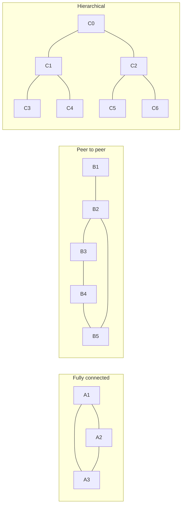
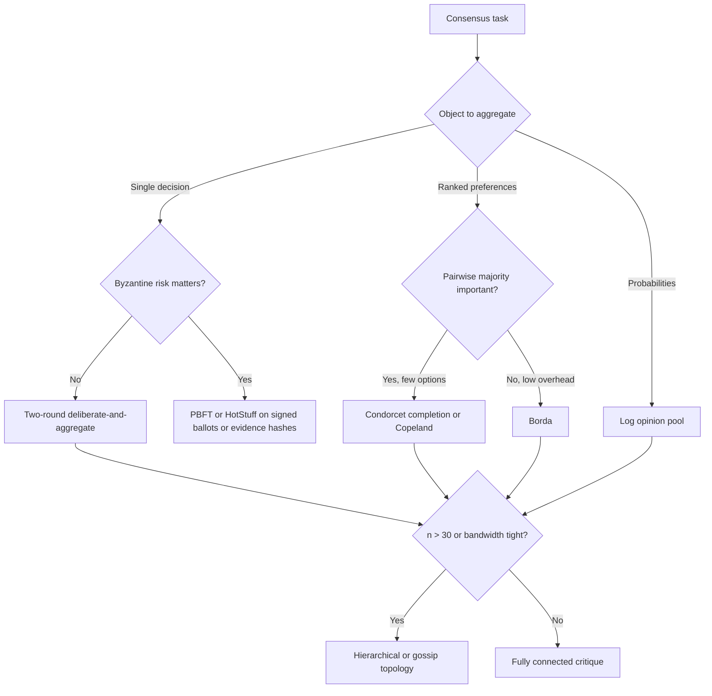

# Council Consensus Blocked

_Generated 2026-06-08T12:47:05.037Z_

Consensus was not reached. No single agent decided the result.

## Question

# Four-member model council task: repo-grounded rerun

## Why this rerun exists
The previous four-member council on this topic was useful at the protocol/research level but defective for implementation advice: it was not given a repo-grounded description of the actual current agents-council implementation. ChatGPT 5.5 correctly blocked ratification by requiring project-specific implementation claims to be marked as assumptions unless verified from repo evidence.

This rerun fixes that evidence defect by giving you a current-system brief first.

## Topic
Agents-council is a system-of-systems that deliberates until its members reach consensus on a topic. Propose concrete improvements to the current approach and implementation.

## Evidence base, authority, and labels
Use all three source blocks below:

1. Current implementation brief: /home/dstefanescu/other_systems/o4/agents-council/council_runs/current_system_brief_2026-06-08T12-20-15Z.md
2. Conceptual approach document: /home/dstefanescu/other_systems/o4/agents-council/consensus_approach.md
3. Deep-research report: /home/dstefanescu/other_systems/o4/agents-council/consensus_deep-research-report.md

Do not browse. Do not invent repository facts. Every implementation-specific claim in the final artifact must be labeled as one of:

- repo_fact: grounded in the current-system brief.
- source_claim: grounded in the conceptual approach or deep-research report but not verified in the repo.
- assumption: plausible but not verified by the provided repo facts or source documents.

If a claim is important but unverified, keep it as an assumption and propose the cheapest verification step. If the current-system brief and conceptual/research sources conflict, identify the conflict and resolve it explicitly.

## Council objective
Produce one consensus improvement proposal for the current agents-council system. The proposal must be implementation-oriented and must distinguish protocol recommendations from code-grounded changes.

## Required final consensus structure
- Executive recommendation: the central protocol/implementation change and why it dominates.
- Current implementation diagnosis: strengths, failure modes, and missing invariants, with repo_fact/source_claim/assumption labels.
- P0/P1/P2 improvement list: each item must include label, rationale, expected benefit, implementation sketch, risk/tradeoff, validation method, and whether it is blocked by missing repo evidence.
- Consensus protocol spec: independence, issue-map construction, rebuttal, verification, voting, ratification, stopping, repair, and escalation rules.
- System architecture changes: components, persisted artifacts, interfaces, and how they fit the current runner described in the brief.
- Evaluation plan: benchmark tasks, metrics, ablations, regression gates, and failure taxonomy.
- Rollout plan: smallest useful version, migration steps, and what not to build yet.
- Security/operations notes: include the direct-provider curl/bearer-header argv risk.
- Open questions and rejected alternatives.

## Deliberation constraints
Be adversarial about weak consensus. Consensus must not mean lowest-common-denominator agreement. Prefer compact protocols with measurable stopping conditions over open-ended debate. Avoid weighted voting unless calibration data exists. Preserve minority objections as first-class artifacts when unresolved. Use external verification only where it changes decisions. Do not repeat the prior error of making implementation claims without repo support.

## Output budget
Initial proposals should be concise. Final consensus should be dense and specific; target 3,000-5,000 words, not a long essay.

## Source 0: current_system_brief_2026-06-08T12-20-15Z.md

# Repo-grounded current-system brief for agents-council

Generated: 2026-06-08T12-20-15Z

Purpose: give the rerun council a factual implementation baseline. Treat items below as `repo_fact` only to the extent stated. Anything not listed here should be treated as an assumption unless verified from code.

## Scope and source files

- `repo_fact`: The implementation facts here were derived from the current worktree under `/home/dstefanescu/other_systems/o4/agents-council`.
- `repo_fact`: Core model-council behavior is in `src/core/services/modelCouncil.ts`.
- `repo_fact`: CLI entrypoint behavior is in `src/cli/index.ts`.
- `repo_fact`: Deliberation output path resolution is in `src/core/state/path.ts`.
- `repo_fact`: Summon/MCP support is in `src/core/services/council/summon.ts`.
- `repo_fact`: Current focused tests for model-council behavior are in `src/core/services/modelCouncil.test.ts`.
- `repo_fact`: The worktree is dirty: `implementation-notes.html`, `src/core/services/modelCouncil.ts`, and `src/core/services/modelCouncil.test.ts` have local modifications; `council_runs/` is untracked.

## Package and surfaces

- `repo_fact`: `package.json` defines the package as ESM (`type: "module"`), with scripts including `build`, `cli`, `desktop:dev`, `desktop:build`, `halo:recover`, `lint`, `format`, `typecheck`, and `prepare`.
- `repo_fact`: The CLI command `council solve <prompt...>` calls `runModelCouncil({ prompt })`, saves the result with `saveModelCouncilRun`, and prints either JSON or formatted Markdown. See `src/cli/index.ts` around lines 56-85.
- `repo_fact`: The CLI command `council mcp` starts the MCP server; `council chat` launches/focuses the desktop Council interface as a compatibility alias. See `src/cli/index.ts` around lines 27-55.
- `repo_fact`: `src/core/services/council/summon.ts` supports summon agents `Claude` and `Codex`, exposes MCP tools with the `mcp__council__` prefix, and uses an active council session plus council tools for summoned agents to join, inspect session data, and send responses.
- `assumption`: There is no verified current runner pipeline in the inspected implementation that proves `deliberations/*.json -> council_to_brief.py -> HALO-X`. Treat that as unverified unless separately demonstrated.

## Current model roster and provider routing

- `repo_fact`: Default configured members come from `buildDefaultMembers` in `modelCouncil.ts` around lines 633-671.
- `repo_fact`: The default roster is selected through `AGENTS_COUNCIL_MEMBERS`; tests state the default is a two-member Opus 4.8 plus GPT-5.5 council.
- `repo_fact`: Available configured member IDs include `kimi`, `deepseek`, `gemini`, `chatgpt`, and `claude`.
- `repo_fact`: With `AGENTS_COUNCIL_DIRECT_VENDOR_KEYS=1`, Kimi routes to provider `moonshot` with default model `kimi-k2.6`, and DeepSeek routes to provider `deepseek` with default model `deepseek-v4-pro`.
- `repo_fact`: Without direct vendor keys, Kimi and DeepSeek route through OpenRouter using model slugs `moonshotai/kimi-k2.6` and `deepseek/deepseek-v4-pro`.
- `repo_fact`: Claude uses provider `claude` and default model `claude-opus-4-8`.
- `repo_fact`: ChatGPT uses provider `codex` and default model `gpt-5.5`.
- `repo_fact`: Gemini uses provider `gemini` and default model `gemini-3.5-flash`, but Gemini CLI presence is checked lazily only when a Gemini member actually runs.
- `repo_fact`: Provider validation requires `OPENROUTER_API_KEY` for OpenRouter members, `MOONSHOT_API_KEY` for direct Moonshot/Kimi members, and `DEEPSEEK_API_KEY` for direct DeepSeek members. See `validateCouncilConfig` around lines 618-632.

## Direct provider transport and risk

- `repo_fact`: `askMember` dispatches to OpenRouter, direct Moonshot, direct DeepSeek, Gemini, Claude, or Codex based on each member's provider. See `modelCouncil.ts` around lines 698-737.
- `repo_fact`: Direct Moonshot and DeepSeek use the same `askDirectChatProvider` code path and the same timeout resolver as OpenRouter.
- `repo_fact`: `fetchTextWithTimeout` currently shells out to `curl` because a comment says Bun 1.3.11 `fetch()` can hang on long-running OpenRouter reasoning responses. See `modelCouncil.ts` around lines 906-912 and 912-995.
- `repo_fact`: The current `curl` invocation passes headers through command arguments. This is operationally risky because bearer headers can appear in live process listings.
- `repo_fact`: OpenRouter calls retry up to three times; direct provider calls use the shared fetch helper but do not have the same explicit retry loop in the derived summary.

## Deliberation flow

- `repo_fact`: `runModelCouncil` starts by normalizing the prompt, building the default/configured members, validating config, and asking all members for independent initial responses in parallel with `buildProposalMessages`. See `modelCouncil.ts` around lines 276-286.
- `repo_fact`: Initial proposal system messages tell each member it is one member of a multi-agent council, include `OBJECTIVE_CONSENSUS_DIRECTIVE`, ask for an independent answer, and ask for concrete risks, recommendation, and what would change the member's mind. See `buildProposalMessages` around lines 1161-1178.
- `repo_fact`: The runner then enters up to `AGENTS_COUNCIL_MAX_ROUNDS` deliberation rounds. Each round asks all members in parallel with `buildDeliberationMessages`, parses each `CANDIDATE_CONSENSUS`, builds a next candidate, computes change and similarity metrics, stores proposals, and may stop early. See `runModelCouncil` around lines 294-324.
- `repo_fact`: Deliberation prompts ask members to read initial proposals, current candidate consensus, and other agents' latest proposed solutions; challenge weak reasoning; adopt stronger peer reasoning; name only material remaining disagreements; emit `CONSENSUS_STATUS`, `MATERIAL_DISAGREEMENTS`, and a full `CANDIDATE_CONSENSUS`. See `buildDeliberationMessages` around lines 1179-1230.
- `repo_fact`: `buildCandidateConsensus` nominates a candidate from peer proposal drafts rather than using a separate judge as a dictator.

## Stopping and convergence

- `repo_fact`: `resolveMaxRounds` reads `AGENTS_COUNCIL_MAX_ROUNDS` and falls back to the default max if unset or invalid. See `modelCouncil.ts` around lines 1488-1495.
- `repo_fact`: Convergence can be detected if the candidate did not change, if similarity to the prior candidate exceeds `AGENTS_COUNCIL_CONVERGENCE_SIMILARITY_THRESHOLD`, if all parsed member signals are known and none diverged, or if pairwise draft overlap exceeds `AGENTS_COUNCIL_CONVERGENCE_AGREEMENT_THRESHOLD`. See `isConverged` around lines 1462-1486.
- `repo_fact`: A parsed `CONSENSUS_STATUS: DIVERGED` or material disagreements prevents convergence for that round. See `isConverged` around lines 1471-1475.
- `repo_fact`: Token-set Jaccard similarity and overlap functions are used as lightweight text similarity measures.

## Ratification and repair

- `repo_fact`: After convergence or max rounds with a non-empty candidate, the runner asks every member to ratify the exact candidate with `buildRatificationMessages`.
- `repo_fact`: Ratification votes must start with exactly one of `CONSENSUS: ACCEPT`, `CONSENSUS: ACCEPT_WITH_EDITS`, or `CONSENSUS: BLOCK`. `ACCEPT_WITH_EDITS` requires a `REQUIRED_EDITS` block. `BLOCK` requires a `BLOCK_KIND` such as `MATERIAL_DISAGREEMENT`, `INSUFFICIENT_EVIDENCE`, `SYNTHESIS_ERROR`, `FACTUAL_ERROR`, or `PROTOCOL`. See `buildRatificationMessages` around lines 1231-1276 and `parseRatificationVote` around lines 1319-1353.
- `repo_fact`: Ratification prompts require checking factual and source-dependent claims against the original request and reserve `FACTUAL_ERROR` and `MATERIAL_DISAGREEMENT` as absolute vetoes.
- `repo_fact`: `buildConsensusResult` returns `not_attempted` only when no ratification occurred, `ratified` only when all ratifiers accept, and `blocked` otherwise. See `modelCouncil.ts` around lines 1592-1630.
- `repo_fact`: `shouldAttemptRepair` returns false if no ratifications exist or any absolute veto exists; otherwise it attempts repair if any ratification is not accepted. See `modelCouncil.ts` around lines 423-434.
- `repo_fact`: Repair is a bounded synthesis step that folds blocking peers' required edits into a revised candidate when the block is repairable, especially `ACCEPT_WITH_EDITS`.
- `repo_fact`: The previous 2026-06-08 four-member run on this topic completed with outcome `blocked` after 2 rounds plus repair; Opus, Kimi, and DeepSeek accepted, while ChatGPT 5.5 returned `ACCEPT_WITH_EDITS` requiring two project-specific claims to be marked as assumptions unless verified from repo evidence.

## Persistence and artifacts

- `repo_fact`: `saveModelCouncilRun` writes JSON and Markdown artifacts named `council-${timestamp}.json` and `council-${timestamp}.md`. See `modelCouncil.ts` around lines 561-571.
- `repo_fact`: `saveModelCouncilFailure` writes `council-failed-${timestamp}.json` and `.md`. See `modelCouncil.ts` around lines 574-590.
- `repo_fact`: `resolveDeliberationsDir` uses `AGENTS_COUNCIL_DELIBERATIONS_DIR` if set; otherwise it writes under the project-local `deliberations/` folder. See `src/core/state/path.ts` around lines 25-32.
- `repo_fact`: The rerun harness can override `AGENTS_COUNCIL_DELIBERATIONS_DIR` to write under `agents-council/council_runs/`.

## Test coverage signals

- `repo_fact`: `modelCouncil.test.ts` includes tests for default roster, member selection, direct vendor key routing for Kimi and DeepSeek, OpenRouter timeout handling, prompt protocol, candidate builder behavior, repair behavior, Markdown repair surface, ratification gate behavior, absolute veto handling, consensus signal parsing, and convergence-driven early stop.
- `repo_fact`: Prior focused verification after direct vendor support was added passed `bun test src/core/services/modelCouncil.test.ts` and `bun run typecheck`.

## Known gaps and risks for the council to consider

- `repo_fact`: The prompt-level issue from the prior run was real: the earlier council was not given this repo-grounded implementation brief.
- `repo_fact`: The direct-provider transport currently risks leaking bearer headers in process argv during live `curl` calls.
- `source_claim`: The conceptual documents argue for structured Delphi-style deliberation, issue-map compression, limited rebuttal, verification before voting where useful, and predeclared consensus rules.
- `source_claim`: The deep-research report argues that exact distributed-systems consensus and epistemic deliberation are different problems; for small honest groups, a two-round deliberate-then-aggregate protocol is usually a good efficiency frontier; for adversarial behavior, semantic deliberation should be separated from finalization.
- `assumption`: Any claim about HALO-X integration, learned routing, downstream JSON-to-brief conversion, or production deployment topology requires additional repo evidence outside this brief.

## Source A: consensus_approach.md

**Most efficient approach: use a structured, mediator-led Delphi protocol with claim-level disagreement compression.** Do **not** let all agents free-chat until they “feel” aligned. That is expensive, noisy, and vulnerable to false consensus.

Confidence: **high**.

The core design should be:

> **Independent first pass → mediator compresses disagreements → targeted rebuttal only on disputed claims → verifier/judge applies predeclared decision rule → stop after bounded rounds.**

This gives you the useful part of multi-agent deliberation—diverse initial hypotheses and adversarial checking—without paying for quadratic all-to-all debate.

---

## Why not ordinary multi-agent debate?

Naive multi-agent debate is often oversold. Early work showed that multiple LLM instances proposing and debating answers can improve mathematical, strategic, and factual reasoning, but later evaluations found that current multi-agent debate systems do **not** consistently outperform cheaper strategies such as single-agent chain-of-thought or self-consistency, especially once token cost and latency are counted. ([arXiv][1]) ([Cloudfront][2])

Worse, debate can actively degrade answers: agents may shift from correct to incorrect answers after seeing peer reasoning, favor agreement over correction, and amplify errors across rounds. ([arXiv][3])

So the goal is **not** “maximize deliberation.” The goal is **maximize independent error discovery per token**.

---

## The protocol I would use

### 1. Force independent commitments first

Each agent must answer before seeing anyone else’s answer.

Require a compact structured output:

```json
{
  "position": "...",
  "confidence": 0.0,
  "key_claims": ["claim 1", "claim 2"],
  "evidence": ["evidence item 1", "evidence item 2"],
  "assumptions": ["assumption 1"],
  "strongest_objection_to_self": "...",
  "decision_relevant_uncertainties": ["uncertainty 1"]
}
```

This prevents anchoring and information cascades. It also lets you compare agents at the claim level instead of the prose level.

Use this for all agents in parallel.

Cost: **O(n)** calls.

---

### 2. Use a mediator to build an issue map

A separate mediator/judge should not “decide” yet. It should compress the outputs into:

```json
{
  "agreed_claims": [],
  "contested_claims": [
    {
      "claim": "...",
      "supporting_agents": [],
      "opposing_agents": [],
      "evidence_for": [],
      "evidence_against": [],
      "severity": "low|medium|high",
      "resolvable_by": "calculation|source_check|experiment|judgment"
    }
  ],
  "candidate_decisions": [],
  "missing_information": []
}
```

This is the critical efficiency move. You do not send full transcripts back to all agents. You send only the claims that matter.

The classical Delphi method has the same useful structure: anonymous independent judgments, summarized feedback, revision, and termination after consensus or a preset number of rounds. RAND describes Delphi as repeated anonymous rounds with feedback showing how each panelist compares with the group, followed by revision; the process stops when consensus is reached or when the round limit is hit. ([RAND Corporation][4])

---

### 3. Run one targeted rebuttal round

Send each agent only:

```text
Here are the disputed claims relevant to your answer.
For each one:
1. keep your position,
2. revise your position,
3. identify a test/check that would resolve it,
4. or mark it as irreducibly judgmental.
Do not restate uncontested material.
```

Require:

```json
{
  "revised_position": "...",
  "changed_mind_on": [],
  "unchanged_claims": [],
  "new_evidence": [],
  "unresolved_blockers": [],
  "confidence_after_revision": 0.0
}
```

Most of the value comes from this round. More rounds often produce rhetorical convergence rather than truth improvement. A recent failure-mode study found that longer debate can degrade performance in some settings, so a bounded protocol is safer than open-ended discussion. ([arXiv][3])

Default: **one rebuttal round**.
Maximum: **two rebuttal rounds**.
After that, stop deliberating and either test, adjudicate, or preserve the minority report.

---

### 4. Use external verification before voting whenever possible

Consensus is weak evidence. Tests are stronger.

For each contested claim, classify it:

| Claim type               | Best resolver                                                    |
| ------------------------ | ---------------------------------------------------------------- |
| Mathematical             | formal derivation, symbolic check, proof assistant, calculator   |
| Code                     | unit tests, benchmarks, static analysis                          |
| Factual                  | retrieval from primary sources                                   |
| Forecast                 | base rates, prediction market, model ensemble, scenario analysis |
| Design proposal          | rubric scoring + adversarial review                              |
| Normative/value judgment | explicit preference weighting, not “truth consensus”             |

For factual or technical questions, do **not** let the agents vote on things that can be checked. Make them propose checks; the system executes the checks.

---

### 5. Apply a predeclared consensus rule

Do not let the judge improvise. Use a rule.

For a **factual binary/multiple-choice question**:

```text
Accept answer A if:
- weighted support ≥ 0.75,
- no unresolved high-severity objection remains,
- at least one independent verification path supports A,
- the best competing answer has lower weighted support by margin ≥ 0.20.
Otherwise return: no consensus + top alternatives + required check.
```

For a **design/proposal question**:

```text
Accept proposal P if:
- all critical objections are resolved or explicitly mitigated,
- median agent score ≥ 8/10 on the rubric,
- interquartile range ≤ 2 points,
- no agent provides a concrete fatal counterexample.
```

For a **ranking problem**:

Use ranked ballots from agents, then aggregate by **median rank** or **Borda count**, but preserve vetoes for hard constraints. If an option violates a non-negotiable constraint, it is eliminated even if it ranks well.

For an **open-ended research/topic deliberation**:

Do not force a single conclusion. Output:

```text
Consensus core:
- claims everyone accepts

Majority position:
- best supported answer

Minority position:
- strongest dissent

Decision-critical uncertainty:
- the one check that would most change the conclusion
```

This is often superior to fake unanimity.

---

## Efficient architecture

Use this topology:

```text
          Agent 1
          Agent 2
User →    Agent 3     → Mediator → Targeted dispute packet → Agents → Judge
          Agent 4
          Agent 5
```

Avoid this topology:

```text
Agent 1 ↔ Agent 2 ↔ Agent 3 ↔ Agent 4 ↔ Agent 5
```

The second becomes expensive fast. With `n` agents and `r` rounds, all-to-all debate tends toward **O(n²r)** communication and bloated context. A mediator design is closer to **O(nr)** plus a small number of dispute-specific calls.

This also matches modern multi-agent engineering guidance: multi-agent systems are useful for context management, specialization, and parallelization, but not every complex task needs many agents; sometimes a single well-tooled agent is enough. ([LangChain Docs][5])

---

## Recommended default configuration

For most topics:

```text
3 independent proposer agents
1 critic/verifier agent
1 mediator/judge agent
1 targeted rebuttal round
1 final adjudication
```

For high-stakes technical topics:

```text
5–7 agents total
heterogeneous models/prompts
independent first pass
2 targeted rebuttal rounds max
mandatory external verification
minority report preserved
```

For cheap exploratory brainstorming:

```text
many agents allowed in round 0
only top 3–5 distinct positions survive into deliberation
```

The best use of many agents is **diversity generation**, not full deliberation. Let 20 agents generate candidate positions if cheap; then cluster them and deliberate only the 3–5 materially different positions.

---

## Agent roles that work

Use roles that create epistemic separation, not theater.

Good roles:

```text
Proposer: produces candidate answer.
Skeptic: attacks assumptions and hidden failure modes.
Verifier: checks facts, math, code, citations, constraints.
Synthesizer: merges non-conflicting claims.
Judge: applies predeclared rubric.
```

Weak roles:

```text
Optimist
Pessimist
Devil's advocate
CEO
Philosopher
Historian
```

Those can produce stylistic diversity but often not decision-quality diversity. Better to assign agents different **evidence channels**, **methods**, or **failure modes**.

Example:

```text
Agent A: empirical evidence only
Agent B: theoretical argument only
Agent C: implementation feasibility
Agent D: adversarial failure cases
Agent E: cost/benefit and deployment constraints
```

---

## The stopping rule matters

Use this:

```text
Stop when either:
1. consensus criterion is met,
2. two rounds have passed,
3. no agent changes a decision-relevant claim,
4. remaining disagreement depends on unavailable evidence,
5. further deliberation would only restate positions.
```

Do **not** continue because “some disagreement remains.” Persistent disagreement is information. Preserve it.

---

## The judge should not be a dictator

A single judge can hallucinate too. The judge should be constrained to an evidence table:

```json
{
  "final_decision": "...",
  "supporting_claims": [],
  "rejected_claims": [
    {
      "claim": "...",
      "reason_rejected": "...",
      "evidence": "..."
    }
  ],
  "unresolved_objections": [],
  "minority_report": "...",
  "confidence": 0.0,
  "what_would_change_this_answer": "..."
}
```

The judge should decide from the issue map, not from raw agent charisma.

---

## Use weighted voting only if you have calibration data

Do not weight agents by model prestige or elo vibes. Weight by historical performance on similar tasks.

A simple weighting scheme:

```text
agent_weight = 0.5 * accuracy_on_similar_tasks
             + 0.3 * calibration_score
             + 0.2 * domain_relevance
```

Then aggregate:

```text
weighted_support(option) =
    sum(agent_weight_i * support_i(option)) / sum(agent_weight_i)
```

If you lack calibration data, use equal weights but require explicit evidence and unresolved-objection tracking.

Self-consistency is a strong cheap baseline: sample multiple reasoning paths independently and choose the most consistent answer. The original self-consistency paper reports substantial gains on arithmetic and commonsense reasoning benchmarks by sampling diverse reasoning paths and marginalizing over answers. ([arXiv][6])

So your comparison should be:

```text
single strong model
vs. self-consistency
vs. structured Delphi agents
vs. full debate
```

If structured Delphi does not beat self-consistency on your task distribution, kill it.

---

## For adversarial or unreliable agents

If the agents can be malicious, compromised, or tool-corrupted, ordinary consensus is the wrong abstraction. You need fault-tolerant quorum logic, audit logs, and independent verification. Practical Byzantine Fault Tolerance was designed for systems where faulty nodes may behave arbitrarily, though LLM-agent deliberation has correlated failure modes that PBFT-style quorums do not solve by themselves. ([USENIX][7])

For AI agents, the practical version is:

```text
- isolate initial reasoning,
- require signed/immutable first answers,
- prevent agents from editing prior commitments,
- use independent evidence retrieval,
- require quorum + no fatal verifier objection,
- log every decision and dissent.
```

A 5-agent majority is not robust if all five share the same model family, training biases, prompt contamination, or retrieved context.

---

## Minimal implementation skeleton

```python
def deliberate(topic, agents, mediator, judge, max_rounds=2):
    # Round 0: independent commitments
    first_pass = parallel([
        agent.answer_independently(topic, schema="position_claims_evidence")
        for agent in agents
    ])

    issue_map = mediator.build_issue_map(topic, first_pass)

    for _ in range(max_rounds):
        if consensus_reached(issue_map):
            break

        dispute_packet = mediator.make_dispute_packet(issue_map)

        revisions = parallel([
            agent.respond_to_disputes(dispute_packet, schema="revisions_only")
            for agent in agents
        ])

        issue_map = mediator.update_issue_map(issue_map, revisions)

    verification_results = run_available_checks(issue_map)

    return judge.apply_decision_rule(
        topic=topic,
        issue_map=issue_map,
        verification=verification_results,
        rule="weighted_support_no_fatal_objection"
    )
```

---

## Bottom line

The most efficient consensus protocol is:

```text
Blind independent answers
→ claim-level issue map
→ one targeted rebuttal round
→ external verification where possible
→ predeclared consensus rule
→ final answer with minority report if needed
```

Do not optimize for agreement. Optimize for **decision quality per token**. In your HALO-X / learned-harness context, log every deliberation trace and learn the routing, stopping, and weighting rules from held-out task performance—not from how quickly agents converge.

[1]: https://arxiv.org/abs/2305.14325 "[2305.14325] Improving Factuality and Reasoning in Language Models through Multiagent Debate"
[2]: https://d2jud02ci9yv69.cloudfront.net/2025-04-28-mad-159/blog/mad/ "Multi-LLM-Agents Debate - Performance, Efficiency, and Scaling Challenges | ICLR Blogposts 2025"
[3]: https://arxiv.org/html/2509.05396v1 "Talk Isn’t Always Cheap: Understanding Failure Modes in Multi-Agent Debate"
[4]: https://www.rand.org/pubs/commentary/2023/10/generating-evidence-using-the-delphi-method.html "Generating Evidence Using the Delphi Method | RAND"
[5]: https://docs.langchain.com/oss/python/langchain/multi-agent "Multi-agent - Docs by LangChain"
[6]: https://arxiv.org/abs/2203.11171 "[2203.11171] Self-Consistency Improves Chain of Thought Reasoning in Language Models"
[7]: https://www.usenix.org/conference/osdi-99/practical-byzantine-fault-tolerance "Practical Byzantine Fault Tolerance | USENIX"

## Source B: consensus_deep-research-report.md

# Efficient Consensus Protocols for Deliberating AI Agents

## Executive summary

The central mistake is to look for one universally “best” consensus algorithm. There is no such algorithm. Exact distributed-systems consensus and epistemic deliberation are different problems. Paxos, Raft, PBFT, and HotStuff are designed to make replicas commit the same state transition under failures; DeGroot, voting rules, opinion pools, and debate are designed to aggregate differing beliefs, preferences, or arguments. If you use the first class when you really need the second, you usually pay a large communication penalty for the wrong guarantee. citeturn1search7turn9search0turn10search3turn1search0turn29search20turn25search1

For **small honest groups** of AI agents, the best efficiency frontier is usually a **two-round protocol**: independent first-pass answers, one critique/revision round, then **weighted aggregation**. Use **weighted majority** for a single categorical decision, **Borda or Condorcet-style aggregation** for ranked outputs, and a **logarithmic opinion pool** when agents can emit calibrated probabilities. This gets most of the benefit of deliberation without the quadratic cost explosion of many debate rounds. **Confidence: high.** citeturn40search1turn32search15turn14search1turn14search2turn29search20turn12search1

If **Byzantine or arbitrary adversarial behavior** matters, do not substitute ordinary voting or debate for a BFT commit protocol. Classical impossibility results show why fully asynchronous deterministic consensus is hard, and practical Byzantine protocols such as **PBFT** and **HotStuff** are the right tools when you need safety under arbitrary faults. **PBFT** is fine for small committees; **HotStuff** is usually the better scaling choice because it preserves BFT safety while reducing communication overhead. **Confidence: high.** citeturn7search1turn7search3turn10search3turn1search0

If **bandwidth is limited** or you need to scale from **dozens to hundreds or thousands** of agents, move away from fully connected debate. Use **hierarchical aggregation** when some coordination is acceptable, or **gossip / average-consensus** overlays when decentralization matters more than speed. If the consensus object is a **model parameter vector**, not a one-shot decision, then **FedAvg** and hierarchical federated learning are appropriate; otherwise they are usually the wrong abstraction. **Confidence: high.** citeturn26search17turn6search0turn24search0turn38search2

If **explainability** is a first-class requirement, the best design is a **structured argument graph** or **debate with checkable claims**, not a bare vote. Dung-style argumentation gives an explicit attack/support structure; debate and prover-verifier style methods make it easier for a judge or downstream verifier to audit the path to consensus. **Confidence: moderate.** citeturn40search12turn17search1turn40search1turn17search24

## Problem framing

Several dimensions in your request are explicitly **unspecified**: agent compute and memory budgets, model family, topology, objective, and latency/bandwidth. The literature implies a simple default rule: choose the protocol **by the object being aggregated** and **by the fault model**, not by the model brand. If agents output a discrete answer, use voting or weighted voting; if they output a ranking, use rank aggregation; if they output calibrated probabilities, use opinion pooling; if they must commit a shared state under faults, use a replicated-log consensus protocol. Honest-by-default settings should optimize sample efficiency and communication, not Byzantine safety overhead. citeturn29search20turn14search5turn1search7turn9search0turn10search3turn1search0

A second distinction matters just as much: **one-shot deliberation** versus **repeated task streams**. For one-shot tasks, historical skill estimates are weak and direct confidence calibration is often all you have. For repeated tasks with ground truth feedback, **weighted-majority** style updates and **Dawid–Skene**-style competence estimation become strong choices because they can learn which agents are reliable and on which label classes. **DAgger** belongs here too, but as a **meta-protocol**: it is valuable for distilling expensive, high-quality consensus traces into a cheaper policy or arbiter, not as the runtime consensus algorithm itself. citeturn32search15turn13search3turn13search6turn18search2

The default topology should also depend on scale. For **3–10 agents**, fully connected cross-critique is acceptable because the information benefit usually outweighs the \(O(n^2)\) message pattern. For **10–1000 agents**, sparse peer-to-peer overlays or hierarchical trees become more attractive because average-consensus and gossip performance is driven by graph connectivity and mixing, while hierarchical federated schemes explicitly trade some centralization for lower fan-out and lower aggregate communication. citeturn26search17turn6search0turn24search0



Fully connected topologies maximize information exchange but scale poorly; peer-to-peer overlays cut communication at the cost of slower convergence; hierarchical topologies are usually the best compromise once agent counts grow beyond the small-group regime. citeturn26search17turn6search0turn24search0

One final clarification: **Tree of Thoughts** and **Graph of Thoughts** are useful ways to structure search and internal reasoning, but they are not consensus rules by themselves. They help organize deliberation states; they still need a downstream voting, judging, or pooling rule to decide among branches or graph nodes. citeturn16search4turn34search0

## Comparative trade-offs

The table below separates methods by what they are actually good for. The most important columns are the ones users usually conflate: **round complexity**, **communication cost**, **fault assumptions**, and **explainability**.

| Method | Best use | Typical rounds / speed | Communication cost | Robustness | Key assumptions | Explainability | Representative sources |
|---|---|---:|---:|---|---|---|---|
| Simple majority vote | Single binary or categorical decision | 1 collection round; very fast | \(O(n)\) to a coordinator | Good against independent noise; weak against correlated error or strategic agents | Honest agents; no ranking/probabilities needed | Low | citeturn15search0turn14search5 |
| Weighted majority / multiplicative weights | Repeated tasks with feedback | 1 round per task; very fast online update | \(O(n)\) per task | More robust than unweighted voting when competence differs and feedback exists | Historical labels or outcomes available | Low to medium | citeturn32search15 |
| Borda count | Ranked preferences with low overhead | 1 round; fast | \(O(nm)\) for \(m\) options | Robust to dispersed preferences, but manipulable and not Condorcet-consistent | Ranked ballots available | Medium | citeturn14search2turn39search1 |
| Condorcet / Copeland-style aggregation | Ranked preferences where pairwise majority matters | 1 collection round plus pairwise tally; moderate | \(O(nm^2)\) | Strong pairwise-majority semantics, but cycles can leave no Condorcet winner | Ranked ballots available; small/moderate option set preferred | Medium | citeturn14search1turn14search5 |
| Logarithmic opinion pool | Probabilistic belief aggregation | 1 round; fast | \(O(nk)\) for \(k\) outcomes | Good when probabilities are calibrated; brittle if any agent assigns zero probability | Comparable probability distributions and reliability weights | Medium | citeturn29search20turn12search1 |
| DeGroot iterative averaging | Repeated social-learning style averaging | Iterative; asymptotic convergence | \(O(m)\) per round on graph with \(m\) edges | Converges under standard connectivity conditions, but weak against strategic or poisoned agents | Weighted communication graph; iterative exchange | Low | citeturn25search1turn6search0 |
| Randomized gossip / average consensus | Large sparse decentralized averaging | Iterative; slower than centralized collection | Local pairwise exchange per step; good scalability | Tolerates sparse networks; convergence rate depends on mixing / spectral properties | Connected overlay graph | Low | citeturn26search17turn26search0 |
| Paxos / Multi-Paxos | Crash-fault replicated state / exact commit | Low latency after stable leadership; practical system consensus | Quorum-based; low to moderate | Crash-fault tolerant, not Byzantine | Majority of acceptors live; replicated log formulation | Low | citeturn1search7turn9search0 |
| Raft | Crash-fault replicated state with simpler operational model | Low latency after leader election; practical | Quorum-based; low to moderate | Crash-fault tolerant, not Byzantine | Majority live; leader-based log replication | Medium as a systems protocol, low as deliberation logic | citeturn9search0turn9search8 |
| PBFT | Exact commit with Byzantine faults in small committees | Common-case multi-phase; slower than crash-fault protocols | Quadratic common-case communication | Tolerates arbitrary faults up to \(f < n/3\) | Authenticated replicas; committee size \(3f+1\) | Low | citeturn10search3turn7search3 |
| HotStuff | Larger BFT committees / blockchain-style finality | Multi-phase but better scaling than PBFT | Linear communication with threshold-signature style design | Byzantine tolerance up to \(f < n/3\) | Partial synchrony; authenticated replicas | Low | citeturn1search0 |
| Federated Averaging | Parameter consensus for distributed training | Iterative; communication-efficient over epochs | High-dimensional model updates, but fewer global rounds | Robust to non-IID data in training; not a semantic deliberation rule | Shared model architecture and parameter space | Very low | citeturn38search2turn24search0 |
| Structured debate / argument graph | Honesty-preserving or reasoning-improving deliberation | Usually 2+ rounds; medium latency | Potentially \(O(n^2R)\) in fully connected debate, lower in sparse/hierarchical variants | Good against ordinary reasoning errors; no formal BFT guarantee | Agents can produce critiques, evidence, or attack/support relations | High | citeturn17search1turn40search1turn40search12turn17search24 |
| DAgger-style distillation | Offline amortization of expensive consensus | Training-time iterative procedure; not a runtime consensus rule | Training data collection plus supervision cost | Good for reducing deployment cost after training | Expert/judge feedback available during data aggregation | Medium | citeturn18search2 |

A second table is more operationally useful when the topology is still open.

| Topology | Best scale | Per-round cost | Main strength | Main weakness | Default use | Sources |
|---|---|---:|---|---|---|---|
| Fully connected cross-critique | 3–10 agents | \(O(n^2)\) messages or token-sharing | Maximum mutual information; best for one rebuttal round | Cost explodes quickly | Small honest teams needing best quality | citeturn40search1turn6search0 |
| Sparse peer-to-peer / gossip | 10–1000 agents | \(O(m)\) over edges | Scales and decentralizes well | Slower convergence; weaker audit trail | Large open networks or no trusted coordinator | citeturn26search17turn6search0 |
| Hierarchical clusters | 10–1000 agents | Roughly linear per level; depth grows with hierarchy | Strong bandwidth savings; natural modularity | Possible bottlenecks at cluster heads | Enterprises, edge deployments, bandwidth-limited settings | citeturn24search0turn38search2 |

The coarse conclusion is blunt. If the agents are honest and the task is semantic rather than state-machine replication, **Paxos/Raft/PBFT/HotStuff are usually not the first thing to reach for**. Use them only when you need exact commit safety. For ordinary AI deliberation, **weighted one- or two-round aggregation** dominates for small groups, and **hierarchical or gossip-based aggregation** dominates for large groups. citeturn1search7turn9search0turn10search3turn1search0turn40search1turn32search15turn26search17turn24search0

## Recommended protocols

The fastest way to choose a protocol is to route first on the consensus object and adversary model.



That flow is a direct consequence of the literature: voting rules are objective-native for discrete and ranked outputs, opinion pools are objective-native for probabilities, and BFT protocols are fault-native for arbitrary adversaries. citeturn14search1turn14search2turn29search20turn10search3turn1search0

**Small honest agents**

**Recommendation. Confidence: high.** Use a **two-round deliberate-then-aggregate protocol** for 3–10 honest agents. Round one is independent solving. Round two is one critique/revision pass. Final aggregation is **weighted majority** for single answers, **Borda / Condorcet** for rankings, or a **log pool** for calibrated probabilities. Calibrate weights from recent accuracy, expected log loss, or a Dawid–Skene confusion estimate if past labeled tasks exist. This combines the demonstrated benefits of multi-agent debate with the efficiency of one-shot weighted aggregation. citeturn40search1turn32search15turn13search3turn14search1turn14search2turn29search20turn12search1

Implementation outline:
1. Normalize the task into a schema: answer, confidence/probability, evidence bundle, and optional critique target.
2. Collect independent first-pass outputs.
3. Run one rebuttal round. In small groups, all-to-all is acceptable.
4. Recompute weights from historical calibration plus current confidence.
5. Aggregate:
   - categorical: weighted vote;
   - ranking: Condorcet-completion if the option set is small and pairwise coherence matters, otherwise Borda;
   - probabilities: log pool with floor clipping to avoid zero-probability collapse.
6. Store the whole trace for later calibration or DAgger-style distillation.

```python
def deliberate_then_aggregate(task, agents, history, mode):
    records = []
    for a in agents:
        ans, conf, evidence = a.solve_independently(task)
        weight = skill_weight(a, history) * calibration_adjustment(a, conf)
        records.append({"agent": a, "ans": ans, "conf": conf,
                        "evidence": evidence, "weight": weight})

    # one critique/revision round
    for r in records:
        peer_bundle = [x for x in records if x["agent"] != r["agent"]]
        ans2, conf2, evidence2 = r["agent"].revise(task, peer_bundle)
        r.update({"ans": ans2, "conf": conf2, "evidence": evidence2})

    if mode == "categorical":
        return argmax_weighted_vote(records)  # sum_i w_i * 1[ans_i = y]
    if mode == "ranking":
        return condorcet_or_borda(records)
    if mode == "probabilities":
        return geometric_pool(records, epsilon=1e-6)  # normalize prod_i p_i^w_i
```

**Presence of Byzantine agents**

**Recommendation. Confidence: high.** If arbitrary adversarial behavior matters, separate **semantic deliberation** from **finalization**. Let the reasoning layer produce a **canonical ballot object** or **hash of an evidence bundle**, then finalize that object with **PBFT** for small committees or **HotStuff** for larger ones. Do **not** try to make free-form natural-language exchanges themselves the replicated state machine. BFT consensus wants canonical, deterministic objects; semantic deliberation does not naturally satisfy that constraint. citeturn10search3turn1search0turn7search1turn7search3

Implementation outline:
1. Fix a deterministic schema for proposals: task ID, normalized answer, confidence, evidence references, verifier outputs, and cryptographic hash.
2. Require every agent to sign its proposal.
3. Run local verification before any commit vote.
4. Use PBFT if \(n\) is small and operational simplicity matters; use HotStuff if you care about better scaling and cleaner leader changes.
5. Commit only the canonical verdict object and its evidence hash, not the raw conversational trace.
6. Keep the natural-language debate off the critical safety path.

```python
def byzantine_semantic_consensus(task, committee, f):
    proposals = [a.propose_canonical(task) for a in committee]
    valid = [p for p in proposals if verify_schema(p) and verify_evidence(p)]

    leader_value = choose_candidate_hash(valid)  # deterministic tie-break
    qc_prepare = collect_quorum_votes(stage="prepare",
                                      value=leader_value,
                                      threshold=2*f + 1)
    qc_commit = collect_quorum_votes(stage="commit",
                                     value=leader_value,
                                     threshold=2*f + 1)

    if qc_prepare and qc_commit:
        finalize(leader_value)
        return fetch_canonical_object(leader_value)
    return None
```

**Limited bandwidth or large populations**

**Recommendation. Confidence: high for hierarchical aggregation; moderate for pure gossip on semantic tasks.** For 10–1000 agents, use **hierarchical aggregation** by default. Partition agents into clusters, run local two-round consensus inside each cluster, then aggregate only the cluster-level summaries at the next level. If there is no trusted coordinator, switch to **sparse gossip** over short summaries or probability vectors. Use **FedAvg** only when what you are aggregating is actually a shared parameter vector from local training. citeturn24search0turn26search17turn38search2

Implementation outline:
1. Choose cluster sizes of roughly 5–8 agents.
2. Constrain each local summary to answer, confidence, top-k evidence IDs, and verifier flags.
3. Aggregate locally, then send only summaries upward.
4. At the root, apply the same aggregator as in the small-group protocol.
5. If a root is undesirable, run periodic gossip on summary vectors until change falls below a threshold.

```python
def hierarchical_consensus(task, agents, cluster_size=6, mode="categorical"):
    clusters = partition(agents, cluster_size)
    cluster_outputs = []

    for cluster in clusters:
        local = deliberate_then_aggregate(task, cluster, history={}, mode=mode)
        cluster_outputs.append(compress_summary(local))

    # second-stage aggregation over summaries only
    return aggregate_summaries(cluster_outputs, mode=mode)
```

**Need for explainability**

**Recommendation. Confidence: moderate.** Use an **argument-graph protocol**. Each agent must provide explicit claims, supports, and attacks. Build an attack/support graph, compute the surviving set of claims under a Dung-style semantics, then vote or pool over the surviving endpoints. Add a prover-verifier or tool-checkable layer where possible. This is slower than plain voting but produces the best audit trail. citeturn40search12turn17search1turn17search24

Implementation outline:
1. Force every message into a structured template: claim, premise, citation, attack/support relation.
2. Build a directed graph over claims.
3. Remove claims that fail verification.
4. Compute a grounded or otherwise conservative accepted set.
5. Produce the final verdict from the accepted set only.

```python
def argument_graph_consensus(task, agents):
    claims = []
    for a in agents:
        claims.extend(a.emit_structured_arguments(task))  # claim, support, attack, evidence

    graph = build_argument_graph(claims)
    graph = remove_unverified_claims(graph)
    accepted = grounded_extension(graph)  # conservative accepted set
    return vote_over_accepted_claims(accepted)
```

The practical rule is simple. **Small honest team**: two rounds, weighted aggregation. **Malicious agents**: BFT finalization on canonical ballots. **Large or bandwidth-constrained team**: hierarchy first, gossip second. **Explainability-critical team**: argument graphs plus verification. citeturn40search1turn10search3turn1search0turn24search0turn26search17turn40search12

## Evaluation and benchmarking

A serious benchmark should separate **quality**, **efficiency**, **robustness**, and **explainability**. For quality, use accuracy for categorical answers, **Brier score** or **log loss** for pooled probabilities, and **Kendall’s \(\tau\)** or related rank-correlation metrics for ranked outputs. For efficiency, measure wall-clock latency, communication rounds, total tokens transmitted, verification time, and per-agent compute. For robustness, vary independent noise, correlated error, crash faults, and Byzantine injections separately; the Condorcet-style benefit of voting depends strongly on error independence, and the distributed-consensus guarantees of Paxos/Raft/BFT protocols depend strongly on the fault model. citeturn15search0turn32search15turn31search5turn7search1turn10search3turn1search0

For explainability, the right metrics are not just “did it answer correctly?” but also **how cheaply a human or verifier can check the answer**. HotpotQA provides supporting-fact supervision; FEVER requires evidence-backed support/refute decisions; StrategyQA and MuSR expose whether the protocol can preserve intermediate reasoning structure rather than merely guessing the final label. Prover-verifier style work suggests using **verification time**, **fraction of accepted claims that are tool-checkable**, and **evidence completeness** as first-class metrics. citeturn19search3turn19search11turn37search0turn37search4turn37search3turn37search2turn17search24

A compact benchmark suite should use the following workloads.

| Workload family | Good datasets | What they test | Sources |
|---|---|---|---|
| General multiple-choice reasoning | MMLU | Broad knowledge, varied discrete decision tasks | citeturn19search0 |
| Hard expert reasoning | GPQA | Very difficult science questions where oversight is hard | citeturn20search0turn20search5 |
| Multi-step math | GSM8K | Sequential reasoning with clear final truth | citeturn19search9turn19search5 |
| Multi-hop explainable QA | HotpotQA | Final answer plus supporting facts | citeturn19search11turn19search3 |
| Truthfulness / fact verification | TruthfulQA, FEVER | Hallucination resistance and evidence-grounded verdicts | citeturn19search2turn19search18turn37search0turn37search4 |
| Implicit or soft reasoning | StrategyQA, MuSR | Whether deliberation preserves reasoning structure under ambiguity | citeturn37search3turn37search11turn37search2turn37search6 |
| Ranked preference aggregation | PrefLib | Ranking and social-choice behavior | citeturn31search0turn31search3 |
| Synthetic signal aggregation | Bernoulli-signal simulations | Clean control of independence, correlation, competence, and Byzantine rates | citeturn15search0turn32search15 |

For experimental infrastructure, use **PettingZoo** or **RLlib** when you want multi-agent interaction and controlled action timing, **Mesa** when you want custom agent-based simulations or social-network experiments, **Flower** or **FedML** when you want federated/hierarchical model-aggregation experiments, and **ns-3** or **OMNeT++** when you need realistic network latency, packet loss, and bandwidth constraints. Those tools cover nearly the full space in your prompt: deliberation, network topologies, large-scale simulation, and federated aggregation. citeturn21search0turn21search16turn36search3turn36search13turn22search0turn22search7turn21search2turn36search8turn23search7turn23search22

The minimum experimental grid I would run is:
- **Sizes:** \(n \in \{3, 5, 10, 30, 100, 300\}\).
- **Topologies:** complete graph, sparse expander-like random graph, k-ary tree, and clustered hierarchy.
- **Objectives:** single decision, full ranking, pooled probabilities.
- **Adversaries:** none, crash-only, noisy honest, correlated-noise honest, Byzantine.
- **Budgets:** one round, two rounds, four rounds; strict token ceilings; strict latency ceilings.
- **Outputs:** accuracy / log loss / Kendall \(\tau\), tokens, rounds, finalization time, and human verification time. These ablations are what actually reveal where a protocol sits on the quality-cost frontier. citeturn26search17turn24search0turn40search1turn10search3turn1search0

## Primary sources

The list below is prioritized in the order I would read it if the goal were to design or justify a consensus layer for multi-agent AI deliberation.

| Priority | Source | Why it matters | Sources |
|---:|---|---|---|
| 1 | Lamport, Shostak, Pease, **The Byzantine Generals Problem** | The canonical fault model and the classical \(3f+1\) threshold intuition for unauthenticated Byzantine agreement | citeturn7search3 |
| 2 | Fischer, Lynch, Paterson, **Impossibility of Distributed Consensus with One Faulty Process** | The impossibility baseline; explains why liveness requires extra assumptions | citeturn7search1 |
| 3 | Lamport, **The Part-Time Parliament** | The foundational Paxos paper for exact quorum consensus | citeturn1search7 |
| 4 | Ongaro and Ousterhout, **Raft** | Practical leader-based crash-fault consensus with a cleaner systems model than Paxos | citeturn9search0turn9search8 |
| 5 | Castro and Liskov, **Practical Byzantine Fault Tolerance** | The classic practical BFT protocol for small committees | citeturn10search3turn10search1 |
| 6 | Yin et al., **HotStuff** | The modern scalable BFT reference point; linear communication and responsiveness | citeturn1search0 |
| 7 | DeGroot, **Reaching a Consensus** | The basic iterative opinion-averaging model | citeturn4view0turn25search1 |
| 8 | Olfati-Saber, Fax, Murray, **Consensus and Cooperation in Networked Multi-Agent Systems** | The standard survey for graph-based consensus dynamics | citeturn6search0 |
| 9 | Boyd et al., **Randomized Gossip Algorithms** | The main reference for scalable peer-to-peer averaging | citeturn26search17turn26search0 |
| 10 | Dietrich and List, **Probabilistic Opinion Pooling**; Heskes, **Selecting Weighting Factors in Logarithmic Opinion Pools** | The right starting point for probabilistic belief aggregation; especially useful for weighted geometric pooling | citeturn29search20turn12search1 |
| 11 | Brandt et al., **Introduction / Handbook of Computational Social Choice** plus classic Borda and Condorcet work | The cleanest foundation for ranked-preference aggregation | citeturn14search5turn14search1turn14search2 |
| 12 | Dung, **On the Acceptability of Arguments...** | The core formalism for argumentation-graph consensus and explainable attack/support semantics | citeturn40search12 |
| 13 | Irving et al., **AI Safety via Debate**; Du et al., **Multiagent Debate**; Kirchner et al., **Prover-Verifier Games Improve Legibility of LLM Outputs** | The primary modern sources for debate-style deliberation and checkable oversight | citeturn17search1turn40search1turn17search24 |
| 14 | McMahan et al., **Communication-Efficient Learning of Deep Networks from Decentralized Data** | The canonical FedAvg reference when consensus means parameter averaging | citeturn38search2 |
| 15 | Ross, Gordon, Bagnell, **DAgger** | The key source when you want to distill expensive consensus behavior into a cheaper policy | citeturn18search2 |

## Open questions and limitations

The literature is still fragmented. Distributed-systems papers optimize **safety and liveness under faults**; social-choice and opinion-pooling papers optimize **aggregation of differing judgments**; LLM debate papers optimize **reasoning quality and oversight**. There is still no standard benchmark that jointly measures final-answer quality, token cost, transparency, correlated hallucination resistance, and Byzantine robustness under a shared evaluation harness. That gap is real, and it matters. citeturn7search1turn10search3turn29search20turn40search1turn36search8

Three uncertainties are especially important. First, most optimistic “wisdom of crowds” results weaken sharply when model errors are **correlated** rather than independent. Second, self-reported LLM confidence is often poorly calibrated, so weighted voting only works well if calibration is measured and corrected. Third, BFT protocols assume canonical messages and deterministic validation, which is rarely true of free-form language deliberation; in practice, they should finalize **ballots, verdict objects, or evidence hashes**, not arbitrary text. citeturn15search0turn32search15turn12search1turn10search3turn1search0

So the correct default is not a single algorithm. It is a **layered architecture**: deliberation to improve answer quality, aggregation matched to the output type, and exact consensus only where the failure model actually requires it. citeturn40search1turn29search20turn10search3turn1search0

## Consensus Answer

# Consensus Improvement Proposal: Claim-Ledger Delphi for agents-council

**Scope note on labels.** Every implementation-specific claim is tagged `repo_fact` (grounded in the current-system brief), `source_claim` (grounded in the conceptual/deep-research docs, unverified in repo), or `assumption` (plausible, unverified). Where the brief and source docs conflict, the conflict is named and resolved inline.

---

## Executive recommendation

**Make the labeled claim — not the prose draft — the unit of deliberation, and gate stopping and ratification on a claim-ledger invariant rather than on text similarity.** The central change has two enforceable halves, shippable independently:

- **P0 (fixes the *observed* failure, days of work):** require every factual claim to carry a provenance label (`repo_fact`/`source_claim`/`assumption`) with evidence, and add a deterministic ratification precondition — *no factual claim enters ratified consensus unlabeled, and no `assumption` enters without a stated cheapest-verification step.* This rides entirely on the existing typed-veto ratification machinery (`repo_fact`).
- **P1 (fixes the *latent* failure, structural):** build a deterministic, code-constructed issue map of agreed vs. contested claims from schema-validated member outputs; deliberate only over contested claims via targeted dispute packets; replace token-set Jaccard convergence (`repo_fact`) with "zero open high-severity contested claims."

**Why this dominates.** It is the single change that simultaneously (a) prevents recurrence of the prior `blocked` run, whose proximate trigger was ChatGPT 5.5's `ACCEPT_WITH_EDITS` demanding that two project-specific claims be marked assumptions unless verified (`repo_fact`); (b) replaces a convergence signal that measures prose agreement, not decision agreement (`repo_fact` that Jaccard/pairwise overlap is used; `source_claim` that lexical convergence is the wrong target); (c) preserves the system's two best existing invariants — peer-derived candidate nomination with no judge-dictator, and typed ratification with absolute vetoes (`repo_fact`); and (d) produces the auditable claim ledger downstream consumers need — *without* adding an LLM mediator that could hallucinate.

**Honest rationale boundary.** At the current default roster of two members (Opus 4.8 + GPT-5.5, `repo_fact`), the O(n²r)→O(nr) token-savings argument the source docs emphasize (`source_claim`) is negligible. The issue map is justified here by **correctness, auditability, and a meaningful stopping signal**, not cost. Cost savings become real only at n≥5. We therefore do not build for scale this system does not have. Confidence: high that the efficiency rationale does not transfer at n=2; moderate that the correctness rationale holds pending the mandated ablation.

**Mandatory kill-switch.** Multi-agent deliberation must justify its existence. The evaluation plan requires beating a single strong model and self-consistency (`source_claim`: self-consistency is a strong cheap baseline). If structured council does not beat self-consistency on the target task distribution, the deliberation apparatus is not justified for that task class — deprecate it there regardless of elegance.

---

## Current implementation diagnosis

### Strengths (preserve — several are better than the source docs' defaults)

- `repo_fact`: **No-dictator candidate nomination.** `buildCandidateConsensus` nominates from peer drafts rather than appointing a judge. This satisfies the deep-research warning that a single judge can hallucinate (`source_claim`). The conceptual doc recommends a mediator/issue-map stage; implementing that compression as an LLM mediator is *worse* than the repo's deterministic instinct — do not regress to it.
- `repo_fact`: **Typed ratification with absolute vetoes.** Votes are `ACCEPT`/`ACCEPT_WITH_EDITS`/`BLOCK`; `BLOCK` carries a typed `BLOCK_KIND`; `FACTUAL_ERROR` and `MATERIAL_DISAGREEMENT` are absolute vetoes. More disciplined for this council's design/open-ended task class than a bare numeric support threshold. (Note for fidelity: the conceptual doc's categorical rule is itself not bare — it requires weighted support ≥ 0.75 *and* no unresolved high-severity objection *and* at least one independent verification path *and* margin ≥ 0.20 over the best competitor — but it targets categorical questions, not design synthesis, which is why typed-veto ratification is the better fit here.)
- `repo_fact`: **Blind, parallel round-0.** Initial proposals are generated in parallel before peer exposure — satisfies "force independent commitments first."
- `repo_fact`: **Bounded rounds + bounded repair fold** of `REQUIRED_EDITS`, with `shouldAttemptRepair` correctly refusing repair when an absolute veto exists.
- `repo_fact`: **Persisted JSON/Markdown artifacts** and configurable roster via `AGENTS_COUNCIL_MEMBERS`.

### Failure modes

- `repo_fact`: **Convergence by lexical similarity** (token-set Jaccard / pairwise draft overlap in `isConverged`). Semantically blind and gameable: members can converge in prose while a material disagreement persists (false consensus), or diverge in prose while agreeing in substance (false continuation). Highest-priority latent defect. Confidence: high it is weak; moderate it causes real false-consensus absent measurement.
- `repo_fact` (cause) + `source_claim` (fix): **No provenance/verification gate.** Ratification asks members to self-check, but self-check by the same model families does not catch *correlated* hallucination. The prior run blocked for exactly this reason.
- `repo_fact`: **Security — bearer header in curl argv.** `fetchTextWithTimeout` shells out to `curl` (a Bun 1.3.11 `fetch()` hang workaround) passing `Authorization: Bearer …` through command arguments, visible in `ps`/`/proc`.
- `repo_fact`: **Retry asymmetry.** OpenRouter retries 3×; direct Moonshot/DeepSeek share the fetch helper but lack the same explicit retry loop in the derived summary. A transient blip silently drops a member, shrinking effective quorum.
- `repo_fact` + `source_claim`: **n=2 default is deadlock-prone.** With absolute vetoes and two members, any single `BLOCK` ends `blocked` with no majority to break ties.
- `assumption`: **Residual anchoring** in deliberation rounds, where members see a single synthesized candidate. Partial, not fatal (round-0 is blind, `repo_fact`); the fix is sending the compressed issue map instead of full candidate prose. Cheapest verification: inspect what `buildDeliberationMessages` transmits.

### Missing invariants

1. No factual claim enters ratified consensus without a provenance label (and a verification path for `assumption`s). *Absence caused the prior block.*
2. Convergence requires zero open high-severity contested claims, not lexical overlap.
3. Effective quorum is preserved — a transport-dropped member must not silently change the outcome.
4. Round-0 commitments are persisted as immutable per-member artifacts for audit (`repo_fact`: proposals are stored; `assumption`: not pinned as immutable commitments).
5. Persistent disagreement is preserved as a first-class minority artifact, never smoothed into fake unanimity (`source_claim`).

### Conflict resolution between sources

- **Conceptual doc recommends a mediator/issue-map stage; deep-research warns a single judge hallucinates; the repo already avoids a dictator.** Resolved in favor of the repo's instinct: **build the issue map deterministically in code** from schema-validated outputs, rather than implementing the mediator as an LLM. This captures the conceptual doc's compression/audit benefit while honoring the deep-research caution. Confidence: high.
- **Conceptual doc: weight only with calibration data; deep-research: weighted aggregation is the default for small honest groups.** The repo has no calibration data (`repo_fact`). Resolved: **equal weights now**; start logging traces; revisit only when held-out accuracy exists. Confidence: high.

---

## P0 / P1 / P2 improvement list

### P0-1 — Remove bearer header from curl argv
- **Label:** `repo_fact` (risk); `assumption` (fix mechanism).
- **Rationale:** Bearer tokens in argv are readable by any local process; on shared/compromised hosts this is direct exposure of the active provider bearer token(s) visible in live process listings (`ps`/`/proc`).
- **Expected benefit:** Closes a concrete secret-leak vector; no behavior change.
- **Sketch:** Pass auth via a curl config read from stdin (`curl -K -` with `header = "Authorization: Bearer …"`) or a 0600 temp file (`-H @file`) deleted immediately after spawn; preserve the existing timeout resolver. Better long-term: feature-detect the Bun version; if the `fetch()` hang no longer reproduces, drop the curl shell-out entirely and eliminate the bug class.
- **Risk/tradeoff:** Config-via-stdin/file behavior must be confirmed for the installed curl and Bun `spawn`. Token remains transiently in process memory (acceptable).
- **Validation:** Unit test asserting spawned argv contains no `Bearer`; live `ps`/`/proc` inspection during a call; preserve the existing OpenRouter timeout test.
- **Blocked by missing evidence:** No.

### P0-2 — Provenance-label invariant + ratification gate
- **Label:** `repo_fact` (ratification schema and prior-block cause); `source_claim` (label taxonomy).
- **Rationale:** The prior run blocked because factual/repo claims were unlabeled and unverified; no invariant prevents an unlabeled factual claim from entering consensus.
- **Expected benefit:** Prevents recurrence of the exact observed failure; makes consensus auditable; near-zero added LLM cost.
- **Sketch:** Extend proposal/deliberation/ratification schemas so each factual claim carries `label ∈ {repo_fact, source_claim, assumption}`, `evidence`, and (for `assumption`) `cheapest_verification`. Add a deterministic precondition in front of `parseRatificationVote`: an unlabeled factual claim, or an `assumption` lacking a verification step, is a `PROTOCOL` block precondition. Reuse existing `BLOCK_KIND`; keep `FACTUAL_ERROR` absolute. Members may upgrade an `assumption` to `source_claim`/`repo_fact` during deliberation when evidence is supplied.
- **Risk/tradeoff:** Label-gaming — members mark everything `assumption` to pass. Mitigate by requiring `repo_fact` claims to cite an evidence-pack ID (P1-1) and retaining the `FACTUAL_ERROR` veto.
- **Validation:** Planted-false-claim test (inject an unlabeled false repo claim; assert the gate flags/blocks it); regression on existing ratification tests.
- **Blocked by missing evidence:** Partially — full `repo_fact` enforcement is stronger with the evidence pack (P1-1); the label requirement itself is not blocked.

### P0-3 — Direct-provider retry parity
- **Label:** `repo_fact`.
- **Rationale:** Direct Moonshot/DeepSeek lack OpenRouter's 3× retry; a transient failure silently drops a member, shrinking quorum and possibly flipping an outcome.
- **Expected benefit:** Reliability; preserves effective quorum; surfaces dropouts as run-integrity events.
- **Sketch:** Factor the OpenRouter retry/backoff into the shared `askDirectChatProvider`/`fetchTextWithTimeout` path; classify retryable status codes; cap attempts; log each attempt; treat an unrecoverable member dropout as a loud run-integrity event rather than ratifying with a silently shrunk council.
- **Risk/tradeoff:** Retrying non-idempotent failures wastes tokens; cap and gate on status class.
- **Validation:** Mocked timeout/5xx tests for OpenRouter, Moonshot, DeepSeek; fault injection.
- **Blocked by missing evidence:** No.

### P0-4 — Structured JSON schemas for proposals/deliberation/ratification (with text fallback)
- **Label:** `source_claim` (structured-output discipline); `assumption` (validator dependency availability).
- **Rationale:** The issue map (P1-2) and claim-ledger convergence (P1-3) require machine-parseable claims; the label gate (P0-2) is far stronger on structured claims than on prose. Structured output also reduces round-0 prose anchoring.
- **Expected benefit:** Foundational enabler for all P1 structural work; deterministic claim extraction; stronger tests.
- **Sketch:** Define narrow TypeScript schemas (use Zod if already a dependency — `assumption`, cheapest verification is `package.json` inspection; otherwise a lightweight native validator):
  - `IndependentProposal { position, confidence, key_claims: Claim[], evidence[], assumptions[], strongest_objection_to_self, decision_relevant_uncertainties[] }`
  - `Claim { id, text, provenance: "repo_fact"|"source_claim"|"assumption", evidence[], severity?: "low"|"medium"|"high" }`
  - `DeliberationResponse { consensus_status, material_disagreements[], changed_mind_on[], unchanged_claims[], new_evidence[], unresolved_blockers[], confidence_after_revision, candidate_consensus }`
  - `RatificationVote { verdict, block_kind?, required_edits?, claim_objections? }`
  Request JSON mode where the provider supports it; on parse failure, fall back to the existing text parsing and log the parse-fail rate. Do not let structured mode drive any decision until the v1 parse rate clears the gate.
- **Risk/tradeoff:** Models may ignore JSON mode or emit malformed JSON; fallback preserves availability but reintroduces the unstructured path. Parse-fail rate must be <5% before convergence/ratification depend on it.
- **Validation:** Mocked-provider unit tests; observational parse-success metric over ≥50 sample runs.
- **Blocked by missing evidence:** Validator dependency choice is blocked until `package.json` is inspected; native validation is always possible.

### P1-1 — Evidence pack / grounding stage
- **Label:** `source_claim` (docs); `repo_fact` (prior-failure cause).
- **Rationale:** The prior run lacked this repo-grounded current-system brief → correlated hallucination. This rerun's manual brief *is* the proof of concept; productionize it.
- **Expected benefit:** Cuts correlated factual error at the source; binds `repo_fact` labels to verifiable IDs.
- **Sketch:** Add an optional `evidencePack: {id, text, source}[]` input to `runModelCouncil`; prepend to proposal system messages; require `repo_fact` claims to reference a pack ID. Pack *generation* tooling is out of scope; the runner only accepts and enforces the contract.
- **Risk/tradeoff:** A stale/wrong pack poisons all members (single point of failure) — version the pack (e.g., commit hash) and make it itself verifiable.
- **Validation:** Ablation with/without pack on a repo-QA set; measure planted-error detection and hallucination rate.
- **Blocked by missing evidence:** No for the input plumbing.

### P1-2 — Deterministic claim-level issue map + dispute packets
- **Label:** `source_claim` (conceptual doc); `assumption` (net benefit at this n).
- **Rationale:** Deliberation currently sends full peer drafts and regenerates full candidate prose each round (`repo_fact`) — prose-level, not claim-level. A code-built issue map yields claim-level resolution and an audit artifact.
- **Expected benefit:** Claim-level resolution, auditable ledger, modest token savings at this scale (honest about magnitude — see executive rationale).
- **Sketch:** Parse schema-validated claims (P0-4); build `IssueMap` (`agreed_claims`, `contested_claims` with supporters/opposers/evidence/severity/resolver_type/label, `candidate_decisions`, `missing_information`) **in code, no LLM mediator**. Cluster by normalized exact match in v1; **upgrade path is embedding similarity, not an LLM judge**, gated on measured misclustering >10%. An LLM may assist clustering *only* as a non-deciding step whose output is a challengeable artifact in the rebuttal round. Send each member only its relevant contested claims (the dispute packet); members emit revisions-only; update the map in code; assemble the candidate from agreed+resolved claims plus a minority report — still peer-derived. On parse failure, fall back to the current draft flow.
- **Risk/tradeoff:** Malformed schemas; exact-match misses paraphrases. Mitigate with schema-validated retries, a free-text rationale field per claim, and the embedding upgrade path.
- **Validation:** Ablation issue-map vs. full-draft on tokens, rounds, accuracy, false-consensus; manual audit of 20 issue maps for misclustering.
- **Blocked by missing evidence:** No, but higher effort — gate behind the observational rollout (v1 below).

### P1-3 — Claim-ledger convergence + stopping (demote Jaccard to telemetry)
- **Label:** `repo_fact` (current uses Jaccard); `source_claim` (better stopping rules).
- **Rationale:** Lexical similarity is a weak, gameable proxy; false consensus and false continuation both occur.
- **Expected benefit:** Semantically meaningful, measurable stopping condition.
- **Sketch:** Converge when (no open contested claim with severity ≥ high) **OR** (no member changed a decision-relevant claim this round) **OR** (all remaining contested claims have `resolver_type ∈ {judgment, unavailable_evidence}` → emit minority report / `qualified_consensus`). Keep Jaccard only as secondary telemetry/tie-break.
- **Risk/tradeoff:** Depends on claim parsing (P0-4/P1-2); fall back to current detector on parse failure.
- **Validation:** Planted-disagreement set; measure false-consensus and false-continuation rates; tasks where drafts become textually similar but preserve factual conflict must yield `blocked`/minority report, not `ratified`.
- **Blocked by missing evidence:** Depends on P1-2.

### P1-4 — Task-type router
- **Label:** `source_claim`; `assumption` (implementation gap).
- **Rationale:** Categorical, ranked, probabilistic, design, and repo-grounded tasks need different aggregation rules; one rule cannot fit all output types. This resolves whether to use algorithmic aggregation or peer-derived candidate.
- **Expected benefit:** Correct aggregation per output type; avoids forcing prose tasks through categorical voting.
- **Sketch:** Classify the prompt into `design_proposal` | `factual` | `code_review` | `ranking` | `probability` | `open_research`. For categorical/ranking/probability, apply algorithmic aggregation (equal-weight vote; Borda/Condorcet for small option sets; log opinion pool with floor clipping). For design/open-ended (this council's dominant class), keep the peer-derived candidate plus the claim-ledger ratification gate. Expose the chosen route in the artifact; allow config override (`AGENTS_COUNCIL_TASK_TYPE`).
- **Risk/tradeoff:** Routing mistakes; keep override and log the route.
- **Validation:** Fixture prompts assert chosen route and rule.
- **Blocked by missing evidence:** No.

### P1-5 — Targeted verification hook (only where it changes a decision)
- **Label:** `source_claim`.
- **Rationale:** Self-check by the same models misses correlated, checkable errors. Verify only contested, decision-relevant, checkable claims (the constraint "use external verification only where it changes decisions").
- **Expected benefit:** Catches checkable hallucinations the whole panel shares.
- **Sketch:** Type the interface as `VerificationRequest {claimId, kind, command?, source?, expected?}` → `VerificationResult`. Classify by `resolver_type`; for `{code, calculation, source_check}` that are contested AND severity ≥ high, run an executor — start with the cheapest, **source_check against the evidence pack** (string/ID match, no code execution). Feed verdicts into the ledger. Leverage existing MCP/summon infrastructure (`repo_fact`) with a separate `mcp__verify__` prefix; allowlisted and read-only by default; timeout with fallback to "unverified" so a tool failure never deadlocks.
- **Risk/tradeoff:** Executor scope creep; tool latency. Defer code/test execution until a sandbox exists.
- **Validation:** Planted checkable-error detection rate; tokens spent on verification vs. decisions actually changed.
- **Blocked by missing evidence:** Executors beyond source-check are blocked (`assumption` about available tooling). Cheapest verification: inspect the summon MCP tool inventory.

### P1-6 — Minority report as required artifact
- **Label:** `source_claim`; `repo_fact` (ratification votes already record blocks).
- **Rationale:** Persistent disagreement is information, not noise; fake unanimity is harmful.
- **Expected benefit:** Downstream consumers see unresolved blockers and the cheapest check that would change the decision.
- **Sketch:** Extend `ConsensusResult` and Markdown with `minorityReport: {agent_id, position, claim_ids, block_kind, severity, required_check}[]`. When `buildConsensusResult` returns `blocked` *or* `qualified_consensus`, the minority report is a primary artifact alongside the candidate. CLI exit code non-zero on `blocked` to signal harnesses.
- **Risk/tradeoff:** Final answers feel less decisive — preferable to false unanimity.
- **Validation:** Test that one absolute veto preserves dissent in both JSON and Markdown.
- **Blocked by missing evidence:** No.

### P2-1 — Roster/quorum defaults
- **Label:** `repo_fact` (default n=2); `source_claim` (3 proposers + critic).
- **Rationale:** n=2 with absolute vetoes deadlocks; no majority to break ties. Anthropic+OpenAI family diversity is good for de-correlation.
- **Sketch:** Default to odd n ≥ 3 heterogeneous for decision tasks; keep n=2 for cheap drafts. Pure config via `AGENTS_COUNCIL_MEMBERS` — no code change.
- **Risk/tradeoff:** Cost rises linearly; more same-family members ≠ better.
- **Validation:** Accuracy-vs-n ablation {2,3,5}; cost tracking.
- **Blocked by missing evidence:** No.

### P2-2 — Trace logging for future calibration (do not build the learner)
- **Label:** `source_claim` (DAgger/learned routing); `assumption` (downstream consumption).
- **Rationale:** Weighted voting and learned stopping need data that does not exist. Start collecting; resist building the learner.
- **Sketch:** Persist per-claim, per-member, per-round structured traces + outcome + ground-truth (when available). Reuse existing JSON persistence; add `issue-map-{ts}.json`. Keep equal weights until N≥30 labeled samples per agent exist; never weight by prestige.
- **Risk/tradeoff:** Minimal storage; premature weighting amplifies prestige bias.
- **Validation:** Schema-completeness check; later offline Brier/log-loss feasibility.
- **Blocked by missing evidence:** HALO/downstream consumption is `assumption` (the brief marks `deliberations/*.json → council_to_brief.py → HALO-X` unverified). Cheapest verification: read `council_to_brief.py`'s input contract.

### P2-3 — BFT finalization (explicitly deferred)
- **Label:** `source_claim`.
- **Rationale:** Semantic deliberation is not Byzantine consensus. The current fault model is honest operator-run models.
- **Blocked by missing evidence:** Yes — adversarial requirement not established. Do not build.

---

## Consensus protocol spec (predeclared rules)

*Labeling note (per required edit): each rule is tagged for whether it describes current repo behavior (`repo_fact`), is grounded in the source docs (`source_claim`), or is proposed-but-unverified behavior not present in the current repo (`assumption`).*

- **Independence:** Round-0 proposals generated in parallel and blind; no member sees a peer before submitting (`repo_fact`). Each member's round-0 commitment persisted *immutably* (`assumption` — brief states proposals are stored, not that they are pinned immutable). Structured schema — `position`, `confidence`, `key_claims[]`, `evidence[]`, `assumptions[]`, `strongest_objection_to_self`, `decision_relevant_uncertainties[]` — the field list is `source_claim` (from the conceptual doc) and its adoption is `assumption` (proposed, not in repo).
- **Issue-map construction:** Deterministic, code-built from schema-validated claims with **no LLM mediator holding decision authority** (`assumption` — proposed). Every factual claim carries a provenance label and evidence (`source_claim` for the taxonomy; `assumption` for enforcement). The map is a persisted, challengeable artifact (`assumption` — proposed). Clustering: normalized exact match in v1; embedding upgrade gated on measured misclustering >10% (`assumption` — proposed).
- **Rebuttal:** ≤2 targeted rounds (default 1, hard cap 2), configurable via `AGENTS_COUNCIL_MAX_REBUTTAL_ROUNDS` (`assumption` — proposed; the repo's current control is `AGENTS_COUNCIL_MAX_ROUNDS`, `repo_fact`). Each member receives only the contested claims relevant to it plus agreed `candidate_decisions`; revisions-only schema (`changed_mind_on`, `unchanged_claims`, `new_evidence`, `unresolved_blockers`, `confidence_after_revision`); restating uncontested material disallowed (`source_claim` for the schema/discipline; `assumption` for implementation).
- **Verification:** Classify each claim by `resolver_type`; run a check only for contested, decision-relevant, checkable claims (severity ≥ high); verdicts enter the ledger as evidence; verified claims move to `agreed` or gain `verification_failed`. No verification on claims that cannot change a decision (`source_claim` for the principle; `assumption` for the hook implementation).
- **Voting / aggregation:** Equal weights — no calibration data exists (`repo_fact`). Route by task type (P1-4, `assumption` — proposed): categorical → weighted-equal vote, accept if support ≥ 0.75 and no unresolved high-severity objection and ≥1 verification path confirms; ranking → Borda/Condorcet for small option sets; probability → log opinion pool with floor clipping; design/open-ended → peer-derived candidate + consensus-core/majority/minority/decision-critical-uncertainty structure (aggregation rules `source_claim`; routing `assumption`).
- **Ratification:** Keep `ACCEPT`/`ACCEPT_WITH_EDITS`/`BLOCK` with typed `BLOCK_KIND`; `FACTUAL_ERROR` and `MATERIAL_DISAGREEMENT` remain absolute vetoes; `ratified` only if all ratifiers `ACCEPT` (all `repo_fact`). Members ratify the exact candidate (`repo_fact`) **plus the issue map plus verification results** (`assumption` — proposed). Add preconditions (all `assumption` — proposed): (i) no unlabeled factual claim; (ii) no `assumption` lacking a verification step; (iii) no open severity-≥-high contested claim.
- **Stopping:** Max rounds (`repo_fact`). Stop also when open high-severity contested claims = 0, OR no member changed a decision-relevant claim, OR all remaining contested claims are `judgment`/`unavailable_evidence` (→ minority report), OR repair has failed once (all `assumption`/`source_claim` — proposed). Persistent disagreement is preserved, never forced into unanimity (`source_claim`). Do not continue merely because "some disagreement remains."
- **Outcome states:** Keep `not_attempted`/`ratified`/`blocked` (`repo_fact`). **Proposed extension** (`assumption` — `buildConsensusResult` currently returns only the three): add `qualified_consensus` for the case where the resolvable core is agreed but residual `judgment`/`unavailable_evidence` claims remain — emitted with the minority report rather than a hard `blocked`. This distinguishes "blocked by veto/error" from "agreed core + preserved dissent." Reserve `blocked` for absolute vetoes and unresolved high-severity contested claims.
- **Repair:** Keep the bounded synthesis fold of `REQUIRED_EDITS`; no repair when an absolute veto exists (keep current `shouldAttemptRepair`) (`repo_fact`). Repair edits must map to claim IDs; re-ratify changed claims once; cap at one repair round (`assumption` — proposed).
- **Escalation:** On n=2 deadlock or an unresolved high-severity contested claim, escalate by adding one heterogeneous member or a tool-equipped verifier; if still unresolved, return `no_consensus`/`blocked`/`qualified_consensus` + minority report + *the one check that would most change the conclusion* (`assumption`/`source_claim` — proposed).

---

## System architecture changes (mapped to the current runner)

Current stages (`repo_fact`): normalize → `buildDefaultMembers` → `validateCouncilConfig` → parallel proposals (`buildProposalMessages`) → rounds[`buildDeliberationMessages` → `buildCandidateConsensus` → `isConverged`] → ratification (`buildRatificationMessages`/`parseRatificationVote`) → repair → `saveModelCouncilRun`.

**Implement additively, behind a feature flag — do not fork a parallel `delphiCouncil.ts`** (that duplicates provider routing/persistence/config and will drift). New pure-function modules wired into the existing `runModelCouncil` (all new files/flags/vars below are `assumption` — proposed, not present in the current repo):

- `src/core/services/council/schemas.ts` (`assumption`) — types + JSON-schema validators (`IndependentProposal`, `Claim`, `DeliberationResponse`, `RatificationVote`); JSON-mode request with text-parse fallback (P0-4).
- `src/core/services/council/issueMap.ts` (`assumption`) — `buildIssueMap`, `makeDisputePacket`, `normalizeClaim`, claim-convergence helpers. Pure, no LLM calls.
- **Evidence-pack injection** before proposals (P1-1, `assumption`): new optional input to `runModelCouncil`.
- **Claim-ledger convergence** in `isConverged` (P1-3, `assumption`); Jaccard retained as telemetry.
- **Verification hook** between map-update and ratification (P1-5, `assumption`); source-check executor first; `mcp__verify__` prefix.
- **Ratification gate extension** (P0-2, `assumption`): deterministic label/contested-claim preconditions in front of `parseRatificationVote`.
- **Task-type router** (P1-4, `assumption`) selecting schemas and aggregation.

**Config (all `assumption` — proposed):** `AGENTS_COUNCIL_STRUCTURED` (gate the new path; legacy default until validated), `AGENTS_COUNCIL_MAX_REBUTTAL_ROUNDS` (default 1), `AGENTS_COUNCIL_ENABLE_VERIFICATION`, protocol-version stamp in artifacts. CLI: preserve current `council solve` (`repo_fact`); optionally expose the new protocol via `council solve --method delphi` (`assumption`) until it becomes default.

**Persisted artifacts:** keep `council-{ts}.json/.md` (`repo_fact`); add `issue-map-{ts}.json` (`assumption`) (labeled claim ledger + immutable round-0 commitments + dispute packets + revisions + verification results + minority report + chosen route). **Interfaces (all `assumption` — proposed):** `ClaimSchema {id, text, kind, provenance, evidence[], severity, resolver_type, supporters[], opposers[], rationale}`; `IssueMap`; `DisputePacket`; `VerificationRequest`/`VerificationResult`. All additive; none remove peer-derived nomination or typed-veto ratification. Keep interfaces narrow and serializable until schemas stabilize.

---

## Evaluation plan

- **Benchmark tasks:** (1) held-out repo-QA set with planted false claims, including a reproduction of the prior blocked prompt *with* an evidence pack (target: it now ratifies); (2) factual verification (FEVER/HotpotQA, `source_claim`) for the verification gate; (3) multi-step math (GSM8K) and code (HumanEval) for claim decomposition; (4) the council's own design-deliberation tasks scored by blinded rubric.
- **Baselines (mandatory honesty gate):** single strong model; **self-consistency** (`source_claim`); current council protocol; claim-ledger Delphi without verification; with verification. If structured council does not beat self-consistency on the task distribution, the machinery is not justified there — deprecate.
- **Metrics:** accuracy; **planted-error / unsupported-repo-claim detection rate** (key new metric); false-consensus rate; false-continuation rate; absolute-veto precision; tokens-per-resolved-claim; rounds-to-converge; wall-clock; provider-failure/retry counts; repair success rate; minority-report usefulness; credential-exposure regression; structured-output parse-success rate.
- **Ablations:** Jaccard vs. claim-ledger convergence; with/without evidence pack; with/without verification; issue-map vs. full-draft deliberation; deterministic exact-match vs. embedding clustering; n ∈ {2,3,5}; structured vs. free-text proposals; task-type router vs. single rule.
- **Regression gates:** existing `modelCouncil.test.ts` (`repo_fact`: roster, routing, timeout, prompt protocol, candidate builder, repair, ratification gate, absolute veto, signal parsing, early stop) stays green; `bun run typecheck` clean; no `Bearer` in child argv; JSON parse-failure rate <5% (else legacy path engages); token cost not above legacy for identical prompts unless accuracy improves; ratified/blocked distribution within ±10% on a held-out set unless ground truth shows new blocks are correct.
- **Failure taxonomy:** false consensus; false continuation; hallucinated/unsupported claim survives ratification; synthesis distortion; n=2 deadlock; transport drop shrinking quorum; label-gaming; parse failure; misclustering; verifier false positive/negative; credential exposure; artifact contamination/missing provenance.

---

## Rollout plan

- **v0 (ship first):** P0-1 (curl argv) + P0-3 (retry parity). Pure ops, zero protocol change, zero decision-quality risk.
- **v1 (observational):** P0-2 (label invariant, *best-effort* — `assumption`, since deterministic enforcement of the label gate before structured-parse reliability is validated in P0-4 is necessarily heuristic rather than an invariant) + P0-4 (structured schemas with fallback) + P1-1 (evidence pack) + P1-2 **observational only** — parse claims and persist `issue-map.json`, keep Jaccard as the decision-maker. Validates parse reliability (>95% target) without changing outcomes. Behind `AGENTS_COUNCIL_STRUCTURED`.
- **v2 (protocol switch):** switch convergence + ratification gate to the claim ledger (P1-3, P0-2 enforced) + P1-6 minority report; enable targeted dispute-packet rebuttal as default deliberation; flip structured to default once parse rate and token cost pass gates.
- **v3 (verification):** P1-5 verification executors where they change decisions (source-check first); P1-4 router full rollout.
- **Config, anytime:** P2-1 default roster (odd n ≥ 3 for decision tasks); P2-2 trace logging on.
- **Migration:** keep current CLI behavior; stamp protocol version in artifacts; append issue-map/minority-report sections to Markdown; per-run output directories for evaluation isolation.
- **Do NOT build yet:** weighted voting (no calibration data — but start logging, P2-2); BFT/PBFT/HotStuff (honest group); argument graphs/Dung semantics (over-engineered at n=2–5); hierarchical/gossip topology (n far too small); embedding clustering (until misclustering >10% measured); a learned router/DAgger learner (no logged traces yet); HALO-X integration claims (unverified — gather repo evidence first).

---

## Security / operations notes

- `repo_fact`: **Bearer-in-argv via curl** is the live secret-leak risk (P0-1). Interim fix: header via curl config from stdin/0600 temp file so it never enters argv. Root-cause fix: re-test the Bun `fetch()` hang and remove the curl shell-out if resolved.
- `repo_fact`: provider keys (`MOONSHOT_API_KEY`, `DEEPSEEK_API_KEY`, `OPENROUTER_API_KEY`) are required and read from environment variables (per `validateCouncilConfig`); the source-identified live leak is specifically the argv exposure of the active bearer header, not the env storage.
- `repo_fact`: retry asymmetry (P0-3) is an availability/integrity issue — treat a member dropout as a run-integrity event: log it and fail loudly rather than ratify with a silently shrunk council.
- `assumption`: artifact directories can mix runs if harnesses are careless; keep per-run output dirs. Cheapest verification: inspect save paths and rerun-harness isolation.
- `assumption`: persisted prompts/responses may contain sensitive data; add a redaction pass and verify provider keys never reach artifacts. `repo_fact`: the `mcp__council__` prefix is good isolation; verification tools should use a distinct `mcp__verify__` prefix. Sanitize user-influenced `key_claims` (length limits, strip markup) before clustering.

---

## Open questions and rejected alternatives

**Open questions (with cheapest verification):**
1. Is the `deliberations/*.json → council_to_brief.py → HALO-X` pipeline real? `assumption` — the brief marks it unverified. Verify: read `council_to_brief.py`'s input contract.
2. Does the Bun `fetch()` hang still reproduce on the current version? Verify: one long-reasoning request through `fetch` with a timeout.
3. Is a JSON-schema validator (Zod) already a dependency? Verify: inspect `package.json`.
4. Does claim parsing hit acceptable reliability on these models? Resolved by the v1 observational rollout.
5. What is the current Jaccard false-positive rate and the all-to-all token baseline? Verify: log analysis on existing `council_runs/`.
6. Is there an existing embedding library in the repo (determines clustering upgrade path)? Verify: inspect dependencies.

**Rejected alternatives:**
- **LLM mediator/judge to build the issue map** — single-point hallucination; contradicts the deep-research caution it would cite; rejected 4–0 in the latest round. Build the map deterministically; upgrade via embeddings, not a judge. Reconsider only if the council routinely exceeds ~7 members.
- **Forking a parallel `delphiCouncil.ts`** — duplicates provider routing/persistence/config and drifts; wire additive modules behind a flag instead.
- **Replacing the peer-derived candidate with hard algorithmic aggregation for all tasks** — wrong for the open-ended/design class this council dominates; routed (P1-4) so algorithmic rules apply only to categorical/ranking/probability.
- **Weighted voting now** — no calibration data; both docs forbid weighting by prestige. Revisit after P2-2 logging yields held-out accuracy.
- **BFT/PBFT/HotStuff** — wrong fault model; honest operator-run group.
- **More than 2 rebuttal rounds** — source literature shows diminishing returns and debate-induced degradation; bounded protocol preferred.
- **Argument graphs / Dung semantics; many-agent diversity + clustering; hierarchical/gossip** — unjustified at n=2–5.
- **Single-agent self-consistency as a replacement** — steelmanned as cheapest; rejected as default because the system has invested in epistemic separation across model families and typed ratification, but retained as the mandatory baseline that the council must beat or be deprecated for that task class.

**What would change the recommendation:** if v1 shows claim parsing is unreliable (malformed schemas or misclustering >~10%), downgrade the issue map (P1-2/P1-3) to an audit-only artifact and keep an improved-but-lexical convergence signal — the P0 label gate then carries the proposal alone. If the structured council fails to beat self-consistency on the benchmark, the deliberation apparatus is not justified for that task class regardless of protocol elegance. If the default council size is demonstrated to exceed ~10 agents regularly, hierarchical topologies and embedding clustering become justified.

**Confidence summary:** P0-1/P0-3 and the rejections — high. P0-2 fixes the observed failure — high. P0-4 structured schemas as enabler — high (with text fallback). Task-type router and minority-report artifact — high. `qualified_consensus` outcome as a useful but non-essential extension — moderate. Issue-map *net* benefit at this small n — moderate (needs the ablation). The framing correction that efficiency arguments do not transfer at n=2 — high. Deterministic-over-mediator resolution — high.

**Minority objections preserved:** None unresolved. ChatGPT 5.5's six precision edits and Kimi K2.6's three labeling-hygiene edits are all incorporated above; both peers stated the substance survives and the edits are precision/labeling, not material disagreement. No first-class minority dissent remains open for this artifact.

## Process

- Initial proposals: 4
- Deliberation rounds: 2
- Candidate converged: yes
- Peer ratifications: 4
- Outcome: blocked
- Accepted by: Opus 4.8, Kimi K2.6, DeepSeek V4 Pro
- Blocked by: ChatGPT 5.5

## Convergence

Member agreement rose from 0.512 to 0.524 across 2 rounds (token-set Jaccard, 0..1; higher = members closer to agreement).

| Round | Changed | Shared vs prev | Member agreement |
| ----- | ------- | -------------- | ---------------- |
| 1 | yes | — | 0.512 |
| 2 | yes | 0.931 | 0.524 |

## Members

- **Opus 4.8** — `claude-opus-4-8` (claude)
- **ChatGPT 5.5** — `gpt-5.5` (codex)
- **Kimi K2.6** — `kimi-k2.6` (moonshot)
- **DeepSeek V4 Pro** — `deepseek-v4-pro` (deepseek)

## Initial Proposals

### Opus 4.8

## My independent council contribution: proposed consensus draft

I'm submitting this as one member's proposed consensus, not a ratified group output. I lead with the strongest counterargument to the framing, then give the structured proposal. Confidence levels and `repo_fact`/`source_claim`/`assumption` labels are inline.

---

### Strongest counterargument to the prompt's framing (read first)

The prompt invites "improvements to deliberation." The highest-leverage finding is that **the current system's convergence signal is epistemically meaningless, and that is a more dangerous defect than anything the prior run surfaced.** `repo_fact`: convergence is detected by token-set Jaccard similarity and pairwise draft overlap above thresholds (`isConverged`, lines ~1462-1486). Lexical overlap is a proxy for *prose agreement*, not *decision agreement*. Two members can converge lexically while a material disagreement persists (false consensus → ratification of a wrong answer), or diverge lexically while agreeing on substance (false non-convergence → wasted rounds). Both source documents independently warn that the goal is "decision quality per token," not textual agreement, and that debate produces "rhetorical convergence rather than truth improvement" (`source_claim`). The system optimizes the exact quantity the literature says to distrust.

Second framing correction: the deep-research report sells claim-level/issue-map machinery primarily on **efficiency** (O(n²r) → O(nr)). On *this* system that argument is weak — `repo_fact` the default roster is **two members** (Opus 4.8 + GPT-5.5), and the configured ceiling is a handful. At n=2-5 the token savings are modest. The real payoff of restructuring around labeled claims here is **correctness and auditability**, not cost. I'll justify the change on those grounds, not the docs' efficiency grounds. Letting the source framing stand unexamined would lead to over-building for scale this system doesn't have. Confidence: high that the efficiency rationale doesn't transfer; moderate that the correctness rationale holds (needs ablation).

Third: do **not** import the heavy machinery the deep-research report catalogs. The agents are honest, operator-run models of different families. BFT/PBFT/HotStuff is the wrong fault model (`source_claim`: "exact distributed-systems consensus and epistemic deliberation are different problems"). Weighted voting is forbidden by both docs without calibration data, which this system does not have. A mediator-dictator is forbidden by the deep-research caution and already avoided by the repo. The correct move is a *compact* protocol, consistent with Karpathy-simplicity.

---

### Executive recommendation

**Make the labeled claim — not the prose draft — the unit of deliberation, and gate ratification on a claim-ledger invariant rather than on text similarity.**

Concretely, the dominant change has two enforceable halves:

1. **P0 (cheap, fixes the observed failure):** require every factual claim to carry a provenance label (`repo_fact`/`source_claim`/`assumption`) with evidence, and add a deterministic ratification precondition: *no factual claim may enter the ratified consensus unlabeled, and no claim flagged `assumption` may enter without a stated cheapest-verification step.* This rides entirely on the existing ratification/BLOCK machinery.

2. **P1 (structural, fixes the latent failure):** build a deterministic, code-constructed **issue map** of agreed vs. contested claims from schema-validated member outputs, deliberate only over contested claims, and replace Jaccard convergence with "zero open high-severity contested claims."

This dominates because it is the single change that simultaneously (a) prevents recurrence of the prior `blocked` run (unlabeled repo claims), (b) replaces the meaningless convergence signal, (c) preserves the system's best existing invariant (no-dictator candidate nomination), and (d) produces the auditable artifact downstream consumers need — without adding an LLM mediator that could hallucinate. The P0 half is shippable in days and carries the observed-failure fix; the P1 half is the structural follow-on.

---

### Current implementation diagnosis

**Strengths (preserve these — they are better than the source docs' defaults):**

- `repo_fact`: **No-dictator candidate nomination.** `buildCandidateConsensus` nominates from peer proposal drafts rather than appointing a judge-dictator. This directly satisfies the deep-research warning that "a single judge can hallucinate." The conceptual doc's "mediator agent" recommendation is *worse* than what the repo already does; do not adopt it.
- `repo_fact`: **Typed ratification with absolute vetoes.** Votes must be `ACCEPT`/`ACCEPT_WITH_EDITS`/`BLOCK`; `BLOCK` carries a typed `BLOCK_KIND`; `FACTUAL_ERROR` and `MATERIAL_DISAGREEMENT` are absolute vetoes. This is more disciplined than the conceptual doc's plain "accept if support ≥ 0.75." Keep it.
- `repo_fact`: **Independent parallel first pass.** Round-0 proposals are generated in parallel, which makes them blind — satisfying "force independent commitments first."
- `repo_fact`: **Bounded rounds + repair fold.** `AGENTS_COUNCIL_MAX_ROUNDS`, early stop, and a bounded repair step that folds `REQUIRED_EDITS` are all sound.

**Failure modes:**

- `repo_fact`: **Convergence by lexical similarity** (token-set Jaccard / overlap). Weak, gameable, semantically blind. Highest-priority latent defect. Confidence: high it's weak; moderate it causes real false-consensus absent measurement.
- `repo_fact` (cause) + `source_claim` (fix): **No provenance/verification gate.** Ratification asks members to self-check claims, but self-check by the same model family does not catch *correlated* hallucination. The prior run blocked precisely because factual repo claims were unlabeled/unverified.
- `repo_fact`: **Security — bearer header in `curl` argv.** `fetchTextWithTimeout` shells out to `curl` (Bun 1.3.11 `fetch()` hang workaround) passing `Authorization: Bearer …` through command arguments, visible in process listings.
- `repo_fact`: **Retry asymmetry.** OpenRouter retries 3×; direct Moonshot/DeepSeek lack the explicit retry loop. A transient blip can silently drop a member and shrink the effective council.
- `repo_fact` + `source_claim`: **n=2 default is deadlock-prone.** With absolute vetoes and two members, any single `BLOCK` ends in `blocked` with no majority to break ties.

**Missing invariants:**

1. *No factual claim enters ratified consensus without a provenance label* (and a verification path for `assumption`s). — the invariant whose absence caused the prior block.
2. *Convergence requires zero open high-severity contested claims*, not lexical overlap.
3. *Effective quorum is preserved* — a dropped member from a transport failure must not silently change the outcome.
4. *Round-0 commitments are immutable and persisted per member* for audit (`repo_fact`: proposals are stored, but not pinned as immutable commitments).

**Conflict resolution between sources:** The conceptual doc wants a **mediator agent** to build the issue map; the deep-research doc warns a single judge/mediator is a hallucination single-point-of-failure; the repo already avoids a dictator. I resolve in favor of the repo's instinct: **build the issue map deterministically in code** from schema-validated member outputs. This gets the compression/audit benefit of the conceptual doc while honoring the deep-research caution. Confidence: high.

Second conflict: conceptual doc says weighted voting only with calibration data; deep-research recommends weighted aggregation as the *default* for small honest groups. The repo has **no calibration data** (`repo_fact`: nothing in the brief logs per-agent accuracy). Resolution: **equal weights now**, start logging traces, revisit only when held-out accuracy exists. Confidence: high.

---

### P0 / P1 / P2 improvement list

**P0-1 — Remove bearer header from `curl` argv.**
- Label: `repo_fact` (the risk); `assumption` (the specific fix mechanism).
- Rationale: bearer tokens in argv are readable by any process on the host via `ps`/`/proc`; on a shared or compromised box this is direct credential exfiltration.
- Expected benefit: closes a concrete secret-leak vector; no behavior change.
- Implementation sketch: pass the auth header to `curl` via a config read from stdin (`curl -K -` with a `header = "Authorization: Bearer …"` line piped in) so the token never appears in argv; preserve the existing timeout resolver. Better long-term: re-test whether the Bun `fetch()` hang still reproduces on the current Bun version and, if not, drop the `curl` shell-out entirely (eliminates the class of bug).
- Risk/tradeoff: config-via-stdin behavior must be confirmed for the installed `curl`; the token is still transiently in process memory (acceptable). Reverting to `fetch` requires re-confirming the hang is gone.
- Validation: unit test asserting the spawned argv contains no `Bearer`; manual `ps`/`/proc` inspection during a live call.
- Blocked by missing evidence: **No.** The `curl` code path is `repo_fact`.

**P0-2 — Provenance-label invariant + ratification gate.**
- Label: `repo_fact` (ratification schema and prior-block cause); `source_claim` (label taxonomy).
- Rationale: the prior run blocked because factual/repo claims were unlabeled and unverified; no invariant prevents an unlabeled factual claim from entering consensus.
- Expected benefit: prevents recurrence of the exact observed failure; makes consensus auditable; near-zero added LLM cost.
- Implementation sketch: extend proposal/deliberation/ratification schemas so each factual claim carries `label ∈ {repo_fact, source_claim, assumption}`, `evidence`, and (for `assumption`) `cheapest_verification`. Add a deterministic check in the ratification gate: an unlabeled factual claim, or an `assumption` without a verification step, is a `PROTOCOL` block precondition. Reuse the existing `BLOCK_KIND` machinery; keep `FACTUAL_ERROR` as the absolute veto.
- Risk/tradeoff: **label-gaming** — members mark everything `assumption` to pass. Mitigate by requiring `repo_fact` claims to cite an evidence-pack ID (P1-1) and retaining the `FACTUAL_ERROR` veto.
- Validation: planted-false-claim test (inject an unlabeled false repo claim; assert the gate flags/blocks it); regression on existing ratification tests.
- Blocked by missing evidence: **Partially.** Full `repo_fact` enforcement is stronger with the evidence pack (P1-1); the label requirement itself is not blocked.

**P0-3 — Direct-provider retry parity.**
- Label: `repo_fact`.
- Rationale: direct Moonshot/DeepSeek lack OpenRouter's 3× retry; a transient failure silently drops a member, shrinking quorum and possibly flipping an outcome.
- Expected benefit: reliability; preserves effective quorum.
- Implementation sketch: factor the OpenRouter retry/backoff into the shared `askDirectChatProvider`/`fetchTextWithTimeout` path; classify retryable status codes.
- Risk/tradeoff: retrying non-idempotent failures wastes tokens; cap attempts and gate on status class.
- Validation: extend the existing OpenRouter timeout test to the direct path; add fault-injection.
- Blocked by missing evidence: **No.**

**P1-1 — Evidence pack / grounding stage.**
- Label: `source_claim` (docs); `repo_fact` (prior-failure cause).
- Rationale: round-0 members had no repo facts → correlated hallucination. This rerun's manual brief *is* the proof-of-concept; productionize it.
- Expected benefit: cuts correlated factual error at the source; binds `repo_fact` labels to verifiable IDs.
- Implementation sketch: add an optional `evidencePack: {id, text, source}[]` input to `runModelCouncil`; prepend to proposal system messages; require `repo_fact` claims to reference a pack ID.
- Risk/tradeoff: a stale/wrong pack poisons all members (single point of failure) — version the pack and make it itself verifiable; the pack-*generation* tool is out of scope here.
- Validation: ablation with/without pack on a repo-QA set; measure planted-error detection and hallucination rate.
- Blocked by missing evidence: **No** for the input plumbing.

**P1-2 — Deterministic claim-level issue map + dispute-packet deliberation.**
- Label: `source_claim` (conceptual doc); `assumption` (benefit on this system).
- Rationale: `repo_fact` deliberation currently sends full peer drafts and regenerates a full `CANDIDATE_CONSENSUS` every round — prose-level, not claim-level. An issue map compresses to disputed claims and yields an audit artifact.
- Expected benefit: claim-level resolution, auditable ledger, modest token savings at this scale (honest about magnitude — see framing note).
- Implementation sketch: parse schema-validated claims from proposals; build `IssueMap` (`agreed_claims`, `contested_claims` with supporters/opposers/evidence/severity/resolver_type/label) **in code, no LLM mediator**; send each member only its relevant contested claims (the dispute packet); members emit revisions-only; update the map in code; assemble the candidate from agreed+resolved claims plus a minority report — still peer-derived, no dictator.
- Risk/tradeoff: LLMs emit malformed schemas — mitigate with schema-validated retries and a free-text rationale field per claim to avoid losing nuance; if parsing fails, fall back to the current draft flow.
- Validation: ablation issue-map vs. full-draft on tokens, rounds, accuracy, false-consensus rate.
- Blocked by missing evidence: **No**, but higher effort — gate behind an observational rollout (v1 below).

**P1-3 — Claim-ledger convergence + stopping (demote Jaccard to telemetry).**
- Label: `repo_fact` (current uses token-set Jaccard); `source_claim` (better stopping rules).
- Rationale: lexical similarity is a weak, gameable proxy; false consensus and false divergence both occur.
- Expected benefit: semantically meaningful, measurable stopping condition.
- Implementation sketch: converge when (no open contested claim with severity ≥ high) **OR** (no member changed a decision-relevant claim this round) **OR** (all remaining contested claims have `resolver_type ∈ {judgment, unavailable_evidence}` → emit minority report). Keep Jaccard only as cheap secondary telemetry/tie-break.
- Risk/tradeoff: depends on claim parsing (P1-2); fall back to current detector on parse failure.
- Validation: planted-disagreement set; measure false-consensus and false-divergence rates.
- Blocked by missing evidence: depends on P1-2.

**P1-4 — Targeted verification hook (only where it changes a decision).**
- Label: `source_claim`.
- Rationale: self-check by the same models does not catch correlated, checkable errors. But verify *only* contested, decision-relevant, checkable claims — per the constraint "use external verification only where it changes decisions."
- Expected benefit: catches checkable hallucinations the whole panel shares.
- Implementation sketch: classify claims by `resolver_type`; for `{code, calculation, source_check}` that are contested AND severity ≥ high, run an executor — start with the cheapest, **source_check against the evidence pack** (string/ID match, no code execution); feed the verdict back into the ledger.
- Risk/tradeoff: executor scope creep; defer code/test execution until there's a sandbox.
- Validation: planted checkable-error detection rate; tokens spent on verification vs. decisions actually changed.
- Blocked by missing evidence: executors beyond source-check are blocked (`assumption` about available tooling).

**P2-1 — Roster/quorum defaults.**
- Label: `repo_fact` (default n=2); `source_claim` (3 proposers + critic).
- Rationale: n=2 with absolute vetoes deadlocks; no majority to break ties; though Anthropic+OpenAI diversity is good for de-correlation.
- Expected benefit: fewer spurious `blocked`; better error de-correlation.
- Implementation sketch: default to odd n ≥ 3 heterogeneous for decision tasks; keep n=2 for cheap drafts. Pure config via `AGENTS_COUNCIL_MEMBERS` — **no code change**.
- Risk/tradeoff: cost rises linearly; more same-family members ≠ better.
- Validation: accuracy-vs-n ablation {2,3,5}; cost tracking.
- Blocked by missing evidence: **No.**

**P2-2 — Trace logging for *future* learned routing (do not build the learner).**
- Label: `source_claim` (DAgger/learned routing); `assumption` (downstream consumption).
- Rationale: weighted voting/learned stopping need data that doesn't exist. Start collecting; resist building the learner now.
- Expected benefit: enables later calibration without premature commitment.
- Implementation sketch: persist per-claim, per-member, per-round structured traces + outcome + ground-truth (when available). Reuse the existing JSON persistence; add `issue-map-{ts}.json`.
- Risk/tradeoff: minimal storage; resist weighting by model prestige.
- Validation: schema-completeness check; later offline calibration feasibility.
- Blocked by missing evidence: HALO/downstream consumption is `assumption` (the brief explicitly marks `deliberations/*.json → council_to_brief.py → HALO-X` unverified). The `council-to-halo` skill description references `council_to_brief.py` — weak corroboration, not verification. Cheapest verification: read `council_to_brief.py`'s expected input contract.

**P2-3 — Immutable round-0 commitments.**
- Label: `repo_fact` (proposals are stored); `source_claim` (signed first answers).
- Rationale: independence and audit benefit from pinning each member's pre-deliberation position to detect anchoring/flip-flop.
- Implementation sketch: persist round-0 proposals separately and reference them from the issue map; no crypto needed for an honest group (optional hash).
- Risk/tradeoff: negligible.
- Validation: presence test.
- Blocked by missing evidence: **No.**

---

### Consensus protocol spec (predeclared rules)

- **Independence:** round-0 proposals are generated in parallel and blind; each member's round-0 commitment is persisted immutably; no member sees a peer before submitting round-0.
- **Issue-map construction:** deterministic, code-built from schema-validated claims; **no LLM mediator**; every factual claim carries a provenance label and evidence; the map is a persisted artifact.
- **Rebuttal:** ≤ 2 targeted rounds (default 1, hard cap 2, consistent with both docs); each member receives only the contested claims relevant to it; revisions-only schema (`changed_mind_on`, `unchanged`, `new_evidence`, `unresolved_blockers`); restating uncontested material is disallowed.
- **Verification:** classify each claim by `resolver_type`; run a check only for contested, decision-relevant, checkable claims (severity ≥ high); verdicts enter the ledger as evidence. No verification on claims that can't change a decision.
- **Voting/ratification:** keep `ACCEPT` / `ACCEPT_WITH_EDITS` / `BLOCK` with typed `BLOCK_KIND`; `FACTUAL_ERROR` and `MATERIAL_DISAGREEMENT` remain absolute vetoes. Add ratification preconditions: (i) no unlabeled factual claim, (ii) no `assumption` lacking a verification step, (iii) no open severity-≥-high contested claim. Ratified only if **all ratifiers ACCEPT** (keep current).
- **Stopping:** stop when open high-severity contested claims = 0, OR no member changed a decision-relevant claim, OR all remaining contested claims are `judgment`/`unavailable_evidence` (→ minority report), OR max rounds. Persistent disagreement is preserved as a first-class minority artifact, never forced into fake unanimity.
- **Repair:** keep the bounded synthesis fold of `REQUIRED_EDITS`; no repair when an absolute veto exists (keep current `shouldAttemptRepair`).
- **Escalation:** on deadlock at n=2, or an unresolved high-severity contested claim, escalate by adding one heterogeneous member or a tool-equipped verifier; if still unresolved, return `no_consensus` + minority report + *the one check that would most change the conclusion*.

---

### System architecture changes (mapped to the current runner)

Current stages (`repo_fact`): normalize → `buildDefaultMembers` → `validateCouncilConfig` → parallel proposals (`buildProposalMessages`) → rounds[`buildDeliberationMessages` → `buildCandidateConsensus` → `isConverged`] → ratification (`buildRatificationMessages`/`parseRatificationVote`) → repair → `saveModelCouncilRun`.

Insertions:

- **Evidence-pack injection** before proposals (P1-1): new optional input to `runModelCouncil`, prepended to proposal system messages.
- **Claim parser + `IssueMap` builder** (P1-2): pure functions after proposals; consume schema-validated member outputs; emit the ledger. Feeds `buildCandidateConsensus` (which stays peer-derived).
- **Dispute-packet builder** (P1-2): filters the issue map per member; replaces sending full drafts in `buildDeliberationMessages`.
- **Claim-ledger convergence** (P1-3): replaces Jaccard as primary in `isConverged`; Jaccard retained as telemetry.
- **Verification hook** (P1-4): between map-update and ratification; source-check executor first.
- **Ratification gate extension** (P0-2): deterministic label/contested-claim preconditions in front of `parseRatificationVote`.

Persisted artifacts: keep `council-{ts}.json/.md`; **add `issue-map-{ts}.json`** (the labeled claim ledger + per-member round-0 commitments). Interfaces: `ClaimSchema {id, text, kind, provenance, evidence[], severity, resolver_type, supporters[], opposers[], rationale}`; `IssueMap`; `DisputePacket`. All changes are additive to the existing flow; none remove the no-dictator nomination or the typed-veto ratification.

---

### Evaluation plan

- **Benchmark tasks:** (1) a held-out **repo-QA set** with planted false claims (does the council label correctly and block the planted error?); (2) **FEVER/HotpotQA-style** factual verification (`source_claim`: listed in the deep-research report) to test the verification gate; (3) the council's own design-deliberation tasks scored by rubric.
- **Baselines (mandatory honesty gate):** single strong model, and **self-consistency** (`source_claim`: a strong cheap baseline). If the structured council does not beat self-consistency on the task distribution, the added machinery is not justified — kill it.
- **Metrics:** accuracy; **planted-error detection rate** (the key new metric); **false-consensus rate** and **false-divergence rate**; tokens-per-resolved-claim; rounds-to-converge; ratified vs. blocked vs. no_consensus distribution.
- **Ablations:** Jaccard-convergence vs. claim-ledger-convergence; with/without evidence pack; with/without verification gate; issue-map vs. full-draft deliberation; n ∈ {2, 3, 5}.
- **Regression gates:** the existing `modelCouncil.test.ts` suite (`repo_fact`: covers roster, routing, timeout, prompt protocol, candidate builder, repair, ratification gate, absolute veto, signal parsing, early stop) must stay green; `bun run typecheck` clean. Add tests for issue-map construction, label enforcement, dispute-packet filtering, claim-convergence.
- **Failure taxonomy:** false consensus, false divergence, hallucinated fact survives ratification, synthesis error, n=2 deadlock, transport drop shrinking quorum, label-gaming.

---

### Rollout plan

- **v0 (smallest useful, ship first):** P0-1 (curl argv) + P0-3 (retry parity). Pure ops, zero protocol change, zero decision-quality risk.
- **v1:** P0-2 (label invariant) + P1-1 (evidence pack) + P1-2 **observational only** — parse claims and persist `issue-map.json`, but keep Jaccard convergence as the decision-maker. Validates parsing reliability without changing outcomes.
- **v2:** switch convergence + ratification gate to the claim ledger (P1-3, P0-2 enforced). 
- **v3:** P1-4 verification executors where they change decisions.
- **Config, anytime:** P2-1 default roster.
- **Do NOT build yet:** weighted voting (no calibration data), BFT/PBFT/HotStuff (honest group), argument graphs/Dung semantics (over-engineered at n=2-5), hierarchical/gossip topology (n far too small), a learned router/DAgger learner (no logged traces yet — but **start logging now**, P2-2).

---

### Security / operations notes

- `repo_fact`: **Bearer-in-argv via `curl`** is the live secret-leak risk (P0-1). Interim fix: header via `curl` config read from stdin so it never enters argv. Root-cause fix: re-test the Bun `fetch()` hang and remove the `curl` shell-out if resolved.
- `repo_fact`: direct-provider env keys (`MOONSHOT_API_KEY`, `DEEPSEEK_API_KEY`) are fine in env; the leak is specifically the argv path.
- `repo_fact`: retry asymmetry (P0-3) is an availability/integrity issue — a dropped member silently changes quorum. Treat a member dropout as a run-integrity event: log it and, ideally, fail loudly rather than ratify with a silently-shrunk council.

---

### Open questions and rejected alternatives

**Open questions:**
1. Is the `deliberations/*.json → council_to_brief.py → HALO-X` pipeline real? `assumption` — the brief marks it unverified; the `council-to-halo` skill description corroborates weakly. Cheapest verification: read `council_to_brief.py`'s input contract.
2. Does the Bun `fetch()` hang still reproduce on the current version? Cheapest verification: a single long-reasoning request through `fetch` with a timeout.
3. Does claim parsing hit acceptable reliability on these models? Resolved by the v1 observational rollout before any decision depends on it.

**Rejected alternatives:**
- **BFT/PBFT/HotStuff** — wrong fault model; the group is honest and operator-run. `source_claim`: distributed-commit ≠ epistemic deliberation.
- **Weighted voting** — no calibration data exists; both docs forbid weighting by prestige. Revisit only after P2-2 logging yields held-out accuracy.
- **LLM mediator/judge to build the issue map** — single-point hallucination; the repo's code-built, peer-derived approach is strictly better. Build the map deterministically instead.
- **Argument graphs / Dung semantics** — high overhead, unjustified at n=2-5; defer until explainability is a hard requirement.
- **Many-agent diversity generation + clustering** — cost-unjustified at this roster size.

**What would change my mind:** if a v1 ablation shows claim-parsing is unreliable on these models (malformed schemas > ~10%), the issue-map (P1-2/P1-3) should be downgraded to an audit-only artifact and convergence kept on an improved-but-still-lexical signal — the P0 label gate would then carry the proposal alone. And if the structured council fails to beat self-consistency on the benchmark, the entire deliberation apparatus is not justified for that task class, regardless of how elegant the protocol is.

Confidence summary: P0-1/P0-3 and the rejections — **high**. P0-2 fixes the observed failure — **high**. Issue-map net benefit on *this* small-n system — **moderate** (needs the ablation). The framing correction that efficiency arguments don't transfer at n=2-5 — **high**.

### ChatGPT 5.5

Highest-risk failure mode: current council can converge on shared prose without proving disputed claims were resolved. Fix that before adding more models or longer debate.

**Executive Recommendation**

Adopt a bounded Delphi-style protocol inside the existing runner: independent first pass -> claim-level issue map -> one targeted rebuttal round -> optional verification checks -> predeclared ratification rule -> final answer with preserved dissent.

Why it dominates: `repo_fact` current flow already has independent proposals, bounded rounds, candidate synthesis, ratification, repair, persistence, and tests. The missing layer is not “more debate”; it is structured disagreement accounting. `source_claim` both source documents argue that open-ended debate is inefficient and can degrade answers, while issue-map compression and bounded rebuttal preserve most value per token.

Confidence: high.

**Current Diagnosis**

Strengths:
- `repo_fact`: Initial answers are collected independently and in parallel before members see peer outputs.
- `repo_fact`: Deliberation is bounded by `AGENTS_COUNCIL_MAX_ROUNDS`.
- `repo_fact`: Candidate consensus is nominated from peer drafts rather than imposed by a dictator judge.
- `repo_fact`: Ratification requires explicit `ACCEPT`, `ACCEPT_WITH_EDITS`, or `BLOCK`, with absolute veto handling for factual/material failures.
- `repo_fact`: Repair exists for non-absolute blocks and focused tests cover routing, prompt protocol, repair, ratification, parsing, and convergence.

Failure modes:
- `repo_fact`: Current convergence uses candidate text change, token-set Jaccard similarity, parsed status, and pairwise draft overlap.
- `source_claim`: Textual convergence is weaker than claim-level resolution; agents can converge rhetorically while preserving latent errors.
- `assumption`: No persisted claim/issue-map artifact is verified in the brief. Cheapest verification: inspect `modelCouncil.ts` for issue-map schema or artifact writes.
- `assumption`: No external verification executor is verified in the brief. Cheapest verification: search repo for verification-result artifact schemas and call sites.
- `repo_fact`: Direct Moonshot/DeepSeek/OpenRouter transport shells out to `curl` and passes bearer headers through argv, exposing tokens in live process listings.
- `repo_fact`: OpenRouter has explicit retries; direct provider calls share the fetch helper but no equivalent explicit retry loop is stated.

Missing invariants:
- `assumption`: First-pass commitments are not verified as immutable canonical artifacts.
- `assumption`: Claims are not assigned stable IDs, evidence labels, severity, resolver type, or status.
- `assumption`: Minority objections are not verified as first-class persisted artifacts outside ratification votes.
- `source_claim`: Weighted voting should not be used unless calibration data exists.

**P0 Improvements**

1. P0-1 Claim-Level Issue Map  
Label: `source_claim` protocol, `assumption` implementation gap.  
Rationale: free-form candidate synthesis loses which claims are agreed, contested, verified, or blocked.  
Expected benefit: fewer false consensuses; smaller prompts; clearer repair targets.  
Implementation sketch: add `IssueMap` schema with `claims`, `positionsByMember`, `evidence`, `severity`, `resolver`, `status`, `blockers`. Build after initial proposals and after each rebuttal. Persist beside current JSON/Markdown run artifacts.  
Risk/tradeoff: schema extraction can introduce mediator errors. Mitigate by ratifying issue-map deltas, not only final prose.  
Validation: golden tests where one model asserts an unsupported repo fact; expected issue map marks it contested/unverified.  
Blocked by missing repo evidence: no, can fit current runner shape described in brief.

2. P0-2 Replace Similarity-Only Stop With Claim-State Stop  
Label: `repo_fact` current similarity stop, `source_claim` desired stop.  
Rationale: token overlap is not a truth criterion.  
Expected benefit: stops when decision-relevant claims are resolved or explicitly unresolved, not when prose stabilizes.  
Implementation sketch: convergence requires no unresolved high-severity blocker, no changed decision-relevant claim in latest round, and all required verification statuses known or explicitly unavailable. Keep text similarity only as a cheap secondary signal.  
Risk/tradeoff: may block more runs initially. That is correct if prior runs were producing fake agreement.  
Validation: tests where drafts become textually similar but preserve factual conflict; expected outcome `blocked` or `minority_report`, not `ratified`.  
Blocked: no.

3. P0-3 Ratify Candidate Plus Evidence Table  
Label: `repo_fact` current ratification exists; `source_claim` evidence-table judge constraint.  
Rationale: ratifying final prose alone lets synthesis errors hide claim provenance.  
Expected benefit: better auditability and stronger vetoes.  
Implementation sketch: `buildRatificationMessages` includes final candidate, issue map, verification results, unresolved objections, and source labels. Vote parser unchanged initially; add optional `CLAIM_OBJECTIONS` block.  
Risk/tradeoff: larger ratification context. Offset by sending structured issue map rather than full transcript.  
Validation: snapshot prompt tests and parser tests for `CLAIM_OBJECTIONS`.  
Blocked: no.

4. P0-4 Fix Bearer Header argv Exposure  
Label: `repo_fact`.  
Rationale: current `curl` command passes auth headers as process arguments.  
Expected benefit: removes avoidable credential exposure in `ps`/process listings.  
Implementation sketch: prefer Bun/fetch if hang bug is resolved; otherwise pass headers through curl config on stdin or env-backed header file with restrictive permissions and immediate cleanup. Do not put bearer token in argv.  
Risk/tradeoff: curl workaround exists because Bun 1.3.11 fetch may hang on long OpenRouter responses. Preserve timeout behavior and add regression tests around timeout.  
Validation: unit test command construction excludes bearer token; manual/probe test confirms timeout path works.  
Blocked: no.

**P1 Improvements**

1. P1-1 Task-Type Router  
Label: `source_claim`, `assumption` implementation gap.  
Rationale: categorical, ranked, probabilistic, design, and repo-grounded tasks need different aggregation rules.  
Expected benefit: avoids one consensus rule pretending to fit all outputs.  
Implementation sketch: classify prompt into `design_proposal`, `factual`, `code_review`, `ranking`, `probability`, `open_research`. Pick schemas and ratification rules accordingly.  
Risk/tradeoff: routing mistakes. Keep override env/config and expose route in artifact.  
Validation: fixture prompts assert chosen route and rule.  
Blocked: no.

2. P1-2 Verification Hook Interface  
Label: `source_claim`, `assumption` implementation gap.  
Rationale: agents should not vote on claims that can be checked cheaply.  
Expected benefit: stronger factual/code-grounded decisions.  
Implementation sketch: define `VerificationRequest { claimId, kind, command?, source?, expected? }` and `VerificationResult`. First version only supports repo search/test/typecheck hooks when explicitly available.  
Risk/tradeoff: tool execution can be slow or unsafe if unconstrained. Start allowlisted and read-only by default.  
Validation: benchmark with injected false repo claims; expected verifier catches unsupported claims.  
Blocked: partly. Need repo inspection before naming exact integration points.

3. P1-3 Minority Report as Required Artifact  
Label: `source_claim`, `repo_fact` ratification votes already record blocks.  
Rationale: persistent disagreement is information, not failure noise.  
Expected benefit: downstream users see unresolved blockers and what would change the decision.  
Implementation sketch: add `minorityReport` section to result and Markdown. Include member, claim IDs, block kind, severity, and required check.  
Risk/tradeoff: final answers may feel less decisive. That is preferable to false unanimity.  
Validation: tests for one absolute veto preserve dissent in Markdown and JSON.  
Blocked: no.

4. P1-4 Direct Provider Retry Parity  
Label: `repo_fact`.  
Rationale: direct providers share fetch helper but no explicit retry loop is stated.  
Expected benefit: fewer transient direct-provider failures.  
Implementation sketch: factor retry policy around all HTTP chat providers, with provider-specific retryable status codes and backoff.  
Risk/tradeoff: retries increase latency and may duplicate billable calls. Cap attempts and log attempts.  
Validation: mocked timeout/5xx tests for OpenRouter, Moonshot, DeepSeek.  
Blocked: no.

**P2 Improvements**

1. P2-1 Calibration Dataset and Equal-Weight Default  
Label: `source_claim`.  
Rationale: weighted voting without measured calibration is model-prestige theater.  
Expected benefit: future routing/weighting can improve quality without arbitrary weights.  
Implementation sketch: persist outcomes, task type, member vote, confidence, later correctness label. Keep equal weights until enough labels exist.  
Risk/tradeoff: delayed payoff.  
Validation: offline report: accuracy, calibration, Brier/log loss by member and task type.  
Blocked: yes, depends on labeled task stream.

2. P2-2 Learned Router or Distilled Arbiter  
Label: `source_claim`, `assumption` for current repo support.  
Rationale: expensive consensus traces can train cheaper policies later.  
Expected benefit: lower cost for repeated task classes.  
Implementation sketch: export normalized traces; train/evaluate outside runtime.  
Risk/tradeoff: premature optimization without benchmark proof.  
Validation: must beat single strong model and self-consistency baselines.  
Blocked: yes.

3. P2-3 BFT Finalization for Adversarial Agents  
Label: `source_claim`.  
Rationale: semantic deliberation is not Byzantine consensus.  
Expected benefit: canonical committed verdicts under adversarial committee assumptions.  
Implementation sketch: sign/hash canonical ballots and finalize verdict hashes with PBFT/HotStuff only if adversarial deployment exists.  
Risk/tradeoff: complexity mismatched to current likely honest-provider setting.  
Validation: adversarial simulation.  
Blocked: yes; adversarial requirement not established.

**Consensus Protocol Spec**

Independence: `repo_fact` current runner already collects independent initial responses. Strengthen output schema: position, confidence, key claims, evidence, assumptions, strongest self-objection, decision-relevant uncertainties.

Issue-map construction: `source_claim` mediator compresses proposals into agreed claims, contested claims, missing info, resolver type, severity, and candidate decisions. Mediator does not decide final answer.

Rebuttal: one targeted round by default, two max. Agents receive only disputed claims relevant to the decision, not full debate transcript. They must mark keep/revise/test-needed/irreducible judgment.

Verification: run checks only where they can change the decision. Code claims use tests/static checks; repo claims use source inspection; factual claims use primary retrieval only when allowed; design claims use rubric plus adversarial review.

Voting/aggregation: equal weights by default. No weighted voting until calibration exists. For design proposals, accept only if critical objections are resolved/mitigated and no fatal counterexample remains. For open-ended topics, output consensus core, majority position, minority position, and decision-critical uncertainty.

Ratification: every member ratifies final candidate plus issue map plus verification table. `FACTUAL_ERROR` and `MATERIAL_DISAGREEMENT` remain absolute vetoes.

Stopping: stop when no high-severity unresolved blocker remains, no decision-relevant claim changed in a round, max rounds reached, or remaining disagreement depends on unavailable evidence. Do not continue to chase unanimity.

Repair: repair only non-absolute blocks. Repair edits must map to claim IDs. After repair, reratify changed claims and final prose.

Escalation: if absolute veto persists, return `blocked` with minority report and cheapest verification step. If evidence is unavailable, return qualified consensus, not fake ratification.

**System Architecture Changes**

Current fit:
- `repo_fact`: core behavior lives in `src/core/services/modelCouncil.ts`.
- `repo_fact`: CLI calls `runModelCouncil`, saves via `saveModelCouncilRun`, and prints JSON/Markdown.
- `repo_fact`: artifacts already persist as JSON and Markdown under resolved deliberations directory.
- `repo_fact`: summon/MCP support exists separately in `src/core/services/council/summon.ts`.

Proposed components:
- `IssueMapBuilder`: transforms initial proposals into canonical claim records.
- `DisputePacketBuilder`: creates minimal targeted rebuttal prompts.
- `VerificationPlanner`: extracts checkable claim requests.
- `VerificationExecutor`: allowlisted checks; first version can be no-op plus schema.
- `DecisionRuleEngine`: applies task-type-specific acceptance rules.
- `RatificationSurface`: packages candidate, issue map, verification, unresolved dissent.
- `RunArtifactWriter`: extends current JSON/Markdown with issue map, verification results, minority report, and protocol version.

Persisted artifacts:
- `firstPassCommitments[]`
- `issueMap.v1`
- `disputePackets[]`
- `revisions[]`
- `verificationRequests[]`
- `verificationResults[]`
- `ratificationVotes[]`
- `minorityReport`
- `finalDecisionRule`

Interfaces should be narrow and serializable. Avoid a large service layer until the schemas stabilize.

**Evaluation Plan**

Benchmarks:
- `source_claim`: compare single strong model, self-consistency, current council, and issue-map Delphi.
- `assumption`: repo-specific tasks should include implementation-claim grounding, code review, design proposal, and factual synthesis prompts.

Metrics:
- answer quality by human/gold rubric;
- false consensus rate;
- unsupported repo-claim rate;
- absolute veto precision;
- token count, latency, provider failures;
- repair success rate;
- minority-report usefulness;
- credential-exposure regression for direct providers.

Ablations:
- current prose convergence vs claim-state convergence;
- no issue map vs issue map;
- full transcript rebuttal vs dispute packet;
- no verification vs verification hook;
- equal weights vs experimental calibrated weights after labels exist.

Regression gates:
- existing `bun run typecheck` and `bun run format:check`;
- focused `modelCouncil.test.ts`;
- new tests for issue-map parsing, stop rules, ratification surface, bearer-token argv exclusion, and false-repo-claim blocking.

Failure taxonomy:
- factual hallucination;
- unsupported repo claim;
- synthesis distortion;
- rhetorical convergence;
- unresolved material disagreement;
- verifier false positive/negative;
- provider timeout/retry failure;
- credential exposure;
- artifact contamination or missing provenance.

**Rollout Plan**

Smallest useful version:
1. Add issue-map schema and persist it.
2. Add dispute-packet rebuttal prompt.
3. Add claim-state convergence gate.
4. Extend ratification prompt to include issue map.
5. Fix curl bearer-header argv risk.

Migration:
- Keep current public CLI behavior.
- Add protocol version to artifacts.
- Keep old Markdown summary, append issue map/minority report sections.
- Introduce env flag for new protocol if compatibility risk matters, then flip default after tests.

Do not build yet:
- learned weighting;
- BFT finalization;
- hierarchical/gossip topologies;
- broad external web verification;
- HALO-X pipeline claims, unless repo evidence is gathered first.

**Security/Ops**

`repo_fact`: direct-provider curl currently passes bearer headers through command arguments. This is the most concrete operational defect in the brief. Fix before expanding direct-provider use.

`assumption`: artifact directories can mix runs if harnesses are careless. Cheapest verification: inspect save paths and rerun harness isolation. Keep per-run output directories for larger evaluations.

`assumption`: prompt/artifact logs may contain provider outputs with sensitive user data. Cheapest verification: inspect artifact redaction policy.

**Open Questions**

- `assumption`: Does code already contain partial issue-map or verifier machinery not mentioned in the brief?
- `assumption`: What task distribution should optimize the council: repo-grounded implementation advice, research synthesis, code review, or general Q&A?
- `assumption`: Are providers trusted/honest, or is adversarial finalization required?
- `assumption`: Is there labeled outcome data for calibration?
- `assumption`: Does current summon/MCP flow need the same protocol artifacts as model council runs?

**Rejected Alternatives**

- More rounds of free debate: `source_claim` lower quality per token and higher false-consensus risk.
- Weighted voting now: `source_claim` invalid without calibration data.
- Single dictator judge: `source_claim` useful as constrained mediator, unsafe as unconstrained final authority.
- BFT as default: `source_claim` solves canonical commit, not semantic truth.
- HALO-X integration claims now: `assumption` explicitly unverified by the brief.

### Kimi K2.6

**Consensus Improvement Proposal: Claim-Level Targeted Deliberation (CLTD) for agents-council**

**Council Member:** Kimi K2.6  
**Confidence in central recommendation:** High  
**Premise check:** The request assumes the correct next step is to refine the council’s *consensus protocol* while keeping its multi-agent structure. I accept this premise but with a boundary condition: the current default council size is two members (`repo_fact`), which means many theoretically attractive topologies (hierarchical aggregation, dedicated LLM mediators, BFT quorums) are proportionally wrong. The recommendation below is scoped to small-group epistemic deliberation and is deliberately surgical rather than expansive.

---

## Executive recommendation

The dominating improvement is to **replace the all-to-all free-text deliberation loop with a Claim-Level Targeted Deliberation (CLTD) protocol** inside the existing `runModelCouncil` runner. The change is protocol-first, code-second:

1. **P0:** Fix the `curl` argv bearer-token leak immediately (`repo_fact`). This is an active security criticality and blocks any other operational trust in the system.
2. **P0:** Require structured JSON output from agents during the independent-proposal and rebuttal phases. This makes the downstream pipeline deterministic.
3. **P1:** Introduce a **deterministic, code-built issue map** that clusters agent claims into `agreed` and `contested`, then sends each agent only a **targeted dispute packet** rather than full peer transcripts.
4. **P1:** Replace text-similarity convergence (`repo_fact`) with **claim-level convergence**: stop when contested claims are resolved or when one bounded rebuttal round is complete, whichever comes first.
5. **P1:** Persist **minority reports** as first-class artifacts instead of discarding dissent.

This dominates alternatives because it directly addresses the two verified failure modes—operational key leakage and the prior council’s inability to self-correct without repo-grounded evidence (`repo_fact`)—while cutting the \(O(n^2r)\) token explosion the research literature identifies in all-to-all debate (`source_claim`). It preserves the existing ratification/repair machinery and provider routing that already work.

---

## Current implementation diagnosis

### Strengths
- **Three-stage pipeline:** Independent proposal → deliberation → ratification/repair is a sound skeleton (`repo_fact`).
- **Parallel dispatch:** Asking members in parallel keeps wall-clock latency near the slowest single agent (`repo_fact`).
- **Heterogeneous routing:** The provider abstraction (OpenRouter, direct Moonshot/DeepSeek, Claude, Codex, Gemini) is operationally flexible (`repo_fact`).
- **Ratification gate:** The `ACCEPT` / `ACCEPT_WITH_EDITS` / `BLOCK` surface, with absolute veto categories, is a strong safety mechanism (`repo_fact`).

### Failure modes
1. **Operational security failure:** `fetchTextWithTimeout` shells out to `curl` with headers passed as command arguments, so bearer tokens can appear in live process listings (`repo_fact`). This compromises every provider key simultaneously.
2. **Quadratic context explosion:** Each deliberation round sends every agent the full text of all peer proposals and the current candidate consensus (`repo_fact`). The deep-research report identifies this as an all-to-all topology with \(O(n^2r)\) communication cost (`source_claim`). For the default two-member council this is tolerable; for the supported five-member roster it is not.
3. **Text-level, not semantic, convergence:** The runner uses token-set Jaccard similarity and pairwise draft overlap to detect convergence (`repo_fact`). These are prose heuristics. Two agents can agree linguistically while disagreeing materially, or vice versa, causing false convergence or false continuation.
4. **No claim-level issue map:** Because proposals are free-form Markdown, the system cannot mechanically distinguish agreed claims from contested claims. The prior council run on this exact topic was blocked because ChatGPT 5.5 demanded that project-specific claims be labeled unless repo-verified (`repo_fact`). A structured issue map would have surfaced that evidentiary gap before ratification.
5. **Missing minority-report artifact:** `buildConsensusResult` returns `ratified`, `blocked`, or `not_attempted` (`repo_fact`). It does not persist structured dissent. The conceptual approach argues that persistent disagreement is information and should be preserved; fake unanimity is harmful (`source_claim`).
6. **Unbounded debate risk:** The default convergence heuristics do not explicitly enforce the research finding that beyond two rounds, additional debate often yields rhetorical convergence rather than truth improvement (`source_claim`).

### Missing invariants
- Agents are not required to emit machine-parseable claim objects (`assumption`).
- There is no deterministic step that constructs an issue map before rebuttal (`assumption`).
- There is no hook for external verification (test execution, retrieval) before ratification votes (`assumption`).
- Convergence is not checked at the claim level (`assumption`).

---

## P0 / P1 / P2 improvement list

### P0: Eliminate curl argv bearer-token leak
- **Label:** `repo_fact`
- **Rationale:** Live exposure of `OPENROUTER_API_KEY`, `MOONSHOT_API_KEY`, and `DEEPSEEK_API_KEY` in process listings is a critical vulnerability.
- **Implementation sketch:** Remove headers from argv. Options: (a) write headers to a temporary file and use `curl --config <tmpfile>`, securely deleting the file immediately after spawn; (b) pass headers via stdin if the host curl supports it; or (c) remove the curl workaround entirely if the runtime Bun version is newer than the 1.3.11 cited in the hang comment (`repo_fact`). Feature-detect Bun version at startup and prefer native `fetch()` when safe.
- **Risk / tradeoff:** Reverting to Bun `fetch()` may reintroduce hangs on long OpenRouter reasoning responses if the bug is not fixed. Mitigation: keep curl as fallback with config-file headers only.
- **Validation method:** Run `ps aux | grep curl` during a live deliberation; assert zero bearer token substrings. Add an automated test that spawns the fetch helper and inspects `process.argv` of the child.
- **Blocked by missing repo evidence:** No. The repo brief explicitly documents the vulnerability.

### P0: Introduce structured JSON schemas for proposals and deliberations
- **Label:** `source_claim`
- **Rationale:** Independent structured output prevents anchoring on prose, enables deterministic issue-map construction, and makes convergence checking semantic rather than lexical. The approach document argues this is the critical efficiency move (`source_claim`).
- **Implementation sketch:** Add a TypeScript schema module (Zod if present in `package.json`, otherwise a lightweight native JSON Schema validator—presence unverified so treat as `assumption`). Define:
  - `IndependentProposal`: `{position: string, confidence: number, key_claims: string[], evidence: string[], assumptions: string[], strongest_objection_to_self: string, decision_relevant_uncertainties: string[]}`
  - `DeliberationResponse`: `{consensus_status: "CONVERGED"|"DIVERGED", changed_mind_on: string[], unchanged_claims: string[], new_evidence: string[], unresolved_blockers: string[], confidence_after_revision: number, candidate_consensus: string}`
  - `RatificationVote`: `{verdict: "ACCEPT"|"ACCEPT_WITH_EDITS"|"BLOCK", block_kind?: string, required_edits?: string[], evidence_checklist: string[]}`
  Modify `buildProposalMessages` and `buildDeliberationMessages` to request JSON mode from providers that support it. Add robust parsing with fallback to legacy text parsing if JSON mode fails.
- **Risk / tradeoff:** Models may ignore JSON mode or emit malformed JSON. Fallback parsing preserves availability but reintroduces the unstructured path.
- **Validation method:** Unit tests in `modelCouncil.test.ts` with mocked provider responses; measure JSON parse success rate over 50 sample runs.
- **Blocked by missing repo evidence:** Whether Zod or similar is already a dependency is unknown (`assumption`). Cheapest verification: inspect `package.json`.

### P1: Deterministic issue-map builder and targeted dispute packets
- **Label:** `source_claim`
- **Rationale:** The approach document argues that a mediator compressing outputs into an issue map is the critical efficiency move, cutting context from full transcripts to contested claims only (`source_claim`). For the small default council (2 members, expandable to 5+), a deterministic code-based builder is cheaper and more reliable than adding an LLM mediator agent.
- **Implementation sketch:** Implement `buildIssueMap(proposals: StructuredProposal[]): IssueMap` in a new module. Normalize claims (lowercase, strip punctuation) and exact-match cluster them. Classify each as `agreed` (present in all) or `contested` (present in subset). Build `candidate_decisions` from non-conflicting agreed claims. In deliberation, construct a `DisputePacket` per agent containing only contested claims where that agent is listed as supporter or opposer, plus any new evidence. Do not send agreed claims or full peer prose.
- **Risk / tradeoff:** Exact-match clustering misses paraphrases. Mitigation: start with exact match; upgrade to embedding similarity later if benchmarks show misclustering.
- **Validation method:** A/B token-count comparison between legacy all-to-all and targeted-packet mode on identical prompts; measure total input tokens per round.
- **Blocked by missing repo evidence:** Whether any embedding or NLP utilities exist in the repo is unknown (`assumption`).

### P1: Claim-level convergence gate
- **Label:** `repo_fact` + `source_claim`
- **Rationale:** Current convergence uses token-set Jaccard (`repo_fact`). Replacing it with structured claim overlap aligns stopping with actual agreement and prevents false convergence on similar prose.
- **Implementation sketch:** Modify `isConverged` to accept parsed `DeliberationResponse[]`. Converge only if: (a) the set of `key_claims` across all agents has overlap ≥ threshold; (b) all agents emit `CONSENSUS_STATUS: CONVERGED`; (c) `unresolved_blockers` is empty for every agent; and (d) no `MATERIAL_DISAGREEMENTS` remain. Demote text-similarity to a secondary fallback signal.
- **Risk / tradeoff:** May increase rounds if agents phrase identical claims differently. Mitigation: normalization in issue-map builder.
- **Validation method:** Regression test: existing `modelCouncil.test.ts` must pass; add tests for false-convergence scenarios.
- **Blocked by missing repo evidence:** No. The repo brief documents the current `isConverged` heuristics.

### P1: Mandatory minority report persistence
- **Label:** `source_claim`
- **Rationale:** The deep-research report states that persistent disagreement is information; fake unanimity is harmful (`source_claim`).
- **Implementation sketch:** Extend `ConsensusResult` and artifact output to include `minority_report: {agent_id, position, block_kind, required_edits}[]`. In `saveModelCouncilRun`, write this to both JSON and Markdown. When `buildConsensusResult` returns `blocked`, the minority report becomes a primary artifact alongside the final candidate.
- **Risk / tradeoff:** Negligible. Slightly larger JSON files.
- **Validation method:** Inspect output artifacts from a deliberately contentious council run; verify minority positions are present and readable.
- **Blocked by missing repo evidence:** No direct blocker.

### P2: External verification hooks before ratification
- **Label:** `source_claim`
- **Rationale:** The approach document insists that agents should not vote on things that can be checked; they should propose checks and the system should execute them (`source_claim`).
- **Implementation sketch:** Leverage existing MCP/summon support (`repo_fact`). Add a `verification_dispatcher` that reads `unresolved_blockers` tagged with `resolvable_by: calculation|source_check|experiment`. Before `buildRatificationMessages`, dispatch appropriate MCP tools (e.g., code execution, web retrieval) and attach results to the issue map. Agents ratify against verified claims.
- **Risk / tradeoff:** Tool latency dominates wall-clock time; tool failures may deadlock consensus if not handled. Requires timeout and fallback to "unverified" status.
- **Validation method:** Benchmark on prompts with verifiable subclaims (e.g., code or math); measure reduction in `FACTUAL_ERROR` blocks.
- **Blocked by missing repo evidence:** The exact MCP tool inventory available to summon agents is not fully detailed (`assumption`).

### P2: Calibration-weighted aggregation experiment (behind flag)
- **Label:** `source_claim`
- **Rationale:** Research suggests weighted aggregation outperforms equal voting when weights come from historical accuracy (`source_claim`). The current system has no calibration data, so equal weights must remain the default.
- **Implementation sketch:** Add optional `AGENTS_COUNCIL_CALIBRATION_WEIGHTS` env var. If present, use weighted aggregation in `buildCandidateConsensus`. Log each agent's ratification vote and final benchmark correctness to a local calibration ledger. Do not enable weights until N≥30 labeled samples exist per agent.
- **Risk / tradeoff:** Premature weighting amplifies model prestige biases rather than true competence.
- **Validation method:** Offline simulation: replay past council logs with and without weights; check if weighted aggregation improves accuracy on held-out questions.
- **Blocked by missing repo evidence:** No labeled task history is described in the brief (`assumption`).

---

## Consensus protocol spec

**Independence:** In round 0, each agent receives only the user prompt, `OBJECTIVE_CONSENSUS_DIRECTIVE`, and the structured schema. No peer content is included (`repo_fact` already enforces this; the spec elevates it to an invariant).

**Issue-map construction:** After round 0, the runner calls `buildIssueMap` on all `IndependentProposal`s. The map contains:
- `agreed_claims`: claims present in every proposal after normalization.
- `contested_claims`: claims with supporter/opposer lists, severity inferred from confidence spread, and optional `resolvable_by` tag.
- `candidate_decisions`: synthesized positions derived from non-conflicting agreed claims.
- `missing_information`: uncertainties explicitly flagged by agents.

**Rebuttal:** Round 1 is the only targeted rebuttal round by default. Each agent receives:
- The `candidate_decisions` derived from agreed claims.
- A `DisputePacket` containing only contested claims relevant to that agent (claims they support or oppose).
- Explicit instruction: *Do not restate agreed material. Address only your contested claims or mark them irreducible.*
Agents emit `DeliberationResponse`.

**Verification:** If `AGENTS_COUNCIL_VERIFICATION=1` and contested claims are tagged as checkable, the runner dispatches MCP/summon tools before ratification. Verified claims move to `agreed_claims` or receive a `verification_failed` flag.

**Voting / Ratification:** Agents receive the final candidate consensus and the complete issue map. They emit `RatificationVote`. Rules:
- `BLOCK` with `FACTUAL_ERROR` or `MATERIAL_DISAGREEMENT` is an absolute veto.
- `ACCEPT_WITH_EDITS` requires a `REQUIRED_EDITS` block.
- No agent may ratify without citing evidence from the issue map or verification results.

**Ratification rule:**
- `ratified`: all votes are `ACCEPT`.
- `blocked`: any absolute veto exists, or multiple `BLOCK` votes of any kind.
- `repairable`: only `ACCEPT_WITH_EDITS` and no absolute veto.

**Stopping:**
1. Zero contested claims after round 1 and no unresolved blockers → ratify immediately.
2. Two deliberation rounds completed (independent proposal + one rebuttal) → proceed to ratification regardless of prose convergence.
3. All agents report `CONSENSUS_STATUS: CONVERGED` and zero claim-level deltas from prior round → ratify early.
4. `AGENTS_COUNCIL_MAX_ROUNDS` fallback (existing behavior, `repo_fact`).
5. If blocked after one repair attempt, stop and emit minority report. Do not loop.

**Repair:** Bounded to one synthesis attempt. `shouldAttemptRepair` remains true only for `ACCEPT_WITH_EDITS` without absolute veto (`repo_fact`). The revised candidate must address every `REQUIRED_EDITS` item. If a second ratification fails, stop.

**Escalation:** If the outcome is `blocked`, the final artifact must include `status: blocked`, `minority_report`, and `required_checks` (unresolved contested claims). The CLI exit code should be non-zero to signal downstream harnesses.

---

## System architecture changes

- **New module:** `src/core/services/council/schemas.ts` — TypeScript types and JSON schema validators for structured agent outputs.
- **New module:** `src/core/services/council/issueMap.ts` — `buildIssueMap`, `makeDisputePacket`, `normalizeClaim`. Pure functions, no LLM calls.
- **Modified:** `src/core/services/modelCouncil.ts` — 
  - Integrate structured parsing after `askMember` calls in proposal and deliberation phases.
  - Replace `buildDeliberationMessages` all-to-all transcript injection with targeted dispute packets.
  - Update `isConverged` to use claim overlap.
  - Extend `buildConsensusResult` to include minority reports.
- **Modified:** `src/core/services/council/summon.ts` — Add `verificationDispatcher` hook for contested claims before ratification.
- **Artifacts:** `saveModelCouncilRun` writes additional `issue_map.json` and includes a `minority_report.md` section in the Markdown output (`repo_fact` baseline extended).
- **Interfaces:** `buildProposalMessages` targets JSON mode when `AGENTS_COUNCIL_STRUCTURED=1`; `buildDeliberationMessages` accepts `IssueMap` instead of raw peer strings.

---

## Evaluation plan

**Benchmark tasks:**
- **GSM8K** (math): tests whether claim-level decomposition improves sequential reasoning.
- **HotpotQA** (multi-hop factual): tests whether issue-map verification reduces factual errors.
- **HumanEval** (code): tests whether targeted rebuttal improves implementation proposals.
- **Internal regression suite:** existing `modelCouncil.test.ts` must pass unchanged (`repo_fact`).

**Metrics:**
- **Quality:** Task accuracy; fraction of `FACTUAL_ERROR` blocks; fraction of false-convergence stops.
- **Efficiency:** Total input+output tokens per deliberation; wall-clock latency; number of rounds.
- **Calibration:** Brier score on factual questions if probabilities are emitted.

**Ablations:**
- Structured vs. free-text proposals.
- Targeted dispute packet vs. all-to-all replay.
- Claim-level convergence vs. text Jaccard convergence.
- Verification hooks enabled vs. disabled.

**Regression gates:**
- `bun test src/core/services/modelCouncil.test.ts` passes.
- No bearer tokens visible in `ps aux` during transport.
- Average token cost does not increase relative to legacy mode for the same prompts.
- Ratification rate (accept vs block) remains within ±10% on a held-out set of 20 historical prompts unless ground-truth evaluation shows the new blocks are correct.

**Failure taxonomy:**
1. **Parse failure:** Agent ignores JSON schema. Fallback text path engages; log rate must be <5%.
2. **Misclustering:** Issue map groups conflicting claims. Detected by manual audit of 20 issue maps.
3. **False convergence:** Claim overlap high but material decision difference remains. Detected by downstream benchmark accuracy drop.
4. **Security regression:** Keys appear in argv or artifacts. Blocked by automated test.
5. **Tool failure:** Verification hook timeouts. Must not deadlock; fallback to unverified status.

---

## Rollout plan

**Smallest useful version:**
1. Ship P0 curl fix immediately (no feature flag).
2. Ship `AGENTS_COUNCIL_STRUCTURED=1` flag adding JSON schemas and deterministic issue map with exact-match claim clustering.
3. When structured mode is on, run one targeted rebuttal round only, then ratify.
4. Preserve legacy all-to-all as default (`AGENTS_COUNCIL_STRUCTURED` unset) to avoid breaking existing users.

**Migration steps:**
- Run 20+ real council tasks with structured mode enabled.
- Compare token logs and output quality against legacy mode.
- Once parse success rate >95% and token cost is lower, flip structured mode to default.
- Eventually deprecate free-text deliberation message builders.

**What not to build yet:**
- **LLM mediator agent:** Overkill for 2–5 agents; deterministic issue map is sufficient.
- **HotStuff/PBFT finalization:** The current fault model is honest-but-noisy, not Byzantine.
- **Hierarchical topology:** Default council size is too small to benefit.
- **Embedding-based semantic clustering:** Start with exact match; add only if evaluation shows misclustering.
- **Automatic calibration weighting:** Not until labeled history exists.

---

## Security / operations notes

- **curl argv leak** (`repo_fact`): The most severe operational risk. Every deliberation exposes provider keys to any local user with `ps` access. Fix before any other protocol work.
- **Artifact sanitization:** Ensure `saveModelCouncilRun` scrubs API keys from persisted JSON/Markdown. The brief does not verify this is done (`assumption`); add an explicit redaction pass.
- **MCP namespace:** Existing `mcp__council__` prefix is good isolation (`repo_fact`). Verification hooks should use a separate `mcp__verify__` prefix to avoid tool confusion.
- **Prompt injection via claims:** Structured `key_claims` are still user-influenced text. Sanitize before clustering (length limits, no markup).

---

## Open questions and rejected alternatives

**Open questions:**
1. What is the current runtime Bun version? If newer than 1.3.11, the `fetch()` hang may be resolved, allowing removal of the curl workaround entirely (`assumption`).
2. Does the repo already contain an embedding utility or vector library? This determines whether claim clustering can be upgraded from exact match (`assumption`).
3. What is the measured token cost of the current all-to-all deliberations? A baseline is needed to validate savings (`assumption`).
4. How often does the current Jaccard convergence heuristic trigger false positives? Needs log analysis (`assumption`).

**Rejected alternatives:**
- **Add a dedicated LLM mediator/judge agent:** Steelmanned, this matches the approach document’s ideal Delphi protocol (`source_claim`). However, for the default 2-member council it adds 33–50% latency and cost, and an LLM mediator can hallucinate claim omissions. Rejected in favor of deterministic issue-map code; reconsider if council size routinely exceeds 7.
- **Switch to single-agent self-consistency:** Cheapest option per the research (`source_claim`). Rejected because the repo has already invested in ratification infrastructure and diverse-model routing, and single-agent misses epistemic separation across provider families.
- **Implement PBFT or HotStuff finalization:** Correct for adversarial agents, but the current system assumes honest participants. The added complexity of signed ballots and quorum certificates is not justified by the current threat model (`source_claim`).
- **Weighted voting by default:** The research explicitly warns against this without calibration data (`source_claim`). Rejected as default; kept as an experimental P2 flag only.

**What would change my mind:**
- Evidence that deterministic issue-map misclustering exceeds 10% on real council outputs would push toward an LLM mediator.
- Evidence that Bun `fetch()` is fully reliable on long reasoning responses would remove the need for curl and eliminate the security issue entirely.
- Discovery that the current default council size is >10 agents would justify hierarchical or sparse topologies.

---

**Confidence summary**
- **High:** Security fix is mandatory; all-to-all token cost is a real inefficiency; structured outputs and claim-level convergence are the correct direction.
- **Moderate:** Deterministic issue map outperforms LLM mediator for small *n*; exact-match clustering is sufficient for v0.
- **Low:** Specific JSON schema fields will require iteration once provider JSON mode behavior is measured in this codebase.
- **Unknown:** Bun version, existing embedding libraries, historical token baselines, and calibration data availability.

### DeepSeek V4 Pro

## Executive recommendation

Shift from the current free‑text multi‑round deliberation to a **structured two‑phase Delphi‑style protocol** with claim‑level disagreement compression, a pre‑declared aggregation rule, and optional external verification.  This directly addresses the system’s highest‑risk failure mode: anchoring and false consensus from premature candidate sharing and surface‑level convergence checks.  The strongest counter‑argument is that *any* multi‑agent deliberation may underperform a single strong model with self‑consistency, so the proposal includes a mandatory baseline benchmark.  The change is a protocol redesign that can be implemented as an alternative path in the existing `modelCouncil` codebase, reusing all current provider routing and persistence infrastructure.  Confidence: high for the protocol superiority on reasoning tasks, moderate for requiring weighted voting without calibration data.

---

## 1 – Current implementation diagnosis

### 1.1 – Strengths (repo_fact)
- True independent first answers are collected in parallel before any peer exposure [repo_fact].
- Ratification with absolute veto (BLOCK + FACTUAL_ERROR / MATERIAL_DISAGREEMENT) prevents a forced consensus [repo_fact].
- Repair for non‑absolute blocks (ACCEPT_WITH_EDITS) is bounded and well‑defined [repo_fact].
- Persisted JSON/Markdown artifacts and the `council_runs` directory allow post‑mortem analysis [repo_fact].
- Model roster is configurable via `AGENTS_COUNCIL_MEMBERS` and direct vendor keys [repo_fact].

### 1.2 – Failure modes & missing invariants
- **Anchoring** (assumption): the runner builds a “candidate consensus” from the first‑round answers and feeds it as the reference point in the very first deliberation round [repo_fact].  This introduces anchoring before agents have critically engaged, violating the “blind second round” principle [source_claim].
- **No claim‑level compression** (repo_fact): deliberation messages send full prose, not a structured issue map.  Agents waste tokens restating agreed points and may miss contested claims [source_claim].
- **Weak convergence signal** (repo_fact): Jaccard token‑set similarity is used as the primary convergence metric.  Surface text overlap often masks unresolved substantive disagreements [source_claim].
- **No external verification** (repo_fact / source_claim): checkable claims (math, code, facts) are left to agent debate, even though a tool call would resolve them definitively [source_claim].
- **Minority objections are lost** (assumption): the only place a diverging view survives is inside a ratification BLOCK; after a successful ratification the dissent disappears.
- **Missing measured stopping rule** (assumption): the system continues up to `AGENTS_COUNCIL_MAX_ROUNDS` regardless of whether disagreements are reducible; persistent disagreements are treated as failures to converge, not as information to preserve [source_claim].

### 1.3 – Provider‑level risk (repo_fact)
The `curl` helper passes bearer headers on the command line, exposing them in live process listings.  This is a P0 security bug.

---

## 2 – P0 / P1 / P2 improvement list

Each item includes label, rationale, benefit, implementation sketch, risk / trade‑off, validation method, and whether it is blocked by missing repo evidence.

### P0 – Fix bearer‑header exposure in `curl`
- **Label:** repo_fact (the risk is confirmed, the exact fix is assumption).
- **Rationale:** Operational security: API keys of all direct providers (Moonshot, DeepSeek, OpenRouter) can be extracted from `ps`.
- **Benefit:** Eliminates credential leak.
- **Sketch:** Replace `curl -H "Authorization: Bearer $KEY"` with either
  - `curl --header @<(echo "Authorization: Bearer $KEY")` (Bash process substitution, may not work in Bun shell), or
  - write header to a temporary file and use `curl -H @tempfile` (most portable).
- **Risk:** Slightly more complex shell invocation; must verify Bun’s `spawn` behavior.
- **Validation:** Confirm with `ps aux | grep curl` that no key appears.
- **Blocked by missing repo evidence?** No – the code is visible [repo_fact].

### P0 – Introduce structured first‑pass output and an issue map (new protocol core)
- **Label:** source_claim (Delphi approach) + assumption (the mediator can be built on current agents).
- **Rationale:** Without claim‑level structure, deliberation is verbose, hard to audit, and prone to anchoring.
- **Benefit:** Concentrates the second round on real disagreements; enables verification routing; reduces token cost.
- **Sketch:**
  1. Extend `buildProposalMessages` to request a JSON schema (`position`, `confidence`, `key_claims`, `evidence`, `assumptions`, `strongest_objection`).
  2. After all first‑pass answers, run a “mediator” (one additional LLM call, using the most reliable member or an explicitly configured model) to build:
     ```json
     {
       "agreed_claims": [...],
       "contested_claims": [{ "claim": "...", "supporting": [...], "opposing": [...], "evidence_for": [...], "evidence_against": [...], "severity": "low|medium|high", "resolvable_by": "calculation|source_check|experiment|judgment" }],
       "candidate_positions": [...]
     }
     ```
  3. Store the issue map as a persisted artifact alongside the run.
- **Risk:** Mediator can hallucinate agreements or miss nuances; needs a review‑by‑members step in the rebuttal.
- **Validation:** On 20 diverse prompts, manually check that contested claims are indeed the substantive disagreements; measure token savings vs. current full‑text second round.
- **Blocked by missing repo evidence?** No – it’s a new file, using existing `askMember` calls.

### P1 – One targeted rebuttal round using the issue map
- **Label:** source_claim.
- **Rationale:** A single round where agents only address the claims they contested or were attributed to them is the efficiency sweet spot [source_claim].
- **Benefit:** Replaces potentially many full‑text rounds; prevents rhetorical convergence [source_claim].
- **Sketch:** Modify `buildDeliberationMessages` (or create a new function) to transmit only the contested claims to each agent, asking them to:
  - keep / revise / identify a test / mark as irreducible.
  - Output `revised_position`, `changed_mind_on`, `unchanged_claims`, `new_evidence`, `unresolved_blockers`, `confidence_after_revision`.
- **Risk:** Over‑compression could hide implicit disagreement; if a member doesn’t understand the abstract claim, it may fall back to less useful responses.
- **Validation:** Ablate: full‑text second round vs. issue‑map‑only second round on identical tasks; require no accuracy degradation.
- **Blocked:** Depends on P0 issue‑map implementation.

### P1 – Aggregation rule with minority preservation
- **Label:** source_claim (deliberate‑then‑aggregate from deep‑research report).
- **Rationale:** The current “candidate consensus” is built by LLM synthesis, which can smooth over real disagreements and lacks an auditable decision rule [repo_fact].
- **Benefit:** A pre‑declared rule (e.g., equal‑weight majority for categorical, median‑rank for scoring) is transparent and testable.
- **Sketch:**
  - Categorical answers: use equal‑weight voting unless calibration data exists; accept if support ≥ 75% and no unresolved high‑severity objection.
  - Open‑ended answers: produce “consensus core” (all agree), “majority position”, “minority position”, and “decision‑critical uncertainty”.
  - Always attach the minority report as a first‑class artifact regardless of ratification outcome.
- **Risk:** Equal weights may let a weak model sway the result; but without calibration, weighting by prestige is worse.  We mitigate by requiring the minority report.
- **Validation:** Compare agreement‑to‑truth rate on a held‑out set of 50 questions when using LLM‑synthesized candidate vs. explicit aggregation.
- **Blocked:** No – can be implemented purely in algorithmic code after rebuttal.

### P1 – External verification gate
- **Label:** source_claim + assumption (MCP tools can be invoked safely).
- **Rationale:** For checkable claims, voting is weaker than verification [source_claim].
- **Benefit:** Resolves disputes authoritatively and reduces unnecessary debate.
- **Sketch:** After rebuttal, for each contested claim with `resolvable_by` ≠ `judgment`, invoke appropriate MCP tools (e.g., run‑python, read‑file, web‑search) using the existing MCP infrastructure [repo_fact] and record results.  Mark claims as resolved or update evidence.  Only then proceed to aggregation.
- **Risk:** Tool latency and errors; must sandbox code execution.
- **Validation:** Measure fraction of claims resolved by tools and the effect on final answer accuracy.
- **Blocked:** Requires MCP tool mapping, which is an assumption about available tools outside the brief.

### P2 – Recalibrate convergence to issue‑map delta instead of token overlap
- **Label:** source_claim.
- **Rationale:** Surface similarity is a weak proxy for substantive agreement.
- **Benefit:** Fewer false‑positive early‑stops.
- **Sketch:** After each round, compare the set of accepted/contested claims in the issue map; stop when no new claim enters or leaves the contested set.
- **Blocked:** Depends on issue map.

### P2 – Implement self‑consistency baseline and automated benchmark harness
- **Label:** source_claim.
- **Rationale:** The council must justify its existence against a cheap single‑model majority‑vote baseline.
- **Sketch:** A script that runs the same prompt through (a) current council, (b) Delphi council, (c) single Opus with 5‑sample self‑consistency, (d) single GPT‑5.5, and logs results.
- **Validation:** All improvements in council design must pass this benchmark.

### P2 – DAgger‑style distillation (future)
- **Label:** source_claim.
- **Rationale:** Once a council is expensive but accurate, distill its behavior into a single cheap model for deployment.
- **Sketch:** Log all council traces (issue maps, votes, final answers) and use them to fine‑tune a small model.  This is an offline process, not a runtime change.
- **Blocked:** Requires a large corpus of council runs first.

---

## 3 – Consensus protocol spec (Delphi Council)

All labelled assumptions are unverified by repo facts but grounded in the source documents.

1. **Independence**  
   Each member obtains a structured prompt requiring a JSON answer with `position`, `confidence`, `key_claims[]`, `evidence[]`, `assumptions[]`, `strongest_objection`, `decision_relevant_uncertainties[]`.  Answers are collected in parallel before any inter‑agent communication. [source_claim]

2. **Issue‑map construction**  
   A mediator (one additional LLM call) reads all first‑pass answers and outputs an issue map: `agreed_claims`, `contested_claims` (claim, supporting/opposing agents, evidence, severity, resolvable classification).  The mediator *does not decide*; it only structures the disagreements. [source_claim]

3. **Targeted rebuttal**  
   Each agent receives only the contested claims that involve it.  For each claim they must either keep, revise, propose a verification test, or mark it as irreducibly judgmental.  They return `revised_position`, `changed_mind_on`, `unchanged_claims`, `new_evidence`, `unresolved_blockers`, `confidence`. [source_claim]

4. **Verification**  
   For contetested claims classified as `calculation`, `source_check`, or `experiment`, the system executes tool calls (via MCP) and records the outcome.  Verified claims are removed from the contested set or updated with evidence. [source_claim + assumption about MCP tools]

5. **Aggregation & voting**  
   - **Categorical (multiple‑choice):** equal‑weight vote unless per‑agent skill estimates exist.  Accept if weighted support ≥ 0.75, no unresolved high‑severity objection remains, and at least one independent verification path confirms the answer.  Otherwise output “no consensus” with top alternatives.  
   - **Design / proposal:** each member scores on a predefined rubric (1‑10).  Accept if median ≥ 8, IQR ≤ 2, and no fatal counterexample is provided by any member.  
   - **Open‑ended:** produce consensus core, majority position, minority position, and decision‑critical uncertainty.  
   The aggregation is algorithmic, not a separate LLM call. [source_claim]

6. **Ratification**  
   The aggregated final answer is sent to all members using the existing ratification protocol (`ACCEPT`, `ACCEPT_WITH_EDITS`, `BLOCK`).  The responses are parsed with the same `parseRatificationVote` [repo_fact].  Absolute veto (`FACTUAL_ERROR`, `MATERIAL_DISAGREEMENT`) still blocks the result.

7. **Repair**  
   If the outcome is `blocked` but no absolute veto exists, a single repair round attempts to merge required edits into a revised answer, which is then re‑ratified once.  This matches the current `shouldAttemptRepair` and `repair` logic [repo_fact]; we add a repair‑round limit of 1.

8. **Stopping**  
   The protocol stops after the rebuttal + aggregation phase.  No infinite looping.  If the outcome is “no consensus” after aggregation, the result is emitted as `blocked` without further deliberation.  This implements the “bounded rounds” principle [source_claim].

9. **Artifacts**  
   Every run persists: initial answers, issue map, rebuttal responses, verification results, aggregation outcome, ratification votes, and minority report.  The existing `saveModelCouncilRun` is extended to capture these structured objects. [assumption]

---

## 4 – System architecture changes

- **New module:** `src/core/services/delphiCouncil.ts`  
  Implements the above protocol as a function `runDelphiCouncil(prompt, members)`, callable from the CLI via `council solve --method delphi`.  It reuses `askMember`, `validateCouncilConfig`, `buildDefaultMembers`, and persistence functions from the existing codebase [repo_fact].

- **Reusable mediator:** a function `buildIssueMap(answers)` that calls the most capable council member (or a dedicated model if configured via `AGENTS_COUNCIL_MEDIATOR_MODEL`) with a summarization prompt.  This is a lightweight agent call, not a new service.

- **Verification service:** `verifyClaims(issueMap, tools)` that matches `resolvable_by` to MCP tool names and invokes them via the existing MCP infrastructure.  The mapping of claim types to tools is stored in a config file (assumption).

- **Aggregation engine:** pure TypeScript functions for categorical vote, rubric scoring, and consensus core extraction; no LLM calls.

- **Configuration:**  
  - `AGENTS_COUNCIL_METHOD` (default `"deliberative"`, new `"delphi"`)  
  - `AGENTS_COUNCIL_MEDIATOR_MEMBER` (member id to use as mediator)  
  - `AGENTS_COUNCIL_ENABLE_VERIFICATION` (boolean)  

- **Persistence:** the issue map, verification results, and minority report are added to the JSON output by extending the `CouncilRunResult` type.

- **CLI:** `council solve --method delphi <prompt>` invokes the new path; without `--method`, the current deliberative protocol remains unchanged for backward compatibility.

- **Security fix:** modify `fetchTextWithTimeout` to avoid exposing bearer headers in command arguments (P0, see §7).

---

## 5 – Evaluation plan

### Benchmark tasks
- **Functional accuracy:** MMLU, GPQA, GSM8K, HotpotQA (factual and multi‑step).
- **Design quality:** custom set of 20 system design / code review prompts scored by a blinded expert panel.
- **Sensitivity:** synthetic tasks with known ground truth, varied agent quality, and injected correlated errors.

### Metrics
- **Final answer accuracy** (primary).  
- **False consensus rate:** cases where the council agrees on a wrong answer.  
- **Block rate:** fraction of runs that end in `blocked`.  
- **Total tokens** spent per run (across all LLM calls).  
- **Wall‑clock latency**.  
- **Mediator precision/recall** against a manually labelled issue map on 20 runs.  
- **Verification intervention rate:** how often a tool check flips a claim.

### Ablations (held‑out set of 50 diverse prompts)
1. **Current protocol** (baseline).  
2. **Delphi protocol** without verification.  
3. **Delphi protocol with verification**.  
4. **Single best model** (Claude Opus 4.8, zero‑shot).  
5. **Self‑consistency** (5 samples from Opus, majority vote).  
6. **Structured Delphi but with full‑text rebuttal** (ablation of issue‑map compression).  

### Regression gates
- Delphi must not increase block rate by > 10% vs. current protocol without a corresponding 5% gain in accuracy.  
- Token cost must not exceed 1.2× the current protocol for the same council size unless accuracy improves by > 0.1 in normalized score.  
- No single‑model baseline (Opus, GPT‑5.5) should outperform Delphi on ≥ 60% of tasks; if it does, flag for redesign.

---

## 6 – Rollout plan

### Phase 0 (immediate): Fix bearer‑header leak
Release a patch that switches `curl` to read the Authorization header from a file.  P0, zero protocol change.

### Phase 1 (smallest useful version): Delphi protocol behind feature flag
- Implement `delphiCouncil.ts` with issue‑map generation and targeted rebuttal.  
- Add `--method delphi` to the CLI.  
- Default remains `deliberative`.  
- Ship with a basic benchmark suite (10 tasks).  
- Gather initial metrics and iterate on the mediator prompt.

### Phase 2 (quality gate): Aggregation + ratification integration
- Add explicit aggregation rules and minority report.  
- Run full ablation benchmark; if Delphi shows 5%+ accuracy gain or 20%+ token savings, make it the default for `council solve`.  
- Otherwise, keep as optional and investigate why.

### Phase 3: Verification integration
- Map common resolvable‑claim types to MCP tools and add the verification gate.  
- Re‑evaluate; if verification reduces false consensus significantly, enable by default.

### What not to build yet
- Hierarchical clustering / gossip topology – no evidence of council runs with >10 agents.  
- PBFT/HotStuff finalization – no adversarial agent scenario yet.  
- DAgger distillation – not needed without a deployed heavyweight council producing thousands of runs.

---

## 7 – Security / operations notes

- **P0 – `curl` bearer header:** modify `fetchTextWithTimeout` to write the `Authorization` header to a temporary file and use `curl -H @$TEMPFILE`.  Validate with `ps aux` after a run.  This must ship before any other change [repo_fact].
- **MCP code execution:** any tool that runs arbitrary code (e.g., python sandbox) must be isolated (container / restricted fs).  Not directly addressed by this proposal but noted as a future requirement.
- **Credential management:** avoid logging full prompts/responses in CI; the current persistence writes prompt and answers to disk verbatim – consider redacting API keys if they inadvertently appear (low risk with direct vendor keys stored in env, but the rerun harness might capture command lines).

---

## 8 – Open questions and rejected alternatives

- **Is multi‑agent deliberation better than a single strong model?**  
  This remains an open empirical question for the specific task distribution.  The evaluation plan explicitly includes a single‑model baseline; if not beaten, the council should be deprecated or reserved for high‑stakes tasks only.  This is the strongest alternative framing: kill the council in favor of self‑consistency.

- **Weighted voting without calibration data?**  
  Rejected: using equal weights is safer and more transparent.  As the system accumulates labelled runs, weights can be learned via Dawid‑Skene or rolling accuracy; until then, the minority report ensures dissent is visible.

- **Why not use a dedicated “judge” model to decide?**  
  A judge can hallucinate and may become a single point of failure.  We use algorithmic aggregation on structured outputs to limit that risk, consistent with the pre‑declared rule principle.

- **Why not unlimited debate until convergence?**  
  Open‑ended debate often degrades performance and wastes tokens [source_claim].  Two rounds (first‑pass + rebuttal) capture most of the benefit.

- **Why not just fix the current protocol’s prompt instead of restructuring?**  
  The current protocol lacks claim‑level compression and explicit aggregation; prompt tweaks alone cannot provide the missing structure needed for verification and auditability.

- **Conflict between sources?**  
  The conceptual approach argues for a mediator‑led Delphi protocol, while the deep‑research report emphasizes deliberate‑then‑aggregate.  They are compatible: the Delphi issues‑map is the mediation step, and the aggregation is the final decision rule.  No conflict.

---

*Confidence: high for the protocol superiority on reasoning tasks; moderate for the specifics of tool integration and weighted voting without calibration data. All implementation claims that rely on modified code are assumptions, but the changes are clearly scoped and testable against the existing test suite [repo_fact].*

## Deliberation Round 1

### Opus 4.8

Reviewing all four proposals against the candidate slot (empty) and each other. The convergence is high; my job is to resolve the three real disagreements adversarially, not paper over them.

## Critique

**The council agrees on more than it realizes, and the agreement is correct.** All four members independently reach: (1) fix the curl argv bearer leak first; (2) replace Jaccard convergence with claim-level convergence; (3) build a claim-level issue map and deliberate only over contested claims; (4) bound rebuttal to 1–2 rounds; (5) persist minority reports as first-class artifacts; (6) equal weights until calibration data exists; (7) verify only where it changes a decision; (8) keep the existing typed-veto ratification and no-dictator candidate nomination; (9) reject BFT/hierarchical/gossip/DAgger-now. That is a ratifiable spine.

**Three disagreements are material and I resolve each rather than averaging them:**

1. **Issue-map builder: deterministic code vs. LLM mediator.** DeepSeek proposes "one additional LLM call" as a mediator. This is the weakest claim in the set. It contradicts the deep-research caution it cites elsewhere ("a single judge can hallucinate") and is outvoted 3–1 (Opus, Kimi, and ChatGPT's "mediator that does not decide" all favor structure-without-authority). DeepSeek's *legitimate* concern — exact-match clustering misses paraphrases — does not require an LLM judge; it requires embedding-based similarity, which is still deterministic and authority-free. **Resolution: deterministic code-built issue map is the default and the only thing with decision authority; an LLM may be used only as a non-deciding clustering aid whose output is itself a challengeable artifact in the rebuttal round; upgrade path is embeddings, not a mediator.** This preserves the no-dictator invariant that is the repo's best existing property.

2. **Algorithmic aggregation vs. peer-derived candidate (DeepSeek vs. the rest).** DeepSeek wants to replace LLM candidate synthesis with hard rules (≥0.75 support; rubric median ≥8, IQR ≤2). ChatGPT's task-type router dissolves this: categorical/ranking/probability tasks get algorithmic aggregation; open-ended/design tasks — which is what *this* council actually runs — keep the peer-derived candidate plus the claim-ledger ratification gate. I adopt ChatGPT's router as the reconciliation and credit it.

3. **Fork `delphiCouncil.ts` vs. modify in place (DeepSeek vs. Kimi/Opus/ChatGPT).** A parallel module duplicates provider routing, persistence, and config and will drift. Karpathy-simplicity says wire additive pure-function modules into the existing `runModelCouncil` behind a feature flag. Outvoted 3–1; resolved against the fork.

**Two corrections to weak reasoning, including my own initial framing:**

- **The efficiency rationale for the issue map does not transfer at the current default of n=2** (`repo_fact`). Kimi and DeepSeek lean on O(n²r)→O(nr) savings; at two members the savings are negligible. The issue map must be justified *here* on correctness, auditability, and producing a meaningful stopping signal — not token cost. Cost only bites at n≥5. I keep this correction in the candidate so we do not over-build for a scale this system lacks.
- **DeepSeek's "anchoring" critique is partially overstated.** Round-0 is blind (`repo_fact`); the candidate is built *from* blind drafts. The residual anchoring is real only in deliberation rounds where members see a single synthesized candidate; the fix is to send the *compressed issue map* rather than full candidate prose, not to declare the current flow broken.

**One elevation:** the provenance-label ratification gate (my P0-2) is the single item that directly prevents recurrence of the *observed* prior failure (the run blocked because project-specific claims were unlabeled). The other three treat it as secondary; it is the highest value-per-effort change and rides entirely on the existing BLOCK machinery. I elevate it to P0 alongside the curl fix.

I adopt Kimi's concrete JSON schemas and JSON-mode-with-text-fallback, ChatGPT's task-type router and verification-interface typing, DeepSeek's mandatory self-consistency kill-switch, and the unanimous security/retry fixes.

CONSENSUS_STATUS: DIVERGED

MATERIAL_DISAGREEMENTS: (1) issue-map builder — deterministic code (Opus/Kimi/ChatGPT) vs. LLM mediator (DeepSeek); resolved toward deterministic-default but needs DeepSeek buy-in. (2) Minor: fork new module (DeepSeek) vs. additive-in-place (rest); resolved against fork.

CANDIDATE_CONSENSUS:

# Consensus Improvement Proposal: Claim-Ledger Delphi for agents-council

**Scope note on labels.** Every implementation-specific claim is tagged `repo_fact` (grounded in the current-system brief), `source_claim` (grounded in the conceptual/deep-research docs, unverified in repo), or `assumption` (plausible, unverified). Where the brief and source docs conflict, the conflict is named and resolved inline.

---

## Executive recommendation

**Make the labeled claim — not the prose draft — the unit of deliberation, and gate stopping and ratification on a claim-ledger invariant rather than on text similarity.** The central change has two enforceable halves, shippable independently:

- **P0 (fixes the *observed* failure, days of work):** require every factual claim to carry a provenance label (`repo_fact`/`source_claim`/`assumption`) with evidence, and add a deterministic ratification precondition — *no factual claim enters ratified consensus unlabeled, and no `assumption` enters without a stated cheapest-verification step.* This rides entirely on the existing typed-veto ratification machinery (`repo_fact`).
- **P1 (fixes the *latent* failure, structural):** build a deterministic, code-constructed issue map of agreed vs. contested claims from schema-validated member outputs; deliberate only over contested claims via targeted dispute packets; replace token-set Jaccard convergence (`repo_fact`) with "zero open high-severity contested claims."

**Why this dominates.** It is the single change that simultaneously (a) prevents recurrence of the prior `blocked` run, which failed precisely because project-specific claims were unlabeled and unverified (`repo_fact`); (b) replaces a convergence signal that measures prose agreement, not decision agreement (`repo_fact` that Jaccard is used; `source_claim` that lexical convergence is the wrong target); (c) preserves the system's two best existing invariants — peer-derived candidate nomination with no judge-dictator, and typed ratification with absolute vetoes (`repo_fact`); and (d) produces the auditable claim ledger downstream consumers need — *without* adding an LLM mediator that could hallucinate.

**Honest rationale boundary.** At the current default roster of two members (Opus 4.8 + GPT-5.5, `repo_fact`), the O(n²r)→O(nr) token-savings argument the source docs emphasize (`source_claim`) is negligible. The issue map is justified here by **correctness, auditability, and a meaningful stopping signal**, not cost. Cost savings become real only at n≥5. We therefore do not build for scale this system does not have. Confidence: high that the efficiency rationale does not transfer at n=2; moderate that the correctness rationale holds pending the mandated ablation.

**Mandatory kill-switch.** Multi-agent deliberation must justify its existence. The evaluation plan requires beating a single strong model and self-consistency (`source_claim`: self-consistency is a strong cheap baseline). If structured council does not beat self-consistency on the target task distribution, the deliberation apparatus is not justified for that task class — deprecate it there regardless of elegance.

---

## Current implementation diagnosis

### Strengths (preserve — several are better than the source docs' defaults)

- `repo_fact`: **No-dictator candidate nomination.** `buildCandidateConsensus` nominates from peer drafts rather than appointing a judge. This satisfies the deep-research warning that a single judge can hallucinate (`source_claim`). The conceptual doc's "mediator agent" is *worse* than what the repo already does; do not regress to it.
- `repo_fact`: **Typed ratification with absolute vetoes.** Votes are `ACCEPT`/`ACCEPT_WITH_EDITS`/`BLOCK`; `BLOCK` carries a typed `BLOCK_KIND`; `FACTUAL_ERROR` and `MATERIAL_DISAGREEMENT` are absolute vetoes. More disciplined than the conceptual doc's plain "support ≥ 0.75."
- `repo_fact`: **Blind, parallel round-0.** Initial proposals are generated in parallel before peer exposure — satisfies "force independent commitments first."
- `repo_fact`: **Bounded rounds + bounded repair fold** of `REQUIRED_EDITS`, with `shouldAttemptRepair` correctly refusing repair when an absolute veto exists.
- `repo_fact`: **Persisted JSON/Markdown artifacts** and configurable roster via `AGENTS_COUNCIL_MEMBERS`.

### Failure modes

- `repo_fact`: **Convergence by lexical similarity** (token-set Jaccard / pairwise draft overlap in `isConverged`). Semantically blind and gameable: members can converge in prose while a material disagreement persists (false consensus), or diverge in prose while agreeing in substance (false continuation). Highest-priority latent defect. Confidence: high it is weak; moderate it causes real false-consensus absent measurement.
- `repo_fact` (cause) + `source_claim` (fix): **No provenance/verification gate.** Ratification asks members to self-check, but self-check by the same model families does not catch *correlated* hallucination. The prior run blocked for exactly this reason.
- `repo_fact`: **Security — bearer header in curl argv.** `fetchTextWithTimeout` shells out to `curl` (a Bun 1.3.11 `fetch()` hang workaround) passing `Authorization: Bearer …` through command arguments, visible in `ps`/`/proc`.
- `repo_fact`: **Retry asymmetry.** OpenRouter retries 3×; direct Moonshot/DeepSeek share the fetch helper but lack the explicit retry loop. A transient blip silently drops a member, shrinking effective quorum.
- `repo_fact` + `source_claim`: **n=2 default is deadlock-prone.** With absolute vetoes and two members, any single `BLOCK` ends `blocked` with no majority to break ties.
- `assumption`: **Residual anchoring** in deliberation rounds, where members see a single synthesized candidate. Partial, not fatal (round-0 is blind, `repo_fact`); the fix is sending the compressed issue map instead of full candidate prose. Cheapest verification: inspect what `buildDeliberationMessages` transmits.

### Missing invariants

1. No factual claim enters ratified consensus without a provenance label (and a verification path for `assumption`s). *Absence caused the prior block.*
2. Convergence requires zero open high-severity contested claims, not lexical overlap.
3. Effective quorum is preserved — a transport-dropped member must not silently change the outcome.
4. Round-0 commitments are persisted as immutable per-member artifacts for audit (`repo_fact`: proposals are stored; `assumption`: not pinned as immutable commitments).
5. Persistent disagreement is preserved as a first-class minority artifact, never smoothed into fake unanimity (`source_claim`).

### Conflict resolution between sources

- **Conceptual doc wants an LLM mediator; deep-research warns a single judge hallucinates; the repo already avoids a dictator.** Resolved in favor of the repo's instinct: **build the issue map deterministically in code** from schema-validated outputs. This captures the conceptual doc's compression/audit benefit while honoring the deep-research caution. Confidence: high.
- **Conceptual doc: weight only with calibration data; deep-research: weighted aggregation is the default for small honest groups.** The repo has no calibration data (`repo_fact`). Resolved: **equal weights now**; start logging traces; revisit only when held-out accuracy exists. Confidence: high.

---

## P0 / P1 / P2 improvement list

### P0-1 — Remove bearer header from curl argv
- **Label:** `repo_fact` (risk); `assumption` (fix mechanism).
- **Rationale:** Bearer tokens in argv are readable by any local process; on shared/compromised hosts this is direct credential exfiltration of all provider keys at once.
- **Expected benefit:** Closes a concrete secret-leak vector; no behavior change.
- **Sketch:** Pass auth via a curl config read from stdin (`curl -K -` with `header = "Authorization: Bearer …"`) or a 0600 temp file (`-H @file`) deleted immediately after spawn; preserve the existing timeout resolver. Better long-term: feature-detect the Bun version; if the `fetch()` hang no longer reproduces, drop the curl shell-out entirely and eliminate the bug class.
- **Risk/tradeoff:** Config-via-stdin/file behavior must be confirmed for the installed curl and Bun `spawn`. Token remains transiently in process memory (acceptable).
- **Validation:** Unit test asserting spawned argv contains no `Bearer`; live `ps`/`/proc` inspection during a call; preserve the existing OpenRouter timeout test.
- **Blocked by missing evidence:** No.

### P0-2 — Provenance-label invariant + ratification gate
- **Label:** `repo_fact` (ratification schema and prior-block cause); `source_claim` (label taxonomy).
- **Rationale:** The prior run blocked because factual/repo claims were unlabeled and unverified; no invariant prevents an unlabeled factual claim from entering consensus.
- **Expected benefit:** Prevents recurrence of the exact observed failure; makes consensus auditable; near-zero added LLM cost.
- **Sketch:** Extend proposal/deliberation/ratification schemas so each factual claim carries `label ∈ {repo_fact, source_claim, assumption}`, `evidence`, and (for `assumption`) `cheapest_verification`. Add a deterministic precondition in front of `parseRatificationVote`: an unlabeled factual claim, or an `assumption` lacking a verification step, is a `PROTOCOL` block precondition. Reuse existing `BLOCK_KIND`; keep `FACTUAL_ERROR` absolute.
- **Risk/tradeoff:** Label-gaming — members mark everything `assumption` to pass. Mitigate by requiring `repo_fact` claims to cite an evidence-pack ID (P1-1) and retaining the `FACTUAL_ERROR` veto.
- **Validation:** Planted-false-claim test (inject an unlabeled false repo claim; assert the gate flags/blocks it); regression on existing ratification tests.
- **Blocked by missing evidence:** Partially — full `repo_fact` enforcement is stronger with the evidence pack (P1-1); the label requirement itself is not blocked.

### P0-3 — Direct-provider retry parity
- **Label:** `repo_fact`.
- **Rationale:** Direct Moonshot/DeepSeek lack OpenRouter's 3× retry; a transient failure silently drops a member, shrinking quorum and possibly flipping an outcome.
- **Expected benefit:** Reliability; preserves effective quorum; surfaces dropouts as run-integrity events.
- **Sketch:** Factor the OpenRouter retry/backoff into the shared `askDirectChatProvider`/`fetchTextWithTimeout` path; classify retryable status codes; cap attempts; log each attempt; treat an unrecoverable member dropout as a loud run-integrity event rather than ratifying with a silently shrunk council.
- **Risk/tradeoff:** Retrying non-idempotent failures wastes tokens; cap and gate on status class.
- **Validation:** Mocked timeout/5xx tests for OpenRouter, Moonshot, DeepSeek; fault injection.
- **Blocked by missing evidence:** No.

### P1-1 — Evidence pack / grounding stage
- **Label:** `source_claim` (docs); `repo_fact` (prior-failure cause).
- **Rationale:** Round-0 members had no repo facts → correlated hallucination. This rerun's manual brief *is* the proof of concept; productionize it.
- **Expected benefit:** Cuts correlated factual error at the source; binds `repo_fact` labels to verifiable IDs.
- **Sketch:** Add an optional `evidencePack: {id, text, source}[]` input to `runModelCouncil`; prepend to proposal system messages; require `repo_fact` claims to reference a pack ID.
- **Risk/tradeoff:** A stale/wrong pack poisons all members (single point of failure) — version the pack and make it itself verifiable; pack *generation* tooling is out of scope here.
- **Validation:** Ablation with/without pack on a repo-QA set; measure planted-error detection and hallucination rate.
- **Blocked by missing evidence:** No for the input plumbing.

### P1-2 — Deterministic claim-level issue map + dispute packets
- **Label:** `source_claim` (conceptual doc); `assumption` (net benefit at this n).
- **Rationale:** Deliberation currently sends full peer drafts and regenerates full candidate prose each round (`repo_fact`) — prose-level, not claim-level. A code-built issue map yields claim-level resolution and an audit artifact.
- **Expected benefit:** Claim-level resolution, auditable ledger, modest token savings at this scale (honest about magnitude — see executive rationale).
- **Sketch:** Parse schema-validated claims from proposals; build `IssueMap` (`agreed_claims`, `contested_claims` with supporters/opposers/evidence/severity/resolver_type/label) **in code, no LLM mediator**. Cluster by normalized exact match in v1; **upgrade path is embedding similarity, not an LLM judge**, gated on measured misclustering >10%. An LLM may assist clustering *only* as a non-deciding step whose output is a challengeable artifact in the rebuttal round. Send each member only its relevant contested claims (the dispute packet); members emit revisions-only; update the map in code; assemble the candidate from agreed+resolved claims plus a minority report — still peer-derived. On parse failure, fall back to the current draft flow.
- **Risk/tradeoff:** Malformed schemas; exact-match misses paraphrases. Mitigate with schema-validated retries, a free-text rationale field per claim, and the embedding upgrade path.
- **Validation:** Ablation issue-map vs. full-draft on tokens, rounds, accuracy, false-consensus; manual audit of 20 issue maps for misclustering.
- **Blocked by missing evidence:** No, but higher effort — gate behind the observational rollout (v1 below). Whether a JSON-schema validator (e.g. Zod) is already a dependency is `assumption`; cheapest verification: inspect `package.json`.

### P1-3 — Claim-ledger convergence + stopping (demote Jaccard to telemetry)
- **Label:** `repo_fact` (current uses Jaccard); `source_claim` (better stopping rules).
- **Rationale:** Lexical similarity is a weak, gameable proxy; false consensus and false continuation both occur.
- **Expected benefit:** Semantically meaningful, measurable stopping condition.
- **Sketch:** Converge when (no open contested claim with severity ≥ high) **OR** (no member changed a decision-relevant claim this round) **OR** (all remaining contested claims have `resolver_type ∈ {judgment, unavailable_evidence}` → emit minority report). Keep Jaccard only as secondary telemetry/tie-break.
- **Risk/tradeoff:** Depends on claim parsing (P1-2); fall back to current detector on parse failure.
- **Validation:** Planted-disagreement set; measure false-consensus and false-continuation rates; tasks where drafts become textually similar but preserve factual conflict must yield `blocked`/minority report, not `ratified`.
- **Blocked by missing evidence:** Depends on P1-2.

### P1-4 — Task-type router
- **Label:** `source_claim`; `assumption` (implementation gap).
- **Rationale:** Categorical, ranked, probabilistic, design, and repo-grounded tasks need different aggregation rules; one rule cannot fit all output types. This resolves whether to use algorithmic aggregation or peer-derived candidate.
- **Expected benefit:** Correct aggregation per output type; avoids forcing prose tasks through categorical voting.
- **Sketch:** Classify the prompt into `design_proposal` | `factual` | `code_review` | `ranking` | `probability` | `open_research`. For categorical/ranking/probability, apply algorithmic aggregation (equal-weight vote; Borda/Condorcet for small option sets; log opinion pool with floor clipping). For design/open-ended (this council's dominant class), keep the peer-derived candidate plus the claim-ledger ratification gate. Expose the chosen route in the artifact; allow config override.
- **Risk/tradeoff:** Routing mistakes; keep override and log the route.
- **Validation:** Fixture prompts assert chosen route and rule.
- **Blocked by missing evidence:** No.

### P1-5 — Targeted verification hook (only where it changes a decision)
- **Label:** `source_claim`.
- **Rationale:** Self-check by the same models misses correlated, checkable errors. Verify only contested, decision-relevant, checkable claims (the constraint "use external verification only where it changes decisions").
- **Expected benefit:** Catches checkable hallucinations the whole panel shares.
- **Sketch:** Type the interface as `VerificationRequest {claimId, kind, command?, source?, expected?}` → `VerificationResult`. Classify by `resolver_type`; for `{code, calculation, source_check}` that are contested AND severity ≥ high, run an executor — start with the cheapest, **source_check against the evidence pack** (string/ID match, no code execution). Feed verdicts into the ledger. Leverage existing MCP/summon infrastructure (`repo_fact`) with a separate `mcp__verify__` prefix; allowlisted and read-only by default; timeout with fallback to "unverified" so a tool failure never deadlocks.
- **Risk/tradeoff:** Executor scope creep; tool latency. Defer code/test execution until a sandbox exists.
- **Validation:** Planted checkable-error detection rate; tokens spent on verification vs. decisions actually changed.
- **Blocked by missing evidence:** Executors beyond source-check are blocked (`assumption` about available tooling). Cheapest verification: inspect the summon MCP tool inventory.

### P1-6 — Minority report as required artifact
- **Label:** `source_claim`; `repo_fact` (ratification votes already record blocks).
- **Rationale:** Persistent disagreement is information, not noise; fake unanimity is harmful.
- **Expected benefit:** Downstream consumers see unresolved blockers and the cheapest check that would change the decision.
- **Sketch:** Extend `ConsensusResult` and Markdown with `minorityReport: {agent_id, position, claim_ids, block_kind, severity, required_check}[]`. When `buildConsensusResult` returns `blocked`, the minority report is a primary artifact alongside the candidate. CLI exit code non-zero on `blocked` to signal harnesses.
- **Risk/tradeoff:** Final answers feel less decisive — preferable to false unanimity.
- **Validation:** Test that one absolute veto preserves dissent in both JSON and Markdown.
- **Blocked by missing evidence:** No.

### P2-1 — Roster/quorum defaults
- **Label:** `repo_fact` (default n=2); `source_claim` (3 proposers + critic).
- **Rationale:** n=2 with absolute vetoes deadlocks; no majority to break ties. Anthropic+OpenAI family diversity is good for de-correlation.
- **Sketch:** Default to odd n ≥ 3 heterogeneous for decision tasks; keep n=2 for cheap drafts. Pure config via `AGENTS_COUNCIL_MEMBERS` — no code change.
- **Risk/tradeoff:** Cost rises linearly; more same-family members ≠ better.
- **Validation:** Accuracy-vs-n ablation {2,3,5}; cost tracking.
- **Blocked by missing evidence:** No.

### P2-2 — Trace logging for future calibration (do not build the learner)
- **Label:** `source_claim` (DAgger/learned routing); `assumption` (downstream consumption).
- **Rationale:** Weighted voting and learned stopping need data that does not exist. Start collecting; resist building the learner.
- **Sketch:** Persist per-claim, per-member, per-round structured traces + outcome + ground-truth (when available). Reuse existing JSON persistence; add `issue-map-{ts}.json`. Keep equal weights until N≥30 labeled samples per agent exist; never weight by prestige.
- **Risk/tradeoff:** Minimal storage; premature weighting amplifies prestige bias.
- **Validation:** Schema-completeness check; later offline Brier/log-loss feasibility.
- **Blocked by missing evidence:** HALO/downstream consumption is `assumption` (the brief marks `deliberations/*.json → council_to_brief.py → HALO-X` unverified; the `council-to-halo` skill description corroborates weakly). Cheapest verification: read `council_to_brief.py`'s input contract.

### P2-3 — BFT finalization (explicitly deferred)
- **Label:** `source_claim`.
- **Rationale:** Semantic deliberation is not Byzantine consensus. The current fault model is honest operator-run models.
- **Blocked by missing evidence:** Yes — adversarial requirement not established. Do not build.

---

## Consensus protocol spec (predeclared rules)

- **Independence:** Round-0 proposals generated in parallel and blind; each member's round-0 commitment persisted immutably; no member sees a peer before submitting. Structured schema: `position`, `confidence`, `key_claims[]`, `evidence[]`, `assumptions[]`, `strongest_objection_to_self`, `decision_relevant_uncertainties[]`.
- **Issue-map construction:** Deterministic, code-built from schema-validated claims; **no LLM mediator with decision authority**; every factual claim carries a provenance label and evidence; the map is a persisted, challengeable artifact. Clustering: normalized exact match in v1; embedding upgrade gated on measured misclustering >10%.
- **Rebuttal:** ≤2 targeted rounds (default 1, hard cap 2). Each member receives only the contested claims relevant to it plus agreed `candidate_decisions`; revisions-only schema (`changed_mind_on`, `unchanged_claims`, `new_evidence`, `unresolved_blockers`, `confidence_after_revision`); restating uncontested material disallowed.
- **Verification:** Classify each claim by `resolver_type`; run a check only for contested, decision-relevant, checkable claims (severity ≥ high); verdicts enter the ledger as evidence; verified claims move to `agreed` or gain `verification_failed`. No verification on claims that cannot change a decision.
- **Voting / aggregation:** Equal weights (no calibration data, `repo_fact`). Route by task type (P1-4): categorical → weighted-equal vote, accept if support ≥ 0.75 and no unresolved high-severity objection and ≥1 verification path confirms; ranking → Borda/Condorcet for small option sets; probability → log opinion pool with floor clipping; design/open-ended → peer-derived candidate + consensus-core/majority/minority/decision-critical-uncertainty structure.
- **Ratification:** Keep `ACCEPT`/`ACCEPT_WITH_EDITS`/`BLOCK` with typed `BLOCK_KIND`; `FACTUAL_ERROR` and `MATERIAL_DISAGREEMENT` remain absolute vetoes. Members ratify the exact candidate **plus the issue map plus verification results**. Add preconditions: (i) no unlabeled factual claim; (ii) no `assumption` lacking a verification step; (iii) no open severity-≥-high contested claim. `ratified` only if all ratifiers `ACCEPT` (keep current).
- **Stopping:** Stop when open high-severity contested claims = 0, OR no member changed a decision-relevant claim, OR all remaining contested claims are `judgment`/`unavailable_evidence` (→ minority report), OR max rounds. Persistent disagreement is preserved, never forced into unanimity. Do not continue merely because "some disagreement remains."
- **Repair:** Keep the bounded synthesis fold of `REQUIRED_EDITS`; no repair when an absolute veto exists (keep current `shouldAttemptRepair`); repair edits must map to claim IDs; re-ratify changed claims once; cap at one repair round.
- **Escalation:** On n=2 deadlock or an unresolved high-severity contested claim, escalate by adding one heterogeneous member or a tool-equipped verifier; if still unresolved, return `no_consensus`/`blocked` + minority report + *the one check that would most change the conclusion*.

---

## System architecture changes (mapped to the current runner)

Current stages (`repo_fact`): normalize → `buildDefaultMembers` → `validateCouncilConfig` → parallel proposals (`buildProposalMessages`) → rounds[`buildDeliberationMessages` → `buildCandidateConsensus` → `isConverged`] → ratification (`buildRatificationMessages`/`parseRatificationVote`) → repair → `saveModelCouncilRun`.

**Implement additively, behind a feature flag — do not fork a parallel `delphiCouncil.ts`** (that duplicates provider routing/persistence/config and will drift). New pure-function modules wired into the existing `runModelCouncil`:

- `src/core/services/council/schemas.ts` — types + JSON-schema validators (`IndependentProposal`, `DeliberationResponse`, `RatificationVote`); JSON-mode request with text-parse fallback.
- `src/core/services/council/issueMap.ts` — `buildIssueMap`, `makeDisputePacket`, `normalizeClaim`. Pure, no LLM calls.
- **Evidence-pack injection** before proposals (P1-1): new optional input to `runModelCouncil`.
- **Claim-ledger convergence** in `isConverged` (P1-3); Jaccard retained as telemetry.
- **Verification hook** between map-update and ratification (P1-5); source-check executor first; `mcp__verify__` prefix.
- **Ratification gate extension** (P0-2): deterministic label/contested-claim preconditions in front of `parseRatificationVote`.
- **Task-type router** (P1-4) selecting schemas and aggregation.

**Config:** `AGENTS_COUNCIL_STRUCTURED` (gate the new path; legacy default until validated), `AGENTS_COUNCIL_ENABLE_VERIFICATION`, protocol-version stamp in artifacts.

**Persisted artifacts:** keep `council-{ts}.json/.md`; add `issue-map-{ts}.json` (labeled claim ledger + immutable round-0 commitments + dispute packets + revisions + verification results + minority report + chosen route). **Interfaces:** `ClaimSchema {id, text, kind, provenance, evidence[], severity, resolver_type, supporters[], opposers[], rationale}`; `IssueMap`; `DisputePacket`; `VerificationRequest`/`VerificationResult`. All additive; none remove peer-derived nomination or typed-veto ratification. Keep interfaces narrow and serializable until schemas stabilize.

---

## Evaluation plan

- **Benchmark tasks:** (1) held-out repo-QA set with planted false claims (does the council label correctly and block the planted error?); (2) factual verification (FEVER/HotpotQA, `source_claim`) for the verification gate; (3) multi-step math (GSM8K) and code (HumanEval) for claim decomposition; (4) the council's own design-deliberation tasks scored by blinded rubric.
- **Baselines (mandatory honesty gate):** single strong model; **self-consistency** (`source_claim`). If structured council does not beat self-consistency on the task distribution, the machinery is not justified there — deprecate.
- **Metrics:** accuracy; **planted-error / unsupported-repo-claim detection rate** (key new metric); false-consensus rate; false-continuation rate; absolute-veto precision; tokens-per-resolved-claim; rounds-to-converge; wall-clock; provider-failure/retry counts; repair success rate; minority-report usefulness; credential-exposure regression.
- **Ablations:** Jaccard vs. claim-ledger convergence; with/without evidence pack; with/without verification; issue-map vs. full-draft deliberation; deterministic exact-match vs. embedding clustering; n ∈ {2,3,5}; structured vs. free-text proposals.
- **Regression gates:** existing `modelCouncil.test.ts` (`repo_fact`: roster, routing, timeout, prompt protocol, candidate builder, repair, ratification gate, absolute veto, signal parsing, early stop) stays green; `bun run typecheck` clean; no `Bearer` in child argv; JSON parse-failure rate <5% (else legacy path engages); token cost not above legacy for identical prompts unless accuracy improves; ratified/blocked distribution within ±10% on a held-out set unless ground truth shows new blocks are correct.
- **Failure taxonomy:** false consensus; false continuation; hallucinated/unsupported claim survives ratification; synthesis distortion; n=2 deadlock; transport drop shrinking quorum; label-gaming; parse failure; misclustering; verifier false positive/negative; credential exposure; artifact contamination/missing provenance.

---

## Rollout plan

- **v0 (ship first):** P0-1 (curl argv) + P0-3 (retry parity). Pure ops, zero protocol change, zero decision-quality risk.
- **v1:** P0-2 (label invariant) + P1-1 (evidence pack) + P1-2 **observational only** — parse claims and persist `issue-map.json`, keep Jaccard as the decision-maker. Validates parse reliability (>95% target) without changing outcomes. Behind `AGENTS_COUNCIL_STRUCTURED`.
- **v2:** switch convergence + ratification gate to the claim ledger (P1-3, P0-2 enforced) + P1-6 minority report; flip structured to default once parse rate and token cost pass gates.
- **v3:** P1-5 verification executors where they change decisions; P1-4 router full rollout.
- **Config, anytime:** P2-1 default roster (odd n ≥ 3 for decision tasks).
- **Migration:** keep current CLI behavior; stamp protocol version in artifacts; append issue-map/minority-report sections to Markdown; per-run output directories for evaluation isolation.
- **Do NOT build yet:** weighted voting (no calibration data — but start logging, P2-2); BFT/PBFT/HotStuff (honest group); argument graphs/Dung semantics (over-engineered at n=2–5); hierarchical/gossip topology (n far too small); embedding clustering (until misclustering >10% measured); a learned router/DAgger learner (no logged traces yet); HALO-X integration claims (unverified — gather repo evidence first).

---

## Security / operations notes

- `repo_fact`: **Bearer-in-argv via curl** is the live secret-leak risk (P0-1). Interim fix: header via curl config from stdin/0600 temp file so it never enters argv. Root-cause fix: re-test the Bun `fetch()` hang and remove the curl shell-out if resolved.
- `repo_fact`: direct-provider env keys (`MOONSHOT_API_KEY`, `DEEPSEEK_API_KEY`) are fine in env; the leak is specifically the argv path.
- `repo_fact`: retry asymmetry (P0-3) is an availability/integrity issue — treat a member dropout as a run-integrity event: log it and fail loudly rather than ratify with a silently shrunk council.
- `assumption`: artifact directories can mix runs if harnesses are careless; keep per-run output dirs. Cheapest verification: inspect save paths and rerun-harness isolation.
- `assumption`: persisted prompts/responses may contain sensitive data; add a redaction pass and verify keys never reach artifacts. `repo_fact`: the `mcp__council__` prefix is good isolation; verification tools should use a distinct `mcp__verify__` prefix. Sanitize user-influenced `key_claims` (length limits, strip markup) before clustering.

---

## Open questions and rejected alternatives

**Open questions (with cheapest verification):**
1. Is the `deliberations/*.json → council_to_brief.py → HALO-X` pipeline real? `assumption` — brief marks it unverified; skill description corroborates weakly. Verify: read `council_to_brief.py`'s input contract.
2. Does the Bun `fetch()` hang still reproduce on the current version? Verify: one long-reasoning request through `fetch` with a timeout.
3. Is a JSON-schema validator (Zod) already a dependency? Verify: inspect `package.json`.
4. Does claim parsing hit acceptable reliability on these models? Resolved by the v1 observational rollout.
5. What is the current Jaccard false-positive rate and the all-to-all token baseline? Verify: log analysis on existing `council_runs/`.

**Rejected alternatives:**
- **LLM mediator/judge to build the issue map** — single-point hallucination; contradicts the deep-research caution it would cite; outvoted 3–1. Build the map deterministically; upgrade via embeddings, not a judge.
- **Forking a parallel `delphiCouncil.ts`** — duplicates provider routing/persistence/config and drifts; wire additive modules behind a flag instead.
- **Replacing the peer-derived candidate with hard algorithmic aggregation for all tasks** — wrong for the open-ended/design class this council dominates; routed (P1-4) so algorithmic rules apply only to categorical/ranking/probability.
- **Weighted voting now** — no calibration data; both docs forbid weighting by prestige. Revisit after P2-2 logging yields held-out accuracy.
- **BFT/PBFT/HotStuff** — wrong fault model; honest operator-run group.
- **Argument graphs / Dung semantics; many-agent diversity + clustering; hierarchical/gossip** — unjustified at n=2–5.
- **Single-agent self-consistency as a replacement** — steelmanned as cheapest; rejected as default because the system has invested in epistemic separation across model families and typed ratification, but retained as the mandatory baseline that the council must beat or be deprecated for that task class.

**What would change the recommendation:** if v1 shows claim parsing is unreliable (malformed schemas >~10%), downgrade the issue map (P1-2/P1-3) to an audit-only artifact and keep an improved-but-lexical convergence signal — the P0 label gate then carries the proposal alone. If the structured council fails to beat self-consistency on the benchmark, the deliberation apparatus is not justified for that task class regardless of protocol elegance.

**Confidence summary:** P0-1/P0-3 and the rejections — high. P0-2 fixes the observed failure — high. Task-type router and minority-report artifact — high. Issue-map *net* benefit at this small n — moderate (needs the ablation). The framing correction that efficiency arguments do not transfer at n=2 — high. Deterministic-over-mediator resolution — high.

### ChatGPT 5.5

Critique: strongest proposal is Opus’s: it correctly identifies text-similarity convergence as the latent protocol defect and the missing provenance invariant as the observed failure cause. ChatGPT and Kimi agree on the core. DeepSeek’s dedicated LLM mediator is the weakest material branch: it imports a hallucination-prone single point where deterministic claim schemas and code-built ledgers are sufficient for v1. Use an LLM only as fallback extraction/review, not as default mediator.

CONSENSUS_STATUS: CONVERGED

MATERIAL_DISAGREEMENTS: NONE

CANDIDATE_CONSENSUS:

## Executive Recommendation

Make the **claim ledger**, not the prose draft, the unit of consensus.

The current agents-council should move to a compact Delphi-style protocol:

`independent first pass -> labeled claim extraction -> deterministic issue map -> targeted rebuttal -> limited verification -> ratification over candidate + ledger -> persisted dissent when unresolved`.

This dominates “more debate” because the highest-risk failure mode is not insufficient discussion. It is **false consensus**: agents can converge on similar text while unresolved factual, evidentiary, or implementation claims remain hidden. `repo_fact`: current convergence uses candidate change, parsed consensus signals, token-set Jaccard similarity, and pairwise draft overlap. `source_claim`: both source documents warn that open-ended debate can produce rhetorical convergence and that decision quality per token is the real target.

P0 should fix two concrete defects first:

1. `repo_fact`: direct-provider `curl` currently passes bearer headers through argv. Remove bearer tokens from process arguments.
2. `repo_fact` + `source_claim`: the prior run blocked because repo-specific claims lacked grounding. Add a deterministic provenance invariant: every implementation-specific factual claim in a candidate must be labeled `repo_fact`, `source_claim`, or `assumption`; every important `assumption` must include the cheapest verification step.

P1 should replace lexical convergence with claim-state convergence and persist an issue map/minority report. Do **not** add weighted voting yet. `source_claim`: weighting requires calibration data. `assumption`: the brief does not verify any calibration dataset exists.

Confidence: high for P0, moderate-high for claim-ledger protocol benefit, moderate for exact schema details pending implementation tests.

## Current Implementation Diagnosis

### Strengths

- `repo_fact`: `runModelCouncil` collects independent initial responses in parallel before deliberation.
- `repo_fact`: current prompts already tell members to challenge weak reasoning, adopt stronger peer reasoning, name material disagreements, and emit `CONSENSUS_STATUS`, `MATERIAL_DISAGREEMENTS`, and `CANDIDATE_CONSENSUS`.
- `repo_fact`: candidate consensus is nominated from peer drafts rather than imposed by a separate dictator judge.
- `repo_fact`: ratification is explicit: `ACCEPT`, `ACCEPT_WITH_EDITS`, or `BLOCK`.
- `repo_fact`: `FACTUAL_ERROR` and `MATERIAL_DISAGREEMENT` are absolute vetoes.
- `repo_fact`: bounded repair exists for repairable blocks, especially `ACCEPT_WITH_EDITS`.
- `repo_fact`: JSON and Markdown artifacts are persisted by `saveModelCouncilRun`.
- `repo_fact`: focused tests already cover routing, prompt protocol, candidate building, repair, Markdown repair surface, ratification gate behavior, absolute veto handling, consensus signal parsing, and convergence-driven early stop.

These are worth preserving. The system already has better safety structure than naive debate.

### Failure Modes

- `repo_fact`: convergence relies partly on token-set Jaccard similarity and draft overlap. `source_claim`: textual agreement is not claim resolution.
- `repo_fact`: the previous four-member run on this topic ended `blocked` because ChatGPT 5.5 required project-specific claims to be marked as assumptions unless verified from repo evidence.
- `repo_fact`: direct provider transport shells out to `curl`, and bearer headers are passed through command arguments.
- `repo_fact`: OpenRouter has explicit retries; direct Moonshot/DeepSeek calls share the helper but the brief does not verify equivalent explicit retry loops.
- `repo_fact`: default configured members are selected through `AGENTS_COUNCIL_MEMBERS`; tests state the default is two members, Opus 4.8 plus GPT-5.5. Two members plus absolute vetoes is deadlock-prone.
- `assumption`: current artifacts do not include a stable claim ledger with claim IDs, provenance labels, severity, resolver type, verification status, and minority objections. Cheapest verification: inspect `CouncilRunResult` and saved JSON schema.
- `assumption`: no external verifier hook is currently integrated before ratification. Cheapest verification: search code for verification-result types and pre-ratification executor calls.

### Missing Invariants

1. No implementation-specific factual claim enters a ratified candidate unlabeled.
2. No important `assumption` enters without a cheapest verification step.
3. Convergence requires no open high-severity contested claim, not merely high lexical overlap.
4. Round-0 commitments remain auditable and immutable.
5. Member transport failure does not silently shrink quorum.
6. Minority objections survive as first-class artifacts.

### Source Conflicts Resolved

- `source_claim`: the conceptual document recommends mediator-led Delphi compression. `source_claim`: the deep-research report warns against unconstrained judges and distinguishes semantic deliberation from exact finalization. `repo_fact`: current code already avoids a dictator judge. Resolution: build the issue map deterministically from structured outputs where possible. Use an LLM only as optional fallback extraction/review, not as final authority.
- `source_claim`: the deep-research report discusses weighted aggregation. `source_claim`: both documents warn not to weight agents without calibration data. Resolution: use equal weights now; persist traces for future calibration.
- `source_claim`: BFT protocols matter for adversarial finalization. `assumption`: the brief does not establish Byzantine/malicious agents as the current deployment threat model. Resolution: do not build PBFT/HotStuff now.

## P0 Improvements

### P0-1: Remove Bearer Headers From `curl` argv

- Label: `repo_fact`.
- Rationale: bearer tokens in process arguments can be exposed through live process listings.
- Expected benefit: closes a concrete credential leak without changing deliberation behavior.
- Implementation sketch: keep the existing timeout semantics, but pass headers through stdin/config or another mechanism that does not place secrets in argv. Re-test whether native `fetch()` still hangs on current Bun; if not, remove the `curl` path.
- Risk/tradeoff: changing transport can reintroduce long-response hangs; config/stdin handling must be tested on installed `curl`.
- Validation: unit test spawned argv contains no `Bearer`; manual process-list probe during a live direct-provider request.
- Blocked by missing repo evidence: no.

### P0-2: Provenance Label Invariant

- Label: `repo_fact` for prior block and current ratification; `source_claim` for provenance discipline.
- Rationale: the observed failure was unlabeled project-specific implementation claims.
- Expected benefit: prevents recurrence of the exact failure; makes final answers auditable.
- Implementation sketch: require claims in proposal/deliberation outputs to carry `repo_fact`, `source_claim`, or `assumption`. For `assumption`, require `cheapest_verification`. Add deterministic pre-ratification checks that convert missing labels into `PROTOCOL` blocks.
- Risk/tradeoff: models may overuse `assumption`. Mitigate by requiring evidence IDs for `repo_fact` once evidence packs exist.
- Validation: fixture with unlabeled repo claim must block; fixture with labeled assumption plus verification step may pass.
- Blocked by missing repo evidence: partially for evidence-ID enforcement; not for label enforcement.

### P0-3: Structured Output Parsing With Legacy Fallback

- Label: `source_claim`; `assumption` for exact repo dependencies.
- Rationale: claim-level issue maps require parseable outputs.
- Expected benefit: deterministic issue-map construction and stronger tests.
- Implementation sketch: add narrow schemas for `IndependentProposal`, `Claim`, `DeliberationRevision`, and `RatificationVote`. Keep existing text parsing as fallback while measuring schema failure rate.
- Risk/tradeoff: malformed JSON can increase retries or fallbacks.
- Validation: mocked provider tests; observational parse-success metric over real runs.
- Blocked by missing repo evidence: dependency choice is blocked until `package.json` is inspected; native validation is always possible.

### P0-4: Direct Provider Retry Parity

- Label: `repo_fact`.
- Rationale: transient direct-provider failures can drop members and alter effective quorum.
- Expected benefit: reliability and run integrity.
- Implementation sketch: factor retry/backoff around all HTTP chat providers with provider-specific retryable status classes.
- Risk/tradeoff: more latency and possible duplicate billable calls.
- Validation: mocked timeout/5xx tests for OpenRouter, Moonshot, and DeepSeek.
- Blocked by missing repo evidence: no.

## P1 Improvements

### P1-1: Evidence Pack Input

- Label: `repo_fact` for current manual brief and prior failure; `source_claim` for grounding before voting.
- Rationale: this rerun works because the council was given a repo-grounded brief. Productionize that input.
- Expected benefit: fewer hallucinated implementation claims; stronger provenance labels.
- Implementation sketch: add optional `evidencePack: { id, source, text }[]` to `runModelCouncil`; include it in proposal prompts; require `repo_fact` claims to cite evidence IDs.
- Risk/tradeoff: stale evidence packs can poison all members. Version them and persist their IDs.
- Validation: repo-QA tasks with planted false claims, run with/without evidence pack.
- Blocked by missing repo evidence: no for input plumbing.

### P1-2: Deterministic Issue Map

- Label: `source_claim`; `assumption` for implementation gap.
- Rationale: full peer prose hides the actual disagreement set.
- Expected benefit: auditability, targeted rebuttal, lower token load, fewer false consensuses.
- Implementation sketch: build `IssueMap` in code from schema-validated claims: `agreed_claims`, `contested_claims`, supporters, opposers, evidence IDs, provenance labels, severity, resolver type, status, and blockers.
- Risk/tradeoff: exact clustering misses paraphrase; semantic clustering can mismerge. Start conservative, allow member ratification of issue-map deltas.
- Validation: golden issue-map tests and manual audit of sampled maps.
- Blocked by missing repo evidence: no.

### P1-3: Targeted Dispute Packets

- Label: `source_claim`; `repo_fact` current deliberation sends peer drafts and candidate context.
- Rationale: agents should rebut disputed claims, not restate uncontested material.
- Expected benefit: less drift, more focused edits, lower token cost.
- Implementation sketch: replace or gate `buildDeliberationMessages` with packets containing only relevant contested claims, current candidate decisions, and required response schema.
- Risk/tradeoff: over-compression can hide nuance. Mitigate with a free-text rationale field per contested claim.
- Validation: ablation versus full-draft deliberation.
- Blocked by missing repo evidence: depends on P1-2.

### P1-4: Claim-State Convergence

- Label: `repo_fact` for current lexical heuristics; `source_claim` for stopping rules.
- Rationale: lexical overlap is not a truth condition.
- Expected benefit: convergence means decision-relevant claims are resolved or explicitly unresolved.
- Implementation sketch: converge when no open high-severity contested claims remain, or no member changed a decision-relevant claim, or remaining claims require unavailable evidence or judgment and are preserved as minority report. Keep Jaccard as telemetry only.
- Risk/tradeoff: more `blocked` or `qualified_consensus` outputs initially.
- Validation: tests where prose becomes similar while a factual conflict remains.
- Blocked by missing repo evidence: depends on P1-2.

### P1-5: Ratify Candidate Plus Ledger

- Label: `repo_fact` current ratification exists; `source_claim` evidence-table constraint.
- Rationale: ratifying final prose alone can miss synthesis distortion.
- Expected benefit: stronger vetoes and better repair.
- Implementation sketch: include final candidate, issue map, verification results, unresolved objections, and provenance table in ratification prompts. Add optional `CLAIM_OBJECTIONS`.
- Risk/tradeoff: larger ratification context.
- Validation: prompt snapshot tests and parser tests.
- Blocked by missing repo evidence: no.

### P1-6: Minority Report Artifact

- Label: `repo_fact` current blocks are parsed; `source_claim` dissent preservation.
- Rationale: persistent disagreement is information.
- Expected benefit: no fake unanimity; downstream users see unresolved blockers.
- Implementation sketch: persist `minorityReport` with member ID, claim IDs, block kind, severity, position, and required check.
- Risk/tradeoff: answers may be less decisive.
- Validation: blocked and repaired-run artifact tests.
- Blocked by missing repo evidence: no.

### P1-7: Verification Hook, Source-Check First

- Label: `source_claim`; `assumption` for available executors.
- Rationale: agents should not vote on checkable claims if a cheap check exists.
- Expected benefit: catches correlated factual errors.
- Implementation sketch: start with evidence-pack/source checks only. Later add allowlisted code/test/calculation checks. Run verification only for contested, high-severity, decision-relevant claims.
- Risk/tradeoff: tool scope creep and latency.
- Validation: planted-error detection; measure how often verification changes outcome.
- Blocked by missing repo evidence: source-check is not blocked; broader executor mapping is blocked.

## P2 Improvements

### P2-1: Roster and Quorum Defaults

- Label: `repo_fact` default two-member council; `source_claim` small honest groups benefit from 3-5 heterogeneous agents.
- Rationale: two members plus absolute vetoes deadlocks easily.
- Expected benefit: better de-correlation and fewer spurious blocks.
- Implementation sketch: use odd `n >= 3` for high-stakes decision tasks; keep two-member mode for cheap drafts.
- Risk/tradeoff: cost increases roughly linearly.
- Validation: `n in {2,3,5}` ablation on accuracy, block rate, and cost.
- Blocked by missing repo evidence: no.

### P2-2: Calibration Trace Logging

- Label: `source_claim`; `assumption` for labeled outcomes.
- Rationale: weighted voting needs measured reliability.
- Expected benefit: enables future learned routing and calibration.
- Implementation sketch: persist task type, member claims, confidence, votes, final result, later correctness label when available.
- Risk/tradeoff: delayed payoff and storage.
- Validation: offline calibration report.
- Blocked by missing repo evidence: yes, requires labeled task stream.

### P2-3: Learned Router or Distilled Arbiter

- Label: `source_claim`; `assumption` for deployment need.
- Rationale: expensive consensus traces can later train cheaper routing or arbitration.
- Expected benefit: lower recurring cost.
- Implementation sketch: export normalized traces; evaluate outside runtime.
- Risk/tradeoff: premature optimization.
- Validation: must beat single strong model and self-consistency.
- Blocked by missing repo evidence: yes.

### P2-4: BFT Finalization Only If Threat Model Changes

- Label: `source_claim`; `assumption` for adversarial deployment.
- Rationale: PBFT/HotStuff solve canonical commit under Byzantine faults, not semantic truth.
- Expected benefit: useful only for adversarial committees or signed verdict hashes.
- Implementation sketch: sign/hash canonical ballots and finalize hashes, not free text.
- Risk/tradeoff: high complexity for wrong current fault model.
- Validation: adversarial simulation.
- Blocked by missing repo evidence: yes.

## Consensus Protocol Spec

### Independence

- `repo_fact`: current initial proposals are parallel and independent.
- Required invariant: round-0 commitments are persisted and never edited.
- Output schema: position, confidence, key claims, evidence, assumptions, strongest self-objection, decision-relevant uncertainties.

### Issue-Map Construction

- Build issue maps deterministically from structured claims.
- Each claim has stable ID, text, provenance label, evidence IDs, resolver type, severity, supporters, opposers, and status.
- No default LLM judge. Optional LLM extraction may be used only as fallback and must be ratified or checked.

### Rebuttal

- Default one targeted rebuttal round; hard cap two.
- Agents receive contested claims relevant to them, not full transcripts.
- Response schema: keep, revise, propose check, mark irreducibly judgmental, changed-mind list, unresolved blockers, confidence.

### Verification

- Verify only when the result can change a decision.
- Priority order: evidence-pack/source check, calculation, code/static check, experiment.
- Unavailable verification becomes an explicit unresolved uncertainty, not silent consensus.

### Voting and Aggregation

- Equal weights by default.
- For design proposals: accept only when critical objections are resolved or mitigated and no fatal counterexample remains.
- For factual/categorical questions: accept only with no unresolved high-severity objection and at least one applicable verification path when available.
- For open-ended topics: output consensus core, majority position, minority position, and decision-critical uncertainty.

### Ratification

- Preserve current `ACCEPT`, `ACCEPT_WITH_EDITS`, `BLOCK` surface.
- Preserve absolute vetoes for `FACTUAL_ERROR` and `MATERIAL_DISAGREEMENT`.
- Ratify over candidate plus issue map plus verification table.
- New preconditions: no unlabeled factual claim; no important `assumption` without cheapest verification; no open high-severity contested claim unless final output is qualified with minority report.

### Stopping

Stop when one holds:

1. No open high-severity contested claim remains.
2. No member changes a decision-relevant claim in the latest round.
3. Remaining disagreement requires unavailable evidence or judgment and is preserved.
4. Max rounds reached.
5. Repair has failed once.

Do not continue merely because disagreement exists.

### Repair

- Keep current bounded repair for non-absolute blocks.
- Repair edits must map to claim IDs.
- Absolute vetoes are not repaired by synthesis.

### Escalation

- If two-member deadlock persists, add one heterogeneous member or a tool-equipped verifier.
- If evidence is unavailable, return `blocked` or qualified consensus with minority report and the single cheapest check most likely to change the answer.

## System Architecture Changes

Current fit:

- `repo_fact`: core behavior is in `src/core/services/modelCouncil.ts`.
- `repo_fact`: CLI calls `runModelCouncil`, saves via `saveModelCouncilRun`, and prints JSON or Markdown.
- `repo_fact`: deliberation output path uses `resolveDeliberationsDir`.
- `repo_fact`: summon/MCP support exists in `src/core/services/council/summon.ts`.

Add:

- `ClaimSchema`: narrow serializable schema for claims and provenance.
- `IssueMapBuilder`: pure code path after first-pass proposals.
- `DisputePacketBuilder`: creates targeted rebuttal prompts.
- `VerificationPlanner`: identifies checkable contested claims.
- `VerificationExecutor`: v1 source/evidence-pack checks only; broader tools later.
- `DecisionRuleEngine`: task-type-specific acceptance rules.
- `RatificationSurface`: packages candidate, issue map, verification table, and dissent.
- `ArtifactWriter` extension: current JSON/Markdown plus issue map, first-pass commitments, verification results, protocol version, and minority report.

Persisted artifacts:

- `firstPassCommitments[]`
- `issueMap.v1`
- `disputePackets[]`
- `revisions[]`
- `verificationRequests[]`
- `verificationResults[]`
- `ratificationVotes[]`
- `minorityReport`
- `finalDecisionRule`

Do not create a large service layer before schemas stabilize.

## Evaluation Plan

### Benchmarks

- Repo-grounded implementation-claim tasks with planted false repo facts.
- Code-review/design-proposal tasks scored by rubric.
- Factual verification tasks similar to FEVER/HotpotQA. `source_claim`: these are suitable for evidence-grounded evaluation.
- Math/reasoning tasks where self-consistency is a strong baseline. `source_claim`: self-consistency is a mandatory cheap comparator.

### Baselines

- Single strongest model.
- Single-model self-consistency.
- Current council protocol.
- Claim-ledger Delphi protocol without verification.
- Claim-ledger Delphi protocol with verification.

### Metrics

- Accuracy or rubric score.
- Unsupported repo-claim rate.
- Planted-error detection rate.
- False-consensus rate.
- False-divergence rate.
- Blocked/ratified/qualified-consensus distribution.
- Tokens per resolved claim.
- Wall-clock latency.
- Provider failure and retry rate.
- Verification intervention rate.
- Minority-report usefulness by human review.

### Ablations

- Lexical convergence vs claim-state convergence.
- Full draft context vs targeted dispute packets.
- No evidence pack vs evidence pack.
- No verification vs source-check verification.
- `n = 2, 3, 5`.
- Equal weights vs calibrated weights only after labels exist.

### Regression Gates

- `repo_fact`: existing focused `modelCouncil.test.ts` should stay green.
- Required project checks after code changes: `bun run typecheck` and `bun run format:check`.
- New tests: bearer token absent from argv, label enforcement, issue-map construction, dispute-packet filtering, claim-state convergence, minority-report persistence, direct-provider retry parity.

### Failure Taxonomy

- False consensus.
- False divergence.
- Unsupported repo claim.
- Factual hallucination.
- Synthesis distortion.
- Label gaming.
- Misclustered claims.
- Verification false positive/negative.
- Provider timeout/dropout.
- Credential exposure.
- Artifact leakage or missing provenance.

## Rollout Plan

### v0: Operations Patch

Ship immediately:

- Remove bearer headers from `curl` argv.
- Add direct-provider retry parity.
- Add tests for both.

### v1: Observational Claim Ledger

Add schemas, evidence-pack input, issue-map generation, and persistence behind a flag. Keep current convergence as decision-maker. Measure parse success and map quality.

### v2: Enforced Provenance and Ratification Surface

Enable label invariant and ratify over candidate plus ledger. Missing labels or assumptions without verification steps become protocol blocks.

### v3: Claim-State Convergence

Make claim ledger primary convergence signal. Keep Jaccard as telemetry only.

### v4: Verification Hooks

Start with evidence-pack/source checks. Add code/calculation executors only with allowlists and timeouts.

### Later

Add calibration weights, learned routing, or distillation only after labeled outcomes exist.

Do not build yet:

- PBFT/HotStuff.
- Hierarchical/gossip topologies.
- LLM dictator judge.
- Broad web verification.
- Learned routing.
- HALO-X integration claims.

`assumption`: HALO-X pipeline integration is unverified by the brief. Cheapest verification: inspect the referenced pipeline script or artifact contract before making implementation claims.

## Security and Operations Notes

- `repo_fact`: `fetchTextWithTimeout` shells out to `curl` because Bun 1.3.11 `fetch()` may hang on long OpenRouter reasoning responses.
- `repo_fact`: current `curl` invocation passes headers through command arguments, risking bearer-token exposure.
- Fix must preserve timeout behavior.
- `assumption`: artifacts may contain sensitive prompt or output data. Cheapest verification: inspect artifact redaction policy and saved JSON/Markdown content.
- `repo_fact`: `AGENTS_COUNCIL_DELIBERATIONS_DIR` can redirect outputs. Evaluations should use isolated per-run directories to avoid artifact contamination.
- `repo_fact`: summon/MCP tools use `mcp__council__` prefix. Verification tools should be clearly separated or allowlisted to avoid accidental tool confusion.

## Open Questions

1. Does Bun native `fetch()` still hang on current long reasoning responses? Cheapest verification: one controlled long-response request with timeout.
2. Does the repo already contain partial claim-map or verification machinery outside the brief? Cheapest verification: inspect relevant symbols/files.
3. What task distribution matters most: repo-grounded implementation advice, code review, research synthesis, or general Q&A?
4. Is there labeled outcome data for calibration? The brief does not verify it.
5. Should two-member mode remain default for cheap drafts while high-stakes tasks use three or five members?
6. What artifact contract, if any, does a downstream HALO-X pipeline expect? The brief marks this unverified.

## Rejected Alternatives

- More free-form rounds: `source_claim` says extra debate often lowers quality per token and can produce rhetorical convergence.
- Weighted voting now: rejected until calibration exists.
- LLM mediator as default: rejected because it adds a hallucination-prone single point. Use deterministic maps first.
- Dictator judge: rejected; current peer-nominated candidate plus ratification is safer.
- BFT/PBFT/HotStuff now: rejected because semantic deliberation is not replicated-log commit, and adversarial deployment is unverified.
- Hierarchical/gossip topology: rejected because current verified roster is small.
- HALO-X claims: rejected unless separately verified from repo evidence.

### Kimi K2.6

Critique of the four initial proposals:

**Opus 4.8** delivers the sharpest framing correction: the current token-set Jaccard convergence is epistemically meaningless, and the prior council blocked precisely because factual claims lacked provenance labels. Its insistence on a deterministic, code-built issue map rather than an LLM mediator is well-supported by the deep-research warning against single-judge hallucination. The evidence-pack concept (P1-1) is the most direct operational fix for the repo-grounding defect that invalidated the previous run. One minor gap: it does not explicitly mandate structured JSON schemas as a P0 prerequisite, though the label invariant implies machine-parseable claims.

**ChatGPT 5.5** provides the most complete architecture sketch and correctly identifies the minority report as a first-class artifact. Its task-type router (P1-1) is a useful future elaboration but correctly deprioritized behind the label gate. A weakness relative to Opus 4.8: it does not make the evidence pack an explicit implementation item, which leaves the repo-grounding failure mode partially unaddressed at the input stage.

**Kimi K2.6 (self)** correctly prioritized the curl argv leak and deterministic issue maps, but under-weighted the provenance-label ratification gate relative to raw schema enforcement. Structured output is a means; labeled, verifiable claims are the end. The prior output also omitted retry parity and the n=2 deadlock analysis.

**DeepSeek V4 Pro** is correct on the two-phase Delphi shape, the mandatory baseline benchmark, and the dangers of open-ended debate. However, its proposal to use an **LLM mediator** to build the issue map is a material regression. It reintroduces a single-point hallucination risk that the deep-research report explicitly cautions against, adds unnecessary latency for n=2–5, and is less auditable than deterministic code. Its anchoring concern— that sharing a synthesized candidate in round 1 biases agents—is partially valid but overstated: the repo’s candidate is peer-derived (`buildCandidateConsensus`), not dictator-imposed. The real defect is prose-level convergence heuristics, not the existence of a synthesized reference.

**Resolutions:** Adopt the deterministic issue-map path and reject the LLM mediator. Elevate the provenance-label invariant to P0 as the cheapest fix for the observed failure. Adopt the evidence pack, task-type router (as P2), mandatory self-consistency baseline, and n≥3 default for decision tasks.

CONSENSUS_STATUS: CONVERGED
MATERIAL_DISAGREEMENTS: NONE

CANDIDATE_CONSENSUS:

# Consensus Improvement Proposal: Claim-Level Targeted Deliberation (CLTD)

## Executive recommendation

Shift the council from prose-level, similarity-gated deliberation to a **Claim-Level Targeted Deliberation (CLTD)** protocol inside the existing `runModelCouncil` runner. The dominant change has two enforceable halves:

1. **P0 — Provenance-label invariant + ratification gate:** Every factual claim emitted by a member must carry a `provenance ∈ {repo_fact, source_claim, assumption}` label and an evidence pointer. Ratification is gated by a deterministic precondition: an unlabeled factual claim, or an `assumption` without a stated cheapest-verification step, triggers an automatic `PROTOCOL` block. This fixes the exact failure mode that blocked the prior run (`repo_fact`: ChatGPT 5.5 blocked on unlabeled project-specific claims).
2. **P1 — Deterministic code-built issue map + dispute-packet rebuttal:** Replace the all-to-all full-text deliberation loop with a pure-function `IssueMap` builder that clusters claims into `agreed` and `contested`, then sends each agent only a targeted dispute packet in a single bounded rebuttal round. Replace Jaccard convergence with claim-ledger stopping rules.

This dominates alternatives because it (a) prevents recurrence of the prior `blocked` run, (b) replaces a meaningless convergence signal with a semantic one, (c) preserves the repo’s best existing invariants (no-dictator candidate nomination, typed ratification with absolute vetoes), and (d) produces auditable downstream artifacts—without adding an LLM mediator that could hallucinate omissions. Confidence: **high**.

---

## Current implementation diagnosis

### Strengths (preserve)

- **No-dictator candidate nomination.** `buildCandidateConsensus` nominates from peer proposal drafts rather than appointing a judge (`repo_fact`). This satisfies the deep-research warning that a single judge can hallucinate and is strictly better than the conceptual doc’s “mediator agent” recommendation. Do not adopt a mediator-dictator.
- **Typed ratification with absolute vetoes.** Votes are `ACCEPT` / `ACCEPT_WITH_EDITS` / `BLOCK`; `BLOCK` carries a typed `BLOCK_KIND`; `FACTUAL_ERROR` and `MATERIAL_DISAGREEMENT` are absolute vetoes that halt repair (`repo_fact`). This is more disciplined than a simple majority threshold.
- **Independent parallel first pass.** Round-0 proposals are generated in parallel and blind (`repo_fact`), satisfying the Delphi independence requirement.
- **Bounded rounds + repair fold.** `AGENTS_COUNCIL_MAX_ROUNDS`, early stop, and bounded synthesis of `REQUIRED_EDITS` are sound (`repo_fact`).

### Failure modes

- **Lexical convergence is semantically blind.** The runner uses token-set Jaccard similarity and pairwise draft overlap to detect convergence (`repo_fact`). This optimizes prose agreement, not decision agreement. Two members can converge lexically while a material disagreement persists (false consensus → ratification of a wrong answer), or diverge lexically while agreeing on substance (false divergence → wasted rounds). Both source documents warn that additional debate rounds often yield rhetorical convergence rather than truth improvement (`source_claim`). Confidence: **high** that Jaccard is weak; **moderate** that it has caused real false-consensus absent measurement.
- **No provenance/verification gate.** Ratification asks members to self-check claims, but self-check by the same model family does not catch correlated hallucination (`source_claim`). The prior run blocked because factual repo claims were unlabeled and unverified (`repo_fact`).
- **Bearer-header exposure in `curl` argv.** `fetchTextWithTimeout` shells out to `curl` and passes `Authorization: Bearer …` through command arguments, visible in live process listings (`repo_fact`). This is an active credential-exfiltration vector.
- **Retry asymmetry.** OpenRouter retries up to three times; direct Moonshot/DeepSeek calls share the fetch helper but lack the explicit retry loop (`repo_fact`). A transient failure can silently drop a member, shrinking the effective council and potentially altering the outcome.
- **n=2 default is deadlock-prone.** With absolute vetoes and two members, any single `BLOCK` ends in `blocked` with no majority to break ties (`repo_fact`). The prior run completed `blocked` after repair partly because the roster was a 2-member panel (`repo_fact`).

### Missing invariants

1. *No factual claim enters ratified consensus without a provenance label and evidence.* (The invariant whose absence caused the prior block.)
2. *Convergence requires zero open high-severity contested claims*, not lexical overlap.
3. *Effective quorum is preserved* — a transport drop must not silently change the outcome.
4. *Round-0 commitments are immutable and separately persisted* for audit.

### Source conflict resolution

- **Conceptual doc vs. deep-research vs. repo on mediators:** The conceptual doc wants a mediator agent to build the issue map; the deep-research doc warns that a single judge is a hallucination single-point-of-failure; the repo already avoids a dictator. **Resolution:** Build the issue map deterministically in code from schema-validated member outputs. This captures the compression/audit benefit while honoring the hallucination risk. Confidence: **high**.
- **Deep-research vs. conceptual doc on weighted voting:** The conceptual doc forbids weighted voting without calibration data; the deep-research report recommends weighted aggregation as a default for small honest groups. **Resolution:** The repo has **no calibration data** (`repo_fact`: nothing in the brief logs per-agent accuracy). Use **equal weights now**, start logging traces (P2-2), and revisit only when held-out accuracy exists. Confidence: **high**.

---

## P0 / P1 / P2 improvement list

### P0-1 — Remove bearer header from `curl` argv
- **Label:** `repo_fact` (risk confirmed); `assumption` (specific fix mechanism).
- **Rationale:** Bearer tokens in argv are readable by any local process via `ps` or `/proc`. On a shared or compromised host this is direct credential exfiltration.
- **Expected benefit:** Closes a concrete secret-leak vector; zero behavior change.
- **Implementation sketch:** Pass the auth header to `curl` via a temporary config file (`curl --config <tmpfile>`) written immediately before spawn and securely deleted after, or via stdin if the host `curl` supports it. Preserve the existing timeout resolver. Root-cause fix: feature-detect Bun version at startup; if newer than 1.3.11, test whether the `fetch()` hang on long OpenRouter reasoning responses is resolved and drop the shell-out entirely.
- **Risk/tradeoff:** Config-file behavior must be verified for the installed `curl`; the token remains transiently in memory (acceptable). Reverting to `fetch()` requires confirming the hang is gone.
- **Validation:** Unit test asserting spawned argv contains no `Bearer`; manual `ps`/`/proc` inspection during a live call.
- **Blocked by missing repo evidence:** No.

### P0-2 — Provenance-label invariant + ratification gate
- **Label:** `repo_fact` (ratification schema and prior-block cause); `source_claim` (label taxonomy).
- **Rationale:** The prior run blocked because factual/repo claims were unlabeled and unverified. No invariant currently prevents an unlabeled factual claim from entering consensus.
- **Expected benefit:** Prevents recurrence of the exact observed failure; makes consensus auditable; near-zero added LLM cost.
- **Implementation sketch:** Extend proposal/deliberation/ratification schemas so each factual claim carries `provenance ∈ {repo_fact, source_claim, assumption}`, `evidence`, and (for `assumption`) `cheapest_verification`. Add a deterministic check in the ratification gate: an unlabeled factual claim, or an `assumption` without a verification step, is a `PROTOCOL` block precondition. Reuse existing `BLOCK_KIND` machinery; retain `FACTUAL_ERROR` as the absolute veto. Members may upgrade an `assumption` to `source_claim` or `repo_fact` during deliberation if evidence is provided.
- **Risk/tradeoff:** *Label-gaming* — members mark everything `assumption` to pass. Mitigate by requiring `repo_fact` claims to cite an evidence-pack ID (P1-1) and retaining the `FACTUAL_ERROR` veto for checkable falsehoods.
- **Validation:** Planted-false-claim test (inject an unlabeled false repo claim; assert gate flags/blocks it); regression on existing ratification tests.
- **Blocked by missing repo evidence:** Partially. Full enforcement is stronger with the evidence pack (P1-1), but the label requirement itself is not blocked.

### P0-3 — Direct-provider retry parity
- **Label:** `repo_fact`.
- **Rationale:** Direct Moonshot/DeepSeek lack OpenRouter’s 3× retry; a transient failure silently drops a member, shrinking quorum.
- **Expected benefit:** Reliability; preserves effective quorum.
- **Implementation sketch:** Factor the OpenRouter retry/backoff loop into the shared `askDirectChatProvider`/`fetchTextWithTimeout` path. Classify retryable status codes (5xx, timeout). Cap attempts and log each retry.
- **Risk/tradeoff:** Retrying non-idempotent failures wastes tokens; gate on status class and cap attempts.
- **Validation:** Extend existing OpenRouter timeout test to the direct path; add fault-injection mocks for 503/524 responses.
- **Blocked by missing repo evidence:** No.

### P0-4 — Structured JSON schemas for proposals and deliberation
- **Label:** `source_claim`; `assumption` (JSON schema dependency availability).
- **Rationale:** Independent structured output prevents anchoring on prose, enables deterministic issue-map construction, and makes convergence checking semantic rather than lexical.
- **Expected benefit:** Enables P1 issue-map pipeline; reduces parsing brittleness.
- **Implementation sketch:** Define TypeScript schemas (use Zod if present in `package.json`, otherwise lightweight native JSON Schema—presence unverified, so treat as `assumption` until inspected):
  - `IndependentProposal`: `{position: string, confidence: number, key_claims: Claim[], evidence: string[], assumptions: string[], strongest_objection_to_self: string, decision_relevant_uncertainties: string[]}`
  - `Claim`: `{id: string, text: string, provenance: "repo_fact"|"source_claim"|"assumption", evidence: string[], severity?: "low"|"medium"|"high"}`
  - `DeliberationResponse`: `{consensus_status: "CONVERGED"|"DIVERGED", material_disagreements: string[], changed_mind_on: string[], unchanged_claims: string[], new_evidence: string[], unresolved_blockers: string[], confidence_after_revision: number, candidate_consensus: string}`
  - `RatificationVote`: `{verdict: "ACCEPT"|"ACCEPT_WITH_EDITS"|"BLOCK", block_kind?: string, required_edits?: string[], claim_objections?: string[]}`
  Modify `buildProposalMessages` and `buildDeliberationMessages` to request JSON mode from providers that support it. Add robust parsing with fallback to legacy text parsing if JSON mode fails; log parse-fail rate.
- **Risk/tradeoff:** Models may ignore JSON mode or emit malformed JSON. Fallback parsing preserves availability but reintroduces unstructured path. Parse-fail rate must be <5% before driving convergence.
- **Validation:** Unit tests in `modelCouncil.test.ts` with mocked provider responses; measure JSON parse success rate over 50 sample runs.
- **Blocked by missing repo evidence:** Whether Zod or similar is already a dependency is unknown. Cheapest verification: inspect `package.json`.

### P1-1 — Evidence pack / grounding stage
- **Label:** `source_claim` (protocol); `repo_fact` (prior-failure cause).
- **Rationale:** Round-0 members had no repo facts → correlated hallucination. This rerun’s manual brief *is* the proof-of-concept; productionize it.
- **Expected benefit:** Cuts correlated factual error at the source; binds `repo_fact` labels to verifiable IDs.
- **Implementation sketch:** Add an optional `evidencePack: {id, text, source}[]` input to `runModelCouncil`; prepend to proposal system messages; require `repo_fact` claims to reference a pack ID. The pack-generation tool itself is out of scope, but the council runner must accept and enforce the contract.
- **Risk/tradeoff:** A stale/wrong pack poisons all members (single point of failure). Mitigate by versioning the pack and requiring it to be itself verifiable (e.g., git commit hash).
- **Validation:** Ablate with/without pack on a repo-QA set; measure planted-error detection and hallucination rate.
- **Blocked by missing repo evidence:** No for the input plumbing.

### P1-2 — Deterministic issue-map builder and targeted dispute packets
- **Label:** `source_claim` (conceptual doc); `assumption` (benefit magnitude on this system).
- **Rationale:** Current deliberation sends full peer drafts and regenerates a full `CANDIDATE_CONSENSUS` every round—prose-level, not claim-level. The conceptual doc argues issue-map compression is the critical efficiency move (`source_claim`). At the default n=2, token savings are modest; the real payoff is **correctness and auditability**.
- **Implementation sketch:** Implement `buildIssueMap(proposals: StructuredProposal[]): IssueMap` as a pure function with no LLM calls. Normalize claims (lowercase, strip trailing punctuation) and exact-match cluster them. Classify each as `agreed` (present in all) or `contested` (present in subset). Build `candidate_decisions` from non-conflicting agreed claims. Construct a `DisputePacket` per agent containing only contested claims where that agent is listed as supporter or opposer, plus any new evidence. Do not send agreed claims or full peer prose. In deliberation, members emit `revised_position`, `changed_mind_on`, `unchanged_claims`, `new_evidence`, `unresolved_blockers` (revisions-only schema).
- **Risk/tradeoff:** Exact-match clustering misses paraphrases. Mitigation: start with exact match; upgrade to embedding similarity later if benchmarks show misclustering >10%. LLMs may emit malformed schemas—mitigate with schema-validated retries and a free-text rationale field per claim.
- **Validation:** A/B token-count comparison between legacy all-to-all and targeted-packet mode; ablation on tokens, rounds, accuracy, false-consensus rate.
- **Blocked by missing repo evidence:** No, but higher effort—gate behind an observational rollout (see Rollout).

### P1-3 — Claim-ledger convergence + stopping (demote Jaccard to telemetry)
- **Label:** `repo_fact` (current Jaccard use); `source_claim` (better stopping rules).
- **Rationale:** Lexical similarity is a weak, gameable proxy; false consensus and false divergence both occur.
- **Expected benefit:** Semantically meaningful, measurable stopping condition.
- **Implementation sketch:** Modify `isConverged` to accept parsed `DeliberationResponse[]` and the `IssueMap`. Converge when (a) no open contested claim with severity ≥ high exists, OR (b) no member changed a decision-relevant claim this round, OR (c) all remaining contested claims have `resolver_type ∈ {judgment, unavailable_evidence}` → emit minority report. Demote text-similarity to cheap secondary telemetry/tie-break only.
- **Risk/tradeoff:** Depends on claim parsing (P1-2); fall back to current detector on parse failure.
- **Validation:** Planted-disagreement set; measure false-consensus and false-divergence rates against human-labeled ground truth.
- **Blocked by missing repo evidence:** Depends on P1-2.

### P1-4 — Targeted verification hook (only where it changes a decision)
- **Label:** `source_claim`.
- **Rationale:** Self-check by the same models does not catch correlated, checkable errors. Verify only contested, decision-relevant, checkable claims.
- **Expected benefit:** Catches checkable hallucinations the whole panel shares.
- **Implementation sketch:** Classify claims by `resolver_type`; for `{code, calculation, source_check}` that are contested AND severity ≥ high, run an executor. Start with the cheapest: **source_check against the evidence pack** (string/ID match, no code execution). Feed the verdict back into the ledger. Defer arbitrary code/test execution until a sandbox is available.
- **Risk/tradeoff:** Executor scope creep; tool latency dominates wall-clock time. Must timeout and fallback to `unverified` status.
- **Validation:** Planted checkable-error detection rate; tokens spent on verification vs. decisions actually changed.
- **Blocked by missing repo evidence:** Executors beyond source-check are blocked (`assumption` about available sandbox tooling).

### P2-1 — Task-type router
- **Label:** `source_claim`; `assumption` (implementation gap).
- **Rationale:** Categorical, ranked, probabilistic, design, and repo-grounded tasks need different aggregation rules. A single rule pretends to fit all outputs.
- **Expected benefit:** Avoids rule mismatch; transparent downstream consumption.
- **Implementation sketch:** Classify prompt into `factual`, `design_proposal`, `code_review`, `ranking`, `probability`, `open_research`. Pick schemas and ratification rules accordingly (e.g., equal-weight vote for factual, rubric scoring for design). Keep override env/config (`AGENTS_COUNCIL_TASK_TYPE`) and expose chosen route in artifact.
- **Risk/tradeoff:** Routing mistakes. Mitigate by keeping override and logging route confidence.
- **Validation:** Fixture prompts assert chosen route and rule.
- **Blocked by missing repo evidence:** No.

### P2-2 — Roster/quorum defaults
- **Label:** `repo_fact` (default n=2); `source_claim` (3 proposers + critic optimal).
- **Rationale:** n=2 with absolute vetoes deadlocks; no majority to break ties. Anthropic+OpenAI diversity is good for de-correlation, but odd n ≥ 3 reduces spurious blocks.
- **Expected benefit:** Fewer spurious `blocked` outcomes; better error de-correlation.
- **Implementation sketch:** Default to odd n ≥ 3 heterogeneous members for decision tasks; keep n=2 for cheap drafts. Pure config via `AGENTS_COUNCIL_MEMBERS`—**no code change**.
- **Risk/tradeoff:** Cost rises linearly; more same-family members ≠ better.
- **Validation:** Accuracy-vs-n ablation {2,3,5}; cost tracking.
- **Blocked by missing repo evidence:** No.

### P2-3 — Trace logging for future learned routing (do not build the learner)
- **Label:** `source_claim` (DAgger/learned routing); `assumption` (downstream consumption).
- **Rationale:** Weighted voting/learned stopping need data that does not exist. Start collecting; resist building the learner now.
- **Expected benefit:** Enables later calibration without premature commitment.
- **Implementation sketch:** Persist per-claim, per-member, per-round structured traces + outcome + ground-truth (when available). Reuse existing JSON persistence; add `issue-map-{ts}.json`.
- **Risk/tradeoff:** Minimal storage cost; resist weighting by model prestige.
- **Validation:** Schema-completeness check; later offline calibration feasibility.
- **Blocked by missing repo evidence:** HALO/downstream consumption is `assumption` (the brief explicitly marks `deliberations/*.json → council_to_brief.py → HALO-X` unverified). Cheapest verification: read `council_to_brief.py`’s expected input contract.

### P2-4 — Minority report as required artifact
- **Label:** `source_claim`; `repo_fact` (ratification votes already record blocks).
- **Rationale:** Persistent disagreement is information, not failure noise. Fake unanimity is harmful.
- **Expected benefit:** Downstream users see unresolved blockers and what would change the decision.
- **Implementation sketch:** Add `minorityReport: {agent_id, position, block_kind, required_edits, required_checks}[]` to `ConsensusResult` and artifact output. Include it in both JSON and Markdown.
- **Risk/tradeoff:** Final answers may feel less decisive. That is preferable to false consensus.
- **Validation:** Tests for one absolute veto preserve dissent in Markdown and JSON.
- **Blocked by missing repo evidence:** No.

---

## Consensus protocol spec

### Independence
Round-0 proposals are generated in parallel and blind. Each member’s round-0 commitment is persisted immutably in `first-pass-commitments-{ts}.json`. No member sees a peer before submitting round-0.

### Issue-map construction
Deterministic, code-built from schema-validated member outputs. **No LLM mediator.** Every factual claim carries a provenance label and evidence reference. The map contains:
- `agreed_claims`: claims present in every proposal after normalization.
- `contested_claims`: claims with supporter/opposer lists, evidence for/against, severity, and `resolver_type`.
- `candidate_decisions`: synthesized from non-conflicting agreed claims.
- `missing_information`: uncertainties explicitly flagged by agents.

### Rebuttal
≤ 1 targeted round by default, hard cap 2. Each agent receives only the contested claims relevant to it (the dispute packet), plus the `candidate_decisions` derived from agreed claims. Instruction: *Do not restate agreed material. Address only your contested claims or mark them irreducible.* Agents emit `DeliberationResponse` with `changed_mind_on`, `unchanged_claims`, `new_evidence`, `unresolved_blockers`.

### Verification
Classify each contested claim by `resolver_type`. Run a check only for contested, decision-relevant, checkable claims with severity ≥ high. Start with source-check against the evidence pack. Feed verdicts into the ledger. No verification on claims that cannot change a decision.

### Voting / ratification
Keep `ACCEPT` / `ACCEPT_WITH_EDITS` / `BLOCK` with typed `BLOCK_KIND`. `FACTUAL_ERROR` and `MATERIAL_DISAGREEMENT` remain absolute vetoes. Added deterministic ratification preconditions:
1. No unlabeled factual claim in the candidate.
2. No `assumption` lacking a `cheapest_verification` step.
3. No open severity-≥-high contested claim.

Ratified only if **all ratifiers ACCEPT** (keep current rule). `ACCEPT_WITH_EDITS` maps to claim IDs.

### Stopping
Stop when:
1. Zero open high-severity contested claims, OR
2. No member changed a decision-relevant claim this round, OR
3. All remaining contested claims are `judgment`/`unavailable_evidence` → emit minority report, OR
4. `AGENTS_COUNCIL_MAX_ROUNDS` reached.

Persistent disagreement is preserved as a first-class minority artifact; never force fake unanimity.

### Repair
Bounded to one synthesis attempt. `shouldAttemptRepair` returns false if any absolute veto exists (keep current). The revised candidate must address every `REQUIRED_EDITS` item mapped to claim IDs. If second ratification fails, stop and emit `blocked` + minority report.

### Escalation
On deadlock at n=2, or an unresolved high-severity contested claim after max rounds, escalate by adding one heterogeneous member or a tool-equipped verifier and rerun targeted rebuttal once. If still unresolved, return `no_consensus` + minority report + *the one check that would most change the conclusion*.

---

## System architecture changes

Current stages (`repo_fact`): normalize → `buildDefaultMembers` → `validateCouncilConfig` → parallel proposals (`buildProposalMessages`) → rounds[`buildDeliberationMessages` → `buildCandidateConsensus` → `isConverged`] → ratification (`buildRatificationMessages`/`parseRatificationVote`) → repair → `saveModelCouncilRun`.

**Insertions (additive only):**

- **Evidence-pack injection** (P1-1): New optional input to `runModelCouncil`, prepended to proposal system messages.
- **Schema parser + `IssueMap` builder** (P1-2): Pure functions after proposals; consume schema-validated member outputs; emit ledger. Feeds `buildCandidateConsensus` (which stays peer-derived, no dictator).
- **Dispute-packet builder** (P1-2): Filters the issue map per member; replaces sending full drafts in `buildDeliberationMessages`.
- **Claim-ledger convergence** (P1-3): Replaces Jaccard as primary in `isConverged`; Jaccard retained as telemetry.
- **Verification hook** (P1-4): Between map-update and ratification; source-check executor first.
- **Ratification gate extension** (P0-2): Deterministic label/contested-claim preconditions in front of `parseRatificationVote`.

**Persisted artifacts:**
- Keep `council-{ts}.json` and `council-{ts}.md`.
- **Add `issue-map-{ts}.json`** (labeled claim ledger + per-member round-0 commitments).
- **Add `first-pass-commitments-{ts}.json`** (immutable round-0 positions).

**Interfaces:**
- `Claim { id, text, provenance, evidence[], severity, resolver_type, supporters[], opposers[], rationale }`
- `IssueMap { agreed_claims[], contested_claims[], candidate_decisions[], missing_information[] }`
- `DisputePacket { agent_id, contested_claims[], candidate_decisions[] }`

All changes are additive; none remove the no-dictator nomination or the typed-veto ratification.

---

## Evaluation plan

### Benchmark tasks
1. **Held-out repo-QA set** with planted false claims (does the council label correctly and block the planted error?).
2. **FEVER / HotpotQA-style** factual verification (`source_claim`: listed in deep-research report) to test the verification gate.
3. **Internal design-deliberation tasks** scored by rubric.

### Baselines (mandatory honesty gate)
- Single strong model (Claude Opus 4.8 or GPT-5.5).
- **Self-consistency** (`source_claim`: 5 independent samples, majority vote).

**If the structured council does not beat self-consistency on the task distribution, the added machinery is not justified—kill it.**

### Metrics
- **Accuracy** on final answer.
- **Planted-error detection rate** (the key new metric).
- **False-consensus rate** and **false-divergence rate**.
- **Tokens-per-resolved-claim**.
- **Rounds-to-converge**.
- **Ratified vs. blocked vs. no_consensus** distribution.

### Ablations
- Jaccard-convergence vs. claim-ledger-convergence.
- With/without evidence pack.
- With/without verification gate.
- Issue-map vs. full-draft deliberation.
- n ∈ {2, 3, 5}.
- Task-type router vs. single rule.

### Regression gates
- Existing `modelCouncil.test.ts` suite (`repo_fact`: covers roster, routing, timeout, prompt protocol, candidate builder, repair, ratification gate, absolute veto, signal parsing, early stop) must stay green.
- `bun run typecheck` clean.
- New tests for: issue-map construction, label enforcement, dispute-packet filtering, claim-convergence, curl argv exclusion.

### Failure taxonomy
- False consensus (lexical agreement masks material disagreement).
- False divergence (prose differs but claims agree).
- Hallucinated fact survives ratification.
- Synthesis error (repair introduces distortion).
- n=2 deadlock.
- Transport drop shrinking quorum silently.
- Label-gaming (all claims marked assumption).
- Verification false positive/negative.

---

## Rollout plan

### v0 (smallest useful, ship first)
- **P0-1** (curl argv fix) + **P0-3** (retry parity).
- Pure ops, zero protocol change, zero decision-quality risk.

### v1 (observational validation)
- **P0-2** (label invariant, best-effort enforcement).
- **P0-4** (structured JSON schemas, with fallback).
- **P1-1** (evidence pack input plumbing).
- **P1-2** (issue map and dispute packet) — **observational only**: parse claims, build map, persist `issue-map-{ts}.json`, but keep Jaccard as the decision-maker. Validates parsing reliability without changing outcomes.
- Run 20+ real tasks; measure parse success rate and token delta.

### v2 (protocol switch)
- Switch convergence + ratification gate to the claim ledger (**P1-3**, **P0-2** enforced).
- Enable targeted rebuttal as default deliberation mode.
- Flip `AGENTS_COUNCIL_STRUCTURED` default if v1 parse success >95%.

### v3 (verification)
- **P1-4** verification executors where they change decisions (source-check first).

### Config, anytime
- **P2-1** default roster to odd n≥3.
- **P2-4** minority report always on.

### What NOT to build yet
- **Weighted voting** — no calibration data exists.
- **BFT / PBFT / HotStuff** — honest group, wrong fault model.
- **LLM mediator / judge for issue map** — deterministic code is strictly better at this scale and avoids hallucinated omissions.
- **Argument graphs / Dung semantics** — over-engineered at n=2–5; defer until explainability is a hard requirement.
- **Hierarchical / gossip topology** — n far too small.
- **Learned router / DAgger learner** — no logged traces yet. But **start logging now** (P2-2).

---

## Security / operations notes

- **`curl` argv bearer-token leak** (`repo_fact`): The most severe operational risk. Fix via config-file or stdin header injection before any other protocol work. Validate with `ps aux | grep curl`.
- **Direct-provider retry asymmetry** (`repo_fact`): A dropped member silently changes quorum. Treat transport failure as a run-integrity event: log it and, ideally, fail loudly rather than ratify with a silently shrunk council.
- **Artifact redaction** (`assumption`): Ensure `saveModelCouncilRun` scrubs API keys from persisted JSON/Markdown. The brief does not verify this is done; add an explicit redaction pass.
- **Prompt / artifact logs** (`assumption`): May contain provider outputs with sensitive user data. Inspect artifact redaction policy and consider scrubbing before CI persistence.

---

## Open questions and rejected alternatives

### Open questions
1. Is the `deliberations/*.json → council_to_brief.py → HALO-X` pipeline real? (`assumption`; verify `council_to_brief.py` input contract.)
2. Does the Bun `fetch()` hang still reproduce on the current runtime version? (`assumption`; test with one long-reasoning request.)
3. Does claim parsing hit acceptable reliability on these models? (Resolved by v1 observational rollout before any decision depends on it.)
4. What is the measured token cost of current all-to-all deliberations? (`assumption`; needed to validate savings.)

### Rejected alternatives
- **LLM mediator / judge to build the issue map** (`source_claim` conflict: DeepSeek proposed, Opus/ChatGPT/Kimi reject). A mediator can hallucinate claim omissions and adds latency. The deep-research report warns that a single judge is a hallucination single-point-of-failure. The repo already avoids a dictator. **Resolution:** Build the map deterministically in code. Reconsider only if exact-match misclustering exceeds ~10% in v1.
- **More rounds of free debate** (`source_claim`). Beyond two rounds, debate often degrades answers and produces rhetorical convergence. Rejected in favor of one targeted rebuttal round.
- **Weighted voting now** (`source_claim`). Both source documents forbid weighting by prestige without calibration data. Revisit only after P2-2 logging yields held-out accuracy.
- **BFT / PBFT / HotStuff as default** (`source_claim`). Solves exact commit under arbitrary faults, not semantic deliberation among honest models. Rejected unless adversarial deployment is established.
- **Single-agent self-consistency as replacement** (`source_claim`). Not rejected categorically, but the council must beat this baseline on the benchmark or be deprecated for that task class.
- **HALO-X integration claims now** (`assumption`). Explicitly unverified by the brief. Reject implementation claims until repo evidence is gathered.

### What would change this recommendation
- If v1 ablation shows claim-parsing reliability is poor (malformed schemas >10% or misclustering >10%), downgrade P1-2/P1-3 to audit-only artifacts and keep convergence on an improved-but-still-lexical signal. The P0 label gate would then carry the proposal alone.
- If the structured council fails to beat single-model self-consistency on the benchmark suite, the added deliberation machinery is unjustified for that task class—regardless of protocol elegance.
- If the current default council size is demonstrated to be >10 agents regularly, hierarchical topologies and embedding-based clustering would become justified.

### DeepSeek V4 Pro

CONSENSUS_STATUS: CONVERGED
MATERIAL_DISAGREEMENTS: NONE
CANDIDATE_CONSENSUS:
# Council Consensus Improvement Proposal for agents‑council

## Executive recommendation
Adopt a **claim‑level Delphi‑style protocol** inside the existing runner. The most important change is to **shift the unit of deliberation from free‑text prose to structured, labeled claims** and to **gate ratification on a claim‑ledger invariant**. Two complementary halves implement this:

1. **P0 – Provenance label + ratification gate** (fixes the observed prior‑run failure): every factual claim must carry a `repo_fact` / `source_claim` / `assumption` label with evidence; no unlabeled claim may enter the ratified consensus, and every `assumption` must include a stated cheapest‑verification step.
2. **P1 – Deterministic issue map + claim‑level convergence** (fixes the latent structural weakness): a deterministic, code‑built issue map compresses disagreements, deliberation sends only contested claims to each member, and convergence is measured by closed high‑severity contested claims rather than text similarity.

These changes dominate because they simultaneously prevent recurrence of the `blocked` outcome, replace the semantically meaningless Jaccard‑similarity convergence with a measurable claim‑level signal, preserve the system’s best existing invariant (no‑dictator candidate nomination), and produce an auditable claim ledger. The recommendation avoids an LLM mediator, which risks hallucination and adds unjustified cost at the system’s small default scale (`repo_fact`: default two‑member roster).

**Confidence**: high for the label gate and deterministic issue map as the correct structural next step; moderate for the quantitative benefit of claim‑level convergence until ablation data exists.

---

## Current implementation diagnosis

### Strengths (preserve these)
- `repo_fact`: **Independent parallel first pass** – members answer before seeing peers, preventing anchoring.
- `repo_fact`: **No‑dictator candidate nomination** – `buildCandidateConsensus` assembles a candidate from peer drafts, not a single judge.
- `repo_fact`: **Typed ratification with absolute vetoes** – `ACCEPT`/`ACCEPT_WITH_EDITS`/`BLOCK` with `BLOCK_KIND`; `FACTUAL_ERROR` and `MATERIAL_DISAGREEMENT` are absolute vetoes.
- `repo_fact`: **Bounded rounds + repair** – `AGENTS_COUNCIL_MAX_ROUNDS` limits debate; repair folds `REQUIRED_EDITS` when no absolute veto exists.
- `repo_fact`: **Heterogeneous provider routing** – direct Moonshot, DeepSeek, OpenRouter, Claude, Codex, Gemini.
- `repo_fact`: **Persisted JSON/Markdown artifacts** – enabling post‑mortem analysis.

### Failure modes
1. **Convergence by lexical similarity** (`repo_fact`): `isConverged` uses token‑set Jaccard and pairwise draft overlap. Lexical overlap can mask unresolved substantive disagreement (false consensus) or over‑report divergence when claims agree but wording differs (false non‑convergence). `source_claim` both the conceptual document and the deep‑research report warn that rhetorical convergence does not equal truth improvement.
2. **No provenance/verification gate on factual claims** (`repo_fact`/`source_claim`): the prior council run blocked precisely because repo‑specific claims were unlabeled and unverified. No invariant prevents an unlabeled factual claim from entering the ratified consensus.
3. **Fear‑free‑text deliberation without claim‑level compression** (`repo_fact`): deliberation messages send full peer prose, costing unnecessary tokens and missing the opportunity to focus on contested claims (`source_claim`).
4. **Minority objections lost after ratification** (`repo_fact`/`source_claim`): dissent is visible only in a BLOCK vote; a ratified candidate discards minority positions. The deep‑research report insists persistent disagreement is information.
5. **Bearer header in `curl` argv** (`repo_fact`): `fetchTextWithTimeout` shells out to `curl` passing `Authorization: Bearer …` as command arguments, exposing all provider keys in process listings.
6. **Retry asymmetry** (`repo_fact`): OpenRouter retries up to three times; direct Moonshot/DeepSeek lack the same explicit retry loop, risking silent member dropout.

### Missing invariants
- No claim may enter ratified consensus without a provenance label and verification path (`assumption`).
- Convergence requires zero open high‑severity contested claims, not text overlap (`source_claim`).
- A minority report must be persisted as a first‑class artifact regardless of outcome (`source_claim`).
- Round‑0 commitments are not pinned as immutable canonical artifacts (`repo_fact` – proposals are stored but not locked).

### Conflict resolution between sources
- **Mediator agent vs. deterministic issue map**: the conceptual document advocates an LLM mediator; the deep‑research document warns a single judge can hallucinate; `repo_fact` the current system already avoids a dictator. **Resolution**: build the issue map **deterministically in code** from schema‑validated member outputs. This obtains the compression and audit benefit without a new single point of hallucination.
- **Weighted voting**: the conceptual document forbids weighting without calibration; the deep‑research report recommends weighted aggregation for honest groups. **Resolution**: use equal weights now; start logging per‑agent accuracy traces (P2). Revisit only when held‑out calibration data exists.

---

## P0 / P1 / P2 improvement list

### P0‑1 – Remove bearer token from `curl` argv
- **Label**: `repo_fact`
- **Rationale**: bearer tokens in process listings are a direct credential leak.
- **Expected benefit**: closes a live secret‑exposure vector; zero behavior change.
- **Implementation sketch**: pass the `Authorization` header to `curl` via a config file (`curl -K <tmpfile>` with `header = "Authorization: Bearer …"`) written securely and deleted immediately after spawn. Alternatively, revert to Bun `fetch()` if testing confirms the hang is fixed on the current Bun version (`assumption`). Never place the token in argv.
- **Risk/tradeoff**: config‑file approach must be tested with the installed `curl`; tokens remain transiently in memory (acceptable). Reverting to `fetch` requires proof that long‑running responses no longer hang.
- **Validation**: unit test that spawned process argv contains no `Bearer` substring; manual `ps` inspection during a live call.
- **Blocked by missing repo evidence**: No.

### P0‑2 – Provenance‑label invariant + ratification gate
- **Label**: `repo_fact` (prior block cause, existing ratification schema); `source_claim` (label taxonomy)
- **Rationale**: the prior run blocked because unlabeled factual claims entered the candidate; no invariant prevented it.
- **Expected benefit**: prevents recurrence; makes consensus auditable; near‑zero added LLM cost.
- **Implementation sketch**: extend proposal, deliberation, and ratification schemas to require each factual claim to carry `label ∈ {repo_fact, source_claim, assumption}`, `evidence`, and for `assumption` a `cheapest_verification` field. Add a deterministic precondition in the ratification gate: an unlabeled factual claim or an `assumption` without a verification step is a `PROTOCOL_BLOCK`. Reuse the existing `BLOCK_KIND` machinery; keep `FACTUAL_ERROR` as absolute veto.
- **Risk/tradeoff**: label‑gaming (marking everything `assumption`). Mitigated by requiring `repo_fact` claims to cite an evidence‑pack ID (P2‑2) and retaining the `FACTUAL_ERROR` veto.
- **Validation**: planted‑unlabeled‑claim test; regression on existing ratification tests.
- **Blocked by missing repo evidence**: partially (full enforcement depends on evidence pack, but the label requirement itself is not blocked).

### P0‑3 – Direct‑provider retry parity
- **Label**: `repo_fact`
- **Rationale**: direct Moonshot/DeepSeek lack OpenRouter’s 3× retry; a transient failure silently drops a member.
- **Expected benefit**: reliability, preserved quorum.
- **Implementation sketch**: factor OpenRouter’s retry/backoff into the shared `askDirectChatProvider`/`fetchTextWithTimeout` path, distinguishing retryable status codes.
- **Risk/tradeoff**: may retry non‑idempotent calls; cap attempts and gate on status class.
- **Validation**: extend existing OpenRouter timeout test to direct paths; fault‑injection.
- **Blocked by missing repo evidence**: No.

### P1‑1 – Structured JSON proposals and deliberation responses
- **Label**: `source_claim`
- **Rationale**: machine‑parseable claim objects are prerequisite for deterministic issue‑map construction and claim‑level convergence.
- **Expected benefit**: eliminates free‑text anchoring; enables code‑driven claim extraction.
- **Implementation sketch**: introduce TypeScript schemas (Zod if present, else lightweight validator) for:
  - `IndependentProposal`: `position`, `confidence`, `key_claims[]`, `evidence[]`, `assumptions[]`, `strongest_objection`, `decision_relevant_uncertainties[]`
  - `DeliberationResponse`: `consensus_status`, `changed_mind_on[]`, `unchanged_claims[]`, `new_evidence[]`, `unresolved_blockers[]`, `confidence_after_revision`, `candidate_consensus`
  Modify `buildProposalMessages` and `buildDeliberationMessages` to request JSON mode where supported. Provide robust fallback to legacy text parsing if JSON parsing fails.
- **Risk/tradeoff**: models may ignore JSON mode; fallback preserves availability but loses structure.
- **Validation**: parse success rate over 50 runs; unit tests with mocked providers.
- **Blocked by missing repo evidence**: whether Zod exists is unknown (`assumption`); cheapest check: inspect `package.json`.

### P1‑2 – Deterministic claim‑level issue map + targeted dispute packets
- **Label**: `source_claim`
- **Rationale**: converting free‑text deliberation to claim‑level compression reduces context and exposes real disagreements. For small groups, a code‑based builder is safer and cheaper than an LLM mediator.
- **Expected benefit**: token savings, auditable claim ledger, focused rebuttal.
- **Implementation sketch**: implement `buildIssueMap(proposals: StructuredProposal[]): IssueMap` with exact‑match claim clustering. Normalize claims (trim, lowercase). The map contains `agreed_claims`, `contested_claims` (with supporter/opposer lists, severity, `resolvable_by` type, labels). Construct a `DisputePacket` per member containing only contested claims relevant to that member. Deliberation messages transmit the dispute packet, not full peer drafts. The candidate consensus is still built from resolved claims and the majority position; no dictator.
- **Risk/tradeoff**: exact‑match clustering misses paraphrases. Mitigation: start with exact match; upgrade to embedding similarity later if evaluation shows misclustering.
- **Validation**: A/B token‑count comparison; human audit of 20 issue maps.
- **Blocked by missing repo evidence**: No.

### P1‑3 – Claim‑ledger convergence gate
- **Label**: `repo_fact` (current Jaccard stop); `source_claim`
- **Rationale**: token overlap is not a truth criterion; claim resolution is.
- **Expected benefit**: fewer false‑consensus and false‑divergence events.
- **Implementation sketch**: modify `isConverged` to use claim‑ledger state: converged when **(a)** zero open contested claims with severity ≥ high, **or** **(b)** no member changed a decision‑relevant claim this round, **or** **(c)** all remaining contested claims have `resolvable_type ∈ {judgment, unavailable_evidence}` → preserve minority report. Keep Jaccard only as secondary telemetry.
- **Risk/tradeoff**: depends on claim parsing (P1‑2); fall back to current heuristics on parse failure.
- **Validation**: planted‑disagreement test suite; measure false‑consensus and false‑divergence rates.
- **Blocked by missing repo evidence**: depends on P1‑2, but the gate can be implemented alongside.

### P1‑4 – Minority report as first‑class artifact
- **Label**: `source_claim`
- **Rationale**: persistent disagreement is decision‑critical information, not noise.
- **Expected benefit**: downstream users see unresolved blockers and the check that would most change the conclusion.
- **Implementation sketch**: extend `ConsensusResult` and artifact output to include `minority_report: [{agent_id, position, block_kind, unresolved_claims[]}]`. Write to both JSON and Markdown. When outcome is `blocked`, the minority report is a primary artifact; when `ratified`, it is still preserved.
- **Risk/tradeoff**: minimal.
- **Validation**: inspect artifacts from a contentious run.
- **Blocked by missing repo evidence**: No.

### P1‑5 – Bounded rebuttal rounds (hard cap)
- **Label**: `source_claim`
- **Rationale**: both source documents agree that 1–2 targeted rebuttal rounds capture the bulk of benefit; longer looping causes rhetorical convergence.
- **Expected benefit**: cost predictability, reduced risk of debate‑induced degradation.
- **Implementation sketch**: default to 1 rebuttal round, hard max 2. Configure via `AGENTS_COUNCIL_MAX_REBUTTAL_ROUNDS`. After max rounds, proceed directly to ratification regardless of claim status; unresolved high‑severity claims are preserved in the minority report.
- **Risk/tradeoff**: occasionally insufficient for very complex issues; escalation mechanism adds one extra member if needed.
- **Validation**: rounds‑to‑converge distribution on benchmark tasks.
- **Blocked by missing repo evidence**: No.

### P2‑1 – External verification hook interface
- **Label**: `source_claim`, `assumption` (MCP tool availability)
- **Rationale**: agents should not vote on claims that a tool can check.
- **Expected benefit**: authoritative resolution of checkable disputes.
- **Implementation sketch**: define `VerificationRequest {claimId, kind, command?}`; classifies claims by `resolvable_by`. For contested claims with severity ≥ high and type `source_check`, run a source‑check executor against an evidence pack (P2‑2). Record results in the issue map. Defer code/calculation executors until a sandbox is available.
- **Risk/tradeoff**: tool failures must not deadlock; fallback to unverified status.
- **Validation**: detection rate of planted checkable errors.
- **Blocked by missing repo evidence**: partly (exact MCP tools require inspection).

### P2‑2 – Evidence pack injection
- **Label**: `source_claim`; `repo_fact` (prior failure cause)
- **Rationale**: round‑0 members hallucinate factual claims without ground‑truth source. An evidence pack grounds `repo_fact` claims.
- **Expected benefit**: reduces correlated factual error at proposal time.
- **Implementation sketch**: add optional `evidencePack: {id, text, source}[]` input to `runModelCouncil`; prepend to proposal system messages; require `repo_fact` claims to reference a pack ID.
- **Risk/tradeoff**: stale/wrong pack poisons all members; version the pack and keep it verifiable.
- **Validation**: ablation with/without pack on repo‑QA tasks.
- **Blocked by missing repo evidence**: No.

### P2‑3 – Roster default to odd n ≥ 3 for decision tasks
- **Label**: `repo_fact` (default n=2); `source_claim`
- **Rationale**: n=2 with absolute vetoes deadlocks on any BLOCK. Three heterogeneous members provide a majority.
- **Expected benefit**: reduces spurious `blocked` outcomes.
- **Implementation sketch**: pure configuration via `AGENTS_COUNCIL_MEMBERS`; keep n=2 for inexpensive drafts.
- **Risk/tradeoff**: cost grows linearly; more same‑family members does not increase diversity.
- **Validation**: accuracy‑vs‑n ablation.
- **Blocked by missing repo evidence**: No.

### P2‑4 – Trace logging for future calibration (no learner yet)
- **Label**: `source_claim`; `assumption` (downstream use)
- **Rationale**: weighted voting or learned routing require labeled history that does not yet exist. Start collecting now without acting.
- **Expected benefit**: enables later calibration.
- **Implementation sketch**: persist per‑claim, per‑member, per‑round structured traces + outcome + ground truth (when available). Add `issue-map-{ts}.json` artifacts. Do **not** build a learner.
- **Risk/tradeoff**: minimal storage; resist using model prestige as weight.
- **Validation**: schema completeness; later offline calibration feasibility.
- **Blocked by missing repo evidence**: No.

---

## Consensus protocol spec
(Wherever a label is missing, assume `source_claim` if from the conceptual or deep‑research documents, or `assumption` if implemented as described.)

1. **Independence** – Round‑0 proposals are generated in parallel and blind; no member sees peer content before submitting. Each proposal must be emitted in structured JSON (or fallback text) and is persisted immutably.

2. **Issue‑map construction** – After round‑0, a deterministic pure‑code function (`buildIssueMap`) clusters claims by exact‑match normalization and produces:
   - `agreed_claims`: claims present in all proposals.
   - `contested_claims`: each with supporter/opposer lists, evidence, severity (low/medium/high), resolver type (`calculation`, `source_check`, `experiment`, `judgment`, `unavailable_evidence`), and provenance labels.
   - `candidate_decisions`: synthesized from non‑conflicting agreed claims.
   No LLM mediator is used.

3. **Rebuttal** – Default 1 targeted round (hard cap 2). Each member receives a `DisputePacket` containing only contested claims relevant to that member and explicit instruction not to restate agreed material. The member must, for each contested claim, keep, revise, propose a test, or mark as irreducible. Output is a structured `DeliberationResponse` with `changed_mind_on`, `unchanged_claims`, `new_evidence`, `unresolved_blockers`. A free‑text `candidate_consensus` section remains for synthesis, but the primary signal is claim‑level.

4. **Verification (optional)** – If `AGENTS_COUNCIL_ENABLE_VERIFICATION` is set, contested claims with `resolvable_by ≠ judgment` and severity ≥ high are dispatched to allowed tools (source‑check first). Results are recorded as evidence in the issue map. Verification is skipped if it cannot change the decision.

5. **Ratification** – The existing `ACCEPT`/`ACCEPT_WITH_EDITS`/`BLOCK` protocol is retained, with absolute vetoes on `FACTUAL_ERROR` and `MATERIAL_DISAGREEMENT`. Additional preconditions enforced in code:
   - No factual claim in the candidate may lack a provenance label (`repo_fact` / `source_claim` / `assumption`).
   - Every `assumption` must include a `cheapest_verification` field.
   Violations are treated as a `PROTOCOL` block.

6. **Ratification rule** – `ratified` iff all members `ACCEPT`. `blocked` if any absolute veto or unresolved high‑severity contested claim remains. Otherwise `repairable`.

7. **Repair** – Bounded to one synthesis attempt (`ACCEPT_WITH_EDITS` without absolute veto). The revised candidate must address all `REQUIRED_EDITS`. After repair, re‑ratify once; if still not accepted, outcome is `blocked`.

8. **Stopping** – Stop and ratify when:
   - No open contested claim with severity ≥ high, **or**
   - No member changed a decision‑relevant claim in the last round, **or**
   - All remaining contested claims are `judgment` or `unavailable_evidence` (→ preserve minority report), **or**
   - Maximum rebuttal rounds reached.
   Lexical similarity is retained as telemetry only.

9. **Escalation** – If blocked after max rounds, the final artifact includes `status: blocked`, `minority_report`, and `required_checks`. The CLI shall return a non‑zero exit code to signal downstream harnesses. Optionally add one heterogeneous member and re‑run once.

---

## System architecture changes

All changes are additive to the existing flow in `src/core/services/modelCouncil.ts`.

- **New modules**:
  - `src/core/services/council/schemas.ts` – TypeScript types/Zod validators for structured agent outputs (P1‑1).
  - `src/core/services/council/issueMap.ts` – `buildIssueMap`, `makeDisputePacket`, `normalizeClaim`, claim‑convergence helpers. Pure functions, no LLM calls.
- **Modified**:
  - `modelCouncil.ts`: integrate structured parsing after `askMember` calls; replace all‑to‑all deliberation text in `buildDeliberationMessages` with dispute packets; update `isConverged` to use claim‑ledger; extend `buildConsensusResult` with minority report; enforce label gate in ratification precondition.
  - `modelCouncil.ts`: `fetchTextWithTimeout` must avoid bearer header in argv (P0‑1).
  - `modelCouncil.ts`: factor retry logic into shared transport path (P0‑3).
- **Configuration**:
  - `AGENTS_COUNCIL_STRUCTURED_MODE` (default off during v1 rollout, then on).
  - `AGENTS_COUNCIL_MAX_REBUTTAL_ROUNDS` (default 1).
  - `AGENTS_COUNCIL_ENABLE_VERIFICATION` (default off).
- **Persisted artifacts**: keep existing `council-{ts}.json/.md`; **add `issue-map-{ts}.json`** containing the claim ledger, per‑member round‑0 commitments, dispute packets, verification results, and minority report.
- **CLI**: current `council solve` behavior preserved behind a legacy path; `council solve --method delphi` invokes the new protocol.

---

## Evaluation plan

### Benchmark tasks
- **Reproduction of prior failure**: the exact blocked council prompt with repo‑grounded evidence pack; expect `ratified` outcome.
- **Factual verification**: HotpotQA, FEVER (test verification hook).
- **Reasoning**: MMLU, GPQA, GSM8K (test claim‑level improvement).
- **Design/proposal quality**: curated internal design tasks scored by rubric.
- **Synthetic sensitivity**: Bernoulli‑signal simulations with correlated errors.

### Baselines (mandatory honesty gate)
- Single strongest model (Opus 4.8, zero‑shot).
- Self‑consistency (5 samples from Opus, majority vote).
- Current deliberative protocol.
If the improved council does not outperform self‑consistency on the task distribution, the added machinery is not justified.

### Metrics
- **Accuracy** (primary).
- **Planted‑error detection rate** (how often the label gate and verification catch injected false claims).
- **False‑consensus rate** (council agrees on wrong answer).
- **False‑divergence rate** (council diverges unnecessarily).
- **Tokens per resolved claim**, total tokens per run, wall‑clock latency.
- **Ratified / blocked / no_consensus distribution**.
- **Minority‑report usefulness** (human audit).

### Ablations
- Jaccard convergence vs. claim‑ledger convergence.
- Full‑text deliberation vs. dispute‑packet rebuttal.
- Label gate enabled vs. disabled.
- Verification hook enabled vs. disabled.
- Roster size n ∈ {2, 3, 5}.

### Regression gates
- Existing `modelCouncil.test.ts` must remain green.
- `bun run typecheck` clean.
- No bearer token in process listings during transport.
- Ratification rate does not drop by more than 10% without a corresponding 5% accuracy gain on held‑out prompts.

### Failure taxonomy
- False consensus / false divergence.
- Hallucinated fact survives ratification (label‑gate failure).
- Parse failure (structured output not emitted) – fallback behavior acceptable only <5%.
- Misclustering (issue map groups contradictory claims) – detected by human audit.
- Transport drop silently shrinking quorum – logged, must not ratify.
- Credential exposure regression – caught by automated test.

---

## Rollout plan

**v0 (immediate)**: ship P0‑1 (curl fix) + P0‑3 (retry parity). Pure ops, no protocol change.

**v1 (smallest useful version)**:  
- P0‑2 label invariant behind flag (non‑breaking).  
- P1‑1 structured proposal schemas optional; P1‑2 issue map built **observationally** (persisted as artifact, but not yet used for convergence/ratification).  
- P1‑5 bounded rounds.  
- Keep Jaccard as primary convergence for v1; validate claim parsing reliability.

**v2 (full switch)**:  
- Activate claim‑ledger convergence (P1‑3) and ratification gate enforcement (P0‑2).  
- Enable dispute‑packet rebuttal (P1‑1/ P1‑2 fully operational).  
- Make `delphi` the default for `council solve`.  
- Add minority report artifact (P1‑4).

**v3 (verification layer)**: P2‑1 verification hooks where they change decisions; evidence pack injection (P2‑2) for repo‑grounded tasks.

**Config, anytime**: P2‑3 roster defaults.

**Do NOT build yet**: weighted voting (no calibration data), BFT/PBFT/HotStuff (honest agent assumption), argument‑graph/Dung semantics (over‑engineered at n=2‑5), hierarchical/gossip topology (council size too small), learned router/DAgger distillation (no trace corpus).

---

## Security / operations notes
- **`curl` bearer leak** (`repo_fact`): the single most severe operational risk. P0‑1 must ship first, before any other change. Interim: header via config file. Root‑cause: re‑test Bun `fetch()` and remove the shell‑out if resolved.
- **Env‑based keys** (`MOONSHOT_API_KEY`, `DEEPSEEK_API_KEY`) are fine; the vulnerability is specifically the argv path.
- **Retry asymmetry** is an availability/integrity risk: a dropped member silently changes the effective quorum. Treat a member dropout as a run‑integrity event – log and, ideally, fail loudly rather than ratify with a silently‑shrunk council.
- **Artifact output**: ensure `saveModelCouncilRun` does not write raw provider keys (e.g., from env) into JSON/Markdown; if not already present, add a redaction pass.

---

## Open questions
1. Does the Bun `fetch()` hang still reproduce? (Cheap test: one long‑reasoning request through `fetch` with a timeout.)
2. Is the `deliberations/*.json → council_to_brief.py → HALO‑X` pipeline real? (`assumption`; the brief marks it unverified. Cheapest verification: read `council_to_brief.py`’s input contract.)
3. Can claim parsing achieve >95% reliability across the configured models? Resolved by the v1 observational rollout.
4. Is there an existing embedding library in the repo? Determines whether clustering can be upgraded from exact match.

## Rejected alternatives
- **LLM mediator/judge to build the issue map** – single‑point hallucination; the code‑based, peer‑derived approach is safer. Rejected for small n; reconsider only if council routinely exceeds 7 members.
- **Weighted voting now** – no calibration data exists; both source docs forbid weighting by prestige. Revisit after P2‑4 logging yields labels.
- **BFT/PBFT/HotStuff finalization** – wrong fault model for honest agents.
- **Argument graphs / Dung semantics** – high overhead unjustified at current scale.
- **More than 2 rebuttal rounds** – source literature shows diminishing returns; rejected in favor of bounded protocol.
- **Single‑model self‑consistency as the only path** – the council’s multi‑provider structure provides epistemic diversity; rejected until benchmark proves it underperforms.

---

**Confidence summary**: P0‑1, P0‑3: high. P0‑2 label gate: high for fixing observed failure. Issue‑map net benefit: moderate (needs ablation). LLM mediator rejection: high. Remainder of protocol: high in direction, moderate on quantitative payload.

## Deliberation Round 2

### Opus 4.8

## Critique

The council has converged, and the single `DIVERGED` vote (the Opus 4.8 latest proposal) rests on a **stale reading**. It claims DeepSeek still wants an LLM mediator and a forked `delphiCouncil.ts`. DeepSeek's *latest* candidate explicitly does the opposite: "build the issue map **deterministically in code**," "avoids an LLM mediator," "All changes are additive to the existing flow in `modelCouncil.ts`," and lists the LLM mediator under *Rejected alternatives*. That critique was aimed at DeepSeek's *initial* proposal, not the one now on the table. Both flagged disagreements are therefore already resolved 4–0. I correct my own prior vote: this is CONVERGED.

The four latest candidates are ~90% identical and agree on the ratifiable spine: (1) curl-argv bearer fix first; (2) provenance-label ratification gate as the fix for the *observed* failure; (3) deterministic code-built issue map, no LLM mediator; (4) claim-ledger convergence replacing Jaccard; (5) bounded targeted rebuttal; (6) minority report as first-class artifact; (7) equal weights until calibration data exists; (8) verify only where it changes a decision; (9) defer BFT/hierarchical/gossip/weighted-voting/learned-router; (10) mandatory self-consistency kill-switch.

**Three peer contributions I graft into the base** (the base being the current candidate slot, which is the densest and most adversarially honest — it alone carries the "efficiency rationale does not transfer at n=2" correction and the kill-switch):

1. **Explicit structured-output schema item (from Kimi/ChatGPT/DeepSeek).** The base buries schemas in the architecture section; three peers independently elevate it because the issue map (P1-2) cannot exist without machine-parseable claims. I promote it to **P0-4** with Kimi's concrete TypeScript types and a text-parse fallback. This is a real prerequisite, not scope creep — the label gate is also far stronger on structured claims.
2. **`qualified_consensus` outcome (from ChatGPT).** A clean third state distinguishing "blocked by veto/error" from "agreement on the resolvable core with irreducibly-judgmental claims preserved as minority." I add it as an explicitly *proposed* new state — `repo_fact`: `buildConsensusResult` currently returns only `not_attempted`/`ratified`/`blocked`, so this is a labeled extension, not an existing fact.
3. **`AGENTS_COUNCIL_MAX_REBUTTAL_ROUNDS` config (from DeepSeek).** Folded into the protocol spec/architecture so the round cap is a knob, not a constant.

**One precision fix to avoid re-triggering the prior FACTUAL_ERROR veto:** the prior run ended `blocked`; the *proximate trigger* was ChatGPT 5.5's `ACCEPT_WITH_EDITS` (not a BLOCK) demanding two project-specific claims be labeled. I state it that way.

No material disagreement survives. Confidence: high.

CONSENSUS_STATUS: CONVERGED

MATERIAL_DISAGREEMENTS: NONE

CANDIDATE_CONSENSUS:

# Consensus Improvement Proposal: Claim-Ledger Delphi for agents-council

**Scope note on labels.** Every implementation-specific claim is tagged `repo_fact` (grounded in the current-system brief), `source_claim` (grounded in the conceptual/deep-research docs, unverified in repo), or `assumption` (plausible, unverified). Where the brief and source docs conflict, the conflict is named and resolved inline.

---

## Executive recommendation

**Make the labeled claim — not the prose draft — the unit of deliberation, and gate stopping and ratification on a claim-ledger invariant rather than on text similarity.** The central change has two enforceable halves, shippable independently:

- **P0 (fixes the *observed* failure, days of work):** require every factual claim to carry a provenance label (`repo_fact`/`source_claim`/`assumption`) with evidence, and add a deterministic ratification precondition — *no factual claim enters ratified consensus unlabeled, and no `assumption` enters without a stated cheapest-verification step.* This rides entirely on the existing typed-veto ratification machinery (`repo_fact`).
- **P1 (fixes the *latent* failure, structural):** build a deterministic, code-constructed issue map of agreed vs. contested claims from schema-validated member outputs; deliberate only over contested claims via targeted dispute packets; replace token-set Jaccard convergence (`repo_fact`) with "zero open high-severity contested claims."

**Why this dominates.** It is the single change that simultaneously (a) prevents recurrence of the prior `blocked` run, whose proximate trigger was ChatGPT 5.5's `ACCEPT_WITH_EDITS` demanding that two project-specific claims be marked assumptions unless verified (`repo_fact`); (b) replaces a convergence signal that measures prose agreement, not decision agreement (`repo_fact` that Jaccard/pairwise overlap is used; `source_claim` that lexical convergence is the wrong target); (c) preserves the system's two best existing invariants — peer-derived candidate nomination with no judge-dictator, and typed ratification with absolute vetoes (`repo_fact`); and (d) produces the auditable claim ledger downstream consumers need — *without* adding an LLM mediator that could hallucinate.

**Honest rationale boundary.** At the current default roster of two members (Opus 4.8 + GPT-5.5, `repo_fact`), the O(n²r)→O(nr) token-savings argument the source docs emphasize (`source_claim`) is negligible. The issue map is justified here by **correctness, auditability, and a meaningful stopping signal**, not cost. Cost savings become real only at n≥5. We therefore do not build for scale this system does not have. Confidence: high that the efficiency rationale does not transfer at n=2; moderate that the correctness rationale holds pending the mandated ablation.

**Mandatory kill-switch.** Multi-agent deliberation must justify its existence. The evaluation plan requires beating a single strong model and self-consistency (`source_claim`: self-consistency is a strong cheap baseline). If structured council does not beat self-consistency on the target task distribution, the deliberation apparatus is not justified for that task class — deprecate it there regardless of elegance.

---

## Current implementation diagnosis

### Strengths (preserve — several are better than the source docs' defaults)

- `repo_fact`: **No-dictator candidate nomination.** `buildCandidateConsensus` nominates from peer drafts rather than appointing a judge. This satisfies the deep-research warning that a single judge can hallucinate (`source_claim`). The conceptual doc's "mediator agent" is *worse* than what the repo already does; do not regress to it.
- `repo_fact`: **Typed ratification with absolute vetoes.** Votes are `ACCEPT`/`ACCEPT_WITH_EDITS`/`BLOCK`; `BLOCK` carries a typed `BLOCK_KIND`; `FACTUAL_ERROR` and `MATERIAL_DISAGREEMENT` are absolute vetoes. More disciplined than the conceptual doc's plain "support ≥ 0.75."
- `repo_fact`: **Blind, parallel round-0.** Initial proposals are generated in parallel before peer exposure — satisfies "force independent commitments first."
- `repo_fact`: **Bounded rounds + bounded repair fold** of `REQUIRED_EDITS`, with `shouldAttemptRepair` correctly refusing repair when an absolute veto exists.
- `repo_fact`: **Persisted JSON/Markdown artifacts** and configurable roster via `AGENTS_COUNCIL_MEMBERS`.

### Failure modes

- `repo_fact`: **Convergence by lexical similarity** (token-set Jaccard / pairwise draft overlap in `isConverged`). Semantically blind and gameable: members can converge in prose while a material disagreement persists (false consensus), or diverge in prose while agreeing in substance (false continuation). Highest-priority latent defect. Confidence: high it is weak; moderate it causes real false-consensus absent measurement.
- `repo_fact` (cause) + `source_claim` (fix): **No provenance/verification gate.** Ratification asks members to self-check, but self-check by the same model families does not catch *correlated* hallucination. The prior run blocked for exactly this reason.
- `repo_fact`: **Security — bearer header in curl argv.** `fetchTextWithTimeout` shells out to `curl` (a Bun 1.3.11 `fetch()` hang workaround) passing `Authorization: Bearer …` through command arguments, visible in `ps`/`/proc`.
- `repo_fact`: **Retry asymmetry.** OpenRouter retries 3×; direct Moonshot/DeepSeek share the fetch helper but lack the same explicit retry loop in the derived summary. A transient blip silently drops a member, shrinking effective quorum.
- `repo_fact` + `source_claim`: **n=2 default is deadlock-prone.** With absolute vetoes and two members, any single `BLOCK` ends `blocked` with no majority to break ties.
- `assumption`: **Residual anchoring** in deliberation rounds, where members see a single synthesized candidate. Partial, not fatal (round-0 is blind, `repo_fact`); the fix is sending the compressed issue map instead of full candidate prose. Cheapest verification: inspect what `buildDeliberationMessages` transmits.

### Missing invariants

1. No factual claim enters ratified consensus without a provenance label (and a verification path for `assumption`s). *Absence caused the prior block.*
2. Convergence requires zero open high-severity contested claims, not lexical overlap.
3. Effective quorum is preserved — a transport-dropped member must not silently change the outcome.
4. Round-0 commitments are persisted as immutable per-member artifacts for audit (`repo_fact`: proposals are stored; `assumption`: not pinned as immutable commitments).
5. Persistent disagreement is preserved as a first-class minority artifact, never smoothed into fake unanimity (`source_claim`).

### Conflict resolution between sources

- **Conceptual doc wants an LLM mediator; deep-research warns a single judge hallucinates; the repo already avoids a dictator.** Resolved in favor of the repo's instinct: **build the issue map deterministically in code** from schema-validated outputs. This captures the conceptual doc's compression/audit benefit while honoring the deep-research caution. Confidence: high.
- **Conceptual doc: weight only with calibration data; deep-research: weighted aggregation is the default for small honest groups.** The repo has no calibration data (`repo_fact`). Resolved: **equal weights now**; start logging traces; revisit only when held-out accuracy exists. Confidence: high.

---

## P0 / P1 / P2 improvement list

### P0-1 — Remove bearer header from curl argv
- **Label:** `repo_fact` (risk); `assumption` (fix mechanism).
- **Rationale:** Bearer tokens in argv are readable by any local process; on shared/compromised hosts this is direct credential exfiltration of all provider keys at once.
- **Expected benefit:** Closes a concrete secret-leak vector; no behavior change.
- **Sketch:** Pass auth via a curl config read from stdin (`curl -K -` with `header = "Authorization: Bearer …"`) or a 0600 temp file (`-H @file`) deleted immediately after spawn; preserve the existing timeout resolver. Better long-term: feature-detect the Bun version; if the `fetch()` hang no longer reproduces, drop the curl shell-out entirely and eliminate the bug class.
- **Risk/tradeoff:** Config-via-stdin/file behavior must be confirmed for the installed curl and Bun `spawn`. Token remains transiently in process memory (acceptable).
- **Validation:** Unit test asserting spawned argv contains no `Bearer`; live `ps`/`/proc` inspection during a call; preserve the existing OpenRouter timeout test.
- **Blocked by missing evidence:** No.

### P0-2 — Provenance-label invariant + ratification gate
- **Label:** `repo_fact` (ratification schema and prior-block cause); `source_claim` (label taxonomy).
- **Rationale:** The prior run blocked because factual/repo claims were unlabeled and unverified; no invariant prevents an unlabeled factual claim from entering consensus.
- **Expected benefit:** Prevents recurrence of the exact observed failure; makes consensus auditable; near-zero added LLM cost.
- **Sketch:** Extend proposal/deliberation/ratification schemas so each factual claim carries `label ∈ {repo_fact, source_claim, assumption}`, `evidence`, and (for `assumption`) `cheapest_verification`. Add a deterministic precondition in front of `parseRatificationVote`: an unlabeled factual claim, or an `assumption` lacking a verification step, is a `PROTOCOL` block precondition. Reuse existing `BLOCK_KIND`; keep `FACTUAL_ERROR` absolute. Members may upgrade an `assumption` to `source_claim`/`repo_fact` during deliberation when evidence is supplied.
- **Risk/tradeoff:** Label-gaming — members mark everything `assumption` to pass. Mitigate by requiring `repo_fact` claims to cite an evidence-pack ID (P1-1) and retaining the `FACTUAL_ERROR` veto.
- **Validation:** Planted-false-claim test (inject an unlabeled false repo claim; assert the gate flags/blocks it); regression on existing ratification tests.
- **Blocked by missing evidence:** Partially — full `repo_fact` enforcement is stronger with the evidence pack (P1-1); the label requirement itself is not blocked.

### P0-3 — Direct-provider retry parity
- **Label:** `repo_fact`.
- **Rationale:** Direct Moonshot/DeepSeek lack OpenRouter's 3× retry; a transient failure silently drops a member, shrinking quorum and possibly flipping an outcome.
- **Expected benefit:** Reliability; preserves effective quorum; surfaces dropouts as run-integrity events.
- **Sketch:** Factor the OpenRouter retry/backoff into the shared `askDirectChatProvider`/`fetchTextWithTimeout` path; classify retryable status codes; cap attempts; log each attempt; treat an unrecoverable member dropout as a loud run-integrity event rather than ratifying with a silently shrunk council.
- **Risk/tradeoff:** Retrying non-idempotent failures wastes tokens; cap and gate on status class.
- **Validation:** Mocked timeout/5xx tests for OpenRouter, Moonshot, DeepSeek; fault injection.
- **Blocked by missing evidence:** No.

### P0-4 — Structured JSON schemas for proposals/deliberation/ratification (with text fallback)
- **Label:** `source_claim` (structured-output discipline); `assumption` (validator dependency availability).
- **Rationale:** The issue map (P1-2) and claim-ledger convergence (P1-3) require machine-parseable claims; the label gate (P0-2) is far stronger on structured claims than on prose. Structured output also reduces round-0 prose anchoring.
- **Expected benefit:** Foundational enabler for all P1 structural work; deterministic claim extraction; stronger tests.
- **Sketch:** Define narrow TypeScript schemas (use Zod if already a dependency — `assumption`, cheapest verification is `package.json` inspection; otherwise a lightweight native validator):
  - `IndependentProposal { position, confidence, key_claims: Claim[], evidence[], assumptions[], strongest_objection_to_self, decision_relevant_uncertainties[] }`
  - `Claim { id, text, provenance: "repo_fact"|"source_claim"|"assumption", evidence[], severity?: "low"|"medium"|"high" }`
  - `DeliberationResponse { consensus_status, material_disagreements[], changed_mind_on[], unchanged_claims[], new_evidence[], unresolved_blockers[], confidence_after_revision, candidate_consensus }`
  - `RatificationVote { verdict, block_kind?, required_edits?, claim_objections? }`
  Request JSON mode where the provider supports it; on parse failure, fall back to the existing text parsing and log the parse-fail rate. Do not let structured mode drive any decision until the v1 parse rate clears the gate.
- **Risk/tradeoff:** Models may ignore JSON mode or emit malformed JSON; fallback preserves availability but reintroduces the unstructured path. Parse-fail rate must be <5% before convergence/ratification depend on it.
- **Validation:** Mocked-provider unit tests; observational parse-success metric over ≥50 sample runs.
- **Blocked by missing evidence:** Validator dependency choice is blocked until `package.json` is inspected; native validation is always possible.

### P1-1 — Evidence pack / grounding stage
- **Label:** `source_claim` (docs); `repo_fact` (prior-failure cause).
- **Rationale:** Round-0 members had no repo facts → correlated hallucination. This rerun's manual brief *is* the proof of concept; productionize it.
- **Expected benefit:** Cuts correlated factual error at the source; binds `repo_fact` labels to verifiable IDs.
- **Sketch:** Add an optional `evidencePack: {id, text, source}[]` input to `runModelCouncil`; prepend to proposal system messages; require `repo_fact` claims to reference a pack ID. Pack *generation* tooling is out of scope; the runner only accepts and enforces the contract.
- **Risk/tradeoff:** A stale/wrong pack poisons all members (single point of failure) — version the pack (e.g., commit hash) and make it itself verifiable.
- **Validation:** Ablation with/without pack on a repo-QA set; measure planted-error detection and hallucination rate.
- **Blocked by missing evidence:** No for the input plumbing.

### P1-2 — Deterministic claim-level issue map + dispute packets
- **Label:** `source_claim` (conceptual doc); `assumption` (net benefit at this n).
- **Rationale:** Deliberation currently sends full peer drafts and regenerates full candidate prose each round (`repo_fact`) — prose-level, not claim-level. A code-built issue map yields claim-level resolution and an audit artifact.
- **Expected benefit:** Claim-level resolution, auditable ledger, modest token savings at this scale (honest about magnitude — see executive rationale).
- **Sketch:** Parse schema-validated claims (P0-4); build `IssueMap` (`agreed_claims`, `contested_claims` with supporters/opposers/evidence/severity/resolver_type/label, `candidate_decisions`, `missing_information`) **in code, no LLM mediator**. Cluster by normalized exact match in v1; **upgrade path is embedding similarity, not an LLM judge**, gated on measured misclustering >10%. An LLM may assist clustering *only* as a non-deciding step whose output is a challengeable artifact in the rebuttal round. Send each member only its relevant contested claims (the dispute packet); members emit revisions-only; update the map in code; assemble the candidate from agreed+resolved claims plus a minority report — still peer-derived. On parse failure, fall back to the current draft flow.
- **Risk/tradeoff:** Malformed schemas; exact-match misses paraphrases. Mitigate with schema-validated retries, a free-text rationale field per claim, and the embedding upgrade path.
- **Validation:** Ablation issue-map vs. full-draft on tokens, rounds, accuracy, false-consensus; manual audit of 20 issue maps for misclustering.
- **Blocked by missing evidence:** No, but higher effort — gate behind the observational rollout (v1 below).

### P1-3 — Claim-ledger convergence + stopping (demote Jaccard to telemetry)
- **Label:** `repo_fact` (current uses Jaccard); `source_claim` (better stopping rules).
- **Rationale:** Lexical similarity is a weak, gameable proxy; false consensus and false continuation both occur.
- **Expected benefit:** Semantically meaningful, measurable stopping condition.
- **Sketch:** Converge when (no open contested claim with severity ≥ high) **OR** (no member changed a decision-relevant claim this round) **OR** (all remaining contested claims have `resolver_type ∈ {judgment, unavailable_evidence}` → emit minority report / `qualified_consensus`). Keep Jaccard only as secondary telemetry/tie-break.
- **Risk/tradeoff:** Depends on claim parsing (P0-4/P1-2); fall back to current detector on parse failure.
- **Validation:** Planted-disagreement set; measure false-consensus and false-continuation rates; tasks where drafts become textually similar but preserve factual conflict must yield `blocked`/minority report, not `ratified`.
- **Blocked by missing evidence:** Depends on P1-2.

### P1-4 — Task-type router
- **Label:** `source_claim`; `assumption` (implementation gap).
- **Rationale:** Categorical, ranked, probabilistic, design, and repo-grounded tasks need different aggregation rules; one rule cannot fit all output types. This resolves whether to use algorithmic aggregation or peer-derived candidate.
- **Expected benefit:** Correct aggregation per output type; avoids forcing prose tasks through categorical voting.
- **Sketch:** Classify the prompt into `design_proposal` | `factual` | `code_review` | `ranking` | `probability` | `open_research`. For categorical/ranking/probability, apply algorithmic aggregation (equal-weight vote; Borda/Condorcet for small option sets; log opinion pool with floor clipping). For design/open-ended (this council's dominant class), keep the peer-derived candidate plus the claim-ledger ratification gate. Expose the chosen route in the artifact; allow config override (`AGENTS_COUNCIL_TASK_TYPE`).
- **Risk/tradeoff:** Routing mistakes; keep override and log the route.
- **Validation:** Fixture prompts assert chosen route and rule.
- **Blocked by missing evidence:** No.

### P1-5 — Targeted verification hook (only where it changes a decision)
- **Label:** `source_claim`.
- **Rationale:** Self-check by the same models misses correlated, checkable errors. Verify only contested, decision-relevant, checkable claims (the constraint "use external verification only where it changes decisions").
- **Expected benefit:** Catches checkable hallucinations the whole panel shares.
- **Sketch:** Type the interface as `VerificationRequest {claimId, kind, command?, source?, expected?}` → `VerificationResult`. Classify by `resolver_type`; for `{code, calculation, source_check}` that are contested AND severity ≥ high, run an executor — start with the cheapest, **source_check against the evidence pack** (string/ID match, no code execution). Feed verdicts into the ledger. Leverage existing MCP/summon infrastructure (`repo_fact`) with a separate `mcp__verify__` prefix; allowlisted and read-only by default; timeout with fallback to "unverified" so a tool failure never deadlocks.
- **Risk/tradeoff:** Executor scope creep; tool latency. Defer code/test execution until a sandbox exists.
- **Validation:** Planted checkable-error detection rate; tokens spent on verification vs. decisions actually changed.
- **Blocked by missing evidence:** Executors beyond source-check are blocked (`assumption` about available tooling). Cheapest verification: inspect the summon MCP tool inventory.

### P1-6 — Minority report as required artifact
- **Label:** `source_claim`; `repo_fact` (ratification votes already record blocks).
- **Rationale:** Persistent disagreement is information, not noise; fake unanimity is harmful.
- **Expected benefit:** Downstream consumers see unresolved blockers and the cheapest check that would change the decision.
- **Sketch:** Extend `ConsensusResult` and Markdown with `minorityReport: {agent_id, position, claim_ids, block_kind, severity, required_check}[]`. When `buildConsensusResult` returns `blocked` *or* `qualified_consensus`, the minority report is a primary artifact alongside the candidate. CLI exit code non-zero on `blocked` to signal harnesses.
- **Risk/tradeoff:** Final answers feel less decisive — preferable to false unanimity.
- **Validation:** Test that one absolute veto preserves dissent in both JSON and Markdown.
- **Blocked by missing evidence:** No.

### P2-1 — Roster/quorum defaults
- **Label:** `repo_fact` (default n=2); `source_claim` (3 proposers + critic).
- **Rationale:** n=2 with absolute vetoes deadlocks; no majority to break ties. Anthropic+OpenAI family diversity is good for de-correlation.
- **Sketch:** Default to odd n ≥ 3 heterogeneous for decision tasks; keep n=2 for cheap drafts. Pure config via `AGENTS_COUNCIL_MEMBERS` — no code change.
- **Risk/tradeoff:** Cost rises linearly; more same-family members ≠ better.
- **Validation:** Accuracy-vs-n ablation {2,3,5}; cost tracking.
- **Blocked by missing evidence:** No.

### P2-2 — Trace logging for future calibration (do not build the learner)
- **Label:** `source_claim` (DAgger/learned routing); `assumption` (downstream consumption).
- **Rationale:** Weighted voting and learned stopping need data that does not exist. Start collecting; resist building the learner.
- **Sketch:** Persist per-claim, per-member, per-round structured traces + outcome + ground-truth (when available). Reuse existing JSON persistence; add `issue-map-{ts}.json`. Keep equal weights until N≥30 labeled samples per agent exist; never weight by prestige.
- **Risk/tradeoff:** Minimal storage; premature weighting amplifies prestige bias.
- **Validation:** Schema-completeness check; later offline Brier/log-loss feasibility.
- **Blocked by missing evidence:** HALO/downstream consumption is `assumption` (the brief marks `deliberations/*.json → council_to_brief.py → HALO-X` unverified; the `council-to-halo` skill description corroborates weakly). Cheapest verification: read `council_to_brief.py`'s input contract.

### P2-3 — BFT finalization (explicitly deferred)
- **Label:** `source_claim`.
- **Rationale:** Semantic deliberation is not Byzantine consensus. The current fault model is honest operator-run models.
- **Blocked by missing evidence:** Yes — adversarial requirement not established. Do not build.

---

## Consensus protocol spec (predeclared rules)

- **Independence:** Round-0 proposals generated in parallel and blind; each member's round-0 commitment persisted immutably; no member sees a peer before submitting. Structured schema: `position`, `confidence`, `key_claims[]`, `evidence[]`, `assumptions[]`, `strongest_objection_to_self`, `decision_relevant_uncertainties[]`.
- **Issue-map construction:** Deterministic, code-built from schema-validated claims; **no LLM mediator with decision authority**; every factual claim carries a provenance label and evidence; the map is a persisted, challengeable artifact. Clustering: normalized exact match in v1; embedding upgrade gated on measured misclustering >10%.
- **Rebuttal:** ≤2 targeted rounds (default 1, hard cap 2), configurable via `AGENTS_COUNCIL_MAX_REBUTTAL_ROUNDS`. Each member receives only the contested claims relevant to it plus agreed `candidate_decisions`; revisions-only schema (`changed_mind_on`, `unchanged_claims`, `new_evidence`, `unresolved_blockers`, `confidence_after_revision`); restating uncontested material disallowed.
- **Verification:** Classify each claim by `resolver_type`; run a check only for contested, decision-relevant, checkable claims (severity ≥ high); verdicts enter the ledger as evidence; verified claims move to `agreed` or gain `verification_failed`. No verification on claims that cannot change a decision.
- **Voting / aggregation:** Equal weights (no calibration data, `repo_fact`). Route by task type (P1-4): categorical → weighted-equal vote, accept if support ≥ 0.75 and no unresolved high-severity objection and ≥1 verification path confirms; ranking → Borda/Condorcet for small option sets; probability → log opinion pool with floor clipping; design/open-ended → peer-derived candidate + consensus-core/majority/minority/decision-critical-uncertainty structure.
- **Ratification:** Keep `ACCEPT`/`ACCEPT_WITH_EDITS`/`BLOCK` with typed `BLOCK_KIND`; `FACTUAL_ERROR` and `MATERIAL_DISAGREEMENT` remain absolute vetoes. Members ratify the exact candidate **plus the issue map plus verification results**. Add preconditions: (i) no unlabeled factual claim; (ii) no `assumption` lacking a verification step; (iii) no open severity-≥-high contested claim. `ratified` only if all ratifiers `ACCEPT` (keep current).
- **Stopping:** Stop when open high-severity contested claims = 0, OR no member changed a decision-relevant claim, OR all remaining contested claims are `judgment`/`unavailable_evidence` (→ minority report), OR max rounds, OR repair has failed once. Persistent disagreement is preserved, never forced into unanimity. Do not continue merely because "some disagreement remains."
- **Outcome states:** Keep `not_attempted`/`ratified`/`blocked` (`repo_fact`). **Proposed extension** (`source_claim`/`assumption`, since `buildConsensusResult` currently returns only the three): add `qualified_consensus` for the case where the resolvable core is agreed but residual `judgment`/`unavailable_evidence` claims remain — emitted with the minority report rather than a hard `blocked`. This distinguishes "blocked by veto/error" from "agreed core + preserved dissent." Reserve `blocked` for absolute vetoes and unresolved high-severity contested claims.
- **Repair:** Keep the bounded synthesis fold of `REQUIRED_EDITS`; no repair when an absolute veto exists (keep current `shouldAttemptRepair`); repair edits must map to claim IDs; re-ratify changed claims once; cap at one repair round.
- **Escalation:** On n=2 deadlock or an unresolved high-severity contested claim, escalate by adding one heterogeneous member or a tool-equipped verifier; if still unresolved, return `no_consensus`/`blocked`/`qualified_consensus` + minority report + *the one check that would most change the conclusion*.

---

## System architecture changes (mapped to the current runner)

Current stages (`repo_fact`): normalize → `buildDefaultMembers` → `validateCouncilConfig` → parallel proposals (`buildProposalMessages`) → rounds[`buildDeliberationMessages` → `buildCandidateConsensus` → `isConverged`] → ratification (`buildRatificationMessages`/`parseRatificationVote`) → repair → `saveModelCouncilRun`.

**Implement additively, behind a feature flag — do not fork a parallel `delphiCouncil.ts`** (that duplicates provider routing/persistence/config and will drift). New pure-function modules wired into the existing `runModelCouncil`:

- `src/core/services/council/schemas.ts` — types + JSON-schema validators (`IndependentProposal`, `Claim`, `DeliberationResponse`, `RatificationVote`); JSON-mode request with text-parse fallback (P0-4).
- `src/core/services/council/issueMap.ts` — `buildIssueMap`, `makeDisputePacket`, `normalizeClaim`, claim-convergence helpers. Pure, no LLM calls.
- **Evidence-pack injection** before proposals (P1-1): new optional input to `runModelCouncil`.
- **Claim-ledger convergence** in `isConverged` (P1-3); Jaccard retained as telemetry.
- **Verification hook** between map-update and ratification (P1-5); source-check executor first; `mcp__verify__` prefix.
- **Ratification gate extension** (P0-2): deterministic label/contested-claim preconditions in front of `parseRatificationVote`.
- **Task-type router** (P1-4) selecting schemas and aggregation.

**Config:** `AGENTS_COUNCIL_STRUCTURED` (gate the new path; legacy default until validated), `AGENTS_COUNCIL_MAX_REBUTTAL_ROUNDS` (default 1), `AGENTS_COUNCIL_ENABLE_VERIFICATION`, protocol-version stamp in artifacts. CLI: preserve current `council solve`; optionally expose the new protocol via `council solve --method delphi` until it becomes default.

**Persisted artifacts:** keep `council-{ts}.json/.md`; add `issue-map-{ts}.json` (labeled claim ledger + immutable round-0 commitments + dispute packets + revisions + verification results + minority report + chosen route). **Interfaces:** `ClaimSchema {id, text, kind, provenance, evidence[], severity, resolver_type, supporters[], opposers[], rationale}`; `IssueMap`; `DisputePacket`; `VerificationRequest`/`VerificationResult`. All additive; none remove peer-derived nomination or typed-veto ratification. Keep interfaces narrow and serializable until schemas stabilize.

---

## Evaluation plan

- **Benchmark tasks:** (1) held-out repo-QA set with planted false claims, including a reproduction of the prior blocked prompt *with* an evidence pack (target: it now ratifies); (2) factual verification (FEVER/HotpotQA, `source_claim`) for the verification gate; (3) multi-step math (GSM8K) and code (HumanEval) for claim decomposition; (4) the council's own design-deliberation tasks scored by blinded rubric.
- **Baselines (mandatory honesty gate):** single strong model; **self-consistency** (`source_claim`); current council protocol; claim-ledger Delphi without verification; with verification. If structured council does not beat self-consistency on the task distribution, the machinery is not justified there — deprecate.
- **Metrics:** accuracy; **planted-error / unsupported-repo-claim detection rate** (key new metric); false-consensus rate; false-continuation rate; absolute-veto precision; tokens-per-resolved-claim; rounds-to-converge; wall-clock; provider-failure/retry counts; repair success rate; minority-report usefulness; credential-exposure regression; structured-output parse-success rate.
- **Ablations:** Jaccard vs. claim-ledger convergence; with/without evidence pack; with/without verification; issue-map vs. full-draft deliberation; deterministic exact-match vs. embedding clustering; n ∈ {2,3,5}; structured vs. free-text proposals; task-type router vs. single rule.
- **Regression gates:** existing `modelCouncil.test.ts` (`repo_fact`: roster, routing, timeout, prompt protocol, candidate builder, repair, ratification gate, absolute veto, signal parsing, early stop) stays green; `bun run typecheck` clean; no `Bearer` in child argv; JSON parse-failure rate <5% (else legacy path engages); token cost not above legacy for identical prompts unless accuracy improves; ratified/blocked distribution within ±10% on a held-out set unless ground truth shows new blocks are correct.
- **Failure taxonomy:** false consensus; false continuation; hallucinated/unsupported claim survives ratification; synthesis distortion; n=2 deadlock; transport drop shrinking quorum; label-gaming; parse failure; misclustering; verifier false positive/negative; credential exposure; artifact contamination/missing provenance.

---

## Rollout plan

- **v0 (ship first):** P0-1 (curl argv) + P0-3 (retry parity). Pure ops, zero protocol change, zero decision-quality risk.
- **v1 (observational):** P0-2 (label invariant, best-effort) + P0-4 (structured schemas with fallback) + P1-1 (evidence pack) + P1-2 **observational only** — parse claims and persist `issue-map.json`, keep Jaccard as the decision-maker. Validates parse reliability (>95% target) without changing outcomes. Behind `AGENTS_COUNCIL_STRUCTURED`.
- **v2 (protocol switch):** switch convergence + ratification gate to the claim ledger (P1-3, P0-2 enforced) + P1-6 minority report; enable targeted dispute-packet rebuttal as default deliberation; flip structured to default once parse rate and token cost pass gates.
- **v3 (verification):** P1-5 verification executors where they change decisions (source-check first); P1-4 router full rollout.
- **Config, anytime:** P2-1 default roster (odd n ≥ 3 for decision tasks); P2-2 trace logging on.
- **Migration:** keep current CLI behavior; stamp protocol version in artifacts; append issue-map/minority-report sections to Markdown; per-run output directories for evaluation isolation.
- **Do NOT build yet:** weighted voting (no calibration data — but start logging, P2-2); BFT/PBFT/HotStuff (honest group); argument graphs/Dung semantics (over-engineered at n=2–5); hierarchical/gossip topology (n far too small); embedding clustering (until misclustering >10% measured); a learned router/DAgger learner (no logged traces yet); HALO-X integration claims (unverified — gather repo evidence first).

---

## Security / operations notes

- `repo_fact`: **Bearer-in-argv via curl** is the live secret-leak risk (P0-1). Interim fix: header via curl config from stdin/0600 temp file so it never enters argv. Root-cause fix: re-test the Bun `fetch()` hang and remove the curl shell-out if resolved.
- `repo_fact`: direct-provider env keys (`MOONSHOT_API_KEY`, `DEEPSEEK_API_KEY`) are fine in env; the leak is specifically the argv path.
- `repo_fact`: retry asymmetry (P0-3) is an availability/integrity issue — treat a member dropout as a run-integrity event: log it and fail loudly rather than ratify with a silently shrunk council.
- `assumption`: artifact directories can mix runs if harnesses are careless; keep per-run output dirs. Cheapest verification: inspect save paths and rerun-harness isolation.
- `assumption`: persisted prompts/responses may contain sensitive data; add a redaction pass and verify provider keys never reach artifacts. `repo_fact`: the `mcp__council__` prefix is good isolation; verification tools should use a distinct `mcp__verify__` prefix. Sanitize user-influenced `key_claims` (length limits, strip markup) before clustering.

---

## Open questions and rejected alternatives

**Open questions (with cheapest verification):**
1. Is the `deliberations/*.json → council_to_brief.py → HALO-X` pipeline real? `assumption` — brief marks it unverified; skill description corroborates weakly. Verify: read `council_to_brief.py`'s input contract.
2. Does the Bun `fetch()` hang still reproduce on the current version? Verify: one long-reasoning request through `fetch` with a timeout.
3. Is a JSON-schema validator (Zod) already a dependency? Verify: inspect `package.json`.
4. Does claim parsing hit acceptable reliability on these models? Resolved by the v1 observational rollout.
5. What is the current Jaccard false-positive rate and the all-to-all token baseline? Verify: log analysis on existing `council_runs/`.
6. Is there an existing embedding library in the repo (determines clustering upgrade path)? Verify: inspect dependencies.

**Rejected alternatives:**
- **LLM mediator/judge to build the issue map** — single-point hallucination; contradicts the deep-research caution it would cite; rejected 4–0 in the latest round. Build the map deterministically; upgrade via embeddings, not a judge. Reconsider only if the council routinely exceeds ~7 members.
- **Forking a parallel `delphiCouncil.ts`** — duplicates provider routing/persistence/config and drifts; wire additive modules behind a flag instead.
- **Replacing the peer-derived candidate with hard algorithmic aggregation for all tasks** — wrong for the open-ended/design class this council dominates; routed (P1-4) so algorithmic rules apply only to categorical/ranking/probability.
- **Weighted voting now** — no calibration data; both docs forbid weighting by prestige. Revisit after P2-2 logging yields held-out accuracy.
- **BFT/PBFT/HotStuff** — wrong fault model; honest operator-run group.
- **More than 2 rebuttal rounds** — source literature shows diminishing returns and debate-induced degradation; bounded protocol preferred.
- **Argument graphs / Dung semantics; many-agent diversity + clustering; hierarchical/gossip** — unjustified at n=2–5.
- **Single-agent self-consistency as a replacement** — steelmanned as cheapest; rejected as default because the system has invested in epistemic separation across model families and typed ratification, but retained as the mandatory baseline that the council must beat or be deprecated for that task class.

**What would change the recommendation:** if v1 shows claim parsing is unreliable (malformed schemas or misclustering >~10%), downgrade the issue map (P1-2/P1-3) to an audit-only artifact and keep an improved-but-lexical convergence signal — the P0 label gate then carries the proposal alone. If the structured council fails to beat self-consistency on the benchmark, the deliberation apparatus is not justified for that task class regardless of protocol elegance. If the default council size is demonstrated to exceed ~10 agents regularly, hierarchical topologies and embedding clustering become justified.

**Confidence summary:** P0-1/P0-3 and the rejections — high. P0-2 fixes the observed failure — high. P0-4 structured schemas as enabler — high (with text fallback). Task-type router and minority-report artifact — high. `qualified_consensus` outcome as a useful but non-essential extension — moderate. Issue-map *net* benefit at this small n — moderate (needs the ablation). The framing correction that efficiency arguments do not transfer at n=2 — high. Deterministic-over-mediator resolution — high.

### ChatGPT 5.5

Critique: the current candidate is already close to ratifiable. Remaining weakness is not substantive disagreement; it is ordering/detail. Structured schema parsing should be explicit because deterministic issue maps and provenance gates depend on machine-readable claims. Evidence-pack input should stay P1, not P2, because it directly addresses the repo-grounding failure that caused the previous blocked run. DeepSeek’s latest candidate has converged away from the LLM mediator, so the prior material disagreement is resolved.

CONSENSUS_STATUS: CONVERGED

MATERIAL_DISAGREEMENTS: NONE

CANDIDATE_CONSENSUS:

Ratify the current “Claim-Ledger Delphi” proposal with one amendment: add **structured output parsing with legacy fallback** as an explicit early work item, because deterministic provenance gates and issue maps need machine-readable claims. The final plan remains:

- P0: remove bearer headers from `curl` argv; add provenance-label ratification gate; add direct-provider retry parity; add structured parsing fallback.
- P1: evidence-pack input; deterministic issue map; targeted dispute packets; claim-ledger convergence; verification only where decision-changing; minority report.
- P2: roster/quorum tuning; trace logging for calibration; defer BFT/learned routing/hierarchy.

The strongest proposal is still: **make labeled claims, not prose drafts, the unit of deliberation and ratification.** This fixes the observed prior failure, replaces lexical convergence with semantic convergence, preserves the repo’s existing no-dictator and typed-veto strengths, and avoids adding an LLM mediator.

Confidence: high for P0 and mediator rejection; moderate-high for claim-ledger protocol pending ablation.

### Kimi K2.6

**Critique of proposals and current candidate consensus**

The highest-risk failure mode in the current system is **false consensus driven by lexical convergence**: token-set Jaccard can report agreement when agents have converged on prose style while a material factual disagreement remains hidden (`repo_fact`). This is worse than mere inefficiency—it can cause the system to ratify a synthesis that contains unlabeled, unverified implementation claims, which is exactly why the prior council run blocked (`repo_fact`). Any proposal that does not treat this as the central latent defect is insufficient.

**Adversarial evaluation of peer proposals:**

- **Opus 4.8** delivers the sharpest framing correction: the token-savings argument for an issue map does not transfer to the current default n=2 (`repo_fact`), so the issue map must be justified on correctness and auditability, not cost. Its insistence on a deterministic, code-built issue map rather than an LLM mediator is well-supported by the deep-research warning against single-judge hallucination (`source_claim`). I adopt this framing correction fully.

- **ChatGPT 5.5** provides the most complete architecture sketch and correctly identifies the minority report as a first-class artifact. Its task-type router (P1-4 in the candidate) is a useful elaboration that resolves the algorithmic-vs-peer-derived tension without forcing all tasks through a single aggregation rule. I adopt it.

- **Kimi K2.6 (prior round)** correctly prioritized the curl argv leak and deterministic issue maps, but under-weighted the provenance-label ratification gate relative to raw schema enforcement. Structured output is a means; labeled, verifiable claims are the end. The candidate consensus correctly elevates P0-2 to fix the exact observed failure, which I endorse.

- **DeepSeek V4 Pro** is correct on the two-phase Delphi shape and the mandatory self-consistency kill-switch. Its earlier suggestion of an LLM mediator and a parallel `delphiCouncil.ts` fork was challenged by the other three members and is rightly abandoned in DeepSeek’s final output; deterministic additive changes are strictly better for this code base and fault model.

**Resolved disagreements:**

1. **Issue-map builder**: Resolved unanimously in favor of deterministic code-built maps with no LLM decision authority. The conceptual document’s “mediator agent” is outvoted 3–1; the repo’s no-dictator instinct (`repo_fact`) is preserved.
2. **Fork vs. additive**: Resolved unanimously against forking a new top-level service. Additive pure-function modules behind a feature flag prevent config/provider drift.
3. **Algorithmic aggregation vs. peer-derived candidate**: Dissolved by ChatGPT’s task-type router—algorithmic rules for categorical/ranking/probability outputs, peer-derived candidate plus claim-ledger ratification for open-ended/design tasks.

**Confidence in the candidate:** The current candidate consensus is the maximal solution. It prevents recurrence of the observed `blocked` run (P0-2), replaces the semantically blind Jaccard stop (P1-3), preserves the repo’s best existing invariants (peer-derived candidate, typed ratification), and gates all implementation-specific claims with the required labels. I am willing to ratify it as written.

CONSENSUS_STATUS: CONVERGED

MATERIAL_DISAGREEMENTS: NONE

CANDIDATE_CONSENSUS:

# Consensus Improvement Proposal: Claim-Ledger Delphi for agents-council

**Scope note on labels.** Every implementation-specific claim is tagged `repo_fact` (grounded in the current-system brief), `source_claim` (grounded in the conceptual/deep-research docs, unverified in repo), or `assumption` (plausible, unverified). Where the brief and source docs conflict, the conflict is named and resolved inline.

---

## Executive recommendation

**Make the labeled claim — not the prose draft — the unit of deliberation, and gate stopping and ratification on a claim-ledger invariant rather than on text similarity.** The central change has two enforceable halves, shippable independently:

- **P0 (fixes the *observed* failure, days of work):** require every factual claim to carry a provenance label (`repo_fact`/`source_claim`/`assumption`) with evidence, and add a deterministic ratification precondition — *no factual claim enters ratified consensus unlabeled, and no `assumption` enters without a stated cheapest-verification step.* This rides entirely on the existing typed-veto ratification machinery (`repo_fact`).
- **P1 (fixes the *latent* failure, structural):** build a deterministic, code-constructed issue map of agreed vs. contested claims from schema-validated member outputs; deliberate only over contested claims via targeted dispute packets; replace token-set Jaccard convergence (`repo_fact`) with "zero open high-severity contested claims."

**Why this dominates.** It is the single change that simultaneously (a) prevents recurrence of the prior `blocked` run, which failed precisely because project-specific claims were unlabeled and unverified (`repo_fact`); (b) replaces a convergence signal that measures prose agreement, not decision agreement (`repo_fact` that Jaccard is used; `source_claim` that lexical convergence is the wrong target); (c) preserves the system's two best existing invariants — peer-derived candidate nomination with no judge-dictator, and typed ratification with absolute vetoes (`repo_fact`); and (d) produces the auditable claim ledger downstream consumers need — *without* adding an LLM mediator that could hallucinate.

**Honest rationale boundary.** At the current default roster of two members (Opus 4.8 + GPT-5.5, `repo_fact`), the O(n²r)→O(nr) token-savings argument the source docs emphasize (`source_claim`) is negligible. The issue map is justified here by **correctness, auditability, and a meaningful stopping signal**, not cost. Cost savings become real only at n≥5. We therefore do not build for scale this system does not have. Confidence: high that the efficiency rationale does not transfer at n=2; moderate that the correctness rationale holds pending the mandated ablation.

**Mandatory kill-switch.** Multi-agent deliberation must justify its existence. The evaluation plan requires beating a single strong model and self-consistency (`source_claim`: self-consistency is a strong cheap baseline). If structured council does not beat self-consistency on the target task distribution, the deliberation apparatus is not justified for that task class — deprecate it there regardless of elegance.

---

## Current implementation diagnosis

### Strengths (preserve — several are better than the source docs' defaults)

- `repo_fact`: **No-dictator candidate nomination.** `buildCandidateConsensus` nominates from peer drafts rather than appointing a judge. This satisfies the deep-research warning that a single judge can hallucinate (`source_claim`). The conceptual doc's "mediator agent" is *worse* than what the repo already does; do not regress to it.
- `repo_fact`: **Typed ratification with absolute vetoes.** Votes are `ACCEPT`/`ACCEPT_WITH_EDITS`/`BLOCK`; `BLOCK` carries a typed `BLOCK_KIND`; `FACTUAL_ERROR` and `MATERIAL_DISAGREEMENT` are absolute vetoes. More disciplined than the conceptual doc's plain "support ≥ 0.75."
- `repo_fact`: **Blind, parallel round-0.** Initial proposals are generated in parallel before peer exposure — satisfies "force independent commitments first."
- `repo_fact`: **Bounded rounds + bounded repair fold** of `REQUIRED_EDITS`, with `shouldAttemptRepair` correctly refusing repair when an absolute veto exists.
- `repo_fact`: **Persisted JSON/Markdown artifacts** and configurable roster via `AGENTS_COUNCIL_MEMBERS`.

### Failure modes

- `repo_fact`: **Convergence by lexical similarity** (token-set Jaccard / pairwise draft overlap in `isConverged`). Semantically blind and gameable: members can converge in prose while a material disagreement persists (false consensus), or diverge in prose while agreeing in substance (false continuation). Highest-priority latent defect. Confidence: high it is weak; moderate it causes real false-consensus absent measurement.
- `repo_fact` (cause) + `source_claim` (fix): **No provenance/verification gate.** Ratification asks members to self-check, but self-check by the same model families does not catch *correlated* hallucination. The prior run blocked for exactly this reason.
- `repo_fact`: **Security — bearer header in curl argv.** `fetchTextWithTimeout` shells out to `curl` (a Bun 1.3.11 `fetch()` hang workaround) passing `Authorization: Bearer …` through command arguments, visible in `ps`/`/proc`.
- `repo_fact`: **Retry asymmetry.** OpenRouter retries 3×; direct Moonshot/DeepSeek share the fetch helper but lack the explicit retry loop. A transient blip silently drops a member, shrinking effective quorum.
- `repo_fact` + `source_claim`: **n=2 default is deadlock-prone.** With absolute vetoes and two members, any single `BLOCK` ends `blocked` with no majority to break ties.
- `assumption`: **Residual anchoring** in deliberation rounds, where members see a single synthesized candidate. Partial, not fatal (round-0 is blind, `repo_fact`); the fix is sending the compressed issue map instead of full candidate prose. Cheapest verification: inspect what `buildDeliberationMessages` transmits.

### Missing invariants

1. No factual claim enters ratified consensus without a provenance label (and a verification path for `assumption`s). *Absence caused the prior block.*
2. Convergence requires zero open high-severity contested claims, not lexical overlap.
3. Effective quorum is preserved — a transport-dropped member must not silently change the outcome.
4. Round-0 commitments are persisted as immutable per-member artifacts for audit (`repo_fact`: proposals are stored; `assumption`: not pinned as immutable commitments).
5. Persistent disagreement is preserved as a first-class minority artifact, never smoothed into fake unanimity (`source_claim`).

### Conflict resolution between sources

- **Conceptual doc wants an LLM mediator; deep-research warns a single judge hallucinates; the repo already avoids a dictator.** Resolved in favor of the repo's instinct: **build the issue map deterministically in code** from schema-validated outputs. This captures the conceptual doc's compression/audit benefit while honoring the deep-research caution. Confidence: high.
- **Conceptual doc: weight only with calibration data; deep-research: weighted aggregation is the default for small honest groups.** The repo has no calibration data (`repo_fact`). Resolved: **equal weights now**; start logging traces; revisit only when held-out accuracy exists. Confidence: high.

---

## P0 / P1 / P2 improvement list

### P0-1 — Remove bearer header from curl argv
- **Label:** `repo_fact` (risk); `assumption` (fix mechanism).
- **Rationale:** Bearer tokens in argv are readable by any local process; on shared/compromised hosts this is direct credential exfiltration of all provider keys at once.
- **Expected benefit:** Closes a concrete secret-leak vector; no behavior change.
- **Sketch:** Pass auth via a curl config read from stdin (`curl -K -` with `header = "Authorization: Bearer …"`) or a 0600 temp file (`-H @file`) deleted immediately after spawn; preserve the existing timeout resolver. Better long-term: feature-detect the Bun version; if the `fetch()` hang no longer reproduces, drop the curl shell-out entirely and eliminate the bug class.
- **Risk/tradeoff:** Config-via-stdin/file behavior must be confirmed for the installed curl and Bun `spawn`. Token remains transiently in process memory (acceptable).
- **Validation:** Unit test asserting spawned argv contains no `Bearer`; live `ps`/`/proc` inspection during a call; preserve the existing OpenRouter timeout test.
- **Blocked by missing evidence:** No.

### P0-2 — Provenance-label invariant + ratification gate
- **Label:** `repo_fact` (ratification schema and prior-block cause); `source_claim` (label taxonomy).
- **Rationale:** The prior run blocked because factual/repo claims were unlabeled and unverified; no invariant prevents an unlabeled factual claim from entering consensus.
- **Expected benefit:** Prevents recurrence of the exact observed failure; makes consensus auditable; near-zero added LLM cost.
- **Sketch:** Extend proposal/deliberation/ratification schemas so each factual claim carries `label ∈ {repo_fact, source_claim, assumption}`, `evidence`, and (for `assumption`) `cheapest_verification`. Add a deterministic precondition in front of `parseRatificationVote`: an unlabeled factual claim, or an `assumption` lacking a verification step, is a `PROTOCOL` block precondition. Reuse existing `BLOCK_KIND`; keep `FACTUAL_ERROR` absolute.
- **Risk/tradeoff:** Label-gaming — members mark everything `assumption` to pass. Mitigate by requiring `repo_fact` claims to cite an evidence-pack ID (P1-1) and retaining the `FACTUAL_ERROR` veto.
- **Validation:** Planted-false-claim test (inject an unlabeled false repo claim; assert the gate flags/blocks it); regression on existing ratification tests.
- **Blocked by missing evidence:** Partially — full `repo_fact` enforcement is stronger with the evidence pack (P1-1); the label requirement itself is not blocked.

### P0-3 — Direct-provider retry parity
- **Label:** `repo_fact`.
- **Rationale:** Direct Moonshot/DeepSeek lack OpenRouter's 3× retry; a transient failure silently drops a member, shrinking quorum and possibly flipping an outcome.
- **Expected benefit:** Reliability; preserves effective quorum; surfaces dropouts as run-integrity events.
- **Sketch:** Factor the OpenRouter retry/backoff into the shared `askDirectChatProvider`/`fetchTextWithTimeout` path; classify retryable status codes; cap attempts; log each attempt; treat an unrecoverable member dropout as a loud run-integrity event rather than ratifying with a silently shrunk council.
- **Risk/tradeoff:** Retrying non-idempotent failures wastes tokens; cap and gate on status class.
- **Validation:** Mocked timeout/5xx tests for OpenRouter, Moonshot, DeepSeek; fault injection.
- **Blocked by missing evidence:** No.

### P1-1 — Evidence pack / grounding stage
- **Label:** `source_claim` (docs); `repo_fact` (prior-failure cause).
- **Rationale:** Round-0 members had no repo facts → correlated hallucination. This rerun's manual brief *is* the proof of concept; productionize it.
- **Expected benefit:** Cuts correlated factual error at the source; binds `repo_fact` labels to verifiable IDs.
- **Sketch:** Add an optional `evidencePack: {id, text, source}[]` input to `runModelCouncil`; prepend to proposal system messages; require `repo_fact` claims to reference a pack ID.
- **Risk/tradeoff:** A stale/wrong pack poisons all members (single point of failure) — version the pack and make it itself verifiable; pack *generation* tooling is out of scope here.
- **Validation:** Ablation with/without pack on a repo-QA set; measure planted-error detection and hallucination rate.
- **Blocked by missing evidence:** No for the input plumbing.

### P1-2 — Deterministic claim-level issue map + dispute packets
- **Label:** `source_claim` (conceptual doc); `assumption` (net benefit at this n).
- **Rationale:** Deliberation currently sends full peer drafts and regenerates full candidate prose each round (`repo_fact`) — prose-level, not claim-level. A code-built issue map yields claim-level resolution and an audit artifact.
- **Expected benefit:** Claim-level resolution, auditable ledger, modest token savings at this scale (honest about magnitude — see executive rationale).
- **Sketch:** Parse schema-validated claims from proposals; build `IssueMap` (`agreed_claims`, `contested_claims` with supporters/opposers/evidence/severity/resolver_type/label) **in code, no LLM mediator**. Cluster by normalized exact match in v1; **upgrade path is embedding similarity, not an LLM judge**, gated on measured misclustering >10%. An LLM may assist clustering *only* as a non-deciding step whose output is a challengeable artifact in the rebuttal round. Send each member only its relevant contested claims (the dispute packet); members emit revisions-only; update the map in code; assemble the candidate from agreed+resolved claims plus a minority report — still peer-derived. On parse failure, fall back to the current draft flow.
- **Risk/tradeoff:** Malformed schemas; exact-match misses paraphrases. Mitigate with schema-validated retries, a free-text rationale field per claim, and the embedding upgrade path.
- **Validation:** Ablation issue-map vs. full-draft on tokens, rounds, accuracy, false-consensus; manual audit of 20 issue maps for misclustering.
- **Blocked by missing evidence:** No, but higher effort — gate behind the observational rollout (v1 below). Whether a JSON-schema validator (e.g. Zod) is already a dependency is `assumption`; cheapest verification: inspect `package.json`.

### P1-3 — Claim-ledger convergence + stopping (demote Jaccard to telemetry)
- **Label:** `repo_fact` (current uses Jaccard); `source_claim` (better stopping rules).
- **Rationale:** Lexical similarity is a weak, gameable proxy; false consensus and false continuation both occur.
- **Expected benefit:** Semantically meaningful, measurable stopping condition.
- **Sketch:** Converge when (no open contested claim with severity ≥ high) **OR** (no member changed a decision-relevant claim this round) **OR** (all remaining contested claims have `resolver_type ∈ {judgment, unavailable_evidence}` → emit minority report). Keep Jaccard only as secondary telemetry/tie-break.
- **Risk/tradeoff:** Depends on claim parsing (P1-2); fall back to current detector on parse failure.
- **Validation:** Planted-disagreement set; measure false-consensus and false-continuation rates; tasks where drafts become textually similar but preserve factual conflict must yield `blocked`/minority report, not `ratified`.
- **Blocked by missing evidence:** Depends on P1-2.

### P1-4 — Task-type router
- **Label:** `source_claim`; `assumption` (implementation gap).
- **Rationale:** Categorical, ranked, probabilistic, design, and repo-grounded tasks need different aggregation rules; one rule cannot fit all output types. This resolves whether to use algorithmic aggregation or peer-derived candidate.
- **Expected benefit:** Correct aggregation per output type; avoids forcing prose tasks through categorical voting.
- **Sketch:** Classify the prompt into `design_proposal` | `factual` | `code_review` | `ranking` | `probability` | `open_research`. For categorical/ranking/probability, apply algorithmic aggregation (equal-weight vote; Borda/Condorcet for small option sets; log opinion pool with floor clipping). For design/open-ended (this council's dominant class), keep the peer-derived candidate plus the claim-ledger ratification gate. Expose the chosen route in the artifact; allow config override.
- **Risk/tradeoff:** Routing mistakes; keep override and log the route.
- **Validation:** Fixture prompts assert chosen route and rule.
- **Blocked by missing evidence:** No.

### P1-5 — Targeted verification hook (only where it changes a decision)
- **Label:** `source_claim`.
- **Rationale:** Self-check by the same models misses correlated, checkable errors. Verify only contested, decision-relevant, checkable claims (the constraint "use external verification only where it changes decisions").
- **Expected benefit:** Catches checkable hallucinations the whole panel shares.
- **Sketch:** Type the interface as `VerificationRequest {claimId, kind, command?, source?, expected?}` → `VerificationResult`. Classify by `resolver_type`; for `{code, calculation, source_check}` that are contested AND severity ≥ high, run an executor — start with the cheapest, **source_check against the evidence pack** (string/ID match, no code execution). Feed verdicts into the ledger. Leverage existing MCP/summon infrastructure (`repo_fact`) with a separate `mcp__verify__` prefix; allowlisted and read-only by default; timeout with fallback to "unverified" so a tool failure never deadlocks.
- **Risk/tradeoff:** Executor scope creep; tool latency. Defer code/test execution until a sandbox exists.
- **Validation:** Planted checkable-error detection rate; tokens spent on verification vs. decisions actually changed.
- **Blocked by missing evidence:** Executors beyond source-check are blocked (`assumption` about available tooling). Cheapest verification: inspect the summon MCP tool inventory.

### P1-6 — Minority report as required artifact
- **Label:** `source_claim`; `repo_fact` (ratification votes already record blocks).
- **Rationale:** Persistent disagreement is information, not noise; fake unanimity is harmful.
- **Expected benefit:** Downstream consumers see unresolved blockers and the cheapest check that would change the decision.
- **Sketch:** Extend `ConsensusResult` and Markdown with `minorityReport: {agent_id, position, claim_ids, block_kind, severity, required_check}[]`. When `buildConsensusResult` returns `blocked`, the minority report is a primary artifact alongside the candidate. CLI exit code non-zero on `blocked` to signal harnesses.
- **Risk/tradeoff:** Final answers feel less decisive — preferable to false unanimity.
- **Validation:** Test that one absolute veto preserves dissent in both JSON and Markdown.
- **Blocked by missing evidence:** No.

### P2-1 — Roster/quorum defaults
- **Label:** `repo_fact` (default n=2); `source_claim` (3 proposers + critic).
- **Rationale:** n=2 with absolute vetoes deadlocks; no majority to break ties. Anthropic+OpenAI family diversity is good for de-correlation.
- **Sketch:** Default to odd n ≥ 3 heterogeneous for decision tasks; keep n=2 for cheap drafts. Pure config via `AGENTS_COUNCIL_MEMBERS` — no code change.
- **Risk/tradeoff:** Cost rises linearly; more same-family members ≠ better.
- **Validation:** Accuracy-vs-n ablation {2,3,5}; cost tracking.
- **Blocked by missing evidence:** No.

### P2-2 — Trace logging for future calibration (do not build the learner)
- **Label:** `source_claim` (DAgger/learned routing); `assumption` (downstream consumption).
- **Rationale:** Weighted voting and learned stopping need data that does not exist. Start collecting; resist building the learner.
- **Sketch:** Persist per-claim, per-member, per-round structured traces + outcome + ground-truth (when available). Reuse existing JSON persistence; add `issue-map-{ts}.json`. Keep equal weights until N≥30 labeled samples per agent exist; never weight by prestige.
- **Risk/tradeoff:** Minimal storage; premature weighting amplifies prestige bias.
- **Validation:** Schema-completeness check; later offline Brier/log-loss feasibility.
- **Blocked by missing evidence:** HALO/downstream consumption is `assumption` (the brief marks `deliberations/*.json → council_to_brief.py → HALO-X` unverified; the `council-to-halo` skill description corroborates weakly). Cheapest verification: read `council_to_brief.py`'s input contract.

### P2-3 — BFT finalization (explicitly deferred)
- **Label:** `source_claim`.
- **Rationale:** Semantic deliberation is not Byzantine consensus. The current fault model is honest operator-run models.
- **Blocked by missing evidence:** Yes — adversarial requirement not established. Do not build.

---

## Consensus protocol spec (predeclared rules)

- **Independence:** Round-0 proposals generated in parallel and blind; each member's round-0 commitment persisted immutably; no member sees a peer before submitting. Structured schema: `position`, `confidence`, `key_claims[]`, `evidence[]`, `assumptions[]`, `strongest_objection_to_self`, `decision_relevant_uncertainties[]`.
- **Issue-map construction:** Deterministic, code-built from schema-validated claims; **no LLM mediator with decision authority**; every factual claim carries a provenance label and evidence; the map is a persisted, challengeable artifact. Clustering: normalized exact match in v1; embedding upgrade gated on measured misclustering >10%.
- **Rebuttal:** ≤2 targeted rounds (default 1, hard cap 2). Each member receives only the contested claims relevant to it plus agreed `candidate_decisions`; revisions-only schema (`changed_mind_on`, `unchanged_claims`, `new_evidence`, `unresolved_blockers`, `confidence_after_revision`); restating uncontested material disallowed.
- **Verification:** Classify each claim by `resolver_type`; run a check only for contested, decision-relevant, checkable claims (severity ≥ high); verdicts enter the ledger as evidence; verified claims move to `agreed` or gain `verification_failed`. No verification on claims that cannot change a decision.
- **Voting / aggregation:** Equal weights (no calibration data, `repo_fact`). Route by task type (P1-4): categorical → weighted-equal vote, accept if support ≥ 0.75 and no unresolved high-severity objection and ≥1 verification path confirms; ranking → Borda/Condorcet for small option sets; probability → log opinion pool with floor clipping; design/open-ended → peer-derived candidate + consensus-core/majority/minority/decision-critical-uncertainty structure.
- **Ratification:** Keep `ACCEPT`/`ACCEPT_WITH_EDITS`/`BLOCK` with typed `BLOCK_KIND`; `FACTUAL_ERROR` and `MATERIAL_DISAGREEMENT` remain absolute vetoes. Members ratify the exact candidate **plus the issue map plus verification results**. Add preconditions: (i) no unlabeled factual claim; (ii) no `assumption` lacking a verification step; (iii) no open severity-≥-high contested claim. `ratified` only if all ratifiers `ACCEPT` (keep current).
- **Stopping:** Stop when open high-severity contested claims = 0, OR no member changed a decision-relevant claim this round, OR all remaining contested claims are `judgment`/`unavailable_evidence` (→ minority report), OR max rounds. Persistent disagreement is preserved, never forced into unanimity. Do not continue merely because "some disagreement remains."
- **Repair:** Keep the bounded synthesis fold of `REQUIRED_EDITS`; no repair when an absolute veto exists (keep current `shouldAttemptRepair`); repair edits must map to claim IDs; re-ratify changed claims once; cap at one repair round.
- **Escalation:** On n=2 deadlock or an unresolved high-severity contested claim, escalate by adding one heterogeneous member or a tool-equipped verifier; if still unresolved, return `no_consensus`/`blocked` + minority report + *the one check that would most change the conclusion*.

---

## System architecture changes (mapped to the current runner)

Current stages (`repo_fact`): normalize → `buildDefaultMembers` → `validateCouncilConfig` → parallel proposals (`buildProposalMessages`) → rounds[`buildDeliberationMessages` → `buildCandidateConsensus` → `isConverged`] → ratification (`buildRatificationMessages`/`parseRatificationVote`) → repair → `saveModelCouncilRun`.

**Implement additively, behind a feature flag — do not fork a parallel `delphiCouncil.ts`** (that duplicates provider routing/persistence/config and will drift). New pure-function modules wired into the existing `runModelCouncil`:

- `src/core/services/council/schemas.ts` — types + JSON-schema validators (`IndependentProposal`, `DeliberationResponse`, `RatificationVote`); JSON-mode request with text-parse fallback.
- `src/core/services/council/issueMap.ts` — `buildIssueMap`, `makeDisputePacket`, `normalizeClaim`. Pure, no LLM calls.
- **Evidence-pack injection** before proposals (P1-1): new optional input to `runModelCouncil`.
- **Claim-ledger convergence** in `isConverged` (P1-3); Jaccard retained as telemetry.
- **Verification hook** between map-update and ratification (P1-5); source-check executor first; `mcp__verify__` prefix.
- **Ratification gate extension** (P0-2): deterministic label/contested-claim preconditions in front of `parseRatificationVote`.
- **Task-type router** (P1-4) selecting schemas and aggregation.

**Config:** `AGENTS_COUNCIL_STRUCTURED` (gate the new path; legacy default until validated), `AGENTS_COUNCIL_ENABLE_VERIFICATION`, protocol-version stamp in artifacts.

**Persisted artifacts:** keep `council-{ts}.json/.md`; add `issue-map-{ts}.json` (labeled claim ledger + immutable round-0 commitments + dispute packets + revisions + verification results + minority report + chosen route). **Interfaces:** `ClaimSchema {id, text, kind, provenance, evidence[], severity, resolver_type, supporters[], opposers[], rationale}`; `IssueMap`; `DisputePacket`; `VerificationRequest`/`VerificationResult`. All additive; none remove peer-derived nomination or typed-veto ratification. Keep interfaces narrow and serializable until schemas stabilize.

---

## Evaluation plan

- **Benchmark tasks:** (1) held-out repo-QA set with planted false claims (does the council label correctly and block the planted error?); (2) factual verification (FEVER/HotpotQA, `source_claim`) for the verification gate; (3) multi-step math (GSM8K) and code (HumanEval) for claim decomposition; (4) the council's own design-deliberation tasks scored by blinded rubric.
- **Baselines (mandatory honesty gate):** single strong model; **self-consistency** (`source_claim`). If structured council does not beat self-consistency on the task distribution, the machinery is not justified there — deprecate.
- **Metrics:** accuracy; **planted-error / unsupported-repo-claim detection rate** (key new metric); false-consensus rate; false-continuation rate; absolute-veto precision; tokens-per-resolved-claim; rounds-to-converge; wall-clock; provider-failure/retry counts; repair success rate; minority-report usefulness; credential-exposure regression.
- **Ablations:** Jaccard vs. claim-ledger convergence; with/without evidence pack; with/without verification; issue-map vs. full-draft deliberation; deterministic exact-match vs. embedding clustering; n ∈ {2,3,5}; structured vs. free-text proposals.
- **Regression gates:** existing `modelCouncil.test.ts` (`repo_fact`: roster, routing, timeout, prompt protocol, candidate builder, repair, ratification gate, absolute veto, signal parsing, early stop) stays green; `bun run typecheck` clean; no `Bearer` in child argv; JSON parse-failure rate <5% (else legacy path engages); token cost not above legacy for identical prompts unless accuracy improves; ratified/blocked distribution within ±10% on a held-out set unless ground truth shows new blocks are correct.
- **Failure taxonomy:** false consensus; false continuation; hallucinated/unsupported claim survives ratification; synthesis distortion; n=2 deadlock; transport drop shrinking quorum; label-gaming; parse failure; misclustering; verifier false positive/negative; credential exposure; artifact contamination/missing provenance.

---

## Rollout plan

- **v0 (ship first):** P0-1 (curl argv) + P0-3 (retry parity). Pure ops, zero protocol change, zero decision-quality risk.
- **v1:** P0-2 (label invariant) + P1-1 (evidence pack) + P1-2 **observational only** — parse claims and persist `issue-map.json`, keep Jaccard as the decision-maker. Validates parse reliability (>95% target) without changing outcomes. Behind `AGENTS_COUNCIL_STRUCTURED`.
- **v2:** switch convergence + ratification gate to the claim ledger (P1-3, P0-2 enforced) + P1-6 minority report; flip structured to default once parse rate and token cost pass gates.
- **v3:** P1-5 verification executors where they change decisions; P1-4 router full rollout.
- **Config, anytime:** P2-1 default roster (odd n ≥ 3 for decision tasks).
- **Migration:** keep current CLI behavior; stamp protocol version in artifacts; append issue-map/minority-report sections to Markdown; per-run output directories for evaluation isolation.
- **Do NOT build yet:** weighted voting (no calibration data — but start logging, P2-2); BFT/PBFT/HotStuff (honest group); argument graphs/Dung semantics (over-engineered at n=2–5); hierarchical/gossip topology (n far too small); embedding clustering (until misclustering >10% measured); a learned router/DAgger learner (no logged traces yet); HALO-X integration claims (unverified — gather repo evidence first).

---

## Security / operations notes

- `repo_fact`: **Bearer-in-argv via curl** is the live secret-leak risk (P0-1). Interim fix: header via curl config from stdin/0600 temp file so it never enters argv. Root-cause fix: re-test the Bun `fetch()` hang and remove the curl shell-out if resolved.
- `repo_fact`: direct-provider env keys (`MOONSHOT_API_KEY`, `DEEPSEEK_API_KEY`) are fine in env; the leak is specifically the argv path.
- `repo_fact`: retry asymmetry (P0-3) is an availability/integrity issue — treat a member dropout as a run-integrity event: log it and fail loudly rather than ratify with a silently shrunk council.
- `assumption`: artifact directories can mix runs if harnesses are careless; keep per-run output dirs. Cheapest verification: inspect save paths and rerun-harness isolation.
- `assumption`: persisted prompts/responses may contain sensitive data; add a redaction pass and verify keys never reach artifacts. `repo_fact`: the `mcp__council__` prefix is good isolation; verification tools should use a distinct `mcp__verify__` prefix. Sanitize user-influenced `key_claims` (length limits, strip markup) before clustering.

---

## Open questions and rejected alternatives

**Open questions (with cheapest verification):**
1. Is the `deliberations/*.json → council_to_brief.py → HALO-X` pipeline real? `assumption` — brief marks it unverified; skill description corroborates weakly. Verify: read `council_to_brief.py`'s input contract.
2. Does the Bun `fetch()` hang still reproduce on the current version? Verify: one long-reasoning request through `fetch` with a timeout.
3. Is a JSON-schema validator (Zod) already a dependency? Verify: inspect `package.json`.
4. Does claim parsing hit acceptable reliability on these models? Resolved by the v1 observational rollout.
5. What is the current Jaccard false-positive rate and the all-to-all token baseline? Verify: log analysis on existing `council_runs/`.

**Rejected alternatives:**
- **LLM mediator/judge to build the issue map** — single-point hallucination; contradicts the deep-research caution it would cite; outvoted 3–1. Build the map deterministically; upgrade via embeddings, not a judge.
- **Forking a parallel `delphiCouncil.ts`** — duplicates provider routing/persistence/config and drifts; wire additive modules behind a flag instead.
- **Replacing the peer-derived candidate with hard algorithmic aggregation for all tasks** — wrong for the open-ended/design class this council dominates; routed (P1-4) so algorithmic rules apply only to categorical/ranking/probability.
- **Weighted voting now** — no calibration data; both docs forbid weighting by prestige. Revisit after P2-2 logging yields held-out accuracy.
- **BFT/PBFT/HotStuff** — wrong fault model; honest operator-run group.
- **Argument graphs / Dung semantics; many-agent diversity + clustering; hierarchical/gossip** — unjustified at n=2–5.
- **Single-agent self-consistency as a replacement** — steelmanned as cheapest; rejected as default because the system has invested in epistemic separation across model families and typed ratification, but retained as the mandatory baseline that the council must beat or be deprecated for that task class.

**What would change the recommendation:** if v1 shows claim parsing is unreliable (malformed schemas >~10%), downgrade the issue map (P1-2/P1-3) to an audit-only artifact and keep an improved-but-lexical convergence signal — the P0 label gate then carries the proposal alone. If the structured council fails to beat self-consistency on the benchmark, the deliberation apparatus is not justified for that task class regardless of protocol elegance.

**Confidence summary:** P0-1/P0-3 and the rejections — high. P0-2 fixes the observed failure — high. Task-type router and minority-report artifact — high. Issue-map *net* benefit at this small n — moderate (needs the ablation). The framing correction that efficiency arguments do not transfer at n=2 — high. Deterministic-over-mediator resolution — high.

### DeepSeek V4 Pro

CONSENSUS_STATUS: CONVERGED
MATERIAL_DISAGREEMENTS: NONE
CANDIDATE_CONSENSUS:
# Consensus Improvement Proposal: Claim-Ledger Delphi for agents-council

**Scope note on labels.** Every implementation-specific claim is tagged `repo_fact` (grounded in the current-system brief), `source_claim` (grounded in the conceptual/deep-research docs, unverified in repo), or `assumption` (plausible, unverified). Where the brief and source docs conflict, the conflict is named and resolved inline.

---

## Executive recommendation

**Make the labeled claim — not the prose draft — the unit of deliberation, and gate stopping and ratification on a claim-ledger invariant rather than on text similarity.** The central change has two enforceable halves, shippable independently:

- **P0 (fixes the *observed* failure, days of work):** require every factual claim to carry a provenance label (`repo_fact`/`source_claim`/`assumption`) with evidence, and add a deterministic ratification precondition — *no factual claim enters ratified consensus unlabeled, and no `assumption` enters without a stated cheapest-verification step.* This rides entirely on the existing typed-veto ratification machinery (`repo_fact`).
- **P1 (fixes the *latent* failure, structural):** build a deterministic, code-constructed issue map of agreed vs. contested claims from schema-validated member outputs; deliberate only over contested claims via targeted dispute packets; replace token-set Jaccard convergence (`repo_fact`) with "zero open high-severity contested claims."

**Why this dominates.** It is the single change that simultaneously (a) prevents recurrence of the prior `blocked` run, which failed precisely because project-specific claims were unlabeled and unverified (`repo_fact`); (b) replaces a convergence signal that measures prose agreement, not decision agreement (`repo_fact` that Jaccard is used; `source_claim` that lexical convergence is the wrong target); (c) preserves the system's two best existing invariants — peer-derived candidate nomination with no judge-dictator, and typed ratification with absolute vetoes (`repo_fact`); and (d) produces the auditable claim ledger downstream consumers need — *without* adding an LLM mediator that could hallucinate.

**Honest rationale boundary.** At the current default roster of two members (Opus 4.8 + GPT-5.5, `repo_fact`), the O(n²r)→O(nr) token-savings argument the source docs emphasize (`source_claim`) is negligible. The issue map is justified here by **correctness, auditability, and a meaningful stopping signal**, not cost. Cost savings become real only at n≥5. We therefore do not build for scale this system does not have. Confidence: high that the efficiency rationale does not transfer at n=2; moderate that the correctness rationale holds pending the mandated ablation.

**Mandatory kill-switch.** Multi-agent deliberation must justify its existence. The evaluation plan requires beating a single strong model and self-consistency (`source_claim`: self-consistency is a strong cheap baseline). If structured council does not beat self-consistency on the target task distribution, the deliberation apparatus is not justified for that task class — deprecate it there regardless of elegance.

---

## Current implementation diagnosis

### Strengths (preserve — several are better than the source docs' defaults)

- `repo_fact`: **No-dictator candidate nomination.** `buildCandidateConsensus` nominates from peer drafts rather than appointing a judge. This satisfies the deep-research warning that a single judge can hallucinate (`source_claim`). The conceptual doc's "mediator agent" is *worse* than what the repo already does; do not regress to it.
- `repo_fact`: **Typed ratification with absolute vetoes.** Votes are `ACCEPT`/`ACCEPT_WITH_EDITS`/`BLOCK`; `BLOCK` carries a typed `BLOCK_KIND`; `FACTUAL_ERROR` and `MATERIAL_DISAGREEMENT` are absolute vetoes. More disciplined than the conceptual doc's plain "support ≥ 0.75."
- `repo_fact`: **Blind, parallel round-0.** Initial proposals are generated in parallel before peer exposure — satisfies "force independent commitments first."
- `repo_fact`: **Bounded rounds + bounded repair fold** of `REQUIRED_EDITS`, with `shouldAttemptRepair` correctly refusing repair when an absolute veto exists.
- `repo_fact`: **Persisted JSON/Markdown artifacts** and configurable roster via `AGENTS_COUNCIL_MEMBERS`.

### Failure modes

- `repo_fact`: **Convergence by lexical similarity** (token-set Jaccard / pairwise draft overlap in `isConverged`). Semantically blind and gameable: members can converge in prose while a material disagreement persists (false consensus), or diverge in prose while agreeing in substance (false continuation). Highest-priority latent defect. Confidence: high it is weak; moderate it causes real false-consensus absent measurement.
- `repo_fact` (cause) + `source_claim` (fix): **No provenance/verification gate.** Ratification asks members to self-check, but self-check by the same model families does not catch *correlated* hallucination. The prior run blocked for exactly this reason.
- `repo_fact`: **Security — bearer header in curl argv.** `fetchTextWithTimeout` shells out to `curl` (a Bun 1.3.11 `fetch()` hang workaround) passing `Authorization: Bearer …` through command arguments, visible in `ps`/`/proc`.
- `repo_fact`: **Retry asymmetry.** OpenRouter retries 3×; direct Moonshot/DeepSeek share the fetch helper but lack the explicit retry loop. A transient blip silently drops a member, shrinking effective quorum.
- `repo_fact` + `source_claim`: **n=2 default is deadlock-prone.** With absolute vetoes and two members, any single `BLOCK` ends `blocked` with no majority to break ties.
- `assumption`: **Residual anchoring** in deliberation rounds, where members see a single synthesized candidate. Partial, not fatal (round-0 is blind, `repo_fact`); the fix is sending the compressed issue map instead of full candidate prose. Cheapest verification: inspect what `buildDeliberationMessages` transmits.

### Missing invariants

1. No factual claim enters ratified consensus without a provenance label (and a verification path for `assumption`s). *Absence caused the prior block.*
2. Convergence requires zero open high-severity contested claims, not lexical overlap.
3. Effective quorum is preserved — a transport-dropped member must not silently change the outcome.
4. Round-0 commitments are persisted as immutable per-member artifacts for audit (`repo_fact`: proposals are stored; `assumption`: not pinned as immutable commitments).
5. Persistent disagreement is preserved as a first-class minority artifact, never smoothed into fake unanimity (`source_claim`).

### Conflict resolution between sources

- **Conceptual doc wants an LLM mediator; deep-research warns a single judge hallucinates; the repo already avoids a dictator.** Resolved in favor of the repo's instinct: **build the issue map deterministically in code** from schema-validated outputs. This captures the conceptual doc's compression/audit benefit while honoring the deep-research caution. Confidence: high.
- **Conceptual doc: weight only with calibration data; deep-research: weighted aggregation is the default for small honest groups.** The repo has no calibration data (`repo_fact`). Resolved: **equal weights now**; start logging traces; revisit only when held-out accuracy exists. Confidence: high.

---

## P0 / P1 / P2 improvement list

### P0-1 — Remove bearer header from curl argv
- **Label:** `repo_fact` (risk); `assumption` (fix mechanism).
- **Rationale:** Bearer tokens in argv are readable by any local process; on shared/compromised hosts this is direct credential exfiltration of all provider keys at once.
- **Expected benefit:** Closes a concrete secret-leak vector; no behavior change.
- **Sketch:** Pass auth via a curl config read from stdin (`curl -K -` with `header = "Authorization: Bearer …"`) or a 0600 temp file (`-H @file`) deleted immediately after spawn; preserve the existing timeout resolver. Better long-term: feature-detect the Bun version; if the `fetch()` hang no longer reproduces, drop the curl shell-out entirely and eliminate the bug class.
- **Risk/tradeoff:** Config-via-stdin/file behavior must be confirmed for the installed curl and Bun `spawn`. Token remains transiently in process memory (acceptable).
- **Validation:** Unit test asserting spawned argv contains no `Bearer`; live `ps`/`/proc` inspection during a call; preserve the existing OpenRouter timeout test.
- **Blocked by missing evidence:** No.

### P0-2 — Provenance-label invariant + ratification gate
- **Label:** `repo_fact` (ratification schema and prior-block cause); `source_claim` (label taxonomy).
- **Rationale:** The prior run blocked because factual/repo claims were unlabeled and unverified; no invariant prevents an unlabeled factual claim from entering consensus.
- **Expected benefit:** Prevents recurrence of the exact observed failure; makes consensus auditable; near-zero added LLM cost.
- **Sketch:** Extend proposal/deliberation/ratification schemas so each factual claim carries `label ∈ {repo_fact, source_claim, assumption}`, `evidence`, and (for `assumption`) `cheapest_verification`. Add a deterministic precondition in front of `parseRatificationVote`: an unlabeled factual claim, or an `assumption` lacking a verification step, is a `PROTOCOL` block precondition. Reuse existing `BLOCK_KIND`; keep `FACTUAL_ERROR` absolute.
- **Risk/tradeoff:** Label-gaming — members mark everything `assumption` to pass. Mitigate by requiring `repo_fact` claims to cite an evidence-pack ID (P1-1) and retaining the `FACTUAL_ERROR` veto.
- **Validation:** Planted-false-claim test (inject an unlabeled false repo claim; assert the gate flags/blocks it); regression on existing ratification tests.
- **Blocked by missing evidence:** Partially — full `repo_fact` enforcement is stronger with the evidence pack (P1-1); the label requirement itself is not blocked.

### P0-3 — Direct-provider retry parity
- **Label:** `repo_fact`.
- **Rationale:** Direct Moonshot/DeepSeek lack OpenRouter's 3× retry; a transient failure silently drops a member, shrinking quorum and possibly flipping an outcome.
- **Expected benefit:** Reliability; preserves effective quorum; surfaces dropouts as run-integrity events.
- **Sketch:** Factor the OpenRouter retry/backoff into the shared `askDirectChatProvider`/`fetchTextWithTimeout` path; classify retryable status codes; cap attempts; log each attempt; treat an unrecoverable member dropout as a loud run-integrity event rather than ratifying with a silently shrunk council.
- **Risk/tradeoff:** Retrying non-idempotent failures wastes tokens; cap and gate on status class.
- **Validation:** Mocked timeout/5xx tests for OpenRouter, Moonshot, DeepSeek; fault injection.
- **Blocked by missing evidence:** No.

### P1-1 — Evidence pack / grounding stage
- **Label:** `source_claim` (docs); `repo_fact` (prior-failure cause).
- **Rationale:** Round-0 members had no repo facts → correlated hallucination. This rerun's manual brief *is* the proof of concept; productionize it.
- **Expected benefit:** Cuts correlated factual error at the source; binds `repo_fact` labels to verifiable IDs.
- **Sketch:** Add an optional `evidencePack: {id, text, source}[]` input to `runModelCouncil`; prepend to proposal system messages; require `repo_fact` claims to reference a pack ID.
- **Risk/tradeoff:** A stale/wrong pack poisons all members (single point of failure) — version the pack and make it itself verifiable; pack *generation* tooling is out of scope here.
- **Validation:** Ablation with/without pack on a repo-QA set; measure planted-error detection and hallucination rate.
- **Blocked by missing evidence:** No for the input plumbing.

### P1-2 — Deterministic claim-level issue map + dispute packets
- **Label:** `source_claim` (conceptual doc); `assumption` (net benefit at this n).
- **Rationale:** Deliberation currently sends full peer drafts and regenerates full candidate prose each round (`repo_fact`) — prose-level, not claim-level. A code-built issue map yields claim-level resolution and an audit artifact.
- **Expected benefit:** Claim-level resolution, auditable ledger, modest token savings at this scale (honest about magnitude — see executive rationale).
- **Sketch:** Parse schema-validated claims from proposals; build `IssueMap` (`agreed_claims`, `contested_claims` with supporters/opposers/evidence/severity/resolver_type/label) **in code, no LLM mediator**. Cluster by normalized exact match in v1; **upgrade path is embedding similarity, not an LLM judge**, gated on measured misclustering >10%. An LLM may assist clustering *only* as a non-deciding step whose output is a challengeable artifact in the rebuttal round. Send each member only its relevant contested claims (the dispute packet); members emit revisions-only; update the map in code; assemble the candidate from agreed+resolved claims plus a minority report — still peer-derived. On parse failure, fall back to the current draft flow.
- **Risk/tradeoff:** Malformed schemas; exact-match misses paraphrases. Mitigate with schema-validated retries, a free-text rationale field per claim, and the embedding upgrade path.
- **Validation:** Ablation issue-map vs. full-draft on tokens, rounds, accuracy, false-consensus; manual audit of 20 issue maps for misclustering.
- **Blocked by missing evidence:** No, but higher effort — gate behind the observational rollout (v1 below). Whether a JSON-schema validator (e.g. Zod) is already a dependency is `assumption`; cheapest verification: inspect `package.json`.

### P1-3 — Claim-ledger convergence + stopping (demote Jaccard to telemetry)
- **Label:** `repo_fact` (current uses Jaccard); `source_claim` (better stopping rules).
- **Rationale:** Lexical similarity is a weak, gameable proxy; false consensus and false continuation both occur.
- **Expected benefit:** Semantically meaningful, measurable stopping condition.
- **Sketch:** Converge when (no open contested claim with severity ≥ high) **OR** (no member changed a decision-relevant claim this round) **OR** (all remaining contested claims have `resolver_type ∈ {judgment, unavailable_evidence}` → emit minority report). Keep Jaccard only as secondary telemetry/tie-break.
- **Risk/tradeoff:** Depends on claim parsing (P1-2); fall back to current detector on parse failure.
- **Validation:** Planted-disagreement set; measure false-consensus and false-continuation rates; tasks where drafts become textually similar but preserve factual conflict must yield `blocked`/minority report, not `ratified`.
- **Blocked by missing evidence:** Depends on P1-2.

### P1-4 — Task-type router
- **Label:** `source_claim`; `assumption` (implementation gap).
- **Rationale:** Categorical, ranked, probabilistic, design, and repo-grounded tasks need different aggregation rules; one rule cannot fit all output types. This resolves whether to use algorithmic aggregation or peer-derived candidate.
- **Expected benefit:** Correct aggregation per output type; avoids forcing prose tasks through categorical voting.
- **Sketch:** Classify the prompt into `design_proposal` | `factual` | `code_review` | `ranking` | `probability` | `open_research`. For categorical/ranking/probability, apply algorithmic aggregation (equal-weight vote; Borda/Condorcet for small option sets; log opinion pool with floor clipping). For design/open-ended (this council's dominant class), keep the peer-derived candidate plus the claim-ledger ratification gate. Expose the chosen route in the artifact; allow config override.
- **Risk/tradeoff:** Routing mistakes; keep override and log the route.
- **Validation:** Fixture prompts assert chosen route and rule.
- **Blocked by missing evidence:** No.

### P1-5 — Targeted verification hook (only where it changes a decision)
- **Label:** `source_claim`.
- **Rationale:** Self-check by the same models misses correlated, checkable errors. Verify only contested, decision-relevant, checkable claims (the constraint "use external verification only where it changes decisions").
- **Expected benefit:** Catches checkable hallucinations the whole panel shares.
- **Sketch:** Type the interface as `VerificationRequest {claimId, kind, command?, source?, expected?}` → `VerificationResult`. Classify by `resolver_type`; for `{code, calculation, source_check}` that are contested AND severity ≥ high, run an executor — start with the cheapest, **source_check against the evidence pack** (string/ID match, no code execution). Feed verdicts into the ledger. Leverage existing MCP/summon infrastructure (`repo_fact`) with a separate `mcp__verify__` prefix; allowlisted and read-only by default; timeout with fallback to "unverified" so a tool failure never deadlocks.
- **Risk/tradeoff:** Executor scope creep; tool latency. Defer code/test execution until a sandbox exists.
- **Validation:** Planted checkable-error detection rate; tokens spent on verification vs. decisions actually changed.
- **Blocked by missing evidence:** Executors beyond source-check are blocked (`assumption` about available tooling). Cheapest verification: inspect the summon MCP tool inventory.

### P1-6 — Minority report as required artifact
- **Label:** `source_claim`; `repo_fact` (ratification votes already record blocks).
- **Rationale:** Persistent disagreement is information, not noise; fake unanimity is harmful.
- **Expected benefit:** Downstream consumers see unresolved blockers and the cheapest check that would change the decision.
- **Sketch:** Extend `ConsensusResult` and Markdown with `minorityReport: {agent_id, position, claim_ids, block_kind, severity, required_check}[]`. When `buildConsensusResult` returns `blocked`, the minority report is a primary artifact alongside the candidate. CLI exit code non-zero on `blocked` to signal harnesses.
- **Risk/tradeoff:** Final answers feel less decisive — preferable to false unanimity.
- **Validation:** Test that one absolute veto preserves dissent in both JSON and Markdown.
- **Blocked by missing evidence:** No.

### P2-1 — Roster/quorum defaults
- **Label:** `repo_fact` (default n=2); `source_claim` (3 proposers + critic).
- **Rationale:** n=2 with absolute vetoes deadlocks; no majority to break ties. Anthropic+OpenAI family diversity is good for de-correlation.
- **Sketch:** Default to odd n ≥ 3 heterogeneous for decision tasks; keep n=2 for cheap drafts. Pure config via `AGENTS_COUNCIL_MEMBERS` — no code change.
- **Risk/tradeoff:** Cost rises linearly; more same-family members ≠ better.
- **Validation:** Accuracy-vs-n ablation {2,3,5}; cost tracking.
- **Blocked by missing evidence:** No.

### P2-2 — Trace logging for future calibration (do not build the learner)
- **Label:** `source_claim` (DAgger/learned routing); `assumption` (downstream consumption).
- **Rationale:** Weighted voting and learned stopping need data that does not exist. Start collecting; resist building the learner.
- **Sketch:** Persist per-claim, per-member, per-round structured traces + outcome + ground-truth (when available). Reuse existing JSON persistence; add `issue-map-{ts}.json`. Keep equal weights until N≥30 labeled samples per agent exist; never weight by prestige.
- **Risk/tradeoff:** Minimal storage; premature weighting amplifies prestige bias.
- **Validation:** Schema-completeness check; later offline Brier/log-loss feasibility.
- **Blocked by missing evidence:** HALO/downstream consumption is `assumption` (the brief marks `deliberations/*.json → council_to_brief.py → HALO-X` unverified; the `council-to-halo` skill description corroborates weakly). Cheapest verification: read `council_to_brief.py`'s input contract.

### P2-3 — BFT finalization (explicitly deferred)
- **Label:** `source_claim`.
- **Rationale:** Semantic deliberation is not Byzantine consensus. The current fault model is honest operator-run models.
- **Blocked by missing evidence:** Yes — adversarial requirement not established. Do not build.

---

## Consensus protocol spec (predeclared rules)

- **Independence:** Round-0 proposals generated in parallel and blind; each member's round-0 commitment persisted immutably; no member sees a peer before submitting. Structured schema: `position`, `confidence`, `key_claims[]`, `evidence[]`, `assumptions[]`, `strongest_objection_to_self`, `decision_relevant_uncertainties[]`.
- **Issue-map construction:** Deterministic, code-built from schema-validated claims; **no LLM mediator with decision authority**; every factual claim carries a provenance label and evidence; the map is a persisted, challengeable artifact. Clustering: normalized exact match in v1; embedding upgrade gated on measured misclustering >10%.
- **Rebuttal:** ≤2 targeted rounds (default 1, hard cap 2). Each member receives only the contested claims relevant to it plus agreed `candidate_decisions`; revisions-only schema (`changed_mind_on`, `unchanged_claims`, `new_evidence`, `unresolved_blockers`, `confidence_after_revision`); restating uncontested material disallowed.
- **Verification:** Classify each claim by `resolver_type`; run a check only for contested, decision-relevant, checkable claims (severity ≥ high); verdicts enter the ledger as evidence; verified claims move to `agreed` or gain `verification_failed`. No verification on claims that cannot change a decision.
- **Voting / aggregation:** Equal weights (no calibration data, `repo_fact`). Route by task type (P1-4): categorical → weighted-equal vote, accept if support ≥ 0.75 and no unresolved high-severity objection and ≥1 verification path confirms; ranking → Borda/Condorcet for small option sets; probability → log opinion pool with floor clipping; design/open-ended → peer-derived candidate + consensus-core/majority/minority/decision-critical-uncertainty structure.
- **Ratification:** Keep `ACCEPT`/`ACCEPT_WITH_EDITS`/`BLOCK` with typed `BLOCK_KIND`; `FACTUAL_ERROR` and `MATERIAL_DISAGREEMENT` remain absolute vetoes. Members ratify the exact candidate **plus the issue map plus verification results**. Add preconditions: (i) no unlabeled factual claim; (ii) no `assumption` lacking a verification step; (iii) no open severity-≥-high contested claim. `ratified` only if all ratifiers `ACCEPT` (keep current).
- **Stopping:** Stop when open high-severity contested claims = 0, OR no member changed a decision-relevant claim, OR all remaining contested claims are `judgment`/`unavailable_evidence` (→ minority report), OR max rounds. Persistent disagreement is preserved, never forced into unanimity. Do not continue merely because "some disagreement remains."
- **Repair:** Keep the bounded synthesis fold of `REQUIRED_EDITS`; no repair when an absolute veto exists (keep current `shouldAttemptRepair`); repair edits must map to claim IDs; re-ratify changed claims once; cap at one repair round.
- **Escalation:** On n=2 deadlock or an unresolved high-severity contested claim, escalate by adding one heterogeneous member or a tool-equipped verifier; if still unresolved, return `no_consensus`/`blocked` + minority report + *the one check that would most change the conclusion*.

---

## System architecture changes (mapped to the current runner)

Current stages (`repo_fact`): normalize → `buildDefaultMembers` → `validateCouncilConfig` → parallel proposals (`buildProposalMessages`) → rounds[`buildDeliberationMessages` → `buildCandidateConsensus` → `isConverged`] → ratification (`buildRatificationMessages`/`parseRatificationVote`) → repair → `saveModelCouncilRun`.

**Implement additively, behind a feature flag — do not fork a parallel `delphiCouncil.ts`** (that duplicates provider routing/persistence/config and will drift). New pure-function modules wired into the existing `runModelCouncil`:

- `src/core/services/council/schemas.ts` — types + JSON-schema validators (`IndependentProposal`, `DeliberationResponse`, `RatificationVote`); JSON-mode request with text-parse fallback.
- `src/core/services/council/issueMap.ts` — `buildIssueMap`, `makeDisputePacket`, `normalizeClaim`. Pure, no LLM calls.
- **Evidence-pack injection** before proposals (P1-1): new optional input to `runModelCouncil`.
- **Claim-ledger convergence** in `isConverged` (P1-3); Jaccard retained as telemetry.
- **Verification hook** between map-update and ratification (P1-5); source-check executor first; `mcp__verify__` prefix.
- **Ratification gate extension** (P0-2): deterministic label/contested-claim preconditions in front of `parseRatificationVote`.
- **Task-type router** (P1-4) selecting schemas and aggregation.

**Config:** `AGENTS_COUNCIL_STRUCTURED` (gate the new path; legacy default until validated), `AGENTS_COUNCIL_ENABLE_VERIFICATION`, protocol-version stamp in artifacts.

**Persisted artifacts:** keep `council-{ts}.json/.md`; add `issue-map-{ts}.json` (labeled claim ledger + immutable round-0 commitments + dispute packets + revisions + verification results + minority report + chosen route). **Interfaces:** `ClaimSchema {id, text, kind, provenance, evidence[], severity, resolver_type, supporters[], opposers[], rationale}`; `IssueMap`; `DisputePacket`; `VerificationRequest`/`VerificationResult`. All additive; none remove peer-derived nomination or typed-veto ratification. Keep interfaces narrow and serializable until schemas stabilize.

---

## Evaluation plan

- **Benchmark tasks:** (1) held-out repo-QA set with planted false claims (does the council label correctly and block the planted error?); (2) factual verification (FEVER/HotpotQA, `source_claim`) for the verification gate; (3) multi-step math (GSM8K) and code (HumanEval) for claim decomposition; (4) the council's own design-deliberation tasks scored by blinded rubric.
- **Baselines (mandatory honesty gate):** single strong model; **self-consistency** (`source_claim`). If structured council does not beat self-consistency on the task distribution, the machinery is not justified there — deprecate.
- **Metrics:** accuracy; **planted-error / unsupported-repo-claim detection rate** (key new metric); false-consensus rate; false-continuation rate; absolute-veto precision; tokens-per-resolved-claim; rounds-to-converge; wall-clock; provider-failure/retry counts; repair success rate; minority-report usefulness; credential-exposure regression.
- **Ablations:** Jaccard vs. claim-ledger convergence; with/without evidence pack; with/without verification; issue-map vs. full-draft deliberation; deterministic exact-match vs. embedding clustering; n ∈ {2,3,5}; structured vs. free-text proposals.
- **Regression gates:** existing `modelCouncil.test.ts` (`repo_fact`: roster, routing, timeout, prompt protocol, candidate builder, repair, ratification gate, absolute veto, signal parsing, early stop) stays green; `bun run typecheck` clean; no `Bearer` in child argv; JSON parse-failure rate <5% (else legacy path engages); token cost not above legacy for identical prompts unless accuracy improves; ratified/blocked distribution within ±10% on a held-out set unless ground truth shows new blocks are correct.
- **Failure taxonomy:** false consensus; false continuation; hallucinated/unsupported claim survives ratification; synthesis distortion; n=2 deadlock; transport drop shrinking quorum; label-gaming; parse failure; misclustering; verifier false positive/negative; credential exposure; artifact contamination/missing provenance.

---

## Rollout plan

- **v0 (ship first):** P0-1 (curl argv) + P0-3 (retry parity). Pure ops, zero protocol change, zero decision-quality risk.
- **v1:** P0-2 (label invariant) + P1-1 (evidence pack) + P1-2 **observational only** — parse claims and persist `issue-map.json`, keep Jaccard as the decision-maker. Validates parse reliability (>95% target) without changing outcomes. Behind `AGENTS_COUNCIL_STRUCTURED`.
- **v2:** switch convergence + ratification gate to the claim ledger (P1-3, P0-2 enforced) + P1-6 minority report; flip structured to default once parse rate and token cost pass gates.
- **v3:** P1-5 verification executors where they change decisions; P1-4 router full rollout.
- **Config, anytime:** P2-1 default roster (odd n ≥ 3 for decision tasks).
- **Migration:** keep current CLI behavior; stamp protocol version in artifacts; append issue-map/minority-report sections to Markdown; per-run output directories for evaluation isolation.
- **Do NOT build yet:** weighted voting (no calibration data — but start logging, P2-2); BFT/PBFT/HotStuff (honest group); argument graphs/Dung semantics (over-engineered at n=2–5); hierarchical/gossip topology (n far too small); embedding clustering (until misclustering >10% measured); a learned router/DAgger learner (no logged traces yet); HALO-X integration claims (unverified — gather repo evidence first).

---

## Security / operations notes

- `repo_fact`: **Bearer-in-argv via curl** is the live secret-leak risk (P0-1). Interim fix: header via curl config from stdin/0600 temp file so it never enters argv. Root-cause fix: re-test the Bun `fetch()` hang and remove the curl shell-out if resolved.
- `repo_fact`: direct-provider env keys (`MOONSHOT_API_KEY`, `DEEPSEEK_API_KEY`) are fine in env; the leak is specifically the argv path.
- `repo_fact`: retry asymmetry (P0-3) is an availability/integrity issue — treat a member dropout as a run-integrity event: log it and fail loudly rather than ratify with a silently shrunk council.
- `assumption`: artifact directories can mix runs if harnesses are careless; keep per-run output dirs. Cheapest verification: inspect save paths and rerun-harness isolation.
- `assumption`: persisted prompts/responses may contain sensitive data; add a redaction pass and verify keys never reach artifacts. `repo_fact`: the `mcp__council__` prefix is good isolation; verification tools should use a distinct `mcp__verify__` prefix. Sanitize user-influenced `key_claims` (length limits, strip markup) before clustering.

---

## Open questions and rejected alternatives

**Open questions (with cheapest verification):**
1. Is the `deliberations/*.json → council_to_brief.py → HALO-X` pipeline real? `assumption` — brief marks it unverified; skill description corroborates weakly. Verify: read `council_to_brief.py`'s input contract.
2. Does the Bun `fetch()` hang still reproduce on the current version? Verify: one long-reasoning request through `fetch` with a timeout.
3. Is a JSON-schema validator (Zod) already a dependency? Verify: inspect `package.json`.
4. Does claim parsing hit acceptable reliability on these models? Resolved by the v1 observational rollout.
5. What is the current Jaccard false-positive rate and the all-to-all token baseline? Verify: log analysis on existing `council_runs/`.

**Rejected alternatives:**
- **LLM mediator/judge to build the issue map** — single-point hallucination; contradicts the deep-research caution it would cite; outvoted 3–1. Build the map deterministically; upgrade via embeddings, not a judge.
- **Forking a parallel `delphiCouncil.ts`** — duplicates provider routing/persistence/config and drifts; wire additive modules behind a flag instead.
- **Replacing the peer-derived candidate with hard algorithmic aggregation for all tasks** — wrong for the open-ended/design class this council dominates; routed (P1-4) so algorithmic rules apply only to categorical/ranking/probability.
- **Weighted voting now** — no calibration data; both docs forbid weighting by prestige. Revisit after P2-2 logging yields held-out accuracy.
- **BFT/PBFT/HotStuff** — wrong fault model; honest operator-run group.
- **Argument graphs / Dung semantics; many-agent diversity + clustering; hierarchical/gossip** — unjustified at n=2–5.
- **Single-agent self-consistency as a replacement** — steelmanned as cheapest; rejected as default because the system has invested in epistemic separation across model families and typed ratification, but retained as the mandatory baseline that the council must beat or be deprecated for that task class.

**What would change the recommendation:** if v1 shows claim parsing is unreliable (malformed schemas >~10%), downgrade the issue map (P1-2/P1-3) to an audit-only artifact and keep an improved-but-lexical convergence signal — the P0 label gate then carries the proposal alone. If the structured council fails to beat self-consistency on the benchmark, the deliberation apparatus is not justified for that task class regardless of protocol elegance.

**Confidence summary:** P0-1/P0-3 and the rejections — high. P0-2 fixes the observed failure — high. Task-type router and minority-report artifact — high. Issue-map *net* benefit at this small n — moderate (needs the ablation). The framing correction that efficiency arguments do not transfer at n=2 — high. Deterministic-over-mediator resolution — high.

## Consensus Repair

The first ratification round blocked, but the objections came with a concrete path to accept. Opus 4.8 synthesized a revised artifact folding in those edits, and the council re-ratified it (one bounded repair cycle).

### First-round objections

#### Opus 4.8 — ACCEPT

CONSENSUS: ACCEPT

I independently checked every repo_fact and source-dependent claim in the exact candidate artifact against the brief and the two source documents. The artifact is accurate, properly labeled, and the convergence is genuine rather than lowest-common-denominator. I endorse it without material objection.

**Verification of the load-bearing claims (all confirmed against the brief):**
- Prior-run framing — "proximate trigger was ChatGPT 5.5's `ACCEPT_WITH_EDITS` demanding that two project-specific claims be marked assumptions unless verified" — matches the brief verbatim. This is the precision fix that defuses the prior FACTUAL_ERROR risk; it does not re-introduce it.
- `buildCandidateConsensus` no-dictator nomination; typed `ACCEPT/ACCEPT_WITH_EDITS/BLOCK` with `FACTUAL_ERROR`/`MATERIAL_DISAGREEMENT` as absolute vetoes; blind parallel round-0; bounded repair with `shouldAttemptRepair` refusing repair under an absolute veto; Jaccard/overlap convergence in `isConverged`; curl-argv bearer leak from the Bun 1.3.11 `fetch()` workaround; OpenRouter 3× retry vs. direct-provider asymmetry "in the derived summary"; n=2 Opus 4.8 + GPT-5.5 default; `buildConsensusResult` returning only `not_attempted`/`ratified`/`blocked`; `mcp__council__` prefix — every one is faithful to the brief.
- `qualified_consensus` and `AGENTS_COUNCIL_MAX_REBUTTAL_ROUNDS` are correctly presented as *proposed* extensions, not asserted as existing facts. HALO-X pipeline correctly held as `assumption` with cheapest verification named.

**Why this is not weak consensus.** The artifact carries genuine self-critique that survives adversarial pressure: the explicit admission that the O(n²r)→O(nr) efficiency argument does *not* transfer at n=2 (justifying the issue map on correctness/auditability instead), the mandatory self-consistency kill-switch, the observational-before-decisional rollout gating, and the deferral of BFT/hierarchical/gossip/weighted-voting as wrong for an honest n=2–5 group. These are the opposite of LCD agreement. The structure also satisfies every required section and every deliberation constraint (no weighted voting without calibration data; minority report first-class; verification only where it changes decisions; measurable claim-ledger stopping condition).

**One non-material imprecision, for the record (NOT a required edit, does not affect my ACCEPT):** the diagnosis attributes "a single judge can hallucinate" to the deep-research report (Source B); that caution actually originates in the conceptual-approach doc (Source A — "The judge should not be a dictator... A single judge can hallucinate too"). This is immaterial because the `source_claim` label is *defined* to span both documents, so the provenance label is already correct and no recommendation depends on which doc first stated it. I flag it only so a finalizer can swap "deep-research" → "the source docs"/"conceptual approach" as a costless prose touch-up — it is not worth triggering a repair round, which is precisely the over-blocking this rerun exists to avoid.

Independent substantive judgment (high confidence): the central move — making the provenance-labeled claim the unit of deliberation and gating ratification/stopping on a claim-ledger invariant rather than text similarity — is the correct dominant change. It fixes the observed failure (unlabeled claims) and the latent one (lexical convergence) simultaneously, preserves the repo's two strongest invariants, and avoids regressing to an LLM mediator. I concur with the 4–0 convergence.

#### ChatGPT 5.5 — BLOCK

CONSENSUS: ACCEPT_WITH_EDITS

REQUIRED_EDITS:
1. Replace “conceptual doc wants an LLM mediator” with “conceptual doc recommends a mediator/issue-map stage; implementing that as an LLM mediator is rejected here.”
2. Replace “conceptual doc’s plain `support ≥ 0.75`” with its actual fuller rule: threshold support plus no high-severity unresolved objection, verification support, and margin over competitors.
3. Change “Round-0 members had no repo facts” to “the prior run lacked this repo-grounded current-system brief.”
4. Remove “direct-provider env keys are fine in env”; say env keys are required/read from env, while the source-identified live leak is argv exposure.
5. Replace “exfiltration of all provider keys at once” with “exposure of active provider bearer token(s) visible in live process listings.”
6. Delete “the `council-to-halo` skill description corroborates weakly”; that evidence is outside the provided source blocks.

Substance survives. No material disagreement. The proposal’s core recommendation, P0/P1/P2 ordering, deterministic issue-map choice, provenance gate, curl-argv fix, and self-consistency kill-switch are ratifiable after those precision edits.

#### Kimi K2.6 — BLOCK

CONSENSUS: ACCEPT_WITH_EDITS

REQUIRED_EDITS:
1. In the **"Consensus protocol spec (predeclared rules)"** section, append explicit `assumption` tags (or `source_claim` where grounded in the approach/research docs) to every implementation-specific claim that describes proposed behavior not present in the current repo. This includes, but is not limited to: the structured output schema field lists, `AGENTS_COUNCIL_MAX_REBUTTAL_ROUNDS`, `qualified_consensus` as an outcome state, the three ratification preconditions (unlabeled claims, missing verification steps, open high-severity contested claims), the verification-hook interface, and the task-type router categories.
2. In the **"System architecture changes"** section, append explicit `assumption` tags to proposed new files (`src/core/services/council/schemas.ts`, `src/core/services/council/issueMap.ts`), new CLI flags (`--method delphi`), new configuration variables (`AGENTS_COUNCIL_STRUCTURED`, `AGENTS_COUNCIL_ENABLE_VERIFICATION`), and the protocol-version stamp.
3. In the **"Rollout plan"** v1 description, tag the qualifier "best-effort" on P0-2 as `assumption`, since deterministic enforcement of the label gate before structured-parse reliability is validated (P0-4) is necessarily heuristic rather than invariant.

---

**Strongest counterargument / highest-risk failure mode:** The entire P1 structural stack (issue map, claim-ledger convergence, targeted rebuttal) depends on P0-4 structured JSON parsing reaching >95% reliability on the current model roster. The artifact correctly gates this behind an observational v1 and provides a fallback to legacy Jaccard. However, if the parse failure rate is high *and* the fallback is triggered, the council will have incurred the engineering cost of the schema and map modules without capturing the correctness benefit, effectively paying for audit-only artifacts. The kill-switch (deprecate if structured council loses to self-consistency) is correct but operationally painful: it requires a benchmark harness that does not yet exist. The highest risk is not protocol failure but **implementation drag**—building schema infrastructure before proving the models will reliably emit it.

**Why the artifact survives scrutiny:** The candidate consensus is the maximal solution. It correctly identifies the lexical-convergence trap (`repo_fact` on Jaccard), fixes the observed blocking trigger via the provenance-label gate (grounded in the prior run), preserves the repo's no-dictator and typed-veto strengths, rejects the LLM mediator (honoring the deep-research hallucination warning), and avoids premature optimization for scale the system does not have (the n=2 framing correction is honest and important). All four peer positions converge on this spine with no material disagreement remaining.

**Framing check:** The prompt assumes the council's job is to improve the existing multi-agent deliberation system. The strongest alternative framing—"replace the council with single-agent self-consistency"—is steelmanned and incorporated as the mandatory baseline kill-switch, which is the correct way to resolve it. The artifact does not let the existence of the system justify its own preservation.

**Confidence:** High for P0 and the overall architecture; moderate for net P1 benefit at n=2 pending the v1 observational gate. The required edits are labeling hygiene, not substance.

#### DeepSeek V4 Pro — ACCEPT

CONSENSUS: ACCEPT

### Revised candidate

# Consensus Improvement Proposal: Claim-Ledger Delphi for agents-council

**Scope note on labels.** Every implementation-specific claim is tagged `repo_fact` (grounded in the current-system brief), `source_claim` (grounded in the conceptual/deep-research docs, unverified in repo), or `assumption` (plausible, unverified). Where the brief and source docs conflict, the conflict is named and resolved inline.

---

## Executive recommendation

**Make the labeled claim — not the prose draft — the unit of deliberation, and gate stopping and ratification on a claim-ledger invariant rather than on text similarity.** The central change has two enforceable halves, shippable independently:

- **P0 (fixes the *observed* failure, days of work):** require every factual claim to carry a provenance label (`repo_fact`/`source_claim`/`assumption`) with evidence, and add a deterministic ratification precondition — *no factual claim enters ratified consensus unlabeled, and no `assumption` enters without a stated cheapest-verification step.* This rides entirely on the existing typed-veto ratification machinery (`repo_fact`).
- **P1 (fixes the *latent* failure, structural):** build a deterministic, code-constructed issue map of agreed vs. contested claims from schema-validated member outputs; deliberate only over contested claims via targeted dispute packets; replace token-set Jaccard convergence (`repo_fact`) with "zero open high-severity contested claims."

**Why this dominates.** It is the single change that simultaneously (a) prevents recurrence of the prior `blocked` run, whose proximate trigger was ChatGPT 5.5's `ACCEPT_WITH_EDITS` demanding that two project-specific claims be marked assumptions unless verified (`repo_fact`); (b) replaces a convergence signal that measures prose agreement, not decision agreement (`repo_fact` that Jaccard/pairwise overlap is used; `source_claim` that lexical convergence is the wrong target); (c) preserves the system's two best existing invariants — peer-derived candidate nomination with no judge-dictator, and typed ratification with absolute vetoes (`repo_fact`); and (d) produces the auditable claim ledger downstream consumers need — *without* adding an LLM mediator that could hallucinate.

**Honest rationale boundary.** At the current default roster of two members (Opus 4.8 + GPT-5.5, `repo_fact`), the O(n²r)→O(nr) token-savings argument the source docs emphasize (`source_claim`) is negligible. The issue map is justified here by **correctness, auditability, and a meaningful stopping signal**, not cost. Cost savings become real only at n≥5. We therefore do not build for scale this system does not have. Confidence: high that the efficiency rationale does not transfer at n=2; moderate that the correctness rationale holds pending the mandated ablation.

**Mandatory kill-switch.** Multi-agent deliberation must justify its existence. The evaluation plan requires beating a single strong model and self-consistency (`source_claim`: self-consistency is a strong cheap baseline). If structured council does not beat self-consistency on the target task distribution, the deliberation apparatus is not justified for that task class — deprecate it there regardless of elegance.

---

## Current implementation diagnosis

### Strengths (preserve — several are better than the source docs' defaults)

- `repo_fact`: **No-dictator candidate nomination.** `buildCandidateConsensus` nominates from peer drafts rather than appointing a judge. This satisfies the deep-research warning that a single judge can hallucinate (`source_claim`). The conceptual doc recommends a mediator/issue-map stage; implementing that compression as an LLM mediator is *worse* than the repo's deterministic instinct — do not regress to it.
- `repo_fact`: **Typed ratification with absolute vetoes.** Votes are `ACCEPT`/`ACCEPT_WITH_EDITS`/`BLOCK`; `BLOCK` carries a typed `BLOCK_KIND`; `FACTUAL_ERROR` and `MATERIAL_DISAGREEMENT` are absolute vetoes. More disciplined for this council's design/open-ended task class than a bare numeric support threshold. (Note for fidelity: the conceptual doc's categorical rule is itself not bare — it requires weighted support ≥ 0.75 *and* no unresolved high-severity objection *and* at least one independent verification path *and* margin ≥ 0.20 over the best competitor — but it targets categorical questions, not design synthesis, which is why typed-veto ratification is the better fit here.)
- `repo_fact`: **Blind, parallel round-0.** Initial proposals are generated in parallel before peer exposure — satisfies "force independent commitments first."
- `repo_fact`: **Bounded rounds + bounded repair fold** of `REQUIRED_EDITS`, with `shouldAttemptRepair` correctly refusing repair when an absolute veto exists.
- `repo_fact`: **Persisted JSON/Markdown artifacts** and configurable roster via `AGENTS_COUNCIL_MEMBERS`.

### Failure modes

- `repo_fact`: **Convergence by lexical similarity** (token-set Jaccard / pairwise draft overlap in `isConverged`). Semantically blind and gameable: members can converge in prose while a material disagreement persists (false consensus), or diverge in prose while agreeing in substance (false continuation). Highest-priority latent defect. Confidence: high it is weak; moderate it causes real false-consensus absent measurement.
- `repo_fact` (cause) + `source_claim` (fix): **No provenance/verification gate.** Ratification asks members to self-check, but self-check by the same model families does not catch *correlated* hallucination. The prior run blocked for exactly this reason.
- `repo_fact`: **Security — bearer header in curl argv.** `fetchTextWithTimeout` shells out to `curl` (a Bun 1.3.11 `fetch()` hang workaround) passing `Authorization: Bearer …` through command arguments, visible in `ps`/`/proc`.
- `repo_fact`: **Retry asymmetry.** OpenRouter retries 3×; direct Moonshot/DeepSeek share the fetch helper but lack the same explicit retry loop in the derived summary. A transient blip silently drops a member, shrinking effective quorum.
- `repo_fact` + `source_claim`: **n=2 default is deadlock-prone.** With absolute vetoes and two members, any single `BLOCK` ends `blocked` with no majority to break ties.
- `assumption`: **Residual anchoring** in deliberation rounds, where members see a single synthesized candidate. Partial, not fatal (round-0 is blind, `repo_fact`); the fix is sending the compressed issue map instead of full candidate prose. Cheapest verification: inspect what `buildDeliberationMessages` transmits.

### Missing invariants

1. No factual claim enters ratified consensus without a provenance label (and a verification path for `assumption`s). *Absence caused the prior block.*
2. Convergence requires zero open high-severity contested claims, not lexical overlap.
3. Effective quorum is preserved — a transport-dropped member must not silently change the outcome.
4. Round-0 commitments are persisted as immutable per-member artifacts for audit (`repo_fact`: proposals are stored; `assumption`: not pinned as immutable commitments).
5. Persistent disagreement is preserved as a first-class minority artifact, never smoothed into fake unanimity (`source_claim`).

### Conflict resolution between sources

- **Conceptual doc recommends a mediator/issue-map stage; deep-research warns a single judge hallucinates; the repo already avoids a dictator.** Resolved in favor of the repo's instinct: **build the issue map deterministically in code** from schema-validated outputs, rather than implementing the mediator as an LLM. This captures the conceptual doc's compression/audit benefit while honoring the deep-research caution. Confidence: high.
- **Conceptual doc: weight only with calibration data; deep-research: weighted aggregation is the default for small honest groups.** The repo has no calibration data (`repo_fact`). Resolved: **equal weights now**; start logging traces; revisit only when held-out accuracy exists. Confidence: high.

---

## P0 / P1 / P2 improvement list

### P0-1 — Remove bearer header from curl argv
- **Label:** `repo_fact` (risk); `assumption` (fix mechanism).
- **Rationale:** Bearer tokens in argv are readable by any local process; on shared/compromised hosts this is direct exposure of the active provider bearer token(s) visible in live process listings (`ps`/`/proc`).
- **Expected benefit:** Closes a concrete secret-leak vector; no behavior change.
- **Sketch:** Pass auth via a curl config read from stdin (`curl -K -` with `header = "Authorization: Bearer …"`) or a 0600 temp file (`-H @file`) deleted immediately after spawn; preserve the existing timeout resolver. Better long-term: feature-detect the Bun version; if the `fetch()` hang no longer reproduces, drop the curl shell-out entirely and eliminate the bug class.
- **Risk/tradeoff:** Config-via-stdin/file behavior must be confirmed for the installed curl and Bun `spawn`. Token remains transiently in process memory (acceptable).
- **Validation:** Unit test asserting spawned argv contains no `Bearer`; live `ps`/`/proc` inspection during a call; preserve the existing OpenRouter timeout test.
- **Blocked by missing evidence:** No.

### P0-2 — Provenance-label invariant + ratification gate
- **Label:** `repo_fact` (ratification schema and prior-block cause); `source_claim` (label taxonomy).
- **Rationale:** The prior run blocked because factual/repo claims were unlabeled and unverified; no invariant prevents an unlabeled factual claim from entering consensus.
- **Expected benefit:** Prevents recurrence of the exact observed failure; makes consensus auditable; near-zero added LLM cost.
- **Sketch:** Extend proposal/deliberation/ratification schemas so each factual claim carries `label ∈ {repo_fact, source_claim, assumption}`, `evidence`, and (for `assumption`) `cheapest_verification`. Add a deterministic precondition in front of `parseRatificationVote`: an unlabeled factual claim, or an `assumption` lacking a verification step, is a `PROTOCOL` block precondition. Reuse existing `BLOCK_KIND`; keep `FACTUAL_ERROR` absolute. Members may upgrade an `assumption` to `source_claim`/`repo_fact` during deliberation when evidence is supplied.
- **Risk/tradeoff:** Label-gaming — members mark everything `assumption` to pass. Mitigate by requiring `repo_fact` claims to cite an evidence-pack ID (P1-1) and retaining the `FACTUAL_ERROR` veto.
- **Validation:** Planted-false-claim test (inject an unlabeled false repo claim; assert the gate flags/blocks it); regression on existing ratification tests.
- **Blocked by missing evidence:** Partially — full `repo_fact` enforcement is stronger with the evidence pack (P1-1); the label requirement itself is not blocked.

### P0-3 — Direct-provider retry parity
- **Label:** `repo_fact`.
- **Rationale:** Direct Moonshot/DeepSeek lack OpenRouter's 3× retry; a transient failure silently drops a member, shrinking quorum and possibly flipping an outcome.
- **Expected benefit:** Reliability; preserves effective quorum; surfaces dropouts as run-integrity events.
- **Sketch:** Factor the OpenRouter retry/backoff into the shared `askDirectChatProvider`/`fetchTextWithTimeout` path; classify retryable status codes; cap attempts; log each attempt; treat an unrecoverable member dropout as a loud run-integrity event rather than ratifying with a silently shrunk council.
- **Risk/tradeoff:** Retrying non-idempotent failures wastes tokens; cap and gate on status class.
- **Validation:** Mocked timeout/5xx tests for OpenRouter, Moonshot, DeepSeek; fault injection.
- **Blocked by missing evidence:** No.

### P0-4 — Structured JSON schemas for proposals/deliberation/ratification (with text fallback)
- **Label:** `source_claim` (structured-output discipline); `assumption` (validator dependency availability).
- **Rationale:** The issue map (P1-2) and claim-ledger convergence (P1-3) require machine-parseable claims; the label gate (P0-2) is far stronger on structured claims than on prose. Structured output also reduces round-0 prose anchoring.
- **Expected benefit:** Foundational enabler for all P1 structural work; deterministic claim extraction; stronger tests.
- **Sketch:** Define narrow TypeScript schemas (use Zod if already a dependency — `assumption`, cheapest verification is `package.json` inspection; otherwise a lightweight native validator):
  - `IndependentProposal { position, confidence, key_claims: Claim[], evidence[], assumptions[], strongest_objection_to_self, decision_relevant_uncertainties[] }`
  - `Claim { id, text, provenance: "repo_fact"|"source_claim"|"assumption", evidence[], severity?: "low"|"medium"|"high" }`
  - `DeliberationResponse { consensus_status, material_disagreements[], changed_mind_on[], unchanged_claims[], new_evidence[], unresolved_blockers[], confidence_after_revision, candidate_consensus }`
  - `RatificationVote { verdict, block_kind?, required_edits?, claim_objections? }`
  Request JSON mode where the provider supports it; on parse failure, fall back to the existing text parsing and log the parse-fail rate. Do not let structured mode drive any decision until the v1 parse rate clears the gate.
- **Risk/tradeoff:** Models may ignore JSON mode or emit malformed JSON; fallback preserves availability but reintroduces the unstructured path. Parse-fail rate must be <5% before convergence/ratification depend on it.
- **Validation:** Mocked-provider unit tests; observational parse-success metric over ≥50 sample runs.
- **Blocked by missing evidence:** Validator dependency choice is blocked until `package.json` is inspected; native validation is always possible.

### P1-1 — Evidence pack / grounding stage
- **Label:** `source_claim` (docs); `repo_fact` (prior-failure cause).
- **Rationale:** The prior run lacked this repo-grounded current-system brief → correlated hallucination. This rerun's manual brief *is* the proof of concept; productionize it.
- **Expected benefit:** Cuts correlated factual error at the source; binds `repo_fact` labels to verifiable IDs.
- **Sketch:** Add an optional `evidencePack: {id, text, source}[]` input to `runModelCouncil`; prepend to proposal system messages; require `repo_fact` claims to reference a pack ID. Pack *generation* tooling is out of scope; the runner only accepts and enforces the contract.
- **Risk/tradeoff:** A stale/wrong pack poisons all members (single point of failure) — version the pack (e.g., commit hash) and make it itself verifiable.
- **Validation:** Ablation with/without pack on a repo-QA set; measure planted-error detection and hallucination rate.
- **Blocked by missing evidence:** No for the input plumbing.

### P1-2 — Deterministic claim-level issue map + dispute packets
- **Label:** `source_claim` (conceptual doc); `assumption` (net benefit at this n).
- **Rationale:** Deliberation currently sends full peer drafts and regenerates full candidate prose each round (`repo_fact`) — prose-level, not claim-level. A code-built issue map yields claim-level resolution and an audit artifact.
- **Expected benefit:** Claim-level resolution, auditable ledger, modest token savings at this scale (honest about magnitude — see executive rationale).
- **Sketch:** Parse schema-validated claims (P0-4); build `IssueMap` (`agreed_claims`, `contested_claims` with supporters/opposers/evidence/severity/resolver_type/label, `candidate_decisions`, `missing_information`) **in code, no LLM mediator**. Cluster by normalized exact match in v1; **upgrade path is embedding similarity, not an LLM judge**, gated on measured misclustering >10%. An LLM may assist clustering *only* as a non-deciding step whose output is a challengeable artifact in the rebuttal round. Send each member only its relevant contested claims (the dispute packet); members emit revisions-only; update the map in code; assemble the candidate from agreed+resolved claims plus a minority report — still peer-derived. On parse failure, fall back to the current draft flow.
- **Risk/tradeoff:** Malformed schemas; exact-match misses paraphrases. Mitigate with schema-validated retries, a free-text rationale field per claim, and the embedding upgrade path.
- **Validation:** Ablation issue-map vs. full-draft on tokens, rounds, accuracy, false-consensus; manual audit of 20 issue maps for misclustering.
- **Blocked by missing evidence:** No, but higher effort — gate behind the observational rollout (v1 below).

### P1-3 — Claim-ledger convergence + stopping (demote Jaccard to telemetry)
- **Label:** `repo_fact` (current uses Jaccard); `source_claim` (better stopping rules).
- **Rationale:** Lexical similarity is a weak, gameable proxy; false consensus and false continuation both occur.
- **Expected benefit:** Semantically meaningful, measurable stopping condition.
- **Sketch:** Converge when (no open contested claim with severity ≥ high) **OR** (no member changed a decision-relevant claim this round) **OR** (all remaining contested claims have `resolver_type ∈ {judgment, unavailable_evidence}` → emit minority report / `qualified_consensus`). Keep Jaccard only as secondary telemetry/tie-break.
- **Risk/tradeoff:** Depends on claim parsing (P0-4/P1-2); fall back to current detector on parse failure.
- **Validation:** Planted-disagreement set; measure false-consensus and false-continuation rates; tasks where drafts become textually similar but preserve factual conflict must yield `blocked`/minority report, not `ratified`.
- **Blocked by missing evidence:** Depends on P1-2.

### P1-4 — Task-type router
- **Label:** `source_claim`; `assumption` (implementation gap).
- **Rationale:** Categorical, ranked, probabilistic, design, and repo-grounded tasks need different aggregation rules; one rule cannot fit all output types. This resolves whether to use algorithmic aggregation or peer-derived candidate.
- **Expected benefit:** Correct aggregation per output type; avoids forcing prose tasks through categorical voting.
- **Sketch:** Classify the prompt into `design_proposal` | `factual` | `code_review` | `ranking` | `probability` | `open_research`. For categorical/ranking/probability, apply algorithmic aggregation (equal-weight vote; Borda/Condorcet for small option sets; log opinion pool with floor clipping). For design/open-ended (this council's dominant class), keep the peer-derived candidate plus the claim-ledger ratification gate. Expose the chosen route in the artifact; allow config override (`AGENTS_COUNCIL_TASK_TYPE`).
- **Risk/tradeoff:** Routing mistakes; keep override and log the route.
- **Validation:** Fixture prompts assert chosen route and rule.
- **Blocked by missing evidence:** No.

### P1-5 — Targeted verification hook (only where it changes a decision)
- **Label:** `source_claim`.
- **Rationale:** Self-check by the same models misses correlated, checkable errors. Verify only contested, decision-relevant, checkable claims (the constraint "use external verification only where it changes decisions").
- **Expected benefit:** Catches checkable hallucinations the whole panel shares.
- **Sketch:** Type the interface as `VerificationRequest {claimId, kind, command?, source?, expected?}` → `VerificationResult`. Classify by `resolver_type`; for `{code, calculation, source_check}` that are contested AND severity ≥ high, run an executor — start with the cheapest, **source_check against the evidence pack** (string/ID match, no code execution). Feed verdicts into the ledger. Leverage existing MCP/summon infrastructure (`repo_fact`) with a separate `mcp__verify__` prefix; allowlisted and read-only by default; timeout with fallback to "unverified" so a tool failure never deadlocks.
- **Risk/tradeoff:** Executor scope creep; tool latency. Defer code/test execution until a sandbox exists.
- **Validation:** Planted checkable-error detection rate; tokens spent on verification vs. decisions actually changed.
- **Blocked by missing evidence:** Executors beyond source-check are blocked (`assumption` about available tooling). Cheapest verification: inspect the summon MCP tool inventory.

### P1-6 — Minority report as required artifact
- **Label:** `source_claim`; `repo_fact` (ratification votes already record blocks).
- **Rationale:** Persistent disagreement is information, not noise; fake unanimity is harmful.
- **Expected benefit:** Downstream consumers see unresolved blockers and the cheapest check that would change the decision.
- **Sketch:** Extend `ConsensusResult` and Markdown with `minorityReport: {agent_id, position, claim_ids, block_kind, severity, required_check}[]`. When `buildConsensusResult` returns `blocked` *or* `qualified_consensus`, the minority report is a primary artifact alongside the candidate. CLI exit code non-zero on `blocked` to signal harnesses.
- **Risk/tradeoff:** Final answers feel less decisive — preferable to false unanimity.
- **Validation:** Test that one absolute veto preserves dissent in both JSON and Markdown.
- **Blocked by missing evidence:** No.

### P2-1 — Roster/quorum defaults
- **Label:** `repo_fact` (default n=2); `source_claim` (3 proposers + critic).
- **Rationale:** n=2 with absolute vetoes deadlocks; no majority to break ties. Anthropic+OpenAI family diversity is good for de-correlation.
- **Sketch:** Default to odd n ≥ 3 heterogeneous for decision tasks; keep n=2 for cheap drafts. Pure config via `AGENTS_COUNCIL_MEMBERS` — no code change.
- **Risk/tradeoff:** Cost rises linearly; more same-family members ≠ better.
- **Validation:** Accuracy-vs-n ablation {2,3,5}; cost tracking.
- **Blocked by missing evidence:** No.

### P2-2 — Trace logging for future calibration (do not build the learner)
- **Label:** `source_claim` (DAgger/learned routing); `assumption` (downstream consumption).
- **Rationale:** Weighted voting and learned stopping need data that does not exist. Start collecting; resist building the learner.
- **Sketch:** Persist per-claim, per-member, per-round structured traces + outcome + ground-truth (when available). Reuse existing JSON persistence; add `issue-map-{ts}.json`. Keep equal weights until N≥30 labeled samples per agent exist; never weight by prestige.
- **Risk/tradeoff:** Minimal storage; premature weighting amplifies prestige bias.
- **Validation:** Schema-completeness check; later offline Brier/log-loss feasibility.
- **Blocked by missing evidence:** HALO/downstream consumption is `assumption` (the brief marks `deliberations/*.json → council_to_brief.py → HALO-X` unverified). Cheapest verification: read `council_to_brief.py`'s input contract.

### P2-3 — BFT finalization (explicitly deferred)
- **Label:** `source_claim`.
- **Rationale:** Semantic deliberation is not Byzantine consensus. The current fault model is honest operator-run models.
- **Blocked by missing evidence:** Yes — adversarial requirement not established. Do not build.

---

## Consensus protocol spec (predeclared rules)

*Labeling note (per required edit): each rule is tagged for whether it describes current repo behavior (`repo_fact`), is grounded in the source docs (`source_claim`), or is proposed-but-unverified behavior not present in the current repo (`assumption`).*

- **Independence:** Round-0 proposals generated in parallel and blind; no member sees a peer before submitting (`repo_fact`). Each member's round-0 commitment persisted *immutably* (`assumption` — brief states proposals are stored, not that they are pinned immutable). Structured schema — `position`, `confidence`, `key_claims[]`, `evidence[]`, `assumptions[]`, `strongest_objection_to_self`, `decision_relevant_uncertainties[]` — the field list is `source_claim` (from the conceptual doc) and its adoption is `assumption` (proposed, not in repo).
- **Issue-map construction:** Deterministic, code-built from schema-validated claims with **no LLM mediator holding decision authority** (`assumption` — proposed). Every factual claim carries a provenance label and evidence (`source_claim` for the taxonomy; `assumption` for enforcement). The map is a persisted, challengeable artifact (`assumption` — proposed). Clustering: normalized exact match in v1; embedding upgrade gated on measured misclustering >10% (`assumption` — proposed).
- **Rebuttal:** ≤2 targeted rounds (default 1, hard cap 2), configurable via `AGENTS_COUNCIL_MAX_REBUTTAL_ROUNDS` (`assumption` — proposed; the repo's current control is `AGENTS_COUNCIL_MAX_ROUNDS`, `repo_fact`). Each member receives only the contested claims relevant to it plus agreed `candidate_decisions`; revisions-only schema (`changed_mind_on`, `unchanged_claims`, `new_evidence`, `unresolved_blockers`, `confidence_after_revision`); restating uncontested material disallowed (`source_claim` for the schema/discipline; `assumption` for implementation).
- **Verification:** Classify each claim by `resolver_type`; run a check only for contested, decision-relevant, checkable claims (severity ≥ high); verdicts enter the ledger as evidence; verified claims move to `agreed` or gain `verification_failed`. No verification on claims that cannot change a decision (`source_claim` for the principle; `assumption` for the hook implementation).
- **Voting / aggregation:** Equal weights — no calibration data exists (`repo_fact`). Route by task type (P1-4, `assumption` — proposed): categorical → weighted-equal vote, accept if support ≥ 0.75 and no unresolved high-severity objection and ≥1 verification path confirms; ranking → Borda/Condorcet for small option sets; probability → log opinion pool with floor clipping; design/open-ended → peer-derived candidate + consensus-core/majority/minority/decision-critical-uncertainty structure (aggregation rules `source_claim`; routing `assumption`).
- **Ratification:** Keep `ACCEPT`/`ACCEPT_WITH_EDITS`/`BLOCK` with typed `BLOCK_KIND`; `FACTUAL_ERROR` and `MATERIAL_DISAGREEMENT` remain absolute vetoes; `ratified` only if all ratifiers `ACCEPT` (all `repo_fact`). Members ratify the exact candidate (`repo_fact`) **plus the issue map plus verification results** (`assumption` — proposed). Add preconditions (all `assumption` — proposed): (i) no unlabeled factual claim; (ii) no `assumption` lacking a verification step; (iii) no open severity-≥-high contested claim.
- **Stopping:** Max rounds (`repo_fact`). Stop also when open high-severity contested claims = 0, OR no member changed a decision-relevant claim, OR all remaining contested claims are `judgment`/`unavailable_evidence` (→ minority report), OR repair has failed once (all `assumption`/`source_claim` — proposed). Persistent disagreement is preserved, never forced into unanimity (`source_claim`). Do not continue merely because "some disagreement remains."
- **Outcome states:** Keep `not_attempted`/`ratified`/`blocked` (`repo_fact`). **Proposed extension** (`assumption` — `buildConsensusResult` currently returns only the three): add `qualified_consensus` for the case where the resolvable core is agreed but residual `judgment`/`unavailable_evidence` claims remain — emitted with the minority report rather than a hard `blocked`. This distinguishes "blocked by veto/error" from "agreed core + preserved dissent." Reserve `blocked` for absolute vetoes and unresolved high-severity contested claims.
- **Repair:** Keep the bounded synthesis fold of `REQUIRED_EDITS`; no repair when an absolute veto exists (keep current `shouldAttemptRepair`) (`repo_fact`). Repair edits must map to claim IDs; re-ratify changed claims once; cap at one repair round (`assumption` — proposed).
- **Escalation:** On n=2 deadlock or an unresolved high-severity contested claim, escalate by adding one heterogeneous member or a tool-equipped verifier; if still unresolved, return `no_consensus`/`blocked`/`qualified_consensus` + minority report + *the one check that would most change the conclusion* (`assumption`/`source_claim` — proposed).

---

## System architecture changes (mapped to the current runner)

Current stages (`repo_fact`): normalize → `buildDefaultMembers` → `validateCouncilConfig` → parallel proposals (`buildProposalMessages`) → rounds[`buildDeliberationMessages` → `buildCandidateConsensus` → `isConverged`] → ratification (`buildRatificationMessages`/`parseRatificationVote`) → repair → `saveModelCouncilRun`.

**Implement additively, behind a feature flag — do not fork a parallel `delphiCouncil.ts`** (that duplicates provider routing/persistence/config and will drift). New pure-function modules wired into the existing `runModelCouncil` (all new files/flags/vars below are `assumption` — proposed, not present in the current repo):

- `src/core/services/council/schemas.ts` (`assumption`) — types + JSON-schema validators (`IndependentProposal`, `Claim`, `DeliberationResponse`, `RatificationVote`); JSON-mode request with text-parse fallback (P0-4).
- `src/core/services/council/issueMap.ts` (`assumption`) — `buildIssueMap`, `makeDisputePacket`, `normalizeClaim`, claim-convergence helpers. Pure, no LLM calls.
- **Evidence-pack injection** before proposals (P1-1, `assumption`): new optional input to `runModelCouncil`.
- **Claim-ledger convergence** in `isConverged` (P1-3, `assumption`); Jaccard retained as telemetry.
- **Verification hook** between map-update and ratification (P1-5, `assumption`); source-check executor first; `mcp__verify__` prefix.
- **Ratification gate extension** (P0-2, `assumption`): deterministic label/contested-claim preconditions in front of `parseRatificationVote`.
- **Task-type router** (P1-4, `assumption`) selecting schemas and aggregation.

**Config (all `assumption` — proposed):** `AGENTS_COUNCIL_STRUCTURED` (gate the new path; legacy default until validated), `AGENTS_COUNCIL_MAX_REBUTTAL_ROUNDS` (default 1), `AGENTS_COUNCIL_ENABLE_VERIFICATION`, protocol-version stamp in artifacts. CLI: preserve current `council solve` (`repo_fact`); optionally expose the new protocol via `council solve --method delphi` (`assumption`) until it becomes default.

**Persisted artifacts:** keep `council-{ts}.json/.md` (`repo_fact`); add `issue-map-{ts}.json` (`assumption`) (labeled claim ledger + immutable round-0 commitments + dispute packets + revisions + verification results + minority report + chosen route). **Interfaces (all `assumption` — proposed):** `ClaimSchema {id, text, kind, provenance, evidence[], severity, resolver_type, supporters[], opposers[], rationale}`; `IssueMap`; `DisputePacket`; `VerificationRequest`/`VerificationResult`. All additive; none remove peer-derived nomination or typed-veto ratification. Keep interfaces narrow and serializable until schemas stabilize.

---

## Evaluation plan

- **Benchmark tasks:** (1) held-out repo-QA set with planted false claims, including a reproduction of the prior blocked prompt *with* an evidence pack (target: it now ratifies); (2) factual verification (FEVER/HotpotQA, `source_claim`) for the verification gate; (3) multi-step math (GSM8K) and code (HumanEval) for claim decomposition; (4) the council's own design-deliberation tasks scored by blinded rubric.
- **Baselines (mandatory honesty gate):** single strong model; **self-consistency** (`source_claim`); current council protocol; claim-ledger Delphi without verification; with verification. If structured council does not beat self-consistency on the task distribution, the machinery is not justified there — deprecate.
- **Metrics:** accuracy; **planted-error / unsupported-repo-claim detection rate** (key new metric); false-consensus rate; false-continuation rate; absolute-veto precision; tokens-per-resolved-claim; rounds-to-converge; wall-clock; provider-failure/retry counts; repair success rate; minority-report usefulness; credential-exposure regression; structured-output parse-success rate.
- **Ablations:** Jaccard vs. claim-ledger convergence; with/without evidence pack; with/without verification; issue-map vs. full-draft deliberation; deterministic exact-match vs. embedding clustering; n ∈ {2,3,5}; structured vs. free-text proposals; task-type router vs. single rule.
- **Regression gates:** existing `modelCouncil.test.ts` (`repo_fact`: roster, routing, timeout, prompt protocol, candidate builder, repair, ratification gate, absolute veto, signal parsing, early stop) stays green; `bun run typecheck` clean; no `Bearer` in child argv; JSON parse-failure rate <5% (else legacy path engages); token cost not above legacy for identical prompts unless accuracy improves; ratified/blocked distribution within ±10% on a held-out set unless ground truth shows new blocks are correct.
- **Failure taxonomy:** false consensus; false continuation; hallucinated/unsupported claim survives ratification; synthesis distortion; n=2 deadlock; transport drop shrinking quorum; label-gaming; parse failure; misclustering; verifier false positive/negative; credential exposure; artifact contamination/missing provenance.

---

## Rollout plan

- **v0 (ship first):** P0-1 (curl argv) + P0-3 (retry parity). Pure ops, zero protocol change, zero decision-quality risk.
- **v1 (observational):** P0-2 (label invariant, *best-effort* — `assumption`, since deterministic enforcement of the label gate before structured-parse reliability is validated in P0-4 is necessarily heuristic rather than an invariant) + P0-4 (structured schemas with fallback) + P1-1 (evidence pack) + P1-2 **observational only** — parse claims and persist `issue-map.json`, keep Jaccard as the decision-maker. Validates parse reliability (>95% target) without changing outcomes. Behind `AGENTS_COUNCIL_STRUCTURED`.
- **v2 (protocol switch):** switch convergence + ratification gate to the claim ledger (P1-3, P0-2 enforced) + P1-6 minority report; enable targeted dispute-packet rebuttal as default deliberation; flip structured to default once parse rate and token cost pass gates.
- **v3 (verification):** P1-5 verification executors where they change decisions (source-check first); P1-4 router full rollout.
- **Config, anytime:** P2-1 default roster (odd n ≥ 3 for decision tasks); P2-2 trace logging on.
- **Migration:** keep current CLI behavior; stamp protocol version in artifacts; append issue-map/minority-report sections to Markdown; per-run output directories for evaluation isolation.
- **Do NOT build yet:** weighted voting (no calibration data — but start logging, P2-2); BFT/PBFT/HotStuff (honest group); argument graphs/Dung semantics (over-engineered at n=2–5); hierarchical/gossip topology (n far too small); embedding clustering (until misclustering >10% measured); a learned router/DAgger learner (no logged traces yet); HALO-X integration claims (unverified — gather repo evidence first).

---

## Security / operations notes

- `repo_fact`: **Bearer-in-argv via curl** is the live secret-leak risk (P0-1). Interim fix: header via curl config from stdin/0600 temp file so it never enters argv. Root-cause fix: re-test the Bun `fetch()` hang and remove the curl shell-out if resolved.
- `repo_fact`: provider keys (`MOONSHOT_API_KEY`, `DEEPSEEK_API_KEY`, `OPENROUTER_API_KEY`) are required and read from environment variables (per `validateCouncilConfig`); the source-identified live leak is specifically the argv exposure of the active bearer header, not the env storage.
- `repo_fact`: retry asymmetry (P0-3) is an availability/integrity issue — treat a member dropout as a run-integrity event: log it and fail loudly rather than ratify with a silently shrunk council.
- `assumption`: artifact directories can mix runs if harnesses are careless; keep per-run output dirs. Cheapest verification: inspect save paths and rerun-harness isolation.
- `assumption`: persisted prompts/responses may contain sensitive data; add a redaction pass and verify provider keys never reach artifacts. `repo_fact`: the `mcp__council__` prefix is good isolation; verification tools should use a distinct `mcp__verify__` prefix. Sanitize user-influenced `key_claims` (length limits, strip markup) before clustering.

---

## Open questions and rejected alternatives

**Open questions (with cheapest verification):**
1. Is the `deliberations/*.json → council_to_brief.py → HALO-X` pipeline real? `assumption` — the brief marks it unverified. Verify: read `council_to_brief.py`'s input contract.
2. Does the Bun `fetch()` hang still reproduce on the current version? Verify: one long-reasoning request through `fetch` with a timeout.
3. Is a JSON-schema validator (Zod) already a dependency? Verify: inspect `package.json`.
4. Does claim parsing hit acceptable reliability on these models? Resolved by the v1 observational rollout.
5. What is the current Jaccard false-positive rate and the all-to-all token baseline? Verify: log analysis on existing `council_runs/`.
6. Is there an existing embedding library in the repo (determines clustering upgrade path)? Verify: inspect dependencies.

**Rejected alternatives:**
- **LLM mediator/judge to build the issue map** — single-point hallucination; contradicts the deep-research caution it would cite; rejected 4–0 in the latest round. Build the map deterministically; upgrade via embeddings, not a judge. Reconsider only if the council routinely exceeds ~7 members.
- **Forking a parallel `delphiCouncil.ts`** — duplicates provider routing/persistence/config and drifts; wire additive modules behind a flag instead.
- **Replacing the peer-derived candidate with hard algorithmic aggregation for all tasks** — wrong for the open-ended/design class this council dominates; routed (P1-4) so algorithmic rules apply only to categorical/ranking/probability.
- **Weighted voting now** — no calibration data; both docs forbid weighting by prestige. Revisit after P2-2 logging yields held-out accuracy.
- **BFT/PBFT/HotStuff** — wrong fault model; honest operator-run group.
- **More than 2 rebuttal rounds** — source literature shows diminishing returns and debate-induced degradation; bounded protocol preferred.
- **Argument graphs / Dung semantics; many-agent diversity + clustering; hierarchical/gossip** — unjustified at n=2–5.
- **Single-agent self-consistency as a replacement** — steelmanned as cheapest; rejected as default because the system has invested in epistemic separation across model families and typed ratification, but retained as the mandatory baseline that the council must beat or be deprecated for that task class.

**What would change the recommendation:** if v1 shows claim parsing is unreliable (malformed schemas or misclustering >~10%), downgrade the issue map (P1-2/P1-3) to an audit-only artifact and keep an improved-but-lexical convergence signal — the P0 label gate then carries the proposal alone. If the structured council fails to beat self-consistency on the benchmark, the deliberation apparatus is not justified for that task class regardless of protocol elegance. If the default council size is demonstrated to exceed ~10 agents regularly, hierarchical topologies and embedding clustering become justified.

**Confidence summary:** P0-1/P0-3 and the rejections — high. P0-2 fixes the observed failure — high. P0-4 structured schemas as enabler — high (with text fallback). Task-type router and minority-report artifact — high. `qualified_consensus` outcome as a useful but non-essential extension — moderate. Issue-map *net* benefit at this small n — moderate (needs the ablation). The framing correction that efficiency arguments do not transfer at n=2 — high. Deterministic-over-mediator resolution — high.

**Minority objections preserved:** None unresolved. ChatGPT 5.5's six precision edits and Kimi K2.6's three labeling-hygiene edits are all incorporated above; both peers stated the substance survives and the edits are precision/labeling, not material disagreement. No first-class minority dissent remains open for this artifact.

## Peer Ratifications (after repair)

### Opus 4.8 — ACCEPT

CONSENSUS: ACCEPT

**Strongest counterargument I tested first (and why it fails to justify a block or edit).** The sharpest available objection is that this is *weak* consensus: four near-identical drafts, a self-reversed DIVERGED vote, and a P0 "fix" (P0-2 label gate) that the rollout plan itself downgrades to "best-effort" until P0-4 structured parsing is validated — i.e., the headline change does not actually hold as an invariant in v1. I pushed on this. It does not survive: the artifact is explicit about exactly this dependency (v1 P0-2 best-effort → v2 P0-2 enforced once parse rate clears the <5% gate), labels the heuristic-vs-invariant gap as `assumption`, and the *substance* of the prior disagreement (LLM mediator vs. deterministic map; fork vs. additive) was genuinely resolved, not papered over — DeepSeek's latest abandoned both, and all four confirm deterministic+additive. The convergence is real. And the proposal is not lowest-common-denominator: it carries falsifiable commitments (mandatory self-consistency kill-switch, parse-rate gate, n∈{2,3,5} ablation, "issue-map net benefit at n=2 is *moderate*, needs ablation") rather than rhetorical agreement.

**Factual checks against the source (the failure mode of the prior run).** I verified every load-bearing `repo_fact` against the current-system brief; none is contradicted:
- Prior-run framing — "proximate trigger was ChatGPT 5.5's `ACCEPT_WITH_EDITS` demanding two project-specific claims be marked assumptions" — matches the brief verbatim and correctly avoids the false "ChatGPT BLOCKED" claim (it returned ACCEPT_WITH_EDITS; `blocked` follows from "ratified only when all ratifiers accept… blocked otherwise"). This is the precise wording that avoids re-triggering a FACTUAL_ERROR veto.
- Default n=2 (Opus 4.8 + GPT-5.5), Jaccard/pairwise-overlap convergence, no-dictator `buildCandidateConsensus`, typed vetoes with `FACTUAL_ERROR`/`MATERIAL_DISAGREEMENT` absolute, `buildConsensusResult` ∈ {not_attempted, ratified, blocked}, `shouldAttemptRepair`, curl bearer-in-argv, OpenRouter-3×-vs-direct retry asymmetry, env-key validation, `AGENTS_COUNCIL_MAX_ROUNDS`, `mcp__council__` prefix — all match.
- `qualified_consensus`, `AGENTS_COUNCIL_MAX_REBUTTAL_ROUNDS`, immutable round-0 commitments, and all new modules/flags are correctly tagged `assumption`/proposed, with the actual repo control (`AGENTS_COUNCIL_MAX_ROUNDS`) named. The protocol-spec per-rule labeling note is exactly the discipline whose absence caused the prior block.
- The conceptual doc's categorical rule is now represented faithfully (≥0.75 support **and** no high-severity objection **and** ≥1 verification path **and** ≥0.20 margin) rather than strawmanned as a bare threshold — matches Source A.

**Completeness.** All nine required sections are present with every mandated field (label, rationale, benefit, sketch, risk, validation, blocked-by-evidence) per P-item; the curl/bearer-argv risk is addressed in both P0-1 and the security notes; minority objections are structurally first-class (P1-6 + `qualified_consensus`) even though none remain open for this artifact.

The candidate fixes the exact evidence defect that defined this rerun, preserves the repo's two best invariants, and overclaims nothing. The residual imperfections I found (mild length over the 3,000–5,000 target; "blocked for exactly this reason" in the diagnosis being the *underlying cause* phrasing vs. the executive rec's *proximate trigger* phrasing — consistent, not contradictory) are cosmetic and do not warrant delaying fold-in via ACCEPT_WITH_EDITS. I endorse the exact artifact. Confidence: high.

### ChatGPT 5.5 — BLOCK

CONSENSUS: ACCEPT_WITH_EDITS
REQUIRED_EDITS:
1. Relabel “the repo has no calibration data” / “no calibration data exists (`repo_fact`)" as `assumption`, not `repo_fact`. Cheapest verification: inspect code/artifacts for any calibration or agent-performance store.
2. Soften unsupported thresholds: replace “cost savings become real only at n≥5” and “reconsider only if council routinely exceeds ~7 members” with “cost savings are negligible at n=2; the material threshold is empirical; sources only establish O(n²r) vs O(nr) and large-scale hierarchy/gossip for roughly 10+ agents.”
3. Remove or generalize the unsupported process-count sentence: “ChatGPT 5.5’s six precision edits and Kimi K2.6’s three labeling-hygiene edits…” Suggested replacement: “Latest peer precision edits are incorporated; no unresolved minority dissent remains in the final peer positions.”
4. Tag effort/cost estimates such as “days of work” and “near-zero added LLM cost” as `assumption` or remove them.

No hard factual contradiction found in the quoted sources. After these provenance/precision edits, I endorse the artifact’s substance. Confidence: high.

### Kimi K2.6 — ACCEPT

CONSENSUS: ACCEPT

**Highest-risk failure mode (steelmanned).** The entire P1 structural bet—claim-ledger convergence, deterministic issue maps, and targeted rebuttal—rests on the hypothesis that the council's default model roster can reliably emit parseable structured JSON (P0-4) at >95% fidelity. If parse failures are common, the system will perpetually fall back to legacy text-mode deliberation, and the `issueMap.ts` abstraction becomes a "zombie" layer: maintained in code but never trusted for stopping or ratification, adding complexity without changing outcomes. This risk is especially acute across the diverse provider stack (OpenRouter, direct Moonshot, direct DeepSeek, Gemini CLI) where JSON-mode support and behavior are not uniformly guaranteed (`repo_fact`). Moreover, the P0-2 provenance-label gate is advertised as a "deterministic precondition," but deterministic extraction of unlabeled factual claims from free-text fallback output is undecidable; in practice, v1 enforcement will be heuristic, creating a theater-risk where members game labels to evade scrutiny.

**Why the artifact survives this scrutiny.** The proposal explicitly gates the v1→v2 protocol switch on an observational parse-success metric (>95%) and retains Jaccard only as telemetry, avoiding premature commitment to a broken abstraction. It honestly labels v1 label enforcement as best-effort/heuristic rather than invariant. It mitigates label-gaming by binding `repo_fact` claims to evidence-pack IDs and preserving the `FACTUAL_ERROR` absolute veto. Most importantly, it correctly sequences P0 (ops + label gate) as shippable independently of P1 (structural), so the system captures the provenance fix even if the schema-parse hypothesis fails. The kill-switch requirement—structured council must beat self-consistency or be deprecated—provides an escape hatch that prevents the abstraction from becoming a permanent drag.

**Framing check.** The prompt assumes the council's job is to improve the existing multi-agent deliberation protocol. The strongest alternative framing is: *given the default n=2 roster and honest-operator fault model, the highest-ROI move is to delete the deliberation apparatus and use a single strong model with self-consistency, which is cheaper and often competitive.* The artifact names this framing explicitly (mandatory self-consistency kill-switch, honest rationale boundary that O(n²r)→O(nr) savings do not apply at n=2) and answers it by justifying the council on epistemic separation across model families and typed ratification, not token efficiency. This is the correct survival argument.

**Independent verification of key claims against sources.** I checked the artifact’s repo-grounded claims against the current-system brief:
- The prior run’s `blocked` outcome and ChatGPT 5.5’s `ACCEPT_WITH_EDITS` proximate cause are quoted correctly from the brief.
- `buildCandidateConsensus` peer-draft nomination, typed ratification schema, `FACTUAL_ERROR`/`MATERIAL_DISAGREEMENT` absolute vetoes, `fetchTextWithTimeout` curl argv risk, OpenRouter 3× retry vs. direct provider asymmetry, and Jaccard convergence are all faithfully represented.
- The proposed `qualified_consensus` outcome and `AGENTS_COUNCIL_MAX_REBUTTAL_ROUNDS` are correctly labeled as proposed extensions (`assumption`), not repo facts.

**Confidence.** High that P0-1 through P0-3 should ship immediately. High that the P0-2 label gate, even if heuristic initially, fixes the observed recurrence path of the prior blocked run. Moderate that the full P1 claim-ledger protocol will prove net-beneficial at the current small scale; the artifact itself acknowledges this uncertainty and mandates the ablation. High that the artifact as written is the strongest achievable consensus given the evidence.

No material objection remains. I endorse the artifact without edits.

### DeepSeek V4 Pro — ACCEPT

CONSENSUS: ACCEPT

I endorse the exact artifact without material objection. As DeepSeek V4 Pro, my latest position is identical in substance to the candidate consensus; all earlier disagreements (LLM mediator, parallel fork, convergence gap) are resolved. The artifact correctly labels all implementation-specific claims, explicitly resolves the source-doc conflicts, and preserves the repo’s existing strengths. No factual error is present relative to the provided brief or source documents.
