# Appendix A: Architecture Diagrams

> **Last Updated:** 2026-05-22
> **Related:** [2.1 High-Level Architecture](../part2_architecture/2.1_high_level_architecture.md) · [2.3 Data Flow](../part2_architecture/2.3_data_flow.md) · [2.8 Dual-Mode Runtime](../part2_architecture/2.8_dual_mode_runtime.md)

---

A consolidated gallery of every architectural diagram, for quick reference.

## A.1 System Context (C4 Level 1)

```mermaid
graph TB
    HUMAN["Developer / Operator"]
    MCPCLIENT["MCP Clients<br>(Claude Code, Codex, Gemini, amp)"]
    SYS["agents-council<br>(TypeScript / Bun)"]
    CLAUDE["claude CLI + Agent SDK"]
    CODEX["codex CLI + Codex SDK"]
    OR["OpenRouter API"]
    DISK["~/.agents-council/"]

    HUMAN -->|monitor / join / summon| SYS
    MCPCLIENT -->|MCP tools (stdio)| SYS
    SYS -->|summon Claude| CLAUDE
    SYS -->|summon Codex / ChatGPT| CODEX
    SYS -->|Kimi + DeepSeek| OR
    SYS -->|persist| DISK
    style SYS fill:#4a90d9,color:white
```

## A.2 Container View (C4 Level 2)

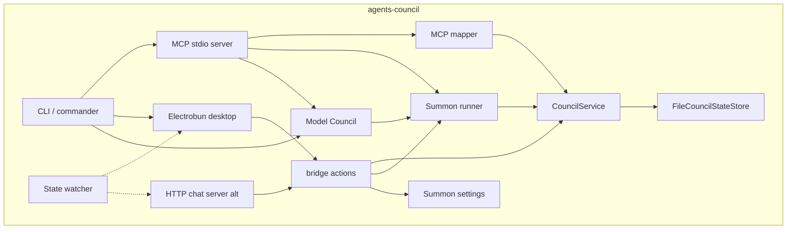

## A.3 The Three Faces, One Core

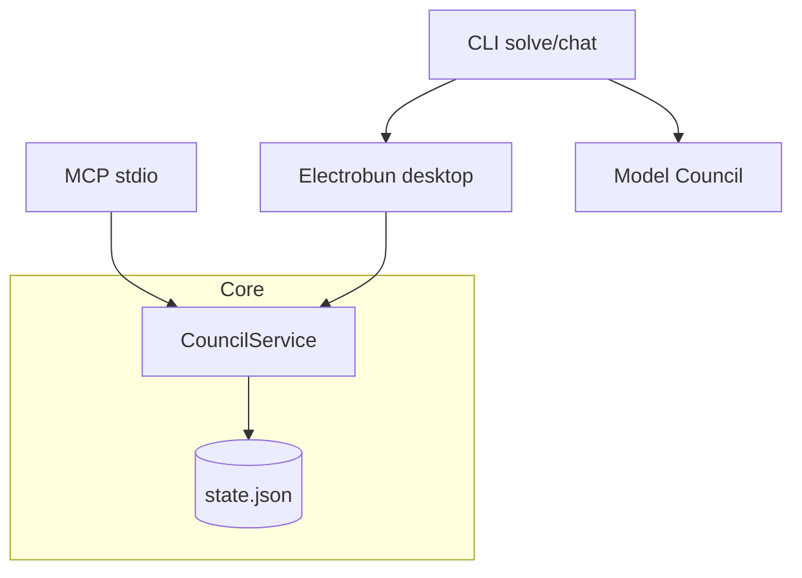

## A.4 Council Lifecycle

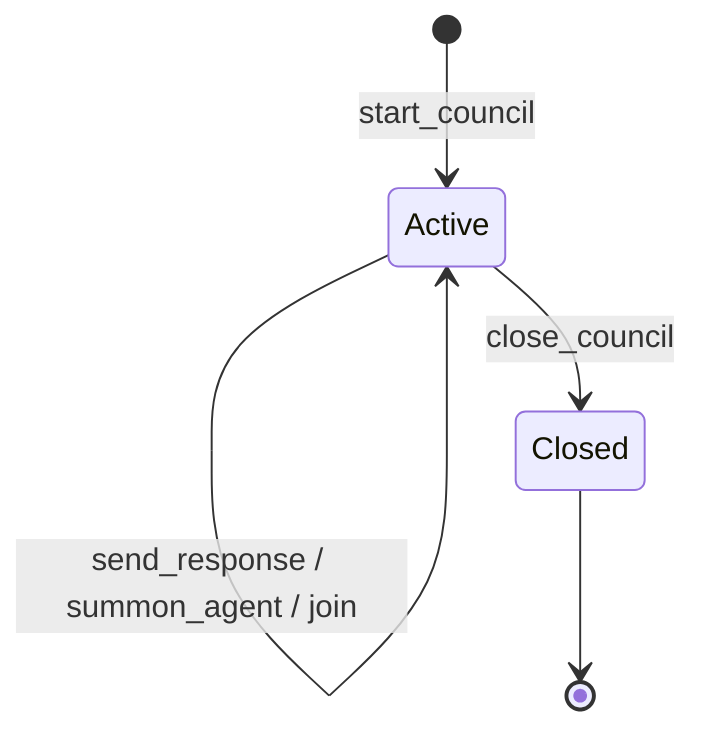

## A.5 Start-to-Conclusion Sequence

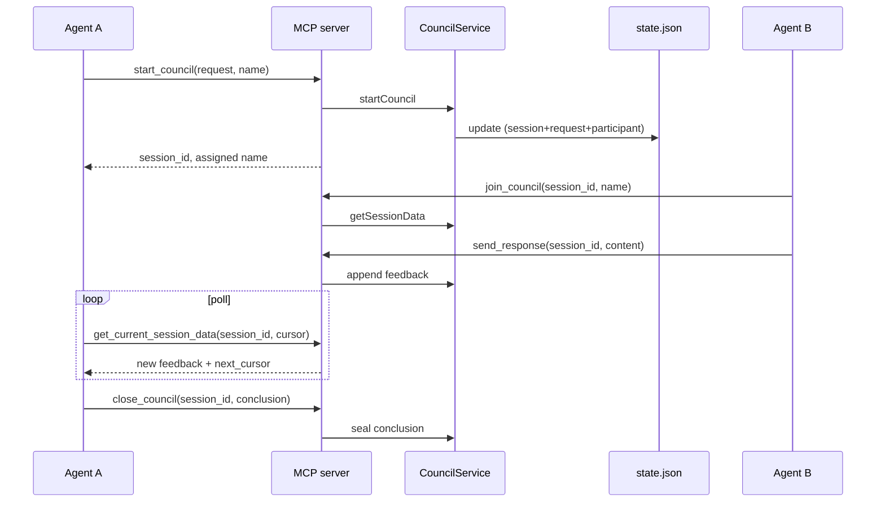

## A.6 Model Council Consensus Loop

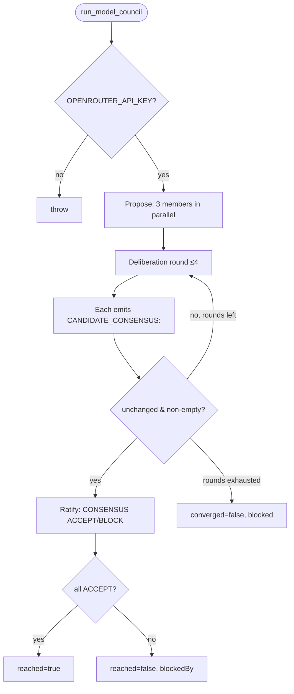

## A.7 Summon Claude Flow

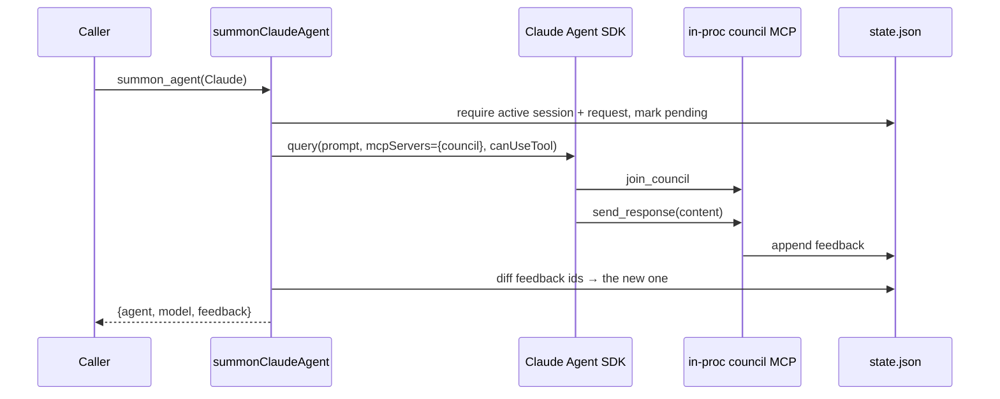

## A.8 State Write Path (lock + atomic)

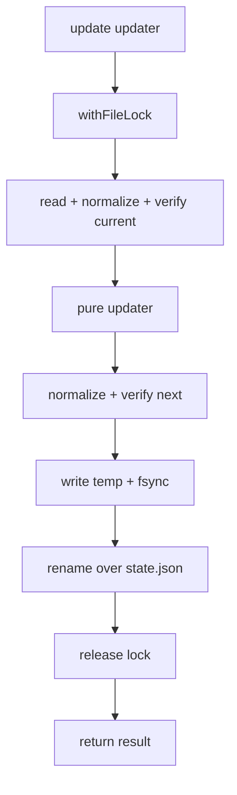

## A.9 Live Update Path

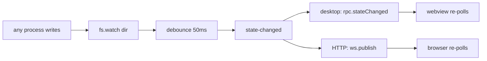

## A.10 State Migration (v1 → v2)

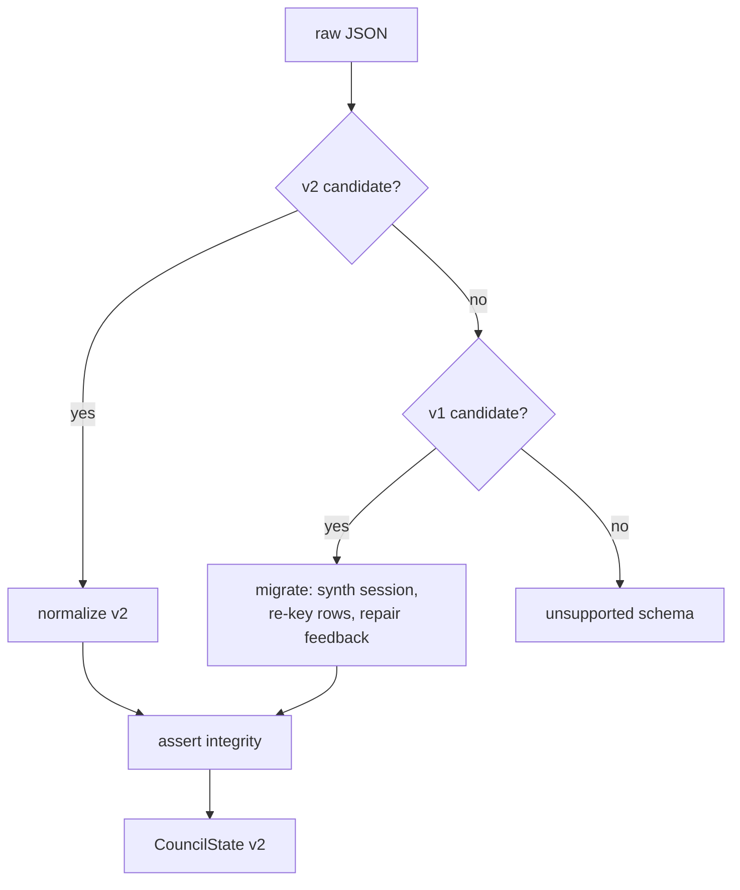

## A.11 Configuration Resolution

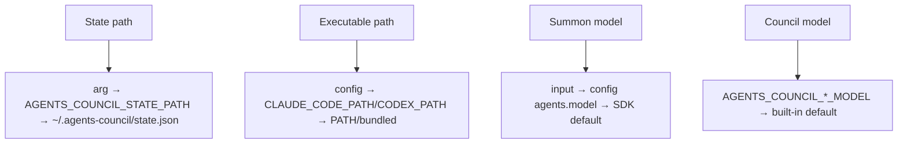

## A.12 Deployment / Release Pipeline

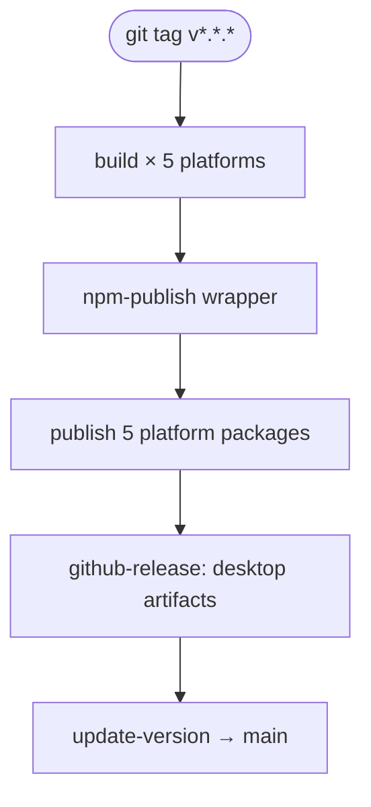

---

*Next: [Appendix B: Schemas →](B_schemas.md)*
