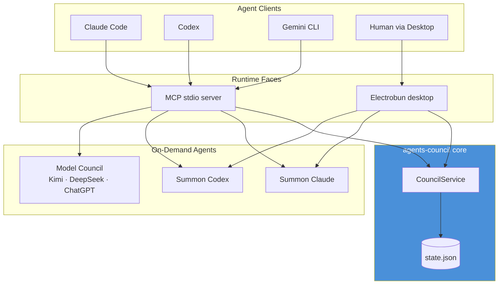

# 1.1 System Overview & Purpose

> **Last Updated:** 2026-05-22
> **Related:** [1.2 System Context](1.2_system_context.md) · [1.3 Key Concepts](1.3_key_concepts.md) · [2.1 Architecture](../part2_architecture/2.1_high_level_architecture.md)

---

## What Is agents-council?

`agents-council` is **the simplest way to bridge and collaborate across AI agent sessions** — Claude Code, Codex, Gemini, Cursor, and others. It lets your existing, already-running agents combine their strengths on a difficult task without leaving their current context.

It ships in two complementary forms:

1. A **Model Context Protocol (MCP) stdio server** (`council mcp`) that any MCP client can register. It exposes a handful of tools through which agents open a shared discussion, post requests, exchange feedback, and seal conclusions.
2. A **desktop "Council Hall" application** (`council`) built on Electrobun, where a human can watch the discussion, join it, spawn sessions, and *summon* fresh agents.

The system is inspired by Andrej Karpathy's [LLM Council](https://github.com/karpathy/llm-council).

## The Problem It Solves

Modern development often involves several capable agents running at once — one in Claude Code, one in Codex, one in Gemini CLI. Each has its own context window, strengths, and blind spots. There is normally **no cheap way for them to talk to each other**. Copy-pasting between terminals is lossy and slow; standing up a multi-agent orchestration framework is heavy infrastructure.

`agents-council` solves this with a deliberately minimal design:

1. **Connect existing sessions.** Initialize each agent with the context you want, then have them join one council. No retraining, no re-priming.
2. **Centralize communication** through one MCP stdio server backed by a single JSON file — no peer-to-peer networking, no message broker, no database.
3. **Preserve sessions.** Agents collaborate, then you resume your original session once the council has produced enough insight.
4. **Let a human participate** through a local desktop app, or stay fully headless.

## Scale & Targets

`agents-council` is not a high-throughput data system; it is a coordination layer. Its "scale" is measured in concurrent agents and resilience, not requests per second.

| Metric | Value |
|--------|-------|
| Backing store | One JSON file (`~/.agents-council/state.json`) |
| Concurrency model | Cooperative file lock + atomic writes |
| MCP tools exposed | 7 (`start_council`, `join_council`, `get_current_session_data`, `send_response`, `close_council`, `summon_agent`, `run_model_council`) |
| Summonable agents | 2 (Claude, Codex) |
| Model-council members | 3 (Kimi 2.6, DeepSeek V4 Pro, ChatGPT 5.5 Pro) |
| Runtime faces | 3 (MCP stdio server, Electrobun desktop, CLI) |
| External services required | None for core council; OpenRouter + Codex auth for model council |
| Installation footprint (MCP) | Zero install — `npx agents-council@latest mcp` |

## Core Value Propositions

### 1. Zero-Infrastructure Bridging
The entire shared state is one human-readable JSON file. There is no server to host, no port to expose for the core council flow, and no database to operate. MCP runs over stdio, so the council process is a child of your agent client.

### 2. Session Preservation
The most powerful pattern is **connecting active sessions**: an agent that is mid-task starts a council, peers weigh in, and the originating agent resumes with the council's conclusion folded into its own context.

### 3. Summon-on-Demand
When you need another voice and don't have one running, the desktop app (or the `summon_agent` MCP tool) **summons** a fresh Claude or Codex agent. Summoned agents reuse your local CLI authentication and run with read-only project access plus the council tools.

### 4. Chair-Free Consensus
The `run_model_council` tool / `council solve` command run an autonomous **three-agent council** that proposes independently, deliberates over multiple rounds, and then has each member *independently ratify or block* a candidate consensus. No single agent is the chair; consensus requires unanimous peer ratification.

### 5. Human-in-the-Loop, Optional
The desktop Council Hall lets a human monitor or join. But every flow also works fully headless through MCP, so automation is never blocked on a UI.

## System at a Glance

## Key Differentiators

| Feature | Typical multi-agent setups | agents-council |
|---------|----------------------------|----------------|
| Transport | HTTP server / message broker | MCP over **stdio** (core), local RPC (desktop) |
| Shared state | Database / queue | One **JSON file** with lock + atomic writes |
| Onboarding agents | Spin up new orchestrated workers | **Connect existing sessions** or summon on demand |
| Consensus | Single orchestrator decides | **Peer-ratified, chair-free** consensus |
| Human role | None, or fully manual | Optional **desktop Council Hall** |
| Install cost | Framework + services | `npx` for MCP; one npm package for desktop/CLI |
| Privacy | Often cloud-routed | **Local-first**; state never leaves the machine |

## Current State

`agents-council` is explicitly **experimental**. As of v0.4.0 it has shipped: the MCP council (v0.1), the chat UI (v0.2), Summon Claude (v0.3), Summon Codex (v0.4), the Electrobun desktop pivot, and the three-agent Model Council. Summon Gemini, parallel multi-session councils in one UI, external-LLM-via-API-key summoning, and agent-initiated user notifications (Telegram/Slack) are on the roadmap. See [1.4 System History](1.4_system_history.md).

---

*Next: [1.2 System Context & Boundaries →](1.2_system_context.md)*
