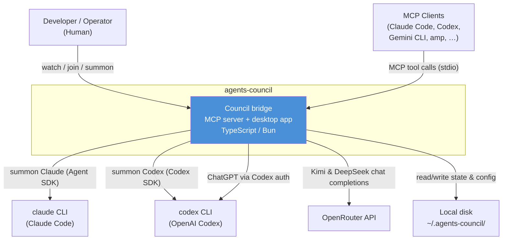
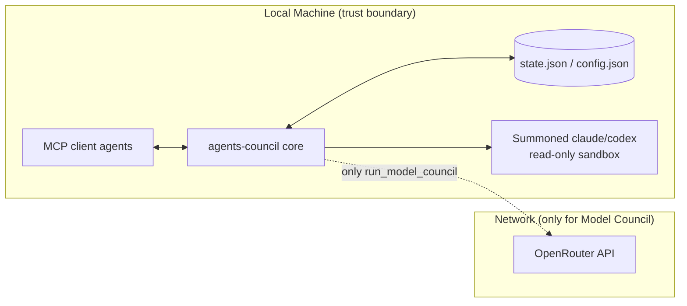

# 1.2 System Context & Boundaries

> **Last Updated:** 2026-05-22
> **Related:** [1.1 System Overview](1.1_system_overview.md) · [2.1 Architecture](../part2_architecture/2.1_high_level_architecture.md) · [4.4 Integration Catalog](../part4_interfaces/4.4_integrations.md)

---

## System Context (C4 Level 1)

## Who Uses It

| Actor | Role | Interaction |
|-------|------|-------------|
| **Developer / Operator** | The human running the agents | Starts/joins councils via desktop, summons agents, reads conclusions |
| **MCP client agents** | Claude Code, Codex, Gemini CLI, amp, Cursor, etc. | Call the council MCP tools to collaborate |
| **Summoned agents** | A fresh `claude` or `codex` process | Spawned by the system to contribute one response |
| **Model-council members** | Kimi, DeepSeek (OpenRouter), ChatGPT (Codex auth) | Invoked by `run_model_council` / `council solve` |

## What Is In Scope

- **Council session lifecycle**: open a session with a request, join, post feedback, poll for new feedback, close with a conclusion.
- **Multi-session management**: many sessions can exist; one is active at a time, with an explicit `session_id` for every operation.
- **Agent identity**: server-assigned agent names with automatic `#N` suffixing on collisions.
- **Summoning**: invoking a fresh Claude or Codex agent into the active session, with read-only project access.
- **Model Council**: an autonomous propose → deliberate → ratify consensus loop across three hosted models.
- **Local persistence**: state and configuration stored as JSON under `~/.agents-council/`.
- **Three delivery faces**: MCP stdio server, Electrobun desktop app, and a thin CLI.

## What Is Out of Scope

- **Agent reasoning quality.** The system transports messages and coordinates turns; it does not improve any agent's answers beyond structuring the conversation.
- **Remote / hosted multi-user councils.** State is a local file; there is no networked multi-tenant backend.
- **Authentication of agents to each other.** Identity is a self-declared name; there is no cryptographic agent identity.
- **Long-term analytics or telemetry.** No usage data is collected or transmitted.
- **Persistence beyond the local machine.** No cloud sync of `state.json`.
- **Summoning agents other than Claude and Codex** (Gemini summon is roadmap, see [1.4](1.4_system_history.md)).

## Trust & Network Boundaries

Key boundary facts:

- **The core council flow makes no outbound network calls.** Bridging happens entirely through the local state file.
- **Summoned agents run in read-only mode** with `networkAccessEnabled: false` for Codex; Claude summon is restricted to read tools (`Read`, `Glob`, `Grep`) plus the council tools.
- **Only the Model Council reaches the network**, calling OpenRouter for Kimi/DeepSeek and the local Codex auth path for ChatGPT.

## Operating Constraints

| Constraint | Detail |
|-----------|--------|
| Runtime | Requires Node.js or Bun. The compiled CLI is a Bun standalone binary. |
| Platforms | macOS (x64/arm64), Linux (x64/arm64), Windows (x64). |
| Auth reuse | Summon Claude needs `claude` authenticated once; summon Codex needs `codex login`. |
| API keys | Model Council requires `OPENROUTER_API_KEY` (Kimi/DeepSeek) and local Codex/OpenAI auth (ChatGPT). |
| Single-writer assumption | Concurrent writers coordinate via a `.lock` file with a 10 s acquisition timeout and 30 s staleness window. |
| Experimental status | APIs, tool shapes, and state schema may still change between minor versions. |

---

*Next: [1.3 Key Concepts & Domain Glossary →](1.3_key_concepts.md)*
