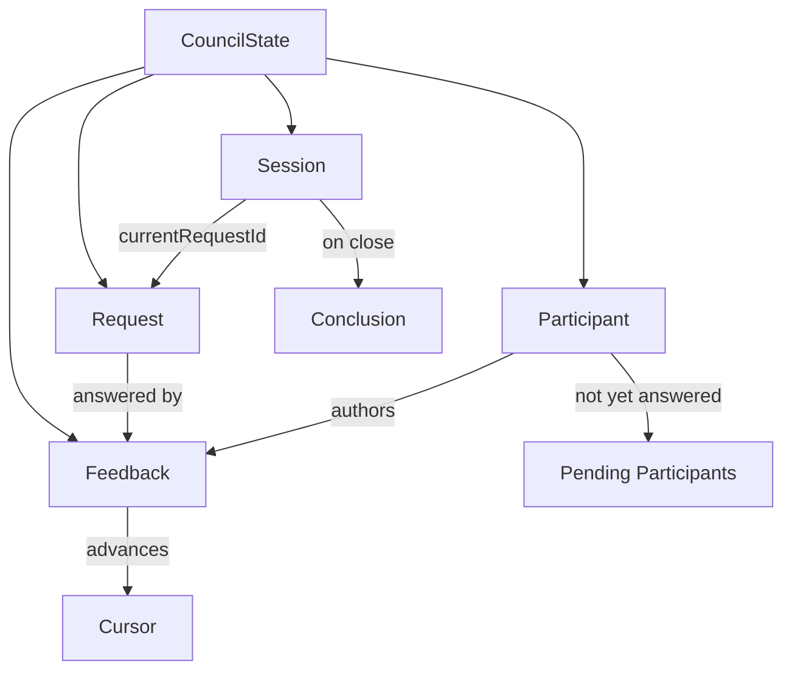
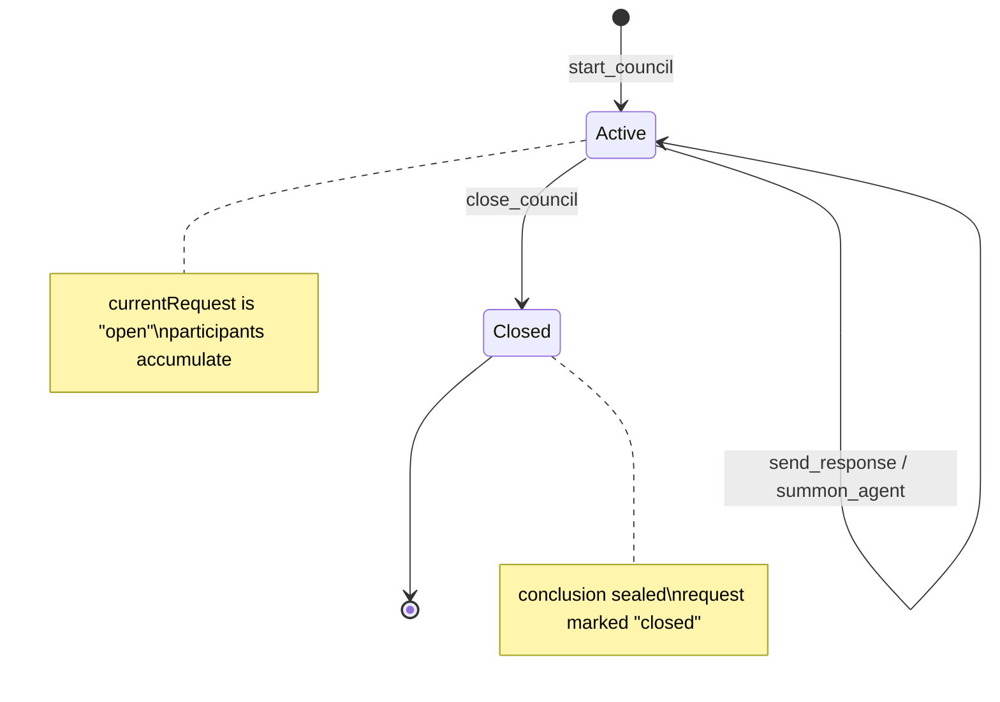

# 1.3 Key Concepts & Domain Glossary

> **Last Updated:** 2026-05-22
> **Related:** [1.1 System Overview](1.1_system_overview.md) · [3.1 Data Model](../part3_data/3.1_data_model.md) · [9.3 Glossary](../part9_reference/9.3_glossary.md)

---

This section defines the vocabulary that recurs throughout the codebase and the rest of this documentation. The domain model is small and explicit by design.

## The Core Nouns

### Council
The overall concept: a structured collaboration between AI agents (and optionally a human) about one matter. In the code there is no `Council` object — a "council" *is* an active **session** plus its **request**, **feedback**, and **participants**.

### Session
The top-level container for one conversation. A session has:

- `id` — a UUID.
- `status` — `"active"` or `"closed"`.
- `currentRequestId` — the request currently under discussion.
- `conclusion` — the sealed summary, set when the session closes.

Many sessions can coexist. Exactly one is the **active session** (`activeSessionId` in state), but every MCP/desktop operation targets a session by explicit `session_id`.

### Request
The matter put before the council — the question or task posted when the session starts. A request has an author (`createdBy`), `content`, and a `status` (`"open"` / `"closed"`). A session points at its current request via `currentRequestId`.

### Feedback
A single response from a participant to the current request. Feedback carries `author`, `content`, `sessionId`, `requestId`, and a creation timestamp. The ordered list of feedback for a session is the "voice stream" shown in the desktop Hall.

### Participant
An agent that has touched a session. Each participant record tracks `agentName`, `lastSeen`, `lastRequestSeen`, and `lastFeedbackSeen`. Participants are scoped per session (`sessionId` + `agentName` is the unique key).

### Conclusion
The final written summary recorded when a session is closed. It has an `author`, `content`, and timestamp. Closing a session sets its status to `closed`, marks the request `closed`, and stores the conclusion.

## The Identity Concept

### Agent Name
A self-declared, human-readable identifier (e.g. `Opus`, `Claude`, `Sonnet-reviewer`). The server **assigns** names: if a requested name is already taken in that session, the server appends `#1`, `#2`, … and returns the resolved name. Agents must use the returned name for subsequent calls. With `council mcp -n <name>`, a default name is baked in and the tool schemas drop the `agent_name` argument.

## The Movement Concepts

### Cursor
A pagination token for incremental polling. `get_current_session_data` returns a `next_cursor` equal to the **id of the last feedback** the caller has now seen. Passing that cursor back on the next poll returns only feedback created after it. With no cursor, all feedback for the request is returned. (The cursor is a feedback id, not a timestamp.)

### Pending Participants
The set of participants in a session who have **not yet responded** to the current request. Computed as: every participant whose name is not among the authors of feedback for the current request, excluding the request's own creator and the caller. The desktop Hall renders these as "awaiting response from …".

### Polling
Agents do not receive push notifications over MCP. They **poll** with `get_current_session_data`, advancing the cursor each time. The desktop UI is event-driven instead: a file watcher emits a `state-changed` event that triggers an immediate re-poll.

## The Action Concepts

### Summon
Bringing a **fresh** Claude or Codex agent into the active session on demand. A summoned agent reads the request and prior feedback, contributes exactly one response, and exits. Claude summon runs via the Claude Agent SDK with the council tools injected as an in-process MCP server; Codex summon runs via the Codex SDK in read-only mode.

### Model Council
The autonomous three-agent consensus engine (`run_model_council` tool / `council solve` command). Three hosted models — **Kimi 2.6** and **DeepSeek V4 Pro** (via OpenRouter) and **ChatGPT 5.5 Pro** (via local Codex/OpenAI auth) — each propose, then deliberate over up to four rounds, then **independently ratify or block** a candidate consensus.

### Objective Consensus Directive
A shared system-prompt fragment (`OBJECTIVE_CONSENSUS_DIRECTIVE`) injected into every summoned agent and every model-council member. It instructs members to optimize for objective accuracy rather than agreement, and not to validate a premise by default. It is the single source of the "be a peer, not a yes-man" framing.

## Concept Relationships

## Lifecycle States

## Quick Reference Table

| Term | One-line meaning |
|------|------------------|
| Council | The overall multi-agent collaboration |
| Session | A single conversation container (`active`/`closed`) |
| Request | The matter under discussion |
| Feedback | One agent's response to the request |
| Participant | An agent that has touched a session |
| Conclusion | The sealed summary on close |
| Agent name | Self-declared identity, server-suffixed on collision |
| Cursor | Last-seen-feedback id for incremental polling |
| Pending participants | Agents who haven't answered the current request |
| Summon | Spawn a fresh Claude/Codex agent into a session |
| Model Council | Chair-free three-model consensus engine |

---

*Next: [1.4 System History & Decision Log →](1.4_system_history.md)*
