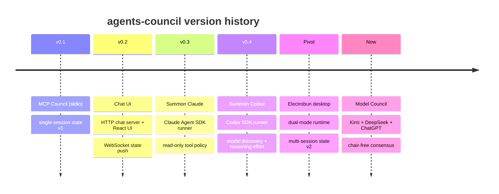

# 1.4 System History & Decision Log

> **Last Updated:** 2026-05-22
> **Related:** [2.4 Architecture Decision Records](../part2_architecture/2.4_adrs.md) · [3.5 Data Migrations](../part3_data/3.5_migrations.md) · [Appendix D: Post-Mortems](../appendices/D_postmortems.md)

---

## Evolution Timeline

## Milestone Narrative

The project's milestones (tracked in `backlog/milestones/`) trace a clear arc from a headless MCP primitive to a desktop-first collaboration app.

### Milestone 0 — Council v1 (stdio)
The original deliverable: a Bun/TypeScript CLI that compiles to a standalone binary and exposes a council over MCP stdio. This established the enduring foundations:

- The **core domain model** and `CouncilService` interface.
- A **file state store** with a lockfile and atomic writes.
- **Polling semantics** with cursors.
- The **MCP stdio adapter** wiring tools to the service.

### Milestone 1 — v0.2.0 Chat UI
Added a human face. A `council chat` command launched a Bun HTTP server that served a React UI and exposed the council over HTTP, pushing `state-changed` notifications over a WebSocket so the UI could re-poll. (This HTTP path still exists in `src/interfaces/chat/server.ts` but is no longer the primary face — see the Electrobun pivot below.)

### Milestone 2 — v0.3 Summon Claude
Introduced **summoning**: a fresh Claude agent could be invited into the active session via the Claude Agent SDK. The council tools were injected as an in-process MCP server, and a permission policy restricted the summoned agent to read-only project tools (`Read`, `Glob`, `Grep`) plus the council tools.

### Milestone 3 — v0.4 Summon Codex
Extended summoning to Codex via the OpenAI Codex SDK, running read-only with networking disabled. Added Codex **model discovery** (via the Codex `app-server` JSON-RPC `model/list`), an offline-first model cache, a config-file fallback for the default model, and a **reasoning-effort** selector.

### Milestone 4 — v0.5 Electrobun Desktop Pivot
The defining architectural shift. The desktop interface moved from a browser pointed at a local HTTP server to a native **Electrobun** app:

- `council` with no arguments now launches the **desktop app by default**; `council chat` is a compatibility alias that also opens the desktop.
- The renderer talks to the Bun core through an **Electrobun RPC bridge** rather than HTTP.
- The state model was upgraded from **single-session (v1)** to **multi-session (v2)**, with explicit `session_id` on every tool.
- Packaging migrated to per-platform npm optional dependencies carrying both the CLI binary and Electrobun desktop artifacts.

### Current — Three-Agent Model Council
The newest capability adds `run_model_council` (MCP) and `council solve` (CLI): an autonomous, chair-free consensus engine over Kimi 2.6, DeepSeek V4 Pro, and ChatGPT 5.5 Pro.

## Key Decisions (Summary)

Full rationale lives in [2.4 ADRs](../part2_architecture/2.4_adrs.md). At a glance:

| # | Decision | Why |
|---|----------|-----|
| ADR-01 | MCP over **stdio** for the core transport | No port binding; direct process integration with agent clients; zero install via `npx` |
| ADR-02 | **File-based** JSON state, not a database | Zero dependencies, portable, human-inspectable |
| ADR-03 | **Lockfile + atomic write** concurrency | Safe multi-writer coordination without a server |
| ADR-04 | **Electrobun** desktop, replacing the HTTP/browser UI | Lightweight, cross-platform, Bun-native; desktop becomes the default face |
| ADR-05 | **Multi-session** state model (v2) with explicit `session_id` | Parallel councils, replayable history, no implicit "current" ambiguity |
| ADR-06 | **Server-assigned** agent names with `#N` suffixing | Avoids collisions without coordination |
| ADR-07 | **Read-only** summon sandbox | A summoned agent advises; it must not mutate the project |
| ADR-08 | **Chair-free, peer-ratified** consensus in the Model Council | No single model decides; consensus needs unanimous ratification |

## Notable Engineering Episodes

Drawn from the backlog/task history; expanded in [Appendix D](../appendices/D_postmortems.md):

- **Windows CI smoke-test quoting** — PowerShell quoting differences broke the cross-platform CLI smoke test; fixed by branching shell syntax per platform.
- **Lint/typecheck enforcement** — lint and typecheck errors were resolved and then enforced as a pre-commit gate (Husky + lint-staged + Biome).
- **Compile-time version embedding** — the CLI version is embedded at build time via the `__COUNCIL_VERSION__` define, with runtime `package.json` fallbacks.
- **Documentation migration for the Electrobun pivot** — docs were rewritten to describe the dual-mode runtime and the v2 multi-session MCP contract.

## Roadmap

From the project README (unchecked items are planned and may change):

- [x] v0.1 — MCP Council
- [x] v0.2 — Chat UI
- [x] v0.3 — Summon Claude
- [x] v0.4 — Summon Codex
- [ ] v0.5 — Summon Gemini
- [ ] v0.6 — Multiple council sessions in parallel (in one UI)
- [ ] v0.7 — Connect to external LLMs via API keys
- [ ] v0.8 — Agents can summon the user (Telegram / Slack)

---

*Next: [Part 2 — 2.1 High-Level Architecture →](../part2_architecture/2.1_high_level_architecture.md)*
