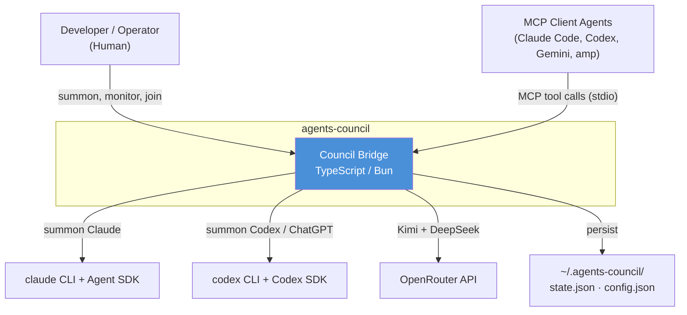
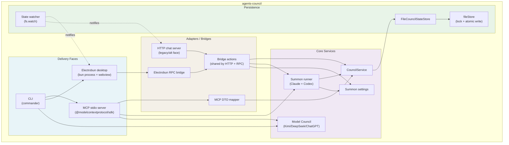

# 2.1 High-Level Architecture (C4 Level 1-2)

> **Last Updated:** 2026-05-22
> **Related:** [2.2 Component Design](2.2_component_design.md) · [2.8 Dual-Mode Runtime](2.8_dual_mode_runtime.md) · [Appendix A: Diagrams](../appendices/A_diagrams.md)

---

## C4 Level 1 — System Context



## C4 Level 2 — Container Diagram



## Container Descriptions

| Container | Technology | Purpose |
|-----------|-----------|---------|
| **CLI** | `commander` | Entry point: routes to `mcp`, `chat`, `solve`, or desktop launch |
| **MCP stdio server** | `@modelcontextprotocol/sdk` | Exposes the 7 council tools to MCP clients over stdio |
| **Electrobun desktop** | `electrobun` (Bun + native webview) | The default human interface (Council Hall) |
| **HTTP chat server** | `Bun.serve` | Alternate/legacy face serving the same React UI over HTTP + WebSocket |
| **MCP DTO mapper** | Pure TS | Translates between snake_case wire DTOs and camelCase domain types |
| **Bridge actions** | Pure TS | Face-agnostic action layer shared by RPC and HTTP |
| **Electrobun RPC bridge** | `electrobun` RPC | Desktop renderer ⇄ bun core transport |
| **CouncilService** | Pure TS | The domain logic: session lifecycle, participants, cursors |
| **Summon runner** | Claude Agent SDK + Codex SDK | Spawns a fresh agent to contribute one response |
| **Model Council** | `fetch` (OpenRouter) + Codex SDK | Chair-free three-model consensus engine |
| **Summon settings** | JSON config | Persists last-used agent, model choices, tool paths, model cache |
| **FileCouncilStateStore** | `node:fs` | Loads/normalizes/migrates and persists `state.json` |
| **fileStore** | `node:fs` | Lockfile acquisition + atomic temp-file rename writes |
| **State watcher** | `fs.watch` | Debounced change detection → push notification to UIs |

## Layering

The codebase is organized into three clean layers under `src/`:

```
src/
├── core/                 # Domain + persistence + config (no transport knowledge)
│   ├── services/
│   │   ├── council/      # CouncilService, types, summon, consensus prompt
│   │   └── modelCouncil.ts
│   ├── state/            # store interface, file store, paths, watcher
│   └── config/           # summon settings
├── interfaces/           # Transport adapters (depend on core, not vice versa)
│   ├── mcp/              # MCP server, DTO types, mapper
│   └── chat/             # bridge actions, HTTP server, React UI
└── cli/                  # CLI entry + desktop launcher
desktop/                  # Electrobun runtime (bun process + council view)
```

The dependency direction is strictly inward: `cli` and `interfaces` depend on `core`; `core` depends on nothing in the other two. This is what allows the same `CouncilService` and bridge `actions` to be reused unchanged across the MCP, HTTP, and Electrobun faces.

## Key Architectural Properties

### Single Source of Truth
All faces read and mutate the same `~/.agents-council/state.json` through `FileCouncilStateStore`. There is no in-memory authoritative state shared between processes — the file *is* the bus. A separate process (a summoned agent, another agent client, the desktop) sees changes by reading the file.

### Read–Modify–Write Under Lock
Every mutating operation runs inside `store.update(...)`, which acquires a `.lock`, reads + normalizes the current state, applies a pure updater function, atomically writes the new state, and releases the lock. Reads (`load`) are lock-free.

### Event-Driven UIs, Polling Agents
Human UIs subscribe to `state-changed` events emitted by an `fs.watch`-based watcher and re-poll on each event. Headless agents instead poll explicitly with cursors. Both ultimately read the same file.

### Concurrency
- **LLM calls** in the Model Council fan out with `Promise.all` (members answer in parallel per round).
- **State writes** serialize through the file lock (10 s timeout, 30 s staleness reclaim).
- **Model discovery** and version probes are cached and refreshed in the background.

---

*Next: [2.2 Component Design →](2.2_component_design.md)*
