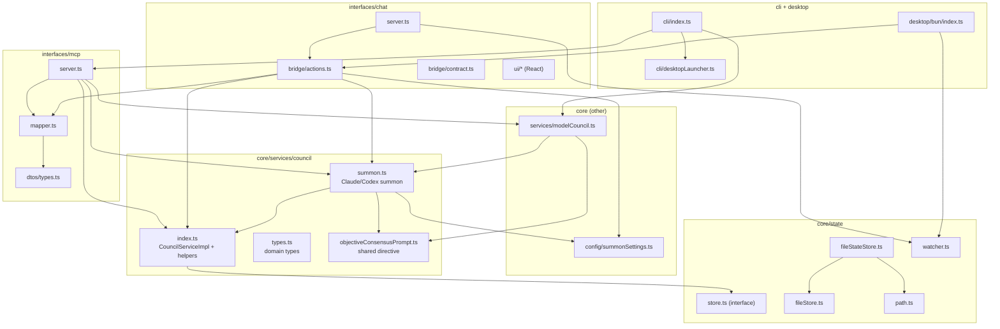

# 2.2 Component Design (C4 Level 3)

> **Last Updated:** 2026-05-22
> **Related:** [2.1 High-Level Architecture](2.1_high_level_architecture.md) · [4.2 Internal APIs](../part4_interfaces/4.2_internal_apis.md) · [3.1 Data Model](../part3_data/3.1_data_model.md)

---

This section breaks each container into its constituent modules and describes responsibilities and collaborators.

## Module Map

## Core Domain — `core/services/council`

### `index.ts` — CouncilServiceImpl
The heart of the domain. Implements the `CouncilService` interface with eight methods:

| Method | Responsibility |
|--------|----------------|
| `startCouncil` | Create a session + open request, register the author as a participant, set it active |
| `getCurrentSessionData` | Return the active session's request + feedback since a cursor (or empty if none) |
| `getSessionData` | Same, but for an explicit `session_id` |
| `sendResponse` / `sendResponseToSession` | Append feedback to the current/target session's open request |
| `closeCouncil` / `closeSession` | Seal a conclusion, mark session + request closed, re-resolve the active session |
| `listSessions` | Sorted listing (active first, then by recency) with optional status filter |
| `setActiveSession` | Switch the active session and refresh the caller's participant record |

It also exports pure helpers reused elsewhere: `getActiveSession`, `findSessionById`, `getCurrentRequestForSession`, `getFeedbackForSession`, `getParticipantsForSession`, `updateParticipant`, `sortSessionsForListing`. Agent-name resolution (`resolveAgentName` → `nextAvailableAgentName`) implements the `#N` suffixing.

Every mutating method is a single `store.update(state => { ... return { state, result } })` call, keeping all writes transactional under the file lock.

### `types.ts` — Domain Types
Pure type definitions: `CouncilState`, `CouncilSession`, `CouncilRequest`, `CouncilFeedback`, `CouncilParticipant`, `CouncilConclusion`, plus the input/result shapes for each service method. No runtime code. See [3.1 Data Model](../part3_data/3.1_data_model.md).

### `summon.ts` — Summon Runner
The largest module (~1,035 lines). Responsibilities:

- **Executable resolution**: locate the `claude`/`codex` binary (config → env var → PATH/bundled), resolving to an absolute path so the SDK accepts npm-installed binaries.
- **Version probing**: cached `claude --version` / `codex --version`.
- **Model discovery**: Claude via the Agent SDK `supportedModels()`; Codex via the `app-server` JSON-RPC `model/list`, with a TOML-config fallback for the default model. Results cached in `config.json` and refreshed in the background.
- **Summon Claude** (`summonClaudeAgent`): builds an in-process MCP server exposing `join_council` / `get_current_session_data` / `send_response` scoped to the active session, runs the Agent SDK `query()` with a `canUseTool` policy allowing only council tools + `Read`/`Glob`/`Grep`, then reads back the new feedback the agent submitted.
- **Summon Codex** (`summonCodexAgent`): builds a flat prompt with the request + prior feedback, runs the Codex SDK thread read-only with networking off, then writes the agent's `finalResponse` as feedback itself.
- **Debug logging**: optional JSONL log to `summon-debug.log` when `AGENTS_COUNCIL_SUMMON_DEBUG` is set.

### `objectiveConsensusPrompt.ts`
A single exported constant, `OBJECTIVE_CONSENSUS_DIRECTIVE`, injected into every summon prompt and every model-council prompt — the shared "optimize for objective accuracy, don't validate the premise by default" instruction.

## Model Council — `core/services/modelCouncil.ts`
A self-contained consensus engine (~467 lines):

- `buildDefaultMembers()` — Kimi & DeepSeek (OpenRouter), ChatGPT (Codex), each model overridable by env var.
- `askMember()` — dispatches to `askOpenRouter` (HTTP `fetch` to chat completions) or `askCodex` (Codex SDK read-only thread).
- `runModelCouncil()` — orchestrates **propose → deliberate (≤4 rounds) → ratify**: all members propose in parallel; each round each member returns a `CANDIDATE_CONSENSUS:` block; convergence is detected when the normalized candidate stops changing; on convergence each member emits `CONSENSUS: ACCEPT|BLOCK`; consensus is *reached* only if all ratify.

See [2.3 Data Flow](2.3_data_flow.md) for the full sequence.

## Persistence — `core/state`

| Module | Responsibility |
|--------|----------------|
| `store.ts` | The `CouncilStateStore` interface (`load`/`save`/`update`) and the `CouncilStateUpdater<T>` type |
| `fileStateStore.ts` | Implementation: read JSON, **normalize + integrity-check**, migrate v1→v2, write atomically under lock |
| `fileStore.ts` | Primitives: `ensureFileDirectory`, `readJsonFile`, `writeJsonFileAtomic`, `withFileLock` |
| `path.ts` | `resolveCouncilStatePath` (honors `AGENTS_COUNCIL_STATE_PATH`, `~` expansion) |
| `watcher.ts` | `watchCouncilState` — debounced `fs.watch` on the state directory, calls `onChange` |

`fileStateStore` is also where **schema integrity** is enforced (`assertCouncilStateIntegrity`): unique ids, no dangling `activeSessionId`, requests/feedback referencing existing sessions, `currentRequestId` belonging to its session.

## Configuration — `core/config/summonSettings.ts`
Loads/normalizes/persists `config.json` (sibling of `state.json`). Holds `lastUsedAgent`, per-agent `{ model, reasoningEffort }`, `claudeCodePath`, `codexPath`, and the `summonModelsCache`. Uses the same `fileStore` lock + atomic-write primitives. `upsertSummonSettings` is a load-merge-write helper (no separate update method) per the project's "favor load + upsert" rule.

## MCP Adapter — `interfaces/mcp`

| Module | Responsibility |
|--------|----------------|
| `server.ts` | Registers the 7 tools with Zod schemas, formats results as markdown or JSON, holds the resolved agent name across calls |
| `mapper.ts` | Bidirectional mapping between wire DTOs (snake_case) and domain types (camelCase); scopes `CouncilStateDto` to one session |
| `dtos/types.ts` | The snake_case wire types (`StartCouncilParams`, `…Response`, `SessionDto`, etc.) |

A subtlety: the tool schemas **adapt to whether a default agent name was supplied** at startup (`-n`). With a default name, `agent_name` is dropped from `start_council`/`join_council`; without it, the field is required.

## Chat / Desktop Adapters — `interfaces/chat` + `desktop`

| Module | Responsibility |
|--------|----------------|
| `bridge/actions.ts` | The face-agnostic action layer: validates payloads, calls core services, maps responses; throws `BridgeApiError(status, msg)` |
| `bridge/contract.ts` | The `CouncilDesktopBridge` interface + payload types shared by renderer and bun process |
| `server.ts` | The legacy/alt HTTP face: `Bun.serve` routes each POST endpoint to an action, plus a `/ws` WebSocket for state-changed pushes |
| `ui/*` | The React 19 Council Hall (see [4.5 UI](../part4_interfaces/4.5_ui.md)) |
| `desktop/bun/index.ts` | The Electrobun bun process: defines the RPC handlers (each delegating to an action), opens the window, wires the watcher to push `stateChanged` to the webview |

## CLI & Launcher — `cli`

| Module | Responsibility |
|--------|----------------|
| `cli/index.ts` | `commander` program: `mcp`, `chat` (→ desktop), `solve`; bare `council` → desktop; version resolution |
| `cli/desktopLauncher.ts` | Locates and spawns the Electrobun runtime: env override → bundled binary → source-checkout `desktop:dev` → packaged executable; detaches and checks for early failure |

---

*Next: [2.3 Data Flow Diagrams →](2.3_data_flow.md)*
