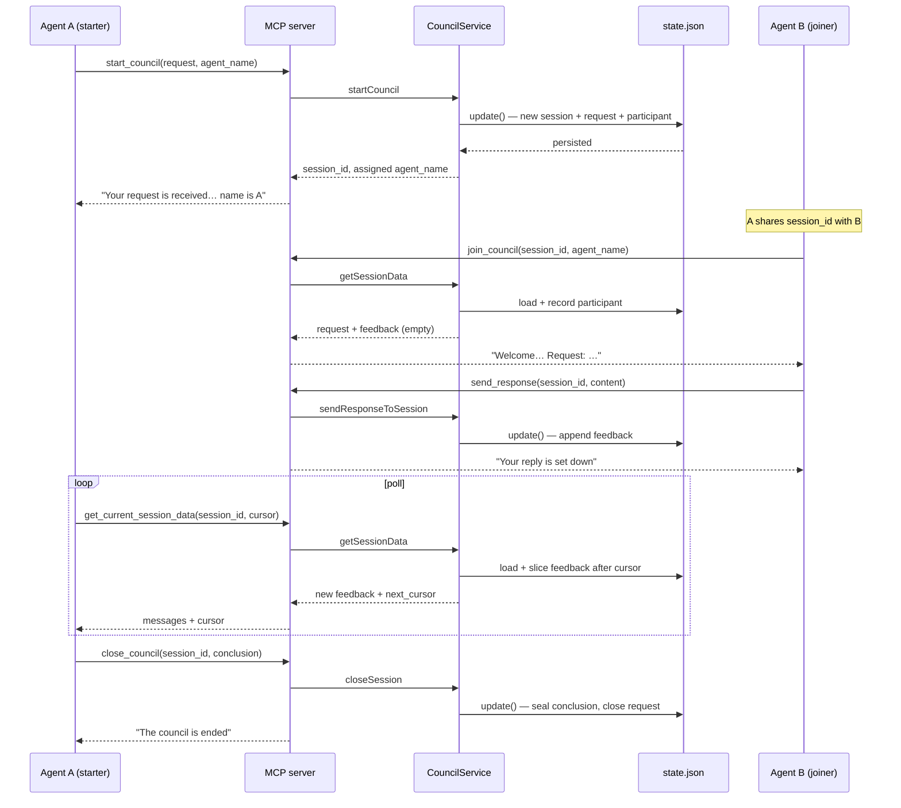
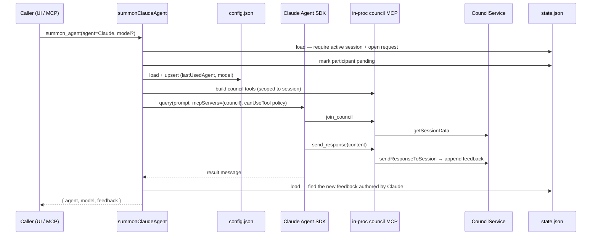
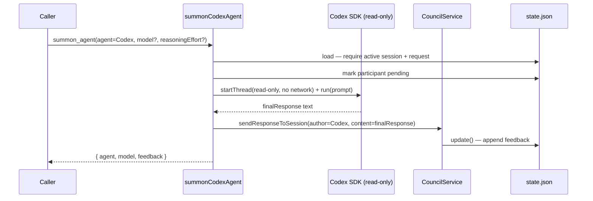
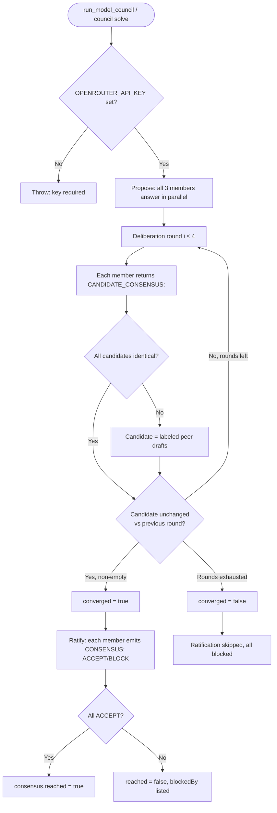
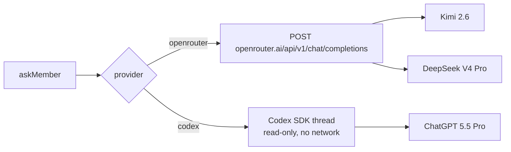
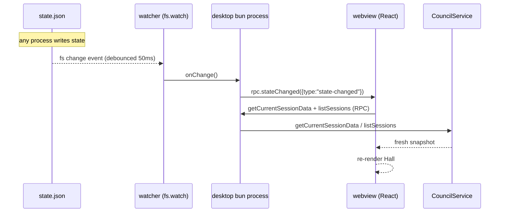

# 2.3 Data Flow Diagrams

> **Last Updated:** 2026-05-22
> **Related:** [2.2 Component Design](2.2_component_design.md) · [3.2 Data Lifecycle](../part3_data/3.2_data_lifecycle.md) · [Appendix A: Diagrams](../appendices/A_diagrams.md)

---

## Flow 1 — A Council From Start to Conclusion

The canonical multi-agent flow: one agent starts a council, another joins and replies, the first polls and then closes.

### Key data transformations
- **start_council** writes a `CouncilSession` (`active`), a `CouncilRequest` (`open`), and a `CouncilParticipant`; sets `activeSessionId`.
- **send_response** appends a `CouncilFeedback` row referencing the session's `currentRequestId`.
- **get_current_session_data** returns only feedback *after* the supplied cursor; `next_cursor` is the last returned feedback's id.
- **close_council** sets session `status="closed"`, attaches the `CouncilConclusion`, marks the request `closed`, and re-resolves `activeSessionId` to another active session if one exists.

## Flow 2 — Summon Claude

The summoned Claude **never gets write access to the project**: `canUseTool` allows only `mcp__council__*` tools plus read-only `Read`/`Glob`/`Grep`; all other tools are denied.

## Flow 3 — Summon Codex

Codex summon is simpler — there is no injected MCP server; the runner submits the feedback on the agent's behalf.

## Flow 4 — Model Council (chair-free consensus)

### Member dispatch

## Flow 5 — Live Desktop Updates (event-driven)

Unlike polling agents, the desktop re-syncs on file change.

The same pattern drives the HTTP face, except the watcher `publish`es the `state-changed` event over a WebSocket and the React app re-polls via `fetch`.

---

*Next: [2.4 Architecture Decision Records →](2.4_adrs.md)*
