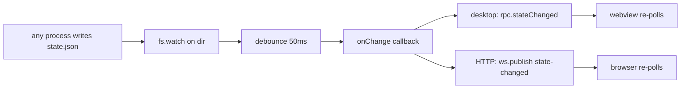

# 2.5 Cross-Cutting Concerns

> **Last Updated:** 2026-05-22
> **Related:** [2.3 Data Flow](2.3_data_flow.md) · [3.3 Access Patterns](../part3_data/3.3_access_patterns.md) · [7.1 Monitoring](../part7_operations/7.1_monitoring.md)

---

Concerns that span every component: concurrency, error handling, state integrity, change notification, logging, and configuration resolution.

## Concurrency & State Integrity

### The single-write-path invariant
Every mutation flows through `CouncilStateStore.update()`, implemented by `FileCouncilStateStore.update`:

```text
ensureFileDirectory → withFileLock(statePath, async () => {
  current = normalize(readStateJson())     // read + migrate + integrity-check
  { state, result } = updater(current)     // pure transform
  write = normalize(state)                  // re-normalize + re-check
  writeJsonFileAtomic(write)                // temp → fsync → rename
  return result
})
```

Two normalization+integrity passes bracket every write — input is validated on read, and the candidate output is validated again before it touches disk. `assertCouncilStateIntegrity` rejects: duplicate ids, a dangling `activeSessionId`, requests/feedback pointing at unknown sessions, feedback/request session mismatches, and `currentRequestId` belonging to another session.

### The lock
`withFileLock` (in `fileStore.ts`) implements a portable cooperative lock:

| Parameter | Value | Meaning |
|-----------|-------|---------|
| `LOCK_MAX_WAIT_MS` | 10,000 | Give up acquiring after 10 s (throws "Timed out waiting for file lock") |
| `LOCK_RETRY_DELAY_MS` | 50 | Poll interval while waiting |
| `LOCK_STALE_MS` | 30,000 | A lock file older than 30 s is reclaimed |

The lock is a sidecar file (`state.json.lock`) created with the `wx` flag (exclusive). Reads (`load`) bypass the lock entirely, so polling never blocks writers.

### Crash safety
`writeJsonFileAtomic` writes to `data.<pid>.<ts>.<rand>.tmp`, `fsync`s, closes, then `rename`s over the target; on rename failure the temp file is unlinked. A crash mid-write therefore never corrupts the live `state.json`.

## Error Handling

Each layer has a consistent error convention:

| Layer | Convention |
|-------|------------|
| **Core service** | Throws plain `Error` with a human message (`"No active session."`, `"Session not found."`, `"Council session is already closed."`) |
| **MCP server** | `toolError(error)` wraps any throw into a `CallToolResult` with `isError: true` and the message as text |
| **Bridge actions** | Throws `BridgeApiError(status, message)`; `getErrorStatus`/`getErrorMessage` translate to HTTP/RPC results |
| **HTTP server** | Maps thrown errors to `Response.json({error}, {status})`; `EADDRINUSE` becomes a friendly "port in use" message |
| **Electrobun RPC** | `runBridgeAction` wraps every handler into `BridgeResult<T>` (`{ok:true,data}` or `{ok:false,error}`) |
| **Summon** | Surfaces SDK result errors precisely (`resolveSummonResultError`), distinguishing `is_error`, non-success subtypes, and empty results |
| **Watcher** | Swallows callback and `fs.watch` errors to avoid destabilizing the server |

The guiding principle: **errors are values at the edges**. Internally they throw; at each transport boundary they are converted into a structured, client-safe shape.

## Change Notification

The watcher is the system's only "push" mechanism:



`watchCouncilState` watches the *directory* (not the file) so it survives the atomic-rename swap, and filters events to the target filename and its temp/lock siblings (`basename === target || startsWith(target + ".")`). Errors on the watcher are intentionally ignored.

## Logging & Diagnostics

`agents-council` is deliberately quiet — there is no logging framework and no telemetry.

| Signal | Where |
|--------|-------|
| MCP startup | `console.error("Council MCP server running on stdio")` (stderr, so it never pollutes the stdio protocol on stdout) |
| Summon debug trace | JSONL appended to `./summon-debug.log` only when `AGENTS_COUNCIL_SUMMON_DEBUG` ∈ {1,true,yes} |
| CLI failures | `console.error("<context>: <message>")` then `process.exit(1)` |
| Legacy option warnings | `console.warn` when deprecated `--port`/`--no-open` are passed to `chat` |

The summon debug log is the richest diagnostic: it records `summon_start`, `summon_session`, `summon_settings`, every raw SDK message (`sdk_message`), and `summon_success`/`summon_error` with details.

## Configuration Resolution

Path and option resolution is layered and predictable. State path:

```text
explicit arg  →  AGENTS_COUNCIL_STATE_PATH env  →  ~/.agents-council/state.json
```

Executable paths (per agent):

```text
config.json (claudeCodePath/codexPath)  →  CLAUDE_CODE_PATH/CODEX_PATH env  →  PATH lookup ("claude") / bundled (Codex)
```

Model selection (per summon):

```text
explicit input.model  →  saved config agents[agent].model  →  SDK/CLI default
```

Model-council member models:

```text
AGENTS_COUNCIL_{KIMI,DEEPSEEK,CHATGPT}_MODEL env  →  built-in defaults
```

This consistency means an operator can override any path or model without touching code, and the system degrades gracefully when an override is absent.

## Type Safety as a Cross-Cutting Concern

The whole codebase is strict TypeScript with Zod validation at the MCP boundary. Wire DTOs (snake_case) are kept structurally separate from domain types (camelCase) and bridged only through the explicit `mapper`, so a wire-shape change can never silently leak into the domain.

---

*Next: [2.8 Dual-Mode Runtime & Multi-Session Model →](2.8_dual_mode_runtime.md)*
