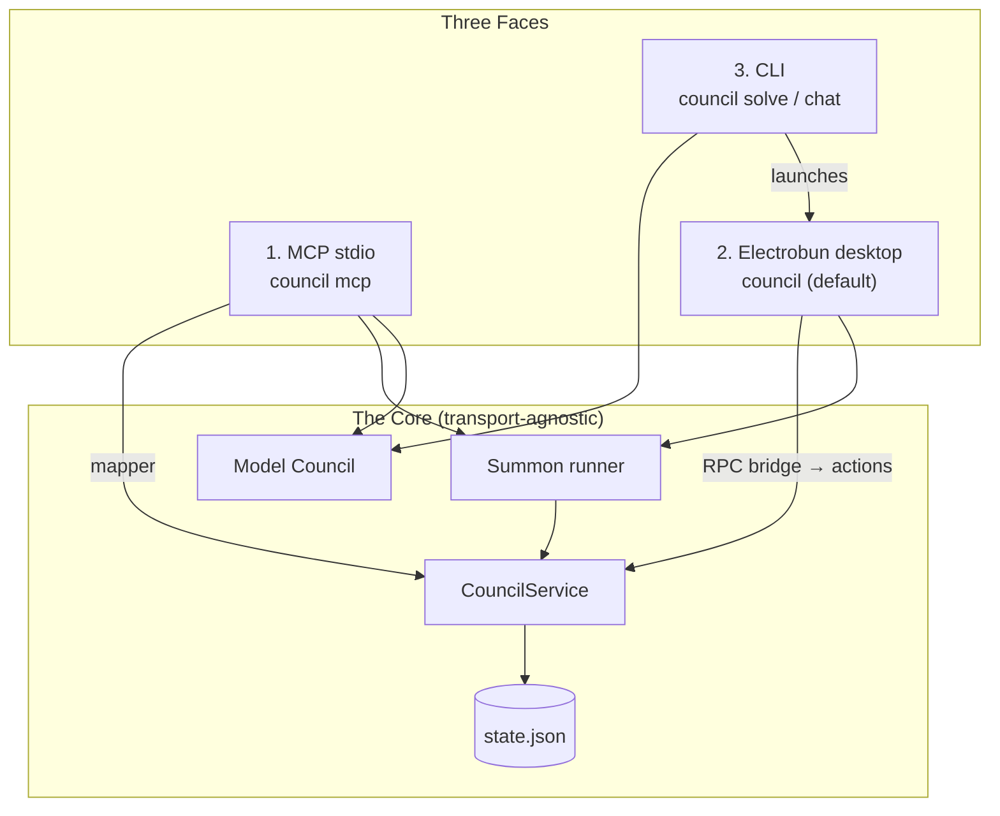
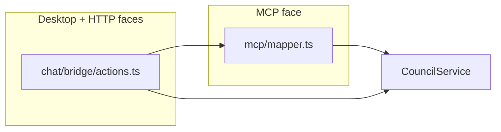
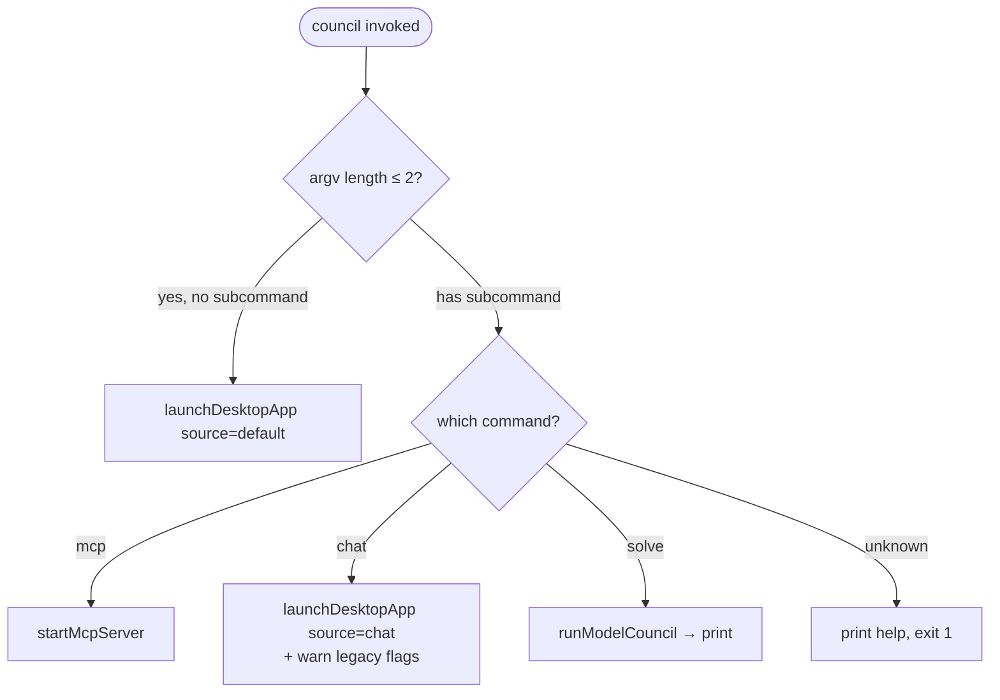
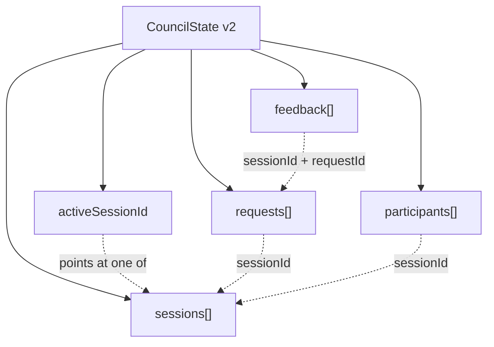

# 2.8 Dual-Mode Runtime & Multi-Session Model

> **Last Updated:** 2026-05-22
> **Related:** [2.1 High-Level Architecture](2.1_high_level_architecture.md) · [2.4 ADRs](2.4_adrs.md) · [4.5 UI](../part4_interfaces/4.5_ui.md)

---

This is the defining structural idea of `agents-council`: **one core, three faces, one file**. Understanding it explains nearly every other design choice.

## One Core, Three Faces



The same `CouncilService`, `summon` runner, and `modelCouncil` engine sit behind all three faces. No face contains domain logic; each is a thin adapter that maps its wire format to the core and back.

### Face 1 — MCP stdio server (`council mcp`)
The headless, agent-facing face. It registers seven tools, holds the resolved agent name across calls, and formats results as markdown or JSON. This is what an MCP client (Claude Code, Codex, Gemini CLI, amp) connects to. It speaks the **session-targeted** contract: every tool except `start_council` requires a `session_id`.

### Face 2 — Electrobun desktop (`council`, the default)
The human-facing face. A bun process opens a native window whose React renderer talks back through an Electrobun **RPC bridge**. It is event-driven: a file watcher pushes `state-changed` to the webview, which re-polls. Running `council` with no arguments launches this face.

### Face 3 — CLI (`council solve`, `council chat`)
A thin command face. `solve` runs the Model Council and prints the consensus; `chat` is a compatibility alias that launches the desktop; bare `council` also launches the desktop. The CLI is built with `commander` and compiled to a Bun standalone binary.

> A fourth, **secondary** transport exists: the `Bun.serve` HTTP chat server (`src/interfaces/chat/server.ts`), which serves the same React UI over HTTP + WebSocket and shares the bridge `actions` layer. After the Electrobun pivot it is no longer the primary UI path; the CLI `chat` command launches the desktop instead. See [Appendix E](../appendices/E_tech_debt.md).

## How the Faces Stay Consistent



Two adapter strategies converge on the same core:

- The **MCP face** uses `mcp/mapper.ts` to translate snake_case tool params ↔ camelCase domain types.
- The **desktop and HTTP faces** use `chat/bridge/actions.ts`, which *also* reuses the same `mapper` to produce response DTOs.

Because both routes share the mapper and the service, a behavioral change made once is visible identically across MCP, desktop, and HTTP.

## Runtime Selection Logic

How `council` decides what to launch (`cli/index.ts`):



### Desktop launch resolution (`cli/desktopLauncher.ts`)
Finding the desktop runtime to spawn is itself layered, supporting dev checkouts, bundled binaries, and packaged installs:

```text
COUNCIL_DESKTOP_COMMAND env override
  → bundled Electrobun binary next to the current executable
  → source checkout (package.json name=agents-council + electrobun.config.ts) → "bun run desktop:dev"
  → packaged "council-desktop" executable / macOS .app bundle
  → error: "Desktop runtime is not configured for this invocation"
```

The launcher detaches the child (`unref`) and watches a 400 ms window for an early non-zero exit so it can surface a clear startup error instead of silently failing.

## The Multi-Session Model

The second half of this design is that state is **multi-session** (schema v2). One file holds many sessions; one is active at a time.



### Why multi-session matters
| Property | Effect |
|----------|--------|
| Explicit `session_id` everywhere | No ambiguity about which council a tool call targets |
| Many sessions retained | The desktop sidebar shows a history of past councils ("archives") |
| One `activeSessionId` | A sensible default target and the focus of the desktop Hall |
| Per-session participants | Names and `#N` suffixes are scoped to a session, not global |
| Re-resolve on close | Closing the active session promotes another active session if one exists |

### Active-session resolution
`activeSessionId` is never trusted blindly. On every load it is re-resolved (`resolveActiveSessionId`): if the stored id no longer references a session, the store picks the most-recently-created **active** session (then by recency, then id). On close, `resolveActiveSessionIdAfterClose` does the same only if the closed session was the active one. This keeps the "current" pointer valid no matter how the file was edited.

## Why This Shape Is the Right One

The dual-mode/multi-session architecture is what lets `agents-council` be simultaneously:

- **Headless-first** (MCP) — automation is never blocked on a UI.
- **Human-friendly** (desktop) — a person can watch, join, and summon.
- **Process-decoupled** — agents in separate clients, summoned subprocesses, and the desktop all coordinate through one file with no shared memory.
- **Cheap** — no server, no database, no broker; the entire runtime is a binary plus a JSON file.

Every other section of this documentation is, in some sense, an elaboration of these two ideas.

---

*Next: [Part 3 — 3.1 Data Model & Schema →](../part3_data/3.1_data_model.md)*
