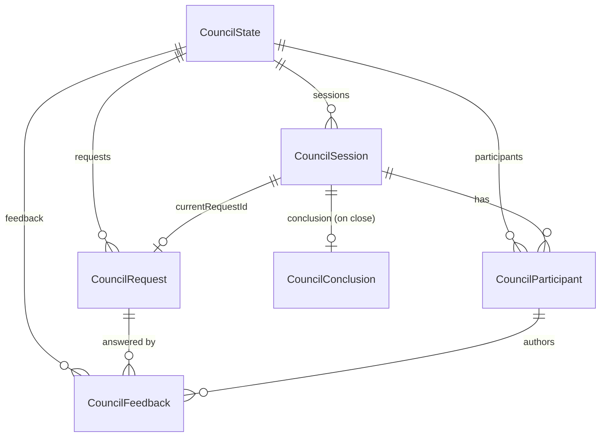

# 3.1 Data Model & Schema

> **Last Updated:** 2026-05-22
> **Related:** [1.3 Key Concepts](../part1_understanding/1.3_key_concepts.md) · [2.8 Dual-Mode Runtime](../part2_architecture/2.8_dual_mode_runtime.md) · [Appendix B: Schemas](../appendices/B_schemas.md)

---

The domain model is small, fully typed, and defined in `src/core/services/council/types.ts`. Wire-facing DTOs (snake_case) live in `src/interfaces/mcp/dtos/types.ts` and `src/interfaces/chat/ui/types.ts`.

## The State Root

```typescript
type CouncilState = {
  version: number;                  // schema version (2 = multi-session)
  activeSessionId: string | null;   // the currently-focused session
  sessions: CouncilSession[];
  requests: CouncilRequest[];
  feedback: CouncilFeedback[];
  participants: CouncilParticipant[];
};
```

`CouncilState` is the entire contents of `state.json`. It is a flat, normalized shape: sessions, requests, feedback, and participants are sibling arrays cross-linked by ids rather than nested. This makes integrity checks and incremental updates straightforward.

## Core Domain Types

### CouncilSession

```typescript
type CouncilSession = {
  id: string;                         // UUID
  status: "active" | "closed";
  createdAt: string;                  // ISO 8601
  currentRequestId: string | null;    // the request under discussion
  conclusion: CouncilConclusion | null;
};
```

### CouncilRequest

```typescript
type CouncilRequest = {
  id: string;
  sessionId: string;                  // owning session
  content: string;                    // the matter put before the council
  createdBy: string;                  // author agent name
  createdAt: string;
  status: "open" | "closed";
};
```

### CouncilFeedback

```typescript
type CouncilFeedback = {
  id: string;
  sessionId: string;
  requestId: string;                  // the request being answered
  author: string;                     // responding agent name
  content: string;
  createdAt: string;
};
```

### CouncilParticipant

```typescript
type CouncilParticipant = {
  sessionId: string;                  // participants are per-session
  agentName: string;
  lastSeen: string;
  lastRequestSeen: string | null;     // cursor-like progress markers
  lastFeedbackSeen: string | null;
};
```

The `(sessionId, agentName)` pair is the participant's unique key.

### CouncilConclusion

```typescript
type CouncilConclusion = {
  author: string;
  content: string;
  createdAt: string;
};
```

## Entity Relationship Diagram



## Service Input/Result Types

Each `CouncilService` method has an explicit input and result shape (selected examples):

```typescript
type StartCouncilInput  = { request: string; agentName: string };
type StartCouncilResult = { agentName: string; session: CouncilSession;
                            request: CouncilRequest; state: CouncilState };

type GetSessionDataInput  = { agentName: string; sessionId: string; cursor?: string };
type GetSessionDataResult = { agentName: string; session: CouncilSession;
                              request: CouncilRequest | null; feedback: CouncilFeedback[];
                              participant: CouncilParticipant; nextCursor: string | null;
                              pendingParticipants: string[]; state: CouncilState };

type SendResponseResult   = { agentName: string; feedback: CouncilFeedback; state: CouncilState };
type CloseSessionResult   = { agentName: string; session: CouncilSession;
                              conclusion: CouncilConclusion; state: CouncilState };
type ListSessionsResult   = { activeSessionId: string | null;
                              sessions: CouncilSession[]; state: CouncilState };
```

Every result carries the full `state` snapshot, so a caller can render or persist the new world without a second read.

## Wire DTOs (snake_case)

The MCP and bridge faces never expose domain types directly. They map to DTOs in `dtos/types.ts`:

```typescript
type SessionDto = { id: string; status: "active" | "closed"; created_at: string;
                    current_request_id: string | null; conclusion: ConclusionDto | null };
type RequestDto = { id: string; content: string; created_by: string;
                    created_at: string; status: "open" | "closed" };
type FeedbackDto = { id: string; request_id: string; author: string;
                     content: string; created_at: string };
type ParticipantDto = { agent_name: string; last_seen: string;
                        last_request_seen: string | null; last_feedback_seen: string | null };
type CouncilStateDto = { version: number; session: SessionDto | null;
                         requests: RequestDto[]; feedback: FeedbackDto[];
                         participants: ParticipantDto[] };
```

Note that `CouncilStateDto` carries a **single** `session` (the scoped one) rather than a `sessions[]` array — the mapper narrows the multi-session domain state to the one session a response is about.

## Summon & Model-Council Types

### Summon (config + result)

```typescript
type SummonAgentInput  = { agent: string; model?: string | null; reasoningEffort?: string | null };
type SummonAgentResult = { agent: string; model: string | null; feedback: CouncilFeedback };

type SummonSettings = {
  lastUsedAgent: string | null;
  agents: Record<string, { model: string | null; reasoningEffort: string | null }>;
  claudeCodePath: string | null;
  codexPath: string | null;
  summonModelsCache: Record<string, { models: SummonModelInfo[]; updatedAt: string }>;
};

type SummonModelInfo = {
  value: string; displayName: string; description: string;
  supportedReasoningEfforts: { reasoningEffort: string; description: string }[];
  defaultReasoningEffort: string;
};
```

### Model Council

```typescript
type ModelCouncilMember = { id: "kimi"|"deepseek"|"chatgpt"; name: string;
                            provider: "openrouter"|"codex"; model: string };
type ModelCouncilRound  = { index: number; proposals: ModelCouncilCandidateProposal[];
                            candidateConsensus: string; changed: boolean };
type ModelCouncilConsensus = { reached: boolean; ratifiedBy: string[]; blockedBy: string[] };
type ModelCouncilResult = {
  prompt: string; members: ModelCouncilMember[];
  responses: ModelCouncilResponse[];         // initial proposals
  deliberations: ModelCouncilCandidateProposal[];  // final round's proposals
  rounds: ModelCouncilRound[];
  candidateConsensus: string; converged: boolean;
  ratifications: ModelCouncilRatification[]; consensus: ModelCouncilConsensus;
};
```

## UI DTOs (selected)

The desktop adds a session-list projection and summon-settings response:

```typescript
type SessionListItemDto = { id: string; status: "active"|"closed"; created_at: string;
                            current_request_id: string | null; title: string;
                            participant_count: number; message_count: number };
type SummonSettingsResponse = { last_used_agent: string | null;
                                agents: Record<string, {model:string|null; reasoning_effort:string|null}>;
                                supported_agents: string[];
                                supported_models_by_agent: Record<string, SummonModelInfoDto[]>;
                                default_agent: string; claude_code_path: string | null;
                                claude_code_version: string | null; codex_cli_version: string | null };
```

`SessionListItemDto.title` is derived from the first request's content (collapsed, truncated to ~56 chars, fallback "Untitled Session").

## Invariants

The store enforces these on every load and before every write (`assertCouncilStateIntegrity`):

1. Session ids are unique.
2. `activeSessionId`, if set, references an existing session.
3. Request ids are unique; every request's `sessionId` exists.
4. Feedback ids are unique; every feedback references an existing session **and** request, and their sessions match.
5. `(sessionId, agentName)` participant pairs are unique; every participant's session exists.
6. A session's `currentRequestId`, if set, references a request that belongs to that session.

---

*Next: [3.2 Data Flow & Lifecycle →](3.2_data_lifecycle.md)*
