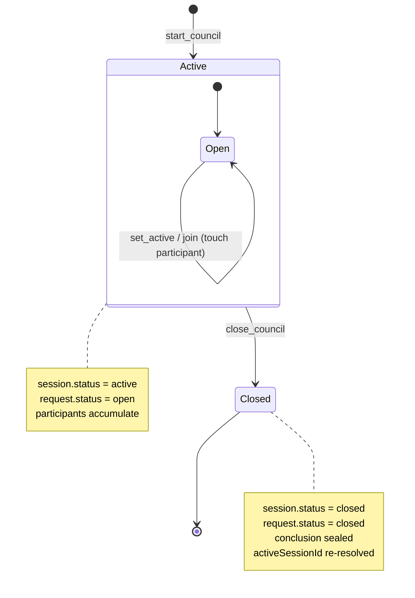
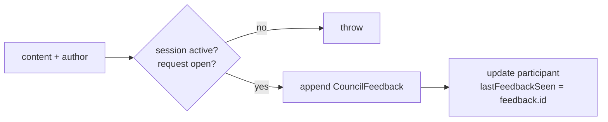
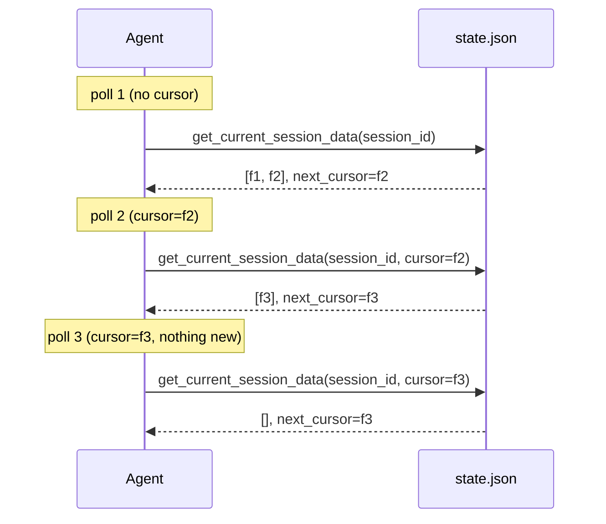

# 3.2 Data Flow & Lifecycle

> **Last Updated:** 2026-05-22
> **Related:** [3.1 Data Model](3.1_data_model.md) · [2.3 Data Flow](../part2_architecture/2.3_data_flow.md) · [3.5 Migrations](3.5_migrations.md)

---

This section follows the data — a session and its rows — from creation to sealed conclusion, and describes how each operation transforms `state.json`.

## Session Lifecycle



## Stage-by-Stage Transformations

### 1. Birth — `startCouncil`
Creates three rows atomically and points the world at them:

| Mutation | Effect |
|----------|--------|
| New `CouncilSession` | `status: active`, `conclusion: null` |
| New `CouncilRequest` | `status: open`, `createdBy: <resolved name>` |
| New / updated `CouncilParticipant` | `lastRequestSeen` = new request id |
| `session.currentRequestId` | = new request id |
| `state.activeSessionId` | = new session id |

The author's name is resolved through `resolveAgentName` (reuse if present, else `#N` suffix).

### 2. Arrival — `join_council` / `setActiveSession`
A joining agent records itself as a participant and reads the request + existing feedback. `join` (via `getSessionData`) is read-mostly: it touches the participant's `lastSeen`/`lastRequestSeen`/`lastFeedbackSeen` but adds no feedback. `setActiveSession` additionally flips `activeSessionId`.

### 3. Contribution — `sendResponse` / `summon_agent`
Appends one `CouncilFeedback` row referencing the session's `currentRequestId`:



A summoned Claude calls `send_response` itself through the injected council MCP server; a summoned Codex's `finalResponse` is written as feedback by the runner on its behalf.

### 4. Observation — `getCurrentSessionData` / `getSessionData`
Read-mostly. Returns the request and the slice of feedback **after the caller's cursor**, advances the caller's participant markers, and computes `pendingParticipants`. The returned `nextCursor` is the id of the last feedback now seen.

### 5. Death — `close_council`
Seals the session:

| Mutation | Effect |
|----------|--------|
| `session.status` | `active → closed` |
| `session.conclusion` | the `CouncilConclusion` (author, content, time) |
| `request.status` | `open → closed` |
| participant markers | advanced to latest request/feedback |
| `state.activeSessionId` | re-resolved to another active session if the closed one was active |

## Cursor Progression

Feedback is delivered incrementally via a feedback-id cursor:



`sliceAfterId` finds the cursor's feedback and returns everything after it; an unknown cursor (e.g. after history edits) returns the full list defensively.

## Data Retention

There is **no automatic deletion**. Sessions, requests, feedback, and participants persist in `state.json` indefinitely. Closed sessions remain as "archives" in the desktop sidebar. The file grows monotonically with use; pruning is a manual operation (edit or replace the file — see [7.5 Disaster Recovery](../part7_operations/7.5_disaster_recovery.md)).

## Side-Effect Ordering & Durability

Within a single `update()`:

```text
acquire lock → read+normalize → apply updater → re-normalize+verify → fsync temp → rename → release lock → return result
```

The result is only returned **after** the new state is durably on disk. Downstream notifications (the watcher firing, UIs re-polling) therefore always observe a committed state, never a partial one.

## The Config Side-Channel

Summon operations also write `config.json` (a sibling file with its own lock): `lastUsedAgent`, the chosen `model`/`reasoningEffort` per agent, and the refreshed `summonModelsCache`. This is *configuration* data with a different lifecycle from council *state* — it survives across all sessions and is never part of `state.json`.

---

*Next: [3.3 Data Access Patterns →](3.3_access_patterns.md)*
