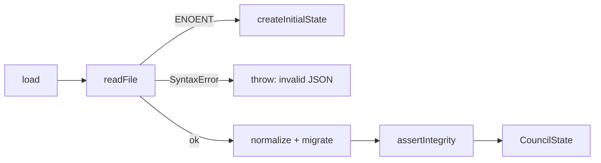
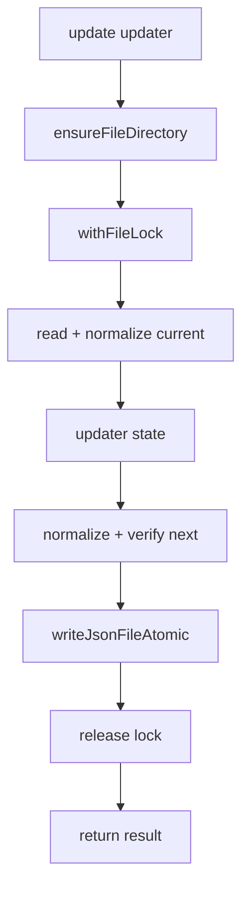
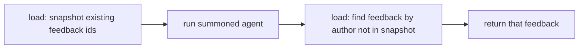

# 3.3 Data Access Patterns

> **Last Updated:** 2026-05-22
> **Related:** [2.5 Cross-Cutting Concerns](../part2_architecture/2.5_cross_cutting.md) · [3.2 Data Lifecycle](3.2_data_lifecycle.md) · [Appendix B: Schemas](../appendices/B_schemas.md)

---

All persistent access goes through one of two stores, both built on the same `fileStore` primitives: the **council state store** (`state.json`) and the **summon settings store** (`config.json`).

## The Store Interface

```typescript
type CouncilStateStore = {
  load(): Promise<CouncilState>;
  save(state: CouncilState): Promise<void>;
  update<T>(updater: CouncilStateUpdater<T>): Promise<T>;
};

type CouncilStateUpdater<T> = (state: CouncilState) =>
  { state: CouncilState; result: T } | Promise<{ state: CouncilState; result: T }>;
```

Three access shapes, each with a distinct concurrency profile:

| Operation | Lock? | Use |
|-----------|-------|-----|
| `load` | No | Read-only views (polling, listing, UI snapshots) |
| `save` | Yes | Full overwrite (rare; mainly tests/migrations) |
| `update` | Yes | The standard transactional read-modify-write |

## Pattern 1 — Lock-Free Reads

`load()` reads, parses, normalizes, migrates (if needed), and integrity-checks — but takes **no lock**. This is deliberate: polling agents and UIs read constantly, and blocking them on the write lock would create contention with no benefit. A read that races a write sees either the pre- or post-rename file (atomic rename guarantees no torn read).



## Pattern 2 — Transactional Updates

`update()` is the workhorse. The updater is a **pure function** of the current state, returning the next state plus a result value:



Every mutating `CouncilService` method is exactly one `update()` call. Because the updater is pure and runs under the lock, two concurrent writers serialize cleanly: the second reads the first's committed state before applying its own change.

## Pattern 3 — Atomic Writes

`writeJsonFileAtomic` never writes in place:

```text
1. temp = dir/data.<pid>.<ts>.<rand>.tmp   (unique per writer)
2. open(temp, "wx")  → write JSON + "\n"  → fsync  → close
3. rename(temp, target)                    (atomic on POSIX)
4. on rename failure: unlink(temp), rethrow
```

This guarantees the live file is always a complete, valid document.

## Pattern 4 — Cooperative File Locking

The lock is a sidecar file created exclusively (`wx`). See [2.5](../part2_architecture/2.5_cross_cutting.md) for parameters. The pattern tolerates crashed holders via a 30 s staleness reclaim and bounds waiting at 10 s.

## Pattern 5 — Cursor Slicing

Incremental feedback delivery uses `sliceAfterId`:

```typescript
function sliceAfterId<T extends {id:string}>(items: T[], lastSeenId: string|null): T[] {
  if (!lastSeenId) return items;            // no cursor → everything
  const i = items.findIndex(x => x.id === lastSeenId);
  if (i === -1) return items;               // unknown cursor → everything (defensive)
  return items.slice(i + 1);                // strictly after the cursor
}
```

This is an O(n) scan over the session's feedback — appropriate given councils have tens, not millions, of messages.

## Pattern 6 — Session-Scoped Projections

The mapper narrows the full multi-session state to a single session for the wire:

```typescript
mapCouncilState(state, sessionId) // → { version, session, requests, feedback, participants }
```

It filters `requests`/`feedback`/`participants` to the scoped `sessionId` and emits a single `session` (not an array). The bridge similarly projects `SessionListItemDto` rows (title, participant_count, message_count) by filtering the flat arrays per session.

## Pattern 7 — Read-Compute-Read for Summon

Summon needs to identify the feedback an agent produced. It uses a read-compute-read pattern instead of a write hook:



For Claude summon, the agent writes its own feedback via the injected MCP `send_response`; the runner then diffs feedback ids to find it. For Codex summon, the runner writes the feedback directly and uses the returned row.

## Config Access

`summonSettings` mirrors the state patterns on `config.json`:

- `loadSummonSettings()` — lock-free read with default fallback and migration of a legacy `{ summon: {...} }` wrapper.
- `upsertSummonSettings(update)` — locked load-merge-write (no separate `update` method, per the project's "favor load + upsert" rule).

## Access Pattern Summary

| Pattern | Where | Concurrency |
|---------|-------|-------------|
| Lock-free read | polling, listing, UI | none (atomic-rename safe) |
| Transactional update | all mutations | file lock |
| Atomic write | every persist | temp + fsync + rename |
| Cooperative lock | every write | `.lock` sidecar, 10 s wait / 30 s stale |
| Cursor slice | feedback delivery | n/a (pure) |
| Session projection | mapper / bridge | n/a (pure) |
| Read-compute-read | summon | two lock-free reads around the agent run |

---

*Next: [3.4 Caching Strategy →](3.4_caching.md)*
