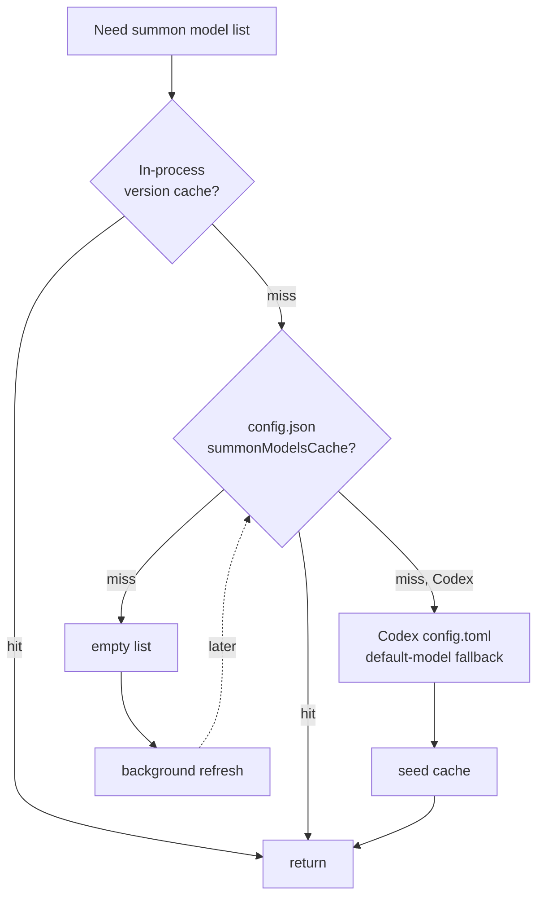

# 3.4 Caching Strategy

> **Last Updated:** 2026-05-22
> **Related:** [3.3 Access Patterns](3.3_access_patterns.md) · [4.1 External APIs](../part4_interfaces/4.1_external_apis.md) · [2.2 Component Design](../part2_architecture/2.2_component_design.md)

---

`agents-council` has no data cache for council state — `state.json` is read fresh on each access because it is the cross-process source of truth. Caching exists only around **expensive external probes**: discovering the models a summonable agent supports, and reading agent CLI versions. These are slow (spawning a subprocess, an SDK round-trip) and rarely change.

## Caching Layers



### Layer 1 — In-process version cache
Agent CLI versions are cached for the life of the process:

| Cache | Variable | Key |
|-------|----------|-----|
| Claude version | `cachedVersion: string \| null` | (single value) |
| Codex version | `cachedCodexVersionsByCommand: Map` | resolved command path |

`getClaudeCodeVersion()` / `getCodexCliVersion()` spawn `<bin> --version` only once; subsequent calls return the memoized value. This avoids re-spawning a subprocess every time the Settings panel asks for versions.

### Layer 2 — On-disk model cache (`config.json`)
`summonModelsCache` persists the discovered model list per agent with an `updatedAt` timestamp:

```json
"summonModelsCache": {
  "Codex": {
    "models": [ { "value": "gpt-5.2-codex", "displayName": "…", "description": "…",
                  "supportedReasoningEfforts": [...], "defaultReasoningEffort": "..." } ],
    "updatedAt": "2026-05-22T10:00:00.000Z"
  }
}
```

`loadCachedSummonModelsByAgent()` reads this first. The cache is what makes the MCP `summon_agent` tool able to validate a `model` override (the Zod schema checks the override against the cached list) without a live network call at registration time.

### Layer 3 — Codex config-file fallback
If the Codex cache is empty, the runner reads `~/.codex/config.toml` and seeds the cache with the configured default `model` (`loadCodexFallbackModels`). This guarantees at least one valid model offline, and the seed is written back to the cache if absent.

### Layer 4 — Background refresh
When a cached list is missing, the system refreshes **without blocking** the caller:

- `refreshSummonModelsInBackground()` fires `refreshSummonModelsByAgent()` and ignores the promise.
- The bridge `getSummonSettingsAction` triggers this whenever any agent's cached list is empty.
- A live refresh fetches Claude models via the Agent SDK `supportedModels()` and Codex models via the `app-server` JSON-RPC `model/list`, each with an 8 s timeout (`MODEL_REFRESH_TIMEOUT_MS`).

## What Is *Not* Cached

| Data | Why no cache |
|------|--------------|
| `state.json` | Cross-process truth — must be read fresh so every process sees the latest councils |
| Model-council member answers | Each `run_model_council` is a fresh deliberation |
| Summoned-agent responses | Each summon is a one-shot contribution |
| Cursor positions | Held by the caller, not the server |

## Cache Invalidation

| Cache | Invalidated by |
|-------|----------------|
| In-process version | process restart (no TTL) |
| Model cache (disk) | explicit `refreshSummonModels` (Settings "refresh"), or background refresh on empty |
| Codex fallback seed | overwritten by a successful live refresh |

There is no time-based expiry on the disk model cache; it is refreshed on demand or when empty. `updatedAt` records when the list was last fetched but is informational rather than an enforced TTL.

## Timeout Discipline

Every external probe is wrapped in `withTimeout(promise, 8000)`. If model discovery hangs (a stuck `app-server`, a slow SDK), the call rejects after 8 s and the system falls back to whatever is cached (or empty), keeping the UI responsive. Subprocesses spawned for discovery are always killed in a `finally` block.

---

*Next: [3.5 Data Migration History →](3.5_migrations.md)*
