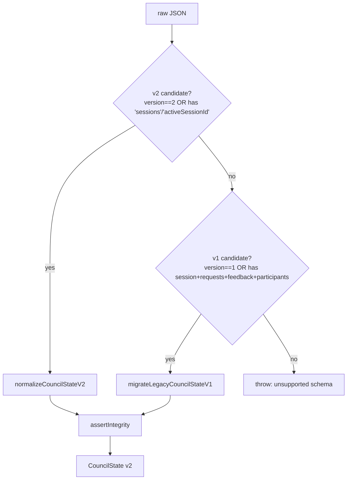
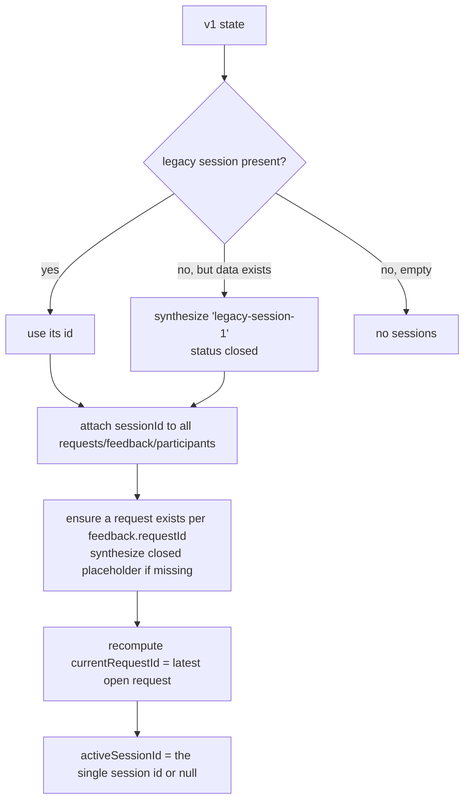

# 3.5 Data Migration History

> **Last Updated:** 2026-05-22
> **Related:** [3.1 Data Model](3.1_data_model.md) · [2.4 ADRs](../part2_architecture/2.4_adrs.md) · [Appendix B: Schemas](../appendices/B_schemas.md)
>
> *Implementation: `src/core/state/fileStateStore.ts`.*

---

`state.json` carries a `version` field and migrates forward automatically on load. There is exactly one migration so far: **v1 (single-session) → v2 (multi-session)**, introduced with the Electrobun pivot ([ADR-05](../part2_architecture/2.4_adrs.md)).

## Version Map

| Version | Shape | Status |
|---------|-------|--------|
| v1 (`LEGACY_STATE_VERSION = 1`) | One implicit `session` object + flat `requests`/`feedback`/`participants` (no `sessionId` fields) | Migrated on load |
| v2 (`DEFAULT_STATE_VERSION = 2`) | `sessions[]` + `activeSessionId` + `sessionId`-keyed `requests`/`feedback`/`participants` | Current |

## Migration Detection

On every `load`, `normalizeCouncilState` classifies the raw JSON:

A brand-new install (file absent → `ENOENT`) starts from `createInitialState()` at v2.

## The v1 → v2 Migration

The legacy v1 state had a single `session` (or `null`) and rows with no `sessionId`. The migration (`migrateLegacyCouncilStateV1`) reconstructs a one-session v2 world:

### Migration rules in detail

1. **Session id.** If the legacy `session` exists, its id is reused. Otherwise, if there is any request/feedback/participant data, a synthetic session `legacy-session-1` is created with `status: "closed"` and a `createdAt` inferred from the earliest timestamp across requests/feedback/participants. If there is no data at all, no session is created.

2. **Row re-keying.** Every request, feedback, and participant gets the resolved `sessionId` stamped onto it.

3. **Dangling feedback repair.** If feedback references a `requestId` that has no matching request, a synthetic placeholder request is created (`content: "[Migrated request unavailable]"`, `status: "closed"`, author = the feedback's author) so integrity holds.

4. **Current request.** `currentRequestId` is recomputed as the latest *open* request for the session (open before closed, then by recency, then id).

5. **Active session.** `activeSessionId` is set to the single migrated session id, or `null` if none.

The migrated result is run through `assertCouncilStateIntegrity` before being returned, so a successful migration always yields a valid v2 state.

## Field-name Tolerance

Both the v1 migrator and the v2 normalizer accept **camelCase or snake_case** field names for every input field (`createdAt` ⟷ `created_at`, `agentName` ⟷ `agent_name`, `currentRequestId` ⟷ `current_request_id`, etc.). This makes the store tolerant of hand-edited or externally-produced state files.

## Write-Back Behavior

Migration is **lazy and write-on-next-mutation**. A `load` returns the migrated in-memory v2 state but does not rewrite the file. The file is rewritten in v2 form the next time any `update()` runs (which re-normalizes and persists). A read-only session therefore leaves the on-disk v1 file untouched until the first write.

## Failure Modes

| Situation | Behavior |
|-----------|----------|
| File missing | Fresh v2 initial state (no error) |
| Invalid JSON | Throws: *"State file is invalid JSON at &lt;path&gt;. Fix or remove the file and retry."* |
| Unrecognized schema (neither v1 nor v2) | Throws: *"State file contains an unsupported schema."* |
| Integrity violation after migration | Throws the specific integrity error (duplicate id, dangling reference, etc.) |

## Adding a Future Migration

The established pattern for a hypothetical v3:

1. Bump `DEFAULT_STATE_VERSION` to 3; keep v2 detection as the new "legacy" branch.
2. Add a `migrateCouncilStateV2toV3` transformer.
3. Extend `normalizeCouncilState` to route v2 candidates through it.
4. Keep all transforms idempotent and finish with `assertCouncilStateIntegrity`.
5. Preserve field-name tolerance for forward compatibility.

---

*Next: [Part 4 — 4.1 External API Documentation →](../part4_interfaces/4.1_external_apis.md)*
