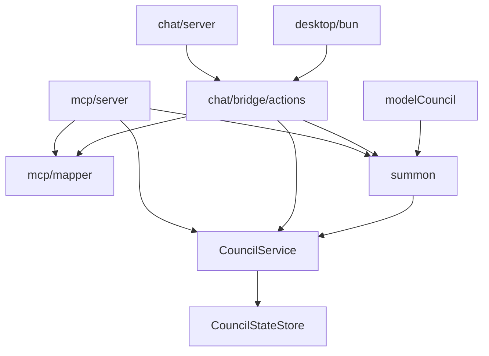

# 4.2 Internal Service APIs

> **Last Updated:** 2026-05-22
> **Related:** [2.2 Component Design](../part2_architecture/2.2_component_design.md) · [3.1 Data Model](../part3_data/3.1_data_model.md) · [4.3 Events](4.3_events.md)

---

The internal contracts that the transport faces depend on. These are TypeScript interfaces and functions, not network APIs.

## CouncilService

The central domain interface (`core/services/council/index.ts`). Every face ultimately calls these eight methods.

```typescript
interface CouncilService {
  startCouncil(input: StartCouncilInput): Promise<StartCouncilResult>;
  getCurrentSessionData(input: GetCurrentSessionDataInput): Promise<GetCurrentSessionDataResult>;
  getSessionData(input: GetSessionDataInput): Promise<GetSessionDataResult>;
  sendResponse(input: SendResponseInput): Promise<SendResponseResult>;
  closeCouncil(input: CloseCouncilInput): Promise<CloseCouncilResult>;
  closeSession(input: CloseSessionInput): Promise<CloseSessionResult>;
  listSessions(input?: ListSessionsInput): Promise<ListSessionsResult>;
  setActiveSession(input: SetActiveSessionInput): Promise<SetActiveSessionResult>;
}
```

Plus a non-interface convenience method on the impl: `sendResponseToSession({agentName, content, sessionId})` — the session-targeted send used by the MCP face and summon.

| Method | Throws when |
|--------|-------------|
| `getCurrentSessionData` | never (returns a null session if none active) |
| `getSessionData` / `setActiveSession` / `closeSession` | session not found |
| `closeCouncil` / `sendResponse` | no active session |
| `closeSession` | session already closed |
| `sendResponseToSession` | session closed, or no open request |

`CouncilServiceImpl` takes a `CouncilStateStore` in its constructor — the only dependency, enabling tests to inject a store backed by a temp path.

## CouncilStateStore

```typescript
type CouncilStateStore = {
  load(): Promise<CouncilState>;
  save(state: CouncilState): Promise<void>;
  update<T>(updater: CouncilStateUpdater<T>): Promise<T>;
};
```

Implemented by `FileCouncilStateStore(statePath?)`. See [3.3 Access Patterns](../part3_data/3.3_access_patterns.md).

## Exported Domain Helpers

Pure functions exported from `council/index.ts`, reused by summon and the bridge:

| Helper | Purpose |
|--------|---------|
| `getActiveSession(state)` | The session referenced by `activeSessionId`, or null |
| `findSessionById(state, id)` | Session lookup |
| `getCurrentRequestForSession(state, id)` | The session's current open request |
| `getFeedbackForSession(state, id)` | All feedback rows for a session |
| `getParticipantsForSession(state, id)` | All participants for a session |
| `updateParticipant(...)` | Insert-or-update a participant immutably |
| `sortSessionsForListing(sessions, activeId)` | Active-first, then recency, ordering |

## Summon API

From `core/services/council/summon.ts`:

```typescript
summonAgent(input: SummonAgentInput): Promise<SummonAgentResult>      // dispatches by agent
summonClaudeAgent(input): Promise<SummonAgentResult>
summonCodexAgent(input): Promise<SummonAgentResult>

// discovery / metadata
loadCachedSummonModelsByAgent(agents?): Promise<Record<string, SummonModelInfo[]>>
refreshSummonModelsByAgent(agents?): Promise<Record<string, SummonModelInfo[]>>
refreshSummonModelsInBackground(agents?): void
getClaudeCodeVersion(): Promise<string | null>
getCodexCliVersion(): Promise<string | null>
getCodexExecutablePath(): Promise<string | null>

// helpers
resolveDefaultSummonAgent(lastUsed, supported?): string
isSupportedSummonAgent(value): value is "Claude" | "Codex"
SUPPORTED_SUMMON_AGENTS = ["Claude", "Codex"] as const
```

`summonAgent` validates the agent name, requires an active session with an open request, marks the participant pending, persists the chosen model/effort to config, runs the agent, and returns the produced feedback.

## Model Council API

From `core/services/modelCouncil.ts`:

```typescript
runModelCouncil(input: { prompt: string }): Promise<ModelCouncilResult>
buildDefaultMembers(): ModelCouncilMember[]
// prompt builders (exported for testing):
buildProposalMessages(prompt, member): ChatMessage[]
buildDeliberationMessages(prompt, responses, prev, candidate, member, round): ChatMessage[]
buildRatificationMessages(prompt, responses, rounds, candidate, member): ChatMessage[]
```

`runModelCouncil` is the only entry point used in production (by the MCP `run_model_council` tool and the `council solve` CLI command).

## Summon Settings API

From `core/config/summonSettings.ts`:

```typescript
loadSummonSettings(statePath?): Promise<SummonSettings>
upsertSummonSettings(update: SummonSettingsUpdate, statePath?): Promise<SummonSettings>
```

A deliberate load + upsert pair (no granular setters), per the project's simplicity rules.

## Bridge Actions

From `interfaces/chat/bridge/actions.ts` — the face-agnostic action layer shared by the HTTP server and the Electrobun RPC bridge. Each takes an `unknown` payload, validates it, and returns a UI DTO (throwing `BridgeApiError(status, message)` on bad input):

| Action | Returns |
|--------|---------|
| `startCouncilAction` | `StartCouncilResponse` |
| `joinCouncilAction` | `GetCurrentSessionDataResponse` |
| `getCurrentSessionDataAction` | `GetCurrentSessionDataResponse` |
| `listSessionsAction` | `ListSessionsResponse` |
| `setActiveSessionAction` | `GetCurrentSessionDataResponse` |
| `sendResponseAction` | `SendResponseResponse` |
| `closeCouncilAction` | `CloseCouncilResponse` |
| `getSummonSettingsAction` / `refreshSummonModelsAction` / `updateSummonSettingsAction` | `SummonSettingsResponse` |
| `summonAgentAction` | `SummonAgentResponse` |
| `getSettingsAction` / `updateSettingsAction` | `GlobalSettingsResponse` |

Helpers `getErrorStatus(error)` and `getErrorMessage(error)` convert thrown errors into transport-appropriate shapes.

## MCP Mapper

From `interfaces/mcp/mapper.ts` — bidirectional DTO ↔ domain translation: `mapStartCouncilInput`, `mapGetSessionDataInput`, `mapSendResponseToSessionInput`, `mapCloseSessionInput`, `mapSummonAgentInput` (inputs) and `mapStartCouncilResponse`, `mapGetCurrentSessionDataResponse`, `mapSendResponseResponse`, `mapCloseCouncilResponse`, `mapSummonAgentResponse` (outputs). Internally `mapCouncilState(state, sessionId)` narrows multi-session state to one scoped session.

## Dependency Direction



All arrows point toward `core`. No core module imports an interface or CLI module.

---

*Next: [4.3 Event/Message Contracts →](4.3_events.md)*
