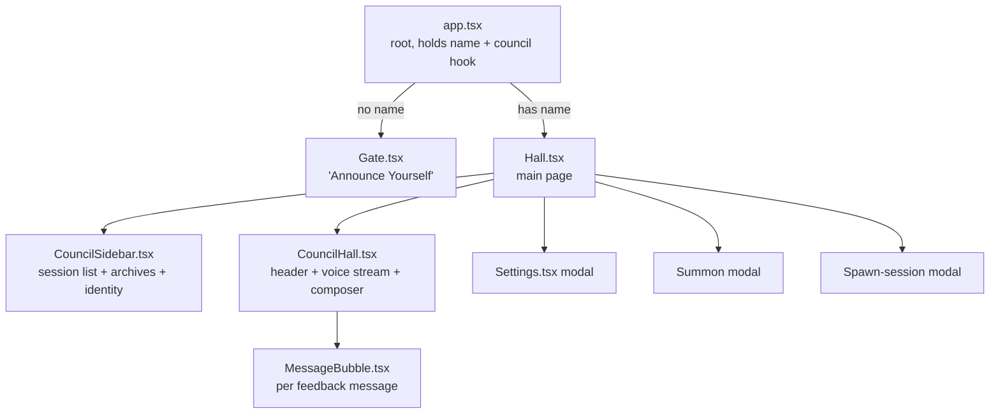
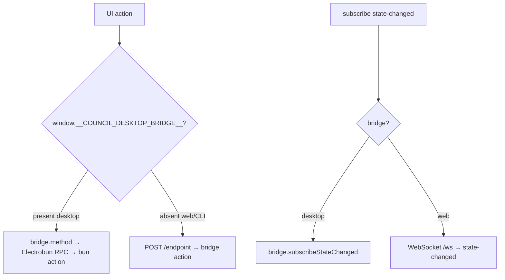
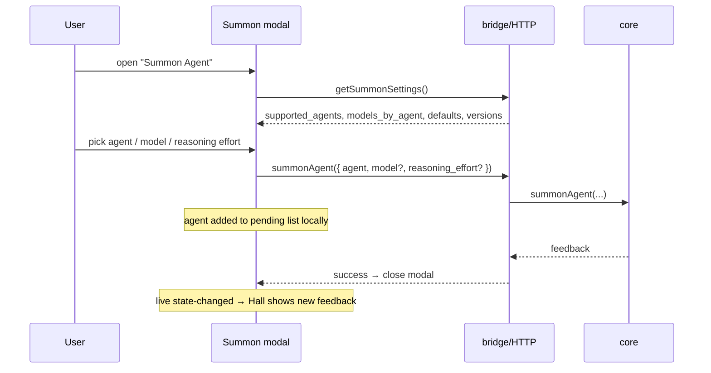

# 4.5 UI / Frontend Architecture

> **Last Updated:** 2026-05-22
> **Related:** [2.8 Dual-Mode Runtime](../part2_architecture/2.8_dual_mode_runtime.md) · [4.3 Events](4.3_events.md) · [5.2 Deployment](../part5_infrastructure/5.2_deployment.md)

---

The human interface is the **Council Hall** — a React 19 application rendered in an Electrobun native webview (primary) or served over HTTP (alternate). The source lives in `src/interfaces/chat/ui/`; the Electrobun renderer entry is `desktop/views/council/`.

## Page & Component Hierarchy

## The Gate → Hall Flow

1. `app.tsx` initializes its `name` state from `loadName()` (localStorage key `agents-council.name`).
2. With no name, it renders **`Gate`** — an "Announce Yourself" form that captures the operator's agent name and calls `onEnter(name)`.
3. `onEnter` runs `saveName(name)` and sets state; the app re-renders into **`Hall`**.
4. `Hall` calls `useCouncil(name)`, which immediately loads a snapshot and subscribes to live updates.

Local identity is the only client-side persisted state. `storage.ts` wraps `localStorage` access in try/catch so a storage failure degrades gracefully rather than crashing the app.

## The `useCouncil` Hook

`useCouncil(name)` is the single state container for the Hall. It exposes a `CouncilContext`:

| Field | Meaning |
|-------|---------|
| `state` | The latest `CouncilStateDto` snapshot |
| `connection` | `"listening"` / `"offline"` |
| `busy` | An async action is in flight |
| `error` / `notice` | Latest error / transient notice |
| `sessions`, `activeSessionId` | Sidebar data |
| `currentRequest`, `feedback` | The active session's request and voice stream |
| `pendingParticipants` | Agents who haven't answered the current request |
| `sessionStatus`, `hallState`, `canClose` | Derived UI states |
| `refresh`, `start`, `join`, `send`, `close`, `selectSession` | Actions |
| `clearError`, `clearNotice` | Dismissers |

`loadSnapshot()` polls `getCurrentSessionData` + `listSessions` and recomputes all derived state. `subscribeCouncilStateChanges()` registers for `state-changed`; on each event the hook simply re-runs `refresh()`. There is no diffing — every change triggers a full re-sync, which is cheap given council sizes.

## Transport: Bridge First, HTTP Fallback

`ui/api.ts` abstracts *how* the renderer reaches the core, so the same React code runs in both faces:

- **Desktop (primary):** the bun process injects `window.__COUNCIL_DESKTOP_BRIDGE__` (an Electrobun RPC client). Each call returns a `BridgeResult<T>`.
- **Web/CLI (alternate):** `api.ts` falls back to `fetch` against the HTTP endpoints and opens a WebSocket to `/ws` for `state-changed`.

Both paths land on the same `bridge/actions.ts` functions, so behavior is identical.

## CouncilHall (the main panel)

Renders three regions:

- **Header** — session title (derived from the first request), participant avatars/stack, and the "Summon Agent" call-to-action.
- **Voice stream** — the ordered `feedback` list as `MessageBubble`s, plus the request itself.
- **Composer** — a text input + send, posting `sendResponse(name, content)`.

`MessageBubble` classifies each message by **agent type** inferred from the author name (`claude`, `codex`, `gemini`, `human`, `other`, `system`) for styling, renders content as markdown (with code highlighting), and marks the operator's own messages.

## CouncilSidebar

Lists sessions split into **active** and **archives** (closed), each row showing title, timestamp, participant count, and message count (`SessionListItemDto`). Clicking a row calls `selectSession(name, sessionId)` (→ `setActiveSession`). A "Spawn Session" action opens the new-council modal; an identity footer shows the operator name and a Settings entry point.

## Settings Modal

`Settings.tsx` loads `getSettings()` and edits:

- **Identity** — the operator's name (re-persisted on save).
- **Tool paths** — optional **Claude Code Path** and **Codex Path** overrides (`updateSettings({ claude_code_path, codex_path })`), used by the summon runner to locate the binaries.

It also surfaces detected `claude_code_version` / `codex_cli_version` (from `getSummonSettings`).

## Summon Flow (UI)

Model and reasoning-effort dropdowns are filtered by the selected agent and its cached model list; the reasoning-effort selector only appears when the chosen model advertises `supported_reasoning_efforts`. Defaults come from saved per-agent settings, falling back to the first available model/effort.

## Design System

The Council Hall follows the canonical "Council Hall" redesign (`docs/ui-spec.md`): a session sidebar (chronicle + spawn + archive), and a Hall with an active-session header, voice stream, composer, and summon entry point. Model and agent selections persist in `~/.agents-council/config.json`. The standalone `Design Council Hall Interface/` directory in the repo is the design reference that this implementation tracks.

## Renderer Entry (`desktop/views/council/`)

The Electrobun view bundle (`index.ts` + `index.html` + copied `styles.css`) mounts the React app and establishes the RPC bridge. `electrobun.config.ts` copies `src/interfaces/chat/ui/styles.css` into the view and registers the `council` view entrypoint. The bun process (`desktop/bun/index.ts`) opens a 1280×820 window titled "Agents Council" and wires the state watcher to push `stateChanged` to the webview.

---

*Next: [Part 5 — 5.1 Infrastructure Architecture →](../part5_infrastructure/5.1_infra_architecture.md)*
