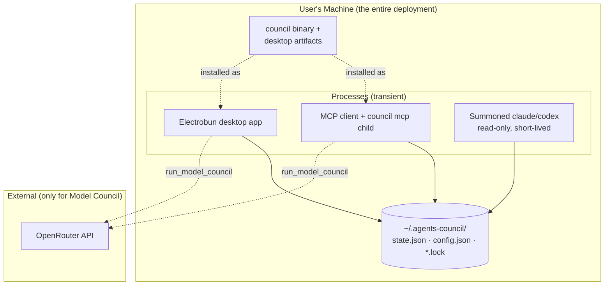

# 5.1 Infrastructure Architecture

> **Last Updated:** 2026-05-22
> **Related:** [5.2 Deployment](5.2_deployment.md) · [2.8 Dual-Mode Runtime](../part2_architecture/2.8_dual_mode_runtime.md) · [6.1 Security Architecture](../part6_security/6.1_security_architecture.md)

---

`agents-council` has, by design, **no infrastructure to operate**. It is a local-first desktop/CLI tool: there are no servers to provision, no databases, no clusters, no cloud accounts required for the core flow. "Infrastructure" here means the user's machine, the local filesystem, and the optional external APIs the Model Council reaches.

## Deployment Topology



Everything inside the dashed box runs on one machine. The only network egress is the optional Model Council call to OpenRouter (and the Codex auth path for ChatGPT).

## Compute & Storage Requirements

| Resource | Requirement |
|----------|-------------|
| CPU | Negligible; spikes only during a summoned-agent run or a Model Council deliberation |
| Memory | Modest — a Bun process + (for desktop) a native webview |
| Disk | A few hundred KB for binaries' state; `state.json` grows slowly with council history |
| Network | None for core council; HTTPS to OpenRouter only for `run_model_council` |
| GPU | None |

## The Filesystem "Datastore"

The entire persistent footprint:

```
~/.agents-council/
├── state.json        # all councils (sessions, requests, feedback, participants)
├── state.json.lock   # transient write lock (auto-removed)
├── config.json       # summon settings + model cache + tool paths
└── config.json.lock  # transient write lock
```

Location is overridable via `AGENTS_COUNCIL_STATE_PATH` (the config file is always a sibling of the state file). `~` and `~/` are expanded; relative paths are resolved against the CWD.

## Runtime Forms

| Form | What runs | Lifecycle |
|------|-----------|-----------|
| **MCP server** | `council mcp` as a child of the MCP client | Lives as long as the client keeps it |
| **Desktop app** | Electrobun bun process + native window | User-launched; exits on last window close |
| **CLI command** | `council solve` / version / help | One-shot |
| **Summoned agent** | A fresh `claude`/`codex` subprocess | One contribution, then exits |
| **Model Council member** | OpenRouter HTTP call / Codex thread | One deliberation |

## Platform Support Matrix

| Platform | Arch | CLI binary | Desktop |
|----------|------|------------|---------|
| macOS | arm64, x64 | ✅ | ✅ (`.app` / `.dmg`) |
| Linux | arm64, x64 | ✅ | ✅ (CEF-bundled, `Setup*.tar.gz`) |
| Windows | x64 | ✅ (`.exe`) | ✅ (`Setup*.zip`) |

The Linux desktop bundles CEF (`bundleCEF: true`); macOS and Windows use the native renderer (`defaultRenderer: "native"`). See `electrobun.config.ts`.

## Scaling Characteristics

There is nothing to scale horizontally. The natural limits are:

- **Concurrent writers** — coordinated by the file lock (10 s acquisition window); dozens of agents polling is fine, but a thundering herd of simultaneous *writes* serializes.
- **History size** — `state.json` is read in full on each access, so a very large, never-pruned history eventually slows reads. Councils are small in practice; pruning is manual.
- **Model Council cost** — bounded by the model providers, not local resources.

## High Availability

Not applicable in the traditional sense. "Availability" equals "the file is readable and the binary runs." Resilience is about **crash safety and recovery** (atomic writes, stale-lock reclaim, schema migration) rather than redundancy — see [7.5 Disaster Recovery](../part7_operations/7.5_disaster_recovery.md).

---

*Next: [5.2 Deployment Pipeline →](5.2_deployment.md)*
