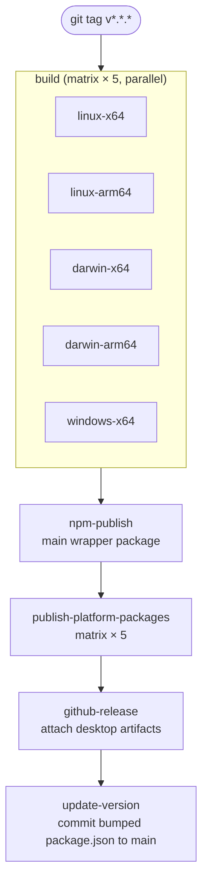
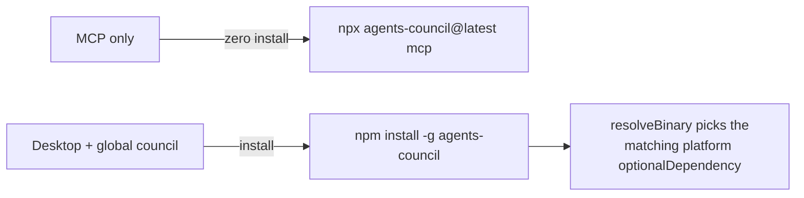

# 5.2 Deployment Pipeline

> **Last Updated:** 2026-05-22
> **Related:** [8.4 CI/CD](../part8_development/8.4_cicd.md) · [5.4 Infrastructure as Code](5.4_iac.md) · [4.4 Integration Catalog](../part4_interfaces/4.4_integrations.md)

---

"Deployment" for `agents-council` means **publishing artifacts**, not running services: a tagged release builds the CLI binary and Electrobun desktop bundles for five platforms, publishes them to npm as per-platform packages, and attaches the desktop installers to a GitHub release. The pipeline lives in `.github/workflows/release.yml`.

## Trigger

A push of a semver tag (`v*.*.*`) starts the release pipeline. The version flows from the git tag into `package.json`, the compiled binary (`__COUNCIL_VERSION__`), and the Electrobun build (`AGENTS_COUNCIL_VERSION`).

## Pipeline Stages



### Stage 1 — `build` (matrix, parallel)
Per platform: checkout → setup Bun → cache → `bun install --frozen-lockfile --linker=isolated` → sync version from tag → compile the CLI (`bun build src/cli/index.ts --compile --minify --define __COUNCIL_VERSION__ --outfile=dist/council[.exe]`) → smoke-test (`council --version` / `--help`) → build Electrobun stable artifacts → upload as `release-<package>`.

| Platform | Runner | Arch | npm os/cpu | Binary ext |
|----------|--------|------|------------|-----------|
| linux-x64 | ubuntu-latest | x64 | linux / x64 | — |
| linux-arm64 | ubuntu-24.04-arm | arm64 | linux / arm64 | — |
| darwin-x64 | macos-13 | x64 | darwin / x64 | — |
| darwin-arm64 | macos-14 | arm64 | darwin / arm64 | — |
| windows-x64 | windows-latest | x64 | win32 / x64 | `.exe` |

### Stage 2 — `npm-publish` (main wrapper)
Publishes the user-facing `agents-council` package. It ships only the launcher scripts (`cli.cjs`, `resolveBinary.cjs`, `postuninstall.cjs`), `README.md`, and `LICENSE`, declares `bin.council`, and sets `optionalDependencies` to the five platform packages at the same version. The launcher resolves and execs the correct platform binary at runtime.

### Stage 3 — `publish-platform-packages` (matrix)
For each platform: download `release-<package>`, assemble a `pkg/` containing the CLI binary + desktop artifacts (`*.dmg`, `*.tar.zst`, `*update.json`, `Setup*.zip`/`Setup*.tar.gz`) + README/LICENSE, generate a platform `package.json` with `os`/`cpu` constraints, dry-run, then `npm publish --access public` (OIDC trusted publishing).

### Stage 4 — `github-release`
Creates the GitHub release for the tag and uploads the desktop installers/bundles/update metadata for all platforms.

### Stage 5 — `update-version`
Checks out `main`, writes the released version into `package.json`, and commits it back with `[skip ci]`.

## Artifact Anatomy (per platform)

The CI build-smoke job (`ci.yml`) validates that each Electrobun build emits the expected set:

| Artifact | Pattern | Purpose |
|----------|---------|---------|
| Compressed bundle | `stable-<platform>-*.tar.zst` | The desktop app payload |
| Update metadata | `stable-<platform>-*update.json` | Electrobun self-update manifest |
| Installer (mac) | `*.dmg` | macOS installer |
| Installer (linux) | `*Setup*.tar.gz` | Linux installer |
| Installer (win) | `*Setup*.zip` | Windows installer |
| CLI binary | `council` / `council.exe` | Standalone CLI |

## Local Build Commands

The same artifacts can be produced locally:

```bash
bun run build               # compile CLI → dist/council
bun run desktop:dev         # run the desktop app from source (electrobun dev)
bun run desktop:build       # build desktop artifacts (electrobun build)
bun run desktop:build:stable  # stable channel build (used by CI)
```

## Installation Paths (consumer side)



- **MCP-only** users need no install — `npx`/`bunx` fetches and runs the server.
- **Desktop / global CLI** users `npm install -g agents-council`; npm pulls the one matching platform optional dependency, and the launcher execs its binary.

## Rollback

Because releases are immutable npm versions + a GitHub release, rollback is "pin the previous version": `npm install -g agents-council@<prev>` or point the MCP command at `agents-council@<prev>`. There is no server state to roll back.

---

*Next: [5.3 Environment Configuration →](5.3_environments.md)*
