# 5.3 Environment Configuration

> **Last Updated:** 2026-05-22
> **Related:** [9.1 Configuration Reference](../part9_reference/9.1_config_reference.md) · [6.2 Auth](../part6_security/6.2_auth.md) · [3.4 Caching](../part3_data/3.4_caching.md)

---

`agents-council` is configured entirely through **environment variables**, the **`config.json`** file, and **CLI flags** — there is no config file format of its own beyond `config.json`. This section catalogs every knob and how it resolves.

## Environment Variables

### Core / state

| Variable | Default | Effect |
|----------|---------|--------|
| `AGENTS_COUNCIL_STATE_PATH` | `~/.agents-council/state.json` | Overrides the state file location; `config.json` is always its sibling |

### Summon — executable paths & debug

| Variable | Default | Effect |
|----------|---------|--------|
| `CLAUDE_CODE_PATH` | `claude` (PATH) | Path to the Claude Code executable (config wins over this) |
| `CODEX_PATH` | bundled Codex | Path to the Codex CLI (config wins over this) |
| `AGENTS_COUNCIL_SUMMON_DEBUG` | unset | `1`/`true`/`yes` → append a JSONL trace to `./summon-debug.log` |

### Model Council

| Variable | Default | Effect |
|----------|---------|--------|
| `OPENROUTER_API_KEY` | — (required) | Auth for Kimi & DeepSeek; absence aborts `run_model_council` |
| `OPENROUTER_HTTP_REFERER` | unset | Optional `HTTP-Referer` header for OpenRouter |
| `AGENTS_COUNCIL_KIMI_MODEL` | `moonshotai/kimi-k2.6` | Kimi model id |
| `AGENTS_COUNCIL_DEEPSEEK_MODEL` | `deepseek/deepseek-v4-pro` | DeepSeek model id |
| `AGENTS_COUNCIL_CHATGPT_MODEL` | `gpt-5.5-pro` | ChatGPT (Codex) model name |

### Desktop launch (advanced)

| Variable | Default | Effect |
|----------|---------|--------|
| `COUNCIL_DESKTOP_COMMAND` | unset | Override the executable used to launch the desktop runtime |
| `COUNCIL_DESKTOP_ARGS` | unset | Space-separated args for the override command |
| `COUNCIL_DESKTOP_LAUNCH_SOURCE` | set by launcher | `default` or `chat`; passed to the spawned desktop process |
| `AGENTS_COUNCIL_VERSION` | `0.4.0` | Version stamped into the Electrobun build |

### Build / runtime version

| Variable | Effect |
|----------|--------|
| `__COUNCIL_VERSION__` (compile-time define) | Embedded CLI version; falls back to `npm_package_version` then nearby `package.json` then `0.0.0` |

## CLI Flags

```text
council mcp [-f|--format markdown|json] [-n|--agent-name <name>]
council chat [-p|--port <n>]   # deprecated flags ignored; launches desktop
council solve <prompt...> [--json]
council [-v|--version]
```

- `--format` chooses markdown (default) or JSON tool output.
- `--agent-name` bakes in a default identity and removes `agent_name` from `start_council`/`join_council` schemas.
- `--port` / `--no-open` are accepted but ignored with a warning (legacy of the HTTP chat era).

## `config.json`

A sibling of `state.json`, holding all **summon** configuration. Managed by `core/config/summonSettings.ts` (load + upsert under a lock).

```json
{
  "lastUsedAgent": "Codex",
  "agents": {
    "Claude": { "model": null, "reasoningEffort": null },
    "Codex":  { "model": "gpt-5.2-codex", "reasoningEffort": "high" }
  },
  "claudeCodePath": null,
  "codexPath": null,
  "summonModelsCache": {
    "Codex": { "models": [ /* SummonModelInfo[] */ ], "updatedAt": "2026-05-22T..." }
  }
}
```

| Field | Purpose |
|-------|---------|
| `lastUsedAgent` | Default agent for the next summon |
| `agents[name]` | Saved model + reasoning effort per agent |
| `claudeCodePath` / `codexPath` | Tool-path overrides (set via Settings UI) |
| `summonModelsCache` | Cached discovered models per agent (see [3.4](../part3_data/3.4_caching.md)) |

## Resolution Precedence

```mermaid
graph TD
    subgraph state["State path"]
        S1[explicit arg] --> S2[AGENTS_COUNCIL_STATE_PATH] --> S3[~/.agents-council/state.json]
    end
    subgraph exe["Executable path"]
        E1[config.json claudeCodePath/codexPath] --> E2[CLAUDE_CODE_PATH/CODEX_PATH] --> E3[PATH 'claude' / bundled Codex]
    end
    subgraph model["Summon model"]
        M1[explicit input.model] --> M2[config agents.model] --> M3[SDK/CLI default]
    end
    subgraph council["Council member model"]
        C1[AGENTS_COUNCIL_*_MODEL env] --> C2[built-in default]
    end
```



## Environment Profiles

`agents-council` has no notion of dev/staging/prod environments — it is a single-environment local tool. The closest analogs:

| "Environment" | Distinguished by |
|---------------|------------------|
| **MCP-only** | `OPENROUTER_API_KEY` and summon auth optional; no desktop needed |
| **Full desktop** | `npm install -g`; summon needs `claude`/`codex` authenticated |
| **Model Council enabled** | `OPENROUTER_API_KEY` set + `codex login` done |
| **Debugging summon** | `AGENTS_COUNCIL_SUMMON_DEBUG=1` |
| **CI** | `AGENTS_COUNCIL_VERSION=ci-smoke`, isolated builds |

## Cost Posture

Only `run_model_council` / `council solve` spends money. With three members and up to four deliberation rounds plus ratification, a single run can issue ~18 model calls. Treat it as a deliberate, billable action; the core council, summoning, and desktop are free of per-use cost beyond whatever the summoned agent's own subscription implies.

---

*Next: [5.4 Infrastructure as Code →](5.4_iac.md)*
