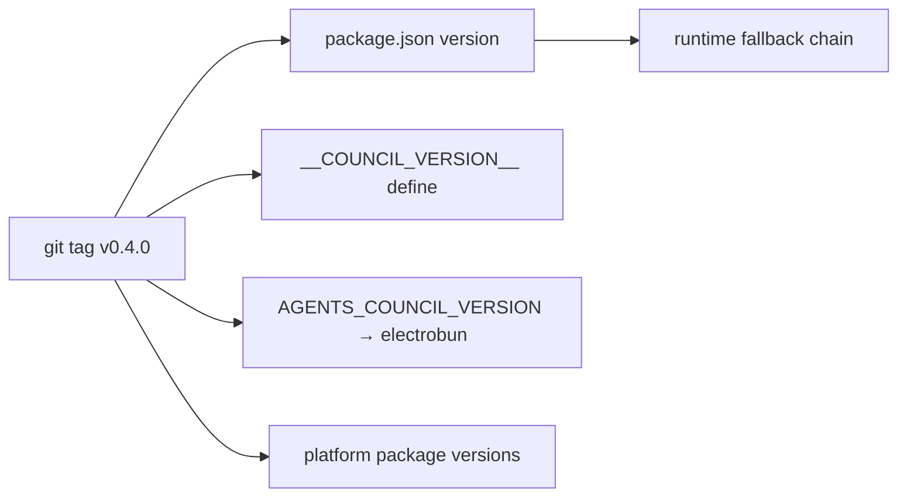

# 5.4 Infrastructure as Code

> **Last Updated:** 2026-05-22
> **Related:** [5.2 Deployment](5.2_deployment.md) · [8.4 CI/CD](../part8_development/8.4_cicd.md) · [4.4 Integration Catalog](../part4_interfaces/4.4_integrations.md)

---

There is no cloud infrastructure to declare. The "infrastructure as code" for `agents-council` is the set of declarative configuration files that define how it builds, packages, lints, and ships. This section is the index to those files.

## Configuration Files

| File | Defines |
|------|---------|
| `package.json` | Scripts, dependencies, bin, per-platform optionalDependencies, lint-staged |
| `electrobun.config.ts` | Desktop app identity, build entrypoints, per-OS renderer choice |
| `tsconfig.json` | TypeScript compiler options |
| `biome.json` | Lint + format rules and ignores |
| `bun.lock` | Pinned dependency lockfile |
| `skills-lock.json` | Pinned development skills (Backlog.md) |
| `.github/workflows/ci.yml` | Per-push/PR lint, typecheck, build smoke |
| `.github/workflows/release.yml` | Tag-driven build + publish + release |
| `.husky/pre-commit` | Git hook running lint-staged |

## `electrobun.config.ts`

The desktop build descriptor:

```typescript
export default {
  app: { name: "Agents Council", identifier: "dev.agents.council",
         version: process.env.AGENTS_COUNCIL_VERSION ?? "0.4.0" },
  runtime: { exitOnLastWindowClosed: true },
  build: {
    bun:   { entrypoint: "desktop/bun/index.ts" },
    views: { council: { entrypoint: "desktop/views/council/index.ts" } },
    copy:  { "desktop/views/council/index.html": "views/council/index.html",
             "src/interfaces/chat/ui/styles.css": "views/council/styles.css" },
    mac:   { defaultRenderer: "native" },
    win:   { defaultRenderer: "native" },
    linux: { bundleCEF: true, defaultRenderer: "cef" },
  },
} satisfies ElectrobunConfig;
```

Key facts: the app version is injected from `AGENTS_COUNCIL_VERSION`; the window closes the app on last-window-close; macOS/Windows use the native webview while Linux bundles CEF; the UI stylesheet is shared with the chat UI by copy.

## `package.json` Scripts

| Script | Command | Purpose |
|--------|---------|---------|
| `build` | `bun build src/cli/index.ts --compile --outfile dist/council` | Compile the CLI binary |
| `cli` | `bun src/cli/index.ts` | Run the CLI from source |
| `desktop:dev` | `electrobun dev` | Run the desktop app from source |
| `desktop:build` | `electrobun build` | Build desktop artifacts |
| `desktop:build:stable` | `electrobun build --env=stable` | Stable-channel build (CI) |
| `lint` | `biome lint .` | Lint |
| `format` | `biome format --write .` | Format |
| `format:check` | `biome check --formatter-enabled=true --linter-enabled=false .` | Format check |
| `typecheck` | `tsc --noEmit` | Type check |
| `prepare` | `husky` | Install git hooks |

## `biome.json`

```json
{
  "files": { "includes": ["**", "!**/dist", "!Design Council Hall Interface"] },
  "formatter": { "enabled": true, "indentStyle": "space", "indentWidth": 2, "lineWidth": 120 },
  "linter": { "enabled": true, "rules": { "recommended": true } },
  "assist": { "actions": { "source": { "organizeImports": "off" } } }
}
```

Two-space indent, 120-column lines, Biome's recommended lint set, with `dist/` and the design-reference directory excluded.

## Lockfiles as Pins

- `bun.lock` pins the full dependency tree; CI installs with `--frozen-lockfile` so builds are reproducible.
- `skills-lock.json` pins the two development skills (`backlog-technical-project-manager`, `context-hunter`) by content hash from `mrlesk/backlog.md`.

## Versioning Model

The released version has one source of truth — the **git tag** — propagated at build time:



At runtime the CLI resolves its version from the compile-time define first, then `npm_package_version`, then a nearby `package.json`, then `0.0.0`.

## What Is *Not* Codified

There is intentionally no Terraform, no Helm, no Dockerfile, no Kubernetes manifests, and no cloud account configuration — because there is no server-side deployment. The deployment surface is npm + GitHub Releases, both driven by the workflow YAML above.

---

*Next: [Part 6 — 6.1 Security Architecture →](../part6_security/6.1_security_architecture.md)*
