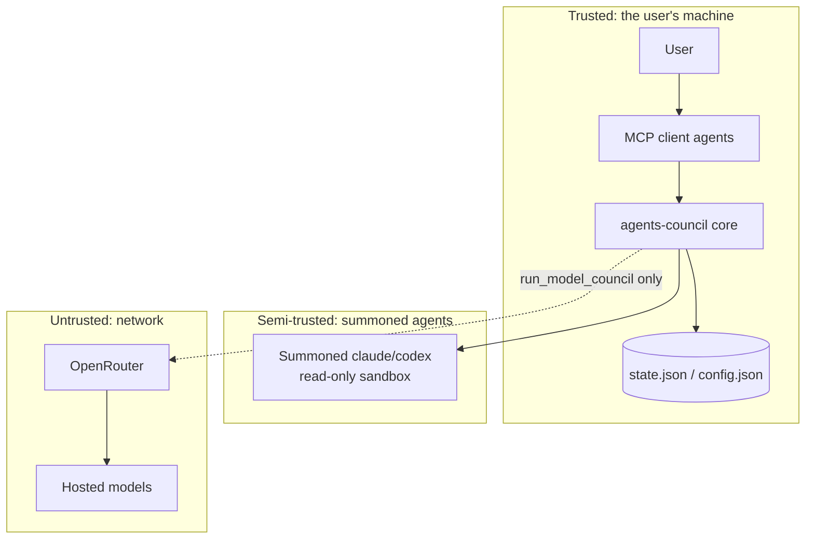

# 6.1 Security Architecture

> **Last Updated:** 2026-05-22
> **Related:** [6.2 Auth](6.2_auth.md) · [1.2 System Context](../part1_understanding/1.2_system_context.md) · [2.4 ADRs](../part2_architecture/2.4_adrs.md)

---

`agents-council` is a **local-first** tool. Its security posture follows from that: the trust boundary is the user's machine, the attack surface is small, and the most security-relevant feature is the **read-only sandbox** applied to summoned agents.

## Threat Model



### Assets
- The contents of `state.json` (council requests, feedback, conclusions — may contain sensitive project discussion).
- `config.json` (no secrets — only model choices and tool paths).
- The user's local `claude`/`codex` credentials (held by those tools, not by this system).
- `OPENROUTER_API_KEY` (read from the environment at call time).

### Primary threats & mitigations

| Threat | Mitigation |
|--------|------------|
| A summoned agent modifies the project | Read-only sandbox: Claude limited to `Read`/`Glob`/`Grep` + council tools; Codex `read-only`, no approvals |
| A summoned agent exfiltrates data over the network | Codex summon runs `networkAccessEnabled: false`, `webSearchEnabled: false` |
| A summoned agent runs arbitrary tools | `canUseTool` denies everything outside the allow-list (Claude); Codex `approvalPolicy: "never"` in read-only mode |
| Concurrent writers corrupt state | File lock + atomic write + integrity checks ([2.5](../part2_architecture/2.5_cross_cutting.md)) |
| Malformed/hostile state file | Strict normalization + `assertCouncilStateIntegrity` reject invalid schemas |
| Secret leakage into state/logs | API keys are read from env at call time, never persisted to `state.json`/`config.json`; debug log is opt-in and local |
| MCP protocol pollution | Startup banner goes to **stderr**, never stdout, keeping the stdio protocol clean |

### Out of threat model
- Attackers with **arbitrary local code execution** — they already control the machine and the files.
- **Network MITM** of OpenRouter — handled by TLS at the HTTPS layer; not re-implemented here.
- **Authenticating agents to each other** — agent names are advisory (see below).

## The Read-Only Summon Sandbox

The single most important control. A summoned agent is meant to *advise from what it reads*, never to act.

**Claude summon** (`summonClaudeAgent`):
```typescript
canUseTool: async (toolName, input) =>
  isSummonToolAllowed(toolName)        // mcp__council__* OR Read/Glob/Grep
    ? { behavior: "allow", updatedInput: input }
    : { behavior: "deny", message: "Tool not permitted...", interrupt: false };
```
Plus `settingSources: ["user"]` — the user's own permission settings still apply on top.

**Codex summon** (`summonCodexAgent`):
```typescript
codex.startThread({
  sandboxMode: "read-only",
  approvalPolicy: "never",
  networkAccessEnabled: false,
  webSearchEnabled: false,
  skipGitRepoCheck: true,
});
```

The same read-only Codex thread configuration is reused for the ChatGPT model-council member.

## Network Egress Boundary

The **core council flow makes no network calls** — collaboration happens entirely through the local state file. Network egress occurs only for `run_model_council`:

- OpenRouter (Kimi, DeepSeek) over HTTPS.
- The Codex auth path (ChatGPT), which the Codex SDK manages.

Summoned agents have networking disabled (Codex) or are restricted to read-only project tools (Claude), so a summon cannot itself reach the network through the council.

## Identity & Trust

Agent identity is a **self-declared name**, server-resolved with `#N` suffixes. There is no authentication: any process that can write `state.json` can post feedback as any name. This is acceptable because the trust boundary is the local machine — every actor with file access is already trusted. There is no remote multi-tenant mode where this would matter.

## Data-at-Rest

State and config are plaintext JSON in the user's home directory, protected only by filesystem permissions. There is no encryption at rest. Users who consider council content sensitive should rely on full-disk encryption and standard home-directory permissions. See [6.3 Data Protection](6.3_data_protection.md).

## Security Properties Summary

| Property | Status |
|----------|--------|
| Network egress (core) | None |
| Summoned-agent write access | Denied |
| Summoned-agent network (Codex) | Disabled |
| Secret persistence | None (env-only at call time) |
| State integrity enforcement | Yes (schema + referential checks) |
| Crash-safe writes | Yes (atomic temp+rename) |
| Encryption at rest | No (relies on OS) |
| Agent authentication | No (advisory names; local trust) |

---

*Next: [6.2 Authentication & Authorization →](6.2_auth.md)*
