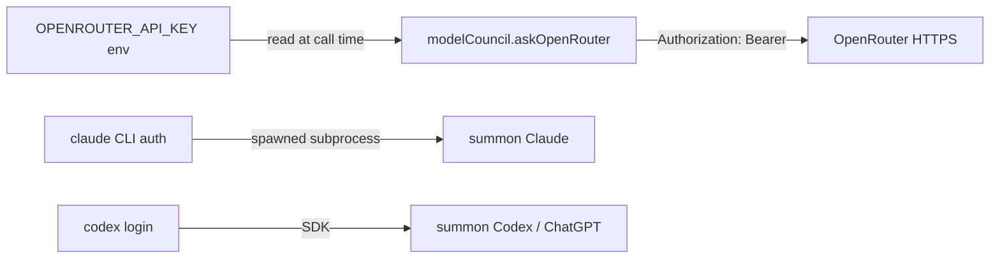

# 6.2 Authentication & Authorization

> **Last Updated:** 2026-05-22
> **Related:** [6.1 Security Architecture](6.1_security_architecture.md) · [4.1 External APIs](../part4_interfaces/4.1_external_apis.md) · [5.3 Environments](../part5_infrastructure/5.3_environments.md)

---

`agents-council` does not implement an authentication system of its own. It **reuses the user's existing local credentials** for summoning and reads an API key from the environment for the Model Council. Authorization is enforced through the read-only summon sandbox and the MCP tool allow-list.

## Authentication: There Is No Council Login

The council itself has no accounts, no tokens, no sessions-in-the-auth-sense. Anyone who can run the binary and write `~/.agents-council/state.json` is fully authorized. This is correct for a single-user, local-first tool — the OS user *is* the identity.

## Reused Credentials by Feature

| Feature | Credential | Source | Setup |
|---------|-----------|--------|-------|
| Core council | none | — | none |
| Summon Claude | Claude Code auth | the `claude` CLI's own auth | run `claude` once to authenticate |
| Summon Codex | Codex auth | the `codex` CLI's own auth | `codex login` |
| Model Council — Kimi/DeepSeek | `OPENROUTER_API_KEY` | environment variable | `export OPENROUTER_API_KEY=...` |
| Model Council — ChatGPT | Codex/OpenAI subscription | local Codex auth | `codex login` |

The system never stores or transmits these credentials itself. For summon, it spawns the already-authenticated CLI; for OpenRouter it reads the env var at call time and sends it as a Bearer header to OpenRouter only.

## Credential Handling

Key properties:
- `OPENROUTER_API_KEY` is read from `process.env` **only when a model-council run executes**; it is never written to `state.json`, `config.json`, or (by default) any log.
- Summon auth is delegated entirely to the underlying CLIs — the council holds no Claude/Codex tokens.
- If `OPENROUTER_API_KEY` is absent, `validateCouncilConfig` throws before any network call, so the key cannot be silently sent empty.

## Authorization: The Tool Allow-List

Authorization is about what a **summoned agent** may do, not about who may call the council.

### Claude summon
A summoned Claude is authorized for exactly:
- the in-process council tools `mcp__council__join_council`, `…get_current_session_data`, `…send_response`;
- the read-only file tools `Read`, `Glob`, `Grep`.

Everything else is denied by `canUseTool`. The user's own Claude Code permission settings (`settingSources: ["user"]`) layer on top, so the user can further restrict but not broaden the council's allow-list for the summon.

### Codex summon
A summoned Codex is authorized only to read and reason: `sandboxMode: "read-only"`, `approvalPolicy: "never"` (no escalation prompts), networking and web search off.

## MCP Tool Exposure

Within an MCP client, all seven council tools are exposed to the connected agent — there is no per-tool authorization inside the council. The agent client's own policy governs whether the agent may call them. Notably, `run_model_council` and `summon_agent` can incur cost / spawn subprocesses, so operators relying on automated agents should be aware these are reachable once the council MCP server is registered.

## Trust Assumptions

| Assumption | Rationale |
|------------|-----------|
| The local user is fully trusted | Single-user local tool; file access = full control |
| Agent names are advisory | No remote multi-tenant scenario where impersonation matters |
| Underlying CLIs guard their own creds | The council never sees Claude/Codex tokens |
| Env vars are an acceptable secret channel | Standard for local dev tooling; no daemon to leak them |

## Recommendations for Operators

- Keep `OPENROUTER_API_KEY` in a local secret manager / shell profile, not in committed files.
- Treat `summon-debug.log` as potentially sensitive (it records prompts and SDK messages) and leave `AGENTS_COUNCIL_SUMMON_DEBUG` unset unless debugging.
- Rely on OS-level home-directory permissions (and ideally full-disk encryption) to protect `state.json`.

---

*Next: [6.3 Data Protection →](6.3_data_protection.md)*
