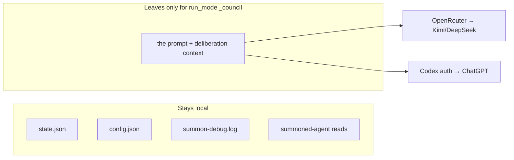

# 6.3 Data Protection

> **Last Updated:** 2026-05-22
> **Related:** [6.1 Security Architecture](6.1_security_architecture.md) · [3.2 Data Lifecycle](../part3_data/3.2_data_lifecycle.md) · [7.5 Disaster Recovery](../part7_operations/7.5_disaster_recovery.md)

---

`agents-council` stores everything locally and transmits nothing except optional Model Council calls. Data protection is therefore mostly about local file handling, what is and isn't persisted, and what leaves the machine.

## What Data Exists

| Data | Location | Sensitivity | Persisted? |
|------|----------|-------------|------------|
| Council requests / feedback / conclusions | `~/.agents-council/state.json` | Potentially sensitive (project discussion) | Yes, indefinitely |
| Participant names + activity markers | `state.json` | Low | Yes |
| Summon model choices, tool paths | `~/.agents-council/config.json` | Low | Yes |
| Cached model lists | `config.json` | None | Yes |
| `OPENROUTER_API_KEY` | environment | Secret | **No** (read at call time only) |
| Claude/Codex credentials | the respective CLIs | Secret | Not by this system |
| Summon prompts + SDK messages | `./summon-debug.log` | Potentially sensitive | Only if debug enabled |

## What Leaves the Machine

- **Core council, summoning, desktop:** nothing leaves the machine.
- **Model Council:** the prompt and intermediate deliberation text are sent to OpenRouter (Kimi/DeepSeek) and through the Codex auth path (ChatGPT). Operators should not feed secrets into `run_model_council` / `council solve`.

## Persistence & Minimization

- **No secrets at rest.** API keys live only in the environment and are used transiently. They are never written to `state.json` or `config.json`.
- **No telemetry.** The system collects and transmits no usage analytics.
- **Opt-in logging only.** The summon debug log is written only when `AGENTS_COUNCIL_SUMMON_DEBUG` is set, and only to the local CWD (`./summon-debug.log`). It can contain prompts and full SDK messages, so it should be treated as sensitive and cleaned up after debugging.

## Data at Rest

State and config are plaintext JSON protected by filesystem permissions in the user's home directory. There is no application-level encryption. Recommended protections:

| Control | Mechanism |
|---------|-----------|
| Confidentiality | OS home-directory permissions + full-disk encryption |
| Integrity | Atomic writes + `assertCouncilStateIntegrity` (prevents corruption, not tampering) |
| Availability | Atomic temp+rename (no torn writes); manual backup of `state.json` |

## Data in Transit

- The only outbound transit is HTTPS to OpenRouter and whatever transport the Codex SDK uses for the ChatGPT path — both TLS-protected by their respective clients.
- Inter-process "transit" is via the shared local file and stdio (MCP) / RPC (desktop), all on-host.

## Retention & Deletion

- **No automatic retention policy.** Sessions, requests, feedback, and conclusions remain until manually removed.
- **Deletion** = editing or removing `state.json`. Removing it resets to an empty council on next access. Removing `config.json` resets summon preferences and the model cache.
- Closed sessions are retained as archives by design; there is no built-in purge command.

## Privacy Posture

`agents-council` is **private by construction**: local-first storage, no accounts, no telemetry, no cloud sync. The only privacy-relevant egress is the deliberately-invoked Model Council. The README states the design intent plainly: *"Private & Local: State is stored on disk at `~/.agents-council/state.json`."*

## Operator Guidance

1. Do not include credentials or PII in council requests if you will run the Model Council on them.
2. Keep `AGENTS_COUNCIL_SUMMON_DEBUG` unset outside of active debugging; delete `summon-debug.log` afterward.
3. Back up `state.json` if council history matters; it is the only copy.
4. Use OS encryption for confidentiality at rest.

---

*Next: [6.4 Compliance & Audit →](6.4_compliance.md)*
