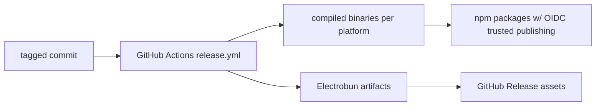

# 6.4 Compliance & Audit

> **Last Updated:** 2026-05-22
> **Related:** [6.3 Data Protection](6.3_data_protection.md) · [7.1 Monitoring](../part7_operations/7.1_monitoring.md) · [Appendix D: Post-Mortems](../appendices/D_postmortems.md)

---

As an experimental, local-first developer tool, `agents-council` carries no formal regulatory compliance obligations of its own. This section documents what audit trail exists, the licensing position, and provenance of releases.

## Licensing

| Item | Value |
|------|-------|
| License | MIT |
| Author | Alex Gavrilescu (`github.com/MrLesk`) |
| Repository | `github.com/MrLesk/agents-council` |
| Distribution | npm (`agents-council` + 5 platform packages), GitHub Releases |

The MIT license permits broad reuse with attribution and no warranty. Dependencies are standard OSS (Bun, Electrobun, the MCP/Claude/Codex SDKs, React, Commander, Zod, Biome) — operators integrating the package should review those licenses for their own compliance needs.

## Audit Trail

There is no dedicated audit subsystem, but several artifacts together form a usable trail:

| Artifact | What it records | Durability |
|----------|-----------------|------------|
| `state.json` | Every request, feedback (with author + timestamp), and conclusion | Permanent until manually removed |
| Participant records | `lastSeen`, `lastRequestSeen`, `lastFeedbackSeen` per agent per session | Permanent |
| `summon-debug.log` | Summon lifecycle events + raw SDK messages | Only when debug enabled |
| Git history (releases) | Tagged versions, the `update-version` auto-commit | Permanent in VCS |

Because every feedback row carries an `author` and `createdAt`, `state.json` is effectively an append-mostly ledger of who said what and when within each council — the closest thing to an audit log the system provides.

## Provenance & Supply Chain

- Releases are built in CI from a tagged commit, not from a developer's machine.
- npm publishing uses **OIDC trusted publishing** (`id-token: write`), establishing build provenance without a long-lived token.
- The dependency tree is pinned by `bun.lock`; CI installs `--frozen-lockfile`.
- Electrobun ships an `update.json` manifest per release for verifiable self-updates.

## Integrity Controls

Though aimed at correctness rather than compliance, these double as integrity safeguards:

- `assertCouncilStateIntegrity` rejects malformed or referentially-inconsistent state on every read and before every write.
- Atomic temp+rename writes prevent partial/corrupt state files.
- The schema `version` field plus forward-only migration keep older files readable and auditable.

## Data-Subject Considerations

The system stores whatever text users put into council requests and responses. There is no PII collection by the system itself, no third-party data sharing (except the deliberate Model Council egress), and deletion is a single-file operation. Operators handling regulated data should:

1. Avoid placing regulated/PII content in councils that will be sent to the Model Council.
2. Apply OS-level access controls and encryption to `~/.agents-council/`.
3. Treat `state.json` as the system of record when responding to deletion requests.

## Compliance Summary

| Concern | Position |
|---------|----------|
| Formal certifications | None (experimental tool) |
| Telemetry / tracking | None |
| Third-party data egress | Only `run_model_council` (OpenRouter + Codex auth) |
| Audit log | `state.json` ledger + optional debug log |
| Build provenance | CI + OIDC trusted publishing + lockfile pin |
| Right-to-deletion | Edit/remove local files |

---

*Next: [Part 7 — 7.1 Monitoring & Observability →](../part7_operations/7.1_monitoring.md)*
