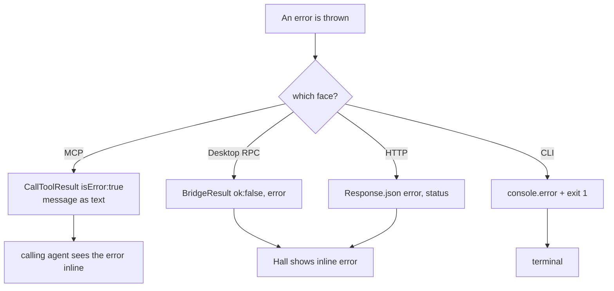

# 7.2 Alerting Configuration

> **Last Updated:** 2026-05-22
> **Related:** [7.1 Monitoring](7.1_monitoring.md) · [9.2 Error Codes](../part9_reference/9.2_error_codes.md) · [2.5 Cross-Cutting Concerns](../part2_architecture/2.5_cross_cutting.md)

---

There is no alerting system — no thresholds, no pagers, no notification rules. For a local interactive tool, "alerting" means **surfacing failures immediately and legibly to the human in front of it**. This section documents how each failure becomes visible.

## Failure-Surfacing by Face



| Face | Failure presentation |
|------|----------------------|
| MCP tool | Result with `isError: true`; the message becomes the agent's tool output |
| Desktop | `BridgeResult.error` → inline error / notice in the Hall (`useCouncil.error`) |
| HTTP | `{ error }` JSON body with the mapped status code |
| CLI | `console.error("<context>: <message>")` then `process.exit(1)` |

The design principle is "**errors are values at the boundary**" — every internal throw is converted to a structured, human-readable result at its transport edge, so nothing fails silently.

## Conditions Worth Watching

These are the situations an operator should treat as actionable signals (the system reports them, but does not page):

| Condition | Symptom | Meaning |
|-----------|---------|---------|
| No active session | `"No active session."` | Summon/send attempted before `start_council` |
| Session closed | `"Council session is closed."` | Posting to a sealed session |
| Summon produced nothing | `"<agent> did not submit/return a response."` | The summoned agent failed to answer |
| Model Council key missing | `"OPENROUTER_API_KEY is required …"` | `run_model_council` without the key |
| Model Council blocked | `consensus.reached=false`, `blockedBy` non-empty | No unanimous ratification — a real disagreement |
| State invalid JSON | `"State file is invalid JSON … Fix or remove the file"` | Corrupted/hand-broken `state.json` |
| Unsupported schema | `"State file contains an unsupported schema."` | A state file neither v1 nor v2 |
| Lock timeout | `"Timed out waiting for file lock"` | A writer held the lock > 10 s |
| Port in use (HTTP face) | `"Port <n> is already in use…"` | Another chat server instance on that port |
| Desktop offline | `connection: "offline"` | The renderer lost its bridge/WS link |

## The "Consensus Blocked" Signal

For `run_model_council`, a *non-error* but operationally meaningful outcome is a **blocked consensus**. The result reports it explicitly:

```text
"The model council did not reach consensus."
Accepted by: <names or none>
Blocked by:  <names>
```

This is not a failure of the system — it is the system correctly reporting that the models did not unanimously agree. Operators should read `blockedBy` and the ratification text rather than treating it as an error.

## Cost Awareness as an Alert Concern

`run_model_council` can issue ~18 model calls (3 members × proposal + ≤4 rounds + ratification). There is no built-in cost alarm. Operators automating it should bound how often it runs; the documentation flags it as a deliberate, billable action ([5.3](../part5_infrastructure/5.3_environments.md)).

## What's Absent

| Not present | Alternative |
|-------------|-------------|
| Threshold alerts | Read errors as they surface in the UI/terminal |
| Notification channels (email/Slack) | Roadmap item v0.8 ("agents can summon the user") |
| Anomaly detection | n/a |
| SLA breach paging | n/a (no SLAs — see [7.3](7.3_slos.md)) |

---

*Next: [7.3 SLIs, SLOs, SLAs →](7.3_slos.md)*
