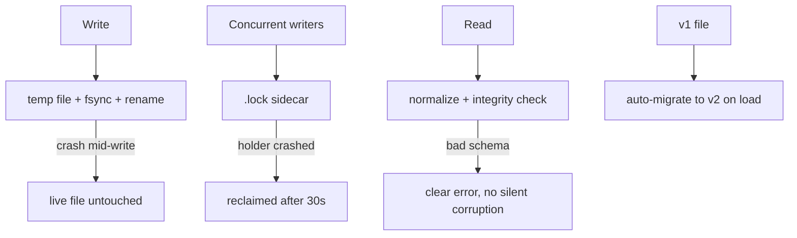

# 7.5 Disaster Recovery

> **Last Updated:** 2026-05-22
> **Related:** [7.4 Runbooks](7.4_runbooks.md) · [3.5 Migrations](../part3_data/3.5_migrations.md) · [3.3 Access Patterns](../part3_data/3.3_access_patterns.md)

---

The entire recoverable state of `agents-council` is two JSON files. Disaster recovery is correspondingly simple: protect, restore, or rebuild those files. There is no server, replica, or cloud backup to coordinate.

## What Must Be Protected

| File | Contains | Loss impact |
|------|----------|-------------|
| `~/.agents-council/state.json` | All councils (sessions, requests, feedback, conclusions) | Council history lost |
| `~/.agents-council/config.json` | Summon preferences + model cache + tool paths | Re-derivable; preferences reset |

`config.json` is effectively disposable — it rebuilds itself from defaults and re-discovers models. **`state.json` is the only irreplaceable artifact.**

## Built-in Resilience

The system already prevents the most common "disasters":



- **Crash during write** never corrupts the live file (atomic rename).
- **Crashed lock holder** self-heals after 30 s.
- **Old schema** auto-migrates ([3.5](../part3_data/3.5_migrations.md)).
- **Malformed file** fails loudly rather than silently, so you know to recover.

## Backup

There is no automatic backup. Recommended manual practice if council history matters:

```bash
# point-in-time copy
cp ~/.agents-council/state.json ~/backups/state.$(date +%Y%m%d-%H%M%S).json

# or version the whole dir
cp -r ~/.agents-council ~/backups/agents-council.$(date +%Y%m%d)
```

Because writes are atomic, copying `state.json` at any moment yields a consistent snapshot (you will get either the pre- or post-write version, never a torn one).

## Recovery Scenarios

### Scenario 1 — Corrupt `state.json` (invalid JSON)
Symptom: `"State file is invalid JSON at <path>. Fix or remove the file and retry."`
1. Preserve it: `mv ~/.agents-council/state.json ~/state.broken.json`.
2. If a backup exists: `cp ~/backups/state.<ts>.json ~/.agents-council/state.json`.
3. Else attempt a hand-fix (it's plaintext JSON) and re-validate with `jq .`.
4. Else start fresh: just retry any operation — a missing file yields a clean v2 state.

### Scenario 2 — Unsupported schema
Symptom: `"State file contains an unsupported schema."`
The file is neither v1 nor v2. Either restore a known-good backup or salvage the recognizable arrays (`sessions`/`requests`/`feedback`/`participants`) into a valid v2 skeleton (see [Appendix B](../appendices/B_schemas.md)).

### Scenario 3 — Integrity violation after edit
Symptom: a specific error like `"Feedback X references unknown request Y"`.
A hand edit broke referential integrity. Fix the dangling reference (add the missing request, or remove the orphan row) and reload. The exact message names the offending id.

### Scenario 4 — Lost `config.json`
No action needed. On next summon the system recreates defaults, re-discovers models, and (for Codex) seeds from `~/.codex/config.toml`. Only saved model/effort/path preferences are lost.

### Scenario 5 — Stuck lock after a crash
Symptom: `"Timed out waiting for file lock"` with no running writer.
Wait 30 s (auto-reclaim) or remove the lock manually (RB-07). Lock files hold no data, so deleting a truly stale one is safe.

### Scenario 6 — Lost binary / broken install
The data is independent of the binary. Reinstall (`npm install -g agents-council@latest`) or re-run via `npx`; your `~/.agents-council/` files are picked up unchanged.

## Recovery Objectives (informal)

| Metric | Value |
|--------|-------|
| RPO (data loss window) | = time since last manual backup (no auto-backup) |
| RTO (restore time) | seconds — copy a file back, or delete to reset |
| Rebuild from scratch | immediate — missing files yield a clean state |

## Recovery Checklist

```text
[ ] Preserve the bad file before any change (mv to *.broken.json)
[ ] Identify the error (invalid JSON / unsupported schema / integrity)
[ ] Prefer restoring a backup of state.json
[ ] If none, hand-fix (plaintext) or remove to reset
[ ] Validate with: jq . ~/.agents-council/state.json
[ ] Retry the failed operation
[ ] config.json: safe to delete; it self-rebuilds
[ ] Establish a backup habit if history matters
```

---

*Next: [Part 8 — 8.1 Local Development Setup →](../part8_development/8.1_local_setup.md)*
