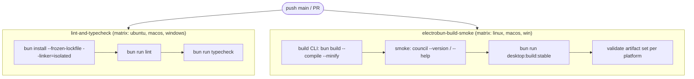
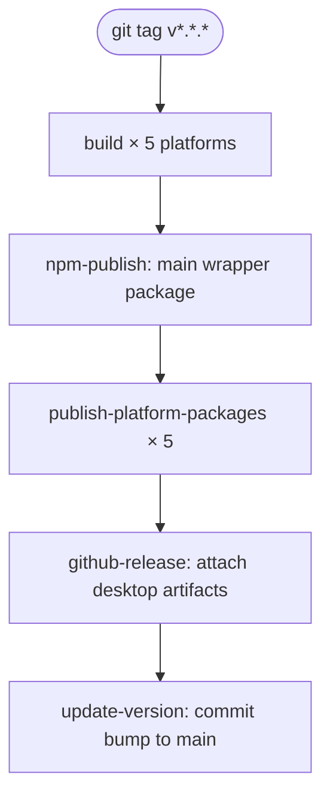

# 8.4 CI/CD Pipeline

> **Last Updated:** 2026-05-22
> **Related:** [5.2 Deployment](../part5_infrastructure/5.2_deployment.md) · [8.3 Testing](8.3_testing.md) · [5.4 Infrastructure as Code](../part5_infrastructure/5.4_iac.md)

---

Two GitHub Actions workflows: **`ci.yml`** validates every push/PR, and **`release.yml`** publishes on a version tag. Both build on all three desktop platforms.

## Continuous Integration — `ci.yml`

**Triggers:** push to `main`, and all pull requests.



### Job 1 — `lint-and-typecheck`
Runs on ubuntu, macOS, and Windows. Installs with a frozen lockfile and isolated linker, then `bun run lint` and `bun run typecheck`. This enforces the Biome + TypeScript gates on every change across all platforms.

### Job 2 — `electrobun-build-smoke`
Per platform (linux/macos/win):
1. Compile the CLI: `bun build src/cli/index.ts --compile --minify --outfile dist/council-test[.exe]`.
2. Smoke-test it: `council-test --version` and `--help`.
3. Build stable Electrobun artifacts (`bun run desktop:build:stable`, `AGENTS_COUNCIL_VERSION=ci-smoke`).
4. **Validate the artifact set** for the platform prefix `stable-<platform>-`: at least one bundle (`*.tar.zst`), an `*update.json`, and the platform installer (`.dmg` / `Setup*.tar.gz` / `Setup*.zip`). A missing artifact fails the job.

> Note: `ci.yml` does not currently run `bun test`. The unit suites are run locally / via the pre-commit gate; CI focuses on cross-platform lint, typecheck, and buildability. (See [Appendix E](../appendices/E_tech_debt.md).)

## Pre-Commit Gate

Husky + lint-staged run Biome on staged files before each commit (`.husky/pre-commit`):

```jsonc
// package.json "lint-staged"
"package.json": ["biome check --write --files-ignore-unknown=true"],
"*.json":       ["biome check --write --files-ignore-unknown=true"],
"src/**/*.{ts,js}": ["biome check --write --files-ignore-unknown=true"]
```

Hooks install automatically during `bun install` (the `prepare: husky` script).

## Release / CD — `release.yml`

**Trigger:** push of a `v*.*.*` tag. Permissions include `contents: write` (releases) and `id-token: write` (npm OIDC trusted publishing).



| Job | Does |
|-----|------|
| `build` (×5) | Sync version from tag → compile CLI (with `__COUNCIL_VERSION__`) → smoke → Electrobun build → upload `release-<package>` |
| `npm-publish` | Publish `agents-council` with `optionalDependencies` on the 5 platform packages |
| `publish-platform-packages` (×5) | Assemble per-platform pkg (binary + desktop artifacts) → `npm publish --access public` via OIDC |
| `github-release` | Create the release and upload installers/bundles/`update.json` |
| `update-version` | Commit the bumped `package.json` back to `main` (`[skip ci]`) |

Platform matrix matches CI: linux-x64 (ubuntu-latest), linux-arm64 (ubuntu-24.04-arm), darwin-x64 (macos-13), darwin-arm64 (macos-14), windows-x64 (windows-latest).

The release flow also runs **install-sanity** on macOS/Windows/Linux for `--version`, `--help`, and `mcp` (per `DEVELOPMENT.md`).

## Release Sequencing Gate

Per `DEVELOPMENT.md`, a documented human gate exists: *do not cut a public release tag until the canonical desktop UI integration task is merged and validated.* This is process, not automation.

## Caching

Both workflows cache `~/.bun/install/cache` keyed by OS + `bun.lock` hash, so dependency installs are fast and reproducible.

## Local Parity

To reproduce CI locally before pushing:

```bash
bun install --frozen-lockfile
bun run lint
bun run typecheck
bun test
bun run build && ./dist/council --version && ./dist/council --help
bun run desktop:build:stable   # then inspect ./artifacts
```

---

*Next: [8.5 Contributing Guide →](8.5_contributing.md)*
