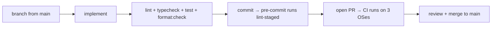

# 8.5 Contributing Guide

> **Last Updated:** 2026-05-22
> **Related:** [8.1 Local Setup](8.1_local_setup.md) · [8.2 Code Conventions](8.2_code_conventions.md) · [9.5 Contacts](../part9_reference/9.5_contacts.md)

---

How to contribute to `agents-council`. The project is MIT-licensed and developed on GitHub by Alex Gavrilescu (`github.com/MrLesk`), using a Backlog.md-driven task workflow.

## Before You Start

1. Read [8.1 Local Setup](8.1_local_setup.md) and get `bun install` + `bun run cli mcp` working.
2. Skim [2.x Architecture](../part2_architecture/2.1_high_level_architecture.md) to understand the core/interfaces/cli layering — **all dependencies point inward toward `core`.**
3. Internalize the simplicity-first rules in [8.2](8.2_code_conventions.md): one implementation per concern, minimal APIs, no premature layers.

## The Backlog Workflow

Development is tracked with **Backlog.md** (an MCP task manager) under `backlog/`:

```
backlog/
├── milestones/   # m-0 council v1 … m-4 electrobun pivot
└── tasks/        # task-1 … task-26.x (hierarchical: task-N.M are sub-tasks)
```

`CLAUDE.md`/`AGENTS.md` instruct contributing agents to **read `backlog://workflow/overview` (or call `backlog.get_workflow_overview()`) before creating tasks**, to search existing tasks first to avoid duplicates, and to follow the create → execute → complete lifecycle. New work should map to (or create) a backlog task.

## Making a Change



1. **Branch** from `main`.
2. **Implement** following the conventions; keep changes minimal and reuse shared helpers (`actions`, `mapper`, `fileStore`).
3. **Verify locally** (the same gates CI enforces):
   ```bash
   bun run lint
   bun run typecheck
   bun run format:check
   bun test
   ```
4. **Commit.** Husky's pre-commit auto-runs Biome on staged files.
5. **Open a PR.** CI runs lint + typecheck on ubuntu/macOS/Windows and an Electrobun build-smoke on all three.

## Adding Functionality — Where Things Go

| Adding… | Touch… |
|---------|--------|
| A new domain operation | `core/services/council/index.ts` (+ `types.ts`), then expose via `mcp/server.ts` and/or `bridge/actions.ts` |
| A new MCP tool | `mcp/server.ts` (Zod schema + handler + formatter), DTOs in `dtos/types.ts`, mapping in `mapper.ts` |
| A new bridge/UI action | `bridge/actions.ts` + `bridge/contract.ts`, HTTP route in `chat/server.ts`, RPC handler in `desktop/bun/index.ts`, UI in `chat/ui/` |
| A new summonable agent | `summon.ts` (`SUPPORTED_SUMMON_AGENTS`, a runner, discovery), config in `summonSettings.ts` |
| A state-schema change | bump `DEFAULT_STATE_VERSION`, add a migrator in `fileStateStore.ts`, extend integrity checks, add migration tests |

When you add an operation, **wire it through both faces and reuse the shared mapper/actions** rather than duplicating logic.

## Testing Expectations

- Add co-located `*.test.ts` for new domain/persistence/mapper/action logic.
- Use an isolated temp state path; clean up in `afterEach`.
- For prompt/protocol logic (e.g. Model Council), test the pure builders.
- See [8.3 Testing](8.3_testing.md).

## Documentation

- Update `README.md` for user-facing features and the roadmap.
- Update `docs/council.md` for CLI/MCP contract changes.
- Keep `electrobun.config.ts` / packaging docs current for desktop changes.
- For changes that affect routing, gates, or safety rules, update `CLAUDE.md`/`AGENTS.md`.

## Release Discipline

- Releases are tag-driven (`v*.*.*`) via `release.yml`; do not hand-publish.
- Respect the documented sequencing gate (canonical desktop UI integration merged before a public tag).
- Version is single-sourced from the git tag.

## Style Reminders

- 2-space indent, 120-col lines, Biome recommended (auto-enforced).
- Strict TypeScript; keep domain (camelCase) and wire (snake_case) types separate.
- Errors: throw internally, convert to structured results at transport boundaries.
- Comments explain *why*, sparingly.

## Communication

- Issues / PRs: `github.com/MrLesk/agents-council`.
- The project is **experimental** — propose larger changes via an issue or backlog task before a big PR.

---

*Next: [Part 9 — 9.1 Configuration Reference →](../part9_reference/9.1_config_reference.md)*
