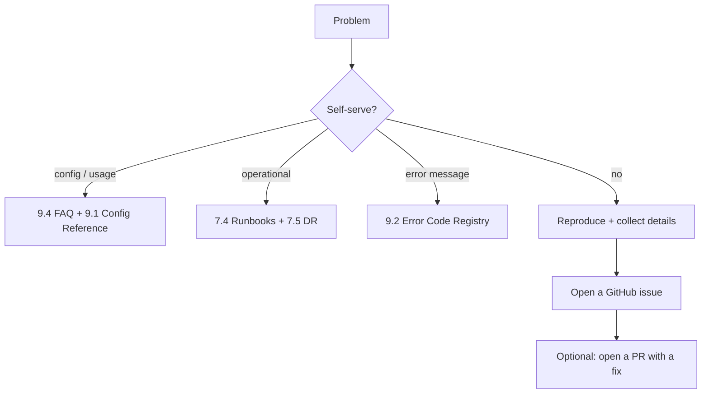

# 9.5 Key Contacts & Escalation

> **Last Updated:** 2026-05-22
> **Related:** [8.5 Contributing](../part8_development/8.5_contributing.md) · [9.4 FAQ](9.4_faq.md) · [Appendix D: Post-Mortems](../appendices/D_postmortems.md)

---

`agents-council` is an open-source project maintained on GitHub. There is no commercial support tier; "escalation" means filing an issue and consulting the documentation.

## Project Contacts

| Role | Contact |
|------|---------|
| Author / maintainer | Alex Gavrilescu — `github.com/MrLesk` |
| Repository | `https://github.com/MrLesk/agents-council` |
| Issues | `https://github.com/MrLesk/agents-council/issues` |
| Homepage | `https://github.com/MrLesk/agents-council` |
| Package | `agents-council` on npm |
| License | MIT |

## Escalation Path



1. **Self-serve first.** Most problems are answered by [9.4 FAQ](9.4_faq.md), [9.2 Error Codes](9.2_error_codes.md), and [7.4 Runbooks](../part7_operations/7.4_runbooks.md).
2. **Collect details** for anything novel (see checklist below).
3. **File a GitHub issue** with those details.
4. **Contribute a fix** via PR if you can ([8.5 Contributing](../part8_development/8.5_contributing.md)).

## What to Include in a Bug Report

```text
[ ] agents-council version (council --version)
[ ] Platform + arch (macOS/Linux/Windows, arm64/x64)
[ ] Bun version (bun --version), Node version if relevant
[ ] How it was invoked (council mcp / desktop / council solve / which MCP client)
[ ] Exact error message (verbatim)
[ ] Steps to reproduce
[ ] Relevant excerpt of ~/.agents-council/state.json (redact sensitive content)
[ ] If a summon issue: ./summon-debug.log with AGENTS_COUNCIL_SUMMON_DEBUG=1 (redact secrets)
[ ] For Model Council: whether OPENROUTER_API_KEY / codex login are configured
```

> ⚠️ Redact secrets and sensitive council content before sharing logs or state. Never paste `OPENROUTER_API_KEY` or auth tokens into an issue.

## Triage Guidance by Area

| Symptom area | First reference |
|--------------|-----------------|
| Can't register/connect MCP | [7.4 RB-01](../part7_operations/7.4_runbooks.md), client's MCP docs |
| Desktop won't launch | [7.4 RB-08](../part7_operations/7.4_runbooks.md) |
| State corrupt / unreadable | [7.5 Disaster Recovery](../part7_operations/7.5_disaster_recovery.md) |
| Summon fails | [7.4 RB-04](../part7_operations/7.4_runbooks.md) + summon debug log |
| Model Council errors / blocked | [9.2](9.2_error_codes.md), [7.2 Alerting](../part7_operations/7.2_alerting.md) |
| Lock timeout | [7.4 RB-07](../part7_operations/7.4_runbooks.md) |
| Build/release | [8.4 CI/CD](../part8_development/8.4_cicd.md) |

## Project Status & Expectations

`agents-council` is **experimental** and community-maintained. Response times for issues depend on maintainer availability; there is no SLA. Larger feature proposals are best raised as an issue (or backlog task) before a big PR, given the project's simplicity-first design rules.

## Documentation Map

| Need | Go to |
|------|-------|
| What it is / why | [Part 1](../part1_understanding/1.1_system_overview.md) |
| How it's built | [Part 2](../part2_architecture/2.1_high_level_architecture.md) |
| Data & state | [Part 3](../part3_data/3.1_data_model.md) |
| APIs / tools / UI | [Part 4](../part4_interfaces/4.1_external_apis.md) |
| Install / deploy / config | [Part 5](../part5_infrastructure/5.1_infra_architecture.md) |
| Security | [Part 6](../part6_security/6.1_security_architecture.md) |
| Operating it | [Part 7](../part7_operations/7.1_monitoring.md) |
| Contributing | [Part 8](../part8_development/8.1_local_setup.md) |
| Quick reference | [Part 9](9.1_config_reference.md) |
| Diagrams / schemas | [Appendices](../appendices/A_diagrams.md) |

---

*End of Part 9. See the [Appendices →](../appendices/A_diagrams.md) for diagrams, schemas, and registries.*
